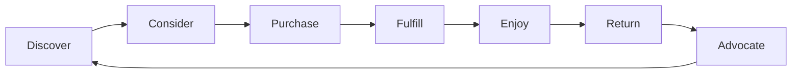

# AgainERP — AI Storefront Experience

> **Status:** Vision (Foundational)  
> **Version:** 1.0  
> **Date:** 2026-06-14  
> **Document Type:** Storefront UX Design Specification  
> **Audience:** Product, design, engineering, AI agents  
> **Parent:** [01_AI_COMMERCE_OS_VISION.md](./01_AI_COMMERCE_OS_VISION.md)  
> **Related:** [02_AI_USER_EXPERIENCE.md](./02_AI_USER_EXPERIENCE.md) · [03_AI_ADMIN_EXPERIENCE.md](./03_AI_ADMIN_EXPERIENCE.md)  
> **Technical baseline:** [ECOMMERCE_STOREFRONT_ARCHITECTURE.md](../docs/modules/ecommerce/ECOMMERCE_STOREFRONT_ARCHITECTURE.md)

**A traditional storefront shows the same page to everyone.**  
**An AI-native storefront adapts to every visitor — intent, context, and journey.**

---

## Design Thesis

The AgainERP storefront is not a static catalog website. It is an **adaptive commerce surface** that reshapes itself based on who is visiting, what they are trying to do, and what the business knows will convert.

| Static storefront | AI-native storefront |
|-------------------|----------------------|
| One homepage for all visitors | Dynamic home — sections reorder by intent |
| Keyword search only | Natural language + semantic discovery |
| Manual merchandising | AI rails, bundles, and upsells in real time |
| Same PDP for everyone | Contextual summaries, specs emphasis, social proof |
| Fixed checkout funnel | Optimized steps per device, cart, and risk |
| Loyalty as points counter | AI-driven rewards, tiers, and win-back |

The storefront **learns** from catalog structure, inventory, campaigns, reviews, and visitor signals — without sacrificing SEO, performance, or merchant control.

### Adaptation principles

| Principle | Rule |
|-----------|------|
| **SSR-first** | Personalization enriches server-rendered shells — not blank client-only pages |
| **Graceful default** | Cold visitors get high-quality static fallbacks; warmth increases with signals |
| **Merchant override** | AI suggests layout; merchant can pin, exclude, or lock sections |
| **Privacy by design** | Personalization respects consent, opt-out, and data minimization |
| **No dark patterns** | AI optimizes conversion — never manipulates price, urgency, or stock truth |
| **Inventory truth** | Availability always from Inventory API — AI never invents stock |
| **Performance budget** | AI features lazy-load below fold; Core Web Vitals targets preserved |

### Storefront AI boundary

Customer-facing AI is **read-and-assist** — not autonomous admin. It can search, recommend, explain, and guide checkout. It cannot change prices, publish products, or process payments without explicit user action.

All calls via `/api/v1/storefront/ai/*` — rate limited, tenant-scoped, feature-flagged per store plan.

---

## 1. AI Personalization

**AI Personalization** tailors the storefront experience to each visitor segment and session — automatically, without manual A/B page builds for every cohort.

### Personalization signals

| Signal | Source | Use |
|--------|--------|-----|
| **Session behavior** | Page views, dwell, scroll depth | Intent classification |
| **Search history** | Queries this session + recent | Query refinement, rails |
| **Cart & wishlist** | Client + authenticated API | Cross-sell, urgency context |
| **Purchase history** | Logged-in orders | Reorder, category affinity |
| **Location** | Geo IP / saved address | Shipping ETA, regional promos |
| **Device** | Mobile / desktop | Layout density, checkout path |
| **Campaign entry** | UTM, referral | Landing hero, offer strip |
| **CRM segment** | Marketing segments | VIP treatment, exclusive deals |
| **Time context** | Hour, day, season, holidays | Eid/Diwali collections, flash timing |

### Personalization layers

```
Layer 0 — Anonymous cold start     → Best sellers, top categories, store defaults
Layer 1 — Session warm             → Category affinity, recently viewed rail
Layer 2 — Authenticated            → Order history, loyalty tier, saved prefs
Layer 3 — Segment-enriched         → CRM tags, CLV band, churn risk treatment
```

### What adapts automatically

| Surface | Adaptation |
|---------|------------|
| Homepage section order | Gaming fan sees consoles first; parent sees kids tablets |
| Hero banner | Campaign UTM → matching offer hero |
| Category chips | Reordered by affinity |
| Product card badges | "Back in stock", "You viewed", "For your laptop" |
| Sort default | Best selling vs personalized relevance |
| Promo strip | Eligible coupons surfaced inline |
| Language | Bangla/English preference |

### Visitor modes

| Mode | Experience |
|------|------------|
| **Guest** | Session-local personalization; cookie consent gated |
| **Logged in** | Persistent profile; cross-device sync |
| **Opted out** | `personalization=0` cookie → Layer 0 only |

### Merchant controls

```
Store Settings → Storefront AI → Personalization
├── Enable/disable globally
├── Lock sections (hero, legal, brand story)
├── Minimum stock for recommendations
├── Excluded categories (e.g., adult, clearance)
└── Segment overrides (VIP always sees free shipping banner)
```

---

## 2. AI Search

**AI Search** replaces keyword-only search with **intent-aware discovery** — visitors describe what they want; the storefront finds it.

### Search modes

| Mode | Input | Behavior |
|------|-------|----------|
| **Instant** | Partial keyword | Autocomplete products, categories, brands |
| **Keyword** | Full query | Traditional index + typo tolerance |
| **Natural language** | "Lightweight laptop under 80k for students" | AI parses → filters + ranked results |
| **Semantic** | "Something like iPhone but cheaper" | Embedding similarity + filters |
| **Visual** (future) | Image upload | Visual similarity search |
| **Voice** (future) | Mic input | Transcribe → NL parse |

### NL search flow

```
User: "Wireless earbuds with long battery under 3000"

Storefront:
  Interpreted as:
  [Category: Audio] [Type: Earbuds] [Wireless] [Price ≤ ৳3,000]

  24 results · Sort: relevance
  [Adjust filters]
```

### Search overlay (CMDK)

```
┌─────────────────────────────────────────────────────────────┐
│  🔍  Search products, brands, or describe what you need…    │
├─────────────────────────────────────────────────────────────┤
│  Recent: gaming laptop · iphone case                        │
│  Popular: best sellers · new arrivals · deals               │
│                                                             │
│  Results (live)                                             │
│  ├─ Products (12)                                           │
│  ├─ Categories (2)                                          │
│  └─ Brands (1)                                              │
│                                                             │
│  💡 Try: "Gift for 10 year old under 5000 taka"             │
└─────────────────────────────────────────────────────────────┘
```

### Search quality rules

| Rule | Detail |
|------|--------|
| **Transparent parsing** | Show interpreted chips; user can remove |
| **Fallback** | NL parse fails → keyword search, no dead end |
| **No price manipulation** | AI does not hide cheaper alternatives |
| **In-stock boost** | Optional merchant setting — default on |
| **Attribute-aware** | Uses `is_searchable` + `ai_searchable` spec fields |
| **Bangla support** | Queries in Bangla map to catalog terms |

### Search analytics (merchant-facing)

- NL success rate
- Zero-result queries → catalog gap suggestions to admin
- Click-through by query type

---

## 3. AI Shopping Assistant

The **AI Shopping Assistant** is the storefront's conversational guide — a floating, context-aware helper for discovery, comparison, and purchase decisions.

### Access points

| Entry | Location |
|-------|----------|
| **Floating button** | Bottom-right (mobile: above nav bar) |
| **Header** | "Ask AI" link |
| **PDP** | "Ask about this product" |
| **Empty search** | "Can't find it? Ask our assistant" |
| **Cart** | "Need help completing your order?" |

### Assistant capabilities

| Capability | Example |
|------------|---------|
| **Product discovery** | "Best phone camera under 40k?" |
| **Comparison** | "Compare these two laptops" |
| **Fit guidance** | "Will this case fit iPhone 15?" |
| **Spec explanation** | "What does 120Hz mean?" |
| **Policy FAQ** | "Return policy for electronics?" |
| **Cart assist** | "Add the blue one, size M" |
| **Order status** | "Where is my order #1234?" (authenticated) |
| **Handoff** | Escalate to human support with thread context |

### Assistant UI

```
┌─────────────────────────────────────┐
│  ✨ Shopping Assistant       [─][×] │
│  Context: Gaming Laptops category   │
├─────────────────────────────────────┤
│  You: Best for Fortnite under 90k?  │
│                                     │
│  Assistant:                         │
│  3 strong options in stock:         │
│  [Product card] [Product card]    │
│  [Product card]                   │
│                                     │
│  Want to compare RAM and GPU?       │
├─────────────────────────────────────┤
│  Suggested:                         │
│  · Compare top 2                    │
│  · Show accessories                 │
├─────────────────────────────────────┤
│  [Ask anything…]              [Send]│
└─────────────────────────────────────┘
```

### Tool scope (storefront-safe)

| Allowed | Blocked |
|---------|---------|
| Search products | Change prices |
| Read public specs/reviews | Access other customers' data |
| Add to cart (with confirm) | Auto-checkout |
| Show shipping estimate | Apply discount without rules |
| Open compare view | Admin operations |

### Safety

- Rate limited per IP / user
- No checkout submission without explicit user tap
- Product cards link to real PDP — no hallucinated SKUs
- "I don't know" + human support link when uncertain

---

## 4. AI Product Discovery

**AI Product Discovery** helps visitors find products when they do not know exact names — browsing paths that adapt to intent.

### Discovery surfaces

| Surface | Behavior |
|---------|----------|
| **Intent landing** | `/discover` or hero CTA — guided questionnaire |
| **Category entry** | "Help me choose" wizard on high-consideration categories |
| **Zero-result recovery** | "We couldn't find X — try these alternatives" |
| **Guided filters** | AI suggests filter chips based on query |
| **Collection generator** | Dynamic "For you" collection page per session |

### Guided discovery flow

```
Step 1: What are you shopping for?
        [Laptop] [Phone] [Gift] [Home appliance]

Step 2: Primary use?
        [Study] [Gaming] [Work] [Travel]

Step 3: Budget range?
        [Under 50k] [50–100k] [100k+]

→ Curated PLP with explanation:
  "Based on study use and 50–100k budget, these 18 laptops
   balance battery life and portability."
```

### Discovery signals fed back to admin

| Signal | Admin value |
|--------|-------------|
| Wizard completion rate | Category merchandising health |
| Budget band distribution | Pricing strategy |
| Drop-off step | Spec profile gaps |
| Alternative acceptance | Catalog coverage |

### Relationship to search

- **Search** = visitor knows (roughly) what they want
- **Discovery** = visitor needs guidance to narrow choices

Both share the same ranking and personalization engine.

---

## 5. AI Dynamic Home Page

The **AI Dynamic Home Page** assembles and orders homepage sections per visitor — while preserving SEO-critical static content for crawlers.

### Section pool

| Section | Default source | AI behavior |
|---------|----------------|-------------|
| Hero | Builder / Marketing | Select variant by campaign, segment, season |
| Category grid | Top categories | Reorder by affinity; hide empty |
| For You rail | Personalization engine | Inject when Layer ≥ 1 |
| Best sellers | Analytics | Always present — anchor for cold start |
| New arrivals | Collection | Boost categories visitor viewed |
| Deals | Marketing | Show eligible deals only |
| Brands | Catalog | Surface brands from search/cart context |
| Reviews | UGC | Category-matched testimonial |
| Blog | Content | Topic affinity |
| Newsletter | Marketing | Delay if already subscribed |

### Rendering strategy

```
┌─────────────────────────────────────────────────────────────┐
│  SSR shell (SEO-safe)                                       │
│  ├── Hero (default variant)                                 │
│  ├── Category grid (store order)                            │
│  └── Best sellers (static)                                  │
├─────────────────────────────────────────────────────────────┤
│  Client hydration (personalized)                            │
│  ├── Reorder sections                                       │
│  ├── Inject "For You" rail                                  │
│  ├── Swap hero variant                                      │
│  └── Hide ineligible deals                                  │
└─────────────────────────────────────────────────────────────┘
```

### Homepage adaptation example

**Visitor A** — arrived from Facebook ad for gaming:

```
1. Hero: Gaming week sale
2. For You: GPUs, keyboards, headsets
3. Best sellers
4. Categories (Gaming pinned first)
5. Deals
```

**Visitor B** — organic, previously bought kids products:

```
1. Hero: Store brand story (default)
2. Categories (Kids, Toys pinned)
3. For You: Back-to-school picks
4. Best sellers
5. Reviews (parent testimonials)
```

### Crawler behavior

- Bots receive **full static default** — no session personalization
- JSON-LD and meta unchanged per URL
- No cloaking — same URL, progressive enhancement for humans

### Merchant preview

Admin: *"Preview homepage as: new visitor / returning / VIP segment"* — uses same engine as live site.

---

## 6. AI Dynamic Product Pages

**AI Dynamic Product Pages (PDP)** adapt content emphasis per visitor while keeping one canonical URL for SEO.

### What adapts on PDP

| Element | Adaptation |
|---------|------------|
| **AI Summary** | Highlights specs visitor cares about (gaming → GPU; parent → durability) |
| **Review summary** | Surfaces relevant review themes ("battery life" vs "camera quality") |
| **Spec emphasis** | Reorder spec groups by category intent |
| **Rails order** | Cross-sell before upsell, or vice versa, by cart context |
| **Bundle suggestion** | "Frequently bought together" ranked by affinity |
| **Shipping callout** | ETA to visitor's detected/saved city |
| **Urgency (truthful)** | Low stock badge only when inventory confirms |
| **Sticky CTA copy** | "Add to cart" vs "Buy now — delivers Thursday" |

### AI Summary block

```
┌─────────────────────────────────────────────────────────────┐
│  ✨ Quick take                                              │
│  • Excellent battery — 11h in reviews                       │
│  • Lightweight (1.2kg) — popular with students              │
│  • Note: No dedicated GPU — not ideal for heavy gaming      │
│  Generated from description + 142 verified reviews          │
└─────────────────────────────────────────────────────────────┘
```

### PDP layout modes

| Mode | When |
|------|------|
| **Standard** | Default SSR layout |
| **Comparison-aware** | Visitor arrived from compare → spec diff highlight |
| **Campaign-aware** | UTM sale → offer badge + countdown if real |
| **Reorder** | Returning buyer → "You bought this 6 months ago" + accessories |

### SEO invariant

- One URL per product slug
- Canonical, schema, meta from Catalog SEO entity
- AI blocks are supplementary content — not separate URLs

---

## 7. AI Recommendations

**AI Recommendations** power product rails across the storefront — ranked by relevance, margin rules, and inventory.

### Recommendation types

| Type | Placement | Logic |
|------|-----------|-------|
| **For You** | Home, account | Session + history embedding |
| **Popular in category** | PLP | Category co-view/co-buy |
| **Similar** | PDP | Attribute + embedding similarity |
| **Frequently bought together** | PDP, cart | Basket analysis |
| **Cross-sell** | Cart, checkout | Cart complement |
| **Up-sell** | PDP | Higher tier same line |
| **Reorder** | Account, home | Consumables / repurchase cycle |
| **Win-back** | Email, push, home | Lapsed buyer favorites |

### Recommendation card

```
┌──────────────────┐
│  [image]         │
│  Product name    │
│  ৳12,500         │
│  ★ 4.6 (89)      │
│  For your cart   │  ← explainable label
└──────────────────┘
```

### Ranking constraints (merchant policy)

| Constraint | Example |
|------------|---------|
| In-stock only | Default on |
| Margin floor | Exclude below 10% margin |
| Excluded SKUs | Clearance, sample |
| Diversity | Not 10 identical phones |
| Freshness | Rotate stale rails daily |

### Explainability

Every rail has a subtle label:

- "Popular in Laptops"
- "Customers also bought"
- "Because you viewed Gaming Mouse"

Hover/tap → one-line explanation. Builds trust.

### Opt-out

`Do not personalize recommendations` in cookie prefs or account settings → generic best sellers.

---

## 8. AI Checkout Optimization

**AI Checkout Optimization** reduces friction and abandonment by adapting the checkout flow to cart, visitor, and risk context.

### Optimization levers

| Lever | Adaptation |
|-------|------------|
| **Step compression** | Known user → skip address entry |
| **Guest vs login** | Suggest login only when rewards/coupons benefit |
| **Shipping pre-select** | Default best ETA/cost for address |
| **Payment method order** | bKash first if mobile + history |
| **Coupon surfacing** | Eligible auto-apply suggestions (user confirms) |
| **Cross-sell timing** | One-click add-on before payment — not after |
| **Error recovery** | Plain-language fix ("CVV too short") |
| **Abandonment save** | Exit intent → assistant or email capture |

### Adaptive checkout paths

```
Guest, 1 item, mobile:
  Email → Address → Payment → Review (4 steps)

Logged in, repeat address, 3 items:
  Review cart → Payment → Confirm (2 steps)

High-value cart, new device:
  + fraud check step
  + OTP verification if policy requires
```

### Checkout assistant (lightweight)

Not full chat — contextual tips:

```
💡 Add ৳200 more for free shipping
💡 You have a 10% coupon — apply?
💡 bKash is fastest for your area
```

### Abandonment intelligence

| Signal | Action |
|--------|--------|
| Exit on payment | Save cart; recovery email in 1h |
| Shipping sticker shock | Suggest pickup point if available |
| Failed payment | Retry guide + alternate method |
| Long dwell | Assistant offer |

### Hard rules

- AI never auto-applies coupon without tap
- AI never stores payment credentials
- Total always matches server calculation — client display is mirror only
- Checkout AI off switch per store for regulated merchants

---

## 9. AI Loyalty System

**AI Loyalty System** turns points-and-tiers into **intelligent relationship management** — rewards that feel personal, not generic.

### Loyalty components

| Component | AI enhancement |
|-----------|----------------|
| **Points balance** | Predict "points to next reward" |
| **Tier status** | Explain how to reach next tier in one action |
| **Rewards catalog** | Rank rewards by purchase history |
| **Earn rules** | Surface contextual earn opportunities |
| **Redemption** | Suggest optimal redemption at checkout |
| **Win-back** | Lapsed tier recovery campaigns |
| **Birthday / anniversary** | Auto-offer with margin guard |

### Account dashboard (AI-enriched)

```
┌─────────────────────────────────────────────────────────────┐
│  Welcome back, Riyad · Gold tier                            │
│  2,450 points · 550 to Platinum                             │
│                                                             │
│  💡 AI Tip: Your usual earbuds brand has a double-points    │
│     weekend. Reorder now to reach Platinum.                 │
│                                                             │
│  Recommended rewards for you:                               │
│  [Free shipping] [৳500 off accessories] [Early sale access] │
└─────────────────────────────────────────────────────────────┘
```

### Loyalty journeys (automated)

| Journey | Trigger | AI action |
|---------|---------|-----------|
| **Onboard** | First purchase | Welcome points + category intro |
| **Grow** | 3rd purchase | Tier progress nudge |
| **Retain** | 60-day idle | Personalized offer within margin rules |
| **Recover** | Tier downgrade risk | Bonus earn window |
| **Celebrate** | Tier upgrade | Exclusive collection unlock |

### Merchant controls

- Margin floor on AI offers
- Max discount auto-suggest
- Excluded categories
- Manual approval for AI-generated loyalty campaigns (admin side)

### Privacy

Loyalty personalization uses authenticated data only — never shared across customers.

---

## 10. AI Customer Journey

**AI Customer Journey** maps the full lifecycle — from first visit to repeat purchase — as an adaptive, measurable system.

### Journey stages



### Stage-by-stage AI role

| Stage | Visitor goal | AI storefront role |
|-------|--------------|-------------------|
| **Discover** | Find what's available | Dynamic home, NL search, assistant |
| **Consider** | Compare and decide | Discovery wizard, compare narrative, review summary |
| **Purchase** | Complete order | Checkout optimization, cart cross-sell |
| **Fulfill** | Track delivery | Proactive ETA updates; assistant order lookup |
| **Enjoy** | Use product | Post-purchase tips email; accessory timing |
| **Return** | Reorder or buy more | Reorder rail, loyalty nudges, win-back |
| **Advocate** | Review, refer | Review request timing; referral offer when NPS high |

### Journey map (example — first-time buyer)

```
Day 0 — Discover
  Organic visit → Dynamic home (cold start)
  NL search: "gift for wife under 5000"
  → Discovery PLP → PDP AI summary → Add to cart

Day 0 — Purchase
  Guest checkout optimized (mobile)
  → Thank you + earn prompt to create account

Day 3 — Enjoy
  Email: care tips for product category

Day 30 — Return
  Logged in → Home "For You" + loyalty tip
  → Reorder accessory suggestion

Day 90 — Advocate
  Review request after confirmed satisfaction
  → Referral code if CRM segment qualifies
```

### Journey signals (unified)

All storefront AI features feed one **customer journey graph**:

```
Views → Searches → Cart adds → Purchases → Returns → Reviews → Loyalty events
```

Admin AI Commerce OS consumes this graph for merchandising and campaigns — storefront and admin share intelligence via APIs, not direct DB.

### Measurement

| Metric | AI impact tracked |
|--------|-------------------|
| Conversion rate | By personalization layer |
| Search success | NL vs keyword |
| Assistant attribution | Assisted purchases |
| Recommendation CTR | Per rail type |
| Checkout completion | By path variant |
| Loyalty lift | AI nudge vs control |
| LTV | Journey cohort analysis |

### Consent and control

| Control | Location |
|---------|----------|
| Cookie consent | Personalization + recommendations |
| Account prefs | Email, push, AI tips |
| Opt-out | Generic experience toggle |
| Data export / delete | Account settings (GDPR-style) |

---

## Storefront Experience Map

```
                         ┌─────────────────────┐
                         │   Visitor arrives   │
                         └──────────┬──────────┘
                                    ▼
              ┌─────────────────────────────────────────┐
              │         AI Personalization Layer         │
              └─────────────────────┬───────────────────┘
                                    │
     ┌──────────────┬───────────────┼───────────────┬──────────────┐
     ▼              ▼               ▼               ▼              ▼
┌─────────┐  ┌─────────────┐  ┌───────────┐  ┌────────────┐  ┌──────────┐
│ Dynamic │  │ AI Search   │  │ Discovery │  │ Assistant  │  │ Recommend│
│ Home    │  │ + Semantic  │  │ Wizard    │  │ Chat       │  │ Rails    │
└────┬────┘  └──────┬──────┘  └─────┬─────┘  └──────┬─────┘  └────┬─────┘
     │              │               │               │             │
     └──────────────┴───────────────┴───────┬───────┴─────────────┘
                                            ▼
                                    ┌──────────────┐
                                    │ Dynamic PDP  │
                                    └──────┬───────┘
                                            ▼
                                    ┌──────────────┐
                                    │ AI Checkout  │
                                    └──────┬───────┘
                                            ▼
                                    ┌──────────────┐
                                    │ AI Loyalty   │
                                    └──────┬───────┘
                                            ▼
                              ┌─────────────────────────┐
                              │  AI Customer Journey     │
                              │  (measure + improve)     │
                              └─────────────────────────┘
```

---

## Implementation Phases

| Phase | Features | Storefront impact |
|-------|----------|-------------------|
| **P0** | AI search (NL), recommendations (basic), review summary | Search overlay, PDP block, home rail |
| **P1** | Shopping assistant, dynamic home reorder, checkout tips | Floating chat, section injection |
| **P2** | Discovery wizard, loyalty AI tips, journey analytics | `/discover`, account dashboard |
| **P3** | Full personalization layers, visual search, autonomous journeys | Segment-aware everything |

### Prototype alignment

Current AgainShop prototype (`apps/web/(storefront)/`) implements static home, keyword search, and mock catalog. AI storefront features layer onto existing components:

| Component | AI upgrade |
|-----------|------------|
| `LiveSearch` | NL parse chips |
| `product-detail-view` | AI Summary block |
| Home sections | `ai-product-rail` + dynamic ordering |
| `CheckoutView` | Optimization tips strip |
| `AccountShell` | Loyalty AI tips |

---

## UX Anti-Patterns

| Do not | Do instead |
|--------|------------|
| Fake urgency ("Only 1 left!" when false) | Real inventory-backed badges |
| Hide cheaper alternatives | Transparent ranking |
| Personalization without consent | Layer 0 until consent |
| Separate URLs per visitor (cloaking) | Same URL, client enhancement |
| AI checkout without confirmation | Explicit user tap on pay |
| Generic chatbot FAQ only | Actionable assistant with product cards |

---

## Related Documentation

| Document | Relationship |
|----------|--------------|
| [01_AI_COMMERCE_OS_VISION.md](./01_AI_COMMERCE_OS_VISION.md) | Platform vision |
| [03_AI_ADMIN_EXPERIENCE.md](./03_AI_ADMIN_EXPERIENCE.md) | Merchant-side AI (merchandising commands feed storefront) |
| [ECOMMERCE_STOREFRONT_ARCHITECTURE.md](../docs/modules/ecommerce/ECOMMERCE_STOREFRONT_ARCHITECTURE.md) | Technical storefront §10–§11 |
| [IMPLEMENTED_DESIGN.md](../docs/ui-prototype/storefront/IMPLEMENTED_DESIGN.md) | Current prototype as-built |
| [global-search.md](../docs/ui-ux/global-search.md) | Search UX standards |

---

## Change History

| Date | Version | Change |
|------|---------|--------|
| 2026-06-14 | 1.0 | Initial AI Storefront Experience specification |
