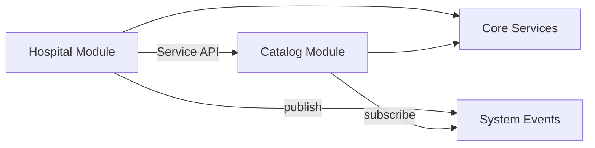

# AgainERP — Universal Module Framework

> **Status:** Draft  
> **Version:** 1.0  
> **Governance:** [GOVERNANCE.md](GOVERNANCE.md) · [DEVELOPMENT_STANDARDS.md](standards/DEVELOPMENT_STANDARDS.md)  
> **Common rules:** [PROJECT_COMMON_RULES.md](PROJECT_COMMON_RULES.md)  
> **Related:** [MASTER_MODULE_ARCHITECTURE.md](../01-architecture/MASTER_MODULE_ARCHITECTURE.md) · [SAAS_PLATFORM_ARCHITECTURE.md](../01-architecture/SAAS_PLATFORM_ARCHITECTURE.md)

## Purpose
Universal module framework — install model, boundaries, integration.

## When To Read
Read when designing a new installable module or module manifest.

## Related Files
- [File package](MODULE_STRUCTURE.md)

## Read Next
- [Architecture template](../STANDARD_MODULE_TEMPLATE.md)

---

**No code. No migrations.**  
Canonical framework for building **unlimited industry modules** on one platform.

---

## Objective

AgainERP is a **platform**, not a single product. Any industry vertical installs as a **module** on shared Core Services.

| Industry Examples | Table Prefix Example |
|-------------------|----------------------|
| Ecommerce | `catalog_*`, `commerce_*` |
| Hospital | `hospital_*` |
| School | `school_*` |
| Restaurant | `restaurant_*` |
| Hotel | `hotel_*` |
| Real Estate | `realestate_*` |
| NGO | `ngo_*` |
| Courier | `courier_*` |
| Manufacturing | `mfg_*` |
| Diagnostic Center | `diagnostic_*` |
| POS | `pos_*` |
| Marketplace | `marketplace_*` |

**Rule:** New industry = new module folder + new table prefix. **Never** redesign Core or platform architecture.

---

## Core Principles

| # | Principle | Rule |
|---|-----------|------|
| 1 | **Core-first** | Every module builds on Core Services only |
| 2 | **No cross-module DB** | Module A never reads/writes Module B tables |
| 3 | **Service communication** | Cross-domain via Service APIs |
| 4 | **Event-driven** | Async integration via System Events |
| 5 | **API-first** | All UI, mobile, AI use module APIs |
| 6 | **Workflow via Core** | State machines registered in Core Workflow Engine |
| 7 | **Single table owner** | One module owns each table |
| 8 | **Pluggable** | Install · remove · upgrade · independent maintenance |
| 9 | **Documentation-first** | No code without approved docs |
| 10 | **AI-enabled** | Every module ships `AI.md` + tool registration |

---

## Architecture Stack

```
┌─────────────────────────────────────────────────────────────┐
│  Industry Modules (Hospital, School, Ecommerce, …)          │
├─────────────────────────────────────────────────────────────┤
│  ERP Modules (CRM, Accounting, Inventory, …)                │
├─────────────────────────────────────────────────────────────┤
│  AI OS (agents, tools — via services only)                  │
├─────────────────────────────────────────────────────────────┤
│  SaaS Platform (tenants, billing, features)                 │
├─────────────────────────────────────────────────────────────┤
│  CORE SERVICES (mandatory foundation)                       │
└─────────────────────────────────────────────────────────────┘
```

---

## Core Services (Mandatory Foundation)

Every module depends **only** on Core — never on another module's database.

| Service | Provides | Doc |
|---------|----------|-----|
| **Identity** | Users, auth, sessions | [core/entities/users.md](../02-core-platform/entities/users.md) |
| **RBAC** | Roles, permissions, ACL | [core/PERMISSION_SYSTEM_ARCHITECTURE.md](../02-core-platform/PERMISSION_SYSTEM_ARCHITECTURE.md) |
| **Tenant** | Companies, branches | [core/entities/companies.md](../02-core-platform/entities/companies.md) |
| **Parties** | Contacts, addresses | [core/entities/contacts.md](../02-core-platform/entities/contacts.md) |
| **Collaboration** | Activities, comments, notes | [core/entities/activities.md](../02-core-platform/entities/activities.md) |
| **Media** | Files, attachments | [core/entities/media-library.md](../02-core-platform/entities/media-library.md) |
| **Workflow** | State machines | [core/engines/workflow-engine.md](../02-core-platform/engines/workflow-engine.md) |
| **Approval** | Human approval chains | [core/engines/APPROVAL_ENGINE_ARCHITECTURE.md](../02-core-platform/engines/APPROVAL_ENGINE_ARCHITECTURE.md) |
| **Events** | Event bus | [core/engines/EVENT_ARCHITECTURE.md](../02-core-platform/engines/EVENT_ARCHITECTURE.md) |
| **Search** | Global + module search | [core/engines/GLOBAL_SEARCH_ARCHITECTURE.md](../02-core-platform/engines/GLOBAL_SEARCH_ARCHITECTURE.md) |
| **API** | Keys, webhooks, rate limits | [core/API.md](../02-core-platform/API.md) |
| **Audit** | Immutable logs | [database/audit-trail.md](../05-development/database/audit-trail.md) |
| **Settings** | Config hierarchy | [core/entities/settings.md](../02-core-platform/entities/settings.md) |
| **i18n / Money** | Languages, currencies, taxes | [core/entities/localization.md](../02-core-platform/entities/localization.md) |
| **Notifications** | Email, in-app, SMS, push, Slack | [core/engines/NOTIFICATION_ENGINE_ARCHITECTURE.md](../02-core-platform/engines/NOTIFICATION_ENGINE_ARCHITECTURE.md) |
| **Queue / Cache** | Async jobs, Redis | [core/engines/queue-architecture.md](../02-core-platform/engines/queue-architecture.md) |

**Detail:** [framework/CORE_SERVICES.md](../05-development/framework/CORE_SERVICES.md)

---

## Communication Model

Modules **never** access another module's database.

### Allowed Integration

| Method | Use | Example |
|--------|-----|---------|
| **Services** | Synchronous read/write through owning module API | Orders calls `CatalogService.getVariant(id)` |
| **Events** | Async notification after commit | `catalog.product.updated` → Search indexes |
| **APIs** | HTTP/REST cross-module or external | Mobile app → `/api/v1/commerce/orders` |
| **Workflows** | Core engine executes transitions | Hospital admission approval |

### Forbidden

| Forbidden | Why |
|-----------|-----|
| `JOIN hospital_patients ON commerce_orders` | Cross-module DB |
| Direct `INSERT` into another module's table | Ownership violation |
| Shared table without Core owner | Ambiguous ownership |
| Synchronous cross-module DB transaction | Tight coupling |



**Detail:** [framework/COMMUNICATION_CONTRACTS.md](../05-development/framework/COMMUNICATION_CONTRACTS.md)

---

## Module Package Structure

Every module — Ecommerce or Hospital — uses **identical documentation package**:

```
docs/modules/{module-name}/
├── ModuleManifest.md      ← Required — module index & registry
├── Architecture.md        ← Required — boundaries, services, events
├── Database.md              ← Required — owned tables only
├── API.md                   ← Required — endpoints
├── Workflow.md              ← Required — state machines
├── Permissions.md           ← Required — ACL matrix
├── Reports.md               ← Required — reports owned by module
├── AI.md                    ← Required — AI tools, agents, credits
├── CHANGELOG.md             ← Required — module change history
├── UI.md                    ← Recommended — navigation map
├── Development.md           ← Recommended — dev setup
├── Roadmap.md               ← Recommended — phase plan
└── Menus/                   ← One MD per admin screen
```

### Required Files (9)

| File | Purpose |
|------|---------|
| **ModuleManifest.md** | Machine-readable registry: menus, tables, APIs, deps |
| **Architecture.md** | Mission, boundaries, service contracts, events |
| **Database.md** | Table prefix, schema, indexes, ownership |
| **API.md** | REST surface, request/response contracts |
| **Workflow.md** | States, transitions, approvals |
| **Permissions.md** | Permission keys, roles, menu ACL |
| **Reports.md** | Report definitions, exports |
| **AI.md** | Tools, agents, prompts, approval rules |
| **CHANGELOG.md** | Module-level version history |

Templates: [framework/templates/](./05-development/framework/templates/)

---

## ModuleManifest.md

Central registry for install system. Must declare:

```yaml
module:
  id: hospital
  name: Hospital Management
  version: 1.0.0
  layer: industry
  table_prefix: hospital_
  core_version: ">=1.0.0"
  dependencies:
    - core
    - accounting  # service dependency only — not DB
  provides_services:
    - HospitalPatientService
    - HospitalAppointmentService
  subscribes_events:
    - core.contact.updated
  publishes_events:
    - hospital.appointment.created
  features:
    - module.hospital
  ai_tools:
    - hospital.schedule_appointment
```

**Template:** [_MODULE_MANIFEST_TEMPLATE.md](templates/_MODULE_MANIFEST_TEMPLATE.md)

---

## Database Ownership

| Rule | Detail |
|------|--------|
| **Prefix** | `{module}_*` — e.g. `hospital_admissions` |
| **Owner** | Only Hospital module writes `hospital_*` |
| **Core reuse** | Use `contacts` for patients — no `hospital_patients` duplicate if party model fits |
| **Foreign keys** | Only to Core tables or own module tables |
| **Cross-reference** | Store UUID only; resolve via Service API |

**Global conventions:** [database/MASTER_DATABASE_ARCHITECTURE.md](../05-development/database/MASTER_DATABASE_ARCHITECTURE.md)

---

## API Design

| Rule | Value |
|------|-------|
| Base path | `/api/v1/{module}/` |
| Versioning | URL path `v1` |
| Auth | JWT + company scope |
| Pagination | `page`, `per_page`, `meta.total` |
| Errors | Standard error envelope |

Hospital example: `/api/v1/hospital/appointments`

---

## Workflow Registration

Modules register workflows with Core — do not build custom state tables.

```yaml
workflow:
  id: hospital.admission
  model: hospital_admission
  states: [requested, approved, admitted, discharged]
  transitions:
    - from: requested
      to: approved
      permission: hospital.admission.approve
```

---

## AI.md (Required Per Module)

Every module documents AI integration:

| Section | Content |
|---------|---------|
| Tools | Callable tools with risk tier |
| Agents | Domain agent registration |
| Context | What Context Engine receives |
| Events | AI-triggered automations |
| Credits | Per-action credit cost |
| Approvals | High-risk tool list |

**Template:** [framework/templates/AI_TEMPLATE.md](../05-development/framework/templates/AI_TEMPLATE.md)  
**Platform:** [modules/ai/AI_OS_ARCHITECTURE.md](../06-ai/platform/ai/AI_OS_ARCHITECTURE.md)

---

## Module Lifecycle

| Operation | Description |
|-----------|-------------|
| **Install** | Register manifest → migrations → permissions → menus → events |
| **Enable** | Feature flag on for tenant/plan |
| **Disable** | Hide menus; block API; data retained |
| **Upgrade** | Version bump → migration → manifest diff |
| **Uninstall** | Disable → export offer → soft archive → purge policy |

**Detail:** [framework/MODULE_LIFECYCLE.md](../05-development/framework/MODULE_LIFECYCLE.md)

### Install Sequence

```
1. Validate ModuleManifest.md (Ready status)
2. Check dependencies (Core + service deps installed)
3. Run module migrations (own tables only)
4. Register permissions in Core ACL
5. Register menu tree
6. Register workflows
7. Register event subscriptions
8. Register AI tools
9. Register search indexes
10. Emit module.installed event
```

---

## Industry Module Pattern

### Example: Hospital Module

| Concern | Design |
|---------|--------|
| **Patients** | Core `contacts` with `type=patient` |
| **Appointments** | `hospital_appointments` |
| **Billing** | Service call to Accounting — not direct journal writes |
| **Inventory (meds)** | Service call to Inventory module |
| **Events** | `hospital.appointment.created` → Notifications |

### Example: School Module

| Concern | Design |
|---------|--------|
| **Students** | Core `contacts` |
| **Classes** | `school_classes`, `school_enrollments` |
| **Fees** | Events → Accounting module |
| **Ecommerce** | Optional — school store via Catalog service |

### Coexistence

One tenant can install **multiple industry modules**:

```
Tenant: Acme Group
├── Ecommerce (online store)
├── Hospital (clinic division)
└── Accounting (shared)
```

Feature flags per plan control which modules activate.

---

## Dependency Rules

| Type | Allowed | Example |
|------|---------|---------|
| **Core dependency** | Always | All modules |
| **Service dependency** | Yes — declare in manifest | Hospital → AccountingService |
| **Event dependency** | Yes — subscribe only | School → `commerce.order.paid` |
| **Database dependency** | **Never** | — |
| **Circular service** | Avoid — use events | A ↔ B via events |

Update [MODULE_DEPENDENCY_MAP.md](../01-architecture/MODULE_DEPENDENCY_MAP.md) on every new dependency.

---

## Scalability (100+ Modules)

| Rule | Rationale |
|------|-----------|
| Flat `docs/modules/{name}/` | No nested industry groups in repo |
| Unique table prefix per module | Clear ownership |
| Unique permission namespace | `{module}.*` |
| Unique API base path | `/api/v1/{module}/` |
| Manifest-driven install | No manual registration |
| Independent CHANGELOG | Per-module release notes |

---

## New Module Checklist

1. [ ] Create `docs/modules/{name}/` with 9 required files
2. [ ] `ModuleManifest.md` from template — status **Draft**
3. [ ] Define `table_prefix` in Database.md
4. [ ] List Core Services used — no other DB deps
5. [ ] Document published/subscribed events
6. [ ] Document service APIs provided/consumed
7. [ ] AI.md with tools and approval rules
8. [ ] Menus/ for every screen
9. [ ] Register in [roadmap/modules.md](../10-roadmap/plans/modules.md)
10. [ ] Update [MODULE_DEPENDENCY_MAP.md](../01-architecture/MODULE_DEPENDENCY_MAP.md)
11. [ ] Entry in [CHANGELOG.md](./CHANGELOG.md)
12. [ ] Stakeholder approval → **Ready** → install allowed

---

## Industry Module Registry (Planned)

| Module | Prefix | Layer | Status |
|--------|--------|-------|--------|
| Ecommerce | `catalog_*`, `commerce_*` | commerce | Active |
| Hospital | `hospital_*` | industry | Planned |
| School | `school_*` | industry | Planned |
| Restaurant | `restaurant_*` | industry | Planned |
| Hotel | `hotel_*` | industry | Planned |
| Real Estate | `realestate_*` | industry | Planned |
| NGO | `ngo_*` | industry | Planned |
| Courier | `courier_*` | industry | Planned |
| Diagnostic | `diagnostic_*` | industry | Planned |

**Detail:** [framework/INDUSTRY_MODULES.md](../05-development/framework/INDUSTRY_MODULES.md)

---

## Document Map

| Document | Topic |
|----------|-------|
| [framework/CORE_SERVICES.md](../05-development/framework/CORE_SERVICES.md) | Core service catalog |
| [framework/COMMUNICATION_CONTRACTS.md](../05-development/framework/COMMUNICATION_CONTRACTS.md) | Services, events, APIs |
| [framework/MODULE_LIFECYCLE.md](../05-development/framework/MODULE_LIFECYCLE.md) | Install, upgrade, remove |
| [framework/INDUSTRY_MODULES.md](../05-development/framework/INDUSTRY_MODULES.md) | Vertical module catalog |
| [MODULE_STRUCTURE.md](./MODULE_STRUCTURE.md) | Folder standards |
| [MASTER_MODULE_ARCHITECTURE.md](../01-architecture/MASTER_MODULE_ARCHITECTURE.md) | Platform layers |

---

**Platform:** AgainERP  
**Last Updated:** 2026-06-12  
**Maintainer:** Platform Architecture Team
