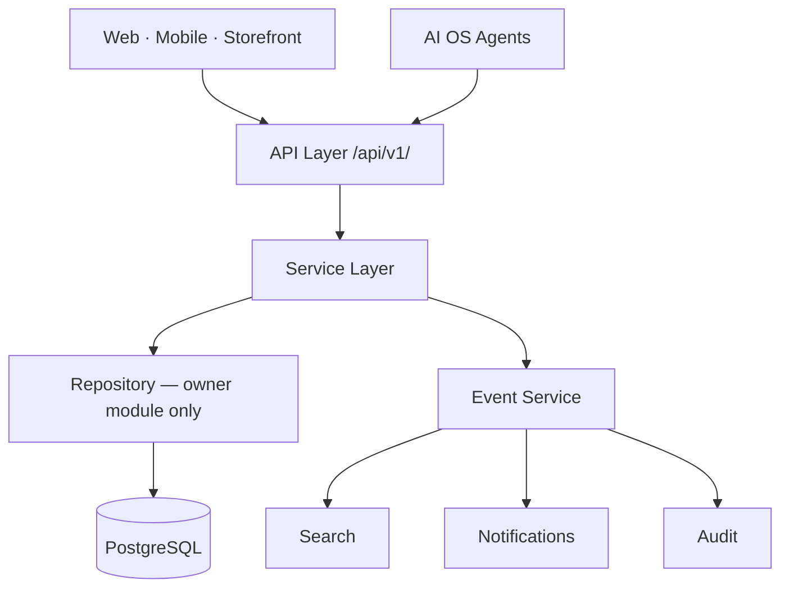
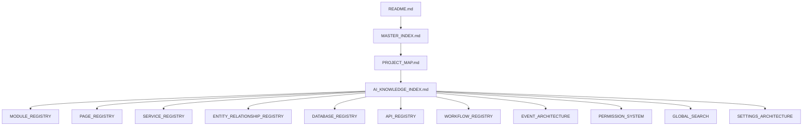

# AgainERP — AI Knowledge Index

> **Status:** Approved  
> **Version:** 2.0  
> **Project:** AgainERP  
> **Document Type:** Enterprise AI Knowledge Map  
> **Phase:** Documentation First  
> **Governance:** [GOVERNANCE.md](../GOVERNANCE.md)

## Purpose
Documentation: AI KNOWLEDGE INDEX.

## When To Read
Read only if your task involves ai knowledge index.

## Related Files
- [Cursor entry](../../BRAIN.md)

## Read Next
- [Doc map](../../PROJECT_MAP.md)

---

**This document teaches AI how AgainERP works.**  
Used by ChatGPT, Claude, Gemini, Cursor, and AgainERP AI OS Agents as the **master knowledge entry point**.

### Step 23 Requirements (Satisfied)

| Requirement | Section |
|-------------|---------|
| Master AI knowledge map | §1 |
| Platform & architecture overview | §2–§3 |
| 10 registry index sections | §4–§13 |
| 11 domain agents with 8 attributes | §14 |
| Governance, security, approval, audit, memory, expansion | §15 |
| Final rule — no direct DB | §16 |

**Read order:** [PROJECT_BRAIN.md](../PROJECT_BRAIN.md) → [README.md](../../README.md) → [MASTER_INDEX.md](../MASTER_INDEX.md) → [PROJECT_MAP.md](../../PROJECT_MAP.md) → **this file** → [ai_os/README.md](../../06-ai/experience/README.md) (UX surfaces) → target registry → module doc.

---

## Executive Summary

| Principle | Rule |
|-----------|------|
| **Documentation-first** | If docs missing → STOP — write docs before code |
| **Registry-driven** | Navigate via registries — never invent modules, APIs, or entities |
| **Service-only data access** | AI reads/writes through Service APIs and Tools |
| **Permission inheritance** | AI acts as the user — never elevated privileges |
| **Human gates** | High-risk actions require Approval Engine |
| **Full audit** | Every tool invocation → `ai_audit_logs` |
| **Tenant scope** | All operations scoped to `company_id` |

---

## 1. Purpose

### Why This Document Exists

AgainERP is a **large modular ERP platform** documented across 500+ files. External AI (ChatGPT, Claude, Gemini, Cursor) and internal AI OS Agents need **one map** to understand:

- What the platform is and how layers connect
- Where to find authoritative registries
- Which agents exist and what they may do
- What is **forbidden** (direct database access, cross-module ORM, silent writes)

Without this index, AI hallucinates endpoints, duplicates entities, or bypasses approval and audit.

### Audience

| Consumer | Use |
|----------|-----|
| **Cursor / IDE agents** | Codegen, doc updates, architecture Q&A |
| **ChatGPT / Claude / Gemini** | External assistants with repo context |
| **Chief AI Agent** | Delegates to domain agents |
| **Domain agents** | Scoped tools + knowledge sources |
| **Human developers** | Onboarding and AI prompt design |

### What AI Must Do Before Acting

```text
1. Read PROJECT_BRAIN.md — repo map, rules, patterns (mandatory)
2. Read README.md — principles and stack
3. Read MASTER_INDEX.md — locate documents
4. Read PROJECT_MAP.md — layers and flows
5. Read AI_KNOWLEDGE_INDEX.md — this file
6. Read TECHNOLOGY_CONSTITUTION.md — mandatory stack (codegen)
7. Read PRE_CODE_GATE.md — stop if docs not Ready
8. Read ai_os/README.md — vision & UX surfaces (admin/storefront AI work)
9. Open target registry (module, page, service, entity, …)
10. Open module ARCHITECTURE.md for task scope
11. Execute via Service / API / Tool — never SQL
```

---

## 2. Platform Overview

**AgainERP** is a **hybrid licensed, modular ERP platform** — ecommerce, CRM, sales, purchase, inventory, marketing, finance, and unlimited industry verticals on shared Core Services.

| Attribute | Value |
|-----------|-------|
| **Architecture** | Domain Driven Design · Service Oriented · Modular Monolith |
| **Deployment** | Self-hosted + SaaS platform tier |
| **Database** | PostgreSQL (OLTP) · Redis · Meilisearch |
| **Frontend** | Next.js admin · mobile-first |
| **Backend** | FastAPI service layer |
| **AI** | AI OS platform service — LangGraph orchestration |
| **Tenancy** | Multi-company · branch · warehouse scope |

### Platform Layers (Top → Bottom)

```text
External AI · Mobile · Storefront · Admin UI
              │
AI OS Layer (agents, tools, audit)
              │
Industry Layer (Hospital, School, Manufacturing, …)
              │
Business Layer (Catalog, Sales, CRM, Finance, …)
              │
Core Layer (Users, Permissions, Workflow, Events, …)
              │
Platform Layer (Tenant, Billing, Feature Flags)
              │
Infrastructure (PostgreSQL, Redis, Object Storage)
```

### Core Principles (AI Must Honor)

| # | Principle |
|---|-----------|
| 1 | **Core-first** — all modules build on Core |
| 2 | **No cross-module DB** — services and events only |
| 3 | **Single entity owner** — one writer per business entity |
| 4 | **API-first** — UI and AI share HTTP/service surface |
| 5 | **Event-driven** — async side effects after COMMIT |
| 6 | **Documentation-first** — no code without approved docs |
| 7 | **AI is platform service** — not a business module |

**Entry docs:** [README.md](../../README.md) · [PRD.md](../PRD.md) · [TECHNOLOGY_CONSTITUTION.md](../TECHNOLOGY_CONSTITUTION.md)

---

## 3. Architecture Overview

### System Map



### Key Architecture Documents

| Topic | Document |
|-------|----------|
| Visual map | [PROJECT_MAP.md](../../PROJECT_MAP.md) |
| Module framework | [UNIVERSAL_MODULE_FRAMEWORK.md](../UNIVERSAL_MODULE_FRAMEWORK.md) |
| Module dependencies | [MODULE_DEPENDENCY_MAP.md](../../01-architecture/MODULE_DEPENDENCY_MAP.md) |
| Communication | [framework/COMMUNICATION_CONTRACTS.md](../../05-development/framework/COMMUNICATION_CONTRACTS.md) |
| Database blueprint | [database/MASTER_DATABASE_ARCHITECTURE.md](../../05-development/database/MASTER_DATABASE_ARCHITECTURE.md) |
| UI shell | [ui-ux/ENTERPRISE_UI_ARCHITECTURE.md](../../04-uiux/standards/ENTERPRISE_UI_ARCHITECTURE.md) |
| AI OS | [modules/ai/AI_OS_ARCHITECTURE.md](../../06-ai/platform/ai/AI_OS_ARCHITECTURE.md) |
| AI OS experience | [ai_os/README.md](../../06-ai/experience/README.md) |

### Integration Channels (AI Uses These)

| Channel | When | AI access |
|---------|------|-----------|
| **Service** | Sync read/write | Tool → `{Domain}Service` method |
| **API** | HTTP clients | Tool → REST per [API_REGISTRY.md](./API_REGISTRY.md) |
| **Event** | Async context | Subscribe read-only; publish via service only |
| **Workflow** | State transition | `WorkflowService.transition` tool |
| **Approval** | Human gate | `ApprovalService` — never self-approve |

---

## 4. Module Registry

**Master list of installable modules** — routes, prefixes, phase, dependencies.

| Registry | [MODULE_REGISTRY.md](./MODULE_REGISTRY.md) |
|----------|---------------------------------------------|
| **Use when** | Locating module folder, table prefix, API base, doc entry |
| **JSON** | [_registries/modules.json](./_registries/modules.json) (if present) |

### Quick Module Index

| Module | Prefix | API Base | Architecture Entry |
|--------|--------|----------|-------------------|
| Core | `users`, `contacts`, … | `/api/v1/core/` | [core/ARCHITECTURE.md](../../02-core-platform/ARCHITECTURE.md) |
| Catalog | `catalog_*` | `/api/v1/catalog/` | [PRODUCT_MASTER_ARCHITECTURE.md](../../02-core-platform/subsystems/PRODUCT_MASTER_ARCHITECTURE.md) |
| Inventory | `inventory_*` | `/api/v1/inventory/` | [INVENTORY_MODULE_ARCHITECTURE.md](../../03-business-modules/inventory/INVENTORY_MODULE_ARCHITECTURE.md) |
| Purchase | `purchase_*` | `/api/v1/purchase/` | [PURCHASE_MODULE_ARCHITECTURE.md](../../03-business-modules/purchase/PURCHASE_MODULE_ARCHITECTURE.md) |
| Sales | `sales_*` | `/api/v1/sales/` | [SALES_MODULE_ARCHITECTURE.md](../../03-business-modules/sales/SALES_MODULE_ARCHITECTURE.md) |
| CRM | `crm_*` | `/api/v1/crm/` | [CRM_MODULE_ARCHITECTURE.md](../../03-business-modules/crm/CRM_MODULE_ARCHITECTURE.md) |
| Marketing | `marketing_*` | `/api/v1/marketing/` | [MARKETING_MODULE_ARCHITECTURE.md](../../03-business-modules/marketing/MARKETING_MODULE_ARCHITECTURE.md) |
| Finance | `finance_*` | `/api/v1/finance/` | [FINANCE_MODULE_ARCHITECTURE.md](../../03-business-modules/finance/FINANCE_MODULE_ARCHITECTURE.md) |
| Ecommerce | `commerce_*` | `/api/v1/commerce/` | [modules/ecommerce/Architecture.md](../../03-business-modules/ecommerce/Architecture.md) |
| AI OS | `ai_*` | `/api/v1/ai/` | [AI_OS_ARCHITECTURE.md](../../06-ai/platform/ai/AI_OS_ARCHITECTURE.md) |

**Rule:** New module → register in MODULE_REGISTRY + MODULE_DEPENDENCY_MAP before AI tools reference it.

---

## 5. Page Registry

**Master list of UI pages** — routes, permissions, linked entities.

| Registry | [PAGE_REGISTRY.md](./PAGE_REGISTRY.md) |
|----------|----------------------------------------|
| **JSON** | [_registries/pages.json](./_registries/pages.json) |
| **UI prototype** | [ui-prototype/README.md](../../04-uiux/prototype/README.md) |
| **Menu tree** | [modules/ecommerce/MENU_STRUCTURE.md](../../03-business-modules/ecommerce/MENU_STRUCTURE.md) |

### AI Use of Page Registry

| Task | Action |
|------|--------|
| Find screen for feature | Search PAGE_REGISTRY by module + keyword |
| Link agent suggestion to UI | Return `page_route` from registry |
| Permission on page | Match page `permission` key — same as API |
| Prototype reference | ui-prototype docs for layout — not production code |

**Scale:** 167+ ecommerce admin pages registered · 147 UI prototype pages.

---

## 6. Service Registry

**Canonical service layer contracts** — how modules integrate in-process.

| Registry | [SERVICE_REGISTRY.md](./SERVICE_REGISTRY.md) |
|----------|-----------------------------------------------|
| **Core catalog** | [framework/CORE_SERVICES.md](../../05-development/framework/CORE_SERVICES.md) |

### Platform Services (AI May Call)

Activity · Notification · Approval · Workflow · Permission · Search · Media · AI · Audit · Settings · Event

### Business Services (AI Tools Call)

Catalog · Inventory · Purchase · Sales · CRM · Marketing · Finance

### AI Service Access Rule

```text
AI Tool → registers against ONE primary service
       → may call Core platform services (Permission, Audit, Approval)
       → NEVER calls another module's repository
```

---

## 7. Entity Registry

**Business entity definitions** — ownership, relationships, lifecycle, AI/approval flags.

| Registry | Purpose |
|----------|---------|
| [ENTITY_RELATIONSHIP_REGISTRY.md](ENTITY_RELATIONSHIP_REGISTRY.md) | Business profiles — Product, Order, Lead, … |
| [DATABASE_REGISTRY.md](DATABASE_REGISTRY.md) | Domain ownership · full entity tables §4–§5 |
| [core/shared-entities.md](../../02-core-platform/shared-entities.md) | Core spine — Contact, User, Media |

### AI Entity Rules

| Rule | Detail |
|------|--------|
| **Customer = Contact** | `contact_type=customer` — no `customers` table |
| **Vendor = Contact** | `contact_type=vendor` |
| **Product spine** | All lines reference Catalog variant |
| **Read schema** | DATABASE_REGISTRY for awareness — **never query** |
| **Write** | Owner service only |

---

## 8. Workflow Registry

**State machines** — states, transitions, guards, events.

| Registry | [WORKFLOW_REGISTRY.md](WORKFLOW_REGISTRY.md) |
|----------|------------------------------------------------|
| **Engine** | [WORKFLOW_ENGINE_ARCHITECTURE.md](../../02-core-platform/engines/WORKFLOW_ENGINE_ARCHITECTURE.md) |

### Key Workflow IDs

| ID | Entity | Module |
|----|--------|--------|
| `catalog.product` | Product publish | Catalog |
| `commerce.order` | Storefront order | Ecommerce |
| `sales.order` | Sales order | Sales |
| `purchase.order` | Purchase order | Purchase |
| `finance.journal_entry` | Journal posting | Finance |
| `crm.lead` | Lead pipeline | CRM |
| `marketing.campaign` | Campaign lifecycle | Marketing |
| `ai.tool_invocation` | AI tool gate | AI OS |

### AI Workflow Rule

AI proposes transitions via tool → `WorkflowService.transition` — **never** UPDATE status column directly.

---
## 9. Approval Registry

**Human approval gates** — policies, steps, thresholds.

| Registry | [APPROVAL_ENGINE_ARCHITECTURE.md](../../02-core-platform/engines/APPROVAL_ENGINE_ARCHITECTURE.md) |
|----------|-----------------------------------------------------------------------------------|
| **AI-specific** | [AI_AUDIT_AND_APPROVAL.md](../../06-ai/platform/ai/AI_AUDIT_AND_APPROVAL.md) |

### Standard Approval Triggers

| Domain | Action | Policy ID (conceptual) |
|--------|--------|----------------------|
| Catalog | Publish product | `catalog.product.publish` |
| Purchase | Approve PO | `purchase.order.approve` |
| Sales | Discount over threshold | `sales.order.discount` |
| Finance | Post journal / payment | `finance.journal.post` |
| Inventory | Post adjustment | `inventory.adjustment.post` |
| AI OS | High-risk tool execute | `ai.tool.execute` |

### AI Approval Rule

Medium/high-risk tools return `pending_approval` — AI **cannot** call `ApprovalService.approve` on its own request.

---

## 10. Event Registry

**Domain events** — naming, publishers, subscribers.

| Registry | [EVENT_ARCHITECTURE.md](../../02-core-platform/engines/EVENT_ARCHITECTURE.md) |
|----------|---------------------------------------------------------------|
| **Module map** | [MODULE_DEPENDENCY_MAP.md](../../01-architecture/MODULE_DEPENDENCY_MAP.md) Appendix B |

### Event Naming

```text
{module}.{entity}.{action}
Examples: catalog.product.published · sales.order.confirmed · finance.invoice.paid
```

### AI Event Rules

| Allowed | Forbidden |
|---------|-----------|
| Subscribe read-only for context | Publish fake events without service |
| Reference event names in explanations | Assume handler side effects are synchronous |
| Idempotent event handlers in docs | Cross-module UPDATE in handler |

---

## 11. Permission Registry

**RBAC keys** — `{module}.{resource}.{action}`.

| Registry | [PERMISSION_SYSTEM_ARCHITECTURE.md](../../02-core-platform/PERMISSION_SYSTEM_ARCHITECTURE.md) |
|----------|-------------------------------------------------------------------------------|
| **Entity matrix** | [ENTITY_RELATIONSHIP_REGISTRY.md](ENTITY_RELATIONSHIP_REGISTRY.md) Appendix B |
| **API mapping** | [API_REGISTRY.md](./API_REGISTRY.md) §6 |

### AI Permission Rules

| Rule | Detail |
|------|--------|
| **Inherit user** | Tool runs with invoking user's permissions |
| **No elevation** | AI never uses admin/service role unless user has it |
| **Field ACL** | Strip `cost_price`, margin from responses |
| **404 obfuscation** | No leak of forbidden record titles |
| **Tool + permission** | `ai.tool.execute` AND domain permission (e.g. `catalog.product.edit`) |

---

## 12. Search Registry

**Universal search** — indexes, ranking, AI query.

| Registry | [GLOBAL_SEARCH_ARCHITECTURE.md](../../02-core-platform/engines/GLOBAL_SEARCH_ARCHITECTURE.md) |
|----------|-------------------------------------------------------------------------------|
| **UI** | [ui-ux/global-search.md](../../04-uiux/standards/global-search.md) |

### Search Domains Indexed

Products · Orders · Customers · Inventory · Purchase · Sales · CRM · Marketing · Finance · Documents · Activities · Users

### AI Search Rules

| Mode | Access |
|------|--------|
| Keyword search | `SearchService.search` — same RBAC as user |
| NL parse | `AISearchService.parseQuery` — requires `ai.search.use` |
| Semantic (future) | Hybrid scores — still permission-filtered |
| **Forbidden** | Direct Meilisearch client from agent |

---

## 13. Settings Registry

**Configuration hierarchy** — company, branch, module.

| Registry | [SETTINGS_ARCHITECTURE.md](../../02-core-platform/subsystems/SETTINGS_ARCHITECTURE.md) |
|----------|---------------------------------------------------------------------|
| **Service** | [SERVICE_REGISTRY.md](./SERVICE_REGISTRY.md) — Settings Service |

### Settings Scope

| Level | Examples |
|-------|----------|
| Platform | Feature flags, plan limits |
| Company | Fiscal year, default currency, SMTP |
| Branch | Local tax, warehouse defaults |
| Module | Catalog defaults, AI model route |

### AI Settings Rules

- Read settings via `SettingsService.get` — never env vars for tenant config
- AI model keys stored encrypted — AI Service resolves internally
- Changing settings requires `core.settings.edit` — audit logged

---

## 14. AI Agent Registry

Domain agents delegate from **Chief AI Agent**. Each agent has scoped tools, knowledge, and governance.

---

### Catalog Agent

| Attribute | Value |
|-----------|-------|
| **Responsibilities** | Product copy, tags, attributes, category suggestions, publish proposals, variant pricing drafts |
| **Allowed Services** | `CatalogService`, `MediaService`, `SearchService` (read), `ActivityService`, `PermissionService`, `AuditService` |
| **Restricted Actions** | Direct publish without approval; set `cost_price`; delete products; cross-module stock writes |
| **Approval Requirements** | **Publish** · bulk price change · archive with active orders |
| **Knowledge Sources** | [PRODUCT_MASTER_ARCHITECTURE.md](../../02-core-platform/subsystems/PRODUCT_MASTER_ARCHITECTURE.md) · [ENTITY_RELATIONSHIP_REGISTRY.md](ENTITY_RELATIONSHIP_REGISTRY.md) · [API_REGISTRY.md](./API_REGISTRY.md) Catalog · [WORKFLOW_REGISTRY.md](WORKFLOW_REGISTRY.md) `catalog.product` |
| **Events** | Consumes: `core.approval.approved` · Produces: via `CatalogService` → `catalog.product.*` |
| **Permissions** | `ai.tool.execute`, `catalog.product.view/edit`, `catalog.product.publish` (proposal only until approved) |

---

### Inventory Agent

| Attribute | Value |
|-----------|-------|
| **Responsibilities** | Stock forecast, reorder suggestions, adjustment proposals, transfer routes, anomaly explanation |
| **Allowed Services** | `InventoryService`, `CatalogService` (read variant), `NotificationService`, `AuditService`, `PermissionService` |
| **Restricted Actions** | Post adjustment without approval; negative stock override; direct warehouse table access |
| **Approval Requirements** | **Stock adjustment post** · large transfer · write-off |
| **Knowledge Sources** | [INVENTORY_MODULE_ARCHITECTURE.md](../../03-business-modules/inventory/INVENTORY_MODULE_ARCHITECTURE.md) · [SERVICE_REGISTRY.md](./SERVICE_REGISTRY.md) Inventory · [MODULE_DEPENDENCY_MAP.md](../../01-architecture/MODULE_DEPENDENCY_MAP.md) |
| **Events** | Consumes: `sales.order.confirmed`, `purchase.receipt.posted` · Produces: `inventory.reorder.suggested` via service |
| **Permissions** | `ai.tool.execute`, `inventory.stock.view`, `inventory.adjustment.create` (propose) |

---

### Purchase Agent

| Attribute | Value |
|-----------|-------|
| **Responsibilities** | RFQ drafts, PO line suggestions, vendor match, 3-way match assist, receipt/bill explain |
| **Allowed Services** | `PurchaseService`, `CatalogService`, `ContactService`, `InventoryService` (read), `AuditService`, `PermissionService` |
| **Restricted Actions** | Approve PO; post bill; create vendor payment; bypass 3-way match |
| **Approval Requirements** | **PO approve/send** · bill post exception · vendor onboarding |
| **Knowledge Sources** | [PURCHASE_MODULE_ARCHITECTURE.md](../../03-business-modules/purchase/PURCHASE_MODULE_ARCHITECTURE.md) · [API_REGISTRY.md](./API_REGISTRY.md) Purchase |
| **Events** | Produces via service: `purchase.order.*`, `purchase.bill.*` |
| **Permissions** | `ai.tool.execute`, `purchase.order.view/create`, `purchase.order.approve` (human only) |

---

### Sales Agent

| Attribute | Value |
|-----------|-------|
| **Responsibilities** | Quote drafts, discount suggestions, upsell, delivery promise, pipeline forecast, follow-up drafts |
| **Allowed Services** | `SalesService`, `CatalogService`, `InventoryService` (availability read), `CRMService`, `ActivityService`, `AuditService`, `PermissionService` |
| **Restricted Actions** | Confirm order without credit check; post invoice; apply discount over policy; reserve stock silently |
| **Approval Requirements** | **Discount threshold** · credit limit · order confirm over amount |
| **Knowledge Sources** | [SALES_MODULE_ARCHITECTURE.md](../../03-business-modules/sales/SALES_MODULE_ARCHITECTURE.md) · [SALES_WORKFLOW.md](../../03-business-modules/sales/SALES_WORKFLOW.md) |
| **Events** | Produces via service: `sales.quotation.sent`, `sales.order.confirmed`, … |
| **Permissions** | `ai.tool.execute`, `sales.order.view/create/edit`, `sales.order.confirm` (gate) |

---

### CRM Agent

| Attribute | Value |
|-----------|-------|
| **Responsibilities** | Lead scoring, churn risk, next-best-action, email drafts, duplicate detection, pipeline commentary |
| **Allowed Services** | `CRMService`, `ContactService`, `ActivityService`, `SalesService` (read history), `AuditService`, `PermissionService` |
| **Restricted Actions** | Convert lead without user confirm; mass export PII; reassign owned records outside policy |
| **Approval Requirements** | Lead assignment rules · bulk export · tier change |
| **Knowledge Sources** | [CRM_MODULE_ARCHITECTURE.md](../../03-business-modules/crm/CRM_MODULE_ARCHITECTURE.md) · [ENTITY_RELATIONSHIP_REGISTRY.md](ENTITY_RELATIONSHIP_REGISTRY.md) Lead/Customer |
| **Events** | Produces: `crm.lead.*`, `crm.opportunity.*` via service |
| **Permissions** | `ai.tool.execute`, `crm.lead.view/edit`, `crm.lead.convert` (confirm) |

---

### Marketing Agent

| Attribute | Value |
|-----------|-------|
| **Responsibilities** | Campaign suggestions, segment rules (NL), content drafts, coupon ideas, ROI narrative, send-time hints |
| **Allowed Services** | `MarketingService`, `CatalogService`, `ContactService`, `NotificationService`, `AuditService`, `PermissionService` |
| **Restricted Actions** | Launch campaign without approval; PII-heavy export; auto-send email without template review |
| **Approval Requirements** | **Campaign launch** · high discount coupon · audience export |
| **Knowledge Sources** | [MARKETING_MODULE_ARCHITECTURE.md](../../03-business-modules/marketing/MARKETING_MODULE_ARCHITECTURE.md) · [API_REGISTRY.md](./API_REGISTRY.md) Marketing |
| **Events** | Produces: `marketing.campaign.*`, `marketing.coupon.*` via service |
| **Permissions** | `ai.tool.execute`, `marketing.campaign.view/create`, `marketing.campaign.launch` (human) |

---

### Finance Agent

| Attribute | Value |
|-----------|-------|
| **Responsibilities** | Journal draft proposals, reconciliation match suggest, collection priority, dunning text, anomaly explain, period-close checklist |
| **Allowed Services** | `FinanceService`, `ContactService`, `AuditService`, `PermissionService`, `ApprovalService` (submit only) |
| **Restricted Actions** | Post journal; post payment; close fiscal period; write-off AR; modify COA structure |
| **Approval Requirements** | **Journal post** · outbound payment · period close · write-off |
| **Knowledge Sources** | [FINANCE_MODULE_ARCHITECTURE.md](../../03-business-modules/finance/FINANCE_MODULE_ARCHITECTURE.md) · [ENTITY_RELATIONSHIP_REGISTRY.md](ENTITY_RELATIONSHIP_REGISTRY.md) Invoice/Payment |
| **Events** | Consumes: `sales.invoice.posted`, `purchase.bill.posted` · Produces: `finance.journal.posted` via service |
| **Permissions** | `ai.tool.execute`, `finance.journal.view/create`, `finance.journal.post` (human/approval) |

---

### SEO Agent

| Attribute | Value |
|-----------|-------|
| **Responsibilities** | Meta titles/descriptions, schema.org JSON-LD, keyword suggestions, content optimization, sitemap/audit reports |
| **Allowed Services** | `CatalogService` (read/update SEO fields), `MediaService` (read), `AuditService`, `PermissionService` |
| **Restricted Actions** | Publish product; change URL slugs in bulk without review; alter live storefront theme |
| **Approval Requirements** | Bulk slug change · schema deploy to production |
| **Knowledge Sources** | [modules/ecommerce/seo/ARCHITECTURE.md](../../03-business-modules/ecommerce/seo/ARCHITECTURE.md) · Catalog architecture §SEO |
| **Events** | Consumes: `catalog.product.published` · Produces: SEO update via `CatalogService` → `catalog.product.updated` |
| **Permissions** | `ai.tool.execute`, `catalog.product.view/edit`, `catalog.seo.manage` |

---

### Support Agent

| Attribute | Value |
|-----------|-------|
| **Responsibilities** | Ticket summarize, KB article suggest, reply drafts, sentiment tag, similar ticket search |
| **Allowed Services** | `SupportService`, `SearchService`, `ActivityService`, `ContactService` (read), `AuditService`, `PermissionService` |
| **Restricted Actions** | Close ticket as resolved without agent; refund; expose internal notes to customer channel |
| **Approval Requirements** | Public reply send (if policy) · escalation to tier 3 |
| **Knowledge Sources** | Helpdesk/Support module docs · [GLOBAL_SEARCH_ARCHITECTURE.md](../../02-core-platform/engines/GLOBAL_SEARCH_ARCHITECTURE.md) |
| **Events** | Consumes: order/product events for context · Produces: support ticket events via service |
| **Permissions** | `ai.tool.execute`, `support.ticket.view`, `support.reply.draft` |

---

### Developer Agent

| Attribute | Value |
|-----------|-------|
| **Responsibilities** | Doc RAG, schema awareness (registry only), code propose, migration plan drafts, API operation lookup, architecture Q&A |
| **Allowed Services** | `AuditService`, `PermissionService`, read-only platform tools — **no business write services by default** |
| **Restricted Actions** | Any production data write; run migrations; modify permissions; bypass PRE_CODE_GATE |
| **Approval Requirements** | Code apply to repo (human merge) · migration execute · manifest change |
| **Knowledge Sources** | **All registries** · [TECHNOLOGY_CONSTITUTION.md](../TECHNOLOGY_CONSTITUTION.md) · [PRE_CODE_GATE.md](../PRE_CODE_GATE.md) · [GOVERNANCE.md](../GOVERNANCE.md) · [_registries/documents.json](./_registries/documents.json) |
| **Events** | None publish · May consume doc webhook events for re-index |
| **Permissions** | `ai.tool.execute`, `ai.developer.read`, `core.audit.view` — no domain write keys |

---

### Analytics Agent

| Attribute | Value |
|-----------|-------|
| **Responsibilities** | KPI narrative, report explanation, forecast commentary, anomaly detection story, dashboard insight |
| **Allowed Services** | Read-only aggregations via module report services · `SearchService` · `AuditService` · `PermissionService` |
| **Restricted Actions** | Raw SQL; export unrestricted PII; modify report definitions in production |
| **Approval Requirements** | Scheduled report email to external domains · cross-company aggregate |
| **Knowledge Sources** | [modules/ecommerce/analytics/ARCHITECTURE.md](../../03-business-modules/ecommerce/analytics/ARCHITECTURE.md) · Finance/Marketing report docs |
| **Events** | Consumes: `sales.order.confirmed`, `finance.invoice.paid`, … for metric context |
| **Permissions** | `ai.tool.execute`, domain `.view` keys per report scope |

---

## 15. AI Governance Framework

### AI Governance Rules

| # | Rule |
|---|------|
| 1 | AI OS is a **platform service** — not owner of business tables |
| 2 | Every agent registered in AI OS with version and tool allow-list |
| 3 | Tools map 1:1 to service methods or API operations in registry |
| 4 | Suggest → Review → Apply — no silent production writes |
| 5 | Company admin enables agents per tenant |
| 6 | Chief Agent delegates — domain agents do not call each other directly |
| 7 | Documentation-first: PRE_CODE_GATE before codegen |
| 8 | Registries are authoritative — do not invent modules, entities, or permissions |

### AI Security Rules

| # | Rule |
|---|------|
| 1 | **Never** direct database access — no SQL, no ORM across modules |
| 2 | **Never** expose secrets, API keys, or full PII in prompts/logs |
| 3 | Tenant isolation — every call scoped to `company_id` |
| 4 | Permission inheritance — same keys as human user |
| 5 | Input sanitization on all tool parameters |
| 6 | Output filtering — field ACL on responses |
| 7 | Rate limits per agent and per company AI credits |
| 8 | No cross-company retrieval in RAG or search |

### AI Approval Rules

| Risk | Examples | Gate |
|------|----------|------|
| **Low** | Description draft, tags, summarize | Auto with audit |
| **Medium** | Campaign draft, forecast apply, segment create | User confirm |
| **High** | Price change, journal post, PO approve, tool chain write | Approval Engine |
| **Critical** | Permission change, bulk delete, payment post | Admin + approval |

Risk matrix detail: [AI_AUDIT_AND_APPROVAL.md](../../06-ai/platform/ai/AI_AUDIT_AND_APPROVAL.md)

### AI Audit Rules

| # | Rule |
|---|------|
| 1 | Every tool invocation → `ai_audit_logs` append-only |
| 2 | Log: user, agent, tool, input hash, output summary, credits, duration |
| 3 | Failed attempts logged — not only success |
| 4 | Approval linkage — `approval_id` on gated tools |
| 5 | Retention per company compliance policy |
| 6 | Audit readable by `core.audit.view` — not deletable |

### AI Memory Rules

| Type | Rule |
|------|------|
| **Session memory** | Conversation context — TTL per session |
| **Agent memory** | `ai_*` tables — never substitute for module data |
| **RAG knowledge** | Platform docs embedded — version tagged |
| **Digital twin** | Read-only aggregate mirror — sync via events |
| **Forbidden** | Storing GL balances, stock qty as "memory" instead of service read |
| **PII** | Minimize; hash/queryable opt-in per GDPR mode |

Detail: [AI_CONTEXT_ENGINE.md](../../06-ai/platform/ai/AI_CONTEXT_ENGINE.md) · [AI_DIGITAL_TWIN.md](../../06-ai/platform/ai/AI_DIGITAL_TWIN.md)

### AI Knowledge Expansion Rules

| When docs change | Action |
|------------------|--------|
| New registry published | Re-ingest RAG chunk; update this index reference |
| New module | MODULE_REGISTRY + agent tool registration |
| New entity | ENTITY_RELATIONSHIP_REGISTRY + DATABASE_REGISTRY |
| New service method | SERVICE_REGISTRY + tool manifest |
| New permission | PERMISSION_SYSTEM + agent guard |
| New workflow | WORKFLOW_REGISTRY + transition tools |

**Pipeline:** doc commit → webhook → chunk → embed → `ai_knowledge_embeddings` · See [AI_OS_ARCHITECTURE.md](../../06-ai/platform/ai/AI_OS_ARCHITECTURE.md) §6

---

## 16. Final Rule

> **AI never accesses the database directly.**

AI must operate through:

| Gate | Purpose |
|------|---------|
| **Services** | All reads and writes via owning `{Domain}Service` |
| **Permissions** | `PermissionService.check` on every operation |
| **Workflows** | State changes via `WorkflowService.transition` |
| **Approvals** | High-risk actions via `ApprovalService` |
| **Audit Logs** | Every mutation and tool call recorded |

```text
❌ SELECT * FROM sales_orders
❌ Product::find(id) from Sales module
❌ db.execute("UPDATE inventory SET qty = …")

✅ SalesService.getOrder(id)
✅ CatalogService.updateProduct(id, dto) — with permission + audit
✅ WorkflowService.transition(instance, 'confirmed')
✅ ApprovalService.submit('sales.order.discount', context)
```

---

## Appendix A — Knowledge Graph



---

## Appendix B — Machine-Readable Index

| File | Format | Use |
|------|--------|-----|
| [_registries/documents.json](./_registries/documents.json) | JSON | All documentation paths |
| [_registries/pages.json](./_registries/pages.json) | JSON | Page routes and permissions |
| [_registries/stats.json](./_registries/stats.json) | JSON | Doc coverage metrics |

---

## Appendix C — External AI Quick Start (Cursor / ChatGPT / Claude / Gemini)

```text
You are working on AgainERP — a modular ERP platform.

1. Read docs/AI_KNOWLEDGE_INDEX.md (this file)
2. Identify module from MODULE_REGISTRY.md
3. Read module ARCHITECTURE.md
4. Check SERVICE_REGISTRY.md + API_REGISTRY.md for integration
5. Never invent endpoints or tables
6. Never access database directly
7. Follow TECHNOLOGY_CONSTITUTION.md for stack
8. Run PRE_CODE_GATE.md checks before code
```

---

## Related Documents

| Document | Role |
|----------|------|
| [PROJECT_BRAIN.md](../PROJECT_BRAIN.md) | **Project Brain** — mandatory first read; repo map, rules, patterns |
| [ai_os/README.md](../../06-ai/experience/README.md) | AI OS vision & experience (admin, storefront, UX) |
| [AI_OS_ARCHITECTURE.md](../../06-ai/platform/ai/AI_OS_ARCHITECTURE.md) | AI platform deep dive |
| [AI_FIRST_ARCHITECTURE.md](../../06-ai/platform/ai/AI_FIRST_ARCHITECTURE.md) | AI-native product principles |
| [MASTER_INDEX.md](../MASTER_INDEX.md) | Full doc navigation |
| [TRACEABILITY_MATRIX.md](../traceability/TRACEABILITY_MATRIX.md) | **Traceability Matrix** — requirements → artifacts (v2.0) |

---

*End of AI Knowledge Index — Step 23*
