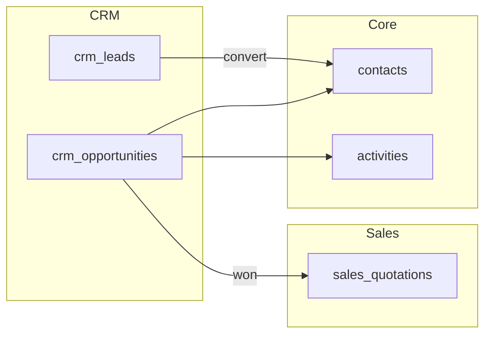

# Architecture — CRM

> **Status:** Superseded  
> **Module:** CRM  
> **Phase:** 5 · Step 46  
> **Document Type:** Architecture  
> **Governance:** [MASTER_DATABASE_ARCHITECTURE.md](../../05-development/database/MASTER_DATABASE_ARCHITECTURE.md) · [MASTER_MODULE_ARCHITECTURE.md](../../01-architecture/MASTER_MODULE_ARCHITECTURE.md)

> **Use instead:** [CRM_MODULE_ARCHITECTURE.md](./CRM_MODULE_ARCHITECTURE.md) — approved enterprise architecture at `/crm/*` (Step 08).

---

## Purpose
CRM module architecture — scope, features, data ownership, and integration boundaries.

## When To Read
Read this file only if working on CRM architecture, features, or module boundaries.

## Related Files
- [Dependencies](../../01-architecture/MODULE_DEPENDENCY_MAP.md)

## Read Next
- [UI build guides](../../04-uiux/prototype/crm/)

---

## Executive Summary

The CRM module manages the pre-sales lifecycle — leads, qualification, pipeline stages, and opportunities — while reusing Core `contacts` as the single party master. CRM does not duplicate customer or person records; it extends Core with pipeline-specific entities under the `crm_*` namespace. Activities, notes, tags, and comments remain Core-owned and are linked polymorphically to leads and opportunities.

| Goal | Target |
|------|--------|
| Lead conversion | Lead → Contact → Opportunity in one workflow |
| Pipeline visibility | Kanban and forecast by stage |
| Activity tracking | Unified timeline via Core `activities` |
| Scale | 500K+ opportunities per company with indexed stages |

---

## Mission

Provide sales and marketing teams with a unified view of prospects and deals before and during the sales cycle. CRM captures intent (leads), tracks progression (opportunities), and hands off won deals to Sales for quotations and orders — without owning transactional or financial data.

---

## Scope & Boundaries

### In Scope

- Lead capture, scoring, assignment, and conversion
- Pipeline and stage configuration per company
- Opportunities with expected revenue, probability, and close date
- Lost-reason tracking and win/loss analytics
- Integration hooks for Marketing campaigns and Sales quotations

### Out of Scope

- Customer master data (Core `contacts`)
- Quotations, orders, invoices (Sales module)
- Marketing automation execution (Marketing module)
- Support tickets (Helpdesk module)

---

## Key Entities & Tables

> **Prefix:** `crm_*` · Owner: **CRM** · See [MASTER_DATABASE_ARCHITECTURE §28](../../05-development/database/MASTER_DATABASE_ARCHITECTURE.md#28-future-compatibility)

| Table | Purpose | Key Relationships |
|-------|---------|-------------------|
| `crm_pipelines` | Sales pipeline definitions | → `companies` |
| `crm_stages` | Ordered stages within pipeline | → `crm_pipelines` |
| `crm_lead_sources` | Web, referral, trade show, etc. | → `companies` |
| `crm_leads` | Unqualified prospects | → `contact_id` (optional), `assigned_user_id` |
| `crm_lead_scores` | Scoring history / rules output | → `crm_leads` |
| `crm_opportunities` | Qualified deals in pipeline | → `contact_id`, `crm_stages`, `assigned_user_id` |
| `crm_opportunity_items` | Line-level products on deal | → `catalog_product_variants` (read FK) |
| `crm_lost_reasons` | Standardized loss codes | → `companies` |
| `crm_stage_history` | Stage transition audit | → `crm_opportunities` |

### Standard Columns

All `crm_*` tables include: `id` (UUID), `company_id`, `created_at`, `updated_at`, `deleted_at`, `created_by`, `updated_by` per [standards.md](../../05-development/database/standards.md).

### Indexes

```text
crm_leads           (company_id, status, created_at DESC)
crm_opportunities   (company_id, stage_id, expected_close_date)
crm_opportunities   (company_id, contact_id)
crm_stage_history   (opportunity_id, created_at DESC)
```

---

## Core Shared Entities (Not Owned by CRM)

CRM **uses** these Core entities — it does not duplicate them.

| Core Entity | CRM Usage |
|-------------|-----------|
| `contacts` | Lead/opportunity party; conversion creates or links contact |
| `activities` | Calls, meetings, tasks on leads/opportunities |
| `notes` | Internal deal notes |
| `tags` / `taggables` | Segmentation labels |
| `comments` | Team discussion on opportunities |
| `users` | Assignment, ownership |
| `companies` / `branches` | Tenant and territory scope |
| `attachments` | Proposals, contracts via Media Library |

**Rule:** No `crm_contacts` or `crm_customers` table — use `contact_id` FK only.

---

## Dependencies

### Core Platform

| Service | Usage |
|---------|-------|
| Workflow Engine | Lead status, opportunity stage transitions |
| Notification System | Assignment, SLA reminders, stage changes |
| Reporting Engine | Pipeline funnel, forecast reports |
| Search Service | Lead/opportunity full-text index |
| API Layer | REST `/api/v1/crm/` |

### Sibling Modules

| Module | Relationship |
|--------|--------------|
| **Sales** | Won opportunity → create quotation (`sales_quotations`) |
| **Marketing** | Campaign attribution on leads; welcome workflows |
| **Catalog** | Opportunity line items reference variants (read-only) |
| **Ecommerce** | Web form leads; order history on contact timeline |
| **Helpdesk** | Support context on contact record |

---

## Domain Events

Events emitted to `domain_events`; consumers process asynchronously.

| Event | Publisher | Payload Highlights | Consumers |
|-------|-----------|-------------------|-----------|
| `crm.lead.created` | `crm_leads` | `lead_id`, `source_id` | Marketing, Analytics |
| `crm.lead.converted` | `crm_leads` | `lead_id`, `contact_id` | Sales, Marketing |
| `crm.opportunity.created` | `crm_opportunities` | `opportunity_id`, `stage_id` | Analytics, Notifications |
| `crm.opportunity.stage_changed` | `crm_stage_history` | `from_stage`, `to_stage` | Forecast, Notifications |
| `crm.opportunity.won` | `crm_opportunities` | `opportunity_id`, `amount` | Sales, Analytics |
| `crm.opportunity.lost` | `crm_opportunities` | `lost_reason_id` | Analytics |

### Subscribed Events

| Event | Source | CRM Action |
|-------|--------|------------|
| `core.contact.registered` | Core | Optional auto-create lead |
| `commerce.order.placed` | Orders | Upsell opportunity signal |
| `sales.quotation.accepted` | Sales | Mark opportunity won |

---

## API

| Property | Value |
|----------|-------|
| **Base path** | `/api/v1/crm/` |
| **Permission namespace** | `crm.*` |
| **Auth** | Bearer token + `X-Company-Id` |

### Representative Endpoints

| Method | Path | Purpose |
|--------|------|---------|
| GET | `/leads` | Paginated lead list |
| POST | `/leads` | Create lead |
| POST | `/leads/{id}/convert` | Convert to contact + opportunity |
| GET | `/opportunities` | Pipeline list with stage filter |
| PATCH | `/opportunities/{id}/stage` | Move stage (emits event) |
| GET | `/pipelines` | Pipeline and stage config |

Idempotency: `Idempotency-Key` on lead create and convert.

---

## Integration Patterns



- **Single writer:** Only CRM mutates `crm_*` tables
- **No cross-module joins:** Sales reads opportunity summary via API
- **Contact timeline:** Activities and notes polymorphic on lead/opportunity UUID

---

## Security & Permissions

| Permission | Scope |
|------------|-------|
| `crm.leads.view` | Own vs all (record rules) |
| `crm.leads.create` | Create and import |
| `crm.opportunities.manage` | Edit amount, stage |
| `crm.pipeline.configure` | Admin stage setup |

Record rules: `assigned_user_id = current_user` or team-based territory.

---

## Future Integration Notes

| Future Module | Integration |
|---------------|-------------|
| **AI** | Lead scoring, next-best-action, email draft |
| **Marketing** | Multi-touch attribution on opportunities |
| **Project** | Post-sale implementation project from won deal |
| **Website** | Embedded lead forms → `crm.lead.created` |
| **Marketplace** | Partner-sourced leads with commission tracking |

Multi-currency expected revenue: store `currency_code` on opportunity; normalize in analytics ETL.

---

**Module:** CRM  
**Last Updated:** 2026-06-12  
**Author:** —  
**Reviewers:** —
