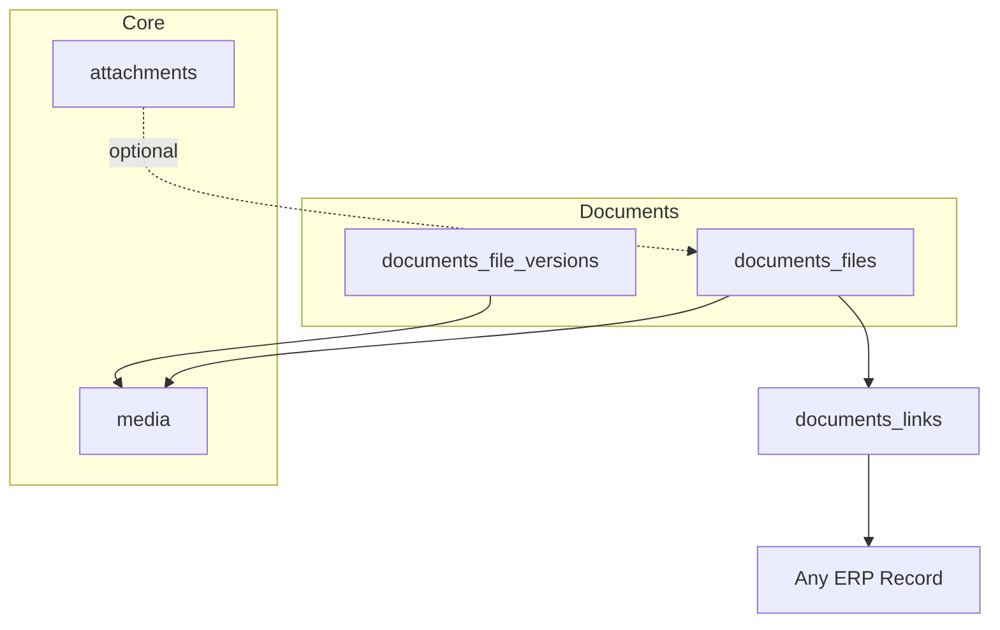

# Architecture — Documents

> **Status:** Draft  
> **Module:** Documents  
> **Phase:** 5 · Step 54  
> **Document Type:** Architecture  
> **Governance:** [MASTER_DATABASE_ARCHITECTURE.md](../../05-development/database/MASTER_DATABASE_ARCHITECTURE.md) · [MASTER_MODULE_ARCHITECTURE.md](../../01-architecture/MASTER_MODULE_ARCHITECTURE.md)

---

## Purpose
Documents module architecture — scope, features, data ownership, and integration boundaries.

## When To Read
Read this file only if working on Documents architecture, features, or module boundaries.

## Related Files
- [Dependencies](../../01-architecture/MODULE_DEPENDENCY_MAP.md)

## Read Next
- [Architecture](Architecture.md)

---

## Executive Summary

The Documents module extends Core file capabilities with enterprise document management — folder hierarchies, versioning, sharing, retention, and workflow — under the `documents_*` namespace. Binary storage uses Core `media`; Documents adds library structure, access control, and lifecycle beyond polymorphic `attachments` on individual records.

| Goal | Target |
|------|--------|
| Central library | Company-wide document repository |
| Version control | Check-in/out, revision history |
| Governance | Retention, legal hold, audit |
| ERP linking | Documents tied to any module record |

---

## Mission

Give organizations a secure, searchable document library with fine-grained permissions and version history, complementing Core attachments used for lightweight file links on transactions.

---

## Scope & Boundaries

### In Scope

- Document folders and library navigation
- Document metadata and versioning
- Internal and external sharing links
- Access control lists per folder/document
- Retention policies and archive
- Link documents to ERP entities (polymorphic)
- Approval workflow for controlled documents

### Out of Scope

- Raw blob storage (Core `media`)
- Product images (Catalog via `attachments`)
- Transaction receipts on orders (Commerce `attachments`)
- Full e-signature platform (integration hook only)

---

## Key Entities & Tables

> **Prefix:** `documents_*` · Owner: **Documents**

| Table | Purpose | Key Relationships |
|-------|---------|-------------------|
| `documents_libraries` | Top-level libraries per company | → `companies` |
| `documents_folders` | Folder tree | → `documents_libraries`, `parent_id` |
| `documents_files` | Document master record | → `documents_folders`, `media_id` |
| `documents_file_versions` | Version chain | → `documents_files`, `media_id` |
| `documents_file_locks` | Check-out lock | → `documents_files`, `user_id` |
| `documents_permissions` | ACL entries | → folder or file, `role_id`/`user_id` |
| `documents_shares` | External share links | → `documents_files`, token, expiry |
| `documents_links` | ERP record association | polymorphic `entity_type`, `entity_id` |
| `documents_retention_policies` | Auto-archive rules | → `companies` |
| `documents_workflow_instances` | Controlled doc approval | → `documents_files`, Core workflows |
| `documents_activity` | Document-specific audit | → `documents_files` |
| `documents_tags` | Document taxonomy | → `documents_files` (or Core tags) |

### Storage Pattern

```text
documents_files.media_id → media.id (current version blob)
documents_file_versions.media_id → media.id (historical blobs)
```

Core `attachments` may still link `documents_files` to records for UI embedding.

### Indexes

```text
documents_folders         (library_id, parent_id, path)
documents_files           (company_id, folder_id, name)
documents_file_versions   (file_id, version_number) UNIQUE
documents_shares          (token) UNIQUE WHERE revoked_at IS NULL
documents_links           (entity_type, entity_id)
```

---

## Core Shared Entities (Not Owned by Documents)

| Core Entity | Documents Usage |
|-------------|-----------------|
| `media` | File binary storage, CDN URL |
| `media_folders` | Optional sync for media browser |
| `users` / `roles` | ACL principals |
| `companies` | Tenant isolation |
| `workflows` / `approvals` | Document approval |
| `activity_logs` | Platform audit (supplement `documents_activity`) |
| `tags` | Cross-module labeling |

---

## Dependencies

### Core Platform

Media Library, Workflow Engine, Notification System, Search Service, API Layer.

### Sibling Modules

| Module | Relationship |
|--------|--------------|
| **HR** | Employee contracts, ID scans |
| **Sales** | Signed quotes, contracts |
| **Purchase** | Vendor agreements |
| **Accounting** | Scanned invoices, statements |
| **Project** | Deliverable documents |
| **Knowledge** | May import published articles as files |
| **Helpdesk** | Ticket attachments in library |

---

## Domain Events

| Event | Publisher | Consumers |
|-------|-----------|-----------|
| `documents.file.uploaded` | `documents_files` | Search index |
| `documents.file.version_created` | `documents_file_versions` | Notifications |
| `documents.file.published` | `documents_files` | Workflow complete |
| `documents.share.created` | `documents_shares` | Email notification |
| `documents.file.archived` | `documents_files` | Retention job |
| `documents.link.created` | `documents_links` | Entity timeline |

### Subscribed Events

| Event | Source | Documents Action |
|-------|--------|------------------|
| `hr.employee.terminated` | HR | Revoke employee folder access |
| `core.media.deleted` | Core | Cascade version cleanup (soft) |

---

## API

| Property | Value |
|----------|-------|
| **Base path** | `/api/v1/documents/` |
| **Permission namespace** | `documents.*` |

### Representative Endpoints

| Method | Path | Purpose |
|--------|------|---------|
| GET | `/libraries` | List libraries |
| GET/POST | `/folders` | Folder CRUD |
| POST | `/files/upload` | Upload new document |
| POST | `/files/{id}/checkout` | Lock for edit |
| POST | `/files/{id}/checkin` | New version upload |
| GET | `/files/{id}/versions` | Version history |
| POST | `/files/{id}/share` | Generate share link |
| POST | `/links` | Link file to ERP record |
| GET | `/search` | Full-text document search |

Large uploads: chunked upload via Core media API.

---

## Integration Patterns



**Distinction:** `attachments` = lightweight link on a record; `documents_*` = managed library with versions and ACL.

---

## Security & Permissions

| Permission | Description |
|------------|-------------|
| `documents.library.view` | Browse folders |
| `documents.files.upload` | Add documents |
| `documents.files.manage` | Edit metadata, move |
| `documents.files.delete` | Delete (soft) |
| `documents.shares.create` | External sharing |
| `documents.admin` | Retention and ACL override |

External shares: time-limited token, optional password, download audit log.

---

## Future Integration Notes

| Area | Plan |
|------|------|
| **E-signature** | DocuSign / Adobe Sign webhook |
| **OCR** | Full-text from scanned PDFs |
| **DMS compliance** | ISO 27001 retention templates |
| **AI** | Auto-classify, extract metadata |
| **Cloud sync** | OneDrive/Google Drive import (read-only) |

Coordinate with Core Media § CDN and virus scan pipeline before production.

---

**Module:** Documents  
**Last Updated:** 2026-06-12  
**Author:** —  
**Reviewers:** —
