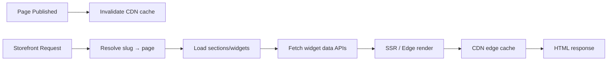
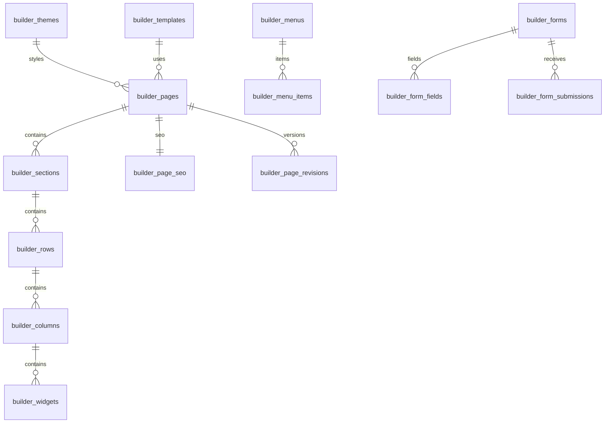

# AgainERP — Builder Module Architecture

> **Status:** Draft  
> **Module:** Builder (Ecommerce storefront CMS)  
> **Version:** 1.0  
> **Document Type:** Enterprise Architecture  
> **Governance:** [GOVERNANCE.md](../../../00-foundation/GOVERNANCE.md) · **Standards:** [DEVELOPMENT_STANDARDS.md](../../../00-foundation/standards/DEVELOPMENT_STANDARDS.md)

**No application code.** Source of truth for visual storefront Builder design.

**Related:** [seo/ARCHITECTURE.md](../seo/ARCHITECTURE.md) · [media/ARCHITECTURE.md](../media/ARCHITECTURE.md) · [catalog/ARCHITECTURE.md](../catalog/ARCHITECTURE.md)  
**UI menus:** `Menus/Builder/`

---

## Executive Summary

The **Builder** module is AgainERP's **visual storefront composition system**. It enables drag-drop creation of pages, headers, footers, product/category templates, checkout layouts, menus, forms, popups, and themes — without code deploys.

| Connects To | Integration |
|-------------|-------------|
| **Catalog** | Product grids, PDP blocks, collection widgets |
| **SEO** | Page meta, URLs, schema |
| **Media** | Images, videos via attachments |
| **Marketing** | Popup blocks, announcement widgets |
| **Orders** | Checkout builder layout |

### Scale Targets

| Dimension | Target |
|-----------|--------|
| Published pages | 100,000+ |
| Widget instances per page | 200 max |
| Storefront render | < 200ms (cached HTML) |
| Builder autosave | < 500ms |

**Table namespace:** `builder_*`

---

# Module Mission

## Why Builder Exists

Storefronts need flexible layouts — homepage hero, landing campaigns, custom checkout — beyond fixed templates. Builder provides a **structured page model** (sections → rows → columns → widgets) that renders consistently on web and (future) mobile apps.

```
builder_* JSON structure → Storefront renderer → CDN-cached HTML
```

Content module (`Menus/Content/`) handles blog/FAQ text content; Builder handles **layout and presentation**.

---

# Module Structure

```
Builder
├── Theme Manager               ← Global theme tokens, fonts, colors
├── Template Manager            ← Reusable page templates
├── Header Builder              ← Site header layout
├── Footer Builder              ← Site footer layout
├── Homepage Builder            ← Default storefront home
├── Landing Page Builder        ← Campaign landing pages
├── Product Page Builder        ← PDP layout override
├── Category Page Builder       ← PLP layout override
├── Checkout Builder            ← Checkout steps layout
├── Widget Builder              ← Custom widget definitions
├── Menu Builder                ← Storefront navigation menus
├── Form Builder                ← Lead capture, contact forms
├── Popup Builder               ← Modal layouts (→ Marketing triggers)
└── Block Library               ← Shared reusable blocks
```

Screen docs: `Menus/Builder/`

---

# Page Composition Model

## Hierarchy

```
builder_pages
└── builder_sections (ordered)
    └── builder_rows (ordered)
        └── builder_columns (width grid)
            └── builder_widgets (ordered)
```

| Level | Purpose |
|-------|---------|
| **Page** | Routable URL, SEO, template binding |
| **Section** | Full-width band (hero, features, CTA) |
| **Row** | Horizontal group within section |
| **Column** | Grid width (1–12), responsive breakpoints |
| **Widget** | Functional block (product grid, banner, HTML) |

## Responsive Design

Each row/column stores `settings` JSON:

```json
{
  "breakpoints": {
    "desktop": { "columns": 3 },
    "tablet": { "columns": 2 },
    "mobile": { "columns": 1 }
  }
}
```

---

# Themes & Templates

## Themes

**Table:** `builder_themes`

| Field | Notes |
|-------|-------|
| `name` | Theme name |
| `is_active` | One active per company |
| `tokens` | JSON: colors, fonts, spacing, radii |
| `custom_css` | Optional override |
| `preview_media_id` | Screenshot |

**Theme Manager** edits design tokens consumed by all widgets.

## Templates

**Table:** `builder_templates`

| `template_type` | Use |
|-----------------|-----|
| `homepage` | Default home |
| `landing` | Campaign pages |
| `product` | PDP shell |
| `category` | PLP shell |
| `checkout` | Checkout flow |
| `page` | Generic CMS page |

Pages may `template_id` inherit structure; override sections allowed.

---

# Widgets & Blocks

## Widget Types

**Table:** `builder_widgets` (instances on page)  
**Table:** `builder_widget_definitions` (registry)

| Category | Widgets |
|----------|---------|
| **Content** | Heading, Text, HTML, Image, Video, Slider |
| **Commerce** | Product Grid, Product Carousel, Category List, Search Bar, Cart Icon |
| **Catalog** | Featured Products, Collection, Brand Logos, Filters |
| **Forms** | Contact Form, Newsletter Signup |
| **Layout** | Spacer, Divider, Tabs, Accordion |
| **Marketing** | Countdown, Coupon Banner, Testimonials |
| **Navigation** | Breadcrumbs, Menu |

Each widget: `type`, `settings` JSON, `content` JSON.

## Block Library

**Table:** `builder_blocks` — saved section/row snapshots for reuse across pages.

---

# Menus & Forms

## Menu Builder

**Tables:** `builder_menus`, `builder_menu_items`

| Field (`builder_menu_items`) | Notes |
|------------------------------|-------|
| `parent_id` | Nested items |
| `label` | Display text |
| `url` | Internal or external |
| `entity_type` | Link to category, page, product |
| `entity_id` | |
| `open_in_new_tab` | |

Separate from admin sidebar — these are **storefront** navigation menus.

## Form Builder

**Tables:** `builder_forms`, `builder_form_fields`, `builder_form_submissions`

| Field Type | Validation |
|------------|------------|
| text, email, phone | Required, regex |
| select, checkbox | Options JSON |
| file | → media upload |

Submissions → Core Notification + optional CRM activity.

---

# Page Types & Routing

**Table:** `builder_pages`

| Field | Notes |
|-------|-------|
| `title` | |
| `slug` | Unique per company+locale |
| `page_type` | homepage, landing, cms, system |
| `status` | draft, published, scheduled |
| `published_at` | Schedule publish |
| `template_id` | FK |
| `locale` | en, bn |

**Table:** `builder_page_seo` — meta, OG, canonical (feeds SEO module)

## System Pages

| Page | Override |
|------|----------|
| Homepage | `page_type=homepage` |
| 404 | `builder_system_pages` |
| Cart / Checkout | Checkout Builder |

Catalog PDP/PLP: optional Builder override; fallback to default theme templates.

---

# Rendering Pipeline



| Strategy | Detail |
|----------|--------|
| SSR | Server render for SEO |
| Widget data | Batched API calls per page |
| Cache key | `page:{slug}:{locale}:{theme_version}` |
| Preview | Draft token for admin preview |

---

# Versioning & History

**Tables:** `builder_page_revisions`, `builder_publish_log`

| Feature | Design |
|---------|--------|
| Autosave | Draft revision every 30s |
| Manual publish | Creates published snapshot |
| Rollback | Restore prior revision |
| Scheduled publish | Cron activates revision |

---

# System Events

| Event | Payload | Subscribers |
|-------|---------|-------------|
| `builder.page.published` | `page_id`, `slug` | SEO sitemap, CDN purge |
| `builder.page.unpublished` | `page_id` | SEO noindex |
| `builder.theme.updated` | `theme_id` | Full CDN purge |
| `builder.form.submitted` | `form_id`, `submission_id` | Notification, CRM |
| `builder.menu.updated` | `menu_id` | Storefront cache |

---

# Database Architecture

## Table List

| Table | Purpose |
|-------|---------|
| `builder_themes` | Theme tokens |
| `builder_templates` | Page templates |
| `builder_pages` | Routable pages |
| `builder_page_seo` | Page SEO |
| `builder_page_revisions` | Version history |
| `builder_sections` | Page sections |
| `builder_rows` | Section rows |
| `builder_columns` | Row columns |
| `builder_widgets` | Widget instances |
| `builder_widget_definitions` | Widget registry |
| `builder_blocks` | Reusable blocks |
| `builder_menus` | Storefront menus |
| `builder_menu_items` | Menu items |
| `builder_forms` | Form definitions |
| `builder_form_fields` | Form fields |
| `builder_form_submissions` | Submissions |
| `builder_system_pages` | 404, maintenance |
| `builder_publish_log` | Publish audit |

## ER Diagram



---

# API Architecture

Base: `/api/v1/builder/`  
Auth: Bearer + `X-Company-Id`

| Method | Endpoint | Permission |
|--------|----------|------------|
| GET/POST | `/pages` | `builder.page.*` |
| GET/PATCH | `/pages/{uuid}` | `builder.page.*` |
| POST | `/pages/{uuid}/publish` | `builder.page.publish` |
| GET | `/pages/{uuid}/revisions` | `builder.page.read` |
| POST | `/pages/{uuid}/rollback` | `builder.page.publish` |
| GET/POST | `/themes` | `builder.theme.*` |
| GET/POST | `/templates` | `builder.template.*` |
| GET/POST | `/menus` | `builder.menu.*` |
| GET/POST | `/forms` | `builder.form.*` |
| GET | `/widget-definitions` | `builder.page.read` |
| GET/POST | `/blocks` | `builder.block.*` |

## Storefront (public)

`GET /api/v1/storefront/pages/{slug}` — rendered page JSON or HTML  
`GET /api/v1/storefront/menus/{code}` — navigation tree

---

# Permissions

| Key | Description |
|-----|-------------|
| `builder.access` | Module access |
| `builder.page.read` | View pages |
| `builder.page.write` | Edit pages |
| `builder.page.publish` | Publish / rollback |
| `builder.theme.*` | Theme management |
| `builder.template.*` | Templates |
| `builder.menu.*` | Menus |
| `builder.form.*` | Forms |
| `builder.block.*` | Block library |

---

# Dependencies

- **Core:** [media-library](../../../02-core-platform/entities/media-library.md), [attachments](../../../02-core-platform/entities/attachments.md), Notification System
- **Ecommerce:** [catalog/ARCHITECTURE.md](../catalog/ARCHITECTURE.md), [seo/ARCHITECTURE.md](../seo/ARCHITECTURE.md), [media/ARCHITECTURE.md](../media/ARCHITECTURE.md), [marketing/ARCHITECTURE.md](../marketing/ARCHITECTURE.md), [orders/ARCHITECTURE.md](../orders/ARCHITECTURE.md)
- **Services:** CDN, SSR renderer, Queue (scheduled publish)

---

## Document Index

| Screen | Menu Doc |
|--------|----------|
| Homepage Builder | [Menus/Builder/Homepage Builder.md](../Menus/Builder/Homepage Builder.md) |
| Theme Manager | [Menus/Builder/Theme Manager.md](../Menus/Builder/Theme Manager.md) |
| Full menu | [MENU_STRUCTURE.md](../MENU_STRUCTURE.md) |

---

**Module:** Builder  
**Last Updated:** 2026-06-12  
**Status:** Draft — requires approval before implementation
