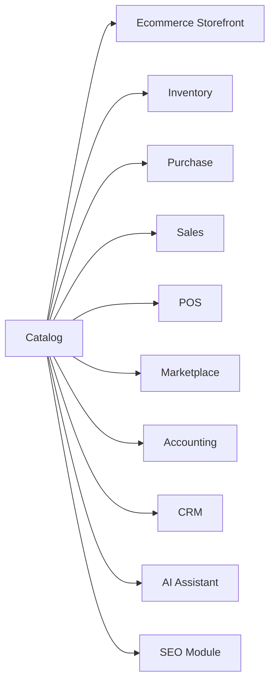
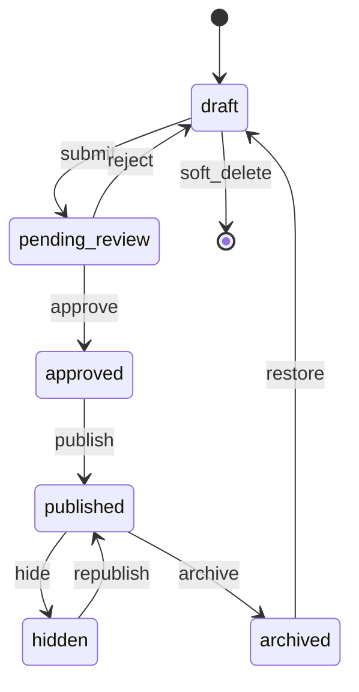
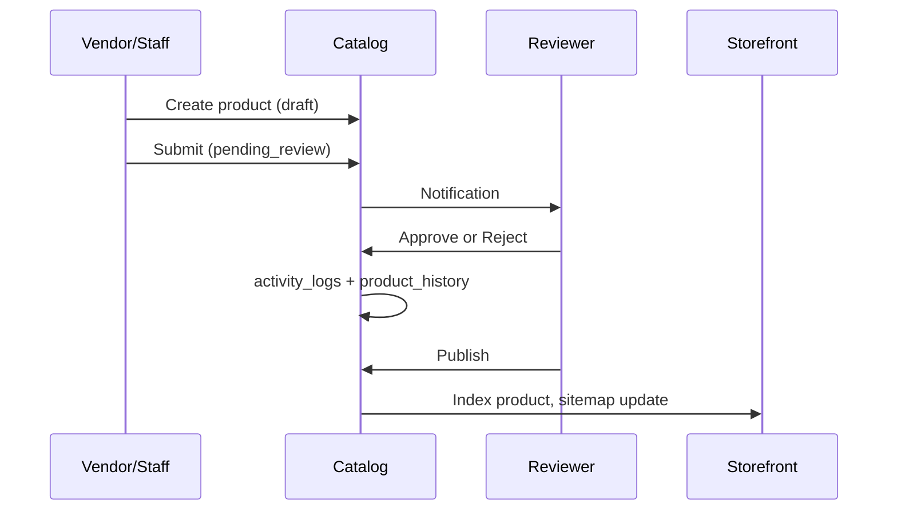
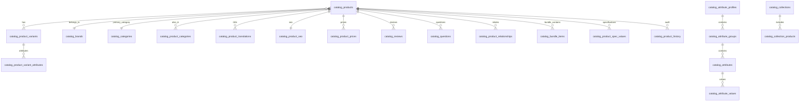

# AgainERP — Catalog Module Architecture

> **Status:** Draft  
> **Module:** Catalog (Ecommerce domain · Platform-ready)  
> **Version:** 1.0  
> **Document Type:** Enterprise Architecture  
> **Governance:** [GOVERNANCE.md](../../../00-foundation/GOVERNANCE.md) · **Standards:** [DEVELOPMENT_STANDARDS.md](../../../00-foundation/standards/DEVELOPMENT_STANDARDS.md)

**No application code.** Source of truth for Catalog design and implementation.

**Related:** [PRODUCT_MASTER_ARCHITECTURE.md](../../../02-core-platform/subsystems/PRODUCT_MASTER_ARCHITECTURE.md) · [ENTITY_CATALOG.md](./ENTITY_CATALOG.md) · [MENU_STRUCTURE.md](../MENU_STRUCTURE.md) · [UI.md](../UI.md) · [dashboard/ARCHITECTURE.md](../dashboard/ARCHITECTURE.md)

---

## Executive Summary

The **Catalog** is AgainERP's central product master data system. It is the single source of truth for products, categories, brands, attributes, variants, pricing, SEO, media references, and merchandising relationships.

**Phase 1** ships inside Ecommerce admin (`Menus/Catalog/`). **Architecture** targets extraction as a platform module consumed by Inventory, Sales, Purchase, POS, Marketplace, Accounting, CRM, AI, and SEO — without schema redesign.

### Scale Targets

| Dimension | Target |
|-----------|--------|
| Products | 1,000,000+ |
| Variants | 10,000,000+ |
| Concurrent admin users | 100 |
| Companies / branches / warehouses | Multi-tenant from day one |
| Languages | en, bn (extensible) |
| Currencies | BDT, USD, EUR |

### Design Pillars

Multi-company · Multi-branch · Multi-warehouse · Multi-language · Multi-currency · SEO-first · API-first · AI-ready · Audit-complete

---

# Catalog Mission

## Why Catalog Exists

Every revenue-generating module needs the same product truth. Without a unified Catalog:

- Inventory stock disagrees with storefront
- POS sells products Ecommerce archived
- Accounting uses different SKUs than Sales
- SEO metadata fragments across modules

Catalog eliminates duplication and becomes the **product spine** of AgainERP.

## Dependent Modules



| Module | Catalog Consumption |
|--------|---------------------|
| Ecommerce | Storefront, cart, checkout |
| Inventory | Stock levels, reservations, warehouses |
| Purchase | Supplier mapping, cost price |
| Sales | Quotations, order lines |
| POS | Barcode lookup, quick sale |
| Marketplace | Vendor product submission |
| Accounting | COGS, revenue recognition |
| CRM | Customer product interests |
| AI | Descriptions, tags, review summaries |
| SEO | Schema, sitemaps, meta |

## Table Namespace

Catalog owns `catalog_*` tables. Ecommerce storefront reads via Catalog API — never duplicate product tables in other modules.

---

# Module Structure

```
Catalog
│
├── Dashboard                    ← Catalog KPIs, pending approvals, import status
├── Products                     ← Master product CRUD (all types)
│   ├── Product List
│   ├── Add Product
│   ├── Bulk Import
│   ├── Bulk Export
│   ├── Product Approval
│   └── Product History
├── Categories                   ← Unlimited depth tree
├── Brands                       ← Brand master + landing pages
├── Specifications                 ← Profile-first spec system (see SPECIFICATIONS_ARCHITECTURE.md)
│   ├── Profiles                   ← List + Profile Builder (groups + fields in one screen)
│   ├── Templates                  ← Preset profile library
│   ├── AI Import                  ← Paste / upload → structured specs
│   └── AI Suggestions             ← Missing fields, filters, normalization
├── Variants                     ← Variable product children
├── Filters                      ← Faceted search config
├── Tags                         → Core [tags](../../../02-core-platform/entities/tags.md)
├── Product Collections          ← Merchandising sets
├── Product Bundles              ← Combo / package products
├── Related Products             ← Cross-sell, up-sell, FBT
├── Reviews                      ← Ratings + moderation
├── Questions & Answers          ← Customer Q&A
├── Product Comparison           ← Compare specs (storefront)
│
├── Price Management             ← Cross-cutting (prices, schedules, history)
├── Inventory Mapping            ← Catalog ↔ Inventory bridge
└── Product History              ← Field-level audit (all catalog entities)
```

## Section Purposes

| Section | Purpose | Primary Users |
|---------|---------|---------------|
| **Dashboard** | Pending reviews, import jobs, low-data products, SEO gaps | Catalog Manager |
| **Products** | Create/edit all product types, bulk ops | Product Manager |
| **Categories** | Tree navigation, SEO URLs, category filters | Product Manager, SEO |
| **Brands** | Brand identity, brand SEO pages | Content, SEO |
| **Specifications › Profiles** | Reusable spec templates + Profile Builder | Product Manager |
| **Specifications › Templates** | Preset starting points (Business Laptop, Gaming…) | Product Manager |
| **Specifications › AI Import** | Bulk spec extraction from supplier text | Product Manager |
| **Specifications › AI Suggestions** | Review queue for AI-generated specs | Product Manager |
| **Product Specifications** | Profile assignment, values, overrides (product form tab) | Product Manager |
| **Variants** | SKU-level sellable units | Product Manager |
| **Filters** | Faceted navigation rules | SEO, Product Manager |
| **Tags** | Flexible labels (Core entity) | Marketing |
| **Product Collections** | Curated/dynamic product sets | Marketing |
| **Product Bundles** | Multi-SKU packages with bundle pricing | Product Manager |
| **Related Products** | Merchandising relationships | Marketing |
| **Reviews** | Social proof, moderation | Support, Marketing |
| **Questions & Answers** | Pre-sale customer questions | Support |
| **Product Comparison** | Side-by-side spec compare | Storefront config |
| **Price Management** | Price lists, schedules, tier pricing | Admin, Finance |
| **Inventory Mapping** | Link catalog variants → inventory items | Inventory Manager |
| **Product History** | Audit trail for compliance | Admin, Auditor |

Screen docs: `Menus/Catalog/`

---

# Product Architecture

## Product Types

| Type | `product_type` | Sellable Unit | Stock | Example |
|------|----------------|---------------|-------|---------|
| **Simple** | `simple` | Product itself | Yes | Mug |
| **Variable** | `variable` | Variants | On variants | iPhone 16 |
| **Digital** | `digital` | Product / license | No | eBook, software key |
| **Service** | `service` | Product | Optional | Installation |
| **Bundle** | `bundle` | Bundle SKU | Derived from components | Camera kit |
| **Grouped** | `grouped` | Children separately | On children | Furniture set |
| **Subscription** | `subscription` | Product + plan | Optional | Monthly box |
| **Gift Card** | `gift_card` | Denomination variants | No | ৳500 / ৳1000 card |

## Business Logic by Type

| Type | Logic |
|------|-------|
| Simple | Single SKU, single price, direct inventory link |
| Variable | Parent not sold; only variants purchasable; attributes define matrix |
| Digital | Download link / license on order; no shipping |
| Service | May require booking; no weight |
| Bundle | Price override; stock = min(component qty) or fixed bundle stock |
| Grouped | Display children on PDP; add children to cart individually |
| Subscription | Billing interval; renewal SKU |
| Gift Card | Generates redeemable code on purchase |

## Database Structure

```
catalog_products (parent record, all types)
├── catalog_product_variants (0..n; required for variable)
├── catalog_product_translations
├── catalog_product_seo
├── catalog_product_prices
├── catalog_bundle_items (bundle type)
├── catalog_grouped_items (grouped type)
├── catalog_product_relationships
├── attachments → media (Core)
└── taggables → tags (Core)
```

## Relationships

| Relation | Cardinality | Table |
|----------|-------------|-------|
| Product → Category | n:1 (primary) + n:m (additional) | `catalog_product_categories` |
| Product → Brand | n:1 | `brand_id` on product |
| Product → Variants | 1:n | `catalog_product_variants` |
| Variant → Inventory | 1:1 | `inventory_item_id` on variant |
| Product → Reviews | 1:n | `catalog_reviews` |

## Future Expansion

- **Marketplace:** `vendor_id`, submission workflow on same `catalog_products`
- **Multi-channel:** `channel_visibility` JSON per sales channel
- **PIM:** External DAM sync via media API
- **3PL:** Extended attributes for fulfillment partners

---

# Product Fields

## Basic Fields (`catalog_products`)

| Field | Type | Required | Notes |
|-------|------|----------|-------|
| `name` | VARCHAR(500) | Yes | Translatable |
| `sku` | VARCHAR(100) | Simple: yes | Unique per company |
| `model` | VARCHAR(100) | No | Manufacturer model |
| `barcode` | VARCHAR(50) | No | EAN/UPC |
| `brand_id` | FK | No | → `catalog_brands` |
| `primary_category_id` | FK | Yes | → `catalog_categories` |
| `description` | LONGTEXT | No | Translatable, HTML |
| `short_description` | TEXT | No | Translatable |
| `product_type` | ENUM | Yes | See product types |
| `lifecycle_status` | ENUM | Yes | See lifecycle |
| `visibility` | ENUM | Yes | `public`, `private`, `password` |
| `sort_order` | INT | No | Default 0 |
| `is_featured` | BOOLEAN | No | Featured flag |

## Advanced / Merchandising

| Field | Storage | Notes |
|-------|---------|-------|
| Meta title | `catalog_product_seo` | Per locale |
| Meta description | `catalog_product_seo` | Per locale |
| Slug | `catalog_product_seo` | Unique per company+locale |
| Canonical URL | `catalog_product_seo` | Override |
| Tags | Core `taggables` | Not duplicated |
| Related / cross-sell / up-sell | `catalog_product_relationships` | Typed edges |

## Inventory Fields (variant level)

| Field | Table | Notes |
|-------|-------|-------|
| `qty_on_hand` | Inventory module | Not on catalog — read via API |
| `qty_reserved` | Inventory module | |
| `min_qty` | `catalog_product_variants` | Alert threshold |
| `max_qty` | `catalog_product_variants` | Overstock threshold |
| `warehouse_id` | Inventory module | Multi-warehouse |

Catalog stores **mapping** only: `catalog_product_variants.inventory_item_id`.

## Pricing Fields (`catalog_product_prices`)

| Field | Description |
|-------|-------------|
| `cost_price` | Landed cost |
| `purchase_price` | Last purchase |
| `selling_price` | Retail |
| `special_price` | Promo price |
| `wholesale_price` | B2B tier |
| `dealer_price` | Dealer tier |
| `tax_class_id` | Tax rules |
| `currency_code` | BDT, USD, EUR |

Prices scoped by: `company_id`, optional `branch_id`, optional `customer_group_id`.

## AI Fields (`catalog_product_ai`)

| Field | Description |
|-------|-------------|
| `ai_generated_content` | JSON: description, bullets |
| `ai_seo_score` | 0–100 |
| `ai_optimization_status` | `pending`, `optimized`, `manual` |
| `ai_last_run_at` | Timestamp |

## Media (Core)

| Asset | Mechanism |
|-------|-----------|
| Images | `attachments` collection `gallery`, `thumbnail` |
| Videos | `attachments` collection `videos` |
| Documents | `attachments` collection `documents` |
| 360° | `attachments` collection `360` + metadata |

Never store paths on `catalog_products`.

---

# Product Lifecycle

## States

| State | `lifecycle_status` | Storefront | Description |
|-------|-------------------|------------|-------------|
| Draft | `draft` | Hidden | Work in progress |
| Pending Review | `pending_review` | Hidden | Submitted for approval |
| Approved | `approved` | Hidden | Approved, not yet live |
| Published | `published` | Visible | Live on storefront |
| Hidden | `hidden` | Hidden | Temporarily off |
| Archived | `archived` | Hidden | Discontinued, kept for history |
| Deleted | soft delete | Hidden | `deleted_at` set |

## State Machine



## Permissions per Transition

| Transition | Permission |
|------------|------------|
| submit | `catalog.product.submit` |
| approve / reject | `catalog.product.approve` |
| publish | `catalog.product.publish` |
| hide | `catalog.product.write` |
| archive | `catalog.product.archive` |
| delete | `catalog.product.delete` |

All transitions write to `catalog_product_history` and Core `activity_logs`.

---

# Category Architecture

## Features

- Unlimited nesting via `parent_id` (adjacency list + `path` materialized for queries)
- Category tree UI with drag-drop reorder
- SEO slug per locale: `/category/electronics/smartphones`
- Category templates (grid/list/landing) for storefront Builder
- Category-level filter inheritance
- Category landing pages with CMS blocks

## Database

**`catalog_categories`**

| Column | Notes |
|--------|-------|
| `parent_id` | FK self, nullable |
| `path` | Materialized path `/1/5/12/` |
| `depth` | Level index |
| `name` | Translatable |
| `slug` | Per locale |
| `image_media_id` | FK → media |
| `is_active` | Boolean |
| `sort_order` | Sibling order |

**`catalog_category_translations`** · **`catalog_category_seo`** · **`catalog_product_categories`** (n:m)

## Management UI

- Tree view with expand/collapse
- Inline add child
- Bulk move, bulk activate/deactivate
- SEO panel per category
- Mobile: indented list with swipe actions

---

# Brand Architecture

## Features

| Feature | Implementation |
|---------|----------------|
| Brand profiles | `catalog_brands` + translations |
| Logos | `logo_media_id` → Core media |
| SEO pages | `/brand/apple` via `catalog_brand_seo` |
| Brand collections | Dynamic collection rule `brand = X` |
| Landing pages | Builder template binding |
| Analytics | Dashboard Product Analytics by brand |

**`catalog_brands`:** `name`, `slug`, `description`, `logo_media_id`, `website`, `is_active`

---

# Attribute Architecture

> **Full specification:** [SPECIFICATIONS_ARCHITECTURE.md](./SPECIFICATIONS_ARCHITECTURE.md) — profiles, groups, fields, product overrides, storefront, AI import.

## Structure

```
catalog_attribute_profiles (Laptop, Mobile Phone, Camera)
└── catalog_attribute_groups (Processor, Display, Memory)
    └── catalog_attributes (Processor Brand, RAM, Display Size)
        └── catalog_attribute_values (Intel, 16GB, 15.6")  [for select types]
            └── catalog_product_spec_values  [per-product stored values]
```

Legacy variant matrix remains separate:

```
catalog_attribute_groups (Display, Memory, Camera)
└── catalog_attributes (Screen Size, RAM, Color)
    └── catalog_attribute_values (6.1", 8GB, Red)  [for select types]
```

Variant attributes use `catalog_product_variant_attributes`. Specification profiles use `catalog_product_spec_*` tables — see linked doc.

## Attribute Input Types

| Type | `input_type` | Filterable | Variant |
|------|--------------|------------|---------|
| Text | `text` | No | No |
| Number | `number` | Range | No |
| Dropdown | `select` | Multi | Yes |
| Checkbox | `boolean` | Yes | No |
| Color | `color` | Multi | Yes |
| Image swatch | `image` | Multi | Yes |

## Variant Matrix

Variable products assign attribute values per variant in `catalog_product_variant_attributes`:

```
product_id: iPhone 16
variants:
  - SKU: IP16-BLK-128 → Color: Black, Storage: 128GB
  - SKU: IP16-BLU-256 → Color: Blue, Storage: 256GB
```

---

# Variant Architecture

**`catalog_product_variants`**

| Column | Notes |
|--------|-------|
| `product_id` | FK parent (variable product) |
| `sku` | Unique per company |
| `barcode` | Optional |
| `name` | Auto-generated or custom |
| `selling_price` | Override parent |
| `cost_price` | |
| `weight`, `dimensions` | Shipping |
| `inventory_item_id` | FK → Inventory module |
| `is_default` | Default selection on PDP |
| `sort_order` | |

Media: `attachments` with `attachable_type = CatalogProductVariant`.

---

# Filter Architecture

Faceted search for storefront and admin preview.

## Filter Types

| Type | UI | Example |
|------|-----|---------|
| Multi-select | Checkboxes | Brand, Color |
| Range | Slider | Price, Weight |
| Dynamic | Auto from attributes | RAM, Storage |
| Boolean | Toggle | In stock only |

## SEO Filter URLs

```
/shop?brand=apple&ram=8gb&color=red
/shop/electronics/phones?price_min=10000&price_max=50000
```

Canonical rules prevent duplicate index URLs. Config in `catalog_filters` + `catalog_filter_attributes`.

**`catalog_filters`:** `name`, `attribute_id`, `display_type`, `sort_order`, `is_active`

---

# Product Collections

| Collection Type | Rule |
|-----------------|------|
| Featured Products | `is_featured = true` |
| New Arrivals | `created_at > NOW() - 30d` |
| Best Sellers | Sales rank from analytics |
| Trending | View velocity |
| Custom | Manual product pick list |
| Dynamic | Rule engine JSON |
| Rules-based | `brand=X AND category=Y AND price<Z` |

**Tables:** `catalog_collections`, `catalog_collection_products`, `catalog_collection_rules`

---

# Product Bundles

| Concept | Design |
|---------|--------|
| Bundle product | `product_type = bundle` |
| Components | `catalog_bundle_items`: `product_id` or `variant_id`, `qty`, `is_optional` |
| Bundle pricing | `fixed_price` OR `sum(components) - discount` |
| Inventory | Decrement all components on sale; block if any OOS |

**`catalog_bundle_items`:** `bundle_product_id`, `item_variant_id`, `quantity`, `sort_order`

---

# Product Relationships

**`catalog_product_relationships`**

| `relationship_type` | Purpose |
|----------------------|---------|
| `related` | Similar products |
| `cross_sell` | Complementary at checkout |
| `up_sell` | Higher-tier alternative |
| `frequently_bought_together` | Bundle suggestions |
| `alternative` | Substitutes |
| `accessory` | Add-ons |

Columns: `product_id`, `related_product_id`, `related_variant_id`, `sort_order`, `strength` (AI score future).

---

# Reviews Architecture

**`catalog_reviews`**

| Field | Notes |
|-------|-------|
| `product_id` | FK |
| `contact_id` | FK → Core contacts |
| `rating` | 1–5 |
| `title`, `body` | |
| `pros`, `cons` | JSON arrays |
| `status` | `pending`, `approved`, `rejected` |
| `verified_purchase` | Boolean |

Media: review images/videos via `attachments`.  
Moderation: `catalog.product.review.moderate`.  
AI: `ai_review_summary` on product via AI service.

Schema.org: `Review` + aggregate `AggregateRating` on PDP.

---

# Questions & Answers

**`catalog_questions`:** `product_id`, `contact_id`, `question`, `status`  
**`catalog_answers`:** `question_id`, `user_id` or `contact_id`, `answer`, `is_official`, `vote_count`  
**`catalog_answer_votes`:** helpful/not helpful

Moderation queue; AI suggested answers stored as draft answers pending approval.

---

# Product Approval Workflow



Marketplace vendors use same flow with `vendor_id` scope.

---

# Product Import & Export

## Import Channels

| Channel | Format | Use Case |
|---------|--------|----------|
| Excel | `.xlsx` | Manual bulk |
| CSV | `.csv` | Integrations |
| Scheduled | Cron | Nightly supplier sync |
| Supplier feed | XML/CSV URL | Dropship |
| API | REST POST | ERP integration |

**`catalog_import_jobs`:** `file_media_id`, `mapping`, `status`, `total_rows`, `error_report_media_id`

## Export

Templates: full catalog, price list, inventory mapping, SEO export.  
**`catalog_export_jobs`** with async queue for 1M+ rows.

## Error Handling

Row-level validation; error report downloadable; partial import option (`skip_errors`).

---

# Price Management

**`catalog_product_prices`** — current prices  
**`catalog_price_history`** — every change with `changed_by`, `effective_from`, `effective_to`  
**`catalog_price_schedules`** — future price activation

| Price Type | Scope |
|------------|-------|
| Retail | Default |
| Wholesale | `customer_group_id` |
| Dealer | `customer_group_id` |
| Special | Date-bounded promo |
| Campaign | Linked to Marketing module |
| Dynamic | Rule-based (future AI pricing) |

---

# Inventory Mapping

Catalog does **not** own stock quantities. It maps sellable units to Inventory.

```
catalog_product_variants.inventory_item_id → inventory_items.id
inventory_stock_levels.warehouse_id → qty per warehouse
```

| Event | Catalog | Inventory |
|-------|---------|-----------|
| Order placed | — | Reserve stock |
| Shipped | — | Deduct stock |
| Catalog sync | Read qty for display | Source of truth |

Admin UI **Inventory Mapping** screen: link/unlink variants, view qty read-only, jump to Stock Management.

---

# Product History

**`catalog_product_history`**

| Field | Notes |
|-------|-------|
| `product_id` / `variant_id` | Subject |
| `field_name` | Changed field |
| `old_value`, `new_value` | JSON |
| `change_type` | create, update, price, stock_ref, seo, media, category |
| `changed_by` | User |

Tracks: create, edit, delete, price, stock reference changes, category moves, SEO updates, media changes.  
Retention: 7 years. Complements Core `activity_logs`.

---

# SEO Architecture

| Element | Source |
|---------|--------|
| SEO URL | `catalog_product_seo.slug`, `catalog_category_seo.slug` |
| Meta tags | Per locale translations |
| Product Schema | JSON-LD `Product`, `Offer`, `AggregateRating` |
| Review Schema | Nested `Review` |
| Breadcrumbs | Category path + product |
| Canonical | `canonical_url` override field |
| Open Graph | `og:title`, `og:image` from media |
| Sitemap | Auto `/sitemap-products.xml`, `/sitemap-categories.xml` |
| Robots | `noindex` on hidden/archived |
| Internal linking | Related products + category nav |
| SEO Audit | SEO module scans missing meta, duplicate slugs |

See [ui-ux/seo.md](../../../04-uiux/standards/seo.md).

---

# Media Architecture

All via Core [media-library](../../../02-core-platform/entities/media-library.md) + [attachments](../../../02-core-platform/entities/attachments.md).

| Feature | Design |
|---------|--------|
| Gallery | Ordered attachments |
| Videos | YouTube URL or uploaded |
| Documents | PDF spec sheets |
| 360° | Multi-image viewer metadata |
| Optimization | WebP/AVIF on upload, responsive srcset |
| CDN | `cdn_url` from CDN Manager |
| Watermark | `Watermark Manager` config |
| Versioning | `media.parent_media_id` chain |

---

# Search Architecture

## v1 — Database

- Full-text index on `name`, `sku`, `description` (per locale)
- Prefix autocomplete API
- Synonyms: `catalog_search_synonyms`
- Misspelling: Levenshtein / phonetic (v2)

## v2 — Meilisearch / Elasticsearch

```
Catalog DB → Change events → Search indexer → Meilisearch
```

Index document: product + variants + categories + brand + attributes + prices + stock status.

## AI Search (future)

Semantic query → vector embedding → hybrid rank with keyword score.

Voice search ready: same API, speech-to-text on client.

---

# Database Architecture

## ER Diagram (Core Catalog)



## Table List

| Table | Purpose |
|-------|---------|
| `catalog_products` | Master product |
| `catalog_product_variants` | Sellable SKUs |
| `catalog_product_translations` | i18n fields |
| `catalog_product_seo` | SEO per locale |
| `catalog_product_ai` | AI metadata |
| `catalog_categories` | Category tree |
| `catalog_category_translations` | |
| `catalog_category_seo` | |
| `catalog_product_categories` | n:m categories |
| `catalog_brands` | Brands |
| `catalog_brand_seo` | |
| `catalog_attribute_profiles` | Spec templates (Laptop, Mobile…) |
| `catalog_attribute_profile_categories` | Profile ↔ category mapping |
| `catalog_attribute_groups` | Groups scoped to profile |
| `catalog_attributes` | Spec field definitions |
| `catalog_attribute_values` | Dropdown / swatch options |
| `catalog_product_spec_layout` | Resolved product spec tree + overrides |
| `catalog_product_spec_values` | Product specification values |
| `catalog_product_spec_groups` | Product-only custom groups |
| `catalog_product_spec_attributes` | Product-only custom attributes |
| `catalog_product_variant_attributes` | Variant matrix |
| `catalog_filters` | Facet config |
| `catalog_collections` | |
| `catalog_collection_products` | |
| `catalog_collection_rules` | |
| `catalog_bundle_items` | |
| `catalog_grouped_items` | |
| `catalog_product_relationships` | |
| `catalog_reviews` | |
| `catalog_questions` | |
| `catalog_answers` | |
| `catalog_product_prices` | |
| `catalog_price_history` | |
| `catalog_price_schedules` | |
| `catalog_product_history` | |
| `catalog_import_jobs` | |
| `catalog_export_jobs` | |
| `catalog_search_synonyms` | |

## Indexes (Performance)

| Table | Index | Reason |
|-------|-------|--------|
| `catalog_products` | `(company_id, lifecycle_status, sku)` | Admin list |
| `catalog_products` | `(company_id, slug)` via seo table | Storefront URL |
| `catalog_product_variants` | `(company_id, sku)`, `(inventory_item_id)` | POS scan |
| `catalog_categories` | `(company_id, path)` | Tree queries |
| `catalog_reviews` | `(product_id, status)` | PDP reviews |
| Full-text | `name`, `description` | Search v1 |

## Partitioning Strategy (1M+ products)

- Partition `catalog_product_history` by year
- Archive `archived` products to cold storage table (optional)
- Read replicas for storefront search/list

---

# API Architecture

Base: `/api/v1/catalog/`  
Auth: Bearer + `X-Company-Id`

## Products

| Method | Endpoint | Permission |
|--------|----------|------------|
| GET | `/products` | `catalog.product.read` |
| POST | `/products` | `catalog.product.write` |
| GET | `/products/{uuid}` | `catalog.product.read` |
| PATCH | `/products/{uuid}` | `catalog.product.write` |
| DELETE | `/products/{uuid}` | `catalog.product.delete` |
| POST | `/products/{uuid}/submit` | `catalog.product.submit` |
| POST | `/products/{uuid}/approve` | `catalog.product.approve` |
| POST | `/products/{uuid}/publish` | `catalog.product.publish` |
| GET | `/products/{uuid}/history` | `catalog.product.read` |

## Categories, Brands, Attributes, Variants

| Resource | Endpoints |
|----------|-----------|
| Categories | CRUD + `/categories/tree` |
| Brands | CRUD |
| Attribute groups | CRUD |
| Attributes | CRUD + values nested |
| Variants | CRUD under `/products/{uuid}/variants` |

## Reviews, Collections, Search

| Method | Endpoint |
|--------|----------|
| GET/POST | `/reviews` |
| PATCH | `/reviews/{uuid}/moderate` |
| GET/POST | `/collections` |
| GET | `/search` |
| GET | `/search/autocomplete` |
| GET | `/filters` |

## Response Envelope

```json
{
  "data": { },
  "meta": { "page": 1, "per_page": 50, "total": 1000000 },
  "errors": []
}
```

Public storefront API: read-only subset under `/api/v1/storefront/catalog/` with CDN cache headers.

## Versioning

- v1: current
- Breaking changes → v2; maintain v1 for 12 months

---

# Permission Architecture

## Permission Keys

| Key | Description |
|-----|-------------|
| `catalog.access` | Module access |
| `catalog.product.read` | View products |
| `catalog.product.write` | Create/edit |
| `catalog.product.delete` | Delete |
| `catalog.product.submit` | Submit for review |
| `catalog.product.approve` | Approve/reject |
| `catalog.product.publish` | Publish live |
| `catalog.product.import` | Bulk import |
| `catalog.product.export` | Bulk export |
| `catalog.category.*` | Category CRUD |
| `catalog.brand.*` | Brand CRUD |
| `catalog.attribute.*` | Attributes |
| `catalog.price.manage` | Price management |
| `catalog.review.moderate` | Review approval |
| `catalog.seo.manage` | SEO fields |

## Access Matrix

| Area | Super Admin | Admin | Catalog Mgr | Product Mgr | SEO Mgr | Inventory Mgr | Content Mgr | Reviewer |
|------|:-----------:|:-----:|:-----------:|:-----------:|:-------:|:-------------:|:-----------:|:--------:|
| Products CRUD | ✓ | ✓ | ✓ | ✓ | — | read | — | read |
| Publish | ✓ | ✓ | ✓ | — | — | — | — | — |
| Approve | ✓ | ✓ | ✓ | — | — | — | — | ✓ |
| Categories | ✓ | ✓ | ✓ | ✓ | ✓ | — | ✓ | — |
| Brands | ✓ | ✓ | ✓ | — | ✓ | — | ✓ | — |
| Attributes | ✓ | ✓ | ✓ | ✓ | — | — | — | — |
| Price Mgmt | ✓ | ✓ | ✓ | — | — | read | — | — |
| Inv Mapping | ✓ | ✓ | ✓ | — | — | ✓ | — | — |
| SEO fields | ✓ | ✓ | ✓ | — | ✓ | — | ✓ | — |
| Reviews | ✓ | ✓ | ✓ | — | — | — | ✓ | ✓ |
| Import/Export | ✓ | ✓ | ✓ | ✓ | — | — | — | — |

---

# Performance Requirements

| Requirement | Strategy |
|-------------|----------|
| 1M products | Indexed lists, cursor pagination, no OFFSET on deep pages |
| 10M variants | Variant table partitioning by `company_id` hash (future) |
| 100 concurrent admins | API rate limits, read replicas, Redis cache |
| Fast search | Meilisearch + autocomplete cache |
| Fast filters | Precomputed facet counts nightly + incremental updates |
| Fast import | Queue workers, batch insert 1000 rows/transaction |
| Fast export | Streaming CSV, background job |

## Caching

| Layer | TTL | Content |
|-------|-----|---------|
| Redis | 5m | Product detail by slug |
| Redis | 15m | Category tree |
| CDN | 1h | Storefront product pages |
| Application | Request | Attribute schema |

## Async Jobs

`ImportCatalog`, `ExportCatalog`, `RebuildSearchIndex`, `WarmCategoryTree`, `AggregateFacetCounts`

---

# Future Expansion

| Consumer | Integration Point |
|----------|-------------------|
| CRM | Product interest on contacts |
| Sales | `catalog_product_variants` on order lines |
| Purchase | `purchase_price` sync |
| Inventory | `inventory_item_id` |
| Accounting | `cost_price`, revenue accounts |
| POS | Barcode → variant API |
| Marketplace | `vendor_id`, approval workflow |
| AI | `catalog_product_ai`, content generation APIs |
| Mobile apps | Same `/api/v1/catalog` |
| Standalone Catalog module | Move `docs/modules/catalog/`, keep `catalog_*` tables |

### Extension Without Redesign

- New product types: extend `product_type` enum + strategy class
- New attributes: rows in `catalog_attributes`, no schema migration
- New channels: visibility flags, not duplicate products
- New languages: rows in `*_translations`

---

## Document Index

| Area | Menu Doc |
|------|----------|
| Products | [Menus/Catalog/Products/](../Menus/Catalog/Products/) |
| Categories | [Categories.md](../Menus/Catalog/Categories.md) |
| Brands | [Brands.md](../Menus/Catalog/Brands.md) |
| Full menu | [MENU_STRUCTURE.md](../MENU_STRUCTURE.md) |

---

**Module:** Catalog  
**Last Updated:** 2026-06-12  
**Status:** Draft — requires approval before implementation
