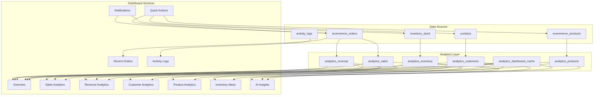
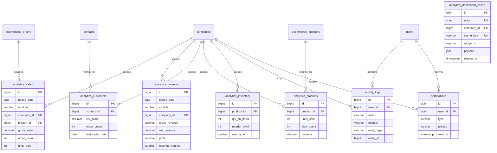

# AgainERP Ecommerce — Dashboard Architecture

> **Status:** Draft  
> **Module:** Ecommerce · Dashboard  
> **Version:** 1.0  
> **Document Type:** Enterprise Architecture  
> **Governance:** [GOVERNANCE.md](../../../00-foundation/GOVERNANCE.md) · **Standards:** [DEVELOPMENT_STANDARDS.md](../../../00-foundation/standards/DEVELOPMENT_STANDARDS.md)

**No application code.** This document is the source of truth for Dashboard design and implementation.

**Related:** [MENU_STRUCTURE.md](../MENU_STRUCTURE.md) · [UI.md](../UI.md) · [Database.md](../Database.md)

---

## Executive Summary

The Ecommerce Dashboard is the **command center** of AgainERP's online commerce operations. It aggregates real-time and historical data from Ecommerce, Inventory, Core shared entities, and (future) Sales, CRM, and Accounting into a unified, widget-based, role-aware interface.

Design principles: **mobile-first**, **API-first**, **sub-2-second load**, **multi-company/branch**, **real-time ready**, and **extensible** to platform-wide ERP dashboards without redesign.

---

# 1. Business Objectives

## Why the Dashboard Exists

The Dashboard answers one question for every stakeholder: **"How is the business performing right now, and what needs attention?"**

Without leaving the admin shell, users can:

- Monitor daily sales, revenue, and order volume
- Detect inventory risks before stockouts
- Review recent orders and take action
- Audit who did what across the system
- Receive proactive alerts and AI-driven insights
- Jump to frequent tasks via Quick Actions

## Business Decisions Enabled

| Decision Area | Dashboard Input | Example Action |
|---------------|-----------------|----------------|
| Sales performance | KPIs, Sales Analytics | Adjust pricing or promotions |
| Revenue health | Revenue Analytics | Review margin by branch |
| Customer growth | Customer Analytics | Target retention campaigns |
| Product strategy | Product Analytics | Discontinue low performers |
| Inventory ops | Inventory Alerts | Trigger purchase orders |
| Operations | Recent Orders, Activity Logs | Resolve failed payments |
| Marketing | Notifications, AI Insights | Launch recovery campaign |

## User Roles

| Role | Primary Sections | Decision Focus |
|------|------------------|----------------|
| **Super Admin** | All sections, all companies | Platform-wide health |
| **Admin** | All sections, own company | Store strategy |
| **Manager** | Overview, Analytics, Reports | Team performance |
| **Sales Team** | Sales, Revenue, Recent Orders | Order fulfillment |
| **Inventory Team** | Inventory Alerts, Product Analytics | Stock levels |
| **Marketing Team** | Customer Analytics, AI Insights | Campaigns, CLV |
| **Support Team** | Recent Orders, Activity Logs, Notifications | Customer issues |

---

# 2. Dashboard Information Architecture

## Section Map

```
Dashboard (Command Center)
│
├── Overview              ← KPI snapshot (default landing)
├── Sales Analytics       ← Trend & breakdown analysis
├── Revenue Analytics     ← Gross/net/profit & sources
├── Customer Analytics    ← Acquisition, retention, CLV
├── Product Analytics     ← Performance & stock-linked product metrics
├── Inventory Alerts      ← Proactive stock warnings
├── Recent Orders         ← Operational order grid
├── Activity Logs         ← Audit trail (Odoo-style)
├── Notifications         ← Alert center (header + panel)
├── Quick Actions         ← Role-based shortcuts
└── AI Insights           ← Forecasts & anomalies
```

## Section Relationships



## Navigation Model

| Pattern | Behavior |
|---------|----------|
| Default route | `/ecommerce/dashboard` → Overview |
| Deep links | `/ecommerce/dashboard/sales-analytics` etc. |
| Tab vs page | Overview = single scroll; Analytics = dedicated sub-pages |
| Context filters | Company, Branch, Date Range persist in session |

Screen docs: `Menus/Dashboard/*.md`

---

# 3. UI/UX Architecture

## Global Shell (All Breakpoints)

```
┌──────────────────────────────────────────────────────────────────────┐
│ Logo │ Global Search │ [Company ▼] [Branch ▼] │ 🔔 │ 🤖 AI │ 👤 User  │
├──────────┬───────────────────────────────────────────────────────────┤
│ Sidebar  │  Dashboard Content                                         │
│ (module  │                                                            │
│  nav)    │                                                            │
└──────────┴───────────────────────────────────────────────────────────┘
```

### Desktop Layout (≥ 1024px)

```
┌─────────────────────────────────────────────────────────────────────┐
│ Header: Search · Notifications · AI Assistant · Profile              │
├─────────────────────────────────────────────────────────────────────┤
│ Date Range Filter │ Company │ Branch │ [Refresh] [Customize Layout]  │
├─────────────────────────────────────────────────────────────────────┤
│ KPI ROW (4–6 cards)                                                  │
│ [Today Sales] [Orders Today] [Revenue] [New Customers] [AOV] [Conv] │
├──────────────────────────────┬──────────────────────────────────────┤
│ Sales Trend (line chart)     │ Revenue Trend (area chart)           │
├──────────────────────────────┴──────────────────────────────────────┤
│ Top Products (bar)           │ Sales by Category (donut)            │
├──────────────────────────────┬──────────────────────────────────────┤
│ Recent Orders (table)        │ Inventory Alerts (list)              │
├──────────────────────────────┴──────────────────────────────────────┤
│ Activity Feed (timeline)     │ AI Insights (cards)                  │
├─────────────────────────────────────────────────────────────────────┤
│ Quick Actions (icon buttons)                                         │
└─────────────────────────────────────────────────────────────────────┘
```

### Tablet Layout (768px – 1023px)

- Sidebar collapses to icons
- KPI cards: 2 per row
- Charts: 1 per row, full width
- Tables: horizontal scroll with sticky first column
- Quick Actions: scrollable horizontal chip bar

### Mobile Layout (< 768px)

```
┌─────────────────────┐
│ ☰  Search    🔔 🤖  │
├─────────────────────┤
│ Date · Company ▼    │
├─────────────────────┤
│ KPI (swipe carousel)│
│ ○ ○ ● ○ ○           │
├─────────────────────┤
│ Sales Trend ▼       │
├─────────────────────┤
│ Recent Orders       │
│ (card list)         │
├─────────────────────┤
│ Alerts (stacked)    │
├─────────────────────┤
│ Activity (compact)  │
├─────────────────────┤
│ Quick Actions (FAB+)│
└─────────────────────┘
```

- Bottom sheet for Notifications and AI Assistant
- Tables become card lists (order number, customer, total, status badge)
- Touch targets ≥ 44px

## UX Standards

| Standard | Application |
|----------|-------------|
| Mobile-first | [mobile-first.md](../../../04-uiux/standards/mobile-first.md) |
| Load target | < 2 seconds LCP |
| Skeleton loaders | All widgets show skeleton until data arrives |
| Empty states | Actionable CTA per widget |
| Error states | Retry button + cached stale data if available |

---

# 4. Widget Architecture

Every dashboard block is a **Widget** — independently loadable, cacheable, and permission-gated.

## Widget Contract

```typescript
// Documentation contract — not implementation code
Widget {
  id: string                    // e.g. "kpi.today_sales"
  type: WidgetType
  title: string
  permissions: string[]
  dataEndpoint: string
  refreshRule: RefreshRule
  cacheKey: string
  layout: { colSpan, rowSpan }  // responsive grid
}
```

## Widget Registry

| Widget | Type | Section |
|--------|------|---------|
| `overview.kpi` | KPI cards | Overview |
| `sales.trend` | Line chart | Sales Analytics |
| `sales.by_category` | Donut chart | Sales Analytics |
| `sales.by_brand` | Bar chart | Sales Analytics |
| `sales.top_products` | Table | Sales Analytics |
| `sales.comparison` | Dual-axis chart | Sales Analytics |
| `revenue.summary` | KPI strip | Revenue Analytics |
| `revenue.trend` | Area chart | Revenue Analytics |
| `revenue.by_source` | Stacked bar | Revenue Analytics |
| `revenue.by_branch` | Bar chart | Revenue Analytics |
| `customer.new_returning` | KPI + chart | Customer Analytics |
| `customer.top` | Table | Customer Analytics |
| `customer.segmentation` | Pie chart | Customer Analytics |
| `customer.clv` | Table | Customer Analytics |
| `product.top_selling` | Table | Product Analytics |
| `product.most_viewed` | Table | Product Analytics |
| `product.low_performing` | Table | Product Analytics |
| `product.out_of_stock` | Alert list | Product Analytics |
| `inventory.alerts` | Alert list | Inventory Alerts |
| `orders.recent` | Data grid | Recent Orders |
| `activity.feed` | Timeline | Activity Logs |
| `notifications.panel` | List | Notifications |
| `quick_actions.bar` | Action buttons | Quick Actions |
| `ai.insights` | Insight cards | AI Insights |

## Widget Specification Matrix

| Widget | Purpose | Inputs | Outputs | Data Sources | Refresh | Permission | Cache |
|--------|---------|--------|---------|--------------|---------|------------|-------|
| **Overview KPI** | At-a-glance metrics | date, company, branch | 6–8 KPI values | `analytics_dashboard_cache`, live orders | 60s / realtime orders | `ecommerce.dashboard.overview` | 60s TTL |
| **Sales Widget** | Sales trends | date range, granularity | time series, totals | `analytics_sales`, `ecommerce_orders` | 5 min | `ecommerce.dashboard.sales` | 5 min |
| **Revenue Widget** | Revenue breakdown | date, branch, source | gross, net, profit | `analytics_revenue` | 5 min | `ecommerce.dashboard.revenue` | 5 min |
| **Customer Widget** | Customer metrics | date, segment | counts, CLV | `analytics_customers`, `contacts` | 15 min | `ecommerce.dashboard.customers` | 15 min |
| **Inventory Widget** | Stock alerts | warehouse, thresholds | alert list | `analytics_inventory`, inventory module | 2 min | `ecommerce.dashboard.inventory` | 2 min |
| **Order Widget** | Recent orders | limit, status filter | order rows | `ecommerce_orders` | 30s realtime | `ecommerce.dashboard.orders` | 30s |
| **Activity Widget** | Audit feed | user, module, action | log entries | `activity_logs` (Core) | realtime | `ecommerce.dashboard.activity` | none |
| **Notification Widget** | Alerts | unread filter | notifications | `notifications` (Core) | realtime push | `ecommerce.dashboard.notifications` | none |
| **AI Widget** | Predictions | horizon days | insight cards | AI service + analytics | 1 hour | `ecommerce.dashboard.ai` | 1 hour |

## Widget Loading Strategy

1. **Critical path:** KPI row + Recent Orders (parallel fetch)
2. **Lazy load:** Charts below fold on scroll
3. **Stale-while-revalidate:** Show cached widget data, refresh in background
4. **Personalization:** User layout saved in `dashboard_user_layouts` (future)

---

# 5. Overview Section

Default landing view. Six to eight KPI cards + mini charts.

## KPI Definitions

| KPI | Formula | Database Source | Refresh | Permission |
|-----|---------|-------------------|---------|------------|
| **Today Sales** | `SUM(order_items.qty × unit_price)` where `order_date = TODAY` AND `status NOT IN (cancelled, draft)` | `ecommerce_orders` + `ecommerce_order_items` | 60s | `ecommerce.dashboard.overview` |
| **Orders Today** | `COUNT(orders)` where `order_date = TODAY` AND `status NOT IN (cancelled, draft)` | `ecommerce_orders` | 60s | same |
| **Revenue Today** | `SUM(orders.total)` same filters | `ecommerce_orders` | 60s | same |
| **New Customers** | `COUNT(contacts)` where `created_at = TODAY` AND `customer` type | `contacts` (Core) | 5 min | same |
| **Conversion Rate** | `(completed_orders / unique_sessions) × 100` | `ecommerce_orders`, `ecommerce_carts` or analytics sessions | 15 min | `ecommerce.dashboard.marketing` |
| **Average Order Value** | `Revenue Today / Orders Today` | derived | 60s | same |
| **Refund Amount** | `SUM(refunds.amount)` where `refund_date = TODAY` | `ecommerce_refunds` (Sales module) | 5 min | `ecommerce.dashboard.revenue` |

## Comparison Indicators

Each KPI shows: **value**, **% change vs yesterday**, **% change vs same day last week** (sparkline).

## Multi-Scope

| Filter | Effect |
|--------|--------|
| `company_id` | Required — all queries scoped |
| `branch_id` | Optional — filter orders by branch |
| `currency_code` | Display in company default currency |

---

# 6. Sales Analytics

Dedicated sub-page: `Menus/Dashboard/Sales Analytics.md`

## Visualizations

| Chart | Type | Data |
|-------|------|------|
| Sales Trend Graph | Line / area | Daily/weekly/monthly revenue & units |
| Sales by Category | Donut | `SUM` by `ecommerce_categories` |
| Sales by Brand | Horizontal bar | `SUM` by `ecommerce_brands` |
| Top Selling Products | Sortable table | Top 20 by units/revenue |
| Sales Comparison | Dual line | Current vs previous period |

## Database Sources

| Metric | Primary Tables |
|--------|----------------|
| Order revenue | `ecommerce_orders`, `ecommerce_order_items` |
| Category breakdown | `ecommerce_order_items` → `ecommerce_products` → `ecommerce_categories` |
| Brand breakdown | `ecommerce_order_items` → `ecommerce_products` → `ecommerce_brands` |
| Pre-aggregated | `analytics_sales` (daily grain) |

## API Endpoints

| Method | Endpoint | Description |
|--------|----------|-------------|
| GET | `/api/v1/ecommerce/dashboard/sales/trend` | Time series |
| GET | `/api/v1/ecommerce/dashboard/sales/by-category` | Category breakdown |
| GET | `/api/v1/ecommerce/dashboard/sales/by-brand` | Brand breakdown |
| GET | `/api/v1/ecommerce/dashboard/sales/top-products` | Top products |
| GET | `/api/v1/ecommerce/dashboard/sales/comparison` | Period comparison |

## Filters

- Date range: today, yesterday, 7d, 30d, 90d, custom, YoY
- Company, branch, channel (web, pos)
- Order status group: confirmed+

## Caching

- Aggregated responses: 5 min TTL in `analytics_dashboard_cache`
- Cache key: `sales:{company_id}:{branch_id}:{date_from}:{date_to}:{granularity}`

---

# 7. Revenue Analytics

## Metrics

| Metric | Formula | Tables |
|--------|---------|--------|
| **Gross Revenue** | `SUM(orders.subtotal + shipping + tax)` before discounts | `ecommerce_orders` |
| **Net Revenue** | `Gross - discounts - refunds` | `ecommerce_orders`, `ecommerce_refunds` |
| **Profit** | `Net Revenue - COGS` | orders + `inventory` cost (future Accounting) |
| **Revenue Trend** | Net revenue over time | `analytics_revenue` |
| **Revenue by Source** | Group by `order_source` (web, pos, marketplace) | `ecommerce_orders` |
| **Revenue by Branch** | Group by `branch_id` | `ecommerce_orders`, `branches` |
| **Revenue by Company** | Group by `company_id` | `ecommerce_orders`, `companies` |

## Relationships

```
ecommerce_orders
├── company_id → companies
├── branch_id → branches
├── ecommerce_order_items → product cost (COGS)
└── ecommerce_payment_transactions → payment method (source detail)
```

## API

| Method | Endpoint |
|--------|----------|
| GET | `/api/v1/ecommerce/dashboard/revenue/summary` |
| GET | `/api/v1/ecommerce/dashboard/revenue/trend` |
| GET | `/api/v1/ecommerce/dashboard/revenue/by-source` |
| GET | `/api/v1/ecommerce/dashboard/revenue/by-branch` |

---

# 8. Customer Analytics

## Metrics

| Metric | Calculation | Source |
|--------|-------------|--------|
| **New Customers** | Contacts created in period with type `customer` | `contacts` |
| **Returning Customers** | Customers with >1 order in period | `ecommerce_orders` + `contacts` |
| **Top Customers** | Rank by `SUM(order.total)` | orders + contacts |
| **Segmentation** | RFM or group-based | `ecommerce_customer_groups`, order history |
| **Customer Locations** | Group by `addresses.country_code`, `city` | `addresses` (Core) |
| **Customer Lifetime Value (CLV)** | `AVG(order total) × purchase frequency × lifespan` | `analytics_customers` |

## CLV Formula (v1)

```
CLV = (Average Order Value) × (Orders per Year) × (Customer Lifespan Years)

Stored in analytics_customers.clv_score per contact_id, recalculated nightly.
```

## API

| Method | Endpoint |
|--------|----------|
| GET | `/api/v1/ecommerce/dashboard/customers/summary` |
| GET | `/api/v1/ecommerce/dashboard/customers/top` |
| GET | `/api/v1/ecommerce/dashboard/customers/segmentation` |
| GET | `/api/v1/ecommerce/dashboard/customers/locations` |
| GET | `/api/v1/ecommerce/dashboard/customers/clv` |

---

# 9. Product Analytics

## Metrics

| Metric | Definition | Query Basis |
|--------|------------|-------------|
| **Top Selling** | Highest units sold in period | `ecommerce_order_items` GROUP BY product |
| **Most Viewed** | Highest `view_count` | `ecommerce_product_views` (analytics table) |
| **Highest Revenue** | Highest `SUM(line_total)` | order items |
| **Low Performing** | Bottom 10% by revenue with stock > 0 | combined ranking |
| **Out Of Stock** | `stock_qty <= 0` OR `status = out_of_stock` | inventory + products |

## Dependencies

- `ecommerce_products`, `ecommerce_product_variants`
- `ecommerce_order_items`
- Inventory module: `inventory_stock_levels`
- `analytics_products` (nightly aggregation)

## API

| Method | Endpoint |
|--------|----------|
| GET | `/api/v1/ecommerce/dashboard/products/top-selling` |
| GET | `/api/v1/ecommerce/dashboard/products/most-viewed` |
| GET | `/api/v1/ecommerce/dashboard/products/highest-revenue` |
| GET | `/api/v1/ecommerce/dashboard/products/low-performing` |
| GET | `/api/v1/ecommerce/dashboard/products/out-of-stock` |

---

# 10. Inventory Alerts

## Alert Types

| Alert | Business Rule | Trigger |
|-------|---------------|---------|
| **Low Stock** | `qty <= reorder_level` AND `qty > 0` | Stock update, order placement |
| **Out Of Stock** | `qty <= 0` | Stock hits zero |
| **Over Stock** | `qty > max_stock_level` | Receiving, adjustment |
| **Pending Transfers** | Transfer `status = in_transit` | Transfer created |
| **Incoming Stock** | PO `expected_date` within 7 days | Purchase module (future) |

## Notification Rules

| Severity | Condition | Channel |
|----------|-----------|---------|
| Critical | Out of stock on active product | In-app + email |
| High | Low stock on top-20 seller | In-app |
| Medium | Over stock | In-app |
| Low | Pending transfer reminder | In-app |

## API

| Method | Endpoint |
|--------|----------|
| GET | `/api/v1/ecommerce/dashboard/inventory/alerts` |
| GET | `/api/v1/ecommerce/dashboard/inventory/alerts/summary` |

Data source: `analytics_inventory` refreshed every 2 minutes via background job.

---

# 11. Recent Orders

## Order Grid

| Column | Type | Sortable | Mobile |
|--------|------|----------|--------|
| Order # | link | yes | yes |
| Date | datetime | yes | yes |
| Customer | link → contact | yes | yes |
| Items | count | no | hide |
| Total | money | yes | yes |
| Payment | badge | yes | yes |
| Status | badge | yes | yes |
| Branch | text | yes | hide |
| Actions | menu | no | swipe |

## Status Badges

| Status | Color | Icon |
|--------|-------|------|
| pending | yellow | clock |
| confirmed | blue | check |
| processing | blue | gear |
| shipped | purple | truck |
| delivered | green | check-circle |
| cancelled | red | x |
| refunded | gray | return |

## Actions (row)

| Action | Permission | Result |
|--------|------------|--------|
| View | `ecommerce.order.read` | Open order detail |
| Edit | `ecommerce.order.write` | Edit order |
| Print Invoice | `ecommerce.order.export` | PDF |
| Change Status | `ecommerce.order.write` | Status modal |

## Filters

Status, date range, customer, payment method, branch, amount range.

## API

| Method | Endpoint |
|--------|----------|
| GET | `/api/v1/ecommerce/dashboard/orders/recent` |

Parameters: `limit`, `status[]`, `date_from`, `date_to`, `branch_id`, `sort`, `page`

---

# 12. Activity Logs

Odoo-style **audit trail** — automatic system logging (distinct from user-scheduled `activities` table).

## Tracked Actions

| Action | Module Event |
|--------|--------------|
| create | Record created |
| edit | Record updated (field diff) |
| delete | Soft delete |
| login | User authenticated |
| logout | Session ended |
| export | Data exported |
| import | Bulk import completed |
| view | Sensitive record viewed (optional) |

## Stored Fields (`activity_logs` — Core)

| Field | Type | Description |
|-------|------|-------------|
| `id` | BIGINT | PK |
| `uuid` | UUID | Public ID |
| `company_id` | FK | Scope |
| `user_id` | FK | Actor |
| `action` | VARCHAR | create, edit, delete, login, … |
| `module` | VARCHAR | ecommerce, core, sales |
| `entity_type` | VARCHAR | Model name |
| `entity_id` | BIGINT | Record ID |
| `entity_label` | VARCHAR | Human label ("Order #1042") |
| `ip_address` | VARCHAR | Client IP |
| `user_agent` | TEXT | Browser string |
| `device_type` | VARCHAR | mobile, tablet, desktop |
| `browser` | VARCHAR | Parsed browser |
| `payload` | JSON | Changed fields, metadata |
| `created_at` | TIMESTAMP | When |

## Retention Policy

| Tier | Retention | Storage |
|------|-----------|---------|
| Hot | 90 days | Primary DB |
| Warm | 1 year | Archive table |
| Cold | 7 years | Object storage (compliance) |

## Filtering (Dashboard UI)

User, date range, module, action type, entity type, IP, free text search on `entity_label`.

## API

| Method | Endpoint |
|--------|----------|
| GET | `/api/v1/core/activity-logs` |
| GET | `/api/v1/ecommerce/dashboard/activity` |

Filter defaults to `module=ecommerce` on Ecommerce dashboard.

---

# 13. Notification Center

## Categories

| Category | Examples | Priority |
|----------|----------|----------|
| **System** | Update available, backup complete | low |
| **Order** | New order, payment failed | high |
| **Inventory** | Low stock, out of stock | critical |
| **Marketing** | Campaign ended, coupon limit | medium |

## States

- Unread / Read
- Archived
- Pinned (user)

## Delivery Channels

| Channel | v1 | v2 |
|---------|----|----|
| In-app | ✓ | ✓ |
| Email | ✓ | ✓ |
| SMS | — | ✓ |
| WhatsApp | — | ✓ |
| Push | — | ✓ |

## Table: `notifications` (Core)

| Field | Description |
|-------|-------------|
| `user_id` | Recipient |
| `type` | order, inventory, system, marketing |
| `priority` | low, medium, high, critical |
| `title` | Short title |
| `body` | Message |
| `action_url` | Deep link |
| `read_at` | Null = unread |
| `data` | JSON payload |

## API

| Method | Endpoint |
|--------|----------|
| GET | `/api/v1/core/notifications` |
| PATCH | `/api/v1/core/notifications/{uuid}/read` |
| POST | `/api/v1/core/notifications/read-all` |
| GET | `/api/v1/core/notifications/unread-count` |

---

# 14. Quick Actions

Role-based shortcut bar. Customizable per user (future).

## Default Actions

| Action | Route | Permission | Roles |
|--------|-------|------------|-------|
| Add Product | `/ecommerce/catalog/products/add` | `ecommerce.product.write` | Admin, Manager |
| Add Category | `/ecommerce/catalog/categories` | `ecommerce.category.write` | Admin, Manager |
| Create Order | `/ecommerce/sales/orders/create` | `ecommerce.order.write` | Admin, Sales |
| Create Customer | `/ecommerce/customers` | `core.contact.write` | Admin, Sales, Support |
| Generate Report | `/ecommerce/reports` | `ecommerce.report.read` | Admin, Manager |

## Customization (v2)

- User drags actions to Quick Action bar
- Saved in `dashboard_user_preferences.quick_actions` JSON

## API

| Method | Endpoint |
|--------|----------|
| GET | `/api/v1/ecommerce/dashboard/quick-actions` |
| PUT | `/api/v1/ecommerce/dashboard/quick-actions` |

Returns actions filtered by current user's effective permissions.

---

# 15. AI Insights

## Insight Types (v1 roadmap)

| Insight | Data Sources | Output |
|---------|--------------|--------|
| **Sales Forecast** | `analytics_sales` (90d history) | 7/30 day projection |
| **Inventory Forecast** | sales velocity + stock levels | Reorder suggestions |
| **Customer Insights** | CLV, segments, churn signals | At-risk customer list |
| **Product Recommendations** | co-purchase patterns | Upsell pairs |
| **Anomaly Detection** | revenue, orders, refunds z-score | Alert cards |

## AI Workflow

```
1. Nightly: ETL → analytics_* tables
2. Scheduled: AI service reads aggregates (not raw PII)
3. AI generates insight records → ai_insights table
4. Dashboard AI Widget fetches pre-computed insights
5. User clicks insight → deep link to relevant screen
```

## AI Data Boundaries

- AI service receives **aggregated metrics** and **anonymized IDs**
- No raw passwords, payment card data, or full PII in AI prompts
- Permission: `ecommerce.dashboard.ai` required
- AI actions that modify data require explicit user confirmation

## Future AI Architecture

```
┌─────────────┐     ┌──────────────┐     ┌─────────────┐
│  Dashboard  │────►│  AI Gateway  │────►│  LLM / ML   │
│  AI Widget  │     │  (Core)      │     │  Models     │
└─────────────┘     └──────────────┘     └─────────────┘
                           │
                    analytics_* + module APIs
```

## API

| Method | Endpoint |
|--------|----------|
| GET | `/api/v1/ecommerce/dashboard/ai/insights` |
| GET | `/api/v1/ecommerce/dashboard/ai/forecast/sales` |
| GET | `/api/v1/ecommerce/dashboard/ai/forecast/inventory` |

---

# 16. Database Architecture

## Table Ownership

| Table | Owner | Purpose |
|-------|-------|---------|
| `analytics_dashboard_cache` | Core | Widget response cache |
| `analytics_sales` | Core | Sales fact table |
| `analytics_revenue` | Core | Revenue fact table |
| `analytics_customers` | Core | Customer metrics |
| `analytics_products` | Core | Product metrics |
| `analytics_inventory` | Core | Inventory snapshot |
| `activity_logs` | Core | Audit trail |
| `notifications` | Core | User notifications |
| `ai_insights` | Core | Pre-computed AI cards |
| `dashboard_user_preferences` | Core | Layout, quick actions |

All analytics tables include `module` column (`ecommerce`, `sales`, `crm`, …) for platform expansion.

## Entity Relationship Diagram



## `analytics_dashboard_cache` Schema

| Column | Type | Notes |
|--------|------|-------|
| `cache_key` | VARCHAR(255) | Unique per company+widget+filters |
| `widget_id` | VARCHAR(100) | e.g. `sales.trend` |
| `module` | VARCHAR(50) | `ecommerce` |
| `payload` | JSON | Cached API response |
| `expires_at` | TIMESTAMP | TTL enforcement |

## Aggregation Jobs

| Job | Schedule | Writes To |
|-----|----------|-----------|
| `AggregateSalesDaily` | Daily 00:15 | `analytics_sales` |
| `AggregateRevenueDaily` | Daily 00:20 | `analytics_revenue` |
| `AggregateCustomers` | Daily 01:00 | `analytics_customers` |
| `AggregateProducts` | Daily 01:15 | `analytics_products` |
| `SnapshotInventory` | Every 2 min | `analytics_inventory` |
| `WarmDashboardCache` | Every 5 min | `analytics_dashboard_cache` |

---

# 17. API Architecture

Base: `/api/v1/ecommerce/dashboard/`  
Auth: Bearer token · Header: `X-Company-Id`, optional `X-Branch-Id`

## Endpoint Catalog

| Method | Endpoint | Purpose | Cache TTL |
|--------|----------|---------|-----------|
| GET | `/overview` | All KPIs | 60s |
| GET | `/overview/kpis` | KPI subset | 60s |
| GET | `/sales/trend` | Sales time series | 5m |
| GET | `/sales/by-category` | Category breakdown | 5m |
| GET | `/sales/by-brand` | Brand breakdown | 5m |
| GET | `/sales/top-products` | Top products | 5m |
| GET | `/sales/comparison` | Period compare | 5m |
| GET | `/revenue/summary` | Revenue KPIs | 5m |
| GET | `/revenue/trend` | Revenue series | 5m |
| GET | `/revenue/by-source` | By channel | 5m |
| GET | `/revenue/by-branch` | By branch | 5m |
| GET | `/customers/summary` | Customer KPIs | 15m |
| GET | `/customers/top` | Top customers | 15m |
| GET | `/customers/segmentation` | Segments | 15m |
| GET | `/customers/locations` | Geo breakdown | 15m |
| GET | `/customers/clv` | CLV table | 15m |
| GET | `/products/top-selling` | Top sellers | 5m |
| GET | `/products/most-viewed` | Most viewed | 15m |
| GET | `/products/low-performing` | Low performers | 15m |
| GET | `/products/out-of-stock` | OOS list | 2m |
| GET | `/inventory/alerts` | All alerts | 2m |
| GET | `/orders/recent` | Order grid | 30s |
| GET | `/activity` | Activity logs | none |
| GET | `/quick-actions` | User actions | 1h |
| GET | `/ai/insights` | AI cards | 1h |
| GET | `/layout` | User widget layout | — |
| PUT | `/layout` | Save layout | — |

## Standard Parameters

| Param | Type | Description |
|-------|------|-------------|
| `date_from` | date | Range start |
| `date_to` | date | Range end |
| `granularity` | enum | hour, day, week, month |
| `branch_id` | uuid | Branch filter |
| `compare` | enum | previous_period, yoy |

## Response Envelope

```json
{
  "data": { },
  "meta": {
    "cached": true,
    "cached_at": "2026-06-12T10:00:00Z",
    "ttl_seconds": 300,
    "filters": { }
  },
  "errors": []
}
```

## Versioning

- v1: current paths
- Breaking changes → `/api/v2/ecommerce/dashboard/`
- Widget IDs stable across versions

---

# 18. Permission Architecture

## Permission Keys

| Key | Description |
|-----|-------------|
| `ecommerce.dashboard.access` | Enter dashboard |
| `ecommerce.dashboard.overview` | Overview KPIs |
| `ecommerce.dashboard.sales` | Sales Analytics |
| `ecommerce.dashboard.revenue` | Revenue Analytics |
| `ecommerce.dashboard.customers` | Customer Analytics |
| `ecommerce.dashboard.products` | Product Analytics |
| `ecommerce.dashboard.inventory` | Inventory Alerts |
| `ecommerce.dashboard.orders` | Recent Orders |
| `ecommerce.dashboard.activity` | Activity Logs |
| `ecommerce.dashboard.notifications` | Notifications |
| `ecommerce.dashboard.ai` | AI Insights |
| `ecommerce.dashboard.customize` | Customize layout |

## Access Matrix

| Section | Super Admin | Admin | Manager | Sales | Inventory | Marketing | Support |
|---------|:-----------:|:-----:|:-------:|:-----:|:---------:|:---------:|:-------:|
| Overview | ✓ | ✓ | ✓ | ✓ | ✓ | ✓ | ✓ |
| Sales Analytics | ✓ | ✓ | ✓ | ✓ | — | ✓ | — |
| Revenue Analytics | ✓ | ✓ | ✓ | — | — | — | — |
| Customer Analytics | ✓ | ✓ | ✓ | — | — | ✓ | ✓ |
| Product Analytics | ✓ | ✓ | ✓ | — | ✓ | ✓ | — |
| Inventory Alerts | ✓ | ✓ | ✓ | — | ✓ | — | — |
| Recent Orders | ✓ | ✓ | ✓ | ✓ | — | — | ✓ |
| Activity Logs | ✓ | ✓ | ✓ | — | — | — | — |
| Notifications | ✓ | ✓ | ✓ | ✓ | ✓ | ✓ | ✓ |
| Quick Actions | ✓ | ✓ | ✓ | role-filtered | role-filtered | role-filtered | role-filtered |
| AI Insights | ✓ | ✓ | ✓ | — | — | ✓ | — |

Record rules: users see only data within their `company_id`; branch-restricted users filter by assigned branches.

---

# 19. Performance Architecture

## Target: Dashboard Load < 2 Seconds

| Phase | Target | Technique |
|-------|--------|-----------|
| First paint | < 500ms | Shell HTML + CSS, skeleton widgets |
| KPI visible | < 1s | Cached overview endpoint |
| Full dashboard | < 2s | Parallel widget fetch + lazy charts |

## Caching Layers

```
L1  Browser     → Cache-Control headers on static assets
L2  CDN         → Static JS/CSS
L3  Redis       → analytics_dashboard_cache, API responses
L4  DB          → analytics_* pre-aggregated tables
```

## Background Processing

| Queue | Jobs |
|-------|------|
| `analytics` | Daily aggregation, cache warming |
| `notifications` | Alert delivery |
| `ai` | Insight generation |

## Lazy Loading

- Charts below fold: Intersection Observer triggers fetch
- Activity log: paginated infinite scroll
- Recent orders: initial 10 rows, load more on scroll

## Real-Time (v2)

- WebSocket channel: `dashboard:{company_id}`
- Events: `order.created`, `inventory.alert`, `notification.new`
- Widgets subscribe and patch local state

---

# 20. Future Expansion

## Platform Dashboard Vision

The widget system is **module-agnostic**. Future modules plug in without redesign:

| Module | Widget Examples | `module` value |
|--------|-----------------|----------------|
| CRM | Pipeline value, new leads | `crm` |
| Sales | Quotations pending | `sales` |
| Purchase | POs awaiting approval | `purchase` |
| Inventory | Warehouse utilization | `inventory` |
| Accounting | Cash flow, receivables | `accounting` |
| POS | Today's POS sales | `pos` |
| HR | Attendance today | `hr` |
| Project | Tasks overdue | `project` |
| Helpdesk | Open tickets | `helpdesk` |
| AI | Cross-module insights | `ai` |

## Extension Points

| Extension | Mechanism |
|-----------|-----------|
| New widget | Register in widget registry with `module` tag |
| New KPI | Add to `analytics_*` + overview API |
| New alert type | Event listener → `notifications` |
| New quick action | Permission-gated config |
| Company dashboard | Switch `company_id` context |
| Executive dashboard | Multi-company rollup (Super Admin) |

## What Does NOT Change

- Widget contract (inputs, outputs, permissions, cache)
- API envelope format
- Core analytics table pattern
- Permission namespace pattern `{module}.dashboard.*`
- Mobile-first layout grid

---

## Document Index

| Dashboard Screen | Doc |
|------------------|-----|
| Overview | [Menus/Dashboard/Overview.md](../Menus/Dashboard/Overview.md) |
| Sales Analytics | [Menus/Dashboard/Sales Analytics.md](../Menus/Dashboard/Sales Analytics.md) |
| Revenue Analytics | [Menus/Dashboard/Revenue Analytics.md](../Menus/Dashboard/Revenue Analytics.md) |
| Customer Analytics | [Menus/Dashboard/Customer Analytics.md](../Menus/Dashboard/Customer Analytics.md) |
| Product Analytics | [Menus/Dashboard/Product Analytics.md](../Menus/Dashboard/Product Analytics.md) |
| Inventory Alerts | [Menus/Dashboard/Inventory Alerts.md](../Menus/Dashboard/Inventory Alerts.md) |
| Recent Orders | [Menus/Dashboard/Recent Orders.md](../Menus/Dashboard/Recent Orders.md) |
| Activity Logs | [Menus/Dashboard/Activity Logs.md](../Menus/Dashboard/Activity Logs.md) |

---

**Module:** Ecommerce · Dashboard  
**Last Updated:** 2026-06-12  
**Author:** —  
**Reviewers:** —  
**Status:** Draft — requires approval before implementation
