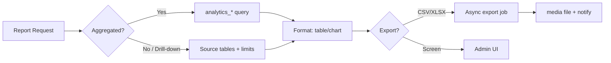

# AgainERP — Reports Module Architecture

> **Status:** Draft  
> **Module:** Reports (Ecommerce domain · Analytics-backed)  
> **Version:** 1.0  
> **Document Type:** Enterprise Architecture  
> **Governance:** [GOVERNANCE.md](../../../00-foundation/GOVERNANCE.md) · **Standards:** [DEVELOPMENT_STANDARDS.md](../../../00-foundation/standards/DEVELOPMENT_STANDARDS.md)

**No application code.** Source of truth for Ecommerce Reports design.

**Related:** [analytics/ARCHITECTURE.md](../analytics/ARCHITECTURE.md) · [dashboard/ARCHITECTURE.md](../dashboard/ARCHITECTURE.md) · [orders/ARCHITECTURE.md](../orders/ARCHITECTURE.md)  
**UI menus:** `Menus/Reports/`

---

## Executive Summary

The **Reports** module is AgainERP's **operational and analytical reporting layer** for ecommerce. It delivers exportable, schedulable reports across sales, products, customers, inventory, marketing, tax, and profit — powered by the `analytics_*` aggregation layer and on-demand queries against source tables.

| Connects To | Integration |
|-------------|-------------|
| **Analytics** | Pre-aggregated `analytics_*` tables |
| **Orders** | `commerce_orders` detail drill-down |
| **Catalog** | Product dimension |
| **Inventory** | Stock valuation reports |
| **Marketing** | Campaign ROI |
| **Core Reporting Engine** | Platform report framework (future) |

### Scale Targets

| Dimension | Target |
|-----------|--------|
| Report rows exported | 10M+ (streaming) |
| Scheduled reports | 10,000 per tenant |
| Standard report load | < 3s (aggregated) |
| Custom report query timeout | 60s max |

**Primary data source:** `analytics_*` tables (read-optimized)

---

# Module Mission

## Why Reports Exists

Dashboards show KPIs; Reports answer **auditable, exportable questions** for finance, operations, and marketing. Reports module provides:

- Pre-built report templates per domain
- Date/branch/warehouse filters
- CSV/Excel/PDF export
- Scheduled email delivery
- Drill-down to source records

```
Source tables → Analytics aggregations → Report queries → Export / Schedule
```

Heavy reports never scan raw `commerce_orders` at 1M+ scale without aggregation.

---

# Module Structure

```
Reports
├── Sales Reports               ← Revenue, orders, AOV by period
├── Product Reports             ← Units sold, revenue by SKU
├── Category Reports            ← Performance by category tree
├── Brand Reports               ← Performance by brand
├── Customer Reports            ← CLV, repeat rate, segments
├── Marketing Reports           ← Campaign, coupon, affiliate ROI
├── Inventory Reports           ← Stock valuation, turnover, aging
├── Return Reports              ← Return rate, reasons
├── Profit Reports              ← Gross/net margin analysis
├── Tax Reports                 ← Tax collected by zone/class
├── Affiliate Reports           ← Commissions, conversions
├── SEO Reports                 ← Organic traffic, audit trends
├── AI Reports                  ← AI-generated insights export
└── Custom Reports              ← User-defined columns & filters (v2)
```

Screen docs: `Menus/Reports/`

---

# Report Categories

## Sales Reports

| Report | Metrics | Data Source |
|--------|---------|-------------|
| Sales Summary | orders, revenue, AOV | `analytics_sales` |
| Sales by Channel | web, pos, admin | `analytics_sales` + `source` |
| Sales by Branch | branch breakdown | `analytics_sales` |
| Sales by Payment Method | method mix | `commerce_order_payments` agg |
| Daily / Weekly / Monthly | time series | `analytics_sales` |
| Hourly Heatmap | peak hours | `analytics_sales_hourly` |

## Product Reports

| Report | Metrics | Data Source |
|--------|---------|-------------|
| Best Sellers | units, revenue | `analytics_products` |
| Slow Movers | low velocity SKUs | `analytics_products` |
| Product Profitability | margin per SKU | `analytics_products` + cost |
| Category Performance | rollup by category | `analytics_products` + catalog |
| Brand Performance | by brand | `analytics_products` |

## Customer Reports

| Report | Metrics | Data Source |
|--------|---------|-------------|
| Customer List | orders, spend, last order | `analytics_customers` |
| New vs Returning | acquisition | `analytics_customers` |
| RFM Segments | recency, frequency, monetary | `analytics_customers` |
| Customer Lifetime Value | CLV distribution | `analytics_customers` |
| Geographic | by city/region | addresses agg |

## Inventory Reports

| Report | Metrics | Data Source |
|--------|---------|-------------|
| Stock Valuation | qty × cost | `analytics_inventory` |
| Low Stock | below threshold | `analytics_inventory` |
| Stock Movement | in/out summary | `inventory_movements` agg |
| Turnover Rate | days of supply | computed |
| Dead Stock | no sales 90d | `analytics_inventory` |

## Marketing Reports

| Report | Metrics | Data Source |
|--------|---------|-------------|
| Coupon Performance | redemptions, discount $ | `marketing_coupon_usages` agg |
| Campaign ROI | spend vs attributed revenue | `analytics_marketing` |
| Affiliate Performance | clicks, conversions, commission | `marketing_affiliate_*` agg |
| Abandoned Cart Recovery | recovery rate | `marketing_abandoned_cart_sends` |
| Email/SMS Stats | open, click, delivery | `marketing_*_sends` agg |

## Tax & Profit Reports

| Report | Metrics | Data Source |
|--------|---------|-------------|
| Tax Collected | by tax class, zone | `analytics_tax` |
| Tax Summary | period totals | `analytics_tax` |
| Gross Profit | revenue − COGS | `analytics_revenue` |
| Net Profit | after discounts, shipping | `analytics_revenue` |
| Margin by Product | per-SKU margin | `analytics_products` |

## Return Reports

| Report | Metrics | Data Source |
|--------|---------|-------------|
| Return Rate | by product, period | `commerce_order_returns` agg |
| Return Reasons | reason code breakdown | return items |
| Refund Summary | amounts by method | `commerce_order_refunds` |

---

# Analytics Tables (Read Layer)

Reports **prefer** pre-aggregated tables from [analytics/ARCHITECTURE.md](../analytics/ARCHITECTURE.md):

| Table | Granularity | Contents |
|-------|-------------|----------|
| `analytics_sales` | daily × branch × channel | orders, revenue, AOV |
| `analytics_sales_hourly` | hourly | peak analysis |
| `analytics_revenue` | daily | gross, net, profit, discounts |
| `analytics_products` | daily × product/variant | units, revenue, views |
| `analytics_customers` | per contact | CLV, order_count, last_order |
| `analytics_inventory` | daily snapshot | qty, valuation, alerts |
| `analytics_marketing` | daily × campaign | spend, attributed revenue |
| `analytics_tax` | daily × tax_class | tax collected |
| `analytics_seo` | daily | organic sessions, rankings (v2) |

## Report-Specific Tables

| Table | Purpose |
|-------|---------|
| `analytics_report_definitions` | Saved custom report configs |
| `analytics_report_runs` | Execution log |
| `analytics_report_schedules` | Cron schedules |
| `analytics_report_exports` | Generated file metadata |

---

# Report Execution Model



| Mode | When |
|------|------|
| **Live (aggregated)** | Standard reports < 3s |
| **Async export** | > 10k rows or full export |
| **Drill-down** | Click row → source record list |

---

# Filters & Parameters

Common parameters across reports:

| Parameter | Type | Notes |
|-----------|------|-------|
| `date_from`, `date_to` | date | Required |
| `company_id` | FK | Auto from session |
| `branch_id` | FK | Optional multi-select |
| `warehouse_id` | FK | Inventory reports |
| `currency_code` | | Multi-currency |
| `compare_period` | | YoY, MoM comparison |
| `group_by` | enum | day, week, month |

Saved filter presets per user in `analytics_report_definitions`.

---

# Scheduling & Delivery

**Table:** `analytics_report_schedules`

| Field | Notes |
|-------|-------|
| `report_type` | sales_summary, tax_collected, … |
| `cron_expression` | `0 6 * * 1` weekly Monday 6am |
| `recipients` | JSON user emails |
| `format` | pdf, xlsx, csv |
| `filters` | JSON default filters |

Cron job `RunScheduledReports` → generate → attach to email via Core Notification.

---

# System Events

| Event | Payload | Subscribers |
|-------|---------|-------------|
| `reports.export.completed` | `run_id`, `file_media_id` | Notification |
| `reports.export.failed` | `run_id`, `error` | Notification, retry |
| `reports.schedule.executed` | `schedule_id` | Activity log |
| `analytics.aggregation.completed` | `table`, `date` | Report cache warm |

---

# API Architecture

Base: `/api/v1/ecommerce/reports/`  
Auth: Bearer + `X-Company-Id`

| Method | Endpoint | Permission |
|--------|----------|------------|
| GET | `/sales` | `ecommerce.report.sales` |
| GET | `/products` | `ecommerce.report.product` |
| GET | `/customers` | `ecommerce.report.customer` |
| GET | `/inventory` | `ecommerce.report.inventory` |
| GET | `/marketing` | `ecommerce.report.marketing` |
| GET | `/tax` | `ecommerce.report.tax` |
| GET | `/profit` | `ecommerce.report.profit` |
| GET | `/returns` | `ecommerce.report.return` |
| POST | `/export` | `ecommerce.report.export` |
| GET | `/exports/{uuid}` | `ecommerce.report.export` |
| GET/POST | `/schedules` | `ecommerce.report.schedule` |

Query params: standard filters + `format=json|csv|xlsx`.

---

# Permissions

| Key | Description |
|-----|-------------|
| `ecommerce.report.access` | Module access |
| `ecommerce.report.sales` | Sales reports |
| `ecommerce.report.product` | Product reports |
| `ecommerce.report.customer` | Customer reports |
| `ecommerce.report.inventory` | Inventory reports |
| `ecommerce.report.marketing` | Marketing reports |
| `ecommerce.report.tax` | Tax reports |
| `ecommerce.report.profit` | Profit reports (sensitive) |
| `ecommerce.report.export` | Export data |
| `ecommerce.report.schedule` | Schedule reports |

Profit and tax reports restricted to Finance role by default.

---

# Performance Requirements

| Requirement | Strategy |
|-------------|----------|
| Fast standard reports | Query `analytics_*` only |
| Large exports | Streaming CSV, background job |
| Report cache | Redis 15m TTL per filter hash |
| Custom reports v2 | Read replica, query builder with limits |

---

# Dependencies

- **Analytics:** [analytics/ARCHITECTURE.md](../analytics/ARCHITECTURE.md)
- **Ecommerce:** [orders/ARCHITECTURE.md](../orders/ARCHITECTURE.md), [catalog/ARCHITECTURE.md](../catalog/ARCHITECTURE.md), [inventory/ARCHITECTURE.md](../inventory/ARCHITECTURE.md), [marketing/ARCHITECTURE.md](../marketing/ARCHITECTURE.md), [customers/ARCHITECTURE.md](../customers/ARCHITECTURE.md), [seo/ARCHITECTURE.md](../seo/ARCHITECTURE.md)
- **Core:** Reporting Engine, Notification System, [media-library](../../../02-core-platform/entities/media-library.md) (export files)
- **Dashboard:** Shared `analytics_*` — different presentation layer

---

## Document Index

| Screen | Menu Doc |
|--------|----------|
| Sales Reports | [Menus/Reports/Sales Reports.md](../Menus/Reports/Sales Reports.md) |
| Profit Reports | [Menus/Reports/Profit Reports.md](../Menus/Reports/Profit Reports.md) |
| Full menu | [MENU_STRUCTURE.md](../MENU_STRUCTURE.md) |

---

**Module:** Reports  
**Last Updated:** 2026-06-12  
**Status:** Draft — requires approval before implementation
