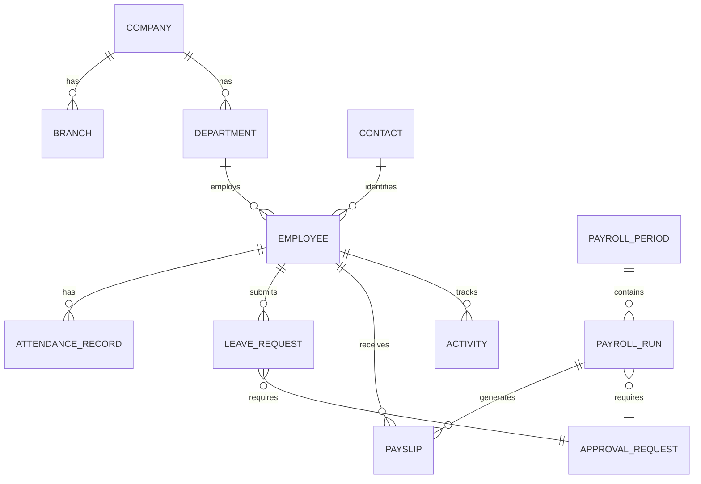

# HR & Payroll — Database ERD Planning

> **Status:** Draft (Planning)  
> **Version:** 1.0  
> **Module:** HR & Payroll (unified enterprise suite)  
> **Document Type:** Entity Relationship Planning (Conceptual & Logical)  
> **Phase:** Documentation First · Planning Only  
> **Parent:** [HR_DATABASE_ARCHITECTURE.md](./HR_DATABASE_ARCHITECTURE.md) · [HR_PAYROLL_MASTER_ARCHITECTURE.md](./HR_PAYROLL_MASTER_ARCHITECTURE.md)  
> **Governance:** [MASTER_DATABASE_ARCHITECTURE.md](../../05-development/database/MASTER_DATABASE_ARCHITECTURE.md) · [multi-company.md](../../05-development/database/multi-company.md) · [ACTIVITY_CHATTER_ARCHITECTURE.md](../../02-core-platform/subsystems/ACTIVITY_CHATTER_ARCHITECTURE.md) · [APPROVAL_ENGINE_ARCHITECTURE.md](../../02-core-platform/engines/APPROVAL_ENGINE_ARCHITECTURE.md) · [NOTIFICATION_ENGINE_ARCHITECTURE.md](../../02-core-platform/engines/NOTIFICATION_ENGINE_ARCHITECTURE.md) · [PERMISSION_SYSTEM_ARCHITECTURE.md](../../02-core-platform/PERMISSION_SYSTEM_ARCHITECTURE.md) · [WORKFLOW_ENGINE_ARCHITECTURE.md](../../02-core-platform/engines/WORKFLOW_ENGINE_ARCHITECTURE.md)

**No SQL. No migrations. No physical database design.**  
Defines **conceptual and logical entity relationships** for AgainERP HR & Payroll — the foundation for physical database design, API contracts, workflow bindings, analytics models, and AI read models.

---

## Executive Summary

| Principle | Rule |
|-----------|------|
| **Identity in Core** | Person = Core Contact; Employment = Employee Master |
| **Bounded contexts** | HR owns workforce/time; Payroll owns compensation |
| **Core engines** | Activity, Approval, Notification, Permission — not duplicated |
| **Logical links** | Cross-module = UUID reference + events, not transactional FK |
| **Versioned masters** | Org assignment, salary, policies use effective dating |
| **Immutable facts** | Locked payroll and posted payslips are append-only |

```text
Core Platform                    HR Bounded Context          Payroll Bounded Context
─────────────                    ──────────────────          ─────────────────────
Contact ──1:N──► Employee ──1:N──► Attendance / Leave / …    Employee ──1:N──► Payslip
Company ──1:N──► Department                                    Payroll Run ──1:N──► Payslip
Approval ◄──N:1── Leave Request                               Salary Structure ──1:N──► Component
Activity ◄──polymorphic── All HR entities                     Loan ──1:N──► Installment
```

**Entity ID format (planning registry):** `ENT-{MOD}-{DOMAIN}-{SEQ}`  
**Relationship ID format:** `REL-{FROM}-{TO}-{CARD}`

---

# ERD Philosophy

### Core belief

> **Model the business first, then map to storage — never the reverse.**

| Layer | This document | Next document |
|-------|---------------|---------------|
| **Conceptual ERD** | Entities, business relationships, ownership | — |
| **Logical ERD** | Cardinality, optional/required, effective dating | [HR_DATABASE_ARCHITECTURE.md](./HR_DATABASE_ARCHITECTURE.md) |
| **Physical design** | — | Future: table DDL, indexes, partitions |

### ERD scope boundaries

| In scope | Out of scope |
|----------|--------------|
| Entity names and business meaning | Column types, indexes, constraints DDL |
| Cardinality (1:1, 1:N, M:N) | Migration scripts |
| Ownership and lifecycle | Query optimization |
| Core engine polymorphic links | UI wireframes |
| Cross-module logical references | Cross-module database FKs |

### Naming convention (logical entities)

Logical entities use canonical slugs aligned with [HR_DATABASE_ARCHITECTURE.md](./HR_DATABASE_ARCHITECTURE.md) namespaces:

- **HR entities:** `hr_*` logical name (e.g. Employee Master → `hr_employees`)
- **Payroll entities:** `payroll_*` logical name
- **Core entities:** platform-owned (e.g. Contact, Company, Approval Request)

In prose, **Entity Master Name** maps to logical slug for traceability.

---

# Data Modeling Principles

| # | Principle | ERD implication |
|---|-----------|-----------------|
| 1 | **Single owner per entity** | Every entity has one writing bounded context |
| 2 | **Contact ≠ Employee** | 1 Contact → N Employee (multi-company) |
| 3 | **Employee ≠ User** | User optional; ESS links via `user_id` |
| 4 | **Effective dating** | Salary, reporting line, shift assignment = time-versioned rows |
| 5 | **Workflow vs approval** | Workflow orchestrates; Approval Engine stores human gates |
| 6 | **Polymorphic platform** | Activity, Attachment, Note link via `entity_type` + `entity_id` |
| 7 | **No payroll in HR tables** | OT amount lives in payroll calculation entity, not attendance |
| 8 | **Candidate ≠ Employee** | Recruitment pipeline separate until Hiring Record conversion |
| 9 | **Analytics derived** | Analytics entities are downstream of OLTP — not source of truth |
| 10 | **Soft lifecycle end** | Terminate/archive — never erase employment history |

---

# Entity Ownership Rules

| Data class | Owner | HR/Payroll role |
|------------|-------|-----------------|
| Tenant, Company, Branch | Core Platform | Reference |
| Contact, Address | Core Platform | HR Service read/write for employees |
| User, Role, Permission | Core Platform | `hr.*`, `payroll.*`, `ess.*` keys |
| Approval, Workflow instance | Core Platform | `approval_id` on HR documents |
| Notification, Template | Core Platform | HR emits events only |
| Activity, Comment, Note | Core Platform | HR registers entity types |
| Employee, Org, Time, Talent | HR module | Authoritative writer |
| Compensation, Payslip, Loan | Payroll module | Authoritative writer |
| GL Journal | Accounting | Subscriber to payroll events |
| Inventory asset | Inventory | UUID ref on HR Asset |

**Forbidden relationships (logical):** Payroll Run → direct mutation of Attendance Record; HR Leave Request → direct GL posting.

---

# Multi Company Data Strategy

Aligns with [multi-company.md](../../05-development/database/multi-company.md) and [HR_PAYROLL_MASTER_ARCHITECTURE.md](./HR_PAYROLL_MASTER_ARCHITECTURE.md).

```text
Tenant
└── Company (Core — legal employer)
    ├── Branch (Core — operating unit)
    │   └── Location (HR — work site)
    ├── Department (HR — org tree)
    │   └── Team (HR — optional)
    └── Employee Master (HR — one row per company per person)
        └── All employment transactions scoped to company_id
```

| Rule | ERD effect |
|------|------------|
| Every business entity carries `company_id` | Required relationship to Company |
| Same person, multiple companies | Contact 1:N Employee Master |
| Inter-company transfer | Close Employee A → open Employee B; Transfer entity links |
| Payroll run | N:1 Company only — no cross-company run |
| Consolidated analytics | Read-model entities only — no cross-company OLTP edges |

---

# Multi Branch Data Strategy

| Entity | Branch relationship |
|--------|---------------------|
| Employee Master | N:1 primary Branch |
| Attendance Record | N:1 Branch (where event occurred) |
| Attendance Device | N:1 Branch (registered) |
| Holiday Calendar | N:1 Branch (nullable = company-wide) |
| Shift Assignment | N:1 Branch (optional) |
| Payroll Run | 1:1 Company; branch via cost allocation children |

**Manager visibility:** Core Record Rules filter subgraph by allowed `branch_id` set — not an ERD edge but scopes traversals.

---

# Data Isolation Strategy

| Isolation level | Key | Applies to |
|-----------------|-----|------------|
| **Tenant** | `tenant_id` | All entities |
| **Company** | `company_id` | All business entities |
| **Branch** | `branch_id` | Attendance, devices, holidays |
| **Department subtree** | `department_id` hierarchy | Manager-scoped reads |
| **Self** | `employee_id = session` | ESS entities |

```text
Query boundary: tenant_id AND company_id [AND branch_id IN (...) ] [AND department_id IN subtree(...)]
```

**Delete isolation:** Soft delete within company; hard delete prohibited on employment and payroll facts.

---

# AI Ready Data Strategy

AI consumes **derived read models** and **event streams** — never authoritative OLTP mutation.

| AI use case | Source entities (read) | Derived entity |
|-------------|--------------------------|----------------|
| Attendance anomalies | Attendance Record, Correction, Shift Assignment | Attendance Insight |
| Payroll anomalies | Payslip Line, Payroll Adjustment | Payroll Cost Snapshot |
| Attrition risk | Employee History, Leave, Performance Review | Attrition Signal |
| Promotion readiness | Performance Review, Goal, Skill | Promotion Score (future) |
| Training recommendation | Skill, Training Program, Performance | Training Recommendation (future) |
| Workforce planning | Headcount, Requisition, Exit | Workforce Forecast (future) |

**ERD rule:** AI Insight entities have **no required reverse edge** to OLTP — optional `source_entity_refs[]` metadata only.

---

# Entity Classification

| Class | Code | Description | Examples |
|-------|------|-------------|----------|
| **Master** | `MST` | Slowly changing reference / identity | Employee, Department, Salary Structure |
| **Transaction** | `TXN` | Business events with lifecycle | Leave Request, Payslip, Attendance Record |
| **Workflow** | `WFL` | State-machine documents | Payroll Run, Performance Review |
| **Approval** | `APR` | Core Approval Engine (platform) | Approval Request, Approval Step |
| **Analytics** | `ANL` | Derived aggregates | Workforce Daily Snapshot, Payroll Cost Monthly |
| **System** | `SYS` | Platform infrastructure | Activity, Notification, Permission |

### Classification map (summary)

| Domain | Master | Transaction | Workflow | Analytics |
|--------|--------|-------------|----------|-----------|
| Organization | Dept, Team, Designation, … | — | — | Headcount Snapshot |
| Employee | Employee Master, Skills, … | History rows | — | Workforce metrics |
| Recruitment | Job Position, Candidate | Interview, Offer | Requisition | Funnel Snapshot |
| Attendance | Device, Policy | Attendance Record, Log | Correction | Attendance Daily |
| Leave | Leave Type, Policy | Leave Request, Balance | — | Leave Monthly |
| Payroll | Component, Structure | Payslip, Bonus | Payroll Run | Cost Monthly |
| Performance | KPI, KRA, Cycle | Review, Goal | Review cycle | Performance Cycle |
| Training | Program | Session, Certificate | — | Training Monthly |
| Asset | Category, Asset | Assignment, Return | — | Utilization Snapshot |

---

# Master Entity Map

Complete logical hierarchy (ownership tree):

```text
Tenant (Core)
└── Company (Core)
    ├── Branch (Core)
    │   └── Location (HR)
    ├── Cost Center (HR) ──optional──► Accounting Dimension (ref)
    ├── Department (HR)
    │   ├── Team (HR)
    │   ├── Job Position (HR)
    │   └── Designation (HR) [catalog]
    ├── Employment Type (HR) [catalog]
    ├── Employment Status (HR) [catalog]
    │
    ├── Employee Master (HR) ◄── Contact (Core) [N:1 per company employment]
    │   ├── Emergency Contact, Family, Education, Experience
    │   ├── Skill, Certification, Bank Account, Document
    │   ├── Reporting Line (matrix), Employee History, Timeline
    │   ├── Salary Profile (Payroll) [effective-dated]
    │   ├── Attendance / Leave / OT / Asset / Training / Performance children
    │   └── Payslip, Loan, Advance (Payroll children)
    │
    ├── Recruitment subgraph (HR)
    ├── Shift subgraph (HR)
    ├── Payroll Period & Run (Payroll)
    └── Announcement (HR ESS)
```

---

# Organization Domain ERD

## Entities

| Entity ID | Logical name | Class | Owner |
|-----------|--------------|-------|-------|
| ENT-COR-CMP-001 | Company | MST | Core |
| ENT-COR-BRA-001 | Branch | MST | Core |
| ENT-HR-LOC-001 | Location | MST | HR |
| ENT-HR-DEP-001 | Department | MST | HR |
| ENT-HR-TEA-001 | Team | MST | HR |
| ENT-HR-DES-001 | Designation | MST | HR |
| ENT-HR-POS-001 | Job Position | MST | HR |
| ENT-HR-ETYP-001 | Employment Type | MST | HR |
| ENT-HR-EST-001 | Employment Status | MST | HR |
| ENT-HR-RPT-001 | Reporting Line | MST | HR |
| ENT-HR-CC-001 | Cost Center | MST | HR |

## Relationship map

| From | To | Cardinality | Notes |
|------|-----|-------------|-------|
| Company | Branch | 1:N | Core hierarchy |
| Branch | Location | 1:N | Work sites |
| Company | Department | 1:N | Org tree |
| Department | Department | 1:N | `parent_id` self-ref |
| Department | Team | 1:N | Optional sub-units |
| Department | Job Position | 1:N | Approved slots |
| Designation | Job Position | 1:N | Title catalog |
| Department | Employee Master | 1:N | Current assignment |
| Employee Master | Employee Master | N:1 | `manager_id` primary line |
| Employee Master | Reporting Line | 1:N | Matrix managers (M:N via join) |
| Reporting Line | Employee Master | N:1 | `manager_id` per line type |
| Department | Cost Center | N:1 | Default allocation |
| Cost Center | Accounting Dimension | N:1 | Logical ref (no FK) |

## Entity tree

```text
Company
├── Branch
│   └── Location
├── Department (tree)
│   ├── Team
│   └── Job Position ──► Designation
├── Employment Type [catalog]
├── Employment Status [catalog]
├── Cost Center
└── Reporting Line (Employee ↔ Manager, typed)
```

## Dependency tree

```text
Department ──depends──► Company
Job Position ──depends──► Department, Designation
Employee Master ──depends──► Department, Job Position, Branch, Location
Reporting Line ──depends──► Employee Master (×2)
```

## Inheritance notes

- **Company / Branch:** Core entities — HR extends with Location, not subclass.
- **Job Position vs Designation:** Designation = title label; Job Position = staffed slot in org.
- **Reporting Line:** Parallel to `manager_id` for matrix reporting — both valid simultaneously.

---

# Employee Domain ERD

## Entities

| Entity ID | Logical name | Class | Owner |
|-----------|--------------|-------|-------|
| ENT-COR-CNT-001 | Contact | MST | Core |
| ENT-COR-ADR-001 | Address | MST | Core |
| ENT-HR-EMP-001 | Employee Master | MST | HR |
| ENT-HR-EMG-001 | Emergency Contact | MST | HR |
| ENT-HR-FAM-001 | Family Member | MST | HR |
| ENT-HR-EDU-001 | Education Record | MST | HR |
| ENT-HR-EXP-001 | Experience Record | MST | HR |
| ENT-HR-SKL-001 | Skill | MST | HR |
| ENT-HR-CER-001 | Certification | MST | HR |
| ENT-HR-BNK-001 | Bank Account | MST | HR |
| ENT-HR-DOC-001 | Employee Document | MST | HR |
| ENT-HR-CF-001 | Custom Field Value | MST | HR |
| ENT-HR-HIS-001 | Employee History | TXN | HR |
| ENT-HR-TL-001 | Employee Timeline | TXN | HR |
| ENT-COR-NOT-001 | Note | SYS | Core |
| ENT-COR-TAG-001 | Tag | SYS | Core |
| ENT-COR-ACT-001 | Activity Timeline | SYS | Core |
| ENT-PAY-SAL-001 | Salary Profile | MST | Payroll |

## Relationship map

| From | To | Cardinality | Notes |
|------|-----|-------------|-------|
| Contact | Employee Master | 1:N | Multi-company same person |
| Contact | Address | 1:N | Polymorphic home/work |
| Employee Master | Contact | N:1 | Required |
| Employee Master | User | N:1 | Optional ESS login |
| Employee Master | Emergency Contact | 1:N | |
| Employee Master | Family Member | 1:N | Nominees, dependents |
| Employee Master | Education Record | 1:N | |
| Employee Master | Experience Record | 1:N | Pre-hire |
| Employee Master | Skill | M:N | Via skill assignment entity |
| Employee Master | Certification | 1:N | |
| Employee Master | Bank Account | 1:N | One primary |
| Employee Master | Employee Document | 1:N | |
| Employee Master | Custom Field Value | 1:N | EAV pattern |
| Employee Master | Employee History | 1:N | Append-only org changes |
| Employee Master | Employee Timeline | 1:N | Lifecycle milestones |
| Employee Master | Salary Profile | 1:N | Effective-dated; one active |
| Employee Master | Activity Timeline | 1:1 | Polymorphic Core activity |
| Employee Master | Note / Tag | M:N | Polymorphic Core |
| Employee Document | Attachment | N:1 | Core file storage |

## One-to-one

| Entity A | Entity B | Notes |
|----------|----------|-------|
| Employee Master | Activity header | One activity stream per employee record |
| Employee Master | User | Optional — not all employees have login |

## One-to-many

| Parent | Children |
|--------|----------|
| Employee Master | Emergency Contact, Family, Education, Experience, Certification, Bank Account, Document, History, Timeline, Salary Profile |
| Contact | Employee Master (per company) |
| Contact | Address |

## Many-to-many

| Entity A | Entity B | Via |
|----------|----------|-----|
| Employee Master | Skill | Skill assignment |
| Employee Master | Tag | Core tag pivot |
| Employee Master | Training Program | Participant enrollment (Training domain) |

## Entity tree

```text
Contact (Core)
├── Address (Core)
└── Employee Master
    ├── Emergency Contact
    ├── Family Member
    ├── Education Record
    ├── Experience Record
    ├── Skill (M:N)
    ├── Certification
    ├── Bank Account
    ├── Employee Document ──► Attachment (Core)
    ├── Custom Field Value
    ├── Employee History
    ├── Employee Timeline
    ├── Salary Profile (Payroll)
    ├── Note / Tag / Activity (Core, polymorphic)
    └── [domain children: Attendance, Leave, Asset, …]
```

## Ownership rules (Employee domain)

| Entity | Owner | Parent | Dependents | Archive | Delete | History |
|--------|-------|--------|------------|---------|--------|---------|
| Employee Master | HR | Company | All employee children | `archived` status | Soft only | History + Timeline + Activity |
| Bank Account | HR | Employee | — | With employee | Soft; retain audit | Activity |
| Salary Profile | Payroll | Employee | Payslip lines | Close on terminate | No hard delete | Revision entity |
| Contact | Core | — | Employees | — | Block if active employee | Core activity |

---

# Recruitment Domain ERD

## Entities

| Entity ID | Logical name | Class |
|-----------|--------------|-------|
| ENT-HR-REQ-001 | Job Requisition | WFL |
| ENT-HR-POS-001 | Job Position | MST |
| ENT-HR-CAN-001 | Candidate | MST |
| ENT-HR-CDOC-001 | Candidate Document | MST |
| ENT-HR-INT-001 | Interview Stage | MST |
| ENT-HR-IFB-001 | Interview Feedback | TXN |
| ENT-HR-OFF-001 | Offer Letter | TXN |
| ENT-HR-HIR-001 | Hiring Record | TXN |
| ENT-HR-EMP-001 | Employee Master | MST |

## Relationship map

| From | To | Cardinality | Notes |
|------|-----|-------------|-------|
| Job Requisition | Job Position | N:1 | Position to fill |
| Job Requisition | Employee Master | N:1 | Hiring manager |
| Job Requisition | Approval Request | N:1 | Open requisition approval |
| Job Requisition | Candidate | 1:N | Pipeline |
| Candidate | Contact | N:1 | Optional until hire |
| Candidate | Interview Stage | N:1 | Current stage |
| Candidate | Candidate Document | 1:N | Resume, portfolio |
| Interview Stage | Interview Feedback | 1:N | Per interviewer |
| Candidate | Offer Letter | 1:N | May have revisions |
| Candidate | Hiring Record | 1:1 | On successful hire |
| Hiring Record | Employee Master | 1:1 | Conversion creates employee |
| Offer Letter | Attachment | N:1 | PDF offer |

## Relationship flow

```text
Job Requisition (approved)
    └── Candidate (pipeline)
            ├── Candidate Document
            ├── Interview Stage
            │       └── Interview Feedback (1:N per stage)
            ├── Offer Letter
            └── Hiring Record ──converts──► Employee Master
```

## Employee conversion

| Step | Relationship change |
|------|---------------------|
| 1 | Candidate.status → hired |
| 2 | CREATE Employee Master ← Contact (create or link) |
| 3 | CREATE Hiring Record (Candidate 1:1 Hiring Record 1:1 Employee) |
| 4 | CREATE Salary Profile (draft) |
| 5 | EMIT `hr.employee.hired` |

---

# Attendance Domain ERD

## Entities

| Entity ID | Logical name | Class |
|-----------|--------------|-------|
| ENT-HR-DEV-001 | Attendance Device | MST |
| ENT-HR-BIO-001 | Biometric Device Extension | MST |
| ENT-HR-DSYNC-001 | Device Sync Log | TXN |
| ENT-HR-ALOG-001 | Attendance Log (raw punch) | TXN |
| ENT-HR-ATT-001 | Attendance Record (daily) | TXN |
| ENT-HR-ACOR-001 | Attendance Correction | WFL |
| ENT-HR-APOL-001 | Attendance Policy | MST |
| ENT-HR-ARUL-001 | Attendance Rule | MST |
| ENT-HR-AEXC-001 | Attendance Exception | TXN |
| ENT-HR-WFH-001 | Work From Home Record | TXN |
| ENT-HR-OD-001 | Outdoor Duty Record | TXN |

## Relationship flow

```text
Attendance Device
    └── Device Sync Log
            └── Attendance Log (raw)
                    └── aggregates ──► Attendance Record (daily summary per employee)
                            ├── Attendance Correction ──► Approval Request
                            ├── Attendance Exception
                            ├── Work From Home Record
                            └── Outdoor Duty Record

Attendance Policy ──► Attendance Rule (1:N)
Employee Master ──► Attendance Record (1:N, one per day)
Shift Assignment ──► Attendance Record (expected times, logical)
```

## Relationship map

| From | To | Cardinality | Notes |
|------|-----|-------------|-------|
| Branch | Attendance Device | 1:N | Device registration |
| Attendance Device | Attendance Log | 1:N | Raw punches |
| Employee Master | Attendance Log | 1:N | |
| Employee Master | Attendance Record | 1:N | Unique per employee+date |
| Attendance Record | Attendance Correction | 1:N | Original preserved |
| Attendance Correction | Approval Request | N:1 | |
| Attendance Policy | Attendance Rule | 1:N | |
| Employee Master | WFH Record | 1:N | |
| Employee Master | Outdoor Duty Record | 1:N | |
| Attendance Record | Payroll Run | N:M | Via event `hr.attendance.finalized` — not direct FK |

## Inheritance notes

- **Biometric Device** extends Attendance Device (modality metadata) — logical specialization, same registry tree.
- **Attendance Log → Attendance Record:** Aggregation relationship (many punches → one daily row).

---

# Shift Domain ERD

## Entities

| Entity ID | Logical name | Class |
|-----------|--------------|-------|
| ENT-HR-SHF-001 | Shift Definition | MST |
| ENT-HR-SRUL-001 | Shift Rule | MST |
| ENT-HR-SASG-001 | Shift Assignment | MST |
| ENT-HR-SROT-001 | Shift Rotation | MST |
| ENT-HR-SCAL-001 | Shift Calendar | MST |
| ENT-HR-SEXC-001 | Shift Exception | TXN |

## Relationship map

| From | To | Cardinality | Notes |
|------|-----|-------------|-------|
| Shift Definition | Shift Rule | 1:N | Grace, late, OT linkage |
| Shift Definition | Shift Assignment | 1:N | |
| Employee Master | Shift Assignment | 1:N | Effective-dated |
| Shift Rotation | Shift Assignment | 1:N | Auto-generated rows |
| Shift Calendar | Shift Definition | M:N | Working day mapping |
| Employee Master | Shift Exception | 1:N | One-off override |
| Shift Assignment | Attendance Record | 1:N | Expected in/out (logical) |

## Entity tree

```text
Shift Definition
├── Shift Rule
├── Shift Calendar (M:N)
└── Shift Assignment ◄── Employee Master
        ▲
Shift Rotation (pattern generator)
Shift Exception (override per employee/date)
```

---

# Leave Domain ERD

## Entities

| Entity ID | Logical name | Class |
|-----------|--------------|-------|
| ENT-HR-LTYP-001 | Leave Type | MST |
| ENT-HR-LPOL-001 | Leave Policy | MST |
| ENT-HR-LBAL-001 | Leave Balance | MST |
| ENT-HR-LREQ-001 | Leave Request | WFL |
| ENT-HR-LENC-001 | Leave Encashment | TXN |
| ENT-HR-LACR-001 | Leave Accrual Run | TXN |
| ENT-HR-HOL-001 | Holiday Calendar | MST |

## Relationship map

| From | To | Cardinality | Notes |
|------|-----|-------------|-------|
| Leave Type | Leave Policy | 1:N | Versioned policies |
| Leave Type | Leave Balance | 1:N | Per employee per year |
| Employee Master | Leave Balance | 1:N | |
| Employee Master | Leave Request | 1:N | |
| Leave Request | Leave Type | N:1 | |
| Leave Request | Approval Request | N:1 | |
| Leave Request | Leave Balance | N:M | Deducts on approve (logical) |
| Leave Policy | Leave Accrual Run | 1:N | Batch accrual |
| Holiday Calendar | Branch | N:1 | Nullable = company-wide |
| Employee Master | Leave Encashment | 1:N | Exit or window |
| Leave Encashment | Payroll Run | N:1 | Payout period |

## Entity tree

```text
Leave Type
├── Leave Policy (versioned)
├── Leave Balance ◄── Employee Master
└── Leave Request ──► Approval Request
        └── affects ──► Leave Balance

Holiday Calendar (Company / Branch)
Leave Accrual Run (batch)
Leave Encashment ──► Payroll Run
```

---

# Payroll Domain ERD

*Most detailed section — compensation bounded context.*

## Entity groups

### Structure layer (masters)

| Entity ID | Logical name | Class |
|-----------|--------------|-------|
| ENT-PAY-COMP-001 | Salary Component | MST |
| ENT-PAY-STR-001 | Salary Structure | MST |
| ENT-PAY-STRL-001 | Structure Line | MST |
| ENT-PAY-ESAL-001 | Employee Salary Assignment | MST |
| ENT-PAY-TAX-001 | Tax Rule | MST |
| ENT-PAY-CONTR-001 | Contribution Rule | MST |
| ENT-PAY-BEN-001 | Benefit (via component) | MST |

### Processing layer (transactions / workflow)

| Entity ID | Logical name | Class |
|-----------|--------------|-------|
| ENT-PAY-PRD-001 | Payroll Period | MST |
| ENT-PAY-RUN-001 | Payroll Run | WFL |
| ENT-PAY-REMP-001 | Run Employee Inclusion | TXN |
| ENT-PAY-PSL-001 | Payslip | TXN |
| ENT-PAY-PSLL-001 | Payslip Line | TXN |
| ENT-PAY-YTD-001 | YTD Summary | ANL |

### Adjustments & extras

| Entity ID | Logical name | Class |
|-----------|--------------|-------|
| ENT-PAY-BON-001 | Bonus Record | TXN |
| ENT-PAY-COM-001 | Commission Record | TXN |
| ENT-PAY-REV-001 | Salary Revision | TXN |
| ENT-PAY-ARR-001 | Salary Arrears | TXN |
| ENT-PAY-ADJ-001 | Payroll Adjustment | TXN |

## Structure relationships

```text
Salary Component [catalog]
    └── Structure Line ◄── Salary Structure
            └── Employee Salary Assignment ◄── Employee Master
                    (effective_from / effective_to)

Tax Rule [versioned]
Contribution Rule [versioned]
Benefit ──► Salary Component (earning/deduction type)
```

| From | To | Cardinality | Notes |
|------|-----|-------------|-------|
| Salary Structure | Structure Line | 1:N | Component + formula |
| Structure Line | Salary Component | N:1 | |
| Employee Master | Employee Salary Assignment | 1:N | One active row |
| Employee Salary Assignment | Salary Structure | N:1 | |
| Tax Rule | Payslip Line | 1:N | Applied at calculation |
| Contribution Rule | Payslip Line | 1:N | Employer/employee split |
| Salary Component | Accounting Account | N:1 | Logical UUID ref |

## Processing relationships

```text
Payroll Period (lock flag)
    └── Payroll Run ──► Approval Request
            ├── Run Employee Inclusion (M:N Employee)
            ├── Payslip (1 per employee)
            │       └── Payslip Line (component breakdown)
            ├── Bonus Record (input)
            ├── Commission Record (input)
            └── Payroll Adjustment (post-lock correction)

Payroll Run ──event──► Accounting Journal (ref)
Payslip ──► Attachment (PDF, immutable hash)
```

| From | To | Cardinality | Notes |
|------|-----|-------------|-------|
| Company | Payroll Period | 1:N | |
| Payroll Period | Payroll Run | 1:N | Multiple runs rare (off-cycle) |
| Payroll Run | Approval Request | N:1 | Lock approval |
| Payroll Run | Run Employee Inclusion | 1:N | |
| Payroll Run | Payslip | 1:N | |
| Payslip | Payslip Line | 1:N | Immutable when posted |
| Employee Master | Payslip | 1:N | Historical archive |
| Payroll Run | Payroll Adjustment | 1:N | Post-lock only |
| Salary Revision | Employee Salary Assignment | 1:N | Triggers new assignment row |
| Bonus Record | Payslip Line | N:1 | Feeds calculation |
| Commission Record | Payslip Line | N:1 | May link Sales (ref) |
| Attendance Record | Payslip | N:M | Via payable_days input event |
| Leave Request | Payslip | N:M | Unpaid leave deduction |
| Overtime Calculation | Payslip Line | N:1 | OT component |

## Payroll approvals (logical)

| Document | Approval relationship |
|----------|----------------------|
| Payroll Run | 1:1 Approval Request at review → lock |
| Salary Revision | 1:1 Approval Request (optional policy) |
| Bonus Record | N:1 Approval Request (threshold) |
| Payroll Adjustment | 1:1 Approval Request |

## Immutability rules (ERD)

| Entity | State | Relationship behavior |
|--------|-------|----------------------|
| Payslip | posted | No UPDATE to lines; new Adjustment entity |
| Payroll Run | locked | No new Payslip; Adjustment only |
| Payroll Period | locked | Blocks Attendance/Leave edits (logical lock) |

## Entity tree (full payroll)

```text
Salary Component
Salary Structure
    └── Structure Line
Employee Salary Assignment ◄── Employee Master
Tax Rule | Contribution Rule

Payroll Period
    └── Payroll Run
            ├── Run Employee Inclusion
            ├── Payslip
            │       └── Payslip Line
            ├── Bonus Record
            ├── Commission Record
            ├── Salary Arrears
            └── Payroll Adjustment

Salary Revision ──► Employee Salary Assignment
YTD Summary (derived per employee/component)
```

---

# Overtime Domain ERD

## Entities

| Entity ID | Logical name | Class |
|-----------|--------------|-------|
| ENT-HR-OTPOL-001 | Overtime Policy | MST |
| ENT-HR-OTREQ-001 | Overtime Request | WFL |
| ENT-HR-OTCAL-001 | Overtime Calculation | TXN |

## Relationship map

| From | To | Cardinality | Notes |
|------|-----|-------------|-------|
| Overtime Policy | Overtime Request | 1:N | Rate rules |
| Employee Master | Overtime Request | 1:N | |
| Overtime Request | Approval Request | N:1 | |
| Overtime Request | Overtime Calculation | 1:1 | On approve |
| Overtime Calculation | Payslip Line | N:1 | Payroll integration |
| Attendance Record | Overtime Request | 1:N | Supporting evidence (logical) |

```text
Overtime Policy
Employee Master ──► Overtime Request ──► Approval Request
                            └──► Overtime Calculation ──► Payslip Line
```

---

# Loan & Advance Domain ERD

## Entities

| Entity ID | Logical name | Class |
|-----------|--------------|-------|
| ENT-PAY-LOAN-001 | Employee Loan | WFL |
| ENT-PAY-LINST-001 | Loan Installment | TXN |
| ENT-PAY-LPAY-001 | Loan Recovery Payment | TXN |
| ENT-PAY-ADV-001 | Salary Advance | WFL |
| ENT-PAY-AREC-001 | Advance Recovery | TXN |

## Relationship map

| From | To | Cardinality | Notes |
|------|-----|-------------|-------|
| Employee Master | Employee Loan | 1:N | |
| Employee Loan | Approval Request | N:1 | |
| Employee Loan | Loan Installment | 1:N | Scheduled EMI |
| Loan Installment | Loan Recovery Payment | 1:1 | When paid |
| Loan Recovery Payment | Payslip | N:1 | Deducted in run |
| Employee Master | Salary Advance | 1:N | |
| Salary Advance | Approval Request | N:1 | |
| Salary Advance | Advance Recovery | 1:N | Per payslip |
| Advance Recovery | Payslip | N:1 | |

```text
Employee Loan ──► Approval Request
    └── Loan Installment
            └── Loan Recovery Payment ──► Payslip

Salary Advance ──► Approval Request
    └── Advance Recovery ──► Payslip
```

---

# Performance Domain ERD

## Entities

| Entity ID | Logical name | Class |
|-----------|--------------|-------|
| ENT-HR-GOL-001 | Goal | TXN |
| ENT-HR-KPI-001 | KPI Definition | MST |
| ENT-HR-KRA-001 | KRA | MST |
| ENT-HR-PCYC-001 | Review Cycle | MST |
| ENT-HR-PREV-001 | Performance Review | WFL |
| ENT-HR-SREV-001 | Self Review | TXN |
| ENT-HR-MREV-001 | Manager Review | TXN |
| ENT-HR-PROM-001 | Promotion Recommendation | WFL |
| ENT-PAY-REV-001 | Salary Recommendation | TXN |

## Relationship map

| From | To | Cardinality | Notes |
|------|-----|-------------|-------|
| Review Cycle | Performance Review | 1:N | |
| Employee Master | Performance Review | 1:N | |
| Performance Review | Self Review | 1:1 | |
| Performance Review | Manager Review | 1:1 | |
| Employee Master | Goal | 1:N | |
| Goal | KPI Definition | N:M | Measurement |
| Job Position | KRA | N:M | Template KRAs by role |
| Performance Review | Promotion Recommendation | 1:1 | Optional |
| Promotion Recommendation | Approval Request | N:1 | |
| Promotion Recommendation | Salary Revision | 1:1 | On approve |
| Performance Review | Training Program | N:M | Recommendations (logical) |

```text
Review Cycle
    └── Performance Review ◄── Employee Master
            ├── Self Review
            ├── Manager Review
            ├── Goal (1:N)
            └── Promotion Recommendation ──► Salary Revision (Payroll)
```

---

# Training Domain ERD

## Entities

| Entity ID | Logical name | Class |
|-----------|--------------|-------|
| ENT-HR-TPRG-001 | Training Program | MST |
| ENT-HR-TSES-001 | Training Session | TXN |
| ENT-HR-TPAR-001 | Participant | TXN |
| ENT-HR-TATT-001 | Training Attendance | TXN |
| ENT-HR-TCERT-001 | Certificate | TXN |
| ENT-HR-TEVAL-001 | Evaluation | TXN |

## Relationship map

| From | To | Cardinality | Notes |
|------|-----|-------------|-------|
| Training Program | Training Session | 1:N | |
| Training Session | Participant | 1:N | |
| Employee Master | Participant | 1:N | Via enrollment |
| Participant | Training Attendance | 1:N | Per session |
| Participant | Certificate | 1:1 | On completion |
| Participant | Evaluation | 1:1 | Post-session |
| Certificate | Attachment | N:1 | PDF |
| Training Program | Skill | M:N | Skill linkage |
| Employee Master | Certification | 1:N | HR cert vs training cert |

```text
Training Program
    └── Training Session
            └── Participant ◄── Employee Master
                    ├── Training Attendance
                    ├── Certificate ──► Attachment
                    └── Evaluation
```

---

# Asset Domain ERD

## Entities

| Entity ID | Logical name | Class |
|-----------|--------------|-------|
| ENT-HR-ACAT-001 | Asset Category | MST |
| ENT-HR-AST-001 | Asset Inventory | MST |
| ENT-HR-AASG-001 | Asset Assignment | TXN |
| ENT-HR-ARET-001 | Asset Return | TXN |
| ENT-HR-ADMG-001 | Asset Damage | TXN |
| ENT-HR-AREP-001 | Asset Replacement | TXN |
| ENT-HR-ADIS-001 | Asset Disposal | TXN |
| ENT-HR-AHIS-001 | Asset History | TXN |

## Relationship map

| From | To | Cardinality | Notes |
|------|-----|-------------|-------|
| Asset Category | Asset Inventory | 1:N | |
| Asset Inventory | Inventory Asset | N:1 | Optional cross-module ref |
| Asset Inventory | Asset Assignment | 1:N | One active at a time |
| Employee Master | Asset Assignment | 1:N | |
| Asset Assignment | Asset Return | 1:1 | Closes assignment |
| Asset Assignment | Asset Damage | 1:N | |
| Asset Inventory | Asset Replacement | 1:N | Old → new asset link |
| Asset Inventory | Asset Disposal | 1:1 | End of life |
| Asset Inventory | Asset History | 1:N | Full custody chain |

```text
Asset Category
    └── Asset Inventory ──ref──► Inventory Asset (optional)
            ├── Asset Assignment ◄── Employee Master
            │       ├── Asset Return
            │       └── Asset Damage
            ├── Asset Replacement
            ├── Asset Disposal
            └── Asset History (append chain)
```

---

# Document Domain ERD

## Entities

| Entity ID | Logical name | Class |
|-----------|--------------|-------|
| ENT-HR-DTYP-001 | Document Type | MST |
| ENT-HR-EDOC-001 | Employee Document | MST |
| ENT-HR-CONT-001 | Employment Contract | MST |
| ENT-HR-CDOC-001 | Compliance Document | MST |
| ENT-HR-RENEW-001 | Document Renewal | WFL |
| ENT-HR-DARCH-001 | Document Archive | MST |

## Relationship map

| From | To | Cardinality | Notes |
|------|-----|-------------|-------|
| Document Type | Employee Document | 1:N | |
| Employee Master | Employee Document | 1:N | |
| Employee Document | Attachment | N:1 | File storage |
| Employee Master | Employment Contract | 1:N | Versioned |
| Company | Compliance Document | 1:N | Statutory filings |
| Employee Document | Document Renewal | 1:N | Expiry workflow |
| Employee Document | Document Archive | 1:1 | Soft archive state |

```text
Document Type
Employee Master ──► Employee Document ──► Attachment
                 ├── Employment Contract
                 └── Document Renewal (expiry tracker)
Compliance Document (company-level)
Document Archive (terminal state)
```

---

# Approval Engine Relationships

*Platform-owned — HR documents link via `approval_id` / polymorphic `model` + `record_id`.*

## Core entities (logical)

| Entity | Owner |
|--------|-------|
| Approval Policy | Core |
| Approval Chain / Chain Step | Core |
| Approval Request (`approvals`) | Core |
| Approval Step | Core |
| Approval Step Log | Core |
| Approval Delegate | Core |
| Approval Escalation Rule | Core |

## HR document → Approval Request (N:1)

| HR entity | Typical approval |
|-----------|------------------|
| Leave Request | Manager → HR |
| Attendance Correction | Manager |
| Overtime Request | Manager → HR |
| Job Requisition | Hiring manager → HR |
| Offer Letter | HR → Management |
| Payroll Run | Payroll reviewer → Finance |
| Employee Loan | HR → Payroll |
| Salary Advance | Manager → Payroll |
| Promotion Recommendation | HR → Management |
| Travel Request / Expense Claim | Manager → Finance |

## Relationship diagram

```text
Approval Policy ──► Approval Chain ──► Chain Steps
                            │
                            ▼
HR Document (record_id) ◄── Approval Request
                            │
                            ├── Approval Step (1:N)
                            │       └── Approval Step Log (1:N, append)
                            ├── Approval Delegate (M:N users)
                            └── Approval Escalation (rule ref)

Workflow Instance ──optional──► Approval Request
Activity Timeline ◄──polymorphic── Approval events
```

| From | To | Cardinality |
|------|-----|-------------|
| Approval Policy | Approval Request | 1:N |
| Approval Request | Approval Step | 1:N |
| Approval Step | Approval Step Log | 1:N |
| HR Transaction | Approval Request | N:1 |
| User | Approval Step | N:1 assignee |
| User | Approval Delegate | M:N |

---

# Notification Engine Relationships

*Platform-owned — HR emits events; no `hr_notifications` entity.*

## Core entities (logical)

| Entity | Purpose |
|--------|---------|
| Notification (in-app) | User inbox row |
| Notification Template | Content template |
| Notification Rule | Event → template mapping |
| Notification Delivery | Per-channel status |
| Notification Preference | User opt-in/out |
| Notification Recipient | Resolved target (logical) |

## HR → Notification flow

```text
HR domain event (e.g. hr.leave.approved)
    └── Notification Rule (match trigger_key)
            └── Notification Template
                    ├── Notification (in-app)
                    └── Notification Delivery (email/SMS/push/…)
                            └── read status per user
```

| From | To | Cardinality | Notes |
|------|-----|-------------|-------|
| Domain Event | Notification Rule | N:M | Rule matching |
| Notification Rule | Notification Template | N:1 | |
| Notification | User | N:1 | Recipient |
| Notification | Notification Delivery | 1:N | Multi-channel |
| User | Notification Preference | 1:N | Category × channel |
| HR Employee | User | N:1 | Resolve recipient via `user_id` |

**HR-specific:** Payslip published, document expiring, probation ending, payroll lock — all event-driven, no HR-owned notification storage.

---

# Activity Engine Relationships

*Platform-owned — polymorphic timeline on every HR entity.*

## Core entities (logical)

| Entity | Purpose |
|--------|---------|
| Activity | Timeline header per entity |
| Activity Log | Typed event + JSON payload |
| Activity Comment | User comments |
| Activity Note | Internal notes |
| Activity Attachment | File links |
| Activity Approval | Approval history embed |
| Activity AI Action | AI audit |

## HR registration

```text
HR Entity (entity_type, entity_id)
    └── Activity (1:1 header)
            ├── Activity Log (1:N)
            ├── Activity Comment (1:N)
            ├── Activity Note (1:N)
            ├── Activity Attachment (1:N)
            ├── Activity Approval (1:N)
            └── Activity AI Action (1:N)
```

| From | To | Cardinality |
|------|-----|-------------|
| Any HR entity | Activity | 1:1 |
| Activity | Activity Log | 1:N |
| User | Activity Log | N:1 actor |
| Activity Log | Field Change | 1:N embedded | 
| Approval Step Log | Activity Approval | N:1 mirror |

**HR supplements (owned):** Employee History, Attendance Correction, Salary Revision — compliance-grade append logs linked 1:1 to Activity events.

---

# Permission Engine Relationships

*Platform-owned — HR registers permission keys only.*

```text
User ──M:N── Role ──M:N── Permission
  │              │
  │              └── Record Rule (branch/dept scope)
  └── User ──► Employee Master (optional link)

Permission keys: hr.* · payroll.* · ess.*
```

| Entity | Relationship |
|--------|--------------|
| User | M:N Role via User Role |
| Role | M:N Permission via Role Permission |
| Role | 1:N Record Rule |
| Permission | N:1 Module (`hr`, `payroll`) |
| User | N:1 Employee Master | ESS scope |
| Approval Step | N:1 Permission | Approver must hold key |

**HR-specific record rules:** `department_subtree`, `branch_ids`, `self_employee_id` — constrain ERD traversals, not edges.

---

# Analytics Entities

Derived read models — **downstream** of OLTP entities.

| Entity ID | Logical name | Source domains | Grain |
|-----------|--------------|----------------|-------|
| ENT-ANL-HR-WF-001 | Workforce Daily Snapshot | Employee, History | company, branch, dept, day |
| ENT-ANL-HR-ATT-001 | Attendance Daily Snapshot | Attendance Record | company, branch, dept, day |
| ENT-ANL-HR-LEV-001 | Leave Monthly Snapshot | Leave Balance, Request | company, dept, month |
| ENT-ANL-PAY-CST-001 | Payroll Cost Monthly | Payslip Line | company, dept, component, month |
| ENT-ANL-HR-REC-001 | Recruitment Funnel Snapshot | Candidate, Stage | requisition, week |
| ENT-ANL-HR-PRF-001 | Performance Cycle Snapshot | Performance Review | cycle, dept |
| ENT-ANL-HR-TRN-001 | Training Monthly Snapshot | Participant | program, month |
| ENT-ANL-DSH-001 | Dashboard Metric Cache | KPI engine | user, widget |
| ENT-ANL-RPT-001 | Report Aggregation Run | Report engine | report_key, filters_hash |
| ENT-ANL-TRD-001 | Trend Data Series | Multiple | dimension, period |

```text
OLTP Entities ──event──► Aggregator ──► Analytics Entity ──► Dashboard / Report
```

| Analytics entity | OLTP parents (logical) |
|------------------|------------------------|
| Workforce Daily Snapshot | Employee Master, Employee History |
| Payroll Cost Monthly | Payslip, Payslip Line |
| Dashboard Metric Cache | KPI definitions |

---

# AI Ready Relationship Planning

| AI capability | Primary OLTP entities | Derived AI entity | Relationship |
|---------------|----------------------|-------------------|--------------|
| Attendance analytics | Attendance Record, Correction, Shift Assignment | Attendance Insight | N:1 employee optional |
| Payroll analytics | Payslip Line, Adjustment | Payroll Cost Snapshot | N:1 period |
| Performance analytics | Performance Review, Goal | Performance Signal | N:1 employee |
| Attrition prediction | History, Leave, Attendance, Review | Attrition Signal | N:1 employee |
| Promotion recommendation | Review, Skill, Tenure | Promotion Score | N:1 employee |
| Training recommendation | Skill gap, Program | Training Recommendation | N:M program |
| Workforce planning | Requisition, Exit, Headcount | Workforce Forecast | N:1 company |

```text
Employee Master ──► [OLTP children] ──batch──► AI Insight Entity
                                                    │
                                                    └── read-only ──► AI Report / Dashboard Widget
```

**No reverse FK:** AI Insight does not own Employee Master.

---

# Cross Module Relationships

Logical references only — integration via **UUID ref + domain events + Service APIs**.

| HR entity | External module | Reference type | Event / API |
|-----------|-----------------|----------------|-------------|
| Employee Master | CRM | `crm_contact_id` optional | Sync contact |
| Commission Record | Sales | `sales_order_id`, `deal_id` | sales.commission.earned |
| Asset Inventory | Inventory | `inventory_asset_id` | inventory.asset.assigned |
| Purchase spend | Purchase | Recruitment cost invoice | purchase.bill.posted |
| Payslip / Payroll Run | Accounting | `journal_entry_id` | payroll.run.posted |
| Cost Center | Accounting | `accounting_dimension_id` | dimension lookup API |
| Employee Master | Projects | `project_member` ref | projects.timesheet.approved |
| OT / Headcount | Manufacturing | `work_order_id` optional | mfg.labor.hours |
| ESS request | Helpdesk | `ticket_id` optional | helpdesk.ticket.created |
| Employee Document | Documents/Knowledge | `document_id` ref | docs.version.published |
| Commission | POS | `pos_sale_id` | pos.sale.completed |
| Support staffing | Ecommerce | analytics API | ecommerce.orders volume |

```text
HR/Payroll Entity ──uuid_ref──► External Entity
        │
        └──domain_event──► Subscriber module
```

**ERD rule:** Dashed logical edge — not a database foreign key.

---

# Entity Ownership Rules (registry)

Standard template applied to all HR/Payroll entities:

| Field | Meaning |
|-------|---------|
| **Owner** | Bounded context that alone may CREATE/UPDATE |
| **Parent** | Aggregate root in DDD terms |
| **Dependents** | Child entities cascade from parent |
| **Archive** | Terminal soft state |
| **Delete** | Soft default; hard prohibited on TXN/compliance |
| **History** | Append-only shadow entities |

### Summary by domain

| Domain | Aggregate root | Archive rule | Delete rule | History entity |
|--------|----------------|--------------|-------------|----------------|
| Organization | Department | Soft delete dept | Block if employees | — |
| Employee | Employee Master | `archived` status | Soft only | Employee History, Timeline |
| Recruitment | Job Requisition | `cancelled` | Soft | Hiring Record |
| Attendance | Attendance Record | Period lock | No hard delete | Attendance Correction |
| Leave | Leave Request | `cancelled` | Soft | Balance adjustment log |
| Payroll | Payroll Run | `locked`/`posted` | No delete | Payslip immutable, Adjustment |
| Loan | Employee Loan | `closed` | Soft | Loan Recovery Payment |
| Performance | Performance Review | `completed` | Soft | — |
| Training | Training Program | `retired` | Soft | Certificate retained |
| Asset | Asset Inventory | `retired` | Soft | Asset History |
| Document | Employee Document | Document Archive | Soft | Version on contract |

---

# Lifecycle Relationship Map

## Employee lifecycle

```text
draft ──► on_probation ──► active ──► on_leave ⇄ active
                              │
                              ├── transferred (History rows)
                              ├── promoted (History rows)
                              └── terminated ──► archived
                                        │
                                        ├── Exit workflow
                                        ├── F&F Payroll Run
                                        └── Leave encashment
```

**Key relationships activated:** Hiring Record → Employee Master (create); Termination → close Salary Profile, Asset Return, access revoke.

## Attendance lifecycle

```text
Device Log ──► Daily Attendance Record ──► finalized event ──► Payroll input
                    │
                    └── Correction ──► Approval ──► updated Record
```

## Leave lifecycle

```text
Leave Balance ──► Leave Request (draft) ──► pending ──► Approval
                              │                    │
                              │                    ├── approved ──► balance deduct
                              │                    └── rejected
                              └── cancelled
```

## Payroll lifecycle

```text
Payroll Period (open)
    └── Payroll Run: draft ──► calculated ──► review ──► Approval
                                    │                      │
                                    │                      ▼
                                    │                   approved
                                    │                      │
                                    ▼                      ▼
                              Payslips generated      locked ──► posted ──► Accounting
                                                              │
                                                              └── Adjustment (if needed)
```

## Loan lifecycle

```text
Loan Request ──► Approval ──► active ──► Installments ──► Recovery via Payslip ──► closed
Advance Request ──► Approval ──► disbursed ──► Recovery via Payslip ──► closed
```

## Performance lifecycle

```text
Review Cycle open ──► Performance Review ──► self_review ──► manager_review ──► completed
                                                              │
                                                              └── Promotion Recommendation ──► Salary Revision
```

## Asset lifecycle

```text
Asset Inventory (available) ──► Assignment ──► active custody ──► Return ──► available
                                    │                              │
                                    └── Damage / Replacement       └── Disposal (retired)
```

## Document lifecycle

```text
Employee Document (uploaded) ──► verified ──► active ──► expiring notification
                                    │                      │
                                    └── Renewal workflow   └── Archive
```

---

# ERD Visualization Section

Per-domain **entity tree**, **relationship tree**, **dependency tree**, and **inheritance notes** are embedded in each domain section above. Consolidated index:

| Domain | Entity tree | Key relationship | Dependency root |
|--------|-------------|------------------|-----------------|
| Organization | Company → Dept → Team | Dept 1:N Employee | Company |
| Employee | Contact → Employee → children | Contact 1:N Employee | Contact |
| Recruitment | Requisition → Candidate → Hire | Candidate 1:1 Employee (via Hire) | Job Position |
| Attendance | Device → Log → Record | Employee 1:N Record | Employee |
| Shift | Definition → Assignment | Employee 1:N Assignment | Shift Definition |
| Leave | Type → Balance, Request | Request N:1 Approval | Employee |
| Payroll | Period → Run → Payslip | Run 1:N Payslip | Payroll Period |
| Overtime | Policy → Request → Calc | Request 1:1 Calc | Employee |
| Loan/Advance | Loan → Installment → Recovery | Installment 1:1 Recovery | Employee |
| Performance | Cycle → Review → Promotion | Review 1:1 Self + Manager | Review Cycle |
| Training | Program → Session → Participant | Session 1:N Participant | Program |
| Asset | Category → Asset → Assignment | Asset 1:N Assignment history | Asset |
| Document | Type → Employee Document | Employee 1:N Document | Employee |
| Approval | Policy → Request → Step | HR doc N:1 Request | Core |
| Notification | Event → Rule → Delivery | User 1:N Notification | Core |
| Activity | Entity → Activity → Log | HR entity 1:1 Activity | Core |
| Analytics | OLTP → Snapshot | Snapshot N:1 OLTP source | Aggregator job |

### Global relationship graph (simplified)



*Diagram uses conceptual names — not physical table names.*

---

# Cross-Reference Index

| Document | Relationship |
|----------|--------------|
| [HR_DATABASE_ARCHITECTURE.md](./HR_DATABASE_ARCHITECTURE.md) | Logical → physical entity specs |
| [HR_WORKFLOW_ARCHITECTURE.md](./HR_WORKFLOW_ARCHITECTURE.md) | Workflow bindings on WFL entities |
| [HR_PERMISSION_MATRIX.md](./HR_PERMISSION_MATRIX.md) | Permission keys per entity |
| [HR_REPORTING_ARCHITECTURE.md](./HR_REPORTING_ARCHITECTURE.md) | Analytics entity consumers |
| [HR_DASHBOARD_ARCHITECTURE.md](./HR_DASHBOARD_ARCHITECTURE.md) | Dashboard metric cache |
| [APPROVAL_ENGINE_ARCHITECTURE.md](../../02-core-platform/engines/APPROVAL_ENGINE_ARCHITECTURE.md) | Approval entity detail |
| [NOTIFICATION_ENGINE_ARCHITECTURE.md](../../02-core-platform/engines/NOTIFICATION_ENGINE_ARCHITECTURE.md) | Notification flow |
| [ACTIVITY_CHATTER_ARCHITECTURE.md](../../02-core-platform/subsystems/ACTIVITY_CHATTER_ARCHITECTURE.md) | Activity polymorphic model |

---

## Document Control

| Field | Value |
|-------|-------|
| **Module** | HR & Payroll |
| **Owner** | Platform / HR domain |
| **Status** | Draft (Planning) |
| **Version** | 1.0 |
| **Last Updated** | 2026-06-17 |
| **Entity count** | 120+ logical entities registered |

---

**AgainERP HR & Payroll ERD Planning** — conceptual and logical relationships only. Foundation for database design, API design, workflow design, analytics design, and AI design. No SQL.
