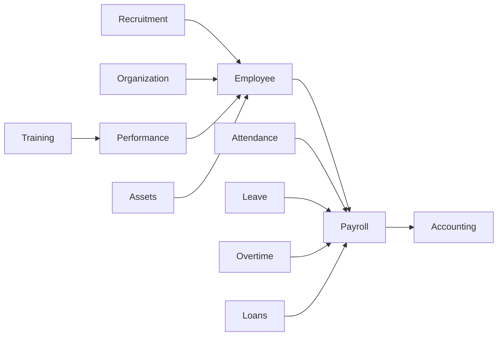

# HR & Payroll — Module Master Index

> **Status:** Draft (Planning)  
> **Version:** 1.0  
> **Module ID:** `hr-payroll` (bundle: `module.hr_payroll`)  
> **Document Type:** Master Navigation · Dependency · Implementation Guide  
> **Phase:** Documentation First · Planning Only  
> **Route namespaces:** `/hr/*` · `/payroll/*` · `/ess/*`  
> **Table namespaces:** `hr_*` · `payroll_*`  
> **API bases:** `/api/v1/hr/` · `/api/v1/payroll/` · `/api/v1/ess/`  
> **Governance:** [GOVERNANCE.md](../../00-foundation/GOVERNANCE.md) · [PROJECT_COMMON_RULES.md](../../00-foundation/PROJECT_COMMON_RULES.md) · [MASTER_MODULE_ARCHITECTURE.md](../../01-architecture/MASTER_MODULE_ARCHITECTURE.md) · [UNIVERSAL_MODULE_FRAMEWORK.md](../../00-foundation/UNIVERSAL_MODULE_FRAMEWORK.md)

## Purpose
HR & Payroll documentation master index.

## When To Read
Read when navigating the HR/Payroll doc set — not for other modules.

## Related Files
- [Master architecture](HR_PAYROLL_MASTER_ARCHITECTURE.md)

## Read Next
- [Start here](HR_PAYROLL_MASTER_ARCHITECTURE.md)

---

**No application code.**  
This document is the **single source of truth** for AgainERP HR & Payroll — navigation hub, architecture map, dependency registry, feature inventory, implementation roadmap, and quality gate for all stakeholders.

**Audience:** Product · Architecture · Backend · Frontend · QA · Design · AI agents · Implementation teams

---

# Module Overview

**HR & Payroll** is AgainERP's **core enterprise workforce module** — the system of record for people, organization, time, compensation, talent, and employee experience from hire to exit.

| Attribute | Value |
|-----------|-------|
| **Layer** | ERP (Layer 3) — core enterprise workforce |
| **Installable** | Per tenant plan (`module.hr`, `module.payroll`, or bundle `module.hr_payroll`) |
| **Hard depends** | Core: Users, RBAC, Contacts, Companies, Branches, Workflow, Approval, Notification, Activity |
| **Soft depends** | Accounting, Project, Timesheet, Documents, Inventory, CRM |
| **Consumers** | Accounting (payroll journals), Analytics, BI, AI OS |
| **Identity model** | Person = Core `contacts`; employment = `hr_employees` |
| **Integration rule** | No cross-module DB — Services + Events only |

```text
                    ┌─────────────────────────────────────┐
                    │      Core Contacts (identity)        │
                    └─────────────────┬───────────────────┘
                                      │ contact_id
                    ┌─────────────────▼───────────────────┐
                    │         hr_employees (employment)    │
                    └───────┬─────────┬─────────┬─────────┘
                            │         │         │
              ┌─────────────▼──┐ ┌────▼────┐ ┌──▼──────────────┐
              │ HR domain       │ │ Payroll │ │ Talent domain    │
              │ Time · Leave    │ │ Runs    │ │ Performance      │
              │ Recruitment     │ │ Payslip │ │ Training · Goals │
              └────────┬────────┘ └────┬────┘ └────────┬─────────┘
                       └───────────────┼──────────────────┘
                                       ▼
                         Accounting · Project · Analytics · AI OS
```

---

# Module Vision

> **One workforce record. Full lifecycle traceability. Accurate time. Compliant pay. AI-assisted insights — all through governed services.**

| Gap today | HR & Payroll solves |
|-----------|---------------------|
| Employee data scattered | Single employment record per company |
| Attendance in device silos | Unified sync + reconciliation |
| Leave disconnected from pay | Approved leave feeds payroll inputs |
| No lifecycle view | 360° profile + timeline |
| Performance bolted on | Linked to compensation and succession |

**Module off behavior:** Core contacts/users unaffected; HR/Payroll UI hidden; no `hr_*` / `payroll_*` queries; payroll journal subscriber skipped; AI HR tools return `ModuleNotEnabled`.

---

# Business Objectives

| Objective | Target outcome |
|-----------|----------------|
| Single source of truth | One employee record per person per company |
| Pay accuracy | < 0.5% post-lock adjustment rate |
| Time integrity | Daily device + manual reconciliation |
| Compliance readiness | Audit trail on every pay and employment change |
| Manager productivity | Approvals in < 2 clicks |
| Employee experience | ESS without HR desk dependency |
| Group reporting | Consolidated headcount and payroll cost |
| SaaS scale | Per-tenant isolation; plan-based features |
| AI augmentation | Insights without bypassing approval |

---

# Strategic Goals

| # | Goal | Horizon |
|---|------|---------|
| 1 | **Documentation-complete module** | All architecture docs Ready before code |
| 2 | **Unified HR + Payroll suite** | Single nav, shared employee profile |
| 3 | **Platform-native** | Workflow, Approval, Notification, Activity — not duplicated |
| 4 | **API-first workforce** | Web, mobile, biometric, AI share one surface |
| 5 | **Global reporting reference** | HR reports seed AgainERP Reporting Engine |
| 6 | **AI-ready by design** | Tools → services only; human-in-the-loop |
| 7 | **Automation without risk** | Rules + schedules; never silent payroll lock |
| 8 | **Multi-company from day one** | Group of companies, branch, department scope |

---

# Module Scope

### In scope

| Domain | Namespace | Description |
|--------|-----------|-------------|
| Organization | `hr_*` | Departments, designations, locations, cost centers |
| Employee master | `hr_*` + Core | Full employment profile and lifecycle |
| Recruitment | `hr_*` | Requisitions, candidates, interviews, offers |
| Attendance & shifts | `hr_*` | Devices, punches, corrections, rotations |
| Leave | `hr_*` | Types, accrual, approval, calendar |
| Payroll | `payroll_*` | Structures, runs, payslips, tax, compliance |
| Overtime | `hr_*` + `payroll_*` | Rules in HR; amounts in Payroll |
| Loans & advances | `payroll_*` | Recovery via payroll deduction |
| Performance | `hr_*` | Goals, KPIs, appraisal cycles |
| Training | `hr_*` | Programs, sessions, certifications |
| Assets | `hr_*` | Assignment, return, damage, lifecycle |
| Travel & expense | `hr_*` | Requests, approvals (Accounting via events) |
| Documents | Core + HR links | Contracts, IDs, certificates |
| ESS | `ess` API | Profile, leave, payslips, requests |
| Reporting | HR + Payroll | Operational → executive → compliance |
| AI Assistant | AI OS tools | Advisory, analytics, recommendations |
| Automation | `hr_automation_*` | Event/schedule rules |

### Out of scope

| Domain | Owner module |
|--------|--------------|
| GL / payroll journal detail | Accounting |
| Project tasks, billing | Project |
| Billable time detail | Timesheet |
| User authentication | Core Users |
| Government e-filing | External connectors (future) |
| Helpdesk tickets | Helpdesk |

---

# Module Boundaries

| Owner | Responsibility |
|-------|----------------|
| **HR** | Employment, org, attendance, leave, shifts, recruitment, performance, training, assets, travel/expense requests |
| **Payroll** | Salary structures, runs, payslips, tax, loans, bank export |
| **Core** | Contacts, users, companies, branches, workflow, approval, notification, activity |
| **AI OS** | Orchestration, providers, audit — HR contributes domain tools |
| **Accounting** | Subscribes to `payroll.run.posted` — no direct HR table access |

**Forbidden:** `JOIN hr_employees` from Accounting. **Required:** `HrService.getEmployee(id)` via API.

---

# Module Summary

### HR (core workforce)

Master data for employment, organization, and workforce operations. Employee 360° profile with tabs for personal, employment, compensation, documents, and activity timeline. Org structure: departments, designations, locations, reporting lines, org chart.

### Attendance

Device sync (biometric), daily attendance register, corrections workflow, policies, exceptions, WFH/outdoor duty. Feeds payroll via `hr.attendance.finalized` event. Dashboard with present/absent/late KPIs.

### Leave

Leave types, policies, accrual runs, balances, requests, approval workflow, team calendar, encashment. Balance updates on approval; payroll reads approved leave for deductions.

### Payroll

Salary components, structures, employee assignments, tax/contribution rules, payroll periods, runs (calculate → approve → lock → post), payslips, bonuses, commissions, revisions, YTD. Immutable posted payslips.

### Recruitment

Job requisitions, candidate pipeline (kanban), interviews, offers, hiring wizard converting applicant → employee. Metrics: time-to-hire, funnel conversion, cost-per-hire.

### Performance

Goals, KPIs, KRAs, appraisal cycles, self/manager reviews, promotion recommendations. Optional bonus input to payroll.

### Training

Programs, sessions, enrollments, attendance, certificates, evaluations. Mandatory training compliance reporting.

### Assets

HR asset inventory, assignments, returns, damages, lifecycle history. Optional link to Inventory module assets.

### Employee Self Service (ESS)

Separate portal (`/ess/*`) for employees: dashboard, attendance, leave apply, payslips, documents, assets, training, performance view, requests. Mobile-first with bottom navigation.

### AI Assistant

Platform `workforce_agent` — chat, analytics, recommendations, predictions (future), audit mode for payroll. UI hub `/hr/ai`; global `Ctrl+J`. Advisory only on payroll — never auto-lock or auto-approve.

### Automation

Rule engine separate from workflow: event triggers, cron schedules, notification/approval side effects. Examples: probation reminders, attendance finalization, document expiry alerts, onboarding checklist. Human gates on payroll lock and termination.

---

# Document Registry

Complete registry of HR & Payroll planning documentation.

| # | Document | Purpose | Status | Dependencies | Owner | Priority |
|---|----------|---------|--------|--------------|-------|----------|
| **00** | **[HR_MODULE_MASTER_INDEX.md](./HR_MODULE_MASTER_INDEX.md)** | Master navigation, roadmap, registry | Draft | All HR docs | Product / Architecture | P0 |
| **01** | [HR_PAYROLL_MASTER_ARCHITECTURE.md](./HR_PAYROLL_MASTER_ARCHITECTURE.md) | Enterprise master architecture | Draft | Core arch, SaaS, AI OS | Architecture | P0 |
| **02** | [HR_DATABASE_ARCHITECTURE.md](./HR_DATABASE_ARCHITECTURE.md) | `hr_*` / `payroll_*` schema plan | Draft | Master | Backend / DBA | P0 |
| **03** | [HR_WORKFLOW_ARCHITECTURE.md](./HR_WORKFLOW_ARCHITECTURE.md) | Lifecycle state machines | Draft | Master, Approval Engine | Backend | P0 |
| **04** | [HR_PERMISSION_MATRIX.md](./HR_PERMISSION_MATRIX.md) | RBAC, roles, SoD, field-level | Draft | Master | Security / Backend | P0 |
| **05** | [HR_NOTIFICATION_ARCHITECTURE.md](./HR_NOTIFICATION_ARCHITECTURE.md) | HR notification templates & routing | Draft | Master, Notification Engine | Backend | P1 |
| **06** | [HR_ACTIVITY_LOG_ARCHITECTURE.md](./HR_ACTIVITY_LOG_ARCHITECTURE.md) | Activity types, timeline, audit | Draft | Master, Activity Engine | Backend | P1 |
| **07** | [HR_UI_UX_BLUEPRINT.md](./HR_UI_UX_BLUEPRINT.md) | UX patterns, layouts, CRUD rules | Draft | Master, UI standards | Product / Design | P0 |
| **08** | [HR_SCREEN_INVENTORY.md](./HR_SCREEN_INVENTORY.md) | 280+ screens, routes, permissions | Draft | UI blueprint | Product / QA | P0 |
| **09** | [HR_DASHBOARD_ARCHITECTURE.md](./HR_DASHBOARD_ARCHITECTURE.md) | Dashboard zones, widgets (`WGT-*`) | Draft | Screen inventory | Product / Frontend | P1 |
| **10** | [HR_REPORTING_ARCHITECTURE.md](./HR_REPORTING_ARCHITECTURE.md) | Reports registry (`RPT-*`), BI | Draft | Database, Permissions | Backend / BI | P1 |
| **11** | [HR_DATABASE_ERD_PLANNING.md](./HR_DATABASE_ERD_PLANNING.md) | ERD diagrams, relationship detail | Draft | Database arch | DBA | P1 |
| **12** | [HR_API_ARCHITECTURE.md](./HR_API_ARCHITECTURE.md) | API layers, auth, events, webhooks | Draft | Database, Workflow, Permissions | Backend | P0 |
| **13** | [HR_AI_ASSISTANT_ARCHITECTURE.md](./HR_AI_ASSISTANT_ARCHITECTURE.md) | AI tools, agents, UI surfaces | Draft | API, AI OS | AI / Backend | P2 |
| **14** | [HR_AUTOMATION_ENGINE_ARCHITECTURE.md](./HR_AUTOMATION_ENGINE_ARCHITECTURE.md) | Rules, triggers, actions (`AUTO-*`) | Draft | Workflow, API, Notification | Backend | P2 |
| **15** | [HR_FIGMA_WIREFRAME_BLUEPRINT.md](./HR_FIGMA_WIREFRAME_BLUEPRINT.md) | Wireframe structure for Figma | Draft | UI blueprint, Screen inventory | Design | P1 |
| **16** | [uiux/HR_NAVIGATION_ARCHITECTURE.md](./uiux/HR_NAVIGATION_ARCHITECTURE.md) | Sidebar, top bar, search, mobile, AI nav | Draft | UI blueprint, Screen inventory, navigation.md | Product / Architecture | P0 |
| **17** | [uiux/HR_DASHBOARD_UI_ARCHITECTURE.md](./uiux/HR_DASHBOARD_UI_ARCHITECTURE.md) | Dashboard zones, widgets, KPI UI wireframes | Draft | Dashboard arch, UI blueprint, dashboard-widgets.md | Product / Design | P0 |
| **18** | [uiux/EMPLOYEE_PROFILE_UI_ARCHITECTURE.md](./uiux/EMPLOYEE_PROFILE_UI_ARCHITECTURE.md) | 360° employee profile, tabs, timeline, AI | Draft | UI blueprint, Activity log, Permission matrix | Product / Design | P0 |
| **19** | [uiux/ATTENDANCE_UI_ARCHITECTURE.md](./uiux/ATTENDANCE_UI_ARCHITECTURE.md) | Attendance ops, analytics, devices, AI | Draft | Workflow, Dashboard UI, Screen inventory | Product / Design | P0 |
| **20** | [uiux/LEAVE_UI_ARCHITECTURE.md](./uiux/LEAVE_UI_ARCHITECTURE.md) | Leave planning, approvals, policy, AI | Draft | Workflow, Permission matrix, Screen inventory | Product / Design | P0 |
| **21** | [uiux/PAYROLL_UI_ARCHITECTURE.md](./uiux/PAYROLL_UI_ARCHITECTURE.md) | Payroll workbench, compliance, analytics, AI auditor | Draft | Workflow, Permission matrix, Screen inventory, Dashboard | Product / Design | P0 |
| **22** | [uiux/ESS_PORTAL_UI_ARCHITECTURE.md](./uiux/ESS_PORTAL_UI_ARCHITECTURE.md) | Employee portal, mobile-first, manager overlay, AI assistant | Draft | Navigation, Dashboard UI, Permission matrix, Screen inventory | Product / Design | P0 |
| **23** | [uiux/HR_AI_ASSISTANT_UI_ARCHITECTURE.md](./uiux/HR_AI_ASSISTANT_UI_ARCHITECTURE.md) | AI copilot, workspace, insights, auditors — platform UX template | Draft | HR AI Assistant arch, AI OS, Dashboard UI, Activity log | Product / Architecture | P0 |
| **24** | [uiux/HR_APPROVAL_CENTER_UI_ARCHITECTURE.md](./uiux/HR_APPROVAL_CENTER_UI_ARCHITECTURE.md) | Approval inbox, workspace, analytics — platform UX template | Draft | Approval Engine, Workflow, Permission matrix, Notification arch | Product / Architecture | P0 |
| **25** | [uiux/HR_ACTIVITY_TIMELINE_UI_ARCHITECTURE.md](./uiux/HR_ACTIVITY_TIMELINE_UI_ARCHITECTURE.md) | Activity feed, audit history, change tracking — platform UX template | Draft | Activity log arch, Employee profile, Approval center UI | Product / Architecture | P0 |
| **26** | [../../design-system/HR_DESIGN_SYSTEM_SPECIFICATION.md](../../04-uiux/design-system/HR_DESIGN_SYSTEM_SPECIFICATION.md) | Design tokens, components, patterns — global DS seed | Draft | UI blueprint, Figma blueprint, all uiux arch docs | Product / Design | P0 |
| **27** | [uiux/HR_FIGMA_SCREEN_MAP.md](./uiux/HR_FIGMA_SCREEN_MAP.md) | Figma pages, SCR registry, priority matrix, handoff map | Draft | Screen inventory, all uiux arch docs, Figma blueprint | Product / Design | P0 |
| **28** | [uiux/HR_DESKTOP_WIREFRAME_EXECUTION_PLAN.md](./uiux/HR_DESKTOP_WIREFRAME_EXECUTION_PLAN.md) | Phased wireframe execution roadmap, per-screen layout specs | Draft | Figma screen map, all uiux arch docs, wireframe blueprint | Product / Design | P0 |
| **29** | [uiux/HR_DESKTOP_LAYOUT_SYSTEM.md](./uiux/HR_DESKTOP_LAYOUT_SYSTEM.md) | Desktop layout zones, patterns `LYT-*` / `TPL-*`, shell anatomy | Draft | Design system spec, layout-architecture, all uiux arch docs | Product / Design | P0 |

### Planned child documents (not yet created)

| Document | Purpose | Status | Priority |
|----------|---------|--------|----------|
| `README.md` | Module home (short index) | Planned | P0 |
| `ModuleManifest.md` | Install, deps, feature flags, nav | Planned | P0 |
| `INTEGRATION.md` | Accounting, Project, device connectors | Planned | P1 |
| `Development.md` | Step-by-step build guide | Planned | P1 |
| `Roadmap.md` | Release milestones | Planned | P1 |
| `docs/ui-prototype/hr-payroll/*` | UI build guide + screen specs | Planned | P1 |

### Platform documents (required reading)

| Document | Relevance |
|----------|-----------|
| [SAAS_PLATFORM_ARCHITECTURE.md](../../01-architecture/SAAS_PLATFORM_ARCHITECTURE.md) | Multi-tenant, plan gating |
| [AI_OS_ARCHITECTURE.md](../../06-ai/platform/ai/AI_OS_ARCHITECTURE.md) | AI platform service |
| [APPROVAL_ENGINE_ARCHITECTURE.md](../../02-core-platform/engines/APPROVAL_ENGINE_ARCHITECTURE.md) | Approval flows |
| [NOTIFICATION_ENGINE_ARCHITECTURE.md](../../02-core-platform/engines/NOTIFICATION_ENGINE_ARCHITECTURE.md) | Notification delivery |
| [ACTIVITY_CHATTER_ARCHITECTURE.md](../../02-core-platform/subsystems/ACTIVITY_CHATTER_ARCHITECTURE.md) | Activity timeline |
| [database/multi-company.md](../../05-development/database/multi-company.md) | Company/branch scope |
| [UI_UX_DESIGN_STANDARDS.md](../../04-uiux/standards/UI_UX_DESIGN_STANDARDS.md) | Drawer CRUD, mobile-first |

---

# Architecture Map

```text
HR & Payroll Module (hr-payroll)
│
├── Employee Domain
│   ├── Master data (hr_employees + profile extensions)
│   ├── Lifecycle (hire → active → exit)
│   ├── Documents & bank details
│   └── 360° profile + timeline
│
├── Organization Domain
│   ├── Departments · Designations · Locations
│   ├── Cost centers · Job positions
│   └── Org chart · Reporting structure
│
├── Recruitment Domain
│   ├── Requisitions · Candidates · Pipeline
│   ├── Interviews · Offers
│   └── Hiring wizard → Employee
│
├── Attendance Domain
│   ├── Devices · Sync · Raw punches
│   ├── Daily attendance · Corrections
│   └── Policies · Exceptions · Finalization
│
├── Shift Domain
│   ├── Definitions · Assignments · Rotations
│   └── Calendars · Conflict resolution
│
├── Leave Domain
│   ├── Types · Policies · Accrual
│   ├── Requests · Balances · Calendar
│   └── Encashment
│
├── Payroll Domain
│   ├── Structures · Components · Tax rules
│   ├── Runs · Payslips · Periods
│   ├── Bonuses · Commissions · Revisions
│   └── Bank export · YTD
│
├── Overtime Domain
│   ├── Policies · Requests (HR)
│   └── Calculations → Payroll input
│
├── Loan & Advance Domain
│   ├── Loans · Installments · Recoveries
│   └── Salary advances
│
├── Performance Domain
│   ├── Goals · KPIs · KRAs
│   ├── Cycles · Reviews
│   └── Promotion recommendations
│
├── Training Domain
│   ├── Programs · Sessions
│   ├── Enrollments · Certificates
│   └── Evaluations
│
├── Asset Domain
│   ├── Inventory · Assignments
│   ├── Returns · Damages
│   └── Lifecycle history
│
├── Travel & Expense Domain
│   ├── Travel requests · Expense claims
│   └── Accounting integration (events)
│
├── Reporting Domain
│   ├── Operational · Management · Executive
│   ├── Compliance · Audit
│   └── AI / Predictive (future)
│
├── ESS Domain
│   └── Employee self-service portal
│
├── AI Domain
│   ├── workforce_agent tools
│   ├── Insights · Recommendations
│   └── Predictions (future)
│
└── Automation Domain
    ├── Event rules · Schedule jobs
    ├── Notification/approval side effects
    └── AI-assisted analysis tasks
```

### Platform engine integration (not duplicated)

```text
Core Engines (shared)
├── Workflow Engine    → leave, attendance correction, payroll run, exit
├── Approval Engine    → leave, OT, loan, payroll, requisition, expense
├── Notification Engine → all HR events + digests
├── Activity Engine    → timeline on all entities
└── Event Bus          → cross-module integration
```

---

# Domain Dependency Map

| Source domain | Target domain | Relationship |
|---------------|---------------|--------------|
| **Recruitment** | **Employee** | Hire converts candidate → `hr_employees` |
| **Employee** | **Payroll** | Salary structure assignment |
| **Employee** | **Assets** | Assignments linked to employee |
| **Employee** | **Performance** | Reviews per employee |
| **Employee** | **Training** | Enrollments per employee |
| **Organization** | **Employee** | Dept, designation, manager scope |
| **Attendance** | **Payroll** | Finalized attendance → pay inputs |
| **Leave** | **Payroll** | Approved leave → deductions/LWP |
| **Overtime** | **Payroll** | Approved OT → earnings |
| **Loan & Advance** | **Payroll** | Recovery via payslip deduction |
| **Performance** | **Promotion** | Appraisal → promotion recommendation |
| **Performance** | **Payroll** | Bonus/commission input (optional) |
| **Training** | **Performance** | Skill/certification inputs |
| **Assets** | **Employee** | Assignment on profile tab |
| **Payroll** | **Accounting** | `payroll.run.posted` → journal |
| **All domains** | **Reporting** | Aggregates → `hr_analytics_*` |
| **All domains** | **AI** | Read models + governed tools |
| **All domains** | **Automation** | Event triggers |



---

# Document Dependency Map

Recommended **read order** and **build order** for implementation.

```text
HR_MODULE_MASTER_INDEX.md (this document)
        │
        ▼
HR_PAYROLL_MASTER_ARCHITECTURE.md
        │
        ├──────────────────┬──────────────────┐
        ▼                  ▼                  ▼
HR_DATABASE_ARCHITECTURE   HR_PERMISSION_MATRIX   HR_UI_UX_BLUEPRINT
        │                  │                  │
        ▼                  │                  ▼
HR_DATABASE_ERD_PLANNING   │         HR_SCREEN_INVENTORY
        │                  │                  │
        ▼                  ▼                  ▼
HR_WORKFLOW_ARCHITECTURE ◄─┴──────► HR_DASHBOARD_ARCHITECTURE
        │                                    │
        ├──────────────┬─────────────────────┤
        ▼              ▼                     ▼
HR_NOTIFICATION    HR_ACTIVITY_LOG    HR_FIGMA_WIREFRAME_BLUEPRINT
        │              │
        └──────┬───────┘
               ▼
        HR_API_ARCHITECTURE
               │
        ┌──────┴──────┐
        ▼             ▼
HR_REPORTING    HR_AI_ASSISTANT_ARCHITECTURE
ARCHITECTURE           │
        │              ▼
        └──────► HR_AUTOMATION_ENGINE_ARCHITECTURE
                       │
                       ▼
              Implementation (ModuleManifest → Code)
```

| Gate | Requirement |
|------|-------------|
| **Pre-database** | Master + Database arch Ready |
| **Pre-API** | ERD + Workflow + Permissions Ready |
| **Pre-UI** | Screen inventory + UI blueprint Ready |
| **Pre-AI** | API arch + Permission matrix Ready |
| **Pre-code** | All P0 docs **Ready** per [GOVERNANCE.md](../../00-foundation/GOVERNANCE.md) |

---

# Feature Inventory

### Core features (Must Have — Phase 1–5)

| Feature | Domain | Key entities |
|---------|--------|--------------|
| Employee directory | Employee | `hr_employees` |
| Organization structure | Organization | `hr_departments`, `hr_designations` |
| Employee 360° profile | Employee | Profile tabs + timeline |
| Attendance register | Attendance | `hr_attendance`, devices |
| Leave requests & approval | Leave | `hr_leave_requests` |
| Payroll structures | Payroll | `payroll_salary_structures` |
| Payroll runs & payslips | Payroll | `payroll_runs`, `payroll_payslips` |
| ESS portal | ESS | `/ess/*` |
| Approval inbox integration | Core | Leave, payroll |
| Activity timeline | Core | All HR entities |
| RBAC | Permissions | `hr.*`, `payroll.*`, `ess.*` |

### Advanced features (Should Have — Phase 6–9)

| Feature | Domain |
|---------|--------|
| Recruitment pipeline | Recruitment |
| Shift management | Shift |
| Overtime workflow | Overtime |
| Loans & advances | Loan |
| Performance appraisals | Performance |
| Training programs | Training |
| Asset assignments | Assets |
| Report center (45+ reports) | Reporting |
| Executive dashboard | Dashboard |
| Biometric device sync | Attendance |
| Travel & expense | T&E |

### Enterprise features (Could Have)

| Feature | Domain |
|---------|--------|
| Multi-company consolidated reporting | Reporting |
| Cost center payroll allocation | Payroll |
| Matrix reporting | Organization |
| Statutory compliance packs | Payroll / Reporting |
| Record-level department scope | Permissions |
| Scheduled report delivery | Reporting |
| Geo-fence check-in | Attendance |
| Inter-company transfer | Employee |

### AI features (Phase 10)

| Feature | Mode |
|---------|------|
| Natural language queries | Assistant |
| Attendance anomaly insights | Analyst |
| Payroll validation flags | Auditor |
| Attrition risk ranking | Predictor |
| Training recommendations | Advisor |
| Headcount scenario planning | Planner |
| AI insight widgets on dashboards | Analyst |

### Automation features (Phase 11)

| Feature | Trigger |
|---------|---------|
| Onboarding checklist | `hr.employee.hired` |
| Probation reminders | Schedule |
| Attendance finalization | Cron / period end |
| Document expiry alerts | `hr.document.expiring` |
| Interview reminders | Cron |
| Payroll anomaly scan | `payroll.run.calculated` |

### Future features

| Feature | Notes |
|---------|-------|
| Autonomous onboarding agent | Multi-step with human checkpoints |
| Government e-filing connectors | Country packs |
| Workforce planning / succession | AI + analytics |
| Skills ontology / LMS integration | External LMS |
| Native mobile apps | ESS + manager approvals |
| Marketplace biometric connectors | Partner apps |

---

# Screen Inventory Summary

Per [HR_SCREEN_INVENTORY.md](./HR_SCREEN_INVENTORY.md).

| Category | Count | Examples |
|----------|------:|----------|
| **Module routes** | 85+ | `/hr/employees`, `/payroll/runs` |
| **Logical screens** | 280+ | Incl. drawers, tabs, wizards |
| **Dashboard screens** | 11 | HR, Payroll, Attendance, Leave, Recruitment, Performance, Training, Assets, Executive, ESS, AI |
| **Operational screens** | 120+ | Lists, daily registers, approval queues |
| **Management screens** | 60+ | Settings, policies, structures |
| **Report screens** | 45+ | `RPT-HR-*`, `RPT-PAY-*` |
| **AI screens** | 9 | `/hr/ai`, insights, recommendations |
| **ESS screens** | 11 | `/ess/*` portal |
| **Wizards** | 12 | Hire, exit clearance, import |
| **Global / shared** | 15 | Approval inbox, notifications, activity drawer |

**CRUD pattern:** List + right Sheet drawer — `?create=1` · `?view={id}` · `?edit={id}` (no `/new` routes).

**Screen ID format:** `SCR-{SCOPE}-{DOMAIN}-{SEQ}` (scopes: HR, PAY, ESS, CORE, AI).

---

# Database Summary

Per [HR_DATABASE_ARCHITECTURE.md](./HR_DATABASE_ARCHITECTURE.md) — **100+ planned tables**.

### Master entities

| Domain | Key tables |
|--------|------------|
| Organization | `hr_departments`, `hr_designations`, `hr_locations`, `hr_cost_centers`, `hr_job_positions` |
| Employee | `hr_employees` (+ education, skills, documents, bank) |
| Recruitment | `hr_job_requisitions`, `hr_candidates`, `hr_offer_letters` |
| Payroll config | `payroll_salary_components`, `payroll_salary_structures`, `payroll_tax_rules` |
| Leave config | `hr_leave_types`, `hr_leave_policies` |
| Attendance config | `hr_attendance_policies`, `hr_shift_definitions` |
| Performance | `hr_performance_cycles`, `hr_goals`, `hr_kpis` |
| Training | `hr_training_programs` |
| Assets | `hr_assets`, `hr_asset_categories` |

### Transaction entities

| Domain | Key tables |
|--------|------------|
| Attendance | `hr_attendance_logs`, `hr_attendance`, `hr_attendance_corrections` |
| Leave | `hr_leave_requests`, `hr_leave_balances`, `hr_leave_accrual_runs` |
| Payroll | `payroll_runs`, `payroll_payslips`, `payroll_payslip_lines` |
| Overtime | `hr_overtime_requests` |
| Loans | `payroll_loans`, `payroll_loan_installments` |
| Performance | `hr_performance_reviews` |
| Training | `hr_training_participants`, `hr_training_certificates` |
| Assets | `hr_asset_assignments`, `hr_asset_returns` |

### Workflow entities

| Entity | States (summary) |
|--------|------------------|
| Leave request | draft → pending → approved/rejected/cancelled |
| Attendance correction | draft → pending → approved/rejected |
| Payroll run | draft → calculated → review → approved → locked → posted |
| Loan | draft → pending → approved → active → closed |
| Requisition | draft → pending → approved → open → closed |
| Exit | initiated → clearance → settled |

### Analytics entities (planned)

`hr_analytics_headcount` · `hr_analytics_attendance_daily` · `hr_analytics_leave_summary` · `payroll_analytics_cost_monthly` · `payroll_analytics_component_breakdown`

### System entities

`hr_automation_rules` · `hr_automation_runs` · Core activity/audit (not duplicated) · AI audit logs (platform)

**Identity rule:** No `hr_persons` — `hr_employees.contact_id` → `contacts.id`.

---

# Workflow Summary

Per [HR_WORKFLOW_ARCHITECTURE.md](./HR_WORKFLOW_ARCHITECTURE.md).

| Lifecycle | Key stages | Approval gates |
|-----------|------------|----------------|
| **Employee** | Applicant → Hired → Active → Transfer/Promotion → Exit | Termination, transfer (optional) |
| **Recruitment** | Requisition → Pipeline → Interview → Offer → Hire | Requisition, offer |
| **Attendance** | Punch → Reconcile → Daily row → Finalize | Correction |
| **Leave** | Draft → Submit → Approve/Reject → Balance update | Manager → HR (policy) |
| **Payroll** | Period open → Collect → Calculate → Review → Approve → Lock → Post | Run approval, SoD |
| **Performance** | Cycle open → Self review → Manager review → Calibration → Close | Promotion recommendation |
| **Training** | Enroll → Attend → Complete → Certify | Enrollment (optional) |
| **Asset** | Available → Assigned → Return/Damage → Retire | Assignment |
| **Loan** | Request → Approve → Disburse → Recover via payroll | Loan approval |
| **Exit** | Resignation → Clearance → F&F payroll → Terminated | Clearance checklist |

**Engines:** Core Workflow (state) + Core Approval (human gates) — HR does not duplicate.

---

# Permission Summary

Per [HR_PERMISSION_MATRIX.md](./HR_PERMISSION_MATRIX.md).

### Roles (18 templates)

Super Admin · Platform Admin · Company Admin · Branch Admin · HR Director · HR Manager · HR Executive · Department Manager · Team Leader · Payroll Manager · Payroll Executive · Recruitment Manager · Recruitment Executive · Trainer · Employee · Auditor · External Consultant

### Access levels

| Level | Code | Meaning |
|-------|------|---------|
| Full | F | Create, read, update, delete (within scope) |
| Edit | E | Create, read, update |
| View | V | Read only |
| Approve | A | Approval actions |
| Self | S | Own records only (ESS) |
| None | — | Hidden |

### Approval rights (summary)

| Document type | Typical approver chain |
|---------------|------------------------|
| Leave | Team Leader → Dept Manager → HR |
| Attendance correction | Manager → HR |
| Overtime | Manager → HR |
| Payroll run | Payroll Executive (calc) → Payroll Manager (approve) → Lock (SoD) |
| Loan | Manager → HR → Payroll Manager |
| Requisition | Dept Manager → HR Director |
| Expense | Manager → Finance |

### Data visibility

| Scope | Rule |
|-------|------|
| Company | `company_id` match session |
| Branch | Branch admin / assigned branch |
| Department subtree | Manager sees reports |
| Self | Employee ESS — own `employee_id` |
| Sensitive fields | `hr.sensitive.view` for salary, bank, tax ID |

### Security rules

- SoD: Payroll calculate ≠ approve ≠ lock (configurable)
- Field-level masking on exports without permission
- Module-off → graceful UI hide, API 404
- AI inherits user RBAC — never elevates

---

# Reporting Summary

Per [HR_REPORTING_ARCHITECTURE.md](./HR_REPORTING_ARCHITECTURE.md) — **80+ report definitions** (`RPT-*`).

| Class | Code | Examples | Audience |
|-------|------|----------|----------|
| **Operational** | OPR | Daily attendance, leave balance, pending approvals | HR ops |
| **Management** | MGT | Dept performance, leave taken, OT summary | Managers |
| **Executive** | EXE | Headcount trend, payroll cost, turnover | Leadership |
| **Compliance** | CMP | Salary register, muster roll, tax summary | Auditor, statutory |
| **Audit** | AUD | Field change log, payroll lock report | Compliance |
| **Analytical** | ANL | Attendance heatmap, funnel analysis | HR analytics |
| **AI** | AI | Attrition prediction, anomaly summary | HR leadership |

**Routes:** `/hr/reports/{slug}` · `/payroll/reports/{slug}` · `/ess/reports/{slug}`  
**Pipeline:** OLTP → `hr_analytics_*` / `payroll_analytics_*` → Report API → export/schedule

---

# API Summary

Per [HR_API_ARCHITECTURE.md](./HR_API_ARCHITECTURE.md).

### Core APIs

| Namespace | Scope |
|-----------|-------|
| `/api/v1/hr/` | Employees, org, attendance, leave, recruitment, performance, training, assets |
| `/api/v1/payroll/` | Structures, runs, payslips, loans, tax |
| `/api/v1/ess/` | Self-scoped employee channel |
| `/api/v1/core/` | Auth, approval, notification, activity (platform) |

### Integration APIs

- `HrService` / `PayrollService` internal service layer (no cross-module SQL)
- Partner-scoped APIs (future marketplace)
- Biometric device sync endpoints (device token auth)

### Webhook APIs

Outbound: `payroll.run.posted`, `hr.employee.hired`, etc.  
Inbound: Accounting period close, external LMS (future)

### AI APIs

`/api/v1/ai/os/` — Chief Agent orchestration  
`/api/v1/hr/ai/` — Domain insights, tool execution  
Tools: read-first; write requires approval workflow

### Mobile APIs

ESS-optimized payloads · manager approval endpoints · push notification registration · geo check-in (future)

**Envelope:** `{ data, meta, links, errors }` · RFC 7807 errors · `X-Company-Id` required

---

# AI Summary

Per [HR_AI_ASSISTANT_ARCHITECTURE.md](./HR_AI_ASSISTANT_ARCHITECTURE.md).

| Capability | Agent mode | Risk |
|------------|------------|------|
| **AI Assistant** | Chat, NL queries | Low |
| **AI Analytics** | Trends, heatmaps, narratives | Low |
| **AI Recommendations** | Training, promotion suggestions | Medium |
| **AI Predictions** | Attrition risk, leave peaks | Medium |
| **AI Automation** | Anomaly scan on payroll calculated | Medium |
| **Future AI Agent** | Multi-step onboarding orchestration | High |

**Agent ID:** `workforce_agent`  
**Rules:** No direct DB · User permission inherit · Human-in-the-loop · Audit everything · Payroll never auto-approved

**UI:** `/hr/ai` hub · `Ctrl+J` global panel · Employee drawer AI Actions tab · ESS simplified chips

---

# Automation Summary

Per [HR_AUTOMATION_ENGINE_ARCHITECTURE.md](./HR_AUTOMATION_ENGINE_ARCHITECTURE.md).

| Category | Examples (`AUTO-*`) |
|----------|---------------------|
| **Attendance automation** | Device sync cron, missing punch detection, EOD finalize, notify payroll |
| **Leave automation** | Balance accrual cron, encashment reminders |
| **Payroll automation** | Pre-run validation, anomaly scan (AI-assisted), pay date reminders |
| **Notification automation** | Birthday, anniversary, probation due, document expiry |
| **Approval automation** | Escalation on SLA breach (via Approval Engine) |
| **AI assisted automation** | Post-calculate payroll anomaly flag |

**Not automation:** Workflow state machines, human approval decisions, silent payroll lock/post.

**Tables:** `hr_automation_rules`, `hr_automation_runs`  
**Admin UI (future):** `/hr/settings/automation`

---

# Integration Map

Future and planned integrations — **events + service APIs only**.

| Module | Integration | Direction | Mechanism |
|--------|-------------|-----------|-----------|
| **Accounting** | Payroll journals | HR → Accounting | `payroll.run.posted` event |
| **Accounting** | Expense reimbursement | HR → Accounting | `hr.expense.approved` |
| **CRM** | Lead → hire (future) | CRM → HR | Service API |
| **Inventory** | Asset custody | HR ↔ Inventory | UUID reference on `hr_assets` |
| **Purchase** | Recruitment vendors | Purchase → HR | Partner/expense link |
| **Manufacturing** | Shop floor attendance | Mfg → HR | Location/device scope |
| **Projects** | Task completion → performance | Project → HR | `project.task.completed` |
| **Timesheet** | Billable hours | Timesheet → Payroll | OT/billing export |
| **Helpdesk** | IT onboarding tickets | HR → Helpdesk | Event on hire |
| **Documents** | Contract storage | HR → Documents | Core attachments |
| **Knowledge** | Policy articles | Knowledge → ESS | Link/embed |
| **POS** | Retail staff scheduling | HR → POS | Employee shift export (future) |
| **Ecommerce** | — | Low priority | — |
| **BI / Data Warehouse** | Workforce analytics | HR → DW | ETL from analytics tables |
| **AI OS** | Workforce agent | Bidirectional | Tools + context adapters |

---

# Multi Company Strategy

Per [database/multi-company.md](../../05-development/database/multi-company.md) and Master Architecture.

```text
Tenant (SaaS)
└── Company (legal employer)
    └── Branch (operating unit)
        └── Location (work site)
            └── Department (org unit)
                └── Employee (scoped to company)
```

| Topic | Rule |
|-------|------|
| **Company structure** | Legal employer per `company_id`; payroll run single-company |
| **Branch structure** | Attendance devices, holidays, shifts scoped to branch |
| **Department structure** | Tree hierarchy; manager scope = subtree |
| **Data isolation** | All queries: `tenant_id` + `company_id`; no cross-company writes |
| **Shared services** | Same `contact_id` may have multiple `hr_employees` rows (one per company) |
| **Group reporting** | Read models / BI — consolidated dashboards |
| **Switchers** | Company switcher + branch switcher in top bar |

---

# Implementation Roadmap

Phased delivery aligned with dependencies and business value.

### Phase 1 — Foundation

| Deliverable | Docs / artifacts |
|-------------|------------------|
| Module manifest, permissions seed | ModuleManifest.md, Permission matrix |
| Core tables: employee, org | Database arch, ERD |
| API scaffold `/api/v1/hr/` | API arch |
| Platform engine registration | Workflow, Activity entity types |
| UI shell + navigation | UI blueprint, Screen inventory |

### Phase 2 — Core HR

| Deliverable |
|-------------|
| Employee list + 360° profile drawer |
| Organization (departments, designations) |
| Employee lifecycle (hire, edit, terminate) |
| Activity timeline on employee |
| HR dashboard (basic KPIs) |

### Phase 3 — Attendance

| Deliverable |
|-------------|
| Daily attendance register |
| Manual entry + correction workflow |
| Attendance dashboard |
| Device connector scaffold |
| Shift definitions (basic) |

### Phase 4 — Leave

| Deliverable |
|-------------|
| Leave types, policies, balances |
| Leave request + approval |
| Leave calendar |
| Leave dashboard |
| Accrual job (automation) |

### Phase 5 — Payroll

| Deliverable |
|-------------|
| Salary structures + employee assignment |
| Payroll period + run workbench |
| Calculate → approve → lock → payslip |
| Payroll dashboard |
| Accounting event `payroll.run.posted` |

### Phase 6 — Recruitment

| Deliverable |
|-------------|
| Requisitions, candidate pipeline (kanban) |
| Interview scheduling |
| Offer management |
| Hiring wizard → employee |

### Phase 7 — Performance

| Deliverable |
|-------------|
| Goals, appraisal cycles |
| Self + manager reviews |
| Promotion recommendations |
| Performance dashboard |

### Phase 8 — Training

| Deliverable |
|-------------|
| Programs, sessions, enrollments |
| Certificates, evaluations |
| Training dashboard |

### Phase 9 — Assets

| Deliverable |
|-------------|
| Asset inventory, assignments |
| Returns, damages |
| Employee assets tab |

### Phase 10 — AI Assistant

| Deliverable |
|-------------|
| `workforce_agent` tool registration |
| `/hr/ai` hub + insight widgets |
| Global AI panel HR context |
| Payroll auditor mode |

### Phase 11 — Automation

| Deliverable |
|-------------|
| `hr_automation_rules` engine |
| Seed rules (AUTO-HR-*) |
| Admin UI `/hr/settings/automation` |
| Automation run audit |

---

# Development Priority Matrix

| Priority | MoSCoW | Items |
|----------|--------|-------|
| **P0 — Must Have** | Must | Employee, org, attendance, leave, payroll core, ESS, permissions, API scaffold, activity |
| **P1 — Should Have** | Should | Recruitment, shifts, OT, loans, reports, dashboards, notifications, wireframes |
| **P2 — Could Have** | Could | Performance, training, assets, AI assistant, automation, executive dashboard |
| **P3 — Future** | Won't (now) | Autonomous agents, e-filing, geo-fence, native apps, marketplace connectors |

---

# Risk Register

| ID | Category | Risk | Mitigation |
|----|----------|------|------------|
| R1 | Technical | Payroll calculation errors | Deterministic engine; test harness; lock before publish |
| R2 | Technical | Cross-module DB coupling | Enforce service boundary in code review |
| R3 | Business | Scope creep across 11 phases | Phase gates; MVP per phase |
| R4 | Compliance | PII exposure in reports/AI | Field permissions; export audit; masking |
| R5 | Compliance | Statutory variance by country | Country packs; configurable tax rules |
| R6 | Data | Attendance device sync failures | Retry queue; manual fallback; sync logs |
| R7 | Data | Multi-company data leak | Mandatory `company_id` scope tests |
| R8 | AI | AI suggests incorrect payroll action | Read-only payroll tools; human-in-the-loop |
| R9 | AI | Prompt injection via employee fields | Sanitize context bundle |
| R10 | Integration | Accounting period mismatch | Subscribe to `accounting.period.closed` |
| R11 | Security | SoD violation (same user calc + approve) | Permission matrix + UI warnings |
| R12 | UX | 280+ screens — delivery overload | Phase MVP screens per domain |

---

# Success Metrics

Measurable KPIs for module success post-implementation.

| Metric | Target | Measurement |
|--------|--------|-------------|
| **Attendance accuracy** | > 98% reconcile rate | Device vs manual match daily |
| **Payroll accuracy** | < 0.5% post-lock adjustments | Adjustment runs / total payslips |
| **Approval time** | < 24h median for leave | Approval Engine timestamps |
| **Recruitment efficiency** | Reduce time-to-hire 20% | Requisition → join date |
| **Employee satisfaction** | ESS adoption > 70% active monthly | ESS login analytics |
| **Automation coverage** | 50% of repetitive notifications automated | Automation runs / manual sends |
| **AI adoption** | 30% HR users monthly AI interaction | AI audit log |
| **Report usage** | Top 10 reports scheduled | Report run analytics |
| **Data quality** | < 2% employees missing required fields | Validation job |
| **Uptime** | 99.9% API availability | Monitoring |

---

# Quality Checklist

Gate checklist before each phase ships to production.

### Architecture review

- [ ] Master arch alignment verified
- [ ] No cross-module DB access in design
- [ ] Domain boundaries respected (HR vs Payroll)
- [ ] Multi-company scope on all entities
- [ ] Module-off behavior documented and tested

### Workflow review

- [ ] State machines match Workflow arch
- [ ] Approval chains match Permission matrix
- [ ] SoD rules enforced for payroll
- [ ] Events published per Master arch §27

### Security review

- [ ] Permission keys on every API endpoint
- [ ] Field-level sensitive data gated
- [ ] ESS scope limited to self
- [ ] Export actions audited
- [ ] AI tools permission-checked

### UI review

- [ ] Drawer CRUD — no `/new` routes
- [ ] Mobile-first verified (375px)
- [ ] Screen IDs match inventory
- [ ] Activity column on lists
- [ ] Permission-gated actions hidden

### API review

- [ ] Envelope format consistent
- [ ] `X-Company-Id` validated
- [ ] Idempotency on critical mutations
- [ ] RFC 7807 errors
- [ ] OpenAPI spec updated (at implementation)

### AI review

- [ ] No direct DB tools
- [ ] Payroll write tools blocked or approval-gated
- [ ] Audit log on every AI action
- [ ] Confidence + sources on insights

### Testing review

- [ ] Test cases per `SCR-*` screen ID
- [ ] Role-based test matrix (18 roles)
- [ ] Payroll golden-file calculation tests
- [ ] Multi-company isolation tests
- [ ] Module-disabled graceful tests

---

# Master Navigation Section

Quick links to all HR & Payroll documentation and related platform docs.

### HR & Payroll module docs (planning suite)

| # | Document | Link |
|---|----------|------|
| 00 | **Module Master Index** | [HR_MODULE_MASTER_INDEX.md](./HR_MODULE_MASTER_INDEX.md) |
| 01 | Master Architecture | [HR_PAYROLL_MASTER_ARCHITECTURE.md](./HR_PAYROLL_MASTER_ARCHITECTURE.md) |
| 02 | Database Architecture | [HR_DATABASE_ARCHITECTURE.md](./HR_DATABASE_ARCHITECTURE.md) |
| 03 | Workflow Architecture | [HR_WORKFLOW_ARCHITECTURE.md](./HR_WORKFLOW_ARCHITECTURE.md) |
| 04 | Permission Matrix | [HR_PERMISSION_MATRIX.md](./HR_PERMISSION_MATRIX.md) |
| 05 | Notification Architecture | [HR_NOTIFICATION_ARCHITECTURE.md](./HR_NOTIFICATION_ARCHITECTURE.md) |
| 06 | Activity Log Architecture | [HR_ACTIVITY_LOG_ARCHITECTURE.md](./HR_ACTIVITY_LOG_ARCHITECTURE.md) |
| 07 | UI/UX Blueprint | [HR_UI_UX_BLUEPRINT.md](./HR_UI_UX_BLUEPRINT.md) |
| 08 | Screen Inventory | [HR_SCREEN_INVENTORY.md](./HR_SCREEN_INVENTORY.md) |
| 09 | Dashboard Architecture | [HR_DASHBOARD_ARCHITECTURE.md](./HR_DASHBOARD_ARCHITECTURE.md) |
| 10 | Reporting Architecture | [HR_REPORTING_ARCHITECTURE.md](./HR_REPORTING_ARCHITECTURE.md) |
| 11 | Database ERD Planning | [HR_DATABASE_ERD_PLANNING.md](./HR_DATABASE_ERD_PLANNING.md) |
| 12 | API Architecture | [HR_API_ARCHITECTURE.md](./HR_API_ARCHITECTURE.md) |
| 13 | AI Assistant Architecture | [HR_AI_ASSISTANT_ARCHITECTURE.md](./HR_AI_ASSISTANT_ARCHITECTURE.md) |
| 14 | Automation Engine Architecture | [HR_AUTOMATION_ENGINE_ARCHITECTURE.md](./HR_AUTOMATION_ENGINE_ARCHITECTURE.md) |
| 15 | Figma Wireframe Blueprint | [HR_FIGMA_WIREFRAME_BLUEPRINT.md](./HR_FIGMA_WIREFRAME_BLUEPRINT.md) |
| 16 | Navigation Architecture | [uiux/HR_NAVIGATION_ARCHITECTURE.md](./uiux/HR_NAVIGATION_ARCHITECTURE.md) |
| 17 | Dashboard UI Architecture | [uiux/HR_DASHBOARD_UI_ARCHITECTURE.md](./uiux/HR_DASHBOARD_UI_ARCHITECTURE.md) |
| 18 | Employee Profile UI Architecture | [uiux/EMPLOYEE_PROFILE_UI_ARCHITECTURE.md](./uiux/EMPLOYEE_PROFILE_UI_ARCHITECTURE.md) |
| 19 | Attendance UI Architecture | [uiux/ATTENDANCE_UI_ARCHITECTURE.md](./uiux/ATTENDANCE_UI_ARCHITECTURE.md) |
| 20 | Leave UI Architecture | [uiux/LEAVE_UI_ARCHITECTURE.md](./uiux/LEAVE_UI_ARCHITECTURE.md) |
| 21 | Payroll UI Architecture | [uiux/PAYROLL_UI_ARCHITECTURE.md](./uiux/PAYROLL_UI_ARCHITECTURE.md) |
| 22 | ESS Portal UI Architecture | [uiux/ESS_PORTAL_UI_ARCHITECTURE.md](./uiux/ESS_PORTAL_UI_ARCHITECTURE.md) |
| 23 | AI Assistant UI Architecture | [uiux/HR_AI_ASSISTANT_UI_ARCHITECTURE.md](./uiux/HR_AI_ASSISTANT_UI_ARCHITECTURE.md) |
| 24 | Approval Center UI Architecture | [uiux/HR_APPROVAL_CENTER_UI_ARCHITECTURE.md](./uiux/HR_APPROVAL_CENTER_UI_ARCHITECTURE.md) |
| 25 | Activity Timeline UI Architecture | [uiux/HR_ACTIVITY_TIMELINE_UI_ARCHITECTURE.md](./uiux/HR_ACTIVITY_TIMELINE_UI_ARCHITECTURE.md) |
| 26 | HR Design System Specification | [../../design-system/HR_DESIGN_SYSTEM_SPECIFICATION.md](../../04-uiux/design-system/HR_DESIGN_SYSTEM_SPECIFICATION.md) |
| 27 | Figma Screen Map | [uiux/HR_FIGMA_SCREEN_MAP.md](./uiux/HR_FIGMA_SCREEN_MAP.md) |
| 28 | Desktop Wireframe Execution Plan | [uiux/HR_DESKTOP_WIREFRAME_EXECUTION_PLAN.md](./uiux/HR_DESKTOP_WIREFRAME_EXECUTION_PLAN.md) |
| 29 | Desktop Layout System | [uiux/HR_DESKTOP_LAYOUT_SYSTEM.md](./uiux/HR_DESKTOP_LAYOUT_SYSTEM.md) |

### Legacy / subset references (to be merged)

| Document | Note |
|----------|------|
| [../hr/Architecture.md](../hr/Architecture.md) | Subset — superseded by HR master for breadth |
| [../payroll/Architecture.md](../payroll/Architecture.md) | Subset — payroll tables preserved |
| [../timesheet/Architecture.md](../timesheet/Architecture.md) | Complementary time module |

### Platform & governance

| Document | Link |
|----------|------|
| Project common rules | [PROJECT_COMMON_RULES.md](../../00-foundation/PROJECT_COMMON_RULES.md) |
| Governance | [GOVERNANCE.md](../../00-foundation/GOVERNANCE.md) |
| Master module architecture | [MASTER_MODULE_ARCHITECTURE.md](../../01-architecture/MASTER_MODULE_ARCHITECTURE.md) |
| Universal module framework | [UNIVERSAL_MODULE_FRAMEWORK.md](../../00-foundation/UNIVERSAL_MODULE_FRAMEWORK.md) |
| Module dependency map | [MODULE_DEPENDENCY_MAP.md](../../01-architecture/MODULE_DEPENDENCY_MAP.md) |
| SaaS platform | [SAAS_PLATFORM_ARCHITECTURE.md](../../01-architecture/SAAS_PLATFORM_ARCHITECTURE.md) |

### Core engines

| Engine | Link |
|--------|------|
| Approval Engine | [APPROVAL_ENGINE_ARCHITECTURE.md](../../02-core-platform/engines/APPROVAL_ENGINE_ARCHITECTURE.md) |
| Notification Engine | [NOTIFICATION_ENGINE_ARCHITECTURE.md](../../02-core-platform/engines/NOTIFICATION_ENGINE_ARCHITECTURE.md) |
| Workflow Engine | [WORKFLOW_ENGINE_ARCHITECTURE.md](../../02-core-platform/engines/WORKFLOW_ENGINE_ARCHITECTURE.md) |
| Event Architecture | [EVENT_ARCHITECTURE.md](../../02-core-platform/engines/EVENT_ARCHITECTURE.md) |
| Activity & Chatter | [ACTIVITY_CHATTER_ARCHITECTURE.md](../../02-core-platform/subsystems/ACTIVITY_CHATTER_ARCHITECTURE.md) |

### AI platform

| Document | Link |
|----------|------|
| AI OS Architecture | [AI_OS_ARCHITECTURE.md](../../06-ai/platform/ai/AI_OS_ARCHITECTURE.md) |
| AI Context Engine | [AI_CONTEXT_ENGINE.md](../../06-ai/platform/ai/AI_CONTEXT_ENGINE.md) |
| AI Audit & Approval | [AI_AUDIT_AND_APPROVAL.md](../../06-ai/platform/ai/AI_AUDIT_AND_APPROVAL.md) |

### UI / UX standards

| Document | Link |
|----------|------|
| UI/UX design standards | [UI_UX_DESIGN_STANDARDS.md](../../04-uiux/standards/UI_UX_DESIGN_STANDARDS.md) |
| Enterprise UI architecture | [ENTERPRISE_UI_ARCHITECTURE.md](../../04-uiux/standards/ENTERPRISE_UI_ARCHITECTURE.md) |
| Layout architecture | [layout-architecture.md](../../04-uiux/standards/layout-architecture.md) |
| Navigation | [navigation.md](../../04-uiux/standards/navigation.md) |
| Design system | [design-system.md](../../04-uiux/standards/design-system.md) |
| Dashboard widgets | [dashboard-widgets.md](../../04-uiux/standards/dashboard-widgets.md) |
| AI assistant UI | [ai-assistant-ui.md](../../04-uiux/standards/ai-assistant-ui.md) |
| Mobile-first | [mobile-first.md](../../04-uiux/standards/mobile-first.md) |
| Activity system | [activity-system.md](../../04-uiux/standards/activity-system.md) |
| Reports UI | [reports-ui.md](../../04-uiux/standards/reports-ui.md) |

### Key routes (implementation reference)

| Surface | Routes |
|---------|--------|
| HR admin | `/hr/*` |
| Payroll | `/payroll/*` |
| ESS | `/ess/*` |
| AI hub | `/hr/ai` |
| Approvals | `/inbox/approvals` |
| API | `/api/v1/hr/` · `/api/v1/payroll/` · `/api/v1/ess/` |

---

## AI Agent Guide

For Cursor agents and automated implementers:

1. **Start here** — this index for scope, phase, and doc links  
2. **Read Master Architecture** before any domain work  
3. **Check Screen Inventory** for `SCR-*` ID before creating UI  
4. **Check Permission Matrix** before adding actions  
5. **Never** create `/new` or `/[id]/edit` routes — use drawer query params  
6. **Never** cross-module DB joins — use services/events  
7. **Zustand rule** — no `.slice()`/`.filter()` inside selectors  
8. **Update CHANGELOG** and **MODULE_DEPENDENCY_MAP** when adding integrations  
9. **Documentation-first** — update arch docs before code per [GOVERNANCE.md](../../00-foundation/GOVERNANCE.md)

---

## Document Control

| Field | Value |
|-------|-------|
| **Module** | HR & Payroll |
| **Document** | Module Master Index |
| **Owner** | Product / Architecture |
| **Status** | Draft (Planning) |
| **Version** | 1.0 |
| **Last Updated** | 2026-06-17 |
| **Planning commands completed** | #1–#16 |
| **Next planned artifacts** | README.md · ModuleManifest.md · INTEGRATION.md · UI build guide |

---

**AgainERP HR & Payroll Module Master Index** — single source of truth for navigation, dependencies, and implementation.
