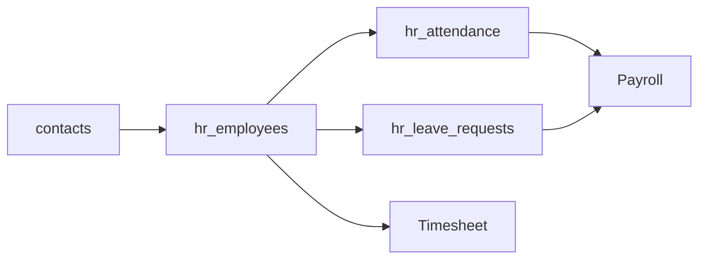

# Architecture — HR

> **Status:** Draft  
> **Module:** HR  
> **Phase:** 5 · Step 51  
> **Document Type:** Architecture  
> **Governance:** [MASTER_DATABASE_ARCHITECTURE.md](../../05-development/database/MASTER_DATABASE_ARCHITECTURE.md) · [MASTER_MODULE_ARCHITECTURE.md](../../01-architecture/MASTER_MODULE_ARCHITECTURE.md)

---

## Purpose
HR module architecture — scope, features, data ownership, and integration boundaries.

## When To Read
Read this file only if working on HR architecture, features, or module boundaries.

## Related Files
- [Dependencies](../../01-architecture/MODULE_DEPENDENCY_MAP.md)

## Read Next
- [Architecture](Architecture.md)

---

## Executive Summary

The HR module manages workforce data — employees, departments, attendance, and leave — under the `hr_*` namespace. Every employee links to a Core `contact` record; HR extends with employment-specific fields without duplicating person identity. Attendance and leave feed Payroll and Project timesheet validation.

| Goal | Target |
|------|--------|
| Single identity | Employee = `hr_employees` + `contact_id` |
| Org structure | Departments, managers, cost centers |
| Time tracking | Attendance and leave balances |
| Compliance | Audit trail on employment changes |

---

## Mission

Provide HR administrators and managers with tools to maintain organizational structure, track employee attendance and leave, and supply accurate workforce data to Payroll, Project, and Timesheet modules.

---

## Scope & Boundaries

### In Scope

- Employee records linked to contacts
- Department hierarchy and job positions
- Attendance (check-in/out, shifts)
- Leave types, balances, requests, approvals
- Company holidays and work calendars
- Employee documents via Documents module link

### Out of Scope

- Salary calculation (Payroll)
- User login accounts (Core `users` — optional link)
- Project task assignment (Project)
- Recruitment / ATS (future)

---

## Key Entities & Tables

> **Prefix:** `hr_*` · Owner: **HR**

| Table | Purpose | Key Relationships |
|-------|---------|-------------------|
| `hr_departments` | Org units | → `companies`, `parent_id`, `manager_id` |
| `hr_job_positions` | Role definitions | → `hr_departments` |
| `hr_employees` | Employment record | → `contact_id`, `hr_departments`, `user_id` (optional) |
| `hr_employee_history` | Job change audit | → `hr_employees` |
| `hr_work_schedules` | Shift templates | → `companies` |
| `hr_employee_schedules` | Employee ↔ schedule | → `hr_employees` |
| `hr_attendance` | Daily attendance rows | → `hr_employees`, `branch_id` |
| `hr_attendance_logs` | Raw check-in events | → `hr_attendance` |
| `hr_leave_types` | Annual, sick, unpaid | → `companies` |
| `hr_leave_balances` | Balance per type/year | → `hr_employees`, `hr_leave_types` |
| `hr_leave_requests` | Leave applications | → `hr_employees`, approval workflow |
| `hr_holidays` | Public/company holidays | → `companies`, `branches` |
| `hr_cost_centers` | Allocation for accounting | → `companies` |

### Employee Pattern

```text
hr_employees.contact_id → contacts.id  (required)
hr_employees.employee_number UNIQUE per company
contacts.contact_types includes 'employee'
```

### Indexes

```text
hr_employees          (company_id, employee_number) UNIQUE
hr_employees          (company_id, department_id, status)
hr_attendance         (employee_id, attendance_date) UNIQUE
hr_leave_requests     (company_id, status, start_date)
```

---

## Core Shared Entities (Not Owned by HR)

| Core Entity | HR Usage |
|-------------|-----------|
| `contacts` | Legal name, email, phone, address |
| `addresses` | Employee home address |
| `users` | Portal login linkage |
| `companies` / `branches` | Work location |
| `approvals` | Leave request workflow |
| `attachments` | ID documents, contracts |
| `activities` | Onboarding tasks |

**Rule:** No separate `hr_persons` table — person data lives in `contacts`.

---

## Dependencies

### Core Platform

Workflow Engine, Approval System, Notification System, Reporting Engine, API Layer.

### Sibling Modules

| Module | Relationship |
|--------|--------------|
| **Payroll** | Active employees, attendance, leave for pay calc |
| **Timesheet** | Employee validation on time entries |
| **Project** | Resource allocation by employee |
| **Accounting** | Cost center dimensions (read) |
| **Documents** | Employee file cabinet |
| **POS** | Staff discount linkage (future) |

---

## Domain Events

| Event | Publisher | Consumers |
|-------|-----------|-----------|
| `hr.employee.hired` | `hr_employees` | Payroll, Notifications |
| `hr.employee.terminated` | `hr_employees` | Payroll, Users (deactivate) |
| `hr.attendance.recorded` | `hr_attendance` | Payroll, Analytics |
| `hr.leave.approved` | `hr_leave_requests` | Payroll, Calendar |
| `hr.leave.rejected` | `hr_leave_requests` | Notifications |
| `hr.department.changed` | `hr_employee_history` | Analytics |

### Subscribed Events

| Event | Source | HR Action |
|-------|--------|------------|
| `core.user.created` | Core | Optional employee link |
| `payroll.run.completed` | Payroll | Update YTD summaries (read model) |

---

## API

| Property | Value |
|----------|-------|
| **Base path** | `/api/v1/hr/` |
| **Permission namespace** | `hr.*` |

### Representative Endpoints

| Method | Path | Purpose |
|--------|------|---------|
| GET/POST | `/employees` | Employee CRUD |
| GET | `/departments` | Org tree |
| POST | `/attendance/check-in` | Mobile/web check-in |
| GET/POST | `/leave-requests` | Leave management |
| POST | `/leave-requests/{id}/approve` | Manager approval |
| GET | `/holidays` | Calendar feed |

Employee self-service: `hr.self.*` permissions for own leave and attendance.

---

## Integration Patterns



PII fields on `contacts` respect field-level permissions; HR adds employment fields only on `hr_employees`.

---

## Security & Permissions

| Permission | Description |
|------------|-------------|
| `hr.employees.view` | Directory access |
| `hr.employees.manage` | Edit employment data |
| `hr.attendance.manage` | HR admin attendance |
| `hr.leave.approve` | Manager approval |
| `hr.self.leave` | Employee own requests |

GDPR: termination triggers data retention policy on contact fields.

---

## Future Integration Notes

| Area | Plan |
|------|------|
| **Recruitment** | Applicant → employee conversion |
| **Biometric** | Hardware attendance device integration |
| **Learning** | Training records and certifications |
| **AI** | Attrition risk, shift optimization |
| **Multi-branch** | Geo-fenced check-in |

Align with [MASTER_DATABASE_ARCHITECTURE §28](../../05-development/database/MASTER_DATABASE_ARCHITECTURE.md): `hr_employees` → `contacts`.

---

**Module:** HR  
**Last Updated:** 2026-06-12  
**Author:** —  
**Reviewers:** —
