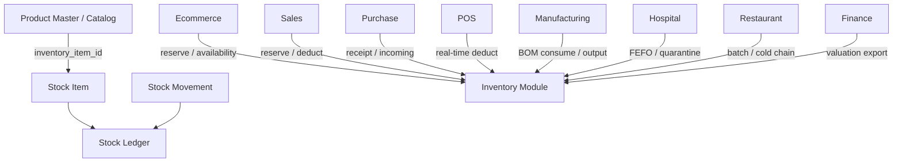

# AgainERP — Inventory Domain Entity Catalog

> **Status:** Approved  
> **Version:** 1.0  
> **Project:** AgainERP  
> **Domain:** Inventory (Independent Business Module)  
> **Document Type:** Business Entity Design Document  
> **Purpose:** Define all Inventory domain business entities — purpose, lifecycle, relationships, and platform capabilities  
> **Governance:** [GOVERNANCE.md](../../00-foundation/GOVERNANCE.md) · **Standards:** [DEVELOPMENT_STANDARDS.md](../../00-foundation/standards/DEVELOPMENT_STANDARDS.md)

**No SQL schemas. No migrations. No DDL.**  
This document describes **business entities only** — what they mean, how they behave, and how they connect across Ecommerce, Sales, Purchase, Manufacturing, Hospital, Restaurant, and POS.

### Step 28 Requirements (Satisfied)

| Requirement | Section |
|-------------|---------|
| Domain overview | §1 |
| Entity philosophy | §2 |
| Entity registry | §3 |
| Per-entity profiles (8 attributes each) | §4 |
| Multi-industry support | §1.3 · §6 |
| All 15 inventory entities | §3 · §4 |

**Related:** [INVENTORY_MODULE_ARCHITECTURE.md](./INVENTORY_MODULE_ARCHITECTURE.md) · [INVENTORY_WORKFLOW.md](./INVENTORY_WORKFLOW.md) · [ENTITY_CATALOG.md](../ecommerce/catalog/ENTITY_CATALOG.md) · [ENTITY_RELATIONSHIP_REGISTRY.md](../../00-foundation/registries/ENTITY_RELATIONSHIP_REGISTRY.md) · [DATABASE_REGISTRY.md](../../00-foundation/registries/DATABASE_REGISTRY.md) · [TRACEABILITY_MATRIX.md](../../00-foundation/traceability/TRACEABILITY_MATRIX.md)

---

## Executive summary

| Principle | Rule |
|-----------|------|
| **Single stock ledger** | Inventory owns all quantity truth — no `qty_on_hand` on Catalog or Orders |
| **Product Master consumer** | Stock Item links to Product Variant via `inventory_item_id` — identity read-only |
| **Immutable movements** | Every quantity change posts a Stock Movement — no silent balance edits |
| **Event-driven channels** | Ecommerce, Sales, Purchase, POS, Manufacturing subscribe via events + API |
| **Industry by configuration** | Batch, serial, cold chain, quarantine — not separate schemas per vertical |
| **Activity & approval everywhere** | Adjustments, transfers, recalls are auditable and policy-gated |

```text
Inventory Domain Entities (15)
├── Warehouse · Location
├── Stock Item · Stock Ledger · Stock Movement
├── Transfer · Transfer Item · Adjustment · Adjustment Item
├── Reservation · Batch · Serial Number
├── Cycle Count · Valuation Record · Inventory Snapshot
```

---

## 1. Domain overview

### 1.1 Inventory bounded context

The **Inventory** domain is AgainERP's **stock truth layer** — the authoritative system for *how many*, *where*, *in what lot or serial*, and *at what cost* products exist across the business.

| Concern | Inventory Owns | Inventory Does Not Own |
|---------|----------------|----------------------|
| Quantities | On-hand, reserved, available, incoming | Product name, SKU, price |
| Physical structure | Warehouses, Locations | Branch org chart (Core) |
| Ledger | Stock Movement, Stock Ledger balances | GL journal entries (Finance posts from events) |
| Holds | Reservations | Order payment state (Sales) |
| Traceability | Batch, Serial Number | Supplier contracts (Purchase) |
| Corrections | Adjustment, Cycle Count | — |
| Valuation | Valuation Record, cost layers | Revenue recognition |
| Analytics | Inventory Snapshot | — |

### 1.2 Channel integration



| Channel | Integration pattern | Primary entities |
|---------|---------------------|------------------|
| **Ecommerce** | Read availability; reserve on checkout; never write qty directly | Stock Ledger, Reservation |
| **Sales** | Reserve on confirm; deduct on shipment; release on cancel | Reservation, Stock Movement |
| **Purchase** | Stock In via goods receipt; `qty_incoming` until posted | Stock Movement, Batch |
| **POS** | Short-TTL reservation; deduct at sale; serial at scan | Reservation, Serial Number |
| **Manufacturing** | Component consume; WIP location; finished goods receipt | Stock Movement, Location |
| **Hospital** | FEFO batch allocation; quarantine location; device serial trace | Batch, Serial Number, Location |
| **Restaurant** | Ingredient batch expiry; cold-store location; daily write-offs | Batch, Adjustment, Location |

### 1.3 Multi-industry configuration

Inventory supports all verticals through **settings and entity flags** — not industry-specific tables.

| Industry | Enabled capabilities |
|----------|-------------------|
| Ecommerce | Multi-warehouse allocation, availability API cache |
| Sales / B2B | Quote reservations, valuation reports |
| Purchase | Receipt posting, supplier batch ref, cost layers |
| POS | Store-as-warehouse, serial-at-sale, fast deduct |
| Manufacturing | `manufacturing_consume` / `manufacturing_output` movements, WIP bin |
| Hospital | FEFO, quarantine warehouse type, serial for devices, recall workflow |
| Restaurant | Batch on ingredients, `temperature_zone` on Location, expiry alerts |

**Extension rules:** enable batch/serial per Stock Item · add reason codes · add warehouse types · same Product Master spine.  
**Forbidden:** `hospital_inventory_items`, `restaurant_stock` parallel tables.

### 1.4 Traceability

| Requirement | Inventory entities |
|-------------|------------------|
| REQ-INVENTORY-001 | Warehouse, Stock Item, Stock Ledger, Stock Movement, Reservation, Transfer, Adjustment |

**Service owner:** `InventoryService` · **Workflows:** `inventory.transfer`, `inventory.adjustment`, `inventory.reservation` · **Agent:** Inventory Agent

---

## 2. Entity philosophy

### 2.1 Design principles

```text
Catalog answers WHAT is sold.
Inventory answers HOW MANY, WHERE, and UNDER WHAT LOT.
Every quantity change is a posted Stock Movement.
```

| Principle | Application |
|-----------|-------------|
| **Aggregate roots** | Warehouse, Transfer, Adjustment, Cycle Count, Batch (when tracked) |
| **Balance entity** | Stock Ledger — current qty state per item × warehouse × location |
| **Immutable facts** | Stock Movement — append-only; corrections via reversing movement |
| **Line items** | Transfer Item, Adjustment Item — composition children |
| **Derived analytics** | Inventory Snapshot, Valuation Record — rebuildable from ledger |
| **Core delegation** | Branch, Address, Activity, Approval — platform engines |

### 2.2 Entity profile schema

Every entity in §4 includes:

| Attribute | Description |
|-----------|-------------|
| **Purpose** | Business reason the entity exists |
| **Responsibilities** | What the entity is accountable for |
| **Relationships** | Logical links to other entities |
| **Lifecycle** | States and transitions |
| **Activities** | Timeline, chatter, audit support |
| **Permissions** | Primary permission keys |
| **Approval Support** | Workflow gates, if any |
| **AI Support** | Agents and tools that may read or propose changes |

### 2.3 Quantity model

```text
Stock Item (1:1 Product Variant)
    └── Stock Ledger (per warehouse / location)
            qty_on_hand · qty_reserved · qty_quarantined · qty_incoming
                    ↑ updated only by
            Stock Movement (posted, immutable)
```

```text
qty available = qty_on_hand − qty_reserved − qty_quarantined
```

### 2.4 Document boundaries

| This document | See instead |
|-------------|-------------|
| Business entity definitions | [INVENTORY_MODULE_ARCHITECTURE.md](./INVENTORY_MODULE_ARCHITECTURE.md) |
| Workflow state machines | [INVENTORY_WORKFLOW.md](./INVENTORY_WORKFLOW.md) |
| Physical tables | [DATABASE_REGISTRY.md](../../00-foundation/registries/DATABASE_REGISTRY.md) §5.2 |
| Product identity | [ENTITY_CATALOG.md](../ecommerce/catalog/ENTITY_CATALOG.md) |

---

## 3. Entity registry

| # | Entity | Aggregate | Owner | REQ | Status |
|---|--------|-----------|-------|-----|--------|
| 1 | [Warehouse](#41-warehouse) | Root | Inventory | REQ-INVENTORY-001 | Documented |
| 2 | [Location](#42-location) | Child of Warehouse | Inventory | REQ-INVENTORY-001 | Documented |
| 3 | [Stock Item](#43-stock-item) | Root | Inventory | REQ-INVENTORY-001 | Documented |
| 4 | [Stock Ledger](#44-stock-ledger) | Balance | Inventory | REQ-INVENTORY-001 | Documented |
| 5 | [Stock Movement](#45-stock-movement) | Fact | Inventory | REQ-INVENTORY-001 | Documented |
| 6 | [Transfer](#46-transfer) | Root | Inventory | REQ-INVENTORY-001 | Documented |
| 7 | [Transfer Item](#47-transfer-item) | Child of Transfer | Inventory | REQ-INVENTORY-001 | Documented |
| 8 | [Adjustment](#48-adjustment) | Root | Inventory | REQ-INVENTORY-001 | Documented |
| 9 | [Adjustment Item](#49-adjustment-item) | Child of Adjustment | Inventory | REQ-INVENTORY-001 | Documented |
| 10 | [Reservation](#410-reservation) | Root | Inventory | REQ-INVENTORY-001 | Documented |
| 11 | [Batch](#411-batch) | Root | Inventory | REQ-INVENTORY-001 | Documented |
| 12 | [Serial Number](#412-serial-number) | Root | Inventory | REQ-INVENTORY-001 | Documented |
| 13 | [Cycle Count](#413-cycle-count) | Root | Inventory | REQ-INVENTORY-001 | Documented |
| 14 | [Valuation Record](#414-valuation-record) | Derived | Inventory | REQ-INVENTORY-001 | Documented |
| 15 | [Inventory Snapshot](#415-inventory-snapshot) | Derived | Inventory | REQ-INVENTORY-001 | Documented |

> **Registry note:** [DATABASE_REGISTRY.md](../../00-foundation/registries/DATABASE_REGISTRY.md) uses **Stock Level** as the compact name for **Stock Ledger** balance records. Same business entity.

---

## 4. Entity profiles

### 4.1 Warehouse

| Attribute | Value |
|-----------|-------|
| **Purpose** | Physical or logical stock location — the top of the storage hierarchy and fulfillment allocation unit |
| **Responsibilities** | Define where stock is stored and shipped from; warehouse type (physical, virtual, dropship, consignment, transit); default fulfillment priority; branch and address linkage; enable/disable without deleting history |
| **Relationships** | → Branch, Organization, Address (Core); → Locations (1:n); ↔ Stock Ledger balances; ← Transfers (source/dest); ← Adjustments; ← Reservations; ← Goods Receipt (Purchase); ← Shipment (Sales) |
| **Lifecycle** | active → inactive → archived (inactive stops new receipts; archived read-only) |
| **Activities** | ✓ Create, edit, type change, default flag, location tree changes |
| **Permissions** | `inventory.warehouse.view`, `.create`, `.edit`, `.archive`; `inventory.location.write` for bin management |
| **Approval Support** | — (structural changes may require admin policy in enterprise tier) |
| **AI Support** | Warehouse balancing — transfer suggestions between warehouses; store-as-warehouse mapping for POS |

**Warehouse types:** physical · virtual · dropship · consignment · transit

---

### 4.2 Location

| Attribute | Value |
|-----------|-------|
| **Purpose** | Bin, zone, aisle, rack, or floor position within a Warehouse — enables pick path, cold chain, and quarantine segregation |
| **Responsibilities** | Hierarchical storage coordinates; pickable/receivable flags; capacity limits; temperature zone (restaurant cold store, hospital vaccine fridge); pick sequence for WMS |
| **Relationships** | → Warehouse (required); → Parent Location (tree); ↔ Stock Ledger (optional location scope); referenced by Transfer Item, Reservation, Batch, Serial Number |
| **Lifecycle** | active → inactive (inactive locations excluded from allocation) |
| **Activities** | ✓ Tree edits, flag changes, capacity updates |
| **Permissions** | `inventory.location.write`; `inventory.warehouse.view` |
| **Approval Support** | — |
| **AI Support** | Pick path optimization suggestions; quarantine location recommend on batch recall |

**Industry examples:** Hospital quarantine zone · Restaurant walk-in cooler · Manufacturing WIP staging bin · POS store backroom

---

### 4.3 Stock Item

| Attribute | Value |
|-----------|-------|
| **Purpose** | Inventory-tracked unit — 1:1 link between Product Master variant and the stock subsystem |
| **Responsibilities** | Bridge Catalog identity to quantities; tracking policy (none, batch, serial); reorder min/max; cost method default; auto-create on variant creation (policy) |
| **Relationships** | → Product Variant (Catalog, read-only identity); → Stock Ledger (1:n per warehouse/location); → Stock Movements; → Batches, Serial Numbers when tracked; ← Reservations |
| **Lifecycle** | active → inactive (inactive blocks new movements; historical refs retained) |
| **Activities** | ✓ Link/unlink variant, tracking policy change, reorder rule updates |
| **Permissions** | `inventory.item.read`, `.write`; `inventory.stock.view` |
| **Approval Support** | — |
| **AI Support** | Reorder point optimization; slow-mover flag; tracking mode suggest from category |

**Rule:** Never edit product name, description, or price on Stock Item — redirect to Catalog.

---

### 4.4 Stock Ledger

| Attribute | Value |
|-----------|-------|
| **Purpose** | Current quantity balance for a Stock Item at a Warehouse (and optional Location) — the live stock position |
| **Responsibilities** | Maintain `qty_on_hand`, `qty_reserved`, `qty_quarantined`, `qty_incoming`; derive `qty available`; emit `inventory.stock_level.updated` on change; feed Ecommerce availability cache |
| **Relationships** | → Stock Item; → Warehouse; → Location (optional); updated by → Stock Movements; read by → Reservations, Valuation Record, Inventory Snapshot |
| **Lifecycle** | Continuous quantity state — no draft; created on first movement or opening balance; zero qty allowed |
| **Activities** | ✓ Every balance change logged as `stock_change` on parent Stock Item timeline |
| **Permissions** | `inventory.stock.view` (read); writes only via Stock Movement posting — never direct edit |
| **Approval Support** | Indirect — Adjustment and Transfer workflows gate writes |
| **AI Support** | Low-stock and overstock alerts; forecast input; threshold breach → reorder suggestion |

**Alias:** Stock Level in [DATABASE_REGISTRY.md](../../00-foundation/registries/DATABASE_REGISTRY.md) §5.2.

---

### 4.5 Stock Movement

| Attribute | Value |
|-----------|-------|
| **Purpose** | Immutable ledger entry for every quantity change — the audit trail of stock in/out |
| **Responsibilities** | Record signed quantity delta; movement type and reason; unit cost at post time; batch/serial references; polymorphic source document link; append-only (corrections = new movement) |
| **Relationships** | → Stock Item, Warehouse, Location; → Batch, Serial Number (optional); ← Transfer, Adjustment, Purchase Receipt, Sales Shipment, POS Sale, Manufacturing Order |
| **Lifecycle** | posted (terminal); voided only via reversing posted movement — never deleted |

**Movement types:** `purchase_receipt` · `sale` · `return` · `adjustment` · `transfer_out` · `transfer_in` · `reservation_hold` · `reservation_release` · `manufacturing_consume` · `manufacturing_output` · `batch_split` · `initial`

| **Activities** | ✓ Every post → `movement` activity on Stock Item |
| **Permissions** | `inventory.stock.view` (list/read); posting via domain workflows — `inventory.adjustment.post`, transfer ship/receive, receipt post |
| **Approval Support** | Source document may require approval before movement posts (Adjustment, Transfer, Batch recall) |
| **AI Support** | Anomaly detection on movement patterns; shrinkage correlation |

---

### 4.6 Transfer

| Attribute | Value |
|-----------|-------|
| **Purpose** | Inter-warehouse or inter-location stock relocation document |
| **Responsibilities** | Plan and execute stock moves; partial receive; in-transit state; carrier/tracking metadata; post paired transfer_out / transfer_in movements |
| **Relationships** | → Source Warehouse/Location; → Destination Warehouse/Location; → Transfer Items (1:n); → Stock Movements; triggered by Sales backorder fulfillment, AI balance suggest, Manufacturing WIP |
| **Lifecycle** | draft → approved → in_transit → received → completed (cancelled before ship) |

| State | Description |
|-------|-------------|
| draft | Lines added, not shipped |
| approved | Manager approved (optional policy) |
| in_transit | Source deducted, destination pending |
| received | Destination confirmed |
| completed | Movements posted, closed |

| **Activities** | ✓ Full — status transitions, ship, receive, partial receive |
| **Permissions** | `inventory.transfer.read`, `.write`, `.approve`, `.ship`, `.receive` |
| **Approval Support** | **Yes** — optional `inventory.transfer.require_approval`; value threshold policy |
| **AI Support** | Warehouse balancing transfer suggestions; route optimization |

**Workflow ID:** `inventory.transfer`

---

### 4.7 Transfer Item

| Attribute | Value |
|-----------|-------|
| **Purpose** | Line on a Transfer — one Stock Item qty moving between warehouses |
| **Responsibilities** | Quantity requested vs shipped vs received; batch/serial allocation per line; partial line receive |
| **Relationships** | → Transfer (parent); → Stock Item; → Batch, Serial Number (when tracked); → Stock Movements on post |
| **Lifecycle** | open → partially_shipped → shipped → partially_received → received |
| **Activities** | ✓ Line qty changes on Transfer timeline |
| **Permissions** | `inventory.transfer.write` |
| **Approval Support** | Inherits Transfer approval |
| **AI Support** | Line-level qty suggest from forecast |

---

### 4.8 Adjustment

| Attribute | Value |
|-----------|-------|
| **Purpose** | Authorized correction to stock — damage, shrinkage, found stock, opening balance, expiry write-off |
| **Responsibilities** | Document reason code and narrative; aggregate Adjustment Items; post Stock Movements on approval; feed Cycle Count variance resolution |
| **Relationships** | → Adjustment Items (1:n); → Stock Movements; ← Cycle Count (auto-create); ← AI write-off suggestions |
| **Lifecycle** | draft → submitted → approved → posted → closed (rejected returns to draft) |

**Reason codes:** `cycle_count` · `damage` · `shrinkage` · `found` · `opening_balance` · `qc_reject` · `expiry_write_off`

| **Activities** | ✓ Full — submit, approve, reject, post; approval comments in chatter |
| **Permissions** | `inventory.adjustment.read`, `.write`, `.approve`, `.post` |
| **Approval Support** | **Yes** — required above value threshold; batch recall write-offs always approved |
| **AI Support** | Variance explain; shrinkage anomaly flag; expiry write-off draft |

**Workflow ID:** `inventory.adjustment`

---

### 4.9 Adjustment Item

| Attribute | Value |
|-----------|-------|
| **Purpose** | Line on an Adjustment — signed quantity change for one Stock Item at one Warehouse/Location |
| **Responsibilities** | Quantity delta (+/−); batch/serial when tracked; unit cost for valuation impact |
| **Relationships** | → Adjustment (parent); → Stock Item, Warehouse, Location; → Batch, Serial Number; → Stock Movement on post |
| **Lifecycle** | draft (with parent) → posted (immutable after parent posts) |
| **Activities** | ✓ On Adjustment timeline |
| **Permissions** | `inventory.adjustment.write` |
| **Approval Support** | Inherits Adjustment approval |
| **AI Support** | Suggested qty from cycle count or expiry analysis |

---

### 4.10 Reservation

| Attribute | Value |
|-----------|-------|
| **Purpose** | Soft hold preventing oversell while orders await payment or fulfillment |
| **Responsibilities** | Increment `qty_reserved` on Stock Ledger; TTL expiry; FIFO/FEFO batch allocation; release on cancel/timeout; convert to deduct on ship |
| **Relationships** | → Stock Item, Warehouse, Location; → Batch (optional FEFO); ← Sales Order / Ecommerce Order / POS cart / Manufacturing material request |
| **Lifecycle** | active → fulfilled \| released \| expired |

| Transition | Trigger |
|------------|---------|
| active | Order confirmed, checkout paid, or POS hold |
| fulfilled | Shipment posted — reservation released, movement deducts on_hand |
| released | Cancel, payment fail, manual release |
| expired | TTL job `ReleaseExpiredReservations` |

| **Activities** | ✓ `reservation` activity on Stock Item and source order |
| **Permissions** | `inventory.reservation.read`, `.release`; `inventory.stock.reserve` (service account for Orders/POS) |
| **Approval Support** | — |
| **AI Support** | Allocation strategy suggest (nearest warehouse with stock) |

**Workflow ID:** `inventory.reservation`

---

### 4.11 Batch

| Attribute | Value |
|-----------|-------|
| **Purpose** | Lot/batch tracking for expiry, recall, and regulatory compliance (pharma, food, hospital) |
| **Responsibilities** | Batch number uniqueness; manufactured/expiry dates; supplier lot ref; qty per batch; quarantine and recall status; FEFO/FIFO allocation |
| **Relationships** | → Stock Item; → Warehouse, Location; ↔ Stock Movements; ↔ Reservations; ← Purchase Receipt line |
| **Lifecycle** | active → quarantined → recalled \| expired |

| **Activities** | ✓ Status changes, recall events, expiry alerts |
| **Permissions** | `inventory.batch.read`, `.write`, `.recall` |
| **Approval Support** | **Yes** — batch recall always requires approval before quarantine movement |
| **AI Support** | Expiry risk scoring; FEFO priority; write-off draft for expiring lots |

**Industries:** Hospital (FEFO) · Restaurant (ingredient lots) · Retail (general FIFO)

---

### 4.12 Serial Number

| Attribute | Value |
|-----------|-------|
| **Purpose** | Unit-level traceability for electronics, medical devices, and high-value assets |
| **Responsibilities** | Globally unique serial per company; status tracking; warranty expiry; sold-to order reference; one serial = one unit (qty 0 or 1) |
| **Relationships** | → Stock Item; → Batch (optional); → Warehouse, Location; → Sales Order (when sold); attached to → Stock Movements via `serial_ids[]` |
| **Lifecycle** | received → in_stock → reserved → sold → returned → scrapped |

| **Activities** | ✓ Status transitions, warranty notes |
| **Permissions** | `inventory.serial.read`, `.write` |
| **Approval Support** | Scrapped disposition may require approval (policy) |
| **AI Support** | Duplicate serial detect on receipt; warranty expiry alert |

**Industries:** Hospital (implant/device trace) · POS (scan at sale) · Manufacturing (unit output)

---

### 4.13 Cycle Count

| Attribute | Value |
|-----------|-------|
| **Purpose** | Systematic physical inventory verification without full warehouse shutdown |
| **Responsibilities** | Schedule count sessions; blind count lines; variance calculation; auto-create Adjustment draft when variance exceeds threshold; ABC classification scheduling |
| **Relationships** | → Warehouse; → Cycle Count Lines (Stock Item × expected qty × counted qty); → Adjustment (on approve); → Stock Movements (via adjustment) |
| **Lifecycle** | scheduled → in_progress → counted → variance_review → adjustment_posted → closed |

| **Activities** | ✓ Count progress, variance flags, adjustment link |
| **Permissions** | `inventory.cycle_count.read`, `.write`, `.approve` |
| **Approval Support** | **Yes** — variance above threshold requires review before adjustment post |
| **AI Support** | Count prioritization by ABC class and variance history; expected qty anomaly flag |

**Workflow ID:** `inventory.cycle_count`

---

### 4.14 Valuation Record

| Attribute | Value |
|-----------|-------|
| **Purpose** | Point-in-time or period-end stock value — unit cost, extended value, COGS input for Finance |
| **Responsibilities** | Apply cost method (weighted average, FIFO, standard, specific); capture unit cost at movement post; support valuation reports and COGS by period; export to Accounting (no direct GL post from Inventory) |
| **Relationships** | → Stock Item, Stock Ledger; derived from → Stock Movements and cost layers; consumed by Finance, Reports, Inventory Snapshot |
| **Lifecycle** | computed → published (report snapshot) → superseded by next run |
| **Activities** | ✓ Valuation run logged as batch job activity |
| **Permissions** | `inventory.valuation.read`; Finance read via service |
| **Approval Support** | Period-end valuation publish may require Finance sign-off (policy) |
| **AI Support** | Dead stock valuation risk; markdown suggest on slow movers |

**Cost methods:** weighted average · FIFO · standard · specific identification (serial/batch)

---

### 4.15 Inventory Snapshot

| Attribute | Value |
|-----------|-------|
| **Purpose** | Scheduled point-in-time capture of stock levels and valuation for analytics, dashboards, and audit |
| **Responsibilities** | Freeze qty and value per Stock Item × Warehouse; power historical reports (turnover, days on hand); feed `analytics_inventory` and Ecommerce dashboard widgets; complement order-line snapshots (Sales) which capture product identity at sale time |
| **Relationships** | → Stock Ledger balances at capture time; → Valuation Record; → Stock Item; consumed by Analytics, Dashboard, Finance period close |
| **Lifecycle** | scheduled → captured → published → retained per retention policy |
| **Activities** | ✓ Job run status, row counts, failures |
| **Permissions** | `inventory.stock.view`; `inventory.valuation.read` for value fields |
| **Approval Support** | — |
| **AI Support** | Trend analysis input; anomaly vs prior snapshots |

**Jobs:** `SnapshotInventory` (e.g. every 2 min for dashboard · hourly for analytics)

---

## 5. Cross-entity relationship map

```text
Product Variant (Catalog)
        │
        ▼
   Stock Item ──────► Stock Ledger ◄──── Stock Movement
        │               │                    ▲
        │               │                    │
        ├── Batch       Warehouse ◄── Location │
        ├── Serial          │               │
        │                 │               │
        ├── Reservation     ├── Transfer ────┤
        │                 │     └── Transfer Item
        │                 │
        │                 └── Adjustment
        │                       └── Adjustment Item
        │
        ├── Cycle Count ──► Adjustment
        ├── Valuation Record
        └── Inventory Snapshot
```

---

## 6. Industry entity usage matrix

| Entity | Ecommerce | Sales | Purchase | Mfg | Hospital | Restaurant | POS |
|--------|:---------:|:-----:|:--------:|:--:|:--------:|:----------:|:---:|
| Warehouse | ✓ | ✓ | ✓ | ✓ | ✓ | ✓ | store |
| Location | pick | — | receive | WIP | quarantine | cold | backroom |
| Stock Item | ✓ | ✓ | ✓ | ✓ | ✓ | ✓ | ✓ |
| Stock Ledger | availability | reserve | incoming | WIP qty | FEFO | batch qty | real-time |
| Stock Movement | cache sync | deduct | receipt | consume | recall | write-off | sale |
| Transfer | — | ✓ | — | WIP | inter-dept | kitchen | — |
| Adjustment | — | ✓ | — | scrap | expiry | spoilage | shrink |
| Reservation | checkout | quote | — | materials | — | — | cart TTL |
| Batch | — | — | lot | — | **FEFO** | **expiry** | — |
| Serial Number | — | ✓ | receive | unit | **device** | — | scan |
| Cycle Count | — | ✓ | — | ✓ | ✓ | daily | store |
| Valuation Record | — | ✓ | cost | WIP val | asset | COGS | — |
| Inventory Snapshot | dashboard | — | — | — | compliance | waste KPI | — |

---

## 7. Maintenance

| Trigger | Action |
|---------|--------|
| New inventory entity | Add §3 row + §4 profile; update DATABASE_REGISTRY §5.2 |
| New movement type | Update §4.5 + INVENTORY_WORKFLOW.md |
| Permission change | Sync PERMISSION_SYSTEM + API_REGISTRY |
| Industry extension | Update §6 — config only, no new tables |

**Registry owner:** Platform Team · **Review cadence:** Each inventory epic before Pre-Code gate

---

*End of Inventory Domain Entity Catalog — Step 28*
