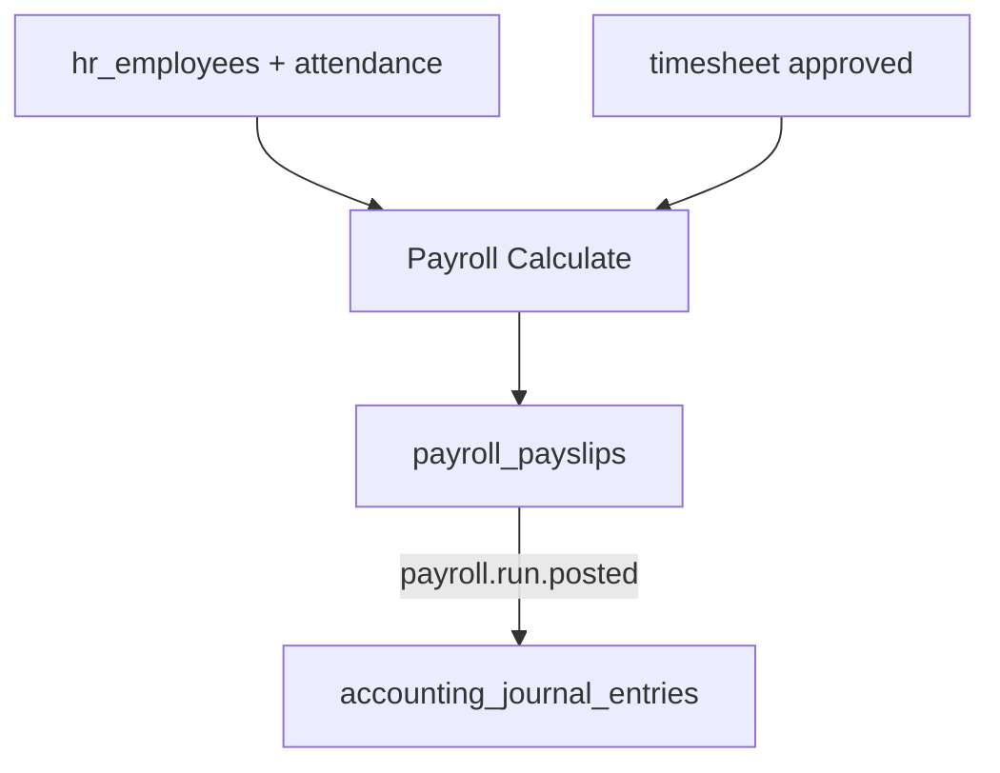

# Architecture — Payroll

> **Status:** Draft  
> **Module:** Payroll  
> **Phase:** 5 · Step 52  
> **Document Type:** Architecture  
> **Governance:** [MASTER_DATABASE_ARCHITECTURE.md](../../05-development/database/MASTER_DATABASE_ARCHITECTURE.md) · [MASTER_MODULE_ARCHITECTURE.md](../../01-architecture/MASTER_MODULE_ARCHITECTURE.md)

---

## Purpose
Payroll module architecture — scope, features, data ownership, and integration boundaries.

## When To Read
Read this file only if working on Payroll architecture, features, or module boundaries.

## Related Files
- [Dependencies](../../01-architecture/MODULE_DEPENDENCY_MAP.md)

## Read Next
- [Architecture](Architecture.md)

---

## Executive Summary

The Payroll module processes employee compensation — salary structures, payroll runs, payslips, and statutory deductions — under the `payroll_*` namespace. It reads workforce data from HR (employees, attendance, leave) and posts summarized journal entries to Accounting. Payslips link to `hr_employees` via employee ID, not duplicate person records.

| Goal | Target |
|------|--------|
| Accurate pay | Structure-driven calculation |
| Compliance | Tax and social contribution rules |
| Audit | Immutable posted payslips |
| Integration | One journal entry per payroll run |

---

## Mission

Automate periodic payroll processing with configurable salary components, deductions, and employer contributions while providing employees with payslip access and finance with GL-ready postings.

---

## Scope & Boundaries

### In Scope

- Salary structures and components (earning, deduction)
- Employee salary assignments
- Payroll run batch processing
- Payslip generation and distribution
- Tax and contribution rule configuration
- Accounting integration via events

### Out of Scope

- Employee master (HR)
- Time entry detail (Timesheet — input only)
- Bank file generation to treasury (future)
- Full statutory filing (external systems)

---

## Key Entities & Tables

> **Prefix:** `payroll_*` · Owner: **Payroll**

| Table | Purpose | Key Relationships |
|-------|---------|-------------------|
| `payroll_salary_components` | Earning/deduction types | → `companies` |
| `payroll_salary_structures` | Template bundles | → `companies` |
| `payroll_salary_structure_lines` | Components in structure | → `payroll_salary_components` |
| `payroll_employee_salaries` | Active structure per employee | → `hr_employees` |
| `payroll_tax_rules` | Income tax brackets | → `companies`, jurisdiction |
| `payroll_contribution_rules` | Social insurance rates | → `companies` |
| `payroll_runs` | Batch header per period | → `accounting_periods` |
| `payroll_run_employees` | Employee in run | → `payroll_runs`, `hr_employees` |
| `payroll_payslips` | Individual payslip | → `payroll_run_employees` |
| `payroll_payslip_lines` | Component breakdown | → `payroll_salary_components` |
| `payroll_ytd_summaries` | Year-to-date totals | → `hr_employees`, year |
| `payroll_loans` | Employee loans/advances | → `hr_employees` |
| `payroll_loan_repayments` | Deduction schedule | → `payroll_loans` |

### Indexes

```text
payroll_runs            (company_id, period_start, status)
payroll_payslips        (company_id, employee_id, period_start)
payroll_employee_salaries (employee_id, effective_from DESC)
```

---

## Core Shared Entities (Not Owned by Payroll)

| Core Entity | Payroll Usage |
|-------------|---------------|
| `contacts` | Via `hr_employees.contact_id` for payslip email |
| `companies` | Legal employer, currency |
| `users` | Payroll officer, employee portal |
| `attachments` | Signed payslip PDF storage |
| `notifications` | Payslip published alert |
| `accounting_periods` | Align run to fiscal period |

---

## Dependencies

### Core Platform

Workflow Engine (run approval), Notification System, Reporting Engine, API Layer.

### Sibling Modules

| Module | Relationship |
|--------|--------------|
| **HR** | Employees, attendance days, approved leave |
| **Timesheet** | Billable hours → overtime component (optional) |
| **Accounting** | `payroll.run.posted` → salary journal |
| **Project** | Project cost allocation from timesheet (future) |
| **Documents** | Store tax forms, contracts |

---

## Domain Events

| Event | Publisher | Consumers |
|-------|-----------|-----------|
| `payroll.run.created` | `payroll_runs` | Notifications |
| `payroll.run.calculated` | `payroll_runs` | Review UI |
| `payroll.run.approved` | `payroll_runs` | Notifications |
| `payroll.run.posted` | `payroll_runs` | Accounting, Analytics |
| `payroll.payslip.published` | `payroll_payslips` | Notifications (employee) |
| `payroll.structure.changed` | `payroll_employee_salaries` | Audit |

### Subscribed Events

| Event | Source | Payroll Action |
|-------|--------|----------------|
| `hr.employee.hired` | HR | Default salary assignment |
| `hr.employee.terminated` | HR | Final settlement run |
| `hr.attendance.recorded` | HR | Absence deductions |
| `hr.leave.approved` | HR | Unpaid leave adjustment |
| `timesheet.approved` | Timesheet | Overtime hours input |

---

## API

| Property | Value |
|----------|-------|
| **Base path** | `/api/v1/payroll/` |
| **Permission namespace** | `payroll.*` |

### Representative Endpoints

| Method | Path | Purpose |
|--------|------|---------|
| GET/POST | `/salary-structures` | Structure management |
| PUT | `/employees/{id}/salary` | Assign structure |
| POST | `/runs` | Create payroll run |
| POST | `/runs/{id}/calculate` | Compute payslips |
| POST | `/runs/{id}/approve` | Manager approval |
| POST | `/runs/{id}/post` | Post to Accounting |
| GET | `/payslips` | List (filtered by employee) |
| GET | `/payslips/{id}/pdf` | Download payslip |

Posted payslips are immutable; corrections via adjustment run.

---

## Integration Patterns



Calculation engine is synchronous per run; large companies queue calculate job.

---

## Security & Permissions

| Permission | Description |
|------------|-------------|
| `payroll.structures.manage` | Edit components |
| `payroll.runs.create` | Create and calculate runs |
| `payroll.runs.approve` | Approve before post |
| `payroll.runs.post` | Post to GL |
| `payroll.payslips.view_own` | Employee self-service |

Salary amounts restricted; managers see team summary only.

---

## Future Integration Notes

| Area | Plan |
|------|------|
| **Bank files** | SEPA, ACH export for bulk transfer |
| **Statutory** | Form 16, W-2 generation per locale |
| **Benefits** | Insurance and pension providers |
| **AI** | Anomaly detection on payroll variance |
| **Multi-country** | Per-jurisdiction tax engine plugins |

Declare all `payroll_*` tables in module `Database.md` before migrations.

---

**Module:** Payroll  
**Last Updated:** 2026-06-12  
**Author:** —  
**Reviewers:** —
