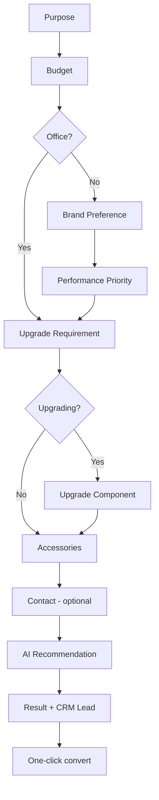

# AI Wizard Builder

> **Status:** Implemented (prototype + API)  
> **Route:** `/builder/pc-builder`  
> **Modes:** Manual Builder · Wizard Builder · AI Chat Builder

---

## Objective

Guided wizard experience for **non-technical users** — answer simple questions and receive a compatible, explained PC build with one-click conversion to the full manual configurator.

---

## Three builder modes

| Mode | UX | Best for |
|------|-----|----------|
| **Manual Builder** | 8-step component picker | Enthusiasts who know what they want |
| **Wizard Builder** | Question flow → AI recommendation | First-time buyers |
| **AI Chat Builder** | Natural-language prompt | Users who prefer typing freely |

Mode selector: `BuilderModeSelector` — persisted in `againerp-pc-builder-wizard` store.

---

## Wizard flow



### Questions

| Step | Type | Conditional |
|------|------|-------------|
| Purpose | Single choice | Always |
| Budget | Slider + presets | Always |
| Brand preference | Single choice | Skipped for office (unless budget ≥ ৳80k) |
| Performance priority | Single choice | Skipped for office |
| Upgrade requirement | Single choice | Always |
| Upgrade component | Single choice | Only if upgrading |
| Accessories | Multi choice | Always |
| Contact | Form | Optional — triggers CRM lead |

---

## Architecture

### Dynamic question engine

`lib/builder/wizard/question-engine.ts`

- `getVisibleSteps(answers)` — conditional step visibility
- `getWizardFlow(answers, currentStep)` — questions + progress %
- `answersToPrompt(answers)` — converts answers to AI planner prompt

### AI recommendation service

`lib/builder/wizard/wizard-recommendation-service.ts`

- Calls `planPcBuild()` from build planner
- Compatibility verification via rule engine
- Returns upgrades + alternatives

### Session persistence

| Layer | Storage |
|-------|---------|
| Frontend | Zustand `againerp-pc-builder-wizard` |
| Backend | `configurator_wizard_sessions` table |

---

## API reference

**Base:** `/api/v1/configurator/wizard/`

| Method | Endpoint | Description |
|--------|----------|-------------|
| GET | `/flow` | Dynamic questions from partial answers |
| POST | `/recommend` | AI build from wizard answers |
| POST | `/sessions` | Create wizard session |
| GET | `/sessions` | List user sessions |
| GET | `/sessions/{uuid}` | Get session |
| PATCH | `/sessions/{uuid}` | Update answers / step |
| POST | `/sessions/{uuid}/recommend` | Recommend + save to session |
| POST | `/sessions/{uuid}/lead` | CRM lead from contact info |

### Recommend request

```json
{
  "answers": {
    "purpose": "gaming",
    "budget_bdt": 150000,
    "brand_preference": "intel",
    "performance_priority": "max_fps",
    "upgrade_requirement": "new_build",
    "accessories": ["monitor"],
    "contact_name": "Rahim Ahmed",
    "contact_email": "rahim@example.com"
  }
}
```

### Response

```json
{
  "data": {
    "purpose": "gaming",
    "performance_tier": "mid_range",
    "selections": [{ "step_id": "cpu", "product_name": "…", "price": 28900 }],
    "total_price": 142500,
    "compatibility_status": "compatible",
    "explanation": "…",
    "upgrades": [],
    "alternatives": [],
    "confidence": 0.88
  }
}
```

---

## Database

**Table:** `configurator_wizard_sessions`

| Column | Type | Purpose |
|--------|------|---------|
| `session_code` | VARCHAR(50) | WIZ-XXXX |
| `mode` | VARCHAR(30) | manual / wizard / ai_chat |
| `current_step` | VARCHAR(50) | Active question |
| `answers` | JSONB | Wizard answers |
| `recommendation` | JSONB | Cached AI result |
| `build_uuid` | UUID | Linked saved build |
| `lead_id` | VARCHAR | CRM lead reference |
| `metadata` | JSONB | CRM contact snapshot |

Migration: `20260615140000_create_configurator_wizard_sessions.sql`

---

## UI components

| Component | Role |
|-----------|------|
| `BuilderModeSelector` | Manual / Wizard / AI tabs |
| `GuidedWizard` | Question flow orchestrator |
| `WizardQuestionCard` | Renders each question type |
| `WizardResultPanel` | Recommendation + convert CTA |
| `PcBuilderWorkspace` | Mode router |
| `PcBuilderAiAssistant` | AI Chat mode (existing) |
| `PcBuilderWizard` | Manual mode (existing) |

---

## Requirements mapping

| Requirement | Implementation |
|-------------|----------------|
| Dynamic question engine | `question-engine.ts` + `WizardEngineService.get_flow()` |
| Conditional steps | `getVisibleSteps()` / `_visible_steps()` |
| AI recommendation service | `wizard-recommendation-service.ts` + `/wizard/recommend` |
| Compatibility verification | `planPcBuild()` → rule engine |
| Alternative recommendations | `buildAlternatives()` in build planner |
| One-click convert to full build | `applyAiBuild()` + mode → manual |
| Save wizard session | Zustand persist + `POST /wizard/sessions` |
| CRM integration | `createCrmLead()` + `POST /wizard/sessions/{uuid}/lead` |

---

## Test plan

1. Open `/builder/pc-builder` → select **Wizard Builder**
2. Answer: Gaming → ৳1,50,000 → Intel → Max FPS → New build → Monitor
3. Click **Get my build** → verify recommendation panel
4. Click **One-click convert** → switches to Manual Builder with parts applied
5. Add contact info → verify CRM lead toast
6. Refresh page → session restored from localStorage
7. API: `POST /api/v1/configurator/wizard/recommend` with sample answers

---

## Related

- [PC_BUILDER_WIZARD.md](./PC_BUILDER_WIZARD.md)
- [AI_PC_BUILDER_ASSISTANT.md](./AI_PC_BUILDER_ASSISTANT.md)
- [ERP_INTEGRATION.md](./ERP_INTEGRATION.md)
