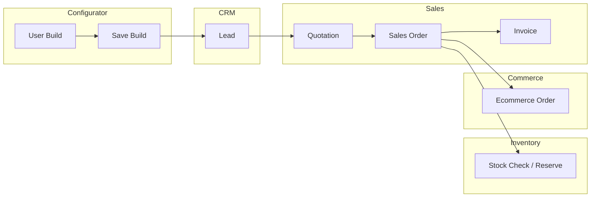

# Product Configurator — ERP Integration

> **Status:** Implemented (prototype + API)  
> **Modules:** Sales · Inventory · CRM · Quotation · Orders  
> **Workflow:** Build → Save → Lead → Quotation → Sales Order → Invoice

---

## Overview

The Configurator ERP Integration layer connects saved PC builds to AgainERP's quote-to-cash pipeline. It orchestrates CRM lead capture, Sales quotations, order confirmation with inventory checks, and invoice posting — without duplicating catalog or customer master data.



---

## Architecture

### Service boundaries

| Layer | Responsibility |
|-------|----------------|
| **Configurator** | Build storage, component lines, compatibility, `metadata.erp` links |
| **ErpIntegrationService** | Orchestrates workflow; writes cross-module references to build metadata |
| **CRMService** *(stub)* | Lead creation, pipeline stage |
| **SalesService** *(stub)* | Quotation, Sales Order, Invoice documents |
| **InventoryService** *(stub)* | Stock availability check + reservation on order confirm |
| **Commerce Orders** *(frontend)* | Mirror SO into `/orders/*` admin UI |

### Build metadata (`metadata.erp`)

```json
{
  "erp": {
    "funnel_stage": "sales_order",
    "lead_id": "lead_a1b2",
    "lead_number": "LEAD-3F2A1B",
    "quotation_id": "quo_c3d4",
    "quotation_number": "QUO-8E7F6D",
    "sales_order_id": "so_e5f6",
    "order_number": "SO-1A2B3C",
    "invoice_id": null,
    "stock_reserved": true,
    "events": [
      { "step": "lead", "at": "2026-06-15T10:00:00Z", "actor_id": 1 },
      { "step": "quotation", "at": "2026-06-15T10:00:01Z", "actor_id": 1 },
      { "step": "sales_order", "at": "2026-06-15T10:00:02Z", "actor_id": 1 }
    ]
  }
}
```

### Permissions

| Key | Action |
|-----|--------|
| `configurator.erp.integrate` | One-click quotation, order, lead, invoice, workflow |
| `configurator.view` | ERP analytics dashboard |

---

## API Reference

**Base:** `/api/v1/configurator/erp/`  
**Auth:** Bearer JWT + `X-Company-Id` + `X-Permissions`

### One-click actions

| Method | Endpoint | Description |
|--------|----------|-------------|
| POST | `/builds/{uuid}/lead` | Create CRM lead from build |
| POST | `/builds/{uuid}/quotation` | One-click quotation (auto-creates lead if missing) |
| POST | `/builds/{uuid}/sales-order` | One-click order (auto-creates quotation; checks stock) |
| POST | `/builds/{uuid}/invoice` | Post invoice from linked sales order |
| POST | `/builds/{uuid}/workflow` | Run multi-step pipeline |

### Analytics

| Method | Endpoint | Description |
|--------|----------|-------------|
| GET | `/analytics?profile_uuid=` | Funnel metrics, conversion rate, recent events |

### Request body (`ErpIntegrationRequest`)

```json
{
  "contact": {
    "name": "Rahim Ahmed",
    "email": "rahim@example.com",
    "phone": "+8801712345678",
    "source": "pc_builder"
  },
  "notes": "Gaming build — quote valid 14 days",
  "tax_rate": 5,
  "shipping_amount": 120,
  "skip_stock_check": false
}
```

### Workflow request (`ErpWorkflowRequest`)

```json
{
  "contact": { "name": "Rahim Ahmed" },
  "steps": ["lead", "quotation", "sales_order", "invoice"]
}
```

### Response (`ErpIntegrationResult`)

```json
{
  "data": {
    "build_uuid": "…",
    "build_code": "BLD-A1B2C3D4",
    "funnel_stage": "quotation",
    "links": { "lead_number": "LEAD-…", "quotation_number": "QUO-…" },
    "lead": { "lead_number": "LEAD-…", "stage": "new" },
    "quotation": { "quotation_number": "QUO-…", "grand_total": 98500 },
    "stock_checks": [],
    "warnings": []
  }
}
```

---

## Frontend integration

### Storefront PC Builder (`/builder/pc-builder`)

- **One-click quotation** — creates lead + quotation from current selections
- **One-click order** — full chain through stock check; syncs to Orders admin

Component: `components/configurator/erp/builder-erp-actions.tsx`

### Admin saved builds (`/catalog/product-configurator/builds`)

- Build detail sheet shows ERP actions: quotation, order, lead, invoice
- Links to `/orders/{id}` after order creation

### Analytics (`/catalog/product-configurator/analytics`)

- ERP conversion funnel: Saved → Lead → Quotation → Order → Invoice
- Conversion rate, pipeline value, recent ERP events

### Client stores

| Store | Key | Purpose |
|-------|-----|---------|
| `againerp-configurator-erp` | Zustand persist | Leads, quotations, ERP links |
| `again-orders-v2` | Zustand persist | Commerce order mirror |

Service: `lib/configurator/erp/integration-service.ts`

---

## Workflow details

### 1. Save build

User completes PC Builder wizard → **Save** persists to `pc-builder-store` (storefront) or `configurator-build-store` (admin). Backend: `POST /api/v1/configurator/builds`.

### 2. Create lead (CRM)

- Captures contact from build name / metadata
- Assigns to Sales Team
- Sets `funnel_stage: lead`
- Emits `configurator_build` activity log entry

### 3. One-click quotation

- Auto-creates lead if none exists
- Explodes `components[]` into quotation lines
- Calculates subtotal, tax (5%), 14-day validity
- Sets `funnel_stage: quotation`

### 4. One-click order

- Auto-creates quotation if none exists
- **Inventory:** checks `stock` per component SKU; blocks if insufficient
- Reserves stock (stub)
- Creates Sales Order (`SO-*`)
- Syncs to Commerce Orders with tag `build:{buildCode}`
- Sets `funnel_stage: sales_order`

### 5. Invoice

- Requires sales order
- Posts invoice (`INV-*`) with 30-day due date
- Sets `funnel_stage: completed`

---

## Module dependencies (target production)

```text
Configurator ──► CRMService.createLead()
              ──► SalesService.createQuotation()
              ──► SalesService.confirmOrder()
              ──► InventoryService.reserve()
              ──► SalesService.postInvoice()
              ──► FinanceService.createAR()
```

Current prototype uses **stub adapters** in `ErpIntegrationService` until CRM, Sales, and Inventory Python modules ship.

---

## Build analytics

| Metric | Source |
|--------|--------|
| Saved builds | `configurator_builds` count |
| Leads created | `metadata.erp.lead_id` present |
| Quotations sent | `metadata.erp.quotation_id` present |
| Orders confirmed | `metadata.erp.sales_order_id` present |
| Invoices posted | `metadata.erp.invoice_id` present |
| Conversion rate | orders ÷ saved builds × 100 |
| Pipeline value | Σ `total_price` for builds with ERP activity |

---

## Files

| Area | Path |
|------|------|
| API routes | `modules/product_configurator/routes/erp_integration.py` |
| Service | `modules/product_configurator/services/erp_integration_service.py` |
| Schemas | `modules/product_configurator/schemas/erp_integration.py` |
| Frontend types | `apps/web/src/lib/configurator/erp/types.ts` |
| Integration service | `apps/web/src/lib/configurator/erp/integration-service.ts` |
| UI actions | `apps/web/src/components/configurator/erp/builder-erp-actions.tsx` |

---

## Test plan

1. Open `/builder/pc-builder`, select compatible parts
2. Click **One-click quotation** → verify toast with `QUO-*` number
3. Click **One-click order** → verify `SO-*` and new row in `/orders/all`
4. Open `/catalog/product-configurator/builds` → detail sheet → **Invoice**
5. Open Analytics → verify funnel counts increment
6. API: `POST /api/v1/configurator/erp/builds/{uuid}/quotation` with `X-Company-Id: 1`
