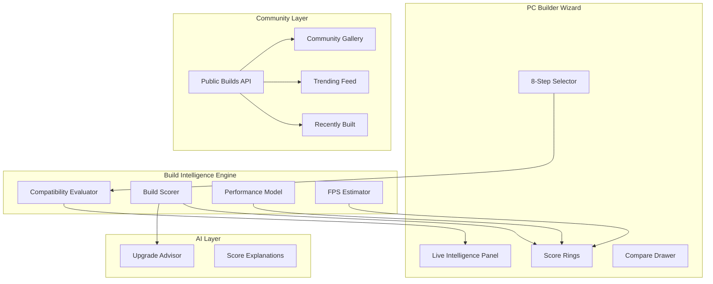

# Product Configurator — Premium UX Implementation Plan

> **Status:** Planned  
> **Scope:** PC Builder storefront + community layer  
> **Goal:** Transform the wizard from a functional configurator into a **premium, insight-rich build experience** comparable to PCPartPicker Pro, NZXT BLD, and Origin PC configurators.

---

## Executive summary

| Pillar | Features | Current state |
|--------|----------|---------------|
| **Live intelligence** | Compatibility, scores, estimates | Partial — banner + PSU/cooling hints only |
| **Scoring engine** | Build / thermal / power / noise | Not implemented |
| **Performance** | Perf estimate, FPS | Not implemented |
| **Comparison** | Per-step compare | Basic (3 cards, same step) |
| **Social** | Community, share, trending | Share URL only |
| **AI** | Upgrade advisor | AI build planner exists; no upgrade advisor |

**Recommended delivery:** 4 phases over ~8–10 sprints, with Phase 1 shipping the highest-impact visible upgrades (scores + live checker panel).

---

## Current foundation (reuse, don't rebuild)

| Asset | Path | Reuse for |
|-------|------|-----------|
| Compatibility engine | `lib/builder/compatibility-filter.ts` | Live checker, score penalties |
| Rule evaluator (admin) | `lib/compatibility/rule-evaluator.ts` | Backend parity |
| PSU calculator | `lib/builder/recommendations/psu-calculator.ts` | Power score |
| Cooling calculator | `lib/builder/recommendations/cooling-calculator.ts` | Thermal + noise score |
| Smart recommendations | `lib/builder/recommendations/engine.ts` | Upgrade path seeds |
| AI assistant | `lib/builder/ai/*` | Upgrade advisor |
| Compare panel | `builder-compare-panel.tsx` | Full-build comparison |
| Share hydrator | `builder-share-hydrator.tsx` | Public sharing |
| PC builder store | `lib/store/pc-builder-store.ts` | All live state |

---

## Target UX architecture



### New module layout (frontend)

```
apps/web/src/lib/builder/intelligence/
├── build-scorer.ts          # Composite build score
├── thermal-scorer.ts        # Thermal headroom score
├── power-scorer.ts          # PSU adequacy score
├── noise-scorer.ts          # Acoustic estimate
├── performance-estimator.ts # Synthetic benchmark index
├── fps-estimator.ts         # Game FPS table lookup
├── types.ts                 # ScoreBreakdown, EstimateResult
└── index.ts                 # evaluateBuildIntelligence()

apps/web/src/lib/builder/community/
├── types.ts                 # PublicBuild, TrendingBuild
├── share-service.ts         # Encode/decode, OG metadata
└── mock-community-builds.ts # Seed gallery data

apps/web/src/components/storefront/builder/
├── builder-intelligence-panel.tsx   # Live checker + scores
├── builder-score-rings.tsx          # Radial score UI
├── builder-fps-estimate.tsx         # Game picker + FPS bars
├── builder-full-compare-drawer.tsx  # Cross-build comparison
├── builder-community-gallery.tsx    # Community / trending / recent
├── builder-upgrade-advisor.tsx      # AI upgrade suggestions
└── builder-public-share-dialog.tsx  # Share + publish toggle
```

### New backend endpoints

| Method | Endpoint | Purpose |
|--------|----------|---------|
| `POST` | `/configurator/intelligence/evaluate` | Scores + perf + FPS for component set |
| `GET` | `/configurator/builds/public` | Paginated public builds |
| `GET` | `/configurator/builds/trending` | Trending by views + orders |
| `GET` | `/configurator/builds/recent` | Recently completed builds |
| `POST` | `/configurator/builds/{uuid}/publish` | Toggle public visibility |
| `POST` | `/configurator/ai/upgrade-advisor` | Targeted upgrade suggestions |

---

## Feature specifications

### 1. Live compatibility checker

**Today:** `BuilderCompatibilityBanner` shows aggregate status after 2+ parts selected.  
**Premium target:** Always-visible **Live Intelligence Panel** that updates on every selection.

| UX element | Behavior |
|------------|----------|
| Status pill | Compatible / Warning / Blocked with color + icon |
| Rule feed | Scrollable list of active IF/THEN results with severity |
| Step hints | "Selecting GPU will re-check PCIe and PSU" proactive copy |
| Blocking overlay | Incompatible products greyed with tooltip reason |
| Debounce | 150ms debounce on rapid selection changes |

**Implementation:**
- Extract `compatibilityDetails()` into `useBuildIntelligence()` hook
- New `BuilderIntelligencePanel` — sticky below step nav on desktop, collapsible sheet on mobile
- Wire to `POST /configurator/compatibility/evaluate` when API is live (fallback: local rules)

**Acceptance criteria:**
- [ ] Every rule violation visible within 200ms of selection
- [ ] Clicking a violation scrolls to affected step
- [ ] Zero false "compatible" when a blocking rule fires

---

### 2. Build score (composite)

**Definition:** 0–100 holistic quality score weighting compatibility, balance, value, and completeness.

```
build_score =
  compatibility_weight × compat_score      (40%)
+ balance_weight     × tier_balance_score  (25%)
+ value_weight       × price_performance   (20%)
+ completeness       × parts_filled / 8    (15%)
```

| Band | Range | Label | Color |
|------|-------|-------|-------|
| Excellent | 85–100 | Enthusiast-ready | Emerald |
| Good | 70–84 | Well balanced | Blue |
| Fair | 50–69 | Needs attention | Amber |
| Poor | 0–49 | Major issues | Red |

**UI:** Large radial gauge in summary sidebar; animated count-up on change.

**Data:** `BuildScoreBreakdown { total, compatibility, balance, value, completeness, tips[] }`

---

### 3. Thermal score

**Inputs:** CPU TDP, cooler TDP rating, case airflow class, GPU TDP, ambient assumption (25°C).

```
thermal_headroom = cooler_tdp_rating - cpu_tdp - gpu_residual
thermal_score = clamp(0, 100, f(thermal_headroom, case_airflow))
```

| Signal | Effect |
|--------|--------|
| Stock cooler on 125W+ CPU | −30 penalty |
| No case fans selected | −15 penalty |
| AIO on 65W CPU | +5 (overkill, minor noise penalty) |

**Reuse:** Extend `cooling-calculator.ts` → `thermal-scorer.ts`.

**UI:** Thermometer icon + score ring; hover shows "CPU 125W / Cooler rated 180W → 55W headroom".

---

### 4. Power score

**Inputs:** `calculateSystemDrawW()` + selected PSU wattage + efficiency tier (80+ Bronze/Gold).

```
power_score =
  psu_wattage >= draw × 1.2  → 90–100
  psu_wattage >= draw × 1.1  → 70–89
  psu_wattage <  draw × 1.1  → 0–49 (blocked at checkout)
```

**Reuse:** Extend `psu-calculator.ts` → `power-scorer.ts`.

**UI:** Lightning bolt ring; red pulse when under-powered; "Recommended: 650W" CTA.

---

### 5. Noise score

**Inputs:** CPU cooler type (stock/tower/AIO), GPU fan count, case dampening, PSU fanless flag.

```
noise_db_estimate = base + cooler_noise + gpu_noise - case_dampening
noise_score = invert_scale(noise_db_estimate)  // quieter = higher score
```

| Component | dB contribution (mock model) |
|-----------|------------------------------|
| Stock cooler | +8 |
| Tower air | +4 |
| 240mm AIO | +3 |
| High-end GPU (3-fan) | +6 |
| Mesh case | −2 |

**UI:** Waveform icon; "Estimated idle 28 dB / load 38 dB" subtitle.

**Note:** Prototype uses attribute-based heuristic; production can ingest manufacturer acoustic data.

---

### 6. Performance estimate

**Definition:** Normalized **Build Performance Index (BPI)** 0–10,000 — synthetic score, not a real benchmark.

```
BPI = w_cpu × cpu_score + w_gpu × gpu_score + w_ram × ram_score + w_storage × ssd_score
```

| Tier | BPI range | Label |
|------|-----------|-------|
| Entry | 0–2,500 | Everyday |
| Mid | 2,501–5,500 | Solid 1080p |
| High | 5,501–8,000 | 1440p / light 4K |
| Enthusiast | 8,001+ | 4K / creation |

**UI:** Horizontal bar with tier marker; comparison delta when swapping a part ("+12% BPI if you pick RTX 4070").

**Reuse:** `perfScore()` in `recommendations/engine.ts` — promote to shared `performance-estimator.ts`.

---

### 7. FPS estimate

**Definition:** Lookup-table FPS for popular titles at 1080p High / 1440p High based on GPU tier + CPU bottleneck factor.

| Game | Data source (prototype) |
|------|-------------------------|
| Valorant, CS2, Fortnite | Static table keyed by `gpu.attributes.tier` |
| Cyberpunk, RDR2 | Tier × 0.7 modifier |
| Productivity | N/A — hide FPS panel for workstation intent |

**UI:**
- Game chips (top 6) with FPS bars
- Resolution toggle (1080p / 1440p)
- Disclaimer: "Estimated — actual varies by settings"

```typescript
type FpsEstimate = {
  gameId: string;
  gameName: string;
  fps1080p: number;
  fps1440p: number;
  confidence: "low" | "medium" | "high";
};
```

---

### 8. Build comparison

**Today:** Per-step compare (max 3 products, same category).  
**Premium target:** **Full-build comparison** — compare 2–3 complete saved or community builds.

| Mode | Description |
|------|-------------|
| Part compare | Existing — keep, enhance with score delta column |
| Build compare | Side-by-side: price, BPI, FPS, all 5 scores, part diff |
| Swap preview | "What if I use their GPU?" — ghost overlay on your build |

**UI:** Full-screen drawer (`BuilderFullCompareDrawer`) triggered from summary "Compare builds" button.

**Columns:** Build name, total, BPI, FPS (avg), thermal, power, noise, part list diff (added/changed/removed).

---

### 9. Community builds

**Definition:** User-published builds browsable by others — clone, upvote, comment.

| Field | Type |
|-------|------|
| `id`, `buildCode`, `name` | Identity |
| `author` | Display name (or anonymous) |
| `components[]` | Public component picks |
| `scores` | Cached intelligence snapshot |
| `upvotes`, `views`, `clones` | Engagement |
| `tags[]` | gaming, budget, workstation |
| `publishedAt` | ISO date |

**Routes:**
- `/builder/community` — gallery hub
- `/builder/community/{buildCode}` — public build detail

**Actions:** Clone to my builder · Upvote · Share · Report

**Moderation:** Admin flag in `configurator-build-store`; profanity filter on names.

---

### 10. Public build sharing

**Today:** Base64 token in `?b=` — private, no metadata, no persistence.  
**Premium target:** Dual-mode sharing.

| Mode | URL | Behavior |
|------|-----|----------|
| **Private link** | `/builder/pc-builder?b=<token>` | Current — ephemeral encode |
| **Public page** | `/builder/community/PC-2026-0142` | SEO-friendly, OG image, clone CTA |

**Share dialog:**
- Copy link
- Publish toggle ("Make public")
- Social preview card (OG: build name, total, hero part image collage)
- QR code (mobile showroom)

**Backend:** `POST /builds/{uuid}/publish` sets `metadata.public = true`, generates slug.

---

### 11. Recently built PCs

**Definition:** Feed of builds completed in the last 7 days (saved + ordered), anonymized by default.

**Placement:**
- Builder hub (`/builder`) — "Recently built" carousel
- PC wizard sidebar — compact "Others built this" strip after step 4

**Sort:** `completedAt DESC`, prefer same budget band (±15%).

**Privacy:** Opt-out in user settings; show "Anonymous builder" unless published.

---

### 12. Trending builds

**Definition:** Ranked by engagement score over rolling 7 days.

```
trending_score = views × 1 + upvotes × 3 + clones × 5 + orders × 10
```

**Placement:**
- Builder hub hero — "Trending this week" (top 3 cards)
- Community gallery default sort

**Badges:** 🔥 Trending · ⭐ Staff pick · 💰 Best value

---

### 13. AI upgrade advisor

**Today:** AI assistant builds from scratch; smart recommendations suggest better parts.  
**Premium target:** Contextual **"Upgrade this part"** advisor on every selected component.

| Trigger | AI response |
|---------|-------------|
| Click "Advise" on CPU card | "For +৳8,500, i7-14700K gives +18% BPI and +22 FPS in Cyberpunk" |
| Score below 70 | Proactive banner: "3 upgrades would raise your build score to 84" |
| Budget remaining | "You have ৳12,000 left — best upgrade is GPU" |

**API:** `POST /configurator/ai/upgrade-advisor`

```json
{
  "profile_uuid": "…",
  "components": [],
  "target": { "step_id": "gpu", "goal": "fps" | "score" | "quiet" | "budget" },
  "budget_delta": 15000
}
```

**Response:** Ranked alternatives with score deltas, compatibility confirmation, natural-language explanation.

**Reuse:** `build-planner.ts` scoring + `pc-builder-ai-service.ts` explanation layer.

---

## Premium UI/UX patterns

### Score rings (signature component)

```
┌─────────────────────────────────────┐
│  Build Score          82  ████░     │
│  ┌────┐ ┌────┐ ┌────┐ ┌────┐       │
│  │ 88 │ │ 74 │ │ 91 │ │ 79 │       │
│  │Therm│ │Pwr │ │Noise│ │ BPI│       │
│  └────┘ └────┘ └────┘ └────┘       │
│  FPS: Valorant 320 · CP2077 68     │
└─────────────────────────────────────┘
```

- Radial SVG rings with spring animation (Framer Motion)
- Score change flash: green +N / red −N on part swap
- Locked state: grey rings until CPU + GPU selected

### Live checker panel

- Glassmorphism card pinned under step nav
- Expandable rule list with severity icons
- Pulse dot when re-evaluating

### Mobile layout

| Desktop | Mobile |
|---------|--------|
| Intelligence panel in right sidebar | Bottom sheet "Insights" tab |
| Score rings in summary | Horizontal scroll chips |
| Full compare drawer | Stacked cards |

### Micro-interactions

- Haptic-style tap on compatible select
- Confetti on build score ≥ 90
- Smooth step transitions with progress arc fill

---

## Data model extensions

### Build metadata (backend)

```json
{
  "intelligence": {
    "build_score": 82,
    "thermal_score": 88,
    "power_score": 91,
    "noise_score": 79,
    "bpi": 6200,
    "fps_estimates": [{ "game": "valorant", "fps1080p": 320 }],
    "computed_at": "2026-06-15T12:00:00Z"
  },
  "public": {
    "is_public": true,
    "slug": "rahim-gaming-pc",
    "upvotes": 42,
    "views": 1200,
    "clones": 18
  }
}
```

### Product attribute additions (catalog)

| Attribute | Used by |
|-----------|---------|
| `acoustic_db_idle`, `acoustic_db_load` | Noise score |
| `cooler_type`, `tdp_rating` | Thermal |
| `gpu_tier`, `benchmark_index` | BPI, FPS |
| `case_airflow`, `dampening` | Thermal, noise |
| `psu_efficiency` | Power score |

---

## Implementation phases

### Phase 1 — Live intelligence core (2 sprints)

**Ship:** Features 1, 2, 3, 4, 5, 6

| Task | Effort |
|------|--------|
| `build-scorer.ts` + sub-scorers | M |
| `BuilderIntelligencePanel` | M |
| `BuilderScoreRings` | S |
| `useBuildIntelligence()` hook | S |
| Wire into `pc-builder-wizard` + `builder-summary` | S |
| Unit tests for score formulas | S |

**Exit:** User sees 5 live scores + expanded compatibility feed on every selection.

---

### Phase 2 — Performance & comparison (2 sprints)

**Ship:** Features 7, 8

| Task | Effort |
|------|--------|
| `fps-estimator.ts` + game table seed | M |
| `BuilderFpsEstimate` component | S |
| `BuilderFullCompareDrawer` | L |
| Compare 2 saved builds from store | M |
| Score delta on part hover in compare | S |

**Exit:** FPS panel live; full-build compare works for saved builds.

---

### Phase 3 — Community & sharing (2 sprints)

**Ship:** Features 9, 10, 11, 12

| Task | Effort |
|------|--------|
| `community/` types + mock seed (50 builds) | M |
| `/builder/community` gallery page | L |
| Public build detail page | M |
| `BuilderPublicShareDialog` + publish toggle | M |
| Builder hub: trending + recent carousels | M |
| Backend: public builds API + publish endpoint | L |

**Exit:** Users can publish, browse, clone community builds; hub shows trending/recent.

---

### Phase 4 — AI upgrade advisor (1–2 sprints)

**Ship:** Feature 13

| Task | Effort |
|------|--------|
| `upgrade-advisor.ts` (client heuristic) | M |
| `BuilderUpgradeAdvisor` per-part panel | M |
| Backend `POST /ai/upgrade-advisor` | M |
| Proactive low-score suggestions | S |
| Score delta in AI response cards | S |

**Exit:** Every part has "Upgrade advice" with quantified impact.

---

## API contracts (Phase 1+)

### `POST /configurator/intelligence/evaluate`

**Request:**
```json
{
  "profile_uuid": "…",
  "components": [{ "category_uuid": "…", "product_uuid": "…", "quantity": 1 }],
  "purpose": "gaming"
}
```

**Response:**
```json
{
  "compatibility": { "status": "compatible", "violations": [] },
  "scores": {
    "build": 82,
    "thermal": 88,
    "power": 91,
    "noise": 79
  },
  "performance": { "bpi": 6200, "tier": "high" },
  "fps": [{ "game_id": "valorant", "fps_1080p": 320, "fps_1440p": 210 }],
  "tips": ["Add an aftermarket cooler to improve thermal score by ~12 pts"]
}
```

---

## Success metrics

| Metric | Target (90 days post-launch) |
|--------|------------------------------|
| Build completion rate | +25% vs baseline |
| Avg time in builder | +40% (engagement, not friction) |
| Share / publish rate | 15% of saved builds |
| Clone-from-community rate | 10% of community views |
| Upgrade advisor CTR | 30% of builds with score < 75 |
| Order conversion (builder → cart) | +18% |

---

## Risks & mitigations

| Risk | Mitigation |
|------|------------|
| FPS estimates inaccurate | Clear "estimated" disclaimer; confidence badge |
| Score gaming (cheap parts → high value score) | Cap value weight; require min tier balance |
| Community spam | Publish rate limit; admin moderation queue |
| Mobile performance (5 scores + rules) | Memoize scorer; web worker for heavy eval |
| Attribute data gaps | Graceful defaults; "insufficient data" state |

---

## File checklist (new)

| File | Phase |
|------|-------|
| `lib/builder/intelligence/build-scorer.ts` | 1 |
| `lib/builder/intelligence/thermal-scorer.ts` | 1 |
| `lib/builder/intelligence/power-scorer.ts` | 1 |
| `lib/builder/intelligence/noise-scorer.ts` | 1 |
| `lib/builder/intelligence/performance-estimator.ts` | 1 |
| `lib/builder/intelligence/fps-estimator.ts` | 2 |
| `lib/builder/intelligence/index.ts` | 1 |
| `components/.../builder-intelligence-panel.tsx` | 1 |
| `components/.../builder-score-rings.tsx` | 1 |
| `components/.../builder-fps-estimate.tsx` | 2 |
| `components/.../builder-full-compare-drawer.tsx` | 2 |
| `components/.../builder-community-gallery.tsx` | 3 |
| `components/.../builder-public-share-dialog.tsx` | 3 |
| `components/.../builder-upgrade-advisor.tsx` | 4 |
| `app/(storefront)/builder/community/page.tsx` | 3 |
| `modules/.../routes/intelligence.py` | 1 |
| `modules/.../routes/community_builds.py` | 3 |
| `modules/.../services/upgrade_advisor_service.py` | 4 |

---

## Related docs

- [PC_BUILDER_WIZARD.md](./PC_BUILDER_WIZARD.md)
- [COMPATIBILITY_ENGINE.md](./COMPATIBILITY_ENGINE.md)
- [SMART_RECOMMENDATION_ENGINE.md](./SMART_RECOMMENDATION_ENGINE.md)
- [AI_PC_BUILDER_ASSISTANT.md](./AI_PC_BUILDER_ASSISTANT.md)
- [ERP_INTEGRATION.md](./ERP_INTEGRATION.md)
