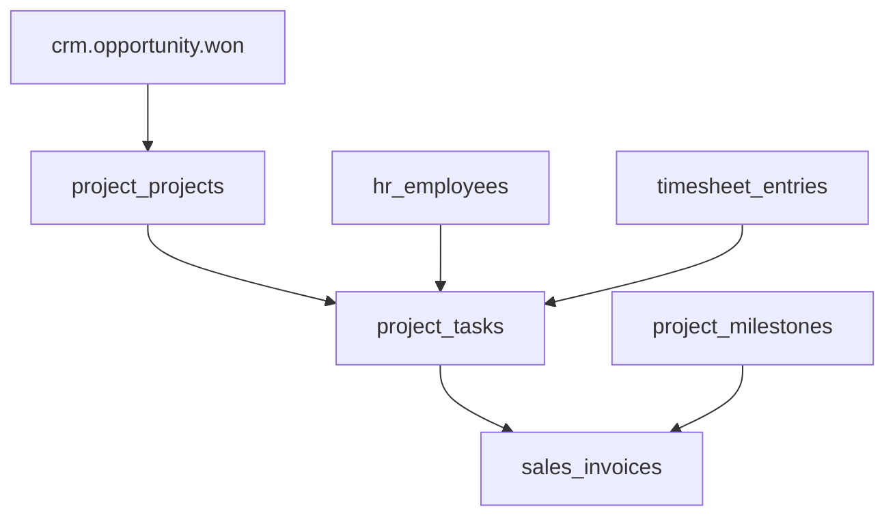

# Architecture — Project

> **Status:** Draft  
> **Module:** Project  
> **Phase:** 5 · Step 56  
> **Document Type:** Architecture  
> **Governance:** [MASTER_DATABASE_ARCHITECTURE.md](../../05-development/database/MASTER_DATABASE_ARCHITECTURE.md) · [MASTER_MODULE_ARCHITECTURE.md](../../01-architecture/MASTER_MODULE_ARCHITECTURE.md)

---

## Purpose
Project module architecture — scope, features, data ownership, and integration boundaries.

## When To Read
Read this file only if working on Project architecture, features, or module boundaries.

## Related Files
- [Dependencies](../../01-architecture/MODULE_DEPENDENCY_MAP.md)

## Read Next
- [Architecture](Architecture.md)

---

## Executive Summary

The Project module manages delivery work — projects, tasks, milestones, team allocation, and billing hooks — under the `project_*` namespace. Projects link to CRM contacts (clients) and HR employees (resources). Billable time flows from Timesheet; invoicing triggers Sales events. Per [MASTER_DATABASE_ARCHITECTURE §28](../../05-development/database/MASTER_DATABASE_ARCHITECTURE.md), `project_projects` and `project_tasks` integrate HR and Sales.

| Goal | Target |
|------|--------|
| Delivery tracking | Tasks, dependencies, milestones |
| Resource planning | Employee allocation by project |
| Billing readiness | Billable flags → Sales invoices |
| Portfolio view | Multi-project dashboards |

---

## Mission

Enable project managers to plan, execute, and bill client work with clear task ownership, milestone tracking, and integration into time tracking and sales invoicing.

---

## Scope & Boundaries

### In Scope

- Project creation with client, budget, and dates
- Task hierarchy, assignees, dependencies
- Milestones and deliverables
- Project team membership and roles
- Billing rates and fixed-price milestones
- Project status and health indicators
- Gantt/list/kanban views (UI layer)

### Out of Scope

- Time entry capture (Timesheet)
- Invoice generation (Sales)
- Employee records (HR)
- Full agile sprint tooling (future)

---

## Key Entities & Tables

> **Prefix:** `project_*` · Owner: **Project**

| Table | Purpose | Key Relationships |
|-------|---------|-------------------|
| `project_projects` | Project master | → `contact_id` (client), `company_id` |
| `project_project_members` | Team roster | → `hr_employees`, `project_projects` |
| `project_project_roles` | Role definitions | → `project_projects` |
| `project_tasks` | Work items | → `project_projects`, `parent_id` |
| `project_task_assignees` | Multi-assignee | → `project_tasks`, `hr_employees` |
| `project_task_dependencies` | FS/SS dependencies | → `project_tasks` |
| `project_milestones` | Key deliverables | → `project_projects` |
| `project_milestone_tasks` | Tasks in milestone | pivot |
| `project_billing_rates` | Hourly rates | → `project_projects`, `hr_employees` |
| `project_budget_lines` | Budget by category | → `project_projects` |
| `project_status_history` | Status audit | → `project_projects` |
| `project_templates` | Reusable project blueprints | → `companies` |
| `project_template_tasks` | Template task tree | → `project_templates` |

### Indexes

```text
project_projects        (company_id, status, end_date)
project_projects        (company_id, contact_id)
project_tasks           (project_id, status, sort_order)
project_tasks           (project_id, parent_id)
project_milestones      (project_id, due_date)
```

---

## Core Shared Entities (Not Owned by Project)

| Core Entity | Project Usage |
|-------------|---------------|
| `contacts` | Client/customer on project |
| `users` | PM, watchers |
| `companies` / `branches` | Tenant |
| `notes` / `comments` | Task discussion |
| `attachments` | Deliverable files |
| `activities` | Follow-up reminders |
| `tags` | Project labels |
| `approvals` | Budget change approval |

---

## Dependencies

### Core Platform

Workflow Engine, Notification System, Reporting Engine, API Layer.

### Sibling Modules

| Module | Relationship |
|--------|--------------|
| **CRM** | Won opportunity → create project |
| **HR** | `hr_employees` for assignees |
| **Timesheet** | Time entries → `project_tasks` |
| **Sales** | Milestone/time → `sales_invoices` |
| **Accounting** | Project cost center reporting |
| **Documents** | Deliverable repository |
| **Purchase** | Project-specific expenses (future) |

---

## Domain Events

| Event | Publisher | Consumers |
|-------|-----------|-----------|
| `project.project.created` | `project_projects` | Notifications, CRM |
| `project.project.completed` | `project_projects` | Analytics, CRM |
| `project.task.assigned` | `project_task_assignees` | Notifications |
| `project.task.completed` | `project_tasks` | Milestone progress |
| `project.milestone.reached` | `project_milestones` | Sales (bill trigger) |
| `project.budget.exceeded` | `project_projects` | Notifications |

### Subscribed Events

| Event | Source | Project Action |
|-------|--------|------------------|
| `crm.opportunity.won` | CRM | Optional auto-create project |
| `timesheet.approved` | Timesheet | Update actual hours rollup |
| `sales.invoice.posted` | Sales | Update billed amount |

---

## API

| Property | Value |
|----------|-------|
| **Base path** | `/api/v1/project/` |
| **Permission namespace** | `project.*` |

### Representative Endpoints

| Method | Path | Purpose |
|--------|------|---------|
| GET/POST | `/projects` | Project CRUD |
| GET/POST | `/projects/{id}/tasks` | Task management |
| POST | `/tasks/{id}/assign` | Assign employees |
| GET | `/projects/{id}/gantt` | Timeline data |
| GET/POST | `/milestones` | Milestone CRUD |
| POST | `/milestones/{id}/bill` | Trigger Sales invoice draft |
| GET | `/projects/{id}/timesheets` | Aggregated hours (Timesheet API proxy) |

---

## Integration Patterns



Project stores rolled-up `actual_hours` and `billed_amount` denormalized for dashboards; source of truth for hours is Timesheet.

---

## Security & Permissions

| Permission | Description |
|------------|-------------|
| `project.projects.view` | View assigned or all projects |
| `project.projects.manage` | Create/edit projects |
| `project.tasks.manage` | Edit tasks |
| `project.tasks.assign` | Assign team members |
| `project.billing.view` | See rates and budgets |
| `project.milestones.bill` | Create invoice from milestone |

Record rules: project member sees only assigned projects (configurable).

---

## Future Integration Notes

| Area | Plan |
|------|------|
| **Agile** | Sprints, backlog, velocity |
| **Manufacturing** | Project-linked work orders |
| **AI** | Risk prediction, schedule optimization |
| **Portfolio** | Cross-project resource leveling |
| **Subscriptions** | Recurring project billing |

Align ER with [MASTER_DATABASE_ARCHITECTURE §28](../../05-development/database/MASTER_DATABASE_ARCHITECTURE.md): `project_projects`, `project_tasks` → HR, Sales.

---

**Module:** Project  
**Last Updated:** 2026-06-12  
**Author:** —  
**Reviewers:** —
