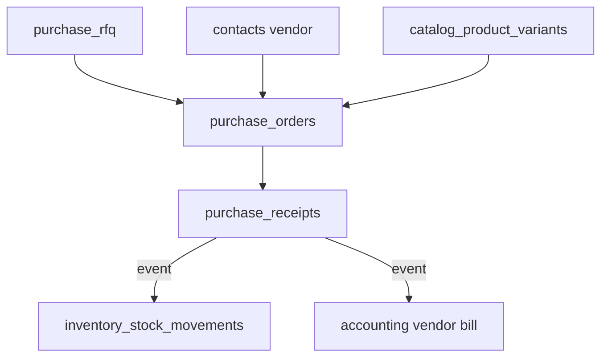

# Architecture — Purchase

> **Status:** Draft (superseded for platform scope)  
> **Module:** Purchase  
> **Canonical doc:** [PURCHASE_MODULE_ARCHITECTURE.md](./PURCHASE_MODULE_ARCHITECTURE.md) — independent module at `/purchase/*`  
> **Phase:** 5 · Step 48  
> **Document Type:** Architecture  
> **Governance:** [MASTER_DATABASE_ARCHITECTURE.md](../../05-development/database/MASTER_DATABASE_ARCHITECTURE.md) · [MASTER_MODULE_ARCHITECTURE.md](../../01-architecture/MASTER_MODULE_ARCHITECTURE.md)

---

## Purpose
Purchase module architecture — scope, features, data ownership, and integration boundaries.

## When To Read
Read this file only if working on Purchase architecture, features, or module boundaries.

## Related Files
- [Dependencies](../../01-architecture/MODULE_DEPENDENCY_MAP.md)

## Read Next
- [UI build guides](../../04-uiux/prototype/purchase/)

---

## Executive Summary

The Purchase module manages procurement — request for quotation (RFQ), vendor quotes, purchase orders, and receipt coordination — under the `purchase_*` namespace. Vendors are Core `contacts` with vendor type; goods receipt posts to Inventory `inventory_purchase_receipts`. Payables flow to Accounting via domain events.

| Goal | Target |
|------|--------|
| Procure-to-pay | RFQ → PO → receipt → vendor bill |
| Vendor master | Single party record via Core contacts |
| Stock accuracy | Receipt drives Inventory movements |
| Compliance | PO approval audit trail |

---

## Mission

Give procurement teams structured workflows to source materials and services, negotiate with vendors, and receive goods into Inventory with full cost traceability — without duplicating vendor or product master data.

---

## Scope & Boundaries

### In Scope

- RFQ creation and vendor response collection
- Purchase order lifecycle with approvals
- Vendor performance metrics (lead time, quality)
- Three-way match preparation (PO, receipt, bill)
- Link to Catalog for purchased items

### Out of Scope

- Vendor contact records (Core `contacts`)
- Physical stock ledger (Inventory)
- Vendor payment execution (Accounting)
- Product catalog definition (Catalog)

---

## Key Entities & Tables

> **Prefix:** `purchase_*` · Owner: **Purchase**

| Table | Purpose | Key Relationships |
|-------|---------|-------------------|
| `purchase_rfq` | Request for quotation header | → `companies`, `branch_id` |
| `purchase_rfq_items` | Lines requested | → `catalog_product_variants` |
| `purchase_rfq_vendors` | Invited vendors | → `contact_id` (vendor) |
| `purchase_rfq_responses` | Vendor quote responses | → `purchase_rfq_vendors` |
| `purchase_rfq_response_items` | Quoted prices per line | → `purchase_rfq_items` |
| `purchase_orders` | Confirmed PO | → `contact_id` (vendor) |
| `purchase_order_items` | PO lines with qty/price | → `catalog_product_variants` |
| `purchase_order_status_history` | Status audit | → `purchase_orders` |
| `purchase_receipts` | Goods receipt header | → `purchase_orders`, `inventory_warehouses` |
| `purchase_receipt_items` | Received quantities | → `purchase_order_items` |
| `purchase_vendor_terms` | Payment/delivery terms per vendor | → `contact_id` |
| `purchase_vendor_ratings` | Performance scores | → `contact_id` |

**Note:** `inventory_purchase_receipts` remains Inventory-owned; Purchase emits receipt events that Inventory consumes, or shares `purchase_receipt_id` FK per integration contract.

### Indexes

```text
purchase_orders       (company_id, po_number) UNIQUE
purchase_orders       (company_id, vendor_id, status)
purchase_rfq          (company_id, status, required_date)
```

---

## Core Shared Entities (Not Owned by Purchase)

| Core Entity | Purchase Usage |
|-------------|----------------|
| `contacts` | Vendors (`contact_types @> '{vendor}'`) |
| `addresses` | Vendor ship-from, company ship-to |
| `companies` / `branches` | Requesting entity |
| `users` | Buyer, approver |
| `approvals` | PO approval chains |
| `attachments` | Vendor quotes, contracts |
| `tax_classes` | Import duty, VAT on PO lines |

**Rule:** No `purchase_vendors` person table — vendor is `contact_id`.

---

## Dependencies

### Core Platform

Workflow Engine, Approval System, Notification System, Reporting Engine, Tax Engine.

### Sibling Modules

| Module | Relationship |
|--------|--------------|
| **Catalog** | Purchasable variants, last cost sync |
| **Inventory** | Receipt → stock in; `inventory_purchase_receipts` |
| **Accounting** | Vendor bills, AP aging, payment runs |
| **Sales** | Drop-ship PO from sales order (future) |
| **Project** | Project-specific PO lines (future) |

---

## Domain Events

| Event | Publisher | Consumers |
|-------|-----------|-----------|
| `purchase.rfq.sent` | `purchase_rfq` | Notifications (vendor portal) |
| `purchase.rfq.awarded` | `purchase_rfq_responses` | Analytics |
| `purchase.order.confirmed` | `purchase_orders` | Notifications, Analytics |
| `purchase.order.approved` | `purchase_orders` | Notifications |
| `purchase.receipt.completed` | `purchase_receipts` | Inventory, Accounting |
| `purchase.vendor.rated` | `purchase_vendor_ratings` | Analytics |

### Subscribed Events

| Event | Source | Purchase Action |
|-------|--------|-----------------|
| `inventory.stock.below_reorder` | Inventory | Suggest draft PO |
| `sales.order.confirmed` | Sales | Drop-ship PO (optional) |
| `catalog.product.created` | Catalog | Enable on RFQ lines |

---

## API

| Property | Value |
|----------|-------|
| **Base path** | `/api/v1/purchase/` |
| **Permission namespace** | `purchase.*` |

### Representative Endpoints

| Method | Path | Purpose |
|--------|------|---------|
| GET/POST | `/rfq` | RFQ management |
| POST | `/rfq/{id}/send` | Notify vendors |
| POST | `/rfq/{id}/award` | Select winning quote → PO |
| GET/POST | `/orders` | Purchase orders |
| POST | `/orders/{id}/approve` | Approval workflow |
| POST | `/receipts` | Record goods receipt |

Vendor portal (future): `/api/v1/purchase/vendor-portal/rfq/{token}` read-only.

---

## Integration Patterns



- Purchase owns PO and RFQ tables; Inventory owns stock quantities
- Cost price on Catalog updated via `catalog.product.cost_updated` event from receipt

---

## Security & Permissions

| Permission | Description |
|------------|-------------|
| `purchase.rfq.create` | Create RFQ |
| `purchase.orders.create` | Create PO |
| `purchase.orders.approve` | Approve above threshold |
| `purchase.receipts.create` | Warehouse receipt entry |
| `purchase.vendors.manage` | Vendor terms and ratings |

Separation of duties: buyer cannot approve own PO above limit.

---

## Future Integration Notes

| Area | Plan |
|------|------|
| **Supplier Feed** | Auto-PO from vendor catalog (Phase 7) |
| **Marketplace** | Multi-vendor procurement |
| **Manufacturing** | PO from MRP suggestions |
| **AI** | Vendor recommendation, price anomaly detection |
| **EDI** | cXML / UBL import for enterprise vendors |

Consolidate `purchase_receipts` and `inventory_purchase_receipts` ownership in `Database.md` before implementation.

---

**Module:** Purchase  
**Last Updated:** 2026-06-12  
**Author:** —  
**Reviewers:** —
