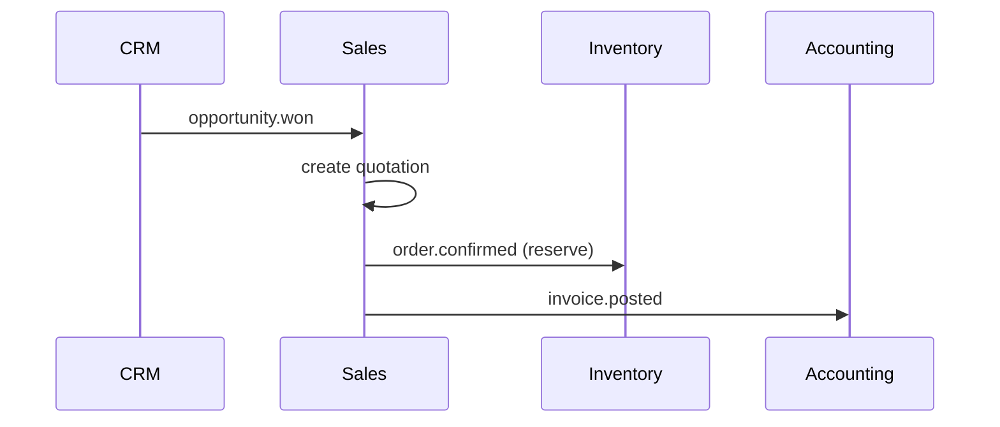

# Architecture — Sales

> **Status:** Superseded  
> **Module:** Sales  
> **Phase:** 5 · Step 47  
> **Document Type:** Architecture  
> **Governance:** [MASTER_DATABASE_ARCHITECTURE.md](../../05-development/database/MASTER_DATABASE_ARCHITECTURE.md) · [MASTER_MODULE_ARCHITECTURE.md](../../01-architecture/MASTER_MODULE_ARCHITECTURE.md)

> **Use instead:** [SALES_MODULE_ARCHITECTURE.md](./SALES_MODULE_ARCHITECTURE.md) — approved enterprise architecture at `/sales/*` (Step 04).

---

## Purpose
Sales module architecture — scope, features, data ownership, and integration boundaries.

## When To Read
Read this file only if working on Sales architecture, features, or module boundaries.

## Related Files
- [Dependencies](../../01-architecture/MODULE_DEPENDENCY_MAP.md)

## Read Next
- [UI build guides](../../04-uiux/prototype/sales/)

---

## Executive Summary

The Sales module owns B2B sales documents — quotations, sales orders, delivery notes, and customer invoices — under the `sales_*` namespace. It bridges CRM opportunities and Commerce `commerce_*` orders while posting financial impact to Accounting via events. Product lines reference Catalog variants; stock reservations flow through Inventory.

| Goal | Target |
|------|--------|
| Document lifecycle | Quote → order → delivery → invoice |
| Commerce alignment | Sync with `commerce_orders` where channel overlaps |
| Financial accuracy | Event-driven journal entries in Accounting |
| Throughput | 1M+ sales orders per company (partitioned by year) |

---

## Mission

Enable sales teams to create, approve, and fulfill customer-facing sales documents with full traceability from CRM opportunity through payment. Sales is the system of record for formal B2B transactions that may originate from Ecommerce, POS, or direct entry.

---

## Scope & Boundaries

### In Scope

- Sales quotations with expiry and revision
- Sales orders with approval workflow
- Delivery/shipment documentation
- Customer invoices and credit notes
- Linkage to `commerce_orders` for omnichannel orders

### Out of Scope

- Online cart/checkout UI (Ecommerce)
- General ledger posting logic (Accounting)
- Stock movements execution (Inventory)
- Payment gateway capture (Commerce payments → Accounting)

---

## Key Entities & Tables

> **Prefix:** `sales_*` · Owner: **Sales**

| Table | Purpose | Key Relationships |
|-------|---------|-------------------|
| `sales_quotations` | Price offers to customers | → `contact_id`, optional `crm_opportunity_id` |
| `sales_quotation_items` | Quote lines | → `catalog_product_variants` |
| `sales_orders` | Confirmed sales commitments | → `contact_id`, `commerce_order_id` (optional) |
| `sales_order_items` | Order lines | → `catalog_product_variants` |
| `sales_order_status_history` | Status audit trail | → `sales_orders` |
| `sales_delivery_notes` | Shipment records | → `sales_orders` |
| `sales_delivery_note_items` | Shipped quantities | → `sales_order_items` |
| `sales_invoices` | Customer billing documents | → `sales_orders`, `contact_id` |
| `sales_invoice_items` | Invoice lines | → `sales_order_items` |
| `sales_credit_notes` | Returns/adjustments | → `sales_invoices` |
| `sales_payment_allocations` | Invoice ↔ payment mapping | → `accounting_payments` (read FK) |
| `sales_price_lists` | Customer-specific pricing | → `contacts`, `catalog_product_prices` |

### Document Numbering

Per-company sequences: `SQ-`, `SO-`, `DN-`, `INV-` stored in `company_settings`.

### Indexes

```text
sales_orders        (company_id, order_number) UNIQUE
sales_orders        (company_id, status, order_date DESC)
sales_invoices      (company_id, invoice_number) UNIQUE
sales_invoices      (company_id, contact_id, due_date)
```

---

## Core Shared Entities (Not Owned by Sales)

| Core Entity | Sales Usage |
|-------------|-------------|
| `contacts` | Customer on every document |
| `addresses` | Bill-to, ship-to |
| `companies` / `branches` | Tenant and fulfillment branch |
| `users` | Sales rep, approver |
| `tax_classes` / `tax_rules` | Line tax calculation |
| `currencies` / `exchange_rates` | Multi-currency documents |
| `workflows` / `approvals` | Order and discount approval |
| `notes` / `attachments` | PO files, signed quotes |

---

## Dependencies

### Core Platform

Workflow Engine, Notification System, Reporting Engine, Tax Engine, API Layer.

### Sibling Modules

| Module | Relationship |
|--------|--------------|
| **CRM** | Opportunity → quotation; win on invoice |
| **Catalog** | Product variants, prices (read-only FK) |
| **Inventory** | Reserve stock on order confirm; deduct on delivery |
| **Ecommerce** | `commerce_orders` sync for web channel |
| **Accounting** | Invoice posted → `accounting.journal_entry.created` |
| **POS** | Retail orders may reference `sales_invoices` |

---

## Domain Events

| Event | Publisher | Consumers |
|-------|-----------|-----------|
| `sales.quotation.created` | `sales_quotations` | Notifications, CRM |
| `sales.quotation.accepted` | `sales_quotations` | CRM (won), Analytics |
| `sales.order.confirmed` | `sales_orders` | Inventory (reserve), Analytics |
| `sales.delivery.completed` | `sales_delivery_notes` | Inventory (issue), Notifications |
| `sales.invoice.posted` | `sales_invoices` | Accounting, Analytics |
| `sales.invoice.paid` | `sales_payment_allocations` | CRM, Analytics |

### Subscribed Events

| Event | Source | Sales Action |
|-------|--------|--------------|
| `commerce.order.placed` | Orders | Create linked `sales_orders` (configurable) |
| `crm.opportunity.won` | CRM | Suggest quotation creation |
| `inventory.stock.insufficient` | Inventory | Block or warn on order confirm |
| `accounting.payment.received` | Accounting | Allocate to open invoices |

---

## API

| Property | Value |
|----------|-------|
| **Base path** | `/api/v1/sales/` |
| **Permission namespace** | `sales.*` |

### Representative Endpoints

| Method | Path | Purpose |
|--------|------|---------|
| GET/POST | `/quotations` | List, create quotes |
| POST | `/quotations/{id}/send` | Email PDF to customer |
| POST | `/quotations/{id}/convert` | Convert to sales order |
| GET/POST | `/orders` | Sales order CRUD |
| POST | `/orders/{id}/confirm` | Confirm and reserve stock |
| POST | `/invoices` | Create from order |
| POST | `/invoices/{id}/post` | Post to Accounting |

`Idempotency-Key` required on confirm and post operations.

---

## Integration Patterns



- Sales **never** writes to `inventory_*` or `accounting_*` — events only
- `commerce_order_id` nullable FK links omnichannel orders without duplicating lines

---

## Security & Permissions

| Permission | Description |
|------------|-------------|
| `sales.quotations.view` | View quotes |
| `sales.orders.create` | Create orders |
| `sales.orders.approve` | Approve discounts / credit limits |
| `sales.invoices.post` | Post to ledger (restricted) |
| `sales.pricing.view_cost` | See margin (field-level) |

Credit limit check against Accounting receivables balance via API.

---

## Future Integration Notes

| Area | Plan |
|------|------|
| **Subscriptions** | Recurring invoice generation |
| **Manufacturing** | MTO sales orders → work orders |
| **Marketplace** | Split orders by vendor |
| **AI** | Quote optimization, churn risk on overdue invoices |
| **Multi-company** | Inter-company sales with elimination entries |

Partition `sales_orders` and `sales_invoices` by `order_date` / `invoice_date` at 1M+ rows.

---

**Module:** Sales  
**Last Updated:** 2026-06-12  
**Author:** —  
**Reviewers:** —
