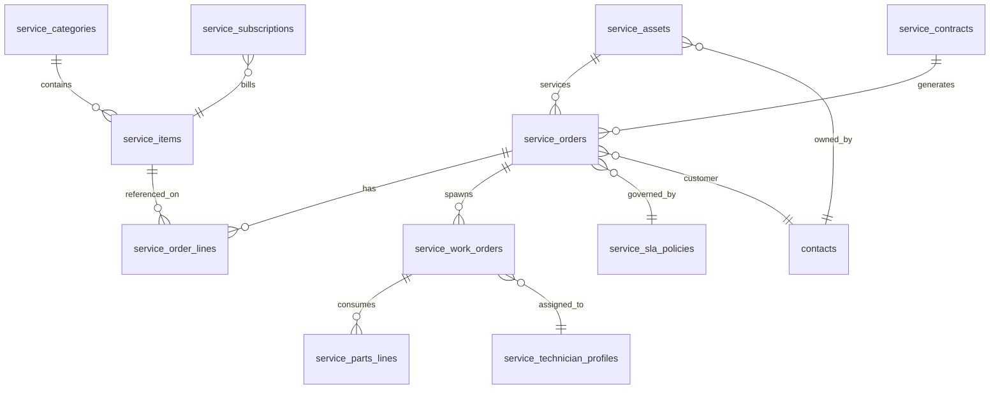

# Service Module — Database Architecture

> **Status:** Planning Phase  
> **Version:** 1.0  
> **Module:** Service  
> **Document Type:** Database Architecture  
> **Phase:** STEP 02 — Planning Only (no migrations)  
> **Parent:** [SERVICE_MODULE_ARCHITECTURE.md](./SERVICE_MODULE_ARCHITECTURE.md)  
> **Governance:** [MASTER_DATABASE_ARCHITECTURE.md](../../05-development/database/MASTER_DATABASE_ARCHITECTURE.md) · [database/standards.md](../../05-development/database/standards.md)

---

**No migrations. No ORM models. No SQL scripts.**

---

## 1. Design Principles

| Principle | Rule |
|-----------|------|
| **Namespace** | All tables prefixed `service_` |
| **Multi-tenant** | Every row has `tenant_id` + `company_id` |
| **UUID PK** | Public IDs are UUID v4 |
| **Soft delete** | `deleted_at` on operational entities |
| **Audit columns** | `created_at`, `updated_at`, `created_by`, `updated_by` |
| **No cross-module FK** | Reference Sales/Inventory/Finance by UUID only — no FK to foreign module tables |
| **Core FK allowed** | `contact_id`, `employee_id`, `media_id` → Core tables |

---

## 2. Multi-Tenant Strategy

```text
tenant_id          → SaaS tenant (AgainERP account)
company_id         → Legal entity within tenant
branch_id          → Optional service location (Core branch)
```

| Scope | Index pattern |
|-------|---------------|
| List by company | `(tenant_id, company_id, status, created_at DESC)` |
| Unique business keys | `UNIQUE (tenant_id, company_id, number)` |
| Asset serial | `UNIQUE (tenant_id, company_id, serial_number) WHERE serial_number IS NOT NULL` |

Row-Level Security (production): policy on `tenant_id` + `company_id` match JWT claims.

---

## 3. Entity Relationship Diagram



**External references (UUID, no FK):** `sales_order_id`, `sales_invoice_id`, `inventory_movement_id`, `project_id`

---

## 4. Table Definitions

### 4.1 Catalog

#### `service_categories`

| Column | Type | Notes |
|--------|------|-------|
| id | UUID PK | |
| tenant_id, company_id | UUID | |
| name | VARCHAR(120) | |
| parent_id | UUID NULL | Tree |
| sort_order | INT | |
| active | BOOLEAN | |

#### `service_items`

| Column | Type | Notes |
|--------|------|-------|
| id | UUID PK | |
| code | VARCHAR(40) | Unique per company |
| name | VARCHAR(200) | |
| category_id | UUID FK | → service_categories |
| billing_type | ENUM | fixed, hourly, project, contract, subscription |
| cost_price | DECIMAL(18,4) | |
| sale_price | DECIMAL(18,4) | |
| hourly_rate | DECIMAL(18,4) NULL | |
| duration_minutes | INT NULL | |
| tax_group_id | UUID NULL | Finance ref |
| skill_tags | JSONB | |
| status | ENUM | active, inactive |

**Indexes:** `(tenant_id, company_id, code)` UNIQUE · `(tenant_id, company_id, category_id, status)`

---

### 4.2 Assets

#### `service_assets`

| Column | Type | Notes |
|--------|------|-------|
| id | UUID PK | |
| asset_tag | VARCHAR(40) | Display ID |
| contact_id | UUID | Core contact |
| category | VARCHAR(40) | laptop, vehicle, ac, … |
| brand, model | VARCHAR(120) | |
| serial_number | VARCHAR(120) NULL | |
| warranty_end_date | DATE NULL | |
| location_text | VARCHAR(255) NULL | |
| status | ENUM | active, in_repair, retired |

**Indexes:** `(tenant_id, company_id, contact_id)` · `(tenant_id, company_id, serial_number)` UNIQUE partial

---

### 4.3 Operations

#### `service_orders`

| Column | Type | Notes |
|--------|------|-------|
| id | UUID PK | |
| number | VARCHAR(40) | SOV/2026/xxxx |
| contact_id | UUID | Customer |
| asset_id | UUID NULL FK | → service_assets |
| sales_order_id | UUID NULL | Sales ref |
| priority | ENUM | low, medium, high, critical |
| status | ENUM | draft, open, assigned, in_progress, completed, cancelled |
| schedule_date | TIMESTAMPTZ NULL | |
| assigned_technician_id | UUID NULL | → service_technician_profiles |
| sla_policy_id | UUID NULL FK | |
| billing_status | ENUM | unbilled, partial, billed |
| repair_stage | VARCHAR(40) NULL | When repair profile |
| notes_internal | TEXT | |
| notes_customer | TEXT | |

**Indexes:** `(tenant_id, company_id, number)` UNIQUE · `(tenant_id, company_id, status, schedule_date)` · `(tenant_id, company_id, contact_id)`

#### `service_order_lines`

| Column | Type | Notes |
|--------|------|-------|
| id | UUID PK | |
| service_order_id | UUID FK | |
| service_item_id | UUID FK NULL | |
| description | VARCHAR(500) | |
| qty | DECIMAL(12,4) | |
| unit_price | DECIMAL(18,4) | |
| billing_type | ENUM | Snapshot |
| line_total | DECIMAL(18,4) | Generated |

#### `service_work_orders`

| Column | Type | Notes |
|--------|------|-------|
| id | UUID PK | |
| number | VARCHAR(40) | WO/2026/xxxx |
| service_order_id | UUID FK | |
| technician_id | UUID FK NULL | |
| status | ENUM | scheduled, in_progress, done, cancelled |
| scheduled_start, scheduled_end | TIMESTAMPTZ | |
| actual_start, actual_end | TIMESTAMPTZ NULL | |
| work_notes | TEXT | |
| customer_signature_media_id | UUID NULL | |
| check_in_lat, check_in_lng | DECIMAL NULL | |
| check_out_lat, check_out_lng | DECIMAL NULL | |

#### `service_parts_lines`

| Column | Type | Notes |
|--------|------|-------|
| id | UUID PK | |
| work_order_id | UUID FK | |
| product_id | UUID | Catalog ref |
| qty | DECIMAL(12,4) | |
| warehouse_id | UUID | Inventory ref |
| unit_cost | DECIMAL(18,4) | Snapshot |
| inventory_movement_id | UUID NULL | Set after issue |

---

### 4.4 Technicians & Schedule

#### `service_technician_profiles`

| Column | Type | Notes |
|--------|------|-------|
| id | UUID PK | |
| employee_id | UUID | HR employee |
| skills | JSONB | |
| certifications | JSONB | |
| default_territory | VARCHAR(80) NULL | |
| active | BOOLEAN | |

**Indexes:** `(tenant_id, company_id, employee_id)` UNIQUE

#### `service_assignment_rules`

| Column | Type | Notes |
|--------|------|-------|
| id | UUID PK | |
| name | VARCHAR(120) | |
| service_category_id | UUID NULL | |
| required_skills | JSONB | |
| territory | VARCHAR(80) NULL | |
| priority | INT | Rule order |
| active | BOOLEAN | |

#### `service_schedule_slots`

| Column | Type | Notes |
|--------|------|-------|
| id | UUID PK | |
| resource_type | ENUM | technician, team |
| resource_id | UUID | |
| service_order_id | UUID NULL FK | |
| work_order_id | UUID NULL FK | |
| start_at, end_at | TIMESTAMPTZ | |
| status | ENUM | planned, confirmed, completed |

**Indexes:** `(tenant_id, company_id, resource_id, start_at, end_at)` — conflict detection

---

### 4.5 Commercial & SLA

#### `service_contracts`

| Column | Type | Notes |
|--------|------|-------|
| id | UUID PK | |
| number | VARCHAR(40) | |
| contact_id | UUID | |
| asset_id | UUID NULL FK | |
| start_date, end_date | DATE | |
| contract_value | DECIMAL(18,4) | |
| visit_frequency | ENUM | monthly, quarterly, yearly |
| visits_included | INT | |
| status | ENUM | draft, active, expired, cancelled |

#### `service_subscriptions`

| Column | Type | Notes |
|--------|------|-------|
| id | UUID PK | |
| contact_id | UUID | |
| service_item_id | UUID FK | |
| billing_interval | ENUM | monthly, quarterly, yearly |
| next_billing_date | DATE | |
| auto_renew | BOOLEAN | |
| status | ENUM | active, paused, cancelled |

#### `service_sla_policies`

| Column | Type | Notes |
|--------|------|-------|
| id | UUID PK | |
| name | VARCHAR(120) | |
| priority | ENUM | low, medium, high, critical |
| response_minutes | INT | |
| resolution_minutes | INT | |
| escalation_user_id | UUID NULL | |
| active | BOOLEAN | |

#### `service_sla_timers`

| Column | Type | Notes |
|--------|------|-------|
| id | UUID PK | |
| service_order_id | UUID FK UNIQUE | |
| response_due_at | TIMESTAMPTZ | |
| resolution_due_at | TIMESTAMPTZ | |
| responded_at | TIMESTAMPTZ NULL | |
| resolved_at | TIMESTAMPTZ NULL | |
| response_breached | BOOLEAN | |
| resolution_breached | BOOLEAN | |

---

## 5. Index Strategy Summary

| Pattern | Tables | Purpose |
|---------|--------|---------|
| Business number UNIQUE | orders, work_orders, contracts | Human reference |
| Status + date composite | service_orders, schedule_slots | Dashboards, dispatch |
| contact_id | assets, orders, contracts | Customer 360 |
| asset_id | orders | Asset history |
| technician + date range | schedule_slots, work_orders | Utilization |
| GIN on skill_tags | service_items, technician_profiles | Assignment matching |

---

## 6. Registry Alignment

On implementation gate, register all tables in [DATABASE_REGISTRY.md](../../00-foundation/registries/DATABASE_REGISTRY.md) under module `service`.

---

## Change History

| Date | Change |
|------|--------|
| 2026-06-21 | v1.0 — Initial database architecture (STEP 02) |
