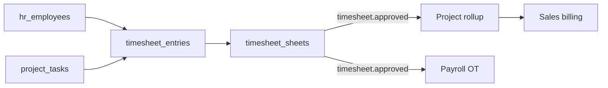

# Architecture — Timesheet

> **Status:** Draft  
> **Module:** Timesheet  
> **Phase:** 5 · Step 57  
> **Document Type:** Architecture  
> **Governance:** [MASTER_DATABASE_ARCHITECTURE.md](../../05-development/database/MASTER_DATABASE_ARCHITECTURE.md) · [MASTER_MODULE_ARCHITECTURE.md](../../01-architecture/MASTER_MODULE_ARCHITECTURE.md)

---

## Purpose
Timesheet module architecture — scope, features, data ownership, and integration boundaries.

## When To Read
Read this file only if working on Timesheet architecture, features, or module boundaries.

## Related Files
- [Dependencies](../../01-architecture/MODULE_DEPENDENCY_MAP.md)

## Read Next
- [Architecture](Architecture.md)

---

## Executive Summary

The Timesheet module captures time worked — daily or weekly time entries linked to Project tasks and HR employees — under the `timesheet_*` namespace. Approved hours feed Project billing rollups and Payroll overtime calculations. Employees are validated via `hr_employees`; no duplicate workforce identity.

| Goal | Target |
|------|--------|
| Accurate capture | Hours per task/project/day |
| Approval workflow | Employee → manager sign-off |
| Billing signal | Billable vs non-billable classification |
| Payroll input | Overtime and payable hours export |

---

## Mission

Provide employees and managers with a simple time logging experience tied to active projects, ensuring approved hours are available for client billing and payroll processing without manual reconciliation.

---

## Scope & Boundaries

### In Scope

- Time entry CRUD by employee
- Weekly timesheet submission
- Manager approval and rejection
- Billable/non-billable and activity type
- Timer-based entry (start/stop)
- Integration with Project tasks and HR calendar
- Overtime rules configuration (export to Payroll)

### Out of Scope

- Project planning (Project)
- Invoice creation (Sales)
- Pay calculation (Payroll)
- Attendance clock-in (HR — complementary data)

---

## Key Entities & Tables

> **Prefix:** `timesheet_*` · Owner: **Timesheet**

| Table | Purpose | Key Relationships |
|-------|---------|-------------------|
| `timesheet_activity_types` | Dev, meeting, travel, etc. | → `companies` |
| `timesheet_entries` | Atomic time log | → `hr_employees`, `project_tasks` |
| `timesheet_sheets` | Weekly container | → `hr_employees`, week_start |
| `timesheet_sheet_entries` | Entries grouped in sheet | → `timesheet_sheets`, `timesheet_entries` |
| `timesheet_approvals` | Approval record | → `timesheet_sheets`, approver `user_id` |
| `timesheet_timers` | Active running timer | → `hr_employees`, `project_tasks` |
| `timesheet_overtime_rules` | OT thresholds | → `companies` |
| `timesheet_lock_periods` | Prevent edits after close | → `companies`, date range |
| `timesheet_entry_history` | Edit audit | → `timesheet_entries` |

### Entry Pattern

```text
timesheet_entries.employee_id → hr_employees.id
timesheet_entries.task_id → project_tasks.id (nullable for internal time)
timesheet_entries.hours DECIMAL(8,2)
timesheet_entries.billable BOOLEAN
```

### Indexes

```text
timesheet_entries       (employee_id, entry_date DESC)
timesheet_entries       (task_id, entry_date)
timesheet_sheets        (employee_id, week_start) UNIQUE
timesheet_approvals     (sheet_id, status)
```

---

## Core Shared Entities (Not Owned by Timesheet)

| Core Entity | Timesheet Usage |
|-------------|-----------------|
| `users` | Submitter, approver login |
| `companies` | Tenant |
| `approvals` | Approval workflow engine |
| `notifications` | Submit/approve alerts |
| `activity_logs` | Platform audit |
| `notes` | Rejection comments |

---

## Dependencies

### Core Platform

Workflow Engine, Approval System, Notification System, Reporting Engine, API Layer.

### Sibling Modules

| Module | Relationship |
|--------|--------------|
| **HR** | Employee validation; leave blocks entry on leave days |
| **Project** | Tasks, billable rates, project membership check |
| **Payroll** | Approved hours → overtime component |
| **Sales** | Billable hours summary for invoicing (via Project) |
| **Accounting** | Cost allocation reports (future) |

---

## Domain Events

| Event | Publisher | Consumers |
|-------|-----------|-----------|
| `timesheet.entry.created` | `timesheet_entries` | Project rollup (async) |
| `timesheet.sheet.submitted` | `timesheet_sheets` | Notifications |
| `timesheet.approved` | `timesheet_approvals` | Payroll, Project, Analytics |
| `timesheet.rejected` | `timesheet_approvals` | Notifications |
| `timesheet.period.locked` | `timesheet_lock_periods` | Block edits |

### Subscribed Events

| Event | Source | Timesheet Action |
|-------|--------|------------------|
| `hr.leave.approved` | HR | Warn/block entries on leave dates |
| `project.task.completed` | Project | Optional stop timer |
| `project.project.completed` | Project | Block new entries |
| `payroll.run.posted` | Payroll | Lock period for paid hours |

---

## API

| Property | Value |
|----------|-------|
| **Base path** | `/api/v1/timesheet/` |
| **Permission namespace** | `timesheet.*` |

### Representative Endpoints

| Method | Path | Purpose |
|--------|------|---------|
| GET/POST | `/entries` | Daily entry list/create |
| POST | `/timers/start` | Start timer on task |
| POST | `/timers/stop` | Stop and create entry |
| GET/POST | `/sheets` | Weekly timesheet |
| POST | `/sheets/{id}/submit` | Submit for approval |
| POST | `/sheets/{id}/approve` | Manager approve |
| POST | `/sheets/{id}/reject` | Reject with comment |
| GET | `/reports/billable` | Billable hours by project |

Mobile-friendly: optimized for quick daily logging.

---

## Integration Patterns



Validation on create: employee must be `project_project_members` for task's project (unless admin override).

---

## Security & Permissions

| Permission | Description |
|------------|-------------|
| `timesheet.entries.create_own` | Log own time |
| `timesheet.entries.edit_own` | Edit unsubmitted entries |
| `timesheet.sheets.submit` | Submit weekly sheet |
| `timesheet.sheets.approve` | Approve team sheets |
| `timesheet.entries.view_all` | HR/admin view |
| `timesheet.periods.lock` | Accounting period lock |

Managers approve only direct reports (via `hr_employees.manager_id` or department).

---

## Future Integration Notes

| Area | Plan |
|------|------|
| **Mobile app** | Offline time entry sync |
| **Calendar** | Outlook/Google calendar import |
| **AI** | Suggest task allocation from calendar |
| **GPS** | Field service geo-stamped entries (Fleet module) |
| **Billing automation** | Auto-draft Sales invoice at month end |

Distinguish from HR attendance: timesheet = project hours; attendance = presence. Reconciliation report flags mismatches.

---

**Module:** Timesheet  
**Last Updated:** 2026-06-12  
**Author:** —  
**Reviewers:** —
