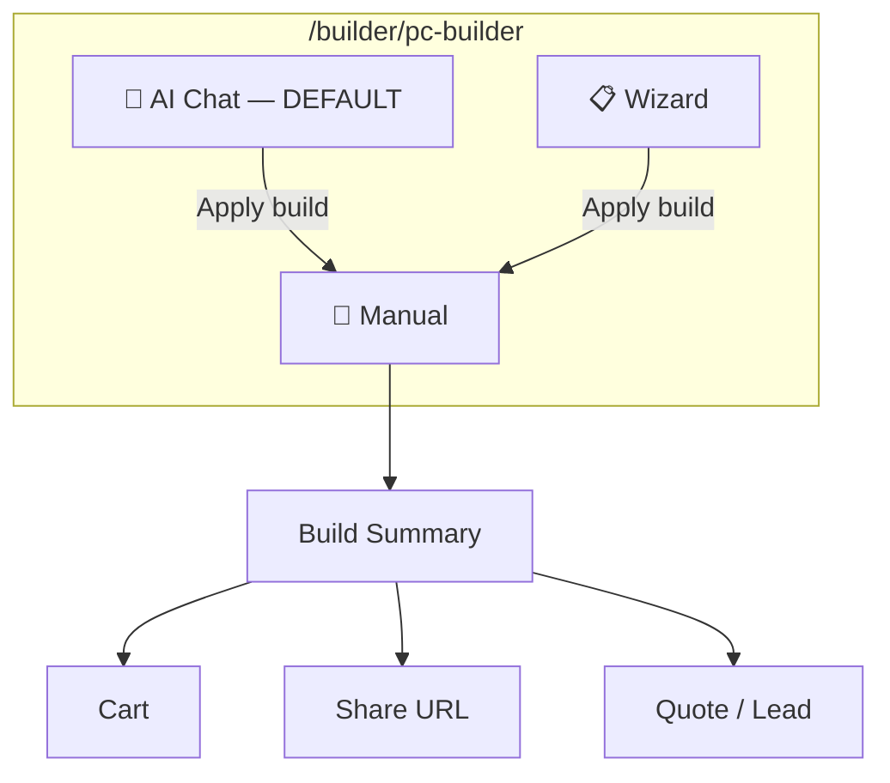
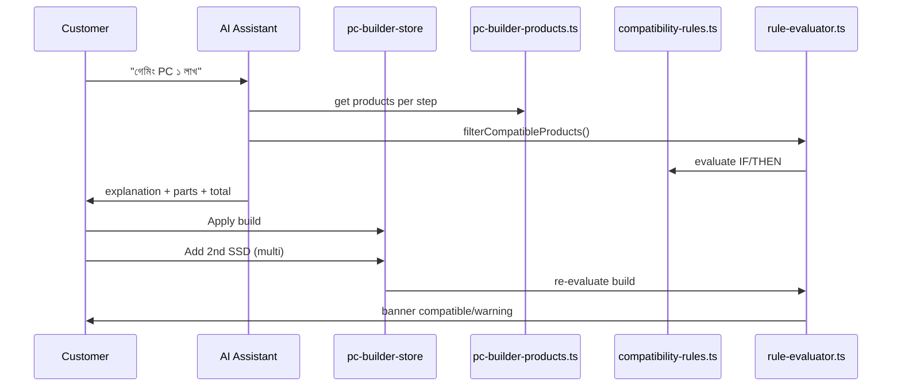

# PC Builder UX Blueprint — AgainERP (AI-First, Better Than Clone)

> **লক্ষ্য:** Wootware **কপি নয়** — আমাদের ERP + AI + compatibility engine দিয়ে **আরও শক্তিশালী** storefront + admin experience  
> **ধরণ:** UI/UX design guide — dummy data prototype (`apps/web`)  
> **প্রধান URL:** `/builder/pc-builder` · Admin: `/catalog/product-configurator/rules`

---

## ১. আমরা কী করছি (এক লাইনে)

```
Customer বলে: "১ লাখ টাকায় গেমিং PC"
        ↓
AI বুঝে → compatible parts বেছে → ব্যাখ্যা দেয়
        ↓
Manual mode-এ fine-tune (filter, multi RAM/SSD/HDD)
        ↓
Cart / Share / ERP Quote
```

**Admin side:** কোন rule কেন আছে — **সহজ ভাষায়** দেখা, **scenario দিয়ে test**, storefront-এ **তৎক্ষণাৎ** প্রভাব।

---

## ২. Wootware থেকে শিখেছি, কিন্তু আমরা এগিয়ে

| Area | Wootware | AgainERP (আমাদের দিক) |
|------|----------|------------------------|
| Entry | Budget wizard | **AI Chat default** + Wizard + Manual |
| Compatibility | Black box | **Live banner + rule messages + admin tester** |
| Share | `?selections=id,id` | `?selections=` + ERP build code |
| Multi storage | Yes | RAM + SSD + HDD multi-add ✓ |
| Admin rules | Unknown | **Plain Bangla + scenario cards** |
| Post-build | Cart only | **Cart + Lead + Quotation (ERP prototype)** |
| Intelligence | Basic | **AI explanation + upgrades + alternatives** |

---

## ৩. তিনটি mode — AI প্রথম (Recommended)



| Mode | কার জন্য | কী হয় |
|------|----------|--------|
| **AI Chat** ⭐ | সবাই — প্রথম choice | Natural language → full build + explanation |
| **Wizard** | Budget-conscious | Question cards → recommendation |
| **Manual** | Power user | Step-by-step + filter + multi-add |

### AI flow (prototype — dummy data)

1. User: `"১ লাখ টাকায় গেমিং PC বানাও"`
2. `intent-parser.ts` → purpose=gaming, budget=100000
3. `build-planner.ts` → compatible products per step
4. `evaluateBuildCompatibility()` → green/amber/red
5. UI shows: parts list, total, **বাংলা/English explanation**, upgrades
6. **Apply** → Manual builder-এ load → user SSD আরও add করতে পারে

**Mock files:** `lib/builder/ai/*`, `pc-builder-ai-assistant.tsx`

---

## ৪. Manual builder — ১০ step (dummy data)

```
CPU → Motherboard → RAM* → GPU → SSD* → HDD* → PSU → Case → Cooler? → Monitor
```

`*` = একাধিক add করা যায়

### প্রতি step-এ UI

| Zone | Component | কাজ |
|------|-----------|-----|
| Top | `BuilderStepNav` | Step jump, ✓ completed |
| Below | `BuilderCompatibilityBanner` | Live status + messages |
| Main | `BuilderProductToolbar` | Quick Filter · Filtering · Sort By |
| Grid | `BuilderProductCard` | Select / Add / Compare |
| Right | `BuilderSummary` | Click → jump to step |
| Right | `BuilderLiveInsights` | AI-style tips (PSU, cooling…) |
| Right | `BuilderRecommendationsPanel` | Smart upgrades |

### Filtering (আপনার reference image অনুযায়ী)

- **Quick Filter** — live search (name, brand, spec)
- **Filtering panel** — checkbox facets (HDD capacity, RAM size…)
- **Sort By** — price, name, stock

**Mock:** `lib/builder/product-list-utils.ts`

---

## ৫. Build Summary — interaction map

| User action | System response |
|-------------|-----------------|
| Click `GPU — not selected` | `setStep("gpu")` — GPU step খোলে |
| Click selected part name | Same step-এ যায় edit করতে |
| Click **Share** | `?selections=pcb_cpu_i5,pcb_gpu_4060,...` copy |
| Click **Add to cart** | প্রতিটি selection আলাদা cart line |
| Multi RAM (২টি) | Summary-তে ২ line + count badge |

---

## ৬. Admin Compatibility — user-friendly redesign

### সমস্যা (আগে)

- IF/THEN/ELSE technical — non-dev admin বুঝতে কষ্ট
- Tester শুধু raw dropdown — scenario context নেই

### সমাধান (prototype)

| Feature | Component | বর্ণনা |
|---------|-----------|--------|
| **Rule plain language** | `compatibility-rules-list.tsx` | প্রতি rule-এ বাংলা summary |
| **Quick Start templates** | `compatibility-rule-quick-start.tsx` | ৪টি common rule card |
| **Scenario tester** | `compatibility-scenario-cards.tsx` | ✅ Perfect / ❌ Socket / ⚠️ RAM |
| **Live evaluator** | `compatibility-evaluator-panel.tsx` | One-click scenario load |

### Admin test flow (design demo)

```
1. Rules page খুলুন → Quick Start cards দেখুন
2. "Socket Match" card — IF ব্যাখ্যা পড়ুন
3. Scenario: "Socket Mismatch" ক্লিক → Evaluate
4. Result: incompatible + কোন rule fail — plain message
5. Rule edit → storefront builder-এ same behaviour
```

**Mock rules:** `lib/mock-data/compatibility-rules.ts`  
**Scenarios:** `lib/mock-data/compatibility-scenarios.ts`

---

## ৭. Data flow — কীভাবে কাজ করে (dummy)



### Attribute → Rule chain

```
Product.attributes.socket = "lga_1700"
        ↓
Rule: CPU.socket equals Motherboard.socket
        ↓
Match → compatible | Mismatch → incompatible + message
```

Admin যে rule লেখে, storefront **একই seed** থেকে পড়ে — design phase-এ Zustand persist।

---

## ৮. Dummy data — দ্রুত test builds

### Preset (one-click)

`builder-presets-panel.tsx` — ৫টি full build

### Share URL example

```
/builder/pc-builder?selections=pcb_cpu_i5,pcb_mobo_b760_ddr5,pcb_ram_ddr5_32,pcb_gpu_4060,pcb_ssd_1tb,pcb_hdd_2tb,pcb_psu_650,pcb_case_4000d,pcb_cooler_tower,pcb_mon_27_1440
```

### AI prompts (Bangla + English)

- `১ লাখ টাকায় গেমিং PC বানাও`
- `ভিডিও এডিটিংয়ের জন্য workstation`
- `Build a gaming PC under 100000 BDT`

---

## ৯. Screen → file map (designer cheat sheet)

| আপনি কী দেখবেন | URL | Main component |
|----------------|-----|----------------|
| AI Builder | `/builder/pc-builder` | `pc-builder-ai-assistant.tsx` |
| Manual + filters | same, Manual mode | `pc-builder-wizard.tsx` |
| How it works | same, top panel | `builder-how-it-works.tsx` |
| Admin rules | `/catalog/product-configurator/rules` | `compatibility-rules-list.tsx` |
| Scenario test | rules page | `compatibility-scenario-cards.tsx` |

---

## ১০. Design checklist (updated)

### Storefront — AI-first

- [x] AI mode recommended + default
- [x] Bangla example prompts
- [x] How it works explainer panel
- [x] Live insights on manual mode
- [x] Summary click-to-navigate
- [x] Filter + sort + multi-add
- [ ] Budget chips in wizard (৳60k–৳3L) — next
- [ ] FPS / score rings — PREMIUM_UX phase

### Admin — friendly compatibility

- [x] Scenario tester cards
- [x] Quick start rule templates (visual)
- [x] Plain-language rule descriptions
- [ ] AI "suggest rule from description" — future
- [ ] Rule impact preview (X products affected) — future

---

## ১১. Related docs

| Doc | Purpose |
|-----|---------|
| [PROJECT.md](./PROJECT.md) | Master UI project |
| [ADMIN_COMPATIBILITY_UX.md](./ADMIN_COMPATIBILITY_UX.md) | Admin compatibility guide |
| [WOOTWARE_BUILDER_STUDY.md](./WOOTWARE_BUILDER_STUDY.md) | Competitive reference (not copy) |
| [AI_PC_BUILDER_ASSISTANT.md](../../../03-business-modules/product-configurator/AI_PC_BUILDER_ASSISTANT.md) | AI technical spec |

---

## দ্রুত শুরু

```bash
cd apps/web && npm run dev
```

| Role | URL |
|------|-----|
| Customer (AI) | http://localhost:3000/builder/pc-builder |
| Admin rules | http://localhost:3000/catalog/product-configurator/rules |

**প্রথম test:** AI mode → `"১ লাখ টাকায় গেমিং PC"` → Apply → Manual-এ SSD আরও add করুন → Summary-এ total দেখুন।
