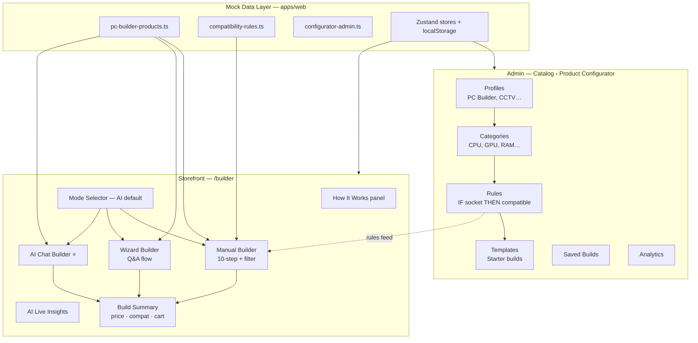
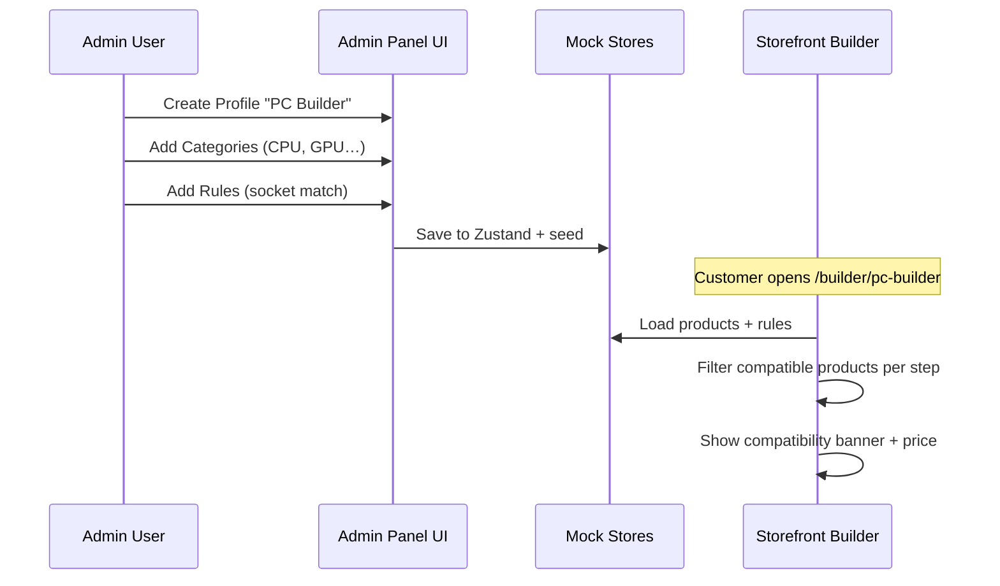

# Product Configurator — UI/UX Design Project

> **ধরণ:** UI/UX Design Document (Development নয়)  
> **লক্ষ্য:** **AI-First** PC Builder + **user-friendly** Admin Compatibility — Wootware কপি নয়, **আরও শক্তিশালী**  
> **ডেটা:** শুধু **dummy / mock data** (`apps/web` Zustand + seed files)  
> **মাস্টার blueprint:** [PC_BUILDER_UX_BLUEPRINT.md](./PC_BUILDER_UX_BLUEPRINT.md)  
> **Admin compatibility:** [ADMIN_COMPATIBILITY_UX.md](./ADMIN_COMPATIBILITY_UX.md)

---

## আপনি কী পাবেন এই document-এ

| Section | কী বোঝাবে |
|---------|-----------|
| [১. Project scope](#১-project-scope) | Design vs Development কী আলাদা |
| [২. System overview](#২-system-overview-visual) | পুরো system এক নজরে |
| [৩. Configuration কীভাবে হয়](#৩-configuration-কীভাবে-হয়-admin) | Admin থেকে rule/category setup |
| [৪. Customer journey](#৪-customer-journey-storefront) | Storefront PC Builder flow |
| [৫. AI-First builder](#৫-ai-first-builder-mode) | AI default · Bangla prompts |
| [৬. তিনটি Builder mode](#৬-তিনটি-builder-mode) | Manual · Wizard · AI Chat |
| [৬. Screen inventory](#৬-screen-inventory) | কোন URL-এ কী UI আছে |
| [৭. Mock data map](#৭-mock-data-map-design-only) | Design ঠিক করতে কোন file |
| [৮. Design checklist](#৮-design-checklist) | আপনি কী কী polish করবেন |
| [৯. Related docs](#৯-related-module-docs) | বিস্তারিত module docs |

**Visual canvas:** Cursor-এ `product-configurator-design.canvas.tsx` খুলুন — interactive diagram।

---

## ১. Project scope

### Design phase (এখন — আপনার কাজ)

```
apps/web/  →  Next.js UI prototype
           →  Mock data (localStorage persist)
           →  কোনো Python API call নেই
           →  শুধু screen layout, flow, copy, color, spacing ঠিক করা
```

### Development phase (পরে — dev team)

```
Python / FastAPI / PostgreSQL  →  এখনো implement করা হয়নি (removed)
ভবিষ্যতে: modules/product_configurator + apps/api যোগ করা হবে
```

> **মনে রাখুন:** বর্তমান project শুধু **Next.js design prototype** (`apps/web`)।

---

## ২. System overview (visual)



---

## ৩. Configuration কীভাবে হয় (Admin)

Admin panel দিয়ে **কোন product দেখাবে** এবং **কোন combination allowed** — সেটা configure হয়।

### Step-by-step configuration

| Step | Admin screen | আপনি কী design করবেন | Mock file |
|------|--------------|----------------------|-----------|
| 1 | **Profiles** | Builder type তৈরি (PC Builder, Laptop…) | `configurator-admin.ts` → profiles seed |
| 2 | **Categories** | প্রতি profile-এ slot (CPU, Motherboard…) | categories seed |
| 3 | **Rules** | IF/THEN/ELSE compatibility | `compatibility-rules.ts` |
| 4 | **Templates** | Pre-built starter configs | templates seed |
| 5 | **Attributes** | Product field schema (socket, TDP…) | `attributes/` admin |
| 6 | **Publish** | Storefront-এ live | profile status = active |

### Rule example (design বোঝার জন্য)

```
IF   CPU.socket = "lga_1700"
AND  Motherboard.socket ≠ "lga_1700"
THEN status = incompatible
     message = "CPU socket does not match motherboard"
```

Storefront PC Builder প্রতি step-এ compatible product filter করে — rule engine থেকে।

### Configuration → Storefront link



---

## ৪. Customer journey (Storefront)

### URLs

| Page | URL | Purpose |
|------|-----|---------|
| Builder hub | `/builder` | Landing — PC Builder CTA |
| PC Builder | `/builder/pc-builder` | Main configurator |
| Admin hub | `/catalog/product-configurator` | Back-office setup |

### Manual Builder flow (10 steps)

```
CPU → Motherboard → RAM* → GPU → SSD* → HDD* → PSU → Case → Cooler? → Monitor
```
`*` = multiple add · `?` = optional

---

## ৫. AI-First builder mode

**Default mode:** AI Chat (page load-এ)

| Feature | Prototype file |
|---------|----------------|
| Bangla + English prompts | `lib/builder/ai/prompts.ts` |
| Intent parse + build plan | `lib/builder/ai/build-planner.ts` |
| AI panel UI | `pc-builder-ai-assistant.tsx` |
| Apply → Manual fine-tune | `pc-builder-store.ts` → `applyAiBuild` |
| Live insights (manual) | `builder-live-insights.tsx` |
| How it works explainer | `builder-how-it-works.tsx` |

**Demo prompt:** `১ লাখ টাকায় গেমিং PC বানাও`

---

## ৬. তিনটি Builder mode

`/builder/pc-builder` page-এ mode selector:

| Mode | Target user | UX pattern | Design file |
|------|-------------|------------|-------------|
| **Manual Builder** | Tech-savvy | Step-by-step part picker | `pc-builder-wizard.tsx` |
| **Wizard Builder** | First-time buyer | Question cards → recommendation | `guided-wizard.tsx` |
| **AI Chat Builder** ⭐ | Everyone — default | Natural language → full build | `pc-builder-ai-assistant.tsx` |

### Wizard questions (conditional)

```
Purpose → Budget → Brand* → Performance* → Upgrade? → Component** → Accessories → Contact
```
\* Office build-এ skip  
\** শুধু upgrading হলে

---

## ৬. Screen inventory

### Storefront (`apps/web/src/app/(storefront)/builder/`)

| Screen | Component | Design notes |
|--------|-----------|--------------|
| Hub | `builder/page.tsx` | 2-column cards, CTA |
| PC Builder | `pc-builder/page.tsx` | How it works + mode selector + workspace |
| How it works | `builder-how-it-works.tsx` | 4-step Bangla explainer |
| AI (default) | `pc-builder-ai-assistant.tsx` | Bangla prompts + apply |
| Manual | `pc-builder-wizard.tsx` | Filter + multi-add + live insights |
| Summary | `builder-summary.tsx` | Mobile bottom bar |
| Product card | `builder-product-card.tsx` | Select + compare toggle |

### Admin (`apps/web/src/app/(admin)/catalog/product-configurator/`)

| Screen | Route | Component |
|--------|-------|-----------|
| Hub | `/catalog/product-configurator` | Overview |
| Profiles | `…/profiles` | List + form sheet |
| Categories | `…/categories` | List + form sheet |
| Rules | `…/rules` | Quick start + scenario tester + rule list |
| Templates | `…/templates` | Component picks |
| Builds | `…/builds` | Saved builds grid |
| Analytics | `…/analytics` | KPI + funnel |
| Attributes | `/configurator/attributes` | Field builder |

---

## ৭. Mock data map (design only)

Design ঠিক করতে **শুধু এই files** edit করুন — Python touch করবেন না।

| Data | File path | কী আছে |
|------|-----------|--------|
| PC products (48+ parts) | `apps/web/src/lib/mock-data/pc-builder-products.ts` | Name, price, stock, attributes |
| Compatibility rules | `apps/web/src/lib/mock-data/compatibility-rules.ts` | IF/THEN rules |
| Compatibility scenarios | `apps/web/src/lib/mock-data/compatibility-scenarios.ts` | Admin test scenarios |
| Admin seeds | `apps/web/src/lib/mock-data/configurator-admin.ts` | Profiles, templates, builds |
| Coolers | `apps/web/src/lib/mock-data/pc-builder-coolers.ts` | Cooling recommendations |
| PC Builder state | `apps/web/src/lib/store/pc-builder-store.ts` | Selections, save, share |
| Wizard state | `apps/web/src/lib/store/pc-builder-wizard-store.ts` | Q&A session |
| Admin stores | `apps/web/src/lib/store/configurator-*-store.ts` | CRUD lists |

### Product attribute example (design reference)

```typescript
// pc-builder-products.ts — প্রতি product-এ
{
  id: "pcb_cpu_i5",
  name: "Intel Core i5-14600K",
  price: 28900,
  stock: 24,
  stockStatus: "In Stock",
  stepId: "cpu",
  attributes: { socket: "lga_1700", tdp: 125, core_count: 14 },
}
```

---

## ৮. Design checklist

আপনি (designer) এই items polish করতে পারেন:

### Storefront — AI-first

- [x] AI mode default + Recommended badge
- [x] Bangla example prompts
- [x] How it works panel (4 steps)
- [x] AI Live Insights on manual mode
- [x] Summary click-to-navigate
- [x] Filter + sort + multi RAM/SSD/HDD
- [ ] Wizard budget chips (৳60k–৳3L)

### Admin — friendly compatibility

- [x] Quick Start rule cards (Bangla)
- [x] Scenario tester (4 scenarios)
- [x] Evaluator loads scenario
- [ ] AI "describe rule in Bangla" — future

### Global

- [ ] BDT currency format (`formatCurrency`)
- [ ] Dark mode contrast
- [ ] Bengali copy (optional)
- [ ] Responsive breakpoints (sm / lg)

---

## ৯. Related module docs

বিস্তারিত technical spec (reference only — design phase-এ পড়ুন, implement করবেন না):

| Doc | Topic |
|-----|-------|
| [Architecture.md](../../../03-business-modules/product-configurator/Architecture.md) | Module structure |
| [PC_BUILDER_WIZARD.md](../../../03-business-modules/product-configurator/PC_BUILDER_WIZARD.md) | 8-step wizard |
| [ADMIN_PANEL.md](../../../03-business-modules/product-configurator/ADMIN_PANEL.md) | Admin screens |
| [COMPATIBILITY_ENGINE.md](../../../03-business-modules/product-configurator/COMPATIBILITY_ENGINE.md) | Rule evaluator |
| [COMPONENT_ATTRIBUTE_ENGINE.md](../../../03-business-modules/product-configurator/COMPONENT_ATTRIBUTE_ENGINE.md) | Attribute profiles |
| [AI_PC_BUILDER_ASSISTANT.md](../../../03-business-modules/product-configurator/AI_PC_BUILDER_ASSISTANT.md) | AI chat |
| [PC_BUILDER_UX_BLUEPRINT.md](./PC_BUILDER_UX_BLUEPRINT.md) | **Master design — AI-first, how it works** |
| [ADMIN_COMPATIBILITY_UX.md](./ADMIN_COMPATIBILITY_UX.md) | Admin compatibility guide |
| [WOOTWARE_BUILDER_STUDY.md](./WOOTWARE_BUILDER_STUDY.md) | Competitive reference (inspire, don't copy) |
| [ERP_INTEGRATION.md](../../../03-business-modules/product-configurator/ERP_INTEGRATION.md) | Quote/order flow |
| [API.md](../../../03-business-modules/product-configurator/API.md) | Backend APIs (future) |

---

## দ্রুত শুরু (Designer)

```bash
cd apps/web
npm run dev
# Browser: http://localhost:3000/builder/pc-builder
# Admin:    http://localhost:3000/catalog/product-configurator
```

1. Mock product edit → `pc-builder-products.ts`
2. Rule edit → `compatibility-rules.ts`
3. UI component edit → `apps/web/src/components/storefront/builder/`
4. Refresh browser — instant preview

---

## সিদ্ধান্ত log

| সিদ্ধান্ত | কারণ |
|-----------|-------|
| Design = mock data only | Backend ছাড়াই UI iterate করা যায় |
| Python module রাখা হয়নি | Backend removed — design-only phase |
| তিনটি builder mode | Manual + Wizard + **AI default** |
| Admin scenario tester | Non-dev admin বুঝতে পারে rule impact |
| Admin আলাদা section | Configuration storefront থেকে আলাদা |
