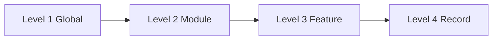

# AgainERP — Navigation Architecture

> **Status:** Active — **global navigation SSOT**  
> **Version:** 1.0 · **Date:** 2026-06-19  
> **Step:** 08 — Navigation Architecture  
> **Audience:** Architects · Product · Module teams · AI platform  
> **Governance:** [ARCHITECTURE_DECISIONS.md](../../ARCHITECTURE_DECISIONS.md) · [WORKSPACE_SHELL_ARCHITECTURE.md](./WORKSPACE_SHELL_ARCHITECTURE.md)

**No code.** Canonical navigation model for AgainERP — 100+ modules, multi-tenant SaaS, industry apps, AI-first workflows, mobile.

---

## Purpose

Define the **four-level navigation architecture** that scales across all tenants, plans, and modules. Physical shell zones live in [WORKSPACE_SHELL_ARCHITECTURE.md](./WORKSPACE_SHELL_ARCHITECTURE.md); this document defines **what users navigate and how**.

## When To Read

Read before adding module menus, designing search, or documenting `UI.md`. Read after workspace shell docs when the task is navigation logic (not layout dimensions).

## Related Files

- [GLOBAL_MENU_STRUCTURE.md](./GLOBAL_MENU_STRUCTURE.md) — 10 global groups + module placement
- [MODULE_NAVIGATION_STANDARD.md](./MODULE_NAVIGATION_STANDARD.md) — per-module tab standard
- [SEARCH_AND_DISCOVERY_ARCHITECTURE.md](./SEARCH_AND_DISCOVERY_ARCHITECTURE.md) — global + AI search
- [MOBILE_NAVIGATION_ARCHITECTURE.md](./MOBILE_NAVIGATION_ARCHITECTURE.md) — mobile patterns
- [BREADCRUMB_AND_ROUTING_STANDARD.md](./BREADCRUMB_AND_ROUTING_STANDARD.md) — breadcrumbs + URLs
- [DASHBOARD_FRAMEWORK_ARCHITECTURE.md](./DASHBOARD_FRAMEWORK_ARCHITECTURE.md) — dashboard layers (Step 09)
- [MODULE_REGISTRY.md](../../MODULE_REGISTRY.md) — installable modules

## Read Next

[GLOBAL_MENU_STRUCTURE.md](./GLOBAL_MENU_STRUCTURE.md)

---

## 1. Design Constraints

| Constraint | Requirement |
|------------|-------------|
| **Scale** | 100+ modules without sidebar clutter — groups, search, pins |
| **Multi-tenant SaaS** | Menus filtered by tenant plan, enabled modules, RBAC |
| **Industry apps** | Optional vertical packages in dedicated group |
| **AI-first** | Search, quick access, and navigation callable by AI agents |
| **Mobile** | Same mental model — bottom nav + drawer, not a separate app |
| **Single shell** | All levels render inside [workspace shell](./WORKSPACE_SHELL_ARCHITECTURE.md) |
| **Graceful hide** | Disabled module = hidden menu + skipped route — no errors |

---

## 2. Four Navigation Levels

```text
Level 1  GLOBAL NAVIGATION     → Which app area / module family (sidebar groups)
Level 2  MODULE NAVIGATION    → Module zones (Dashboard · Operations · Reports · …)
Level 3  FEATURE NAVIGATION   → Screens within a zone (Leads, Orders, SEO Audit)
Level 4  RECORD NAVIGATION    → Record state (list row · drawer · tabs · related)
```

### 2.1 Level mapping to workspace shell

| Nav level | Shell zone | Component prefix |
|-----------|------------|------------------|
| Level 1 | Left Sidebar | `WS-SIDE-*` |
| Level 2 | Module Nav Layer | `WS-MODNAV-*` |
| Level 3 | Sidebar ops menu + Content chrome | `WS-SIDE-ITEM` · `WS-CONTENT-*` |
| Level 4 | Content drawer / detail | `WS-CONTENT-SHEET` · `?view=` |

### 2.2 Flow diagram



**Rule:** Users may deep-link to Level 3 or 4; shell reconstructs Level 1–2 context from route + manifest.

---

## 3. Level 1 — Global Navigation

Ten fixed **groups** (display order). Empty groups hidden.

| Group | ID | Purpose |
|-------|-----|---------|
| 01 | `nav.favorites` | User-starred modules and screens |
| 02 | `nav.workspace-home` | Tenant/workspace dashboard entry |
| 03 | `nav.core-platform` | Always-on platform capabilities |
| 04 | `nav.business-ops` | ERP supply chain and finance |
| 05 | `nav.commerce` | Ecommerce and storefront operations |
| 06 | `nav.marketing` | Campaigns, automation, loyalty |
| 07 | `nav.human-resources` | HR, payroll, attendance |
| 08 | `nav.productivity` | Projects, support, knowledge |
| 09 | `nav.industry-apps` | Vertical industry packages |
| 10 | `nav.administration` | Platform and tenant admin |

Full module placement: [GLOBAL_MENU_STRUCTURE.md](./GLOBAL_MENU_STRUCTURE.md)

### 3.1 Global navigation behaviours

| Behaviour | Level | Detail |
|-----------|-------|--------|
| **Favorites** | 1 | Star any Level 3 screen → appears in Group 01 |
| **Recent items** | 1 | Last 15 visited Level 3+ destinations |
| **Pinned modules** | 1 | Pin module root to group top |
| **Smart search** | Header | Keyword + filters — [SEARCH_AND_DISCOVERY_ARCHITECTURE.md](./SEARCH_AND_DISCOVERY_ARCHITECTURE.md) |
| **AI search** | Header | Natural language navigation — same doc |
| **Quick access** | Header | Quick Actions + command palette |

---

## 4. Level 2 — Module Navigation

Every installable module exposes up to **five standard zones**:

| Zone | ID | Purpose | Hide when |
|------|-----|---------|-----------|
| **Dashboard** | `modnav.dashboard` | KPIs, module home | Never (default landing) |
| **Operations** | `modnav.operations` | Transactional features | No transactional screens |
| **Reports** | `modnav.reports` | Analytics and exports | No reports |
| **Automation** | `modnav.automation` | Workflows, rules, AI automations | No automation features |
| **Configuration** | `modnav.configuration` | Settings, integrations, defaults | No configurable options |

**Note:** Step 07 `Settings` tab is renamed **Configuration** in Step 08 for clarity. Route alias `/settings` remains valid.

Standard: [MODULE_NAVIGATION_STANDARD.md](./MODULE_NAVIGATION_STANDARD.md)

---

## 5. Level 3 — Feature Navigation

Feature items are **module-specific screens** registered in `ModuleManifest.md` and documented in `UI.md`.

| Source | Examples |
|--------|----------|
| Operations | CRM → Leads, Pipeline · Sales → Quotations, Orders |
| Reports | Sales Reports, SEO Reports |
| Automation | Workflow rules, scheduled jobs, AI agents |
| Configuration | Tax settings, pipeline stages, integrations |

**Ecommerce pattern:** Catalog, Orders, SEO, Builder are **Level 3 features** under `ecommerce` Operations — not separate Level 1 modules (unless promoted to installable in registry).

---

## 6. Level 4 — Record Navigation

Record-level navigation within a feature screen:

| Pattern | URL / UI | Use |
|---------|----------|-----|
| **List** | `/{module}/{entity}` | Default feature view |
| **Create drawer** | `?create=1` | New record |
| **View drawer** | `?view={id}` | Read record |
| **Edit drawer** | `?edit={id}` | Edit record |
| **Detail page** | `/{module}/{entity}/{id}` | Heavy records with tabs (optional) |
| **Record tabs** | In drawer or detail | Activities, related lists, attachments |
| **Related jump** | Context panel | Cross-module Level 4 via Related Records |

CRUD rules: [BREADCRUMB_AND_ROUTING_STANDARD.md](./BREADCRUMB_AND_ROUTING_STANDARD.md) · [ARCHITECTURE_DECISIONS §5.1](../../ARCHITECTURE_DECISIONS.md#51-crud--list--right-sheet-drawer)

---

## 7. Multi-Tenant Navigation

| Dimension | Effect on navigation |
|-----------|---------------------|
| **Tenant plan** | Groups/modules hidden if not licensed |
| **Enabled modules** | `ModuleManifest` install state per tenant |
| **Company / branch** | Workspace switcher filters record counts and badges |
| **RBAC** | Hide menu items — never show disabled links |
| **Industry package** | Group 09 populated only when vertical installed |
| **AI credits** | AI search/nav actions gated; menus stay visible |

Workspace context: [WORKSPACE_SHELL_ARCHITECTURE.md §3.1](./WORKSPACE_SHELL_ARCHITECTURE.md#31-workspace-switcher-detail)

---

## 8. AI-First Navigation

AI agents and the header assistant use the **same navigation registry** as the UI.

| Capability | Mechanism |
|------------|-----------|
| Navigate to screen | Tool resolves manifest route → HTTP redirect or client route |
| Open record | Tool returns `{ route, ?view=id }` |
| Natural language | AI search maps utterance → intent → registry ID |
| Create record | Quick action or `?create=1` on resolved entity route |
| Audit | All AI navigation logged per [AI_OS_ARCHITECTURE.md](../../06-ai/platform/ai/AI_OS_ARCHITECTURE.md) |

Agents read module `UI.md` + one `Menus/` file — not bulk menu trees ([BRAIN.md § AI Reading Policy](../../BRAIN.md#ai-reading-policy)).

---

## 9. Registration Model

| Level | Declared in |
|-------|-------------|
| 1 — Global group + module | `ModuleManifest.md` → `globalNav.group` |
| 2 — Module zones | `ModuleManifest.md` → `moduleNav` |
| 3 — Features | `ModuleManifest.md` → menus · `UI.md` |
| 4 — Entities | `UI.md` · `Menus/{Screen}.md` · `Architecture.md` §8 |

Platform merges all manifests at runtime (or build time for prototype).

---

## 10. Document Map (Step 08)

| Topic | Document |
|-------|----------|
| Global groups + modules | [GLOBAL_MENU_STRUCTURE.md](./GLOBAL_MENU_STRUCTURE.md) |
| Module zone standard | [MODULE_NAVIGATION_STANDARD.md](./MODULE_NAVIGATION_STANDARD.md) |
| Search + AI discovery | [SEARCH_AND_DISCOVERY_ARCHITECTURE.md](./SEARCH_AND_DISCOVERY_ARCHITECTURE.md) |
| Mobile | [MOBILE_NAVIGATION_ARCHITECTURE.md](./MOBILE_NAVIGATION_ARCHITECTURE.md) |
| Breadcrumbs + routes | [BREADCRUMB_AND_ROUTING_STANDARD.md](./BREADCRUMB_AND_ROUTING_STANDARD.md) |
| Shell zones | [WORKSPACE_SHELL_ARCHITECTURE.md](./WORKSPACE_SHELL_ARCHITECTURE.md) |
| Legacy shortcuts | [navigation.md](./navigation.md) |

---

## Change History

| Date | Version | Change |
|------|---------|--------|
| 2026-06-19 | 1.0 | Step 08 — navigation architecture SSOT |

---

**Navigation Architecture** — four levels, ten global groups, one registry, every module.
