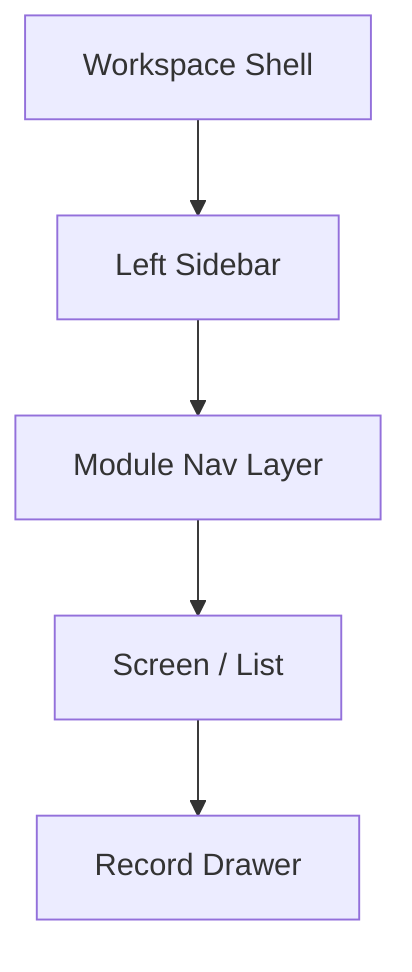

# AgainERP — Workspace Navigation Rules

> **Status:** Active  
> **Version:** 1.0 · **Date:** 2026-06-19  
> **Step:** 07 — Workspace Shell Architecture  
> **Authority:** [WORKSPACE_SHELL_ARCHITECTURE.md](./WORKSPACE_SHELL_ARCHITECTURE.md)  
> **Navigation SSOT:** [NAVIGATION_ARCHITECTURE.md](./NAVIGATION_ARCHITECTURE.md) — global groups, search, breadcrumbs (Step 08)

---

## Purpose

Rules for **how users and modules navigate** the workspace shell — sidebar levels, module tabs, RBAC visibility, URL patterns, and registration contracts.

## When To Read

Read when adding menus to a module, updating `UI.md`, or designing cross-module navigation.

## Related Files

- [NAVIGATION_ARCHITECTURE.md](./NAVIGATION_ARCHITECTURE.md) — **global navigation SSOT (Step 08)**
- [MODULE_REGISTRY.md](../../MODULE_REGISTRY.md) — module layers → sidebar sections
- [WORKSPACE_COMPONENT_REGISTRY.md](./WORKSPACE_COMPONENT_REGISTRY.md) — component IDs
- [MODULE_GENERATOR_GUIDE.md](../../MODULE_GENERATOR_GUIDE.md) — new module package
- [navigation.md](./navigation.md) — breadcrumbs, keyboard shortcuts

## Read Next

[WORKSPACE_SHELL_ARCHITECTURE.md §4–§5](./WORKSPACE_SHELL_ARCHITECTURE.md#4-left-sidebar)

---

## 1. Navigation Hierarchy

Four levels — never skip levels in URL structure:

```text
Level 0  Workspace Shell (persistent)
Level 1  Sidebar section → Module selection
Level 2  Module Navigation Layer (Dashboard · Operations · Reports · Settings)
Level 3  Operational menu → Screen (list, dashboard widget, report)
Level 4  Record / drawer state (?view= · ?edit= · ?create=)
```



---

## 2. Left Sidebar — Section Rules

### 2.1 Section assignment

| Section | Module layer | Examples | Empty when |
|---------|--------------|----------|------------|
| **Favorites** | any | User-starred items | No favorites saved |
| **Core Modules** | `core` | Contacts, Users, Workflow | Never empty (always on) |
| **Business Modules** | `erp` · `commerce` | CRM, Sales, Ecommerce, HR | No business modules in plan |
| **Industry Apps** | `industry` | Hospital, School, Retail vertical | No industry package installed |
| **Administration** | `platform` | Tenants, Billing, Modules, Audit | Hidden for non-admin roles |

Source of truth for module layer: [MODULE_REGISTRY.md](../../MODULE_REGISTRY.md)

### 2.2 Ordering

| Priority | Rule |
|----------|------|
| 1 | Favorites (user order) |
| 2 | Pinned items (user order) within each section |
| 3 | Core Modules (fixed platform order) |
| 4 | Business Modules (alphabetical by display name, unless manifest `order` set) |
| 5 | Industry Apps (manifest order) |
| 6 | Administration (fixed platform order) |

### 2.3 Sidebar item anatomy

Each `WS-SIDE-ITEM` must declare:

| Field | Required | Example |
|-------|----------|---------|
| `id` | yes | `crm.leads` |
| `label` | yes | Leads |
| `icon` | yes | Lucide icon name |
| `route` | yes | `/crm/leads` |
| `module` | yes | `crm` |
| `permission` | yes | `crm.lead.view` |
| `section` | yes | `business` |
| `badge` | no | API count endpoint |
| `order` | no | 10 |

### 2.4 Collapse, expand, pin, search

| Action | Scope | Persistence |
|--------|-------|-------------|
| **Collapse sidebar** | Whole sidebar width | User preference (local + server) |
| **Collapse section** | One section header | User preference |
| **Pin item** | Single menu item to section top | User preference |
| **Search** | Filters all sections live | Session only |

**Search rule:** Matching hides non-matching branches; expand parents of matches automatically.

---

## 3. Module Navigation Layer Rules

### 3.1 Required tabs

| Tab | Required when | Default route |
|-----|---------------|---------------|
| Dashboard | Always (unless module is pure utility) | `/{route}/dashboard` |
| Operations | Module has transactional screens | First ops menu item |
| Reports | Module has `Reports.md` entries | `/{route}/reports` |
| Settings | Module has configurable options | `/{route}/settings` |

### 3.2 Tab visibility

```text
IF module has zero report screens → hide Reports tab
IF module has zero settings → hide Settings tab
IF module is dashboard-only → hide Operations tab (rare)
```

### 3.3 Operations submenu

When user selects **Operations**:

- **Desktop:** Operational menus appear in sidebar **below** module header OR as nested tree under active module
- **Mobile:** Operational menus in `WS-MOBILE-MOD-DRAWER`

Operational items come from `ModuleManifest.md` menu groups — not hardcoded in shell.

### 3.4 Active state

| Element | Active when |
|---------|-------------|
| Sidebar module item | Current route prefix matches module |
| Module nav tab | Current route matches tab zone |
| Sidebar ops item | Exact route match |
| Breadcrumb | Reflects levels 1–4 |

---

## 4. URL & Routing Rules

### 4.1 Route namespace

Each module owns one prefix — declared in `Architecture.md` and `ModuleManifest.md`:

| Module | Route prefix | API |
|--------|--------------|-----|
| ecommerce | `/catalog/*` | `/api/v1/commerce/` |
| crm | `/crm/*` | `/api/v1/crm/` |
| sales | `/sales/*` | `/api/v1/sales/` |

Full list: [MODULE_REGISTRY.md](../../MODULE_REGISTRY.md)

### 4.2 Standard routes

| Purpose | Pattern |
|---------|---------|
| Module dashboard | `/{prefix}/dashboard` or module default |
| Entity list | `/{prefix}/{entities}` |
| Entity CRUD drawer | `/{prefix}/{entities}?create=1` · `?view={id}` · `?edit={id}` |
| Reports index | `/{prefix}/reports` |
| Report detail | `/{prefix}/reports/{slug}` |
| Settings | `/{prefix}/settings` |

### 4.3 Forbidden patterns

```text
❌ /{prefix}/{entity}/new
❌ /{prefix}/{entity}/{id}/edit     (use ?edit= instead)
❌ /{prefix}/new-{entity}
❌ Module-specific shell routes (/crm/shell/…)
❌ Cross-module routes (/crm/sales-orders) — link via Related Records
```

### 4.4 Deep linking

All screens must support direct URL access with permission check on load.

---

## 5. RBAC & Module Visibility

### 5.1 Hide, never disable

| Rule | Detail |
|------|--------|
| No permission | Menu item **hidden** — not grayed out |
| Module not in plan | Entire module section hidden |
| Module disabled for tenant | Routes return 404 · menus hidden |
| Partial permissions | Show only permitted ops items |

### 5.2 Permission keys

Format: `{module}.{entity}.{action}` — see module `Permissions.md`

Shell checks `{module}.access` before showing module in sidebar.

### 5.3 Multi-company / branch

Record lists filter by workspace context (company/branch). Switching workspace in header **reloads** list views — does not change route path.

---

## 6. Module Registration

### 6.1 Checklist for new modules

| # | Task | File |
|---|------|------|
| 1 | Declare route prefix and layer | `Architecture.md` · `ModuleManifest.md` |
| 2 | Register sidebar section + items | `ModuleManifest.md` |
| 3 | Map module nav tabs | `UI.md` |
| 4 | Document Operations menu tree | `UI.md` · `ModuleManifest.md` |
| 5 | Register Quick Actions (optional) | `ModuleManifest.md` |
| 6 | Register command palette actions (optional) | `ModuleManifest.md` |
| 7 | Add MODULE_REGISTRY row | `MODULE_REGISTRY.md` |
| 8 | Set permissions for all menu items | `Permissions.md` |

### 6.2 ModuleManifest menu schema (conceptual)

```yaml
module: crm
layer: erp
route: /crm
sidebar:
  section: business
  icon: users
  order: 20
  permission: crm.access
moduleNav:
  dashboard: /crm/dashboard
  operations:
    - group: Pipeline
      items:
        - { id: crm.leads, label: Leads, route: /crm/leads, permission: crm.lead.view }
  reports: /crm/reports
  settings: /crm/settings
quickActions:
  - { label: New Lead, route: /crm/leads?create=1, permission: crm.lead.manage }
```

### 6.3 Sub-areas (ecommerce pattern)

Doc-view sub-areas (seo, builder) **do not** get separate sidebar modules:

- Register under parent module Operations menu
- Sub-area README is doc entry — not a sidebar root
- Route stays under parent prefix (`/catalog/...`)

---

## 7. Cross-Module Navigation

| From | To | Mechanism |
|------|-----|-----------|
| Record detail | Related module record | Related Records tab · smart button |
| Global search | Any permitted record | Command palette result |
| Notification | Target screen | Deep link with context |
| AI suggestion | Action route | AI panel → navigate |

**Rule:** Cross-module navigation uses **IDs + routes** — never embeds another module's UI.

---

## 8. Keyboard Navigation

| Shortcut | Action |
|----------|--------|
| `Ctrl+K` / `Cmd+K` | Global search / command palette |
| `Ctrl+J` / `Cmd+J` | Toggle AI assistant |
| `Ctrl+\\` | Toggle sidebar collapse |
| `Ctrl+.` | Toggle context panel |
| `G then D` | Go to dashboard (vim-style, optional P2) |
| `Esc` | Close drawer / palette / sheet |

Full list: [navigation.md](./navigation.md)

---

## 9. Breadcrumbs

Format:

```text
Home › {Module} › {Operations group} › {Screen} › [{Record name}]
```

| Segment | Link |
|---------|------|
| Home | User default dashboard |
| Module | Module dashboard |
| Group | Operations parent (optional) |
| Screen | List route |
| Record | Non-link on current record |

Module provides `{Screen}` and `{Record}` labels via page metadata.

---

## 10. Mobile Navigation Rules

| Desktop pattern | Mobile equivalent |
|-----------------|-------------------|
| Sidebar sections | Navigation drawer |
| Module ops menu | Module drawer or Operations tab scroll |
| Right context panel | Full-screen sheet (FAB) |
| CRUD drawer 480px | Full-width sheet |
| Hover menus | Tap · long-press for extras |

Bottom nav slots configurable per active module — default platform slots when no module override.

Detail: [WORKSPACE_LAYOUT_MAP.md §4](./WORKSPACE_LAYOUT_MAP.md#4-mobile-layout--768px)

---

## 11. AI Agent Navigation

Agents follow [BRAIN.md § AI Reading Policy](../../BRAIN.md#ai-reading-policy) for docs.

For UI navigation simulation:

| Task | Read |
|------|------|
| Shell behavior | WORKSPACE_SHELL_ARCHITECTURE.md |
| Component ID | One row in WORKSPACE_COMPONENT_REGISTRY.md |
| Module menus | `{module}/UI.md` only |
| Screen fields | One `Menus/{Screen}.md` |

Agents **must not** bulk-read all module menus to understand navigation.

---

## Change History

| Date | Version | Change |
|------|---------|--------|
| 2026-06-19 | 1.0 | Step 07 — workspace navigation rules |

---

**Workspace Navigation Rules** — four levels, one shell, manifest-driven menus.
