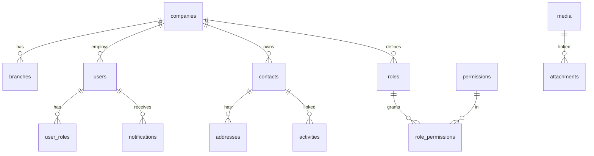
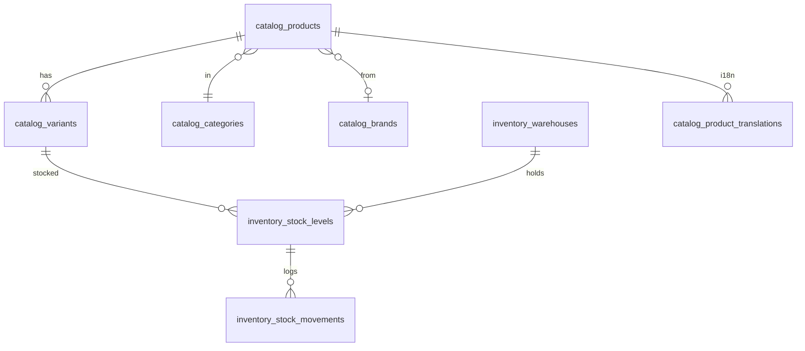
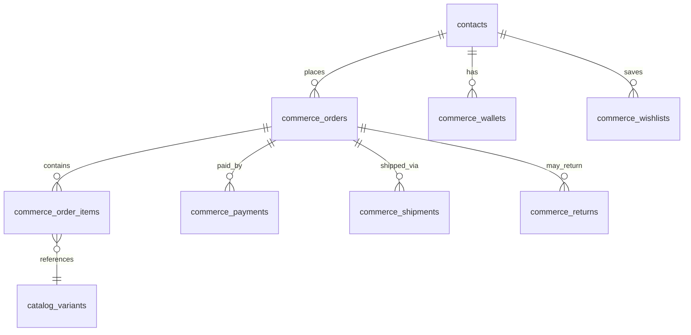
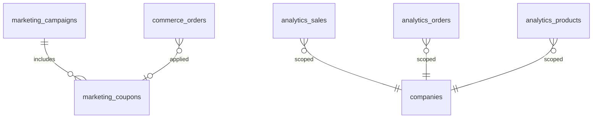
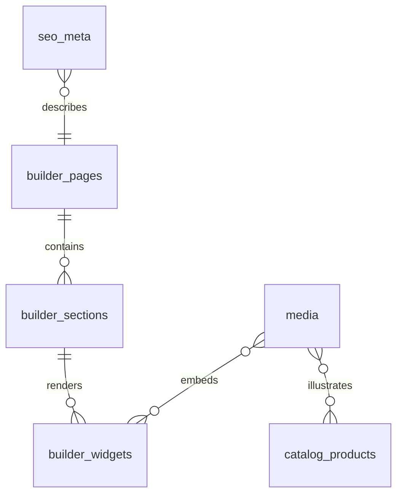

# AgainERP — Platform ER Diagram

## Purpose
Documentation: ER DIAGRAM.

## When To Read
Read only if your task involves er diagram.

## Related Files
- [Cursor entry](../../BRAIN.md)

## Read Next
- [Doc map](../../PROJECT_MAP.md)

---

> **Status:** Draft  
> **Parent:** [MASTER_DATABASE_ARCHITECTURE.md](./MASTER_DATABASE_ARCHITECTURE.md) §26  
> **DBMS:** PostgreSQL

## When To Read
Read only if your task involves er diagram.

## Related Files
- [Cursor entry](../../BRAIN.md)

## Read Next
- [Doc map](../../PROJECT_MAP.md)

---

Consolidated entity-relationship view across all domains. Implementation detail per module in submodule architecture docs.

---

## Core Layer

---

## Catalog + Inventory

---

## Orders + Customers

---

## Marketing + Analytics

---

## Builder + SEO + Media

---

## Cross-Module Ownership

| Entity | Owner Module | Table Prefix |
|--------|--------------|--------------|
| Users, Contacts | Core | (unprefixed) |
| Products | Catalog | `catalog_*` |
| Orders | Orders | `commerce_*` |
| Stock | Inventory | `inventory_*` |
| Campaigns | Marketing | `marketing_*` |
| Pages | Builder | `builder_*` |
| Aggregates | Analytics | `analytics_*` |
| Embeddings | AI | `ai_*` |

Full schema: [MASTER_DATABASE_ARCHITECTURE.md](./MASTER_DATABASE_ARCHITECTURE.md)
