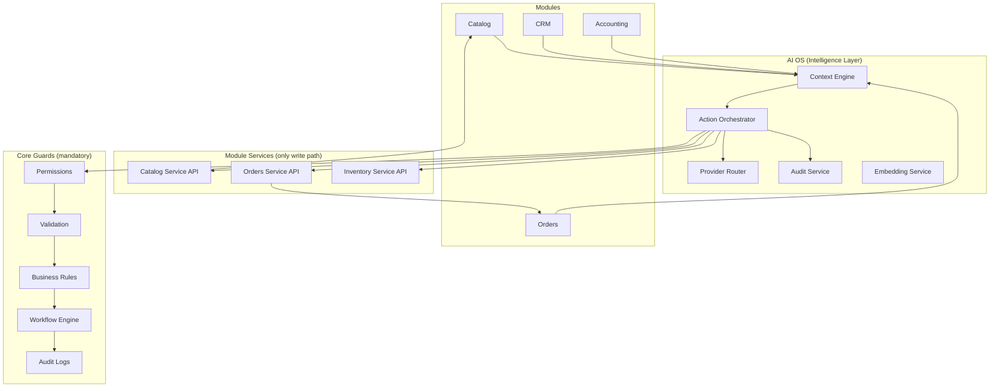

# AgainERP — AI-First Architecture

> **Status:** Draft  
> **Version:** 1.0  
> **Governance:** [GOVERNANCE.md](../../../00-foundation/GOVERNANCE.md) · [DEVELOPMENT_STANDARDS.md](../../../00-foundation/standards/DEVELOPMENT_STANDARDS.md)  
> **UI:** [ai-assistant-ui.md](../../../04-uiux/standards/ai-assistant-ui.md) · [UX_SMART_INTERACTION_STANDARDS.md](../../../04-uiux/standards/UX_SMART_INTERACTION_STANDARDS.md)  
> **Implementation:** [ARCHITECTURE.md](./ARCHITECTURE.md)

**No code.** Canonical AI-first platform architecture. AI is not a feature — it is a **platform-wide capability**.

---

## Purpose
AI OS platform architecture and engines.

## When To Read
Read only when working on AI OS platform, agents, tools, or audit.

## Related Files
- [AI OS architecture](AI_OS_ARCHITECTURE.md)
- [Cursor entry](../../../BRAIN.md)

## Read Next
- [AI experience specs](../../experience/README.md)

---

## Core Principle

| Rule | Description |
|------|-------------|
| **Every module is AI-enabled** | Catalog, Orders, CRM, Accounting — all expose AI hooks |
| **AI is not a separate product** | No isolated "AI app" — AI is embedded in every screen |
| **Platform capability** | One AI OS serves all modules via services |
| **Human in the loop** | High-risk actions require approval |
| **Audit everything** | Every AI action is logged |
| **No direct DB access** | AI OS never writes to module tables directly |

```
Every screen · Every record · Every report · Every workflow → AI-capable
```

---

## Central AI Operating System (AI OS)

The **AI OS** is the intelligence layer of AgainERP — analogous to an operating system kernel for AI workloads.

### Responsibilities

| Layer | Function |
|-------|----------|
| **Provider Router** | OpenAI, Anthropic, local models — swappable |
| **Prompt Registry** | Versioned templates per action type |
| **Context Engine** | Assembles company, user, record context automatically |
| **Action Orchestrator** | Proposes actions → validation → approval → execution |
| **Embedding Service** | Vector index for semantic search and RAG |
| **Token Budget** | Per-company usage limits and cost tracking |
| **Audit Service** | Immutable log of all AI operations |
| **Job Queue** | Async generation, forecasting, re-embedding |

### Architecture



### AI OS Rules

| Rule | Detail |
|------|--------|
| **No direct DB writes** | AI OS calls module Service APIs only |
| **Read via services** | Data retrieval through permission-scoped service methods |
| **Events for async** | `ai.action.proposed` → module validates → `ai.action.executed` |
| **Idempotent actions** | Retry-safe with `ai_action_id` deduplication |
| **Company isolation** | Every request scoped to `company_id` |

**Full specification:** [AI_OS_ARCHITECTURE.md](./AI_OS_ARCHITECTURE.md) · [AI_OS.md](./AI_OS.md) (index)

---

## AI Access Layer

AI accesses module data **only through controlled services** — never raw SQL or cross-module table reads.

### Service Registry

| Domain | Service | Read | Write (proposed) |
|--------|---------|------|------------------|
| **Products** | `CatalogService` | Products, variants, attributes, categories | Draft content, tags |
| **Customers** | `ContactService` | Contacts, addresses, groups | Notes, tags |
| **Orders** | `CommerceService` | Orders, items, payments | Summaries only |
| **Inventory** | `InventoryService` | Stock, warehouses, movements | Reorder suggestions |
| **Reports** | `AnalyticsService` | Pre-aggregated metrics | None (read-only) |
| **Activities** | `ActivityService` | Tasks, timeline | Schedule activity |
| **Media** | `MediaService` | Files, metadata | Alt text, tags |
| **SEO** | `SeoService` | Meta, schema, audits | Meta drafts |
| **Marketing** | `MarketingService` | Campaigns, coupons | Copy drafts |
| **CRM** | `CrmService` | Leads, opportunities | Email drafts |
| **Accounting** | `AccountingService` | Journals, balances | **Approval required** |

### Access Pattern

```
AI OS requests data
  → Service checks user permissions + company scope
  → Returns sanitized DTO (no raw credentials, masked PII where needed)
  → AI processes
  → Proposed action returned as structured payload
  → Module Service executes after approval
```

### Permission Namespace

`ai.read.{domain}` · `ai.write.{domain}` · `ai.approve.{domain}`

Module permissions still apply — AI inherits the **acting user's** permissions, never elevated.

---

## AI Universal Actions

Available on **every record** via assistant, field toolbar, chatter, or command palette.

| Action | Description | Default Risk |
|--------|-------------|--------------|
| **Generate** | Create content from context | Low |
| **Rewrite** | Improve existing text | Low |
| **Translate** | Localize to target language | Low |
| **Summarize** | Condense record or thread | Low |
| **Analyze** | Insights, trends, anomalies | Low |
| **Recommend** | Next best action, cross-sell | Low |
| **Forecast** | Demand, revenue, stock projection | Medium |
| **Automate** | Trigger workflow or rule | High |

### UI Exposure

| Surface | Actions |
|---------|---------|
| Record header | ✨ AI menu |
| Field toolbar | Generate / Rewrite / Translate |
| Chatter | Summarize thread |
| List view | Bulk summarize (read-only) |
| Dashboard | Forecast widgets |
| Command palette | `Ctrl+K` → AI actions |

### Action Payload Schema

```json
{
  "action": "generate",
  "target": { "type": "catalog.product", "id": "uuid" },
  "field": "description",
  "prompt": "user override or null",
  "context_auto": true
}
```

---

## AI Audit Rule

**Every AI action must be logged.** No exceptions.

### Required Log Fields

| Field | Description |
|-------|-------------|
| `user_id` | Acting user |
| `company_id` | Tenant scope |
| `prompt` | Full prompt (redacted PII in storage) |
| `response` | Model output |
| `changes` | Structured diff if write proposed/applied |
| `approval_status` | `none` · `pending` · `approved` · `rejected` |
| `approved_by` | User who approved (if applicable) |
| `timestamp` | ISO-8601 |
| `model` | Provider + model version |
| `token_count` | Input + output tokens |
| `action_type` | generate, rewrite, forecast, … |
| `target_entity` | Polymorphic record reference |
| `ai_action_id` | Unique idempotency key |

### Table

`ai_audit_logs` — append-only, immutable. Core Audit Service mirrors high-risk entries to `activity_logs`.

### Retention

| Tier | Retention |
|------|-----------|
| Standard | 2 years |
| Enterprise | 7 years (configurable) |
| PII fields | Encrypted at rest |

**Detail:** [AI_AUDIT_AND_APPROVAL.md](./AI_AUDIT_AND_APPROVAL.md)

---

## Human Approval Rule

**High-risk actions require human approval.** AI proposes — humans approve.

### High-Risk Actions (Always Require Approval)

| Action | Module |
|--------|--------|
| **Delete records** | Any |
| **Price changes** | Catalog |
| **Inventory adjustments** | Inventory |
| **Accounting entries** | Accounting |
| **Permission changes** | Core |
| **Bulk updates** | Any list > 10 records |
| **Publish content** | Catalog, Builder, SEO |
| **Send campaigns** | Marketing |
| **Workflow transitions** | Any (if AI-initiated) |

### Approval Flow

```
1. User requests AI action (or automation triggers)
2. AI OS generates proposal → ai_audit_logs (status: pending)
3. Core Approval Engine creates approval request
4. Approver notified (in-app + optional email)
5. Approver reviews diff preview
6. Approve → Module Service executes → audit updated
7. Reject → audit updated, user notified with reason
```

### Low-Risk Auto-Apply

Generate description **draft**, translate to draft, summarize (read-only) — apply immediately to draft fields without approval.

Published/live fields always require explicit user "Apply" click minimum.

### Integration

Uses Core [Approval Engine](../../../02-core-platform/engines/APPROVAL_ENGINE_ARCHITECTURE.md) — AI does not implement custom approval logic.

---

## AI Context Engine

AI understands context **automatically** — users do not manually paste background.

### Context Dimensions

| Dimension | Source |
|-----------|--------|
| **Company** | Active `company_id`, settings, branding |
| **Branch** | Active branch, warehouse defaults |
| **Role** | User roles, permissions (capability bounds) |
| **User** | Locale, timezone, preferences |
| **Current session** | Active page, module, route |
| **Current record** | Entity type, ID, key fields |
| **Customer** | If on customer/order context |
| **Products** | If on catalog context |
| **Orders** | Recent order history when relevant |
| **Inventory** | Stock levels when on product/inventory |
| **Historical data** | RAG from embeddings + analytics aggregates |

### Context Assembly Pipeline

```
1. Session context (page, record, module)
2. Permission filter — only include data user can read
3. Record snapshot — key fields from owning module service
4. Related entities — smart buttons data (counts, summaries)
5. RAG retrieval — top-k embedding chunks from ai_embeddings
6. Analytics slice — relevant KPIs for timeframe
7. Prompt template — merge into versioned ai_prompts template
8. Token budget trim — prioritize recent + relevant
```

### Context API (Internal)

`AIContextEngine.assemble(user, session) → ContextBundle`

Never sent to client in full — only used server-side for LLM calls.

### Privacy

- PII masked in prompts where not essential
- Cross-customer data never in same context
- `company_id` boundary enforced at assembly time

**Detail:** [AI_CONTEXT_ENGINE.md](./AI_CONTEXT_ENGINE.md)

---

## Module AI Registration

Every module registers AI capabilities in `ModuleManifest.md`:

```yaml
ai:
  enabled: true
  entities:
    - type: catalog.product
      actions: [generate, rewrite, translate, summarize, analyze, recommend, forecast]
      fields:
        - name: description
          actions: [generate, rewrite, translate]
        - name: meta_title
          actions: [generate]
  services:
    read: CatalogService
    write: CatalogService
  approval_required:
    - price_change
    - publish
```

---

## Database Tables (AI OS)

| Table | Purpose |
|-------|---------|
| `ai_providers` | LLM provider config |
| `ai_models` | Model registry |
| `ai_prompts` | Versioned templates |
| `ai_conversations` | Assistant sessions |
| `ai_messages` | Turn-by-turn messages |
| `ai_generations` | Generated content artifacts |
| `ai_actions` | Proposed actions awaiting approval |
| `ai_audit_logs` | **Mandatory** audit trail |
| `ai_embeddings` | pgvector storage |
| `ai_forecasts` | Forecast results |
| `ai_automation_rules` | Event-driven AI rules |
| `ai_usage_logs` | Token/cost tracking |
| `ai_context_snapshots` | Debug/replay context bundles (optional) |

Prefix: `ai_*` — see [MASTER_DATABASE_ARCHITECTURE.md](../../../05-development/database/MASTER_DATABASE_ARCHITECTURE.md) §25.

---

## API Surface

Base: `/api/v1/ai/`

| Endpoint | Purpose |
|----------|---------|
| `POST /assistant/chat` | Conversational assistant |
| `POST /actions/propose` | Propose any universal action |
| `POST /actions/{id}/approve` | Human approval |
| `POST /actions/{id}/reject` | Reject proposal |
| `POST /generate/{type}` | Domain generators |
| `POST /analyze` | Record analysis |
| `POST /forecast` | Run forecast |
| `GET /audit` | Audit log (admin) |

All endpoints require authentication + company scope.

---

## Events

| Event | When |
|-------|------|
| `ai.action.proposed` | Action awaiting approval |
| `ai.action.approved` | Human approved |
| `ai.action.executed` | Module service completed write |
| `ai.action.rejected` | Human rejected |
| `ai.generation.completed` | Content generated |
| `ai.audit.logged` | Every AI operation |

---

## Module Compliance Checklist

- [ ] Register AI entities in `ModuleManifest.md`
- [ ] Expose Service API for AI read/write (no direct DB from AI OS)
- [ ] Define approval-required actions
- [ ] Map universal actions to field toolbar
- [ ] Subscribe to `ai.action.executed` for side effects
- [ ] Document AI screens in `Menus/AI/` (Ecommerce) or module UI.md

---

## Related Documents

| Document | Topic |
|----------|-------|
| [AI_OS_ARCHITECTURE.md](./AI_OS_ARCHITECTURE.md) | **Full AI OS** — 14 engines, agents, tools, twin |
| [AI_OS.md](./AI_OS.md) | AI OS index |
| [AI_DIGITAL_TWIN.md](./AI_DIGITAL_TWIN.md) | ERP digital twin |
| [AI_SCALING_ROADMAP.md](./AI_SCALING_ROADMAP.md) | Phases 1–7 |
| [AI_CONTEXT_ENGINE.md](./AI_CONTEXT_ENGINE.md) | Context assembly |
| [AI_AUDIT_AND_APPROVAL.md](./AI_AUDIT_AND_APPROVAL.md) | Audit + approval rules |
| [ARCHITECTURE.md](./ARCHITECTURE.md) | Services, forecasting, search |
| [ai-assistant-ui.md](../../../04-uiux/standards/ai-assistant-ui.md) | UI surfaces |
| [future-interactions.md](../../../04-uiux/standards/future-interactions.md) | Copilot, voice hooks |

---

**Platform:** AgainERP  
**Last Updated:** 2026-06-12  
**Maintainer:** AI Platform Team
