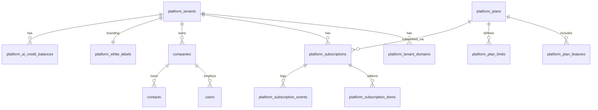
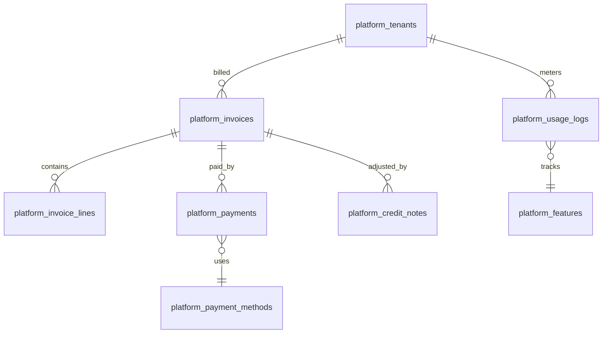
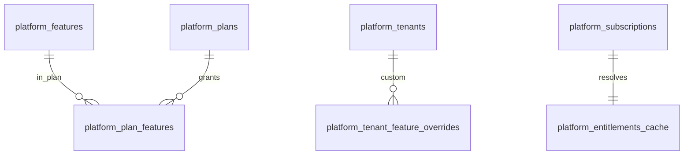
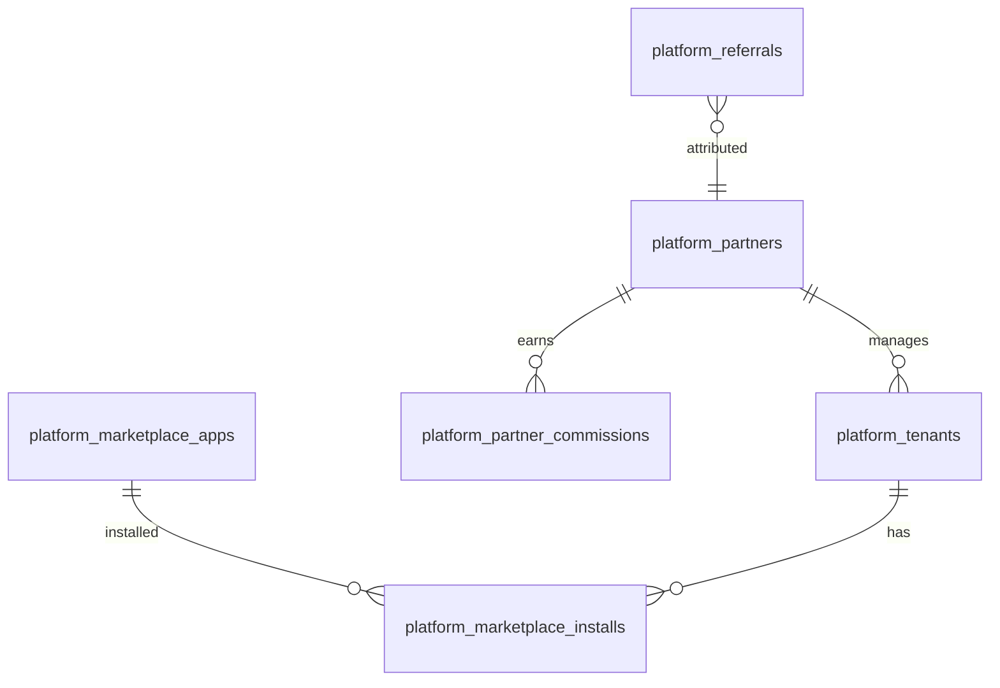
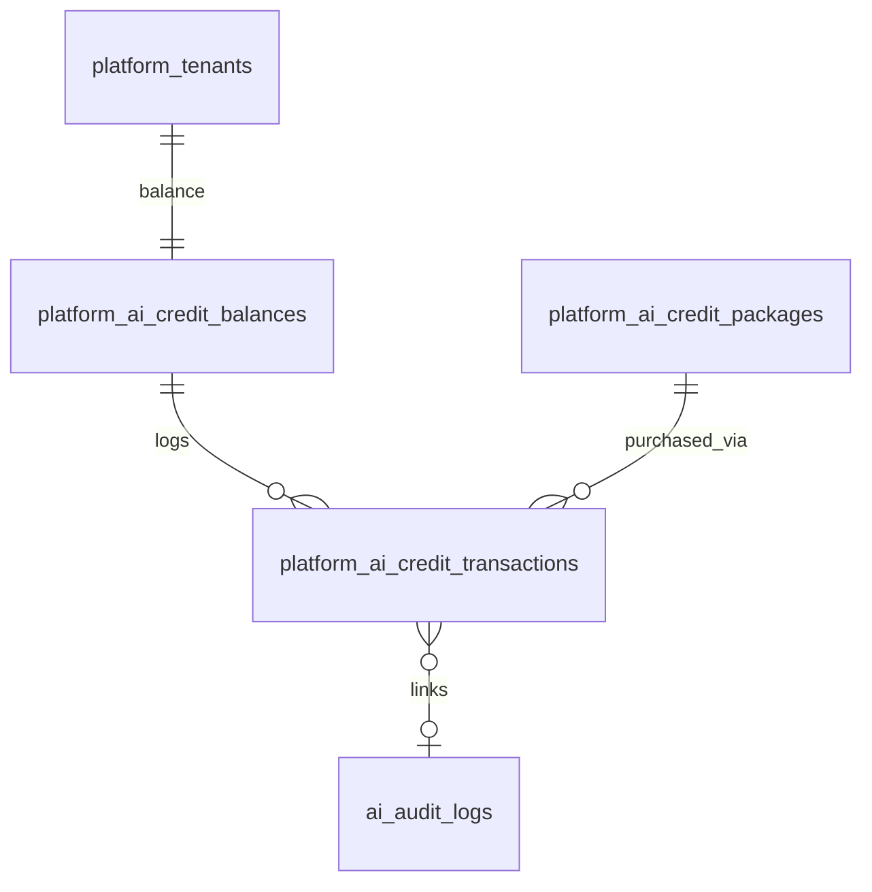
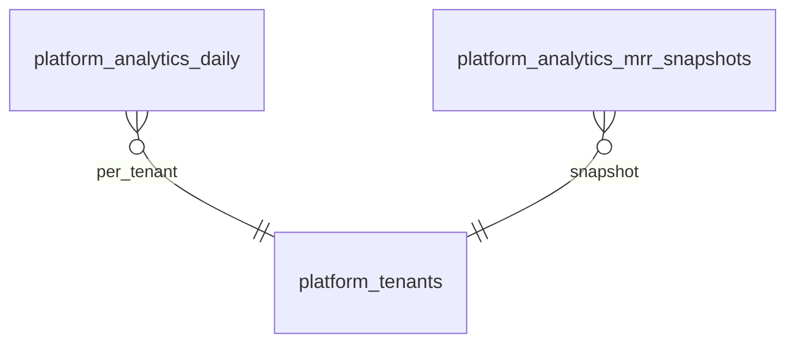

# SaaS Platform — ER Diagrams

## Purpose
SaaS platform documentation: SAAS_ER_DIAGRAM.

## When To Read
Read only when working on multi-tenant SaaS, billing, or hybrid deployment.

## Related Files
- [Tenant architecture](TENANT_ARCHITECTURE.md)
- [SaaS platform arch](../01-architecture/SAAS_PLATFORM_ARCHITECTURE.md)

## Read Next
- [Platform architecture](../01-architecture/SAAS_PLATFORM_ARCHITECTURE.md)

---

> **Status:** Draft  
> **Parent:** [SAAS_PLATFORM_ARCHITECTURE.md](../01-architecture/SAAS_PLATFORM_ARCHITECTURE.md)  
> **DBMS:** PostgreSQL

---


## When To Read
Read only when working on multi-tenant SaaS, billing, or hybrid deployment.

## Related Files
- [Tenant architecture](TENANT_ARCHITECTURE.md)
- [SaaS platform arch](../01-architecture/SAAS_PLATFORM_ARCHITECTURE.md)

## Read Next
- [Platform architecture](../01-architecture/SAAS_PLATFORM_ARCHITECTURE.md)

---

## Platform Core



---

## Billing & Payments



---

## Features & Entitlements



---

## Partners & Marketplace



---

## AI Credits



---

## Analytics



---

## Link to Business Layer

```
platform_tenants
  └── companies (tenant_id)
        └── catalog_products (company_id)
        └── commerce_orders (company_id)
        └── inventory_* (company_id)
```

Business tables **never** store `tenant_id` directly — resolve via `company.tenant_id` or session context.

---

Full platform schema: [SAAS_PLATFORM_ARCHITECTURE.md](../01-architecture/SAAS_PLATFORM_ARCHITECTURE.md) § Database Architecture
