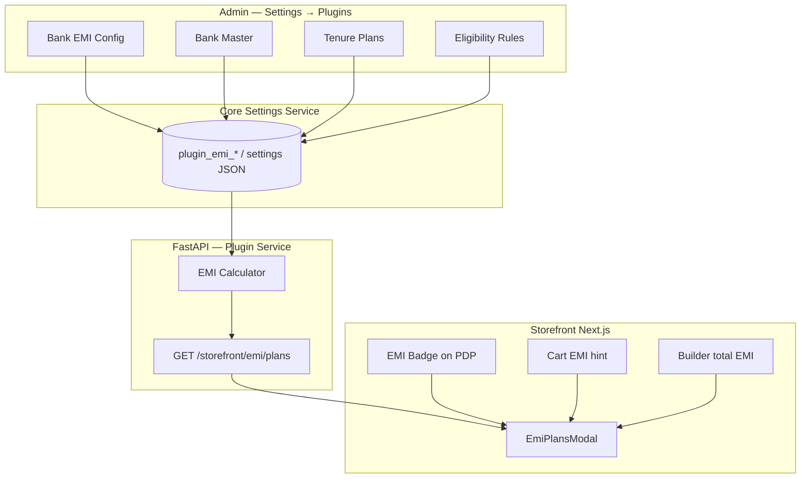

# Bank EMI Calculator — Architecture

## Purpose
Documentation: Architecture.

## When To Read
Read only if your task involves architecture.

## Related Files
- [Cursor entry](../../../BRAIN.md)

## Read Next
- [Doc map](../../../PROJECT_MAP.md)

---

> **Status:** Draft  
> **Version:** 0.1.0  
> **Plugin ID:** `bank-emi`  
> **Manifest:** [PLUGIN_MANIFEST.md](./PLUGIN_MANIFEST.md)  
> **Reference study:** [Apple Gadgets BD — Apple Pencil Pro](https://www.applegadgetsbd.com/product/apple-pencil-pro) — “EMI Available” + “View Plans” modal

**Documentation-first. No production backend until Status: Ready.**

---


## When To Read
Read only if your task involves architecture.

## Related Files
- [Cursor entry](../../../BRAIN.md)

## Read Next
- [Doc map](../../../PROJECT_MAP.md)

---

## 1. Executive Summary

Bangladesh ecommerce sites (e.g. Apple Gadgets BD) show **EMI installment options** before checkout so customers can compare monthly cost across banks. AgainERP implements this as an **installable plugin** — not hard-coded in PDP.

| Principle | Rule |
|-----------|------|
| **Plugin, not core** | Install/uninstall from Settings → Plugins |
| **Informational first** | Phase 1 = calculator + display only |
| **Admin-owned rates** | Merchant configures banks, tenures, charge % |
| **Storefront hooks** | PDP, cart, builder summary, checkout banner |
| **API-first** | Storefront never reads plugin tables directly |

---

## 2. Competitive Study — Apple Gadgets BD

### 2.1 PDP behaviour

On [Apple Pencil Pro](https://www.applegadgetsbd.com/product/apple-pencil-pro):

- Shows **“EMI Available for orders above ৳ 5000”**
- Link: **“View Plans”** → opens modal **“EMI Options”**
- Cash price shown separately (**“Cash Price”**)

### 2.2 Modal layout (observed)

```text
┌──────────────────────────────────────────────────────────────────┐
│ EMI Options                                                  [X] │
├─────────────────┬────────────────────────────────────────────────┤
│ Bank list       │ Enter Amount                                   │
│ (scroll)        │ [ 14000 ]                                      │
│                 │                                                │
│ ● AB Bank       │ ┌────────┬──────────┬────────┬──────────────┐ │
│   AB Bank Online│ │ Plan   │ EMI      │ Charge │ Effective    │ │
│   Al-Arafah     │ │ (Mo)   │          │        │ Cost         │ │
│   Bank Asia     │ ├────────┼──────────┼────────┼──────────────┤ │
│   Brac Bank     │ │ 3      │ ৳4,860.80│ 4.16%  │ ৳14,582.40   │ │
│   …             │ │ 6      │ …        │ …      │ …            │ │
│                 │ │ 9      │ …        │ …      │ …            │ │
│                 │ │ 12     │ …        │ …      │ …            │ │
│                 │ └────────┴──────────┴────────┴──────────────┘ │
└─────────────────┴────────────────────────────────────────────────┘
```

### 2.3 What we adopt vs improve

| Apple Gadgets pattern | AgainERP plugin |
|----------------------|-----------------|
| Min order threshold (৳5000) | Configurable `min_order_amount` per store |
| Bank sidebar | Same + bank logo + active state |
| Manual amount entry | Default = product price / cart total; editable |
| Charge % + effective cost | Same columns; optional “processing fee” flat |
| Cash vs EMI | PDP shows cash price; EMI is additive info |
| — | **Admin** manages all banks without deploy |
| — | **PC Builder** total also eligible |
| — | **Category rules** (e.g. EMI only on Electronics) |
| — | **Bangla labels** optional (`কিস্তি`, `মাসিক`) |

---

## 3. System Architecture



---

## 4. EMI Calculation Model

### 4.1 Default formula (matches Apple Gadgets sample)

For principal `P`, charge rate `r%`, tenure `n` months:

```text
effective_cost = P × (1 + r / 100)
monthly_emi    = effective_cost / n
```

**Verification (screenshot):** P = ৳14,000, r = 4.16%, n = 3  
→ effective = 14,000 × 1.0416 = **৳14,582.40**  
→ monthly = 14,582.40 / 3 = **৳4,860.80** ✓

### 4.2 Extended options (admin configurable)

| Model | Formula | Use case |
|-------|---------|----------|
| `simple_percent` | `P × (1 + r/100) / n` | Default — Apple Gadgets style |
| `flat_fee` | `(P + F) / n` | Fixed processing fee F |
| `reducing_balance` | Standard amortization | Future — bank API sync |

Phase 1 implements **`simple_percent` only**.

### 4.3 Rounding

- Currency: BDT, 2 decimal places
- Round **monthly EMI** half-up; recompute effective if needed for display consistency
- Display via shared `formatCurrency()` (storefront)

---

## 5. Data Model

### 5.1 Bank (`plugin_emi_banks`)

| Column | Type | Description |
|--------|------|-------------|
| `id` | UUID | Primary key |
| `tenant_id` | UUID | Multi-tenant |
| `code` | string | `ab_bank`, `brac_bank` |
| `name` | string | “AB Bank” |
| `name_bn` | string? | “এবি ব্যাংক” |
| `variant` | enum | `card` \| `online` \| `both` |
| `logo_url` | string? | Media library ref |
| `sort_order` | int | Sidebar order |
| `is_active` | bool | Show on storefront |

### 5.2 Plan (`plugin_emi_plans`)

| Column | Type | Description |
|--------|------|-------------|
| `id` | UUID | PK |
| `bank_id` | FK | → banks |
| `months` | int | 3, 6, 9, 12 |
| `charge_percent` | decimal | e.g. 4.16 |
| `is_active` | bool | |

### 5.3 Rules (`plugin_emi_rules`)

| Column | Type | Description |
|--------|------|-------------|
| `min_order_amount` | decimal | e.g. 5000 |
| `max_order_amount` | decimal? | Optional cap |
| `category_ids` | jsonb? | Allowlist; null = all |
| `product_ids` | jsonb? | Exceptions |
| `show_on_pdp` | bool | default true |
| `show_on_cart` | bool | default true |
| `show_on_builder` | bool | default true |
| `label_en` | string | “EMI Available for orders above ৳ {min}” |
| `label_bn` | string? | Bangla CTA |

---

## 6. Admin Plugin Configuration

**Route:** `/settings/plugins/bank-emi`

### 6.1 Sections (maps to `PLUGIN_REGISTRY.sections`)

| Section | Fields |
|---------|--------|
| **General** | Plugin enabled, min order amount, default label EN/BN |
| **Display** | Show on PDP / Cart / Checkout / PC Builder |
| **Banks** | CRUD table — name, variant, logo, sort, active |
| **Plans** | Per-bank grid: months × charge % |
| **Advanced** | Calculation model, rounding mode |

### 6.2 Actions

| Action | Result |
|--------|--------|
| Install | Enable plugin; seed demo banks (AB, Brac, Bank Asia) |
| Add bank | New sidebar entry on storefront |
| Duplicate plans | Copy tenures from another bank |
| Preview | Open modal with test amount |
| Save | Persist + emit `plugin.bank-emi.config_updated` |

---

## 7. Storefront Integration

### 7.1 Mount points

| Location | Component | Trigger |
|----------|-----------|---------|
| PDP purchase panel | `EmiBadge` | Price ≥ min; plugin enabled |
| Sticky mobile bar | `EmiBadge` (compact) | Same |
| Cart summary | `EmiInlineLink` | Subtotal ≥ min |
| PC Builder summary | `EmiInlineLink` | Total ≥ min |
| Checkout payment step | Info callout | Non-blocking |

### 7.2 User flow

```text
1. Customer sees “EMI Available for orders above ৳5,000” + [View Plans]
2. Click → EmiPlansModal opens
3. Amount pre-filled (product price / cart / build total)
4. Select bank (left) → table updates (right)
5. Optional: copy/share plan row
6. Close → continue Shop Now / Add to Cart (no checkout change in Phase 1)
```

### 7.3 Eligibility check (client + API)

```typescript
function isEmiEligible(amount: number, rules: EmiRules): boolean {
  if (!rules.enabled) return false;
  if (amount < rules.minOrderAmount) return false;
  if (rules.maxOrderAmount && amount > rules.maxOrderAmount) return false;
  // category / product allowlist when provided
  return true;
}
```

---

## 8. API Contract (Production)

### `GET /api/v1/storefront/emi/plans`

**Query:** `amount=14000` · `bank_id=optional` · `product_id=optional`

**Response:**

```json
{
  "eligible": true,
  "min_order_amount": 5000,
  "amount": 14000,
  "banks": [
    {
      "id": "ab_bank",
      "name": "AB Bank",
      "plans": [
        {
          "months": 3,
          "charge_percent": 4.16,
          "monthly_emi": 4860.8,
          "effective_cost": 14582.4
        }
      ]
    }
  ]
}
```

**Cache:** CDN 60s; invalidate on config update event.

---

## 9. Phase Roadmap

| Phase | Scope | Status |
|-------|-------|--------|
| **A — Docs + prototype** | MD files, mock data, modal UI | **This sprint** |
| **B — Admin CRUD** | Full bank/plan editor in plugin config | Next |
| **C — Checkout** | “Pay with EMI” via SSLCommerz EMI channel | Future |
| **D — Bank API** | Live rates from gateway webhooks | Future |

---

## 10. Security & Compliance

- EMI display is **estimate only** — footer disclaimer required
- No card data in plugin; Phase C delegates to PCI-compliant gateway
- Rate changes audited in plugin change history
- Tenant isolation on all `plugin_emi_*` tables

---

## 11. Dependencies

- [SETTINGS_ARCHITECTURE.md](../../../02-core-platform/subsystems/SETTINGS_ARCHITECTURE.md)
- [ECOMMERCE_STOREFRONT_ARCHITECTURE.md](../../../03-business-modules/ecommerce/ECOMMERCE_STOREFRONT_ARCHITECTURE.md)
- [ui-prototype/plugins/BankEmi.md](../../../04-uiux/prototype/plugins/BankEmi.md)
- [Plugins.md](../../../04-uiux/prototype/settings/Plugins.md)

---

**Last Updated:** 2026-06-15
