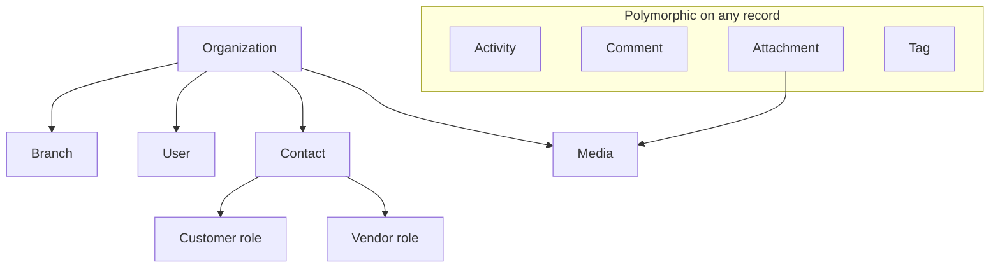
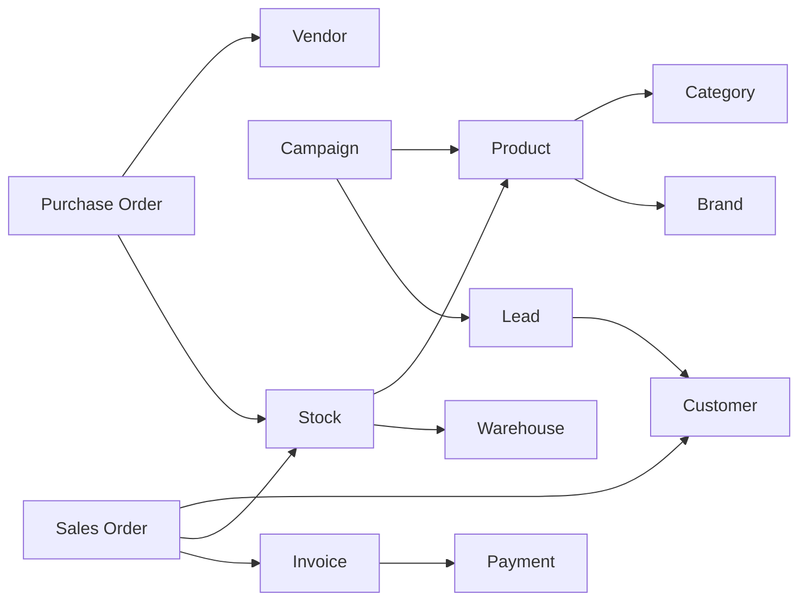

# AgainERP — Entity Relationship Registry

> **Status:** Approved  
> **Version:** 1.0  
> **Project:** AgainERP  
> **Document Type:** Enterprise Business Entity Registry  
> **Phase:** Documentation First  
> **Governance:** [GOVERNANCE.md](./GOVERNANCE.md) · **Standards:** [DEVELOPMENT_STANDARDS.md](./DEVELOPMENT_STANDARDS.md)

**No SQL schemas. No migrations. No DDL. Not a database ERD.**  
This document is the **master business entity relationship registry** — canonical definitions of what each entity means, who owns it, how it relates to others, and which platform capabilities apply.

### Step 20 Requirements (Satisfied)

| Requirement | Section |
|-------------|---------|
| Master business entity registry (not ERD) | §1 |
| Entity philosophy | §2 |
| Shared core entities | §3 |
| Business + platform entities | §4 |
| 8 attributes per entity | §3 · §4 |
| Dependency map, rules, expansion | §5–§7 |

**Related:** [DATABASE_REGISTRY.md](./DATABASE_REGISTRY.md) (data ownership blueprint) · [ENTITY_CATALOG.md](./modules/ecommerce/catalog/ENTITY_CATALOG.md) (catalog domain detail) · [ENTITY_INVENTORY.md](./modules/inventory/ENTITY_INVENTORY.md) (inventory domain detail) · [ENTITY_PURCHASE.md](./modules/purchase/ENTITY_PURCHASE.md) (purchase domain detail) · [ENTITY_SALES.md](./modules/sales/ENTITY_SALES.md) (sales domain detail) · [database/ER_DIAGRAM.md](./database/ER_DIAGRAM.md) (physical ER) · [MODULE_DEPENDENCY_MAP.md](./MODULE_DEPENDENCY_MAP.md) · [core/shared-entities.md](./core/shared-entities.md)

---

## Executive Summary

| Principle | Rule |
|-----------|------|
| **Business language** | Entity names match how users and modules speak — not table names |
| **Single owner** | One domain writes; others reference by ID or Core bridge |
| **Relationship by reference** | FK to Core or owner aggregate — never duplicate sibling business data |
| **Lifecycle explicit** | States documented; workflow ID when state machine applies |
| **Platform capabilities** | Activity, AI, Approval declared per entity — not assumed |
| **Registry before code** | New entity registered here before module implementation |

**Distinction:** [DATABASE_REGISTRY.md](./DATABASE_REGISTRY.md) §5 lists **all** domain entities in compact tables. **This document** provides **detailed business profiles** for the canonical entity set and relationship rules.

---

## 1. Purpose

### Why a Business Entity Registry Exists

AgainERP spans 18+ domains and hundreds of eventual entities. Teams need a **shared vocabulary** — what "Customer" means vs "Contact", what "Invoice" owns vs what Finance posts.

| Problem | Impact |
|---------|--------|
| Duplicate concepts | `customer`, `contact`, `party` used interchangeably |
| Unclear ownership | Sales and CRM both "own" the customer |
| Hidden relationships | PO linked to SO without documented handoff |
| Missing platform hooks | Product ships without activity timeline or approval gate |
| ERD confusion | Physical tables mistaken for business boundaries |

This registry answers:

- **What is this entity in business terms?**
- **Which domain owns it?**
- **What may it relate to?**
- **What lifecycle, permissions, AI, and approval apply?**

### What This Document Is

| Is | Is Not |
|----|--------|
| Business entity dictionary | SQL `CREATE TABLE` |
| Relationship semantics | Column-level schema |
| Lifecycle & capability matrix | Mermaid ER diagram (see [ER_DIAGRAM.md](./database/ER_DIAGRAM.md)) |
| Canonical names for AI & APIs | ORM model code |

### Audience

| Role | Use |
|------|-----|
| Product / BA | Ubiquitous language across modules |
| Architects | Validate new entities before DATABASE_REGISTRY entry |
| Developers | Know owner API before referencing entity |
| AI agents | Tool scope and read boundaries |

### Registry Entry Schema

Every entity profile includes:

| Attribute | Description |
|-----------|-------------|
| **Purpose** | Business reason the entity exists |
| **Owner Domain** | Single write owner |
| **Relationships** | Logical links to other entities |
| **Lifecycle** | States or continuous / config |
| **Activities** | Timeline, chatter, followers support |
| **Permissions** | Primary permission keys |
| **AI Support** | Tools / read scope |
| **Approval Support** | Gates blocking transitions |

---

## 2. Entity Philosophy

### Domain-Driven Ownership

```text
Every business fact belongs to exactly one bounded context.
Other contexts reference it — they do not re-implement it.
```

| Pattern | Example |
|---------|---------|
| **Core spine** | User, Organization, Contact — shared by all modules |
| **Business aggregate** | Product, Sales Order — owned by one domain |
| **Extension** | Customer Profile — Sales fields on Core Contact |
| **Engine instance** | Workflow Instance — Core engine bound to owner record |
| **Derived** | Search Document — not a business entity; rebuildable |

### Relationship Types

| Type | Meaning | Example |
|------|---------|---------|
| **Composition** | Child cannot exist without parent | Order Line → Sales Order |
| **Association** | Optional link by ID | Sales Order → CRM Opportunity |
| **Polymorphic** | Activity on any record | Activity → `{entity_type, entity_id}` |
| **Reference (Core)** | FK to shared entity | Sales Order → Contact (customer) |
| **Reference (Business)** | FK within owner or via service | PO Line → Product Variant (Catalog) |
| **Event handoff** | No FK; async link | Finance AR Invoice ← Sales Invoice (event) |

### Entity vs Table

| Business Entity | May Map To |
|-----------------|------------|
| Customer | Core `Contact` + Sales extension — not a separate `customers` table |
| Vendor | Core `Contact` with `contact_type=vendor` |
| Stock | `Stock Item` + `Stock Level` aggregates in Inventory |
| Organization | Core `Company` — tenant root |

### Multi-Tenancy

All business entities are scoped to **Organization (Company)**. Branch and warehouse provide sub-scope where applicable.

---

## 3. Shared Core Entities

Core entities are **platform-wide** — owned by Core domain, consumed by all modules via services. Modules store foreign keys; they never duplicate core fields.

---

### User

| Attribute | Value |
|-----------|-------|
| **Purpose** | Authenticated staff identity — actor for audit, assignments, approvals |
| **Owner Domain** | Core · Users |
| **Relationships** | → Organization (member); → Branch (optional default); → Role(s); ← Activity (assignee); ← Approval (approver); ← Comment (author) |
| **Lifecycle** | invited → active → suspended → deactivated |
| **Activities** | Login events on timeline; assignment targets; @mention in comments |
| **Permissions** | `core.user.view`, `core.user.create`, `core.user.edit`, `core.user.deactivate` |
| **AI Support** | Read name/email for context; no PII export tools without `core.user.view` |
| **Approval Support** | — (User is approver, not subject of product approval) |

---

### Organization

| Attribute | Value |
|-----------|-------|
| **Purpose** | Tenant company — root of multi-company isolation, settings, and billing |
| **Owner Domain** | Core · Companies |
| **Relationships** | → Branches; → Users; → Settings; → All business aggregates (`company_id`) |
| **Lifecycle** | provisioning → active → suspended → archived |
| **Activities** | Platform admin timeline; plan change notes |
| **Permissions** | `core.company.view`, `core.company.edit`, `core.company.admin` (platform) |
| **AI Support** | Company context for agents; no cross-company reads |
| **Approval Support** | — |

**Note:** "Organization" = **Company** in implementation docs ([entities/companies.md](./core/entities/companies.md)).

---

### Branch

| Attribute | Value |
|-----------|-------|
| **Purpose** | Physical or logical company location — scopes inventory, sales, and branch-level ACL |
| **Owner Domain** | Core · Branches |
| **Relationships** | → Organization; → Warehouses; → Users (default branch); ← Sales Order (optional) |
| **Lifecycle** | active → inactive |
| **Activities** | ✓ Config change log |
| **Permissions** | `core.branch.view`, `core.branch.create`, `core.branch.edit` |
| **AI Support** | Branch filter in reports |
| **Approval Support** | — |

---

### Activity

| Attribute | Value |
|-----------|-------|
| **Purpose** | Scheduled task, call, meeting, or system event on any record timeline |
| **Owner Domain** | Core · Activities |
| **Relationships** | Polymorphic → any entity (`entity_type`, `entity_id`); → User (assignee, author); → Organization |
| **Lifecycle** | planned → in_progress → done / cancelled |
| **Activities** | Self — appears on parent record timeline |
| **Permissions** | `core.activity.view`, `core.activity.create`, `core.activity.edit`, `core.activity.delete` |
| **AI Support** | Suggest next activity (NBA); summarize timeline |
| **Approval Support** | — |

**Deep dive:** [ACTIVITY_CHATTER_ARCHITECTURE.md](./modules/core/ACTIVITY_CHATTER_ARCHITECTURE.md)

---

### Comment

| Attribute | Value |
|-----------|-------|
| **Purpose** | Threaded discussion, @mentions, internal collaboration on records |
| **Owner Domain** | Core · Comments |
| **Relationships** | Polymorphic → parent entity; → User (author); optional → Comment (parent thread) |
| **Lifecycle** | posted → edited → deleted (soft) |
| **Activities** | Logged as activity on parent |
| **Permissions** | `core.comment.view`, `core.comment.create`, `core.comment.edit`, `core.comment.delete` |
| **AI Support** | Summarize thread; draft reply (low risk) |
| **Approval Support** | — |

---

### Attachment

| Attribute | Value |
|-----------|-------|
| **Purpose** | Link between a business record and a Media file — contracts, scans, proofs |
| **Owner Domain** | Core · Attachments |
| **Relationships** | Polymorphic → parent entity; → Media (file); → User (uploader) |
| **Lifecycle** | attached → removed (soft) |
| **Activities** | "File attached" on parent timeline |
| **Permissions** | `core.attachment.view`, `core.attachment.create`, `core.attachment.delete` |
| **AI Support** | OCR / extract (tool, medium risk) |
| **Approval Support** | — |

---

### Tag

| Attribute | Value |
|-----------|-------|
| **Purpose** | Lightweight polymorphic label for filtering and segmentation |
| **Owner Domain** | Core · Tags |
| **Relationships** | Polymorphic → any entity; → Organization (tag namespace) |
| **Lifecycle** | active → archived |
| **Activities** | Tag add/remove logged optionally |
| **Permissions** | `core.tag.view`, `core.tag.assign`, `core.tag.manage` |
| **AI Support** | Auto-tag suggest (products, leads) |
| **Approval Support** | — |

---

### Media

| Attribute | Value |
|-----------|-------|
| **Purpose** | Stored file asset — image, document, video — in central library |
| **Owner Domain** | Core · Media |
| **Relationships** | → Organization; ← Attachment; ← Product (featured image ref); used by Marketing, Builder |
| **Lifecycle** | uploaded → active → archived → purged |
| **Activities** | Upload events on linked records |
| **Permissions** | `core.media.view`, `core.media.upload`, `core.media.delete` |
| **AI Support** | Alt text generate; image classify |
| **Approval Support** | — |

---

## 4. Business Entities

Business entities belong to **domain bounded contexts**. Cross-domain links use Core references or owner-approved FKs to Catalog variants — never sibling aggregate duplication.

---

### Product

| Attribute | Value |
|-----------|-------|
| **Purpose** | Master sellable/stockable item — single source of product truth for commerce and ERP |
| **Owner Domain** | Catalog |
| **Relationships** | → Category, Brand; → Product Variants (SKUs); → Media; ← Stock Item; ← Order Lines; ← Campaign (scope) |
| **Lifecycle** | draft → submitted → pending_approval → published → archived |
| **Activities** | ✓ Full — price changes, publish events, chatter |
| **Permissions** | `catalog.product.view`, `.create`, `.edit`, `.publish`, `.archive`, `.approve` |
| **AI Support** | Description, SEO, tags, spec assist (`catalog.generate_*`) |
| **Approval Support** | **Publish** — `catalog.product.publish` policy |

---

### Category

| Attribute | Value |
|-----------|-------|
| **Purpose** | Hierarchical merchandising and navigation grouping for products |
| **Owner Domain** | Catalog |
| **Relationships** | → Parent Category; ↔ Products (M:N); → Attribute Profile (optional) |
| **Lifecycle** | active → archived |
| **Activities** | ✓ Tree changes, product assignments |
| **Permissions** | `catalog.category.view`, `.create`, `.edit`, `.delete` |
| **AI Support** | Category SEO, naming suggest |
| **Approval Support** | — |

---

### Brand

| Attribute | Value |
|-----------|-------|
| **Purpose** | Manufacturer or house brand label for product attribution and filtering |
| **Owner Domain** | Catalog |
| **Relationships** | ↔ Products; → Media (logo) |
| **Lifecycle** | active → archived |
| **Activities** | ✓ |
| **Permissions** | `catalog.brand.view`, `.create`, `.edit` |
| **AI Support** | — |
| **Approval Support** | — |

---

### Warehouse

| Attribute | Value |
|-----------|-------|
| **Purpose** | Physical stock location — receives, stores, and ships inventory |
| **Owner Domain** | Inventory |
| **Relationships** | → Branch; → Organization; ↔ Stock Levels; ← Goods Receipt; ← Shipment |
| **Lifecycle** | active → inactive |
| **Activities** | ✓ |
| **Permissions** | `inventory.warehouse.view`, `.create`, `.edit` |
| **AI Support** | Reorder / route suggestions |
| **Approval Support** | — |

---

### Stock

| Attribute | Value |
|-----------|-------|
| **Purpose** | Inventory quantity tracking for a product variant at a warehouse — on-hand, reserved, available |
| **Owner Domain** | Inventory |
| **Relationships** | → Stock Item (variant mapping); → Warehouse; → Stock Level; ← Movements, Reservations, Adjustments |
| **Lifecycle** | Continuous quantity state (not draft/posted) |
| **Activities** | ✓ Movements, adjustments on timeline |
| **Permissions** | `inventory.stock.view`, `inventory.adjustment.create`, `inventory.transfer.create` |
| **AI Support** | Forecast, anomaly detection |
| **Approval Support** | **Stock Adjustment** — required before post |

**Note:** "Stock" = **Stock Item** + **Stock Level** aggregates. See [DATABASE_REGISTRY.md](./DATABASE_REGISTRY.md) §5.2.

---

### Vendor

| Attribute | Value |
|-----------|-------|
| **Purpose** | Supplier party — source for purchase orders and AP |
| **Owner Domain** | Core · Contacts (`contact_type=vendor`) |
| **Relationships** | → Organization; → Addresses; ← Purchase Orders; ← Vendor Bills; optional Purchase extension fields |
| **Lifecycle** | active → inactive → blocked |
| **Activities** | ✓ Full on contact timeline |
| **Permissions** | `core.contact.view`, `.create`, `.edit`; `purchase.vendor.view` |
| **AI Support** | Vendor match on PO; duplicate detect |
| **Approval Support** | Vendor onboarding (optional policy) |

---

### Purchase Order

| Attribute | Value |
|-----------|-------|
| **Purpose** | Commitment to buy goods/services from a vendor at agreed terms |
| **Owner Domain** | Purchase |
| **Relationships** | → Vendor (Contact); → PO Lines → Product Variant; → Goods Receipt; → Vendor Bill; → Warehouse (delivery) |
| **Lifecycle** | draft → submitted → approved → sent → partially_received → closed / cancelled |
| **Activities** | ✓ Full — approval, receipt, bill match |
| **Permissions** | `purchase.order.view`, `.create`, `.edit`, `.approve`, `.cancel` |
| **AI Support** | PO line suggest, vendor recommend |
| **Approval Support** | **Required** before send — amount / category rules |

---

### Sales Order

| Attribute | Value |
|-----------|-------|
| **Purpose** | Customer revenue commitment — drives reservation, shipment, and invoicing |
| **Owner Domain** | Sales |
| **Relationships** | → Customer (Contact); → Quotation (optional); → CRM Opportunity (optional); → Lines → Product Variant; → Shipments; → Sales Invoice; → Stock Reservation |
| **Lifecycle** | draft → confirmed → partially_shipped → delivered → invoiced → closed / cancelled |
| **Activities** | ✓ Full |
| **Permissions** | `sales.order.view`, `.create`, `.edit`, `.confirm`, `.cancel`, `.discount.edit` |
| **AI Support** | Upsell suggest, delivery promise |
| **Approval Support** | Credit limit, discount threshold |

---

### Customer

| Attribute | Value |
|-----------|-------|
| **Purpose** | Buyer party — person or organization purchasing goods/services |
| **Owner Domain** | Core · Contacts (`contact_type=customer`) + Sales **Customer Profile** extension |
| **Relationships** | → Organization; → Addresses; ← Sales Orders, Quotations, Invoices; ← CRM Lead (convert); ↔ Marketing segments |
| **Lifecycle** | active → inactive → blocked (credit hold) |
| **Activities** | ✓ Full — orders, payments, support on timeline |
| **Permissions** | `core.contact.view`, `.create`, `.edit`; `sales.customer.view` |
| **AI Support** | CLV insight, churn risk (read-only) |
| **Approval Support** | Credit limit increase |

**Rule:** There is no standalone `customers` table — **Customer is a Contact role**.

---

### Lead

| Attribute | Value |
|-----------|-------|
| **Purpose** | Pre-customer sales prospect — qualified and converted to Contact + Opportunity |
| **Owner Domain** | CRM |
| **Relationships** | → Contact (optional early); → Source/Campaign; → Opportunity; → User (owner); converts → Customer |
| **Lifecycle** | new → contacted → qualified → converted / lost |
| **Activities** | ✓ Full — calls, emails, stage changes |
| **Permissions** | `crm.lead.view`, `.create`, `.edit`, `.convert`, `.assign` |
| **AI Support** | Lead score, NBA, enrichment |
| **Approval Support** | Assignment rules (optional) |

---

### Campaign

| Attribute | Value |
|-----------|-------|
| **Purpose** | Coordinated marketing initiative across channels — email, SMS, ads, in-app |
| **Owner Domain** | Marketing |
| **Relationships** | → Audience/Segment; → Coupon (optional); → Products (scope); → Contacts; ← Lead source attribution |
| **Lifecycle** | draft → scheduled → running → paused → completed / cancelled |
| **Activities** | ✓ Launch, send stats, budget notes |
| **Permissions** | `marketing.campaign.view`, `.create`, `.edit`, `.launch`, `.pause` |
| **AI Support** | Content generate, send-time optimize |
| **Approval Support** | **Launch** — budget / brand policy |

---

### Invoice

| Attribute | Value |
|-----------|-------|
| **Purpose** | Bill for goods/services delivered — commercial document (Sales) and financial open item (Finance) |
| **Owner Domain** | **Sales** (commercial invoice) · **Finance** (GL AR invoice) |
| **Relationships** | → Customer (Contact); → Sales Order (source); → Invoice Lines; → Payments (allocation); Finance AR mirrors via event |
| **Lifecycle** | draft → posted → partially_paid → paid → cancelled / credited |
| **Activities** | ✓ Post, payment, reminder events |
| **Permissions** | `sales.invoice.view`, `.create`, `.post`; `finance.ar_invoice.view`, `.post` |
| **AI Support** | Collection priority, dunning text |
| **Approval Support** | Posting threshold; write-off (Finance) |

**Handoff:** `sales.invoice.posted` event → Finance creates AR open item — Finance does not own Sales invoice rows.

---

### Payment

| Attribute | Value |
|-----------|-------|
| **Purpose** | Inbound customer receipt or outbound vendor payment — settles invoices/bills |
| **Owner Domain** | **Finance** (GL payment) · Sales records customer receipt intent |
| **Relationships** | → Contact; → Bank Account; ↔ Invoice/Bill allocations; → Journal Entry |
| **Lifecycle** | draft → posted → reconciled / cancelled |
| **Activities** | ✓ Allocation, reconcile notes |
| **Permissions** | `finance.payment.view`, `.create`, `.post`, `.approve` |
| **AI Support** | Reconcile match suggest |
| **Approval Support** | **Outbound payment** — required above threshold |

---

### Workflow

| Attribute | Value |
|-----------|-------|
| **Purpose** | State machine instance tracking allowed transitions for a registered entity type |
| **Owner Domain** | Core · Workflow Engine |
| **Relationships** | → Workflow Definition; polymorphic → host entity (Product, PO, Sales Order); → Transition history |
| **Lifecycle** | running → completed / cancelled |
| **Activities** | Transition events on host timeline |
| **Permissions** | `core.workflow.view`; host entity transition permission (e.g. `sales.order.confirm`) |
| **AI Support** | Suggest next transition (advisory only) |
| **Approval Support** | Transition may trigger Approval step |

**Note:** Workflow is an **engine instance**, not a business document. Host entity owns business meaning.

---

### Approval

| Attribute | Value |
|-----------|-------|
| **Purpose** | Human gate — one or more approvers must act before host entity proceeds |
| **Owner Domain** | Core · Approval Engine |
| **Relationships** | → Approval Policy; polymorphic → host entity; → Users (approvers); → Workflow step |
| **Lifecycle** | pending → approved / rejected / delegated / escalated / expired |
| **Activities** | Request, approve, reject on host timeline |
| **Permissions** | `core.approval.view`, `.approve`, `.reject`, `.delegate` |
| **AI Support** | — (approval is human gate) |
| **Approval Support** | Self — **is** the approval mechanism |

---

### Notification

| Attribute | Value |
|-----------|-------|
| **Purpose** | Delivered message to user — email, SMS, push, in-app — from template + context |
| **Owner Domain** | Core · Notifications |
| **Relationships** | → User (recipient); → Notification Template; optional → host entity; → Delivery log |
| **Lifecycle** | queued → sent → delivered / failed / read |
| **Activities** | Optional link on host record |
| **Permissions** | `core.notification.view`, `.manage_preferences` |
| **AI Support** | Personalize body (template-bound) |
| **Approval Support** | — |

---

### AI Task

| Attribute | Value |
|-----------|-------|
| **Purpose** | Tracked AI agent or tool invocation — prompt, result, credits, audit trail |
| **Owner Domain** | AI OS |
| **Relationships** | → User (initiator); → AI Agent/Tool; optional polymorphic → context entity; → AI Audit Log |
| **Lifecycle** | queued → running → completed / failed / cancelled / awaiting_approval |
| **Activities** | Logged on context entity when linked |
| **Permissions** | `ai.task.view`, `ai.tool.execute`, `ai.agent.run` |
| **AI Support** | Self — execution unit |
| **Approval Support** | High-risk tools → **Approval** before execute |

---

## 5. Entity Dependency Map

### Core Spine



### Business Entity Graph



### Platform Engine Bindings

```text
Product ──────► Workflow Instance ──────► Approval Request
Purchase Order ──► Workflow Instance ──────► Approval Request
Sales Order ─────► Workflow Instance ──────► Approval Request

Domain Event ──► Notification (rule matched)
User / Agent ──► AI Task ──► optional Approval ──► Tool on owner Service
```

### Entity Layer Table

| Layer | Entities |
|-------|----------|
| **Core Shared** | User, Organization, Branch, Activity, Comment, Attachment, Tag, Media, Contact |
| **Catalog** | Product, Category, Brand |
| **Inventory** | Warehouse, Stock |
| **Purchase** | Purchase Order (+ Vendor as Contact) |
| **Sales** | Sales Order, Invoice (commercial), Customer (Contact) |
| **CRM** | Lead |
| **Marketing** | Campaign |
| **Finance** | Invoice (AR), Payment |
| **Core Engines** | Workflow, Approval, Notification |
| **AI** | AI Task |

### Dependency Direction Rules

| From | To | Allowed |
|------|-----|---------|
| Business entity | Core entity | ✓ Reference by ID |
| Business entity | Catalog Product/Variant | ✓ FK or service |
| Sales Order | CRM Lead | ✓ Optional association |
| Finance AR | Sales Invoice | ✓ Event mirror — not row copy |
| Any module | Sibling business table | ✗ Service/event only |
| AI Task | Business entity | ✓ Read via tool → owner service |

---

## 6. Relationship Rules

### Ownership Rules

| # | Rule |
|---|------|
| 1 | **One writer** — only owner domain INSERT/UPDATE/DELETE |
| 2 | **Contact roles** — Customer and Vendor are Contacts, not duplicate entities |
| 3 | **Product spine** — all lines reference Catalog variant, not local SKU copy |
| 4 | **Invoice dual view** — Sales owns commercial doc; Finance owns GL AR from event |
| 5 | **Stock ledger** — Inventory owns quantities; Sales/Purchase trigger via events/services |
| 6 | **Polymorphic core** — Activity, Comment, Attachment, Tag use `{type, id}` |
| 7 | **Engine instances** — Workflow/Approval attach to host; don't replace host lifecycle |
| 8 | **Organization scope** — every business entity carries tenant context |

### Relationship Anti-Patterns

| Forbidden | Correct |
|-----------|---------|
| CRM `customers` table with name/email | Core Contact + CRM extension |
| Sales copies product title on line forever | Snapshot on line at confirm; master on Catalog |
| Finance UPDATE `sales_invoices` | Subscribe `sales.invoice.posted` |
| Marketing stores contact email list duplicate | Segment via Contact IDs |
| AI Task writes Product directly | `CatalogService.update` via tool |

### Cardinality Conventions

| Relationship | Convention |
|--------------|------------|
| Order → Lines | 1:N composition |
| Product → Category | N:1 or M:N (primary + secondary) |
| Lead → Contact | 1:1 on convert |
| Invoice → Payments | N:M via allocation |
| Campaign → Contacts | M:N via Audience |

### Activity & Chatter

Entities marked **✓ Full** in profiles must support:

- Timeline on record detail
- Followers (optional)
- Comment thread
- Attachment links
- System messages on state change

---

## 7. Future Expansion Rules

### Adding a New Entity

1. **Name** — business term in ubiquitous language; check this registry for duplicates
2. **Owner** — assign single domain; register in [DATABASE_REGISTRY.md](./DATABASE_REGISTRY.md) §5
3. **Profile** — add full §3/§4-style entry to this document
4. **Relationships** — document only allowed links; no sibling DB FKs
5. **Lifecycle** — states + workflow ID if state machine
6. **Capabilities** — explicitly set Activity, AI, Approval (yes/no/policy ID)
7. **Permissions** — register keys in [PERMISSION_SYSTEM_ARCHITECTURE.md](./core/PERMISSION_SYSTEM_ARCHITECTURE.md)
8. **Events** — publish `{domain}.{entity}.{action}` per [EVENT_ARCHITECTURE.md](./core/engines/EVENT_ARCHITECTURE.md)
9. **Dependencies** — update [MODULE_DEPENDENCY_MAP.md](./MODULE_DEPENDENCY_MAP.md)
10. **CHANGELOG** — record registry addition

### Extending an Existing Entity

| Change | Required Updates |
|--------|------------------|
| New relationship | This registry + DATABASE_REGISTRY + MODULE_DEPENDENCY_MAP |
| New lifecycle state | WORKFLOW_REGISTRY + this registry |
| New approval gate | APPROVAL_ENGINE + permission registry |
| New AI tool | AI OS tool registry + entity profile |

### Industry Module Entities

Industry verticals (Hospital, School, …) register **industry-prefixed entities** — e.g. `hospital.admission` — that:

- FK to Core (Contact, User) and Business (Product, Stock) where needed
- Never redefine Customer, Product, or User
- Add §4-style profile in appendix when promoted to platform canon

### Entity Retirement

| Step | Action |
|------|--------|
| 1 | Mark deprecated in registry with successor entity |
| 2 | Migration window documented in CHANGELOG |
| 3 | Events maintained or aliased for consumers |
| 4 | Remove from registry only after zero references |

---

## Appendix A — Entity Capability Matrix

| Entity | Activity | AI | Approval | Workflow |
|--------|----------|-----|----------|----------|
| User | Login | Context | — | — |
| Organization | Admin | Context | — | — |
| Branch | Config | — | — | — |
| Activity | Self | NBA | — | — |
| Comment | Parent | Summarize | — | — |
| Attachment | Parent | OCR | — | — |
| Tag | Optional | Suggest | — | — |
| Media | Upload | Alt text | — | — |
| Product | Full | Full | Publish | ✓ |
| Category | ✓ | SEO | — | — |
| Brand | ✓ | — | — | — |
| Warehouse | ✓ | Route | — | — |
| Stock | Movements | Forecast | Adjustment | — |
| Vendor | Full | Match | Onboard | — |
| Purchase Order | Full | Suggest | **Required** | ✓ |
| Sales Order | Full | Upsell | Credit/discount | ✓ |
| Customer | Full | CLV | Credit | — |
| Lead | Full | Score | Assign | ✓ |
| Campaign | Full | Content | Launch | ✓ |
| Invoice | Full | Dunning | Post/write-off | ✓ |
| Payment | ✓ | Reconcile | Outbound | ✓ |
| Workflow | Transitions | Advise | Triggers | Self |
| Approval | Full | — | Self | Linked |
| Notification | Optional | Personalize | — | — |
| AI Task | Linked | Self | High-risk tool | — |

---

## Appendix B — Permission Quick Reference

| Entity | View | Create | Edit | Special |
|--------|------|--------|------|---------|
| Product | `catalog.product.view` | `.create` | `.edit` | `.publish`, `.approve` |
| Sales Order | `sales.order.view` | `.create` | `.edit` | `.confirm`, `.discount.edit` |
| Purchase Order | `purchase.order.view` | `.create` | `.edit` | `.approve` |
| Lead | `crm.lead.view` | `.create` | `.edit` | `.convert`, `.assign` |
| Campaign | `marketing.campaign.view` | `.create` | `.edit` | `.launch` |
| Invoice | `sales.invoice.view` / `finance.ar_invoice.view` | `.create` | `.edit` | `.post` |
| Payment | `finance.payment.view` | `.create` | — | `.post`, `.approve` |
| Contact/Customer | `core.contact.view` | `.create` | `.edit` | — |

Full registry: [PERMISSION_SYSTEM_ARCHITECTURE.md](./core/PERMISSION_SYSTEM_ARCHITECTURE.md)

---

## Related Documents

| Document | Role |
|----------|------|
| [DATABASE_REGISTRY.md](./DATABASE_REGISTRY.md) | Full domain entity tables |
| [database/ER_DIAGRAM.md](./database/ER_DIAGRAM.md) | Physical ER diagrams |
| [SERVICE_REGISTRY.md](./SERVICE_REGISTRY.md) | Service layer contracts |
| [MODULE_DEPENDENCY_MAP.md](./MODULE_DEPENDENCY_MAP.md) | Module integration |
| [core/shared-entities.md](./core/shared-entities.md) | Core entity index |
| [WORKFLOW_REGISTRY.md](./WORKFLOW_REGISTRY.md) | Workflow IDs per entity |

---

*End of Entity Relationship Registry — Step 20*
