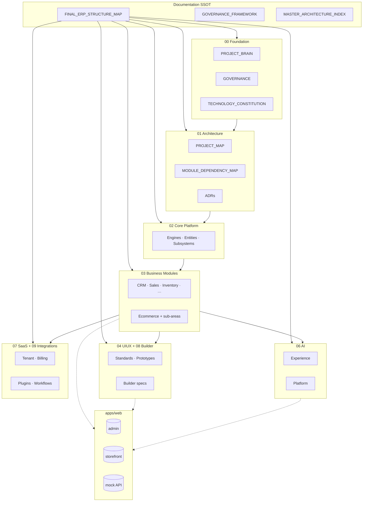

# AgainERP — Final ERP Structure Map

## Purpose
Enterprise structure single source of truth — project, layers, modules, folders.

## When To Read
Read when you need the complete structural map of AgainERP (not task-specific module detail).

## Related Files
- [Cursor entry](BRAIN.md)
- [Governance](GOVERNANCE_FRAMEWORK.md)
- [Architecture index](MASTER_ARCHITECTURE_INDEX.md)

## Read Next
- [Module list](MODULE_REGISTRY.md)

---

> **Status:** **Single Source of Truth**  
> **Version:** 1.0  
> **Date:** 2026-06-19  
> **Step:** 07 — Final ERP Structure Map  
> **Purpose:** Complete enterprise-grade map of AgainERP — project, architecture, modules, and documentation  
> **Supersedes:** Scattered path references; use **this file** + linked authorities for structure questions

**Read first:** [BRAIN.md](./BRAIN.md) → [PROJECT_MAP.md](./PROJECT_MAP.md) → [MODULE_REGISTRY.md](./MODULE_REGISTRY.md)  
**Governance:** [GOVERNANCE_FRAMEWORK.md](./GOVERNANCE_FRAMEWORK.md) · [00-foundation/GOVERNANCE.md](./00-foundation/GOVERNANCE.md)  
**Doc navigation:** [PROJECT_MAP.md](./PROJECT_MAP.md) · [MASTER_DOCUMENT_MAP.md](./MASTER_DOCUMENT_MAP.md) · [MASTER_ARCHITECTURE_INDEX.md](./MASTER_ARCHITECTURE_INDEX.md)

---


## When To Read
Read when you need the complete structural map of AgainERP (not task-specific module detail).

## Related Files
- [Cursor entry](BRAIN.md)
- [Governance](GOVERNANCE_FRAMEWORK.md)
- [Architecture index](MASTER_ARCHITECTURE_INDEX.md)

## Read Next
- [Module list](MODULE_REGISTRY.md)

---

## Document Authority Stack

```text
docs/BRAIN.md                    ← Cursor entry (read first)
docs/ARCHITECTURE_DECISIONS.md   ← Core decisions SSOT (Step 04)
docs/PROJECT_MAP.md              ← Doc navigation hub
docs/MODULE_REGISTRY.md          ← Module index
        │
        ├── FINAL_ERP_STRUCTURE_MAP.md     ← THIS FILE — structure & map (SSOT)
        ├── GOVERNANCE_FRAMEWORK.md     — seven governance domains
        ├── MASTER_ARCHITECTURE_INDEX.md — architecture doc links
        ├── MASTER_DOCUMENT_MAP.md       — full docs hierarchy
        ├── 01-architecture/PROJECT_MAP.md — visual platform map (deep)
        └── 01-architecture/MODULE_DEPENDENCY_MAP.md — integration matrix
```

| Question | Answer Here (Section) | Deep Dive |
|----------|----------------------|-----------|
| Where does code live? | §1 Project Structure | [BRAIN.md](./BRAIN.md) |
| How do layers stack? | §2 Architecture Structure | [01-architecture/PROJECT_MAP.md](./01-architecture/PROJECT_MAP.md) |
| What is Core? | §3 Core Platform | [02-core-platform/ARCHITECTURE.md](./02-core-platform/ARCHITECTURE.md) |
| What modules exist? | §4 Business Modules | [MODULE_REGISTRY.md](./MODULE_REGISTRY.md) |
| UI patterns? | §5 UIUX | [04-uiux/standards/](./04-uiux/standards/) |
| AI layer? | §6 AI | [06-ai/platform/ai/AI_OS_ARCHITECTURE.md](./06-ai/platform/ai/AI_OS_ARCHITECTURE.md) |
| Multi-tenant SaaS? | §7 SaaS | [07-saas/TENANT_ARCHITECTURE.md](./07-saas/TENANT_ARCHITECTURE.md) |
| Storefront builder? | §8 Builder | [03-business-modules/ecommerce/builder/ARCHITECTURE.md](./03-business-modules/ecommerce/builder/ARCHITECTURE.md) |
| Plugins & workflows? | §9 Integrations | [09-integrations/](./09-integrations/) |

---

## Platform Identity (60 Seconds)

| Attribute | Value |
|-----------|-------|
| **Product** | Modular ERP + Ecommerce + AI OS SaaS |
| **Pattern** | Documentation-first · API-first · AI-first |
| **Runtime (now)** | Next.js UI prototype — `apps/web/` |
| **Runtime (planned)** | FastAPI services · PostgreSQL · Redis · Meilisearch |
| **Tenancy** | Tenant → Company → Branch → Warehouse |
| **Integration** | Core → Services (sync) → Events (async) — **no cross-module DB** |
| **Phase** | UI/UX prototype with mock APIs; backend per [10-roadmap/](./10-roadmap/) |

```text
                    ┌──────────────────────────────┐
                    │         AgainERP             │
                    │  One platform · Many modules │
                    └──────────────┬───────────────┘
           ┌───────────────────────┼───────────────────────┐
           ▼                       ▼                       ▼
      Admin ERP              Storefront                 AI OS
      (B2B ops)              (B2C shop)            (agents/tools)
           │                       │                       │
           └───────────────────────┼───────────────────────┘
                                   ▼
                          Core Platform Layer
                                   │
              ┌────────────────────┼────────────────────┐
              ▼                    ▼                    ▼
        Business Modules      SaaS Platform        Integrations
```

---

## 1. Project Structure

### 1.1 Repository Root

```text
againerp/
├── apps/
│   └── web/                         ← ONLY deployable app (Next.js · Vercel root)
│       └── src/
│           ├── app/                 ← Routes (admin · storefront · ess · print · api)
│           ├── components/          ← UI by module + shared layout/ui
│           └── lib/                 ← mock-data · stores · navigation · utils
├── docs/                            ← SOURCE OF TRUTH (this map)
│   ├── FINAL_ERP_STRUCTURE_MAP.md   ← THIS FILE
│   ├── GOVERNANCE_FRAMEWORK.md
│   ├── MASTER_DOCUMENT_MAP.md
│   ├── MASTER_ARCHITECTURE_INDEX.md
│   ├── STANDARD_MODULE_TEMPLATE.md
│   ├── README.md
│   ├── 00-foundation/ … 10-roadmap/ ← Numbered enterprise doc layers
│   └── architecture/                ← Validation reports (isolation, …)
├── .cursor/rules/                   ← IDE agent rules (summary of governance)
└── README.md                        ← Quick start
```

**Future (documented, not in repo):** `apps/api/` (FastAPI) · shared packages · `infra/terraform`

### 1.2 Documentation Layers (`docs/`)

| Folder | Code | Purpose | Entry Doc |
|--------|------|---------|-----------|
| [00-foundation/](./00-foundation/) | L0 | Governance · constitution · registries · PROJECT_BRAIN | [PROJECT_BRAIN.md](./00-foundation/PROJECT_BRAIN.md) |
| [01-architecture/](./01-architecture/) | L1 | Platform maps · ADRs · dependency matrix | [PROJECT_MAP.md](./01-architecture/PROJECT_MAP.md) |
| [02-core-platform/](./02-core-platform/) | L2 | Core engines · entities · subsystems | [ARCHITECTURE.md](./02-core-platform/ARCHITECTURE.md) |
| [03-business-modules/](./03-business-modules/) | L3 | All business & commerce modules | [MODULE_REGISTRY.md](./00-foundation/registries/MODULE_REGISTRY.md) |
| [04-uiux/](./04-uiux/) | L4 | UI standards · prototypes · design system | [ENTERPRISE_UI_ARCHITECTURE.md](./04-uiux/standards/ENTERPRISE_UI_ARCHITECTURE.md) |
| [05-development/](./05-development/) | — | API · DB · deployment · QA · scripts | [DEVELOPMENT_STANDARDS.md](./00-foundation/standards/DEVELOPMENT_STANDARDS.md) |
| [06-ai/](./06-ai/) | L5 | AI experience + platform architecture | [AI_OS_ARCHITECTURE.md](./06-ai/platform/ai/AI_OS_ARCHITECTURE.md) |
| [07-saas/](./07-saas/) | L1 | Tenant · billing · hybrid deployment | [TENANT_ARCHITECTURE.md](./07-saas/TENANT_ARCHITECTURE.md) |
| [08-builder/](./08-builder/) | L4 | Visual builder UI specs | [builder/ARCHITECTURE.md](./03-business-modules/ecommerce/builder/ARCHITECTURE.md) |
| [09-integrations/](./09-integrations/) | L6 | Plugins · workflows | [plugins/README.md](09-integrations/plugins/README.md) |
| [10-roadmap/](./10-roadmap/) | — | Phase sequence · module roadmap | [MASTER_DEVELOPMENT_SEQUENCE.md](10-roadmap/MASTER_DEVELOPMENT_SEQUENCE.md) |

### 1.3 Application Structure (`apps/web/src/`)

| Path | Role |
|------|------|
| `app/(admin)/` | ERP admin shell — all business modules |
| `app/(storefront)/` | Customer storefront `/shop` routes |
| `app/ess/` | Employee self-service portal |
| `app/(print)/` | Print layouts (invoices, labels) |
| `app/api/v1/{module}/` | Mock REST API (prototype phase) |
| `components/ui/` | Shadcn primitives |
| `components/layout/` | Admin shell · sidebar · top nav |
| `components/{module}/` | Module-specific UI |
| `components/shared/` | Cross-module reusables |
| `lib/mock-data/` | Prototype mock data |
| `lib/store/` | Zustand stores |
| `lib/navigation.ts` | Sidebar navigation |

### 1.4 Implementation Read Order

```text
1. PROJECT_BRAIN.md
2. PRE_CODE_GATE.md
3. FINAL_ERP_STRUCTURE_MAP.md (this file) — scope check
4. Module Architecture.md OR ui-prototype build guide
5. Code in apps/web/
```

---

## 2. Architecture Structure

### 2.1 Runtime Layer Stack

```text
┌─────────────────────────────────────────────────────────────────────────┐
│ L6  Clients     Admin UI · Storefront · Mobile · Webhooks · AI Chat UI    │
├─────────────────────────────────────────────────────────────────────────┤
│ L5  AI OS       Chief Agent · Domain Agents · Tools · Audit · Credits   │
├─────────────────────────────────────────────────────────────────────────┤
│ L4  Industry    Hospital · School · Restaurant · … (planned)            │
├─────────────────────────────────────────────────────────────────────────┤
│ L3  Business    CRM · Sales · Inventory · Ecommerce · HR · …           │
├─────────────────────────────────────────────────────────────────────────┤
│ L2  Core        Users · RBAC · Contacts · Workflow · Events · Search    │
├─────────────────────────────────────────────────────────────────────────┤
│ L1  Platform    Tenant · Billing · License · Feature Flags · Modules    │
├─────────────────────────────────────────────────────────────────────────┤
│ L0  Infra       PostgreSQL · Redis · Meilisearch · S3 · K8s             │
└─────────────────────────────────────────────────────────────────────────┘
```

**Golden rule:** [MODULE_DEPENDENCY_MAP §2](./01-architecture/MODULE_DEPENDENCY_MAP.md) — modules integrate via **Services + Events only** · [ADR-010](./01-architecture/decisions/ADR-010-no-cross-module-db.md)

### 2.2 Architecture Documents Map

| Document | Role |
|----------|------|
| [PROJECT_MAP.md](./01-architecture/PROJECT_MAP.md) | Visual platform map |
| [MASTER_MODULE_ARCHITECTURE.md](./01-architecture/MASTER_MODULE_ARCHITECTURE.md) | Module install model |
| [MODULE_DEPENDENCY_MAP.md](./01-architecture/MODULE_DEPENDENCY_MAP.md) | Service/event matrix |
| [SAAS_PLATFORM_ARCHITECTURE.md](./01-architecture/SAAS_PLATFORM_ARCHITECTURE.md) | SaaS blueprint |
| [HYBRID_LICENSED_ERP_ARCHITECTURE.md](./01-architecture/HYBRID_LICENSED_ERP_ARCHITECTURE.md) | Hybrid on-prem + cloud |
| [UNIVERSAL_MODULE_FRAMEWORK.md](./00-foundation/UNIVERSAL_MODULE_FRAMEWORK.md) | Module framework |
| [decisions/](./01-architecture/decisions/) | ADR-001 … ADR-013 |
| [MODULE_ISOLATION_REPORT.md](./architecture/MODULE_ISOLATION_REPORT.md) | Isolation validation |

### 2.3 Integration Mental Model

```text
User / AI  →  HTTP API  →  Service Layer  →  Owner Tables  →  Events  →  Side Effects
                              ↑
                    Permission · Workflow · Approval (Core)
```

### 2.4 Business Flow (Primary Spine)

```text
Catalog (Product Master) ──► Sales ──event──► Inventory
        │                       ├──event──► Finance
Purchase ──event──► Inventory ──event──► Finance
CRM ──service──► Sales          Marketing ──event──► CRM
Ecommerce/Orders ──event──► Sales + Inventory
```

---

## 3. Core Platform Structure

**Location:** `docs/02-core-platform/` · **Runtime API:** `/api/v1/core/` · **Always on** — not installable

### 3.1 Core Hub

| Component | Document |
|-----------|----------|
| Framework hub | [ARCHITECTURE.md](./02-core-platform/ARCHITECTURE.md) |
| Core API | [API.md](./02-core-platform/API.md) |
| Permissions | [PERMISSION_SYSTEM_ARCHITECTURE.md](./02-core-platform/PERMISSION_SYSTEM_ARCHITECTURE.md) |
| Shared entities index | [shared-entities.md](./02-core-platform/shared-entities.md) |
| Manifest | [ModuleManifest.md](./02-core-platform/ModuleManifest.md) |

### 3.2 Core Engines

| Engine | Path | Consumed By |
|--------|------|-------------|
| **Events** | [engines/EVENT_ARCHITECTURE.md](./02-core-platform/engines/EVENT_ARCHITECTURE.md) | All modules (async) |
| **Workflow** | [engines/WORKFLOW_ENGINE_ARCHITECTURE.md](./02-core-platform/engines/WORKFLOW_ENGINE_ARCHITECTURE.md) | Sales, Purchase, CRM, HR |
| **Approval** | [engines/APPROVAL_ENGINE_ARCHITECTURE.md](./02-core-platform/engines/APPROVAL_ENGINE_ARCHITECTURE.md) | High-value mutations |
| **Notification** | [engines/NOTIFICATION_ENGINE_ARCHITECTURE.md](./02-core-platform/engines/NOTIFICATION_ENGINE_ARCHITECTURE.md) | Marketing, HR, alerts |
| **Search** | [engines/GLOBAL_SEARCH_ARCHITECTURE.md](./02-core-platform/engines/GLOBAL_SEARCH_ARCHITECTURE.md) | Global + module search |
| **Queue** | [engines/queue-architecture.md](./02-core-platform/engines/queue-architecture.md) | Async jobs |
| **Cache** | [engines/cache-architecture.md](./02-core-platform/engines/cache-architecture.md) | Performance |

### 3.3 Core Subsystems

| Subsystem | Document | Owns Concept |
|-----------|----------|--------------|
| Activity & Chatter | [subsystems/ACTIVITY_CHATTER_ARCHITECTURE.md](./02-core-platform/subsystems/ACTIVITY_CHATTER_ARCHITECTURE.md) | Timeline · comments · followers |
| Product Master | [subsystems/PRODUCT_MASTER_ARCHITECTURE.md](./02-core-platform/subsystems/PRODUCT_MASTER_ARCHITECTURE.md) | Product identity spine |
| Settings | [subsystems/SETTINGS_ARCHITECTURE.md](./02-core-platform/subsystems/SETTINGS_ARCHITECTURE.md) | Company/branch config |

### 3.4 Core Entities (`entities/`)

| Entity | Doc | Rule |
|--------|-----|------|
| **contacts** | [contacts.md](./02-core-platform/entities/contacts.md) | Single party master — no module duplicates |
| users · roles · permissions | [users.md](./02-core-platform/entities/users.md) · [roles.md](./02-core-platform/entities/roles.md) | Identity & RBAC |
| companies · branches | [companies.md](./02-core-platform/entities/companies.md) | Tenancy scope |
| media · attachments | [media-library.md](./02-core-platform/entities/media-library.md) | Files |
| activities · notes · comments | [activities.md](./02-core-platform/entities/activities.md) | Collaboration |

**Full index:** [entities/README.md](./02-core-platform/entities/README.md)

---

## 4. Business Module Structure

**Location:** `docs/03-business-modules/{module}/` · **29 modules** · **Standard doc:** [STANDARD_MODULE_TEMPLATE.md](./STANDARD_MODULE_TEMPLATE.md)

### 4.1 Module Package (Every Module)

```text
03-business-modules/{module}/
├── ModuleManifest.md          ← Install registry
├── Architecture.md            ← 10-section SSOT (Overview → Future Scope)
├── Database.md                ← Owned tables only
├── API.md                     ← /api/v1/{module}/
├── Workflow.md
├── Permissions.md
├── Reports.md
├── AI.md
├── CHANGELOG.md
├── UI.md                      ← Navigation map
└── Menus/                     ← One .md per admin screen
```

### 4.2 Module Registry by Layer

#### Commerce (Active)

| Module ID | Route | API Base | Table Prefix | Status | Canonical Architecture |
|-----------|-------|----------|--------------|--------|------------------------|
| `ecommerce` | `/catalog/*` · admin | `/api/v1/commerce/` · `/catalog/` | `catalog_*` · `commerce_*` | **Active** | [ecommerce/Architecture.md](./03-business-modules/ecommerce/Architecture.md) |

**Ecommerce sub-areas** (documentation views — not separate installables):

| Area | Architecture | Admin Menus |
|------|--------------|-------------|
| Catalog | [catalog/ARCHITECTURE.md](./03-business-modules/ecommerce/catalog/ARCHITECTURE.md) | `Menus/Catalog/` |
| Orders | [orders/ARCHITECTURE.md](./03-business-modules/ecommerce/orders/ARCHITECTURE.md) | `Menus/Sales/` |
| Customers | [customers/ARCHITECTURE.md](./03-business-modules/ecommerce/customers/ARCHITECTURE.md) | `Menus/Customers/` |
| Inventory views | [ecommerce/inventory/ARCHITECTURE.md](./03-business-modules/ecommerce/inventory/ARCHITECTURE.md) | `Menus/Inventory/` |
| Marketing (legacy) | [ecommerce/marketing/ARCHITECTURE.md](./03-business-modules/ecommerce/marketing/ARCHITECTURE.md) | `Menus/Marketing/` |
| SEO | [seo/ARCHITECTURE.md](./03-business-modules/ecommerce/seo/ARCHITECTURE.md) | `Menus/SEO/` |
| Builder | [builder/ARCHITECTURE.md](./03-business-modules/ecommerce/builder/ARCHITECTURE.md) | `Menus/Builder/` |
| Storefront | [ECOMMERCE_STOREFRONT_ARCHITECTURE.md](./03-business-modules/ecommerce/ECOMMERCE_STOREFRONT_ARCHITECTURE.md) | `app/(storefront)/` |

#### ERP — Revenue & Supply Chain

| Module | Route | API | Prefix | Architecture |
|--------|-------|-----|--------|--------------|
| **CRM** | `/crm/*` | `/api/v1/crm/` | `crm_*` | [CRM_MODULE_ARCHITECTURE.md](./03-business-modules/crm/CRM_MODULE_ARCHITECTURE.md) |
| **Sales** | `/sales/*` | `/api/v1/sales/` | `sales_*` | [SALES_MODULE_ARCHITECTURE.md](./03-business-modules/sales/SALES_MODULE_ARCHITECTURE.md) |
| **Purchase** | `/purchase/*` | `/api/v1/purchase/` | `purchase_*` | [PURCHASE_MODULE_ARCHITECTURE.md](./03-business-modules/purchase/PURCHASE_MODULE_ARCHITECTURE.md) |
| **Inventory** | `/inventory/*` | `/api/v1/inventory/` | `inventory_*` | [INVENTORY_MODULE_ARCHITECTURE.md](./03-business-modules/inventory/INVENTORY_MODULE_ARCHITECTURE.md) |
| **Finance** | `/finance/*` | `/api/v1/finance/` | `finance_*` | [FINANCE_MODULE_ARCHITECTURE.md](./03-business-modules/finance/FINANCE_MODULE_ARCHITECTURE.md) |
| **Accounting** | `/accounting/*` | `/api/v1/accounting/` | `accounting_*` | [Architecture.md](./03-business-modules/accounting/Architecture.md) |
| **Manufacturing** | `/manufacturing/*` | `/api/v1/manufacturing/` | `manufacturing_*` | [ARCHITECTURE.md](./03-business-modules/manufacturing/ARCHITECTURE.md) |
| **POS** | `/pos/*` | `/api/v1/pos/` | `pos_*` | [Architecture.md](./03-business-modules/pos/Architecture.md) |

#### ERP — People & Projects

| Module | Route | API | Prefix | Architecture |
|--------|-------|-----|--------|--------------|
| **HR** | `/hr/*` | `/api/v1/hr/` | `hr_*` | [Architecture.md](./03-business-modules/hr/Architecture.md) |
| **Payroll** | `/payroll/*` | `/api/v1/payroll/` | `payroll_*` | [Architecture.md](./03-business-modules/payroll/Architecture.md) |
| **HR & Payroll (master)** | `/hr/*` · `/ess/*` | combined | `hr_*` · `payroll_*` | [HR_PAYROLL_MASTER_ARCHITECTURE.md](./03-business-modules/hr-payroll/HR_PAYROLL_MASTER_ARCHITECTURE.md) |
| **Project** | `/project/*` | `/api/v1/project/` | `project_*` | [Architecture.md](./03-business-modules/project/Architecture.md) |
| **Timesheet** | `/timesheet/*` | `/api/v1/timesheet/` | `timesheet_*` | [Architecture.md](./03-business-modules/timesheet/Architecture.md) |

#### ERP — Growth & Partners

| Module | Route | API | Architecture |
|--------|-------|-----|--------------|
| **Marketing** | `/marketing/*` | `/api/v1/marketing/` | [MARKETING_MODULE_ARCHITECTURE.md](./03-business-modules/marketing/MARKETING_MODULE_ARCHITECTURE.md) |
| **Sales & Marketing** | `/sales-marketing/*` | `/api/v1/sales-marketing/` | [README.md](./03-business-modules/sales-marketing/README.md) |
| **Business Partners** | `/partners/*` | `/api/v1/partners/` | [Architecture.md](./03-business-modules/business-partners/Architecture.md) |
| **Product Configurator** | `/product-configurator/*` | `/api/v1/product-configurator/` | [Architecture.md](./03-business-modules/product-configurator/Architecture.md) |

#### ERP — Support & Analytics

| Module | API | Architecture |
|--------|-----|--------------|
| **Helpdesk** | `/api/v1/helpdesk/` | [Architecture.md](./03-business-modules/helpdesk/Architecture.md) |
| **Documents** | `/api/v1/documents/` | [Architecture.md](./03-business-modules/documents/Architecture.md) |
| **Knowledge** | `/api/v1/knowledge/` | [Architecture.md](./03-business-modules/knowledge/Architecture.md) |
| **BI System** | `/api/v1/bi/` | [ARCHITECTURE.md](./03-business-modules/bi-system/ARCHITECTURE.md) |
| **Data Warehouse** | — | [ARCHITECTURE.md](./03-business-modules/data-warehouse/ARCHITECTURE.md) |

#### ERP — Operations & Platform Extensions

| Module | API | Architecture |
|--------|-----|--------------|
| **Fleet** | `/api/v1/fleet/` | [ARCHITECTURE.md](./03-business-modules/fleet/ARCHITECTURE.md) |
| **Logistics** | `/api/v1/logistics/` | [ARCHITECTURE.md](./03-business-modules/logistics/ARCHITECTURE.md) |
| **Booking** | `/api/v1/booking/` | [ARCHITECTURE.md](./03-business-modules/booking/ARCHITECTURE.md) |
| **Marketplace** | `/api/v1/marketplace/` | [ARCHITECTURE.md](./03-business-modules/marketplace/ARCHITECTURE.md) |
| **Subscription** | `/api/v1/subscription/` | [ARCHITECTURE.md](./03-business-modules/subscription/ARCHITECTURE.md) |

### 4.3 Module Isolation Rules

| Rule | Reference |
|------|-----------|
| One writer per table prefix | [MODULE_ISOLATION_REPORT.md](./architecture/MODULE_ISOLATION_REPORT.md) |
| Core contacts — no duplicate customers | [ADR-008](./01-architecture/decisions/ADR-008-unified-contacts.md) |
| Inventory owns stock ledger | [INVENTORY_MODULE_ARCHITECTURE.md](./03-business-modules/inventory/INVENTORY_MODULE_ARCHITECTURE.md) |
| Module off → graceful UI hide | [PROJECT_COMMON_RULES.md](./00-foundation/PROJECT_COMMON_RULES.md) |

---

## 5. UIUX Structure

**Location:** `docs/04-uiux/` · **Code:** `apps/web/src/components/` · **Pattern:** List + right Sheet drawer

### 5.1 UI Layer Map

```text
04-uiux/
├── standards/          ← Global UI architecture (mandatory)
├── prototype/          ← Per-screen build guides (~480 docs)
├── design-system/      ← Tokens · HR spec
└── strategy/           ← Prototype phase rules
```

### 5.2 Mandatory UI Patterns

| Pattern | Rule | Document |
|---------|------|----------|
| **CRUD** | List page + Sheet drawer — `?create=1` · `?view={id}` · `?edit={id}` | [PROJECT_COMMON_RULES.md](./00-foundation/PROJECT_COMMON_RULES.md) |
| **No legacy routes** | Never `/new` or `/[id]/edit` for standard CRUD | [page-architecture.md](./04-uiux/standards/page-architecture.md) |
| **Mobile-first** | Full-width drawer · 44px targets · table/card fallback | [mobile-first.md](./04-uiux/standards/mobile-first.md) |
| **Admin shell** | Sidebar + top bar + content | [layout-architecture.md](./04-uiux/standards/layout-architecture.md) |
| **Module UI** | Per-module conventions | [module-ui-standard.md](./04-uiux/standards/module-ui-standard.md) |

### 5.3 Key Standards Documents

| Document | Purpose |
|----------|---------|
| [ENTERPRISE_UI_ARCHITECTURE.md](./04-uiux/standards/ENTERPRISE_UI_ARCHITECTURE.md) | Enterprise admin architecture |
| [UI_UX_DESIGN_STANDARDS.md](./04-uiux/standards/UI_UX_DESIGN_STANDARDS.md) | Design standards |
| [UX_SMART_INTERACTION_STANDARDS.md](./04-uiux/standards/UX_SMART_INTERACTION_STANDARDS.md) | CMDK · smart lists |
| [recharts-conventions.md](./04-uiux/standards/recharts-conventions.md) | Chart formatters |

### 5.4 Doc ↔ Code ↔ Screen Mapping

| Layer | Location | Role |
|-------|----------|------|
| Functional spec | `03-business-modules/{m}/Menus/{Screen}.md` | What the screen does |
| Build guide | `04-uiux/prototype/{area}/{Screen}.md` | How to implement |
| React code | `apps/web/src/app/(admin)/` + `components/` | Running UI |
| HR UI deep-dive | `03-business-modules/hr-payroll/uiux/` | HR-specific UI architecture |

### 5.5 Prototype Phase

| Doc | Rule |
|-----|------|
| [UI_PROTOTYPE_MODE.md](./04-uiux/strategy/UI_PROTOTYPE_MODE.md) | Mock data only — no real backend |
| [UI_PROTOTYPE_STRATEGY.md](./04-uiux/strategy/UI_PROTOTYPE_STRATEGY.md) | Tri-file: spec + Review + Changes |

---

## 6. AI Structure

**Location:** `docs/06-ai/` · **Platform service** — not a business module DB owner

### 6.1 AI Layer Map

```text
06-ai/
├── experience/              ← Vision & UX (what users see)
│   ├── 01_AI_COMMERCE_OS_VISION.md
│   ├── 02_AI_USER_EXPERIENCE.md
│   ├── 03_AI_ADMIN_EXPERIENCE.md
│   └── 04_AI_STOREFRONT_EXPERIENCE.md
└── platform/ai/             ← Technical architecture (how it works)
    ├── AI_OS_ARCHITECTURE.md
    ├── AI_FIRST_ARCHITECTURE.md
    ├── AI_AUDIT_AND_APPROVAL.md
    ├── AI_CONTEXT_ENGINE.md
    └── AI_DIGITAL_TWIN.md
```

### 6.2 AI Integration Model

```text
User prompt → Chief Agent → Tool Registry → {Module}Service.method()
                                              ↓
                                    Permission + Approval + Audit
                                              ↓
                                    Never direct ORM / SQL on business tables
```

| Component | Document |
|-----------|----------|
| Platform architecture | [AI_OS_ARCHITECTURE.md](./06-ai/platform/ai/AI_OS_ARCHITECTURE.md) |
| Agent navigation | [AI_KNOWLEDGE_INDEX.md](./00-foundation/registries/AI_KNOWLEDGE_INDEX.md) |
| Module tools | `03-business-modules/{module}/AI.md` |
| Tool template | [05-development/framework/templates/AI_TEMPLATE.md](./05-development/framework/templates/AI_TEMPLATE.md) |
| Admin UI (code) | `apps/web/src/app/(admin)/ai-os/` · [04-uiux/prototype/ai-os/](./04-uiux/prototype/ai-os/) |

### 6.3 AI Governance

| Rule | Source |
|------|--------|
| Tools call services only | [GOVERNANCE_FRAMEWORK § AI](./GOVERNANCE_FRAMEWORK.md) |
| Risk tier + approval for high-risk tools | [AI_AUDIT_AND_APPROVAL.md](./06-ai/platform/ai/AI_AUDIT_AND_APPROVAL.md) |
| Pre-code gate Step 6 | [PRE_CODE_GATE.md](./00-foundation/PRE_CODE_GATE.md) |

---

## 7. SaaS Structure

**Location:** `docs/07-saas/` + platform architecture docs

### 7.1 Tenancy Model

```text
Platform (Tenant)
    └── Company (company_id)
            └── Branch (branch_id)
                    └── Warehouse (warehouse_id)
```

| Document | Role |
|----------|------|
| [TENANT_ARCHITECTURE.md](./07-saas/TENANT_ARCHITECTURE.md) | Multi-tenant model |
| [SAAS_PLATFORM_ARCHITECTURE.md](./01-architecture/SAAS_PLATFORM_ARCHITECTURE.md) | Platform blueprint |
| [SAAS_ER_DIAGRAM.md](./07-saas/SAAS_ER_DIAGRAM.md) | SaaS schema |
| [DATA_OWNERSHIP.md](./07-saas/DATA_OWNERSHIP.md) | Tenant data ownership |
| [CLOUD_CONTROL_PLANE.md](./07-saas/CLOUD_CONTROL_PLANE.md) | Control plane |
| [subscription/ARCHITECTURE.md](./03-business-modules/subscription/ARCHITECTURE.md) | Billing module |

### 7.2 Hybrid & Licensing

| Document | Role |
|----------|------|
| [HYBRID_LICENSED_ERP_ARCHITECTURE.md](./01-architecture/HYBRID_LICENSED_ERP_ARCHITECTURE.md) | Hybrid model |
| [HYBRID_DEPLOYMENT.md](./07-saas/HYBRID_DEPLOYMENT.md) | Deployment topology |
| [LICENSE_AND_SYNC_AGENTS.md](./07-saas/LICENSE_AND_SYNC_AGENTS.md) | License sync |
| [ADR-013](./01-architecture/decisions/ADR-013-hybrid-licensed-erp.md) | ADR |

### 7.3 Scale Path

| Document | Role |
|----------|------|
| [SCALING_ROADMAP.md](./07-saas/SCALING_ROADMAP.md) | Platform scale |
| [AI_SCALING_ROADMAP.md](./06-ai/platform/ai/AI_SCALING_ROADMAP.md) | AI scale |
| [05-development/deployment/](./05-development/deployment/) | CI/CD · K8s |

---

## 8. Builder Structure

**Purpose:** Visual storefront composition — pages, themes, widgets, forms (no code deploy)

### 8.1 Builder Map

```text
Architecture (module)     docs/03-business-modules/ecommerce/builder/ARCHITECTURE.md
        │
        ├── builder_* tables · /api/v1/builder/
        ├── Integrates: Catalog · SEO · Media · Marketing · Orders
        │
UI build guides           docs/08-builder/prototype/
        ├── ThemeManager · HomepageBuilder · CheckoutBuilder · …
        │
Screen functional specs   docs/03-business-modules/ecommerce/Menus/Builder/
        │
Storefront runtime        apps/web/src/app/(storefront)/
```

### 8.2 Builder Components

| Builder | Architecture | UI Prototype |
|---------|--------------|--------------|
| Theme Manager | [builder/ARCHITECTURE.md](./03-business-modules/ecommerce/builder/ARCHITECTURE.md) | [ThemeManager.md](./08-builder/prototype/ThemeManager.md) |
| Homepage | same | [HomepageBuilder.md](./08-builder/prototype/HomepageBuilder.md) |
| Product Page | same | [ProductPageBuilder.md](./08-builder/prototype/ProductPageBuilder.md) |
| Checkout | same | [CheckoutBuilder.md](./08-builder/prototype/CheckoutBuilder.md) |
| SEO (related) | [seo/ARCHITECTURE.md](./03-business-modules/ecommerce/seo/ARCHITECTURE.md) | [Menus/SEO/](./03-business-modules/ecommerce/Menus/SEO/) |

### 8.3 Render Pipeline

```text
builder_pages (JSON) → SSR/Edge render → CDN cache → Storefront HTML
         ↑ publish event → SEO sitemap · CDN purge
```

---

## 9. Integration Structure

**Location:** `docs/09-integrations/`

### 9.1 Integration Types

| Type | Location | Pattern |
|------|----------|---------|
| **Plugins** | [09-integrations/plugins/](./09-integrations/plugins/) | Optional install · manifest · `/api/v1/plugins/` |
| **Workflows** | [09-integrations/workflows/](./09-integrations/workflows/) | Cross-module · Core Workflow Engine |
| **Service contracts** | [05-development/framework/COMMUNICATION_CONTRACTS.md](./05-development/framework/COMMUNICATION_CONTRACTS.md) | Sync integration |
| **Domain events** | [02-core-platform/engines/EVENT_ARCHITECTURE.md](./02-core-platform/engines/EVENT_ARCHITECTURE.md) | Async integration |
| **Business partners** | [business-partners/INTEGRATION.md](./03-business-modules/business-partners/INTEGRATION.md) | Vendor/customer hub |

### 9.2 Plugin Example

| Plugin | Docs |
|--------|------|
| Bank EMI | [plugins/bank-emi/Architecture.md](09-integrations/plugins/bank-emi/Architecture.md) · [PLUGIN_MANIFEST.md](09-integrations/plugins/bank-emi/PLUGIN_MANIFEST.md) |

### 9.3 External Consumers (Same APIs)

```text
Web Admin ──┐
Storefront ─┼──► /api/v1/{module}/ ──► Services ──► DB
Mobile ─────┤
AI Tools ───┤
Webhooks ───┘
```

---

## 10. Complete Enterprise Map (Single Diagram)



---

## 11. Master Index — All Structure Documents

| # | Document | Role |
|---|----------|------|
| 1 | **FINAL_ERP_STRUCTURE_MAP.md** | **This file — structure SSOT** |
| 2 | [BRAIN.md](./BRAIN.md) | Cursor entry — read first |
| 3 | [ARCHITECTURE_DECISIONS.md](./ARCHITECTURE_DECISIONS.md) | Core architecture decisions |
| 4 | [PROJECT_MAP.md](./PROJECT_MAP.md) | Doc navigation hub |
| 5 | [MODULE_REGISTRY.md](./MODULE_REGISTRY.md) | Module index |
| 6 | [GOVERNANCE_FRAMEWORK.md](./GOVERNANCE_FRAMEWORK.md) | Seven governance domains |
| 7 | [MASTER_DOCUMENT_MAP.md](./MASTER_DOCUMENT_MAP.md) | Full docs hierarchy |
| 8 | [MASTER_ARCHITECTURE_INDEX.md](./MASTER_ARCHITECTURE_INDEX.md) | Architecture doc index |
| 9 | [STANDARD_MODULE_TEMPLATE.md](./STANDARD_MODULE_TEMPLATE.md) | Module doc format |
| 10 | [architecture/MODULE_ISOLATION_REPORT.md](./architecture/MODULE_ISOLATION_REPORT.md) | Isolation audit |
| 11 | [00-foundation/PROJECT_BRAIN.md](./00-foundation/PROJECT_BRAIN.md) | Extended implementation brain |
| 12 | [01-architecture/PROJECT_MAP.md](./01-architecture/PROJECT_MAP.md) | Visual platform map |
| 13 | [01-architecture/MODULE_DEPENDENCY_MAP.md](./01-architecture/MODULE_DEPENDENCY_MAP.md) | Integration matrix |

---

## 12. Change History

| Date | Version | Change |
|------|---------|--------|
| 2026-06-19 | 1.0 | Step 07 — Final ERP structure map (SSOT) |

---

**AgainERP Final ERP Structure Map** — one platform · one map · every layer documented.
