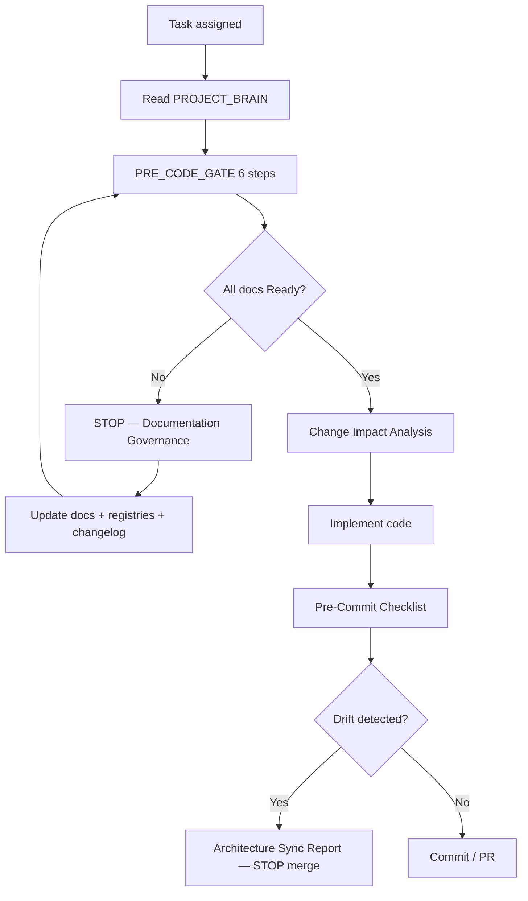

# AgainERP — Governance Framework

> **Status:** Active  
> **Version:** 1.0  
> **Date:** 2026-06-19  
> **Step:** 06 — Project Governance Layer  
> **Purpose:** Umbrella governance model — seven domains, one workflow, zero duplicated rules  
> **Authority:** This framework **indexes** existing governance docs; detailed rules live in linked sources.

---

## Purpose
Umbrella governance — seven domains with links to authoritative rule sources.

## When To Read
Read when you need governance domain ownership or approval workflow pointers.

## Related Files
- [Operational governance](00-foundation/GOVERNANCE.md)
- [Pre-code gate](00-foundation/PRE_CODE_GATE.md)

## Read Next
- [Cursor entry](BRAIN.md)

---

## 1. Core Principle

```text
Documentation is the source of truth.
Code, UI, APIs, schema, and AI behavior follow approved docs — never the reverse.
```

**Operational governance (workflows, checklists, registries):** [00-foundation/GOVERNANCE.md](./00-foundation/GOVERNANCE.md)  
**Before any code:** [00-foundation/PRE_CODE_GATE.md](./00-foundation/PRE_CODE_GATE.md)  
**Cursor entry:** [BRAIN.md](./BRAIN.md) → [PROJECT_MAP.md](./PROJECT_MAP.md) → [MODULE_REGISTRY.md](./MODULE_REGISTRY.md)

This framework defines **what** each governance domain owns and **which document** is authoritative — it does not restate those documents.

---

## 2. Governance Hierarchy

```text
┌─────────────────────────────────────────────────────────────────────────┐
│                    GOVERNANCE_FRAMEWORK.md (this file)                   │
│              Seven domains · cross-links · enforcement model             │
└─────────────────────────────────────────────────────────────────────────┘
         │              │              │              │              │
         ▼              ▼              ▼              ▼              ▼
   Architecture    Documentation      UI           API         Database
   Governance       Governance     Governance   Governance    Governance
         │              │              │              │              │
         └──────────────┴──────────────┼──────────────┴──────────────┘
                                       ▼
                              AI Governance
                                       │
                                       ▼
                           Development Governance
                                       │
                                       ▼
                    00-foundation/GOVERNANCE.md (execution layer)
```

### Domain Map → Pre-Code Gate

| Governance Domain | Pre-Code Gate Step | Primary Stop Condition |
|-------------------|-------------------|------------------------|
| Development | Step 0 (meta) + Step 1 | Constitution not read / non-ratified tech |
| Architecture | Step 2 | Module `Architecture.md` missing or not **Ready** |
| Database | Step 3 | Tables not in `Database.md` + registry |
| API | Step 4 | Endpoints not in `API.md` + registry |
| UI | Step 5 | Screen spec missing or template-only |
| AI | Step 6 | Tools not in `AI.md` / audit bypass |
| Documentation | All steps | Doc not registered, indexed, or changelog missing |

---

## 3. Architecture Governance

**Owns:** Platform layers, module boundaries, dependencies, isolation, ADRs, structural integrity.

### Authority Documents

| Document | Role |
|----------|------|
| [01-architecture/PROJECT_MAP.md](./01-architecture/PROJECT_MAP.md) | Visual platform map |
| [01-architecture/MASTER_MODULE_ARCHITECTURE.md](./01-architecture/MASTER_MODULE_ARCHITECTURE.md) | Module layer blueprint |
| [01-architecture/MODULE_DEPENDENCY_MAP.md](./01-architecture/MODULE_DEPENDENCY_MAP.md) | **Canonical** service/event dependency matrix |
| [01-architecture/DependencyMap.md](./01-architecture/DependencyMap.md) | One-page dependency summary |
| [02-core-platform/ARCHITECTURE.md](./02-core-platform/ARCHITECTURE.md) | Core framework hub |
| [00-foundation/UNIVERSAL_MODULE_FRAMEWORK.md](./00-foundation/UNIVERSAL_MODULE_FRAMEWORK.md) | Installable module framework |
| [00-foundation/traceability/ADR_INDEX.md](00-foundation/traceability/ADR_INDEX.md) | Architecture decisions |
| [architecture/MODULE_ISOLATION_REPORT.md](./architecture/MODULE_ISOLATION_REPORT.md) | Isolation validation |
| [ARCHITECTURE_DECISIONS.md](./ARCHITECTURE_DECISIONS.md) | Core architecture decisions index |
| [MASTER_ARCHITECTURE_INDEX.md](./MASTER_ARCHITECTURE_INDEX.md) | Architecture doc map |

### Rules (see linked docs for detail)

| Rule | Source |
|------|--------|
| Core-first — business modules depend on Core, not each other's DB | [MODULE_DEPENDENCY_MAP §2](./01-architecture/MODULE_DEPENDENCY_MAP.md) · [ADR-010](./01-architecture/decisions/ADR-010-no-cross-module-db.md) |
| Services (sync) + Events (async) only between modules | [MODULE_DEPENDENCY_MAP §2](./01-architecture/MODULE_DEPENDENCY_MAP.md) · [ADR-006](./01-architecture/decisions/ADR-006-event-driven.md) |
| Single table owner per prefix | [02-core-platform/ARCHITECTURE.md](./02-core-platform/ARCHITECTURE.md) |
| New/changed cross-module dependency → update dependency map | [GOVERNANCE § Dependency Map Rule](./00-foundation/GOVERNANCE.md) |
| Architecture drift → STOP + sync report | [GOVERNANCE § Architecture Synchronization](./00-foundation/GOVERNANCE.md) · [templates/_ARCHITECTURE_SYNC_REPORT_TEMPLATE.md](./00-foundation/templates/_ARCHITECTURE_SYNC_REPORT_TEMPLATE.md) |

### Required Artifacts (per module)

| Artifact | Location |
|----------|----------|
| `Architecture.md` (10 sections) | [STANDARD_MODULE_TEMPLATE.md](./STANDARD_MODULE_TEMPLATE.md) |
| `ModuleManifest.md` | [templates/_MODULE_MANIFEST_TEMPLATE.md](./00-foundation/templates/_MODULE_MANIFEST_TEMPLATE.md) |
| Change impact analysis | [templates/_CHANGE_IMPACT_TEMPLATE.md](./00-foundation/templates/_CHANGE_IMPACT_TEMPLATE.md) |

### Related

Documentation · Database · API · Development · [01-architecture/decisions/](./01-architecture/decisions/)

---

## 4. Documentation Governance

**Owns:** Doc-first workflow, registration, indexing, status lifecycle, templates, health metrics.

### Authority Documents

| Document | Role |
|----------|------|
| [00-foundation/GOVERNANCE.md](./00-foundation/GOVERNANCE.md) | **Primary** documentation governance rules |
| [00-foundation/standards/DOCUMENTATION_STANDARD.md](./00-foundation/standards/DOCUMENTATION_STANDARD.md) | Section templates & **Ready** status |
| [00-foundation/standards/FILE_NAMING_STANDARD.md](./00-foundation/standards/FILE_NAMING_STANDARD.md) | File & folder naming |
| [00-foundation/MODULE_STRUCTURE.md](./00-foundation/MODULE_STRUCTURE.md) | Module doc package layout |
| [STANDARD_MODULE_TEMPLATE.md](./STANDARD_MODULE_TEMPLATE.md) | 10-section module architecture standard |
| [MASTER_DOCUMENT_MAP.md](./MASTER_DOCUMENT_MAP.md) | Docs hierarchy navigation |
| [00-foundation/standards/DOCUMENTATION_HEALTH_REPORT.md](./00-foundation/standards/DOCUMENTATION_HEALTH_REPORT.md) | Quality dashboard |
| [00-foundation/standards/PROJECT_DOCUMENT_AUDIT.md](./00-foundation/standards/PROJECT_DOCUMENT_AUDIT.md) | Structure audit |

### Registries (must stay current)

| Registry | Path |
|----------|------|
| Documents | [00-foundation/registries/DOCUMENT_REGISTRY.md](./00-foundation/registries/DOCUMENT_REGISTRY.md) |
| Modules | [00-foundation/registries/MODULE_REGISTRY.md](./00-foundation/registries/MODULE_REGISTRY.md) |
| Pages | [00-foundation/registries/PAGE_REGISTRY.md](./00-foundation/registries/PAGE_REGISTRY.md) |
| Traceability | [00-foundation/traceability/TRACEABILITY_MATRIX.md](./00-foundation/traceability/TRACEABILITY_MATRIX.md) |
| Changelog | [00-foundation/CHANGELOG.md](./00-foundation/CHANGELOG.md) |

**Regenerate:** `python3 docs/05-development/scripts/generate-governance-registries.py`

### Workflow (summary — full detail in GOVERNANCE.md)

```text
Pre-Code Gate → Docs Update → Review → Approve (Ready) → Dev Tasks → Code → Arch Refs → Changelog
```

| Status | Meaning |
|--------|---------|
| Draft | Work in progress — **no production code** |
| Ready | Reviewed & approved — code may proceed |
| Deprecated | Superseded — link to replacement |

### Rules (see linked docs)

| Rule | Source |
|------|--------|
| No feature without doc update first | [GOVERNANCE § Documentation First](./00-foundation/GOVERNANCE.md) |
| Every new doc → registry + index + changelog | [GOVERNANCE § Registration Rules](./00-foundation/GOVERNANCE.md) |
| Mandatory update triggers (module, menu, table, API, …) | [GOVERNANCE § Mandatory Update Rule](./00-foundation/GOVERNANCE.md) |
| Pre-commit validation | [templates/_COMMIT_CHECKLIST.md](./00-foundation/templates/_COMMIT_CHECKLIST.md) |

### Related

All other domains · [00-foundation/PRE_CODE_GATE.md](./00-foundation/PRE_CODE_GATE.md) · [ADR-007 Documentation-first](./01-architecture/decisions/ADR-007-documentation-first.md)

---

## 5. UI Governance

**Owns:** Admin UX patterns, mobile-first, drawer CRUD, design system, screen specs, prototype phase rules.

### Authority Documents

| Document | Role |
|----------|------|
| [00-foundation/PROJECT_COMMON_RULES.md](./00-foundation/PROJECT_COMMON_RULES.md) | Drawer CRUD · mobile · module-off graceful hide |
| [04-uiux/standards/ENTERPRISE_UI_ARCHITECTURE.md](./04-uiux/standards/ENTERPRISE_UI_ARCHITECTURE.md) | Enterprise admin UI architecture |
| [04-uiux/standards/layout-architecture.md](./04-uiux/standards/layout-architecture.md) | Shell, sidebar, drawer |
| [04-uiux/standards/page-architecture.md](./04-uiux/standards/page-architecture.md) | List + Sheet pattern |
| [04-uiux/standards/module-ui-standard.md](./04-uiux/standards/module-ui-standard.md) | Per-module UI conventions |
| [04-uiux/standards/UI_UX_DESIGN_STANDARDS.md](./04-uiux/standards/UI_UX_DESIGN_STANDARDS.md) | Design standards |
| [04-uiux/standards/UX_SMART_INTERACTION_STANDARDS.md](./04-uiux/standards/UX_SMART_INTERACTION_STANDARDS.md) | CMDK, smart lists, interactions |
| [04-uiux/standards/mobile-first.md](./04-uiux/standards/mobile-first.md) | Mobile requirements |
| [04-uiux/strategy/UI_PROTOTYPE_STRATEGY.md](./04-uiux/strategy/UI_PROTOTYPE_STRATEGY.md) | Prototype phase strategy |
| [04-uiux/strategy/UI_PROTOTYPE_MODE.md](./04-uiux/strategy/UI_PROTOTYPE_MODE.md) | Prototype gate exceptions |

### Module & Screen Artifacts

| Artifact | Location | Standard |
|----------|----------|----------|
| UI summary (§8) | `03-business-modules/{module}/Architecture.md` | [STANDARD_MODULE_TEMPLATE.md §8](./STANDARD_MODULE_TEMPLATE.md) |
| Navigation map | `03-business-modules/{module}/UI.md` | [MODULE_STRUCTURE.md](./00-foundation/MODULE_STRUCTURE.md) |
| Screen functional spec | `03-business-modules/{module}/Menus/{Screen}.md` | [DOCUMENTATION_STANDARD.md](./00-foundation/standards/DOCUMENTATION_STANDARD.md) |
| Build guide | `04-uiux/prototype/{area}/` | [04-uiux/prototype/README.md](./04-uiux/prototype/README.md) |

### Rules (see linked docs)

| Rule | Source |
|------|--------|
| CRUD = list + right Sheet drawer (`?create=1` · `?view=` · `?edit=`) | [PROJECT_COMMON_RULES.md](./00-foundation/PROJECT_COMMON_RULES.md) |
| No `/new` or `/[id]/edit` routes for standard CRUD | [PROJECT_COMMON_RULES.md](./00-foundation/PROJECT_COMMON_RULES.md) |
| 44px tap targets · full-width drawer on mobile | [DEVELOPMENT_STANDARDS §1](./00-foundation/standards/DEVELOPMENT_STANDARDS.md) |
| No business logic in UI — API/service only | [05-development/api/architecture.md](./05-development/api/architecture.md) |
| Module off → hide nav, no crash | [PROJECT_COMMON_RULES.md](./00-foundation/PROJECT_COMMON_RULES.md) |

### Related

Documentation (screen specs) · API (UI consumes APIs) · Architecture (route namespaces) · [08-builder/prototype/](./08-builder/prototype/) (builder UI)

---

## 6. API Governance

**Owns:** API-first layering, URL conventions, auth, versioning, module endpoint ownership, service contracts.

### Authority Documents

| Document | Role |
|----------|------|
| [05-development/api/architecture.md](./05-development/api/architecture.md) | API-first flow & URL rules |
| [05-development/api/README.md](./05-development/api/README.md) | API standards entry |
| [02-core-platform/API.md](./02-core-platform/API.md) | Core API `/api/v1/core/` |
| [00-foundation/registries/API_REGISTRY.md](./00-foundation/registries/API_REGISTRY.md) | API catalog |
| [00-foundation/registries/SERVICE_REGISTRY.md](./00-foundation/registries/SERVICE_REGISTRY.md) | Service contracts |
| [00-foundation/TECHNOLOGY_CONSTITUTION.md](./00-foundation/TECHNOLOGY_CONSTITUTION.md) | Stack & API constitution |
| [05-development/framework/COMMUNICATION_CONTRACTS.md](./05-development/framework/COMMUNICATION_CONTRACTS.md) | Cross-module service/event contracts |

### Module Artifacts

| Artifact | Location |
|----------|----------|
| `API.md` | `03-business-modules/{module}/API.md` |
| API §5 in architecture | [STANDARD_MODULE_TEMPLATE.md §5](./STANDARD_MODULE_TEMPLATE.md) |

### Rules (see linked docs)

| Rule | Source |
|------|--------|
| Frontend never queries DB directly | [api/architecture.md](./05-development/api/architecture.md) |
| `/api/v1/{module}/{resource}` versioning | [api/architecture.md](./05-development/api/architecture.md) |
| JWT/session + RBAC on every endpoint | [api/architecture.md](./05-development/api/architecture.md) · [DEVELOPMENT_STANDARDS §6–7](./00-foundation/standards/DEVELOPMENT_STANDARDS.md) |
| Cross-module reads via owning module's Service API | [MODULE_DEPENDENCY_MAP §11](./01-architecture/MODULE_DEPENDENCY_MAP.md) |
| New/changed endpoint → `API.md` + registry + changelog | [GOVERNANCE § Mandatory Update Rule](./00-foundation/GOVERNANCE.md) |

### Related

Architecture (service boundaries) · Database (repository layer) · Permissions · AI (tools call services)

---

## 7. Database Governance

**Owns:** Schema ownership, naming, tenancy columns, soft delete, migrations, entity registry, no cross-module DB access.

### Authority Documents

| Document | Role |
|----------|------|
| [05-development/database/MASTER_DATABASE_ARCHITECTURE.md](./05-development/database/MASTER_DATABASE_ARCHITECTURE.md) | Master schema architecture |
| [05-development/database/standards.md](./05-development/database/standards.md) | Mandatory columns & naming |
| [05-development/database/naming-conventions.md](./05-development/database/naming-conventions.md) | Naming detail |
| [05-development/database/audit-trail.md](./05-development/database/audit-trail.md) | Audit columns |
| [05-development/database/multi-company.md](./05-development/database/multi-company.md) | Multi-company scope |
| [05-development/database/ER_DIAGRAM.md](./05-development/database/ER_DIAGRAM.md) | ER reference |
| [00-foundation/registries/DATABASE_REGISTRY.md](./00-foundation/registries/DATABASE_REGISTRY.md) | Table catalog |
| [00-foundation/registries/ENTITY_RELATIONSHIP_REGISTRY.md](./00-foundation/registries/ENTITY_RELATIONSHIP_REGISTRY.md) | Entity relationships |
| [02-core-platform/shared-entities.md](./02-core-platform/shared-entities.md) | Core shared entities |

### Module Artifacts

| Artifact | Location |
|----------|----------|
| `Database.md` | `03-business-modules/{module}/Database.md` |
| Data Ownership §4 | [STANDARD_MODULE_TEMPLATE.md §4](./STANDARD_MODULE_TEMPLATE.md) |
| Entity docs | `03-business-modules/{module}/ENTITY_*.md` (where present) |

### Rules (see linked docs)

| Rule | Source |
|------|--------|
| One module owns each table prefix `{module}_*` | [MASTER_DATABASE_ARCHITECTURE.md](./05-development/database/MASTER_DATABASE_ARCHITECTURE.md) |
| Mandatory: `uuid`, `company_id`, audit columns, soft delete | [database/standards.md](./05-development/database/standards.md) |
| No cross-module JOINs / ORM imports | [ADR-010](./01-architecture/decisions/ADR-010-no-cross-module-db.md) · [MODULE_ISOLATION_REPORT.md](./architecture/MODULE_ISOLATION_REPORT.md) |
| Unified contacts — no duplicate party tables | [ADR-008](./01-architecture/decisions/ADR-008-unified-contacts.md) · [entities/contacts.md](./02-core-platform/entities/contacts.md) |
| Schema change → `Database.md` + registry + dependency map | [GOVERNANCE § Mandatory Update Rule](./00-foundation/GOVERNANCE.md) |

### Related

Architecture (ownership) · API (repository access) · [ADR-001 PostgreSQL](./01-architecture/decisions/ADR-001-postgresql.md)

---

## 8. AI Governance

**Owns:** AI OS platform rules, tool registry, audit/approval, credit metering, no direct DB access by agents.

### Authority Documents

| Document | Role |
|----------|------|
| [06-ai/platform/ai/AI_OS_ARCHITECTURE.md](./06-ai/platform/ai/AI_OS_ARCHITECTURE.md) | Platform AI architecture |
| [06-ai/platform/ai/AI_FIRST_ARCHITECTURE.md](./06-ai/platform/ai/AI_FIRST_ARCHITECTURE.md) | AI-first design rules |
| [06-ai/platform/ai/AI_AUDIT_AND_APPROVAL.md](./06-ai/platform/ai/AI_AUDIT_AND_APPROVAL.md) | Audit & approval layer |
| [06-ai/platform/ai/AI_CONTEXT_ENGINE.md](./06-ai/platform/ai/AI_CONTEXT_ENGINE.md) | Context assembly |
| [06-ai/experience/README.md](./06-ai/experience/README.md) | AI UX entry |
| [00-foundation/registries/AI_KNOWLEDGE_INDEX.md](./00-foundation/registries/AI_KNOWLEDGE_INDEX.md) | AI agent navigation |
| [00-foundation/TECHNOLOGY_CONSTITUTION.md](./00-foundation/TECHNOLOGY_CONSTITUTION.md) | AI architecture rules (constitution) |
| [01-architecture/decisions/ADR-004-ai-os.md](./01-architecture/decisions/ADR-004-ai-os.md) | AI OS as platform layer |

### Module Artifacts

| Artifact | Location |
|----------|----------|
| `AI.md` | `03-business-modules/{module}/AI.md` |
| AI Integration §9 | [STANDARD_MODULE_TEMPLATE.md §9](./STANDARD_MODULE_TEMPLATE.md) |
| Template | [05-development/framework/templates/AI_TEMPLATE.md](./05-development/framework/templates/AI_TEMPLATE.md) |

### Rules (see linked docs)

| Rule | Source |
|------|--------|
| AI uses **tools → services → APIs** — never raw SQL on business tables | [AI_OS_ARCHITECTURE.md](./06-ai/platform/ai/AI_OS_ARCHITECTURE.md) · [PRE_CODE_GATE Step 6](./00-foundation/PRE_CODE_GATE.md) |
| Tools registered with risk tier + approval requirement | [AI_AUDIT_AND_APPROVAL.md](./06-ai/platform/ai/AI_AUDIT_AND_APPROVAL.md) |
| Module off → AI tools return `ModuleNotEnabled` | [PROJECT_COMMON_RULES.md](./00-foundation/PROJECT_COMMON_RULES.md) |
| AI feature → `AI.md` + registry update | [GOVERNANCE § Mandatory Update Rule](./00-foundation/GOVERNANCE.md) |

### Related

API (tools wrap services) · Permissions (tool ACL) · Architecture · [02-core-platform/engines/APPROVAL_ENGINE_ARCHITECTURE.md](./02-core-platform/engines/APPROVAL_ENGINE_ARCHITECTURE.md)

---

## 9. Development Governance

**Owns:** Technology stack, coding standards, security, performance, testing, deployment, pre-code gate execution.

### Authority Documents

| Document | Role |
|----------|------|
| [00-foundation/TECHNOLOGY_CONSTITUTION.md](./00-foundation/TECHNOLOGY_CONSTITUTION.md) | **Official stack** — supersedes conflicts |
| [00-foundation/standards/DEVELOPMENT_STANDARDS.md](./00-foundation/standards/DEVELOPMENT_STANDARDS.md) | Global dev standards (20 pillars) |
| [00-foundation/PRE_CODE_GATE.md](./00-foundation/PRE_CODE_GATE.md) | Mandatory 6-step gate before code |
| [00-foundation/PROJECT_COMMON_RULES.md](./00-foundation/PROJECT_COMMON_RULES.md) | Universal project rules |
| [00-foundation/PROJECT_BRAIN.md](./00-foundation/PROJECT_BRAIN.md) | Repo map & implementation patterns |
| [00-foundation/PRD.md](./00-foundation/PRD.md) | Product requirements |
| [05-development/qa/](./05-development/qa/) | Testing & QA standards |
| [05-development/deployment/](./05-development/deployment/) | CI/CD, K8s, monitoring |
| [10-roadmap/MASTER_DEVELOPMENT_SEQUENCE.md](10-roadmap/MASTER_DEVELOPMENT_SEQUENCE.md) | Phase-gated build order |

### Checklists & Templates

| Artifact | Path |
|----------|------|
| Pre-code gate checklist | [templates/_PRE_CODE_GATE_CHECKLIST.md](./00-foundation/templates/_PRE_CODE_GATE_CHECKLIST.md) |
| Pre-commit checklist | [templates/_COMMIT_CHECKLIST.md](./00-foundation/templates/_COMMIT_CHECKLIST.md) |
| Change impact | [templates/_CHANGE_IMPACT_TEMPLATE.md](./00-foundation/templates/_CHANGE_IMPACT_TEMPLATE.md) |

### Rules (see linked docs)

| Rule | Source |
|------|--------|
| Stack changes require Constitution + ADR + changelog | [TECHNOLOGY_CONSTITUTION.md](./00-foundation/TECHNOLOGY_CONSTITUTION.md) |
| Docs **Ready** before production code | [PRE_CODE_GATE.md](./00-foundation/PRE_CODE_GATE.md) |
| UI prototype exception (mock data only) | [UI_PROTOTYPE_MODE.md](./04-uiux/strategy/UI_PROTOTYPE_MODE.md) |
| Minimal diff · match conventions | [PROJECT_BRAIN.md](./00-foundation/PROJECT_BRAIN.md) |
| AI agents: Architecture Guardian mode | [GOVERNANCE § AI Architect Mode](./00-foundation/GOVERNANCE.md) |

### Related

All domains · [.cursor/rules/project-common-rules.mdc](../.cursor/rules/project-common-rules.mdc) (IDE summary)

---

## 10. Cross-Domain Enforcement Model

### Single Workflow (all domains)



### Trigger → Domain Updates

| Change Type | Domains Affected | Primary Docs |
|-------------|------------------|--------------|
| New module | All | `Architecture.md` · `ModuleManifest.md` · registries · [MODULE_DEPENDENCY_MAP.md](./01-architecture/MODULE_DEPENDENCY_MAP.md) |
| New table | Database · Architecture · Documentation | `Database.md` · [DATABASE_REGISTRY.md](./00-foundation/registries/DATABASE_REGISTRY.md) |
| New API | API · Permissions · Documentation | `API.md` · [API_REGISTRY.md](./00-foundation/registries/API_REGISTRY.md) |
| New screen | UI · Documentation | `Menus/*.md` · [PAGE_REGISTRY.md](./00-foundation/registries/PAGE_REGISTRY.md) |
| New AI tool | AI · API · Permissions | `AI.md` · [AI_KNOWLEDGE_INDEX.md](./00-foundation/registries/AI_KNOWLEDGE_INDEX.md) |
| Cross-module link | Architecture · Database · API | [MODULE_DEPENDENCY_MAP.md](./01-architecture/MODULE_DEPENDENCY_MAP.md) |
| Stack change | Development · Architecture | [TECHNOLOGY_CONSTITUTION.md](./00-foundation/TECHNOLOGY_CONSTITUTION.md) · ADR |

---

## 11. Roles & Accountability

| Role | Architecture | Documentation | UI | API | Database | AI | Development |
|------|:------------:|:-------------:|:--:|:---:|:--------:|:--:|:-----------:|
| **Platform Architect** | A | R | C | C | C | C | A |
| **Module Owner** | R | R | R | R | R | R | R |
| **Tech Lead** | C | A | C | A | A | C | A |
| **Developer / AI Agent** | C | R | R | R | R | R | R |
| **Product Owner** | C | A (Ready sign-off) | A | — | — | C | — |

**R** = Responsible · **A** = Accountable · **C** = Consulted

---

## 12. Governance Document Index

Quick reference — **do not duplicate**; open linked file for rules.

| Domain | Start Here |
|--------|------------|
| **Framework (this file)** | `docs/GOVERNANCE_FRAMEWORK.md` |
| **Execution** | [00-foundation/GOVERNANCE.md](./00-foundation/GOVERNANCE.md) |
| **Architecture** | [ARCHITECTURE_DECISIONS.md](./ARCHITECTURE_DECISIONS.md) · [MASTER_ARCHITECTURE_INDEX.md](./MASTER_ARCHITECTURE_INDEX.md) |
| **Documentation** | [MASTER_DOCUMENT_MAP.md](./MASTER_DOCUMENT_MAP.md) |
| **UI** | [04-uiux/standards/ENTERPRISE_UI_ARCHITECTURE.md](./04-uiux/standards/ENTERPRISE_UI_ARCHITECTURE.md) |
| **API** | [05-development/api/architecture.md](./05-development/api/architecture.md) |
| **Database** | [05-development/database/MASTER_DATABASE_ARCHITECTURE.md](./05-development/database/MASTER_DATABASE_ARCHITECTURE.md) |
| **AI** | [06-ai/platform/ai/AI_OS_ARCHITECTURE.md](./06-ai/platform/ai/AI_OS_ARCHITECTURE.md) |
| **Development** | [00-foundation/TECHNOLOGY_CONSTITUTION.md](./00-foundation/TECHNOLOGY_CONSTITUTION.md) |

---

## Change History

| Date | Version | Change |
|------|---------|--------|
| 2026-06-19 | 1.0 | Step 06 — initial governance framework (seven domains) |

---

---

**AgainERP Governance Framework** — seven domains, one workflow, every rule linked to its source.
