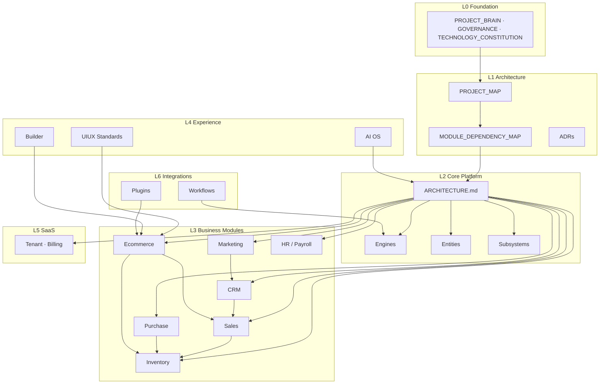
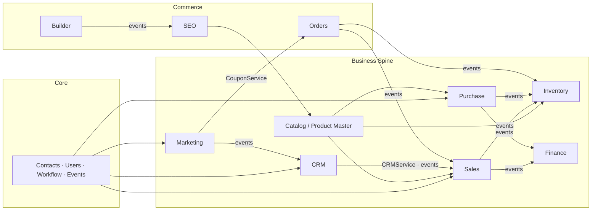

# AgainERP — Master Architecture Index

## Purpose
Index of all architecture documents by domain with dependency diagrams.

## When To Read
Read when doing architecture or cross-module design work.

## Related Files
- [Visual platform map](01-architecture/PROJECT_MAP.md)
- [Dependencies](01-architecture/MODULE_DEPENDENCY_MAP.md)

## Read Next
- [Core platform](02-core-platform/ARCHITECTURE.md)

---

> **Status:** Active  
> **Version:** 1.0  
> **Date:** 2026-06-19  
> **Step:** 05 — Master Architecture Index  
> **Purpose:** Central map of all architecture documents with cross-links and dependency graph  
> **Audience:** Architects · Developers · AI agents  
> **Related:** [MASTER_DOCUMENT_MAP.md](./MASTER_DOCUMENT_MAP.md) · [01-architecture/PROJECT_MAP.md](./01-architecture/PROJECT_MAP.md) · [01-architecture/MODULE_DEPENDENCY_MAP.md](./01-architecture/MODULE_DEPENDENCY_MAP.md)

---


## When To Read
Read when doing architecture or cross-module design work.

## Related Files
- [Visual platform map](01-architecture/PROJECT_MAP.md)
- [Dependencies](01-architecture/MODULE_DEPENDENCY_MAP.md)

## Read Next
- [Core platform](02-core-platform/ARCHITECTURE.md)

---

## How to Read This Index

| Need | Start Here |
|------|------------|
| First time on platform | [00-foundation/PROJECT_BRAIN.md](./00-foundation/PROJECT_BRAIN.md) |
| Visual platform map | [01-architecture/PROJECT_MAP.md](./01-architecture/PROJECT_MAP.md) |
| Module integration rules | [01-architecture/MODULE_DEPENDENCY_MAP.md](./01-architecture/MODULE_DEPENDENCY_MAP.md) |
| Module isolation audit | [architecture/MODULE_ISOLATION_REPORT.md](./architecture/MODULE_ISOLATION_REPORT.md) |
| Standard module doc format | [STANDARD_MODULE_TEMPLATE.md](./STANDARD_MODULE_TEMPLATE.md) |
| Core layer detail | [02-core-platform/ARCHITECTURE.md](./02-core-platform/ARCHITECTURE.md) |
| Database master schema | [05-development/database/MASTER_DATABASE_ARCHITECTURE.md](./05-development/database/MASTER_DATABASE_ARCHITECTURE.md) |

**Link convention:** Each entry lists **Related** documents — follow those for depth. This index does not duplicate content.

---

## Architecture Layer Stack

```text
┌─────────────────────────────────────────────────────────────────────────┐
│ L0  Foundation     Governance · Constitution · Module Framework          │
├─────────────────────────────────────────────────────────────────────────┤
│ L1  Architecture   Project Map · Dependency Map · ADRs · SaaS Blueprint  │
├─────────────────────────────────────────────────────────────────────────┤
│ L2  Core Platform  Users · RBAC · Contacts · Engines · Subsystems       │
├─────────────────────────────────────────────────────────────────────────┤
│ L3  Business       ERP · Commerce · Industry modules                    │
├─────────────────────────────────────────────────────────────────────────┤
│ L4  Experience     UIUX Standards · Builder · AI UX · Storefront         │
├─────────────────────────────────────────────────────────────────────────┤
│ L5  SaaS           Tenant · Billing · Hybrid · Control Plane             │
├─────────────────────────────────────────────────────────────────────────┤
│ L6  Integrations   Plugins · Workflows · External connectors             │
└─────────────────────────────────────────────────────────────────────────┘
                              All layers → docs/00-foundation/GOVERNANCE.md
```

---

## 1. Foundation Documents

Governance, constitution, and module framework — **read before any architecture work**.

| Document | Role | Related |
|----------|------|---------|
| [PROJECT_BRAIN.md](./00-foundation/PROJECT_BRAIN.md) | Mandatory first read — repo map, rules, UI patterns | [GOVERNANCE.md](./00-foundation/GOVERNANCE.md) · [PROJECT_MAP.md](./01-architecture/PROJECT_MAP.md) |
| [GOVERNANCE.md](./00-foundation/GOVERNANCE.md) | Documentation approval workflow | [PRE_CODE_GATE.md](./00-foundation/PRE_CODE_GATE.md) · [DOCUMENTATION_STANDARD.md](./00-foundation/standards/DOCUMENTATION_STANDARD.md) |
| [PROJECT_COMMON_RULES.md](./00-foundation/PROJECT_COMMON_RULES.md) | Universal module & SaaS rules | [UNIVERSAL_MODULE_FRAMEWORK.md](./00-foundation/UNIVERSAL_MODULE_FRAMEWORK.md) |
| [PRE_CODE_GATE.md](./00-foundation/PRE_CODE_GATE.md) | Mandatory gate before code | [TECHNOLOGY_CONSTITUTION.md](./00-foundation/TECHNOLOGY_CONSTITUTION.md) |
| [TECHNOLOGY_CONSTITUTION.md](./00-foundation/TECHNOLOGY_CONSTITUTION.md) | Official technology stack | [ADR_INDEX.md](00-foundation/traceability/ADR_INDEX.md) · [01-architecture/decisions/](./01-architecture/decisions/) |
| [PRD.md](./00-foundation/PRD.md) | Product requirements & vision | [01-architecture/project.md](./01-architecture/project.md) |
| [UNIVERSAL_MODULE_FRAMEWORK.md](./00-foundation/UNIVERSAL_MODULE_FRAMEWORK.md) | Module install/manifest framework | [MODULE_STRUCTURE.md](./00-foundation/MODULE_STRUCTURE.md) · [MASTER_MODULE_ARCHITECTURE.md](./01-architecture/MASTER_MODULE_ARCHITECTURE.md) |
| [MODULE_STRUCTURE.md](./00-foundation/MODULE_STRUCTURE.md) | Required module doc package (9 files) | [STANDARD_MODULE_TEMPLATE.md](./STANDARD_MODULE_TEMPLATE.md) |
| [STANDARD_MODULE_TEMPLATE.md](./STANDARD_MODULE_TEMPLATE.md) | 10-section Architecture.md standard | [architecture/MODULE_ISOLATION_REPORT.md](./architecture/MODULE_ISOLATION_REPORT.md) |
| [MASTER_DOCUMENT_MAP.md](./MASTER_DOCUMENT_MAP.md) | Full docs hierarchy navigation | This file |
| [MASTER_INDEX.md](./00-foundation/MASTER_INDEX.md) | Legacy complete doc catalog | [DOCUMENT_REGISTRY.md](./00-foundation/registries/DOCUMENT_REGISTRY.md) |
| [TRACEABILITY_MATRIX.md](./00-foundation/traceability/TRACEABILITY_MATRIX.md) | Requirements → docs traceability | [MODULE_REGISTRY.md](./00-foundation/registries/MODULE_REGISTRY.md) |
| [PROJECT_DOCUMENT_AUDIT.md](./00-foundation/standards/PROJECT_DOCUMENT_AUDIT.md) | Documentation structure audit | [MASTER_DOCUMENT_MAP.md](./MASTER_DOCUMENT_MAP.md) |

**Registries (architecture-relevant):**

| Registry | Related |
|----------|---------|
| [MODULE_REGISTRY.md](./00-foundation/registries/MODULE_REGISTRY.md) | [MODULE_DEPENDENCY_MAP.md](./01-architecture/MODULE_DEPENDENCY_MAP.md) |
| [SERVICE_REGISTRY.md](./00-foundation/registries/SERVICE_REGISTRY.md) | [02-core-platform/ARCHITECTURE.md](./02-core-platform/ARCHITECTURE.md) |
| [ENTITY_RELATIONSHIP_REGISTRY.md](./00-foundation/registries/ENTITY_RELATIONSHIP_REGISTRY.md) | [MASTER_DATABASE_ARCHITECTURE.md](./05-development/database/MASTER_DATABASE_ARCHITECTURE.md) |
| [DATABASE_REGISTRY.md](./00-foundation/registries/DATABASE_REGISTRY.md) | [ENTITY_RELATIONSHIP_REGISTRY.md](./00-foundation/registries/ENTITY_RELATIONSHIP_REGISTRY.md) |
| [API_REGISTRY.md](./00-foundation/registries/API_REGISTRY.md) | [05-development/api/architecture.md](./05-development/api/architecture.md) |
| [WORKFLOW_REGISTRY.md](./00-foundation/registries/WORKFLOW_REGISTRY.md) | [WORKFLOW_ENGINE_ARCHITECTURE.md](./02-core-platform/engines/WORKFLOW_ENGINE_ARCHITECTURE.md) |
| [AI_KNOWLEDGE_INDEX.md](./00-foundation/registries/AI_KNOWLEDGE_INDEX.md) | [06-ai/platform/ai/AI_OS_ARCHITECTURE.md](./06-ai/platform/ai/AI_OS_ARCHITECTURE.md) |

---

## 2. Architecture Documents

Platform-wide architecture, maps, and decisions.

| Document | Role | Related |
|----------|------|---------|
| [PROJECT_MAP.md](./01-architecture/PROJECT_MAP.md) | **Visual platform map** — layers, modules, entities | [MASTER_MODULE_ARCHITECTURE.md](./01-architecture/MASTER_MODULE_ARCHITECTURE.md) · [MODULE_DEPENDENCY_MAP.md](./01-architecture/MODULE_DEPENDENCY_MAP.md) |
| [MASTER_MODULE_ARCHITECTURE.md](./01-architecture/MASTER_MODULE_ARCHITECTURE.md) | Module layer blueprint & install model | [UNIVERSAL_MODULE_FRAMEWORK.md](./00-foundation/UNIVERSAL_MODULE_FRAMEWORK.md) · [02-core-platform/ARCHITECTURE.md](./02-core-platform/ARCHITECTURE.md) |
| [MODULE_DEPENDENCY_MAP.md](./01-architecture/MODULE_DEPENDENCY_MAP.md) | **Canonical dependency & service/event matrix** | [DependencyMap.md](./01-architecture/DependencyMap.md) · [architecture/MODULE_ISOLATION_REPORT.md](./architecture/MODULE_ISOLATION_REPORT.md) |
| [DependencyMap.md](./01-architecture/DependencyMap.md) | One-page dependency summary | [MODULE_DEPENDENCY_MAP.md](./01-architecture/MODULE_DEPENDENCY_MAP.md) |
| [SAAS_PLATFORM_ARCHITECTURE.md](./01-architecture/SAAS_PLATFORM_ARCHITECTURE.md) | SaaS platform architecture (top-level) | [07-saas/TENANT_ARCHITECTURE.md](./07-saas/TENANT_ARCHITECTURE.md) · [HYBRID_LICENSED_ERP_ARCHITECTURE.md](./01-architecture/HYBRID_LICENSED_ERP_ARCHITECTURE.md) |
| [HYBRID_LICENSED_ERP_ARCHITECTURE.md](./01-architecture/HYBRID_LICENSED_ERP_ARCHITECTURE.md) | Hybrid licensed deployment model | [07-saas/HYBRID_DEPLOYMENT.md](./07-saas/HYBRID_DEPLOYMENT.md) · [07-saas/LICENSE_AND_SYNC_AGENTS.md](./07-saas/LICENSE_AND_SYNC_AGENTS.md) |
| [project.md](./01-architecture/project.md) | Vision pointer → PRD | [PRD.md](./00-foundation/PRD.md) |
| [MODULE_ISOLATION_REPORT.md](./architecture/MODULE_ISOLATION_REPORT.md) | Module isolation validation (Step 03) | [MODULE_DEPENDENCY_MAP.md](./01-architecture/MODULE_DEPENDENCY_MAP.md) · [STANDARD_MODULE_TEMPLATE.md](./STANDARD_MODULE_TEMPLATE.md) |

### Architecture Decision Records (ADRs)

**Index:** [ADR_INDEX.md](00-foundation/traceability/ADR_INDEX.md)

| ADR | Title | Related Architecture |
|-----|-------|----------------------|
| [ADR-001](./01-architecture/decisions/ADR-001-postgresql.md) | PostgreSQL primary DB | [MASTER_DATABASE_ARCHITECTURE.md](./05-development/database/MASTER_DATABASE_ARCHITECTURE.md) |
| [ADR-004](./01-architecture/decisions/ADR-004-ai-os.md) | AI OS central layer | [06-ai/platform/ai/AI_OS_ARCHITECTURE.md](./06-ai/platform/ai/AI_OS_ARCHITECTURE.md) |
| [ADR-005](./01-architecture/decisions/ADR-005-multi-tenant.md) | Multi-tenant RLS | [07-saas/TENANT_ARCHITECTURE.md](./07-saas/TENANT_ARCHITECTURE.md) |
| [ADR-006](./01-architecture/decisions/ADR-006-event-driven.md) | Event-driven integration | [EVENT_ARCHITECTURE.md](./02-core-platform/engines/EVENT_ARCHITECTURE.md) |
| [ADR-007](./01-architecture/decisions/ADR-007-documentation-first.md) | Documentation-first | [GOVERNANCE.md](./00-foundation/GOVERNANCE.md) |
| [ADR-008](./01-architecture/decisions/ADR-008-unified-contacts.md) | Unified contacts | [contacts.md](./02-core-platform/entities/contacts.md) |
| [ADR-009](./01-architecture/decisions/ADR-009-universal-modules.md) | Universal modules | [UNIVERSAL_MODULE_FRAMEWORK.md](./00-foundation/UNIVERSAL_MODULE_FRAMEWORK.md) |
| [ADR-010](./01-architecture/decisions/ADR-010-no-cross-module-db.md) | No cross-module DB | [MODULE_ISOLATION_REPORT.md](./architecture/MODULE_ISOLATION_REPORT.md) |
| [ADR-011](./01-architecture/decisions/ADR-011-nextjs-typescript.md) | Next.js frontend | [TECHNOLOGY_CONSTITUTION.md](./00-foundation/TECHNOLOGY_CONSTITUTION.md) |
| [ADR-012](./01-architecture/decisions/ADR-012-fastapi-python.md) | FastAPI backend | [TECHNOLOGY_CONSTITUTION.md](./00-foundation/TECHNOLOGY_CONSTITUTION.md) |
| [ADR-013](./01-architecture/decisions/ADR-013-hybrid-licensed-erp.md) | Hybrid licensed ERP | [HYBRID_LICENSED_ERP_ARCHITECTURE.md](./01-architecture/HYBRID_LICENSED_ERP_ARCHITECTURE.md) |

**Database & API standards:**

| Document | Related |
|----------|---------|
| [MASTER_DATABASE_ARCHITECTURE.md](./05-development/database/MASTER_DATABASE_ARCHITECTURE.md) | [DATABASE_REGISTRY.md](./00-foundation/registries/DATABASE_REGISTRY.md) · [02-core-platform/ARCHITECTURE.md](./02-core-platform/ARCHITECTURE.md) |
| [architecture.md](./05-development/api/architecture.md) | [API_REGISTRY.md](./00-foundation/registries/API_REGISTRY.md) · [02-core-platform/API.md](./02-core-platform/API.md) |
| [05-development/framework/COMMUNICATION_CONTRACTS.md](./05-development/framework/COMMUNICATION_CONTRACTS.md) | [MODULE_DEPENDENCY_MAP.md](./01-architecture/MODULE_DEPENDENCY_MAP.md) |

---

## 3. Core Platform Documents

Shared foundation — **every business module depends on Core only** (not each other's DB).

### Core Hub

| Document | Role | Related |
|----------|------|---------|
| [ARCHITECTURE.md](./02-core-platform/ARCHITECTURE.md) | **Core framework hub** | [ModuleManifest.md](./02-core-platform/ModuleManifest.md) · [shared-entities.md](./02-core-platform/shared-entities.md) |
| [API.md](./02-core-platform/API.md) | Core API surface `/api/v1/core/` | [05-development/api/architecture.md](./05-development/api/architecture.md) |
| [PERMISSION_SYSTEM_ARCHITECTURE.md](./02-core-platform/PERMISSION_SYSTEM_ARCHITECTURE.md) | RBAC & field ACL | [entities/permissions.md](./02-core-platform/entities/permissions.md) · [entities/roles.md](./02-core-platform/entities/roles.md) |
| [shared-entities.md](./02-core-platform/shared-entities.md) | Cross-module entity index | [entities/](./02-core-platform/entities/) |

### Core Engines

| Engine | Document | Related Modules |
|--------|----------|-----------------|
| Events | [EVENT_ARCHITECTURE.md](./02-core-platform/engines/EVENT_ARCHITECTURE.md) · [event-system.md](./02-core-platform/engines/event-system.md) | All business modules |
| Workflow | [WORKFLOW_ENGINE_ARCHITECTURE.md](./02-core-platform/engines/WORKFLOW_ENGINE_ARCHITECTURE.md) · [workflow-engine.md](./02-core-platform/engines/workflow-engine.md) | Sales, Purchase, CRM, Inventory |
| Approval | [APPROVAL_ENGINE_ARCHITECTURE.md](./02-core-platform/engines/APPROVAL_ENGINE_ARCHITECTURE.md) · [approval-engine.md](./02-core-platform/engines/approval-engine.md) | Sales, Purchase, HR, Marketing |
| Notification | [NOTIFICATION_ENGINE_ARCHITECTURE.md](./02-core-platform/engines/NOTIFICATION_ENGINE_ARCHITECTURE.md) | Marketing, HR, Core |
| Search | [GLOBAL_SEARCH_ARCHITECTURE.md](./02-core-platform/engines/GLOBAL_SEARCH_ARCHITECTURE.md) · [search-engine.md](./02-core-platform/engines/search-engine.md) | CRM, Catalog, all modules |
| Queue | [queue-architecture.md](./02-core-platform/engines/queue-architecture.md) | Async jobs, Marketing sends |
| Cache | [cache-architecture.md](./02-core-platform/engines/cache-architecture.md) | Storefront, Inventory cache |

### Core Subsystems

| Subsystem | Document | Related |
|-----------|----------|---------|
| Activity & Chatter | [ACTIVITY_CHATTER_ARCHITECTURE.md](./02-core-platform/subsystems/ACTIVITY_CHATTER_ARCHITECTURE.md) | CRM · Sales · Purchase · Inventory · Marketing |
| Product Master | [PRODUCT_MASTER_ARCHITECTURE.md](./02-core-platform/subsystems/PRODUCT_MASTER_ARCHITECTURE.md) | Catalog · Inventory · Sales · Purchase · Manufacturing |
| Settings | [SETTINGS_ARCHITECTURE.md](./02-core-platform/subsystems/SETTINGS_ARCHITECTURE.md) | All modules · [07-saas/TENANT_ARCHITECTURE.md](./07-saas/TENANT_ARCHITECTURE.md) |

### Core Entities

| Entity | Document | Consumed By |
|--------|----------|-------------|
| [contacts.md](./02-core-platform/entities/contacts.md) | Unified parties | CRM, Sales, Purchase, HR, Marketing, Ecommerce |
| [users.md](./02-core-platform/entities/users.md) | Identity | All modules |
| [companies.md](./02-core-platform/entities/companies.md) · [branches.md](./02-core-platform/entities/branches.md) | Tenancy scope | All modules |
| [activities.md](./02-core-platform/entities/activities.md) · [comments.md](./02-core-platform/entities/comments.md) · [notes.md](./02-core-platform/entities/notes.md) | Collaboration | CRM, Sales, Project |
| [media-library.md](./02-core-platform/entities/media-library.md) · [attachments.md](./02-core-platform/entities/attachments.md) | Files | Catalog, Builder, Documents |
| [permissions.md](./02-core-platform/entities/permissions.md) · [roles.md](./02-core-platform/entities/roles.md) | RBAC | All modules |
| Full index | [entities/README.md](./02-core-platform/entities/README.md) | — |

---

## 4. Business Module Documents

Canonical architecture entry per module. **Enterprise docs** (`*_MODULE_ARCHITECTURE.md`) are authoritative until merged into `Architecture.md` per [STANDARD_MODULE_TEMPLATE.md](./STANDARD_MODULE_TEMPLATE.md).

### ERP & Finance

| Module | Canonical Architecture | Related | Depends On (services) |
|--------|------------------------|---------|------------------------|
| **CRM** | [CRM_MODULE_ARCHITECTURE.md](./03-business-modules/crm/CRM_MODULE_ARCHITECTURE.md) | [Sales](./03-business-modules/sales/SALES_MODULE_ARCHITECTURE.md) · [Marketing](./03-business-modules/marketing/MARKETING_MODULE_ARCHITECTURE.md) | Core · SalesService (history) · MarketingService |
| **Sales** | [SALES_MODULE_ARCHITECTURE.md](./03-business-modules/sales/SALES_MODULE_ARCHITECTURE.md) | [CRM](./03-business-modules/crm/CRM_MODULE_ARCHITECTURE.md) · [Inventory](./03-business-modules/inventory/INVENTORY_MODULE_ARCHITECTURE.md) · [Finance](./03-business-modules/finance/FINANCE_MODULE_ARCHITECTURE.md) | Core · Catalog · Inventory · CRM |
| **Purchase** | [PURCHASE_MODULE_ARCHITECTURE.md](./03-business-modules/purchase/PURCHASE_MODULE_ARCHITECTURE.md) | [Inventory](./03-business-modules/inventory/INVENTORY_MODULE_ARCHITECTURE.md) · [Finance](./03-business-modules/finance/FINANCE_MODULE_ARCHITECTURE.md) | Core · Catalog · Inventory |
| **Inventory** | [INVENTORY_MODULE_ARCHITECTURE.md](./03-business-modules/inventory/INVENTORY_MODULE_ARCHITECTURE.md) | [Product Master](./02-core-platform/subsystems/PRODUCT_MASTER_ARCHITECTURE.md) · [Sales](./03-business-modules/sales/SALES_MODULE_ARCHITECTURE.md) | Core · CatalogService |
| **Finance** | [FINANCE_MODULE_ARCHITECTURE.md](./03-business-modules/finance/FINANCE_MODULE_ARCHITECTURE.md) | [Sales](./03-business-modules/sales/SALES_MODULE_ARCHITECTURE.md) · [Purchase](./03-business-modules/purchase/PURCHASE_MODULE_ARCHITECTURE.md) | Core · Sales · Purchase · Inventory (events) |
| **Accounting** | [Architecture.md](./03-business-modules/accounting/Architecture.md) | [Finance](./03-business-modules/finance/FINANCE_MODULE_ARCHITECTURE.md) | Core |
| **Manufacturing** | [ARCHITECTURE.md](./03-business-modules/manufacturing/ARCHITECTURE.md) | [Inventory](./03-business-modules/inventory/INVENTORY_MODULE_ARCHITECTURE.md) · [Purchase](./03-business-modules/purchase/PURCHASE_MODULE_ARCHITECTURE.md) | Core · Inventory · Purchase · Sales |
| **POS** | [Architecture.md](./03-business-modules/pos/Architecture.md) | [Ecommerce orders](./03-business-modules/ecommerce/orders/ARCHITECTURE.md) · [Inventory](./03-business-modules/inventory/INVENTORY_MODULE_ARCHITECTURE.md) | Core · Catalog · Commerce · Inventory |

### HR & Workforce

| Module | Canonical Architecture | Related | Depends On |
|--------|------------------------|---------|------------|
| **HR & Payroll (master)** | [HR_PAYROLL_MASTER_ARCHITECTURE.md](./03-business-modules/hr-payroll/HR_PAYROLL_MASTER_ARCHITECTURE.md) | [HR](./03-business-modules/hr/Architecture.md) · [Payroll](./03-business-modules/payroll/Architecture.md) | Core |
| **HR** | [Architecture.md](./03-business-modules/hr/Architecture.md) | [HR_WORKFLOW_ARCHITECTURE.md](./03-business-modules/hr-payroll/HR_WORKFLOW_ARCHITECTURE.md) | Core · Payroll (events) |
| **Payroll** | [Architecture.md](./03-business-modules/payroll/Architecture.md) | [HR_DATABASE_ARCHITECTURE.md](./03-business-modules/hr-payroll/HR_DATABASE_ARCHITECTURE.md) | Core · HR (events) |
| **Timesheet** | [Architecture.md](./03-business-modules/timesheet/Architecture.md) | [Project](./03-business-modules/project/Architecture.md) · [HR](./03-business-modules/hr/Architecture.md) | Core · HR · Project |
| **Project** | [Architecture.md](./03-business-modules/project/Architecture.md) | [CRM](./03-business-modules/crm/CRM_MODULE_ARCHITECTURE.md) · [Sales](./03-business-modules/sales/SALES_MODULE_ARCHITECTURE.md) | Core · HR · Timesheet · Sales |

**HR deep-dive docs:** [HR_API_ARCHITECTURE.md](./03-business-modules/hr-payroll/HR_API_ARCHITECTURE.md) · [HR_DATABASE_ARCHITECTURE.md](./03-business-modules/hr-payroll/HR_DATABASE_ARCHITECTURE.md) · [HR_WORKFLOW_ARCHITECTURE.md](./03-business-modules/hr-payroll/HR_WORKFLOW_ARCHITECTURE.md) · [HR_AI_ASSISTANT_ARCHITECTURE.md](./03-business-modules/hr-payroll/HR_AI_ASSISTANT_ARCHITECTURE.md) · [uiux/](./03-business-modules/hr-payroll/uiux/)

### Marketing & Partners

| Module | Canonical Architecture | Related | Depends On |
|--------|------------------------|---------|------------|
| **Marketing** | [MARKETING_MODULE_ARCHITECTURE.md](./03-business-modules/marketing/MARKETING_MODULE_ARCHITECTURE.md) | [CRM](./03-business-modules/crm/CRM_MODULE_ARCHITECTURE.md) · [Ecommerce marketing (legacy)](./03-business-modules/ecommerce/marketing/ARCHITECTURE.md) | Core · Catalog · CRM |
| **Business Partners** | [Architecture.md](./03-business-modules/business-partners/Architecture.md) | [Purchase](./03-business-modules/purchase/PURCHASE_MODULE_ARCHITECTURE.md) · [Sales](./03-business-modules/sales/SALES_MODULE_ARCHITECTURE.md) | Core · Contacts |

### Commerce (Ecommerce)

| Module | Canonical Architecture | Related | Depends On |
|--------|------------------------|---------|------------|
| **Ecommerce (root)** | [Architecture.md](./03-business-modules/ecommerce/Architecture.md) | [ModuleManifest.md](./03-business-modules/ecommerce/ModuleManifest.md) | Core · Inventory · Sales · Marketing |
| **Storefront** | [ECOMMERCE_STOREFRONT_ARCHITECTURE.md](./03-business-modules/ecommerce/ECOMMERCE_STOREFRONT_ARCHITECTURE.md) | [Builder](./03-business-modules/ecommerce/builder/ARCHITECTURE.md) · [SEO](./03-business-modules/ecommerce/seo/ARCHITECTURE.md) | Core · Catalog · Orders |
| **Catalog** | [catalog/ARCHITECTURE.md](./03-business-modules/ecommerce/catalog/ARCHITECTURE.md) | [Product Master](./02-core-platform/subsystems/PRODUCT_MASTER_ARCHITECTURE.md) | Core · Inventory |
| **Orders** | [orders/ARCHITECTURE.md](./03-business-modules/ecommerce/orders/ARCHITECTURE.md) | [Sales](./03-business-modules/sales/SALES_MODULE_ARCHITECTURE.md) · [Inventory](./03-business-modules/inventory/INVENTORY_MODULE_ARCHITECTURE.md) | Core · Sales · Inventory |
| **Customers** | [customers/ARCHITECTURE.md](./03-business-modules/ecommerce/customers/ARCHITECTURE.md) | [contacts.md](./02-core-platform/entities/contacts.md) | Core |
| **Dashboard** | [dashboard/ARCHITECTURE.md](./03-business-modules/ecommerce/dashboard/ARCHITECTURE.md) | [analytics/ARCHITECTURE.md](./03-business-modules/ecommerce/analytics/ARCHITECTURE.md) | Core |
| **Ecommerce Inventory views** | [ecommerce/inventory/ARCHITECTURE.md](./03-business-modules/ecommerce/inventory/ARCHITECTURE.md) | [INVENTORY_MODULE_ARCHITECTURE.md](./03-business-modules/inventory/INVENTORY_MODULE_ARCHITECTURE.md) | InventoryService |
| **Media** | [media/ARCHITECTURE.md](./03-business-modules/ecommerce/media/ARCHITECTURE.md) | [media-library.md](./02-core-platform/entities/media-library.md) | Core |
| **Reviews** | [reviews/ARCHITECTURE.md](./03-business-modules/ecommerce/reviews/ARCHITECTURE.md) | [catalog/ARCHITECTURE.md](./03-business-modules/ecommerce/catalog/ARCHITECTURE.md) | Core · Catalog |
| **Reports** | [reports/ARCHITECTURE.md](./03-business-modules/ecommerce/reports/ARCHITECTURE.md) | [analytics/ARCHITECTURE.md](./03-business-modules/ecommerce/analytics/ARCHITECTURE.md) | Core |
| **URL Slugs** | [URL_SLUG_ARCHITECTURE.md](./03-business-modules/ecommerce/URL_SLUG_ARCHITECTURE.md) | [seo/ARCHITECTURE.md](./03-business-modules/ecommerce/seo/ARCHITECTURE.md) | SEO · Catalog |

→ **SEO** and **Builder** indexed in §7 and §8.

### Other Business Modules

| Module | Architecture | Related |
|--------|--------------|---------|
| **Product Configurator** | [Architecture.md](./03-business-modules/product-configurator/Architecture.md) | [Catalog](./03-business-modules/ecommerce/catalog/ARCHITECTURE.md) · [Inventory](./03-business-modules/inventory/INVENTORY_MODULE_ARCHITECTURE.md) |
| **Helpdesk** | [Architecture.md](./03-business-modules/helpdesk/Architecture.md) | [CRM](./03-business-modules/crm/CRM_MODULE_ARCHITECTURE.md) |
| **Documents** | [Architecture.md](./03-business-modules/documents/Architecture.md) | [Core attachments](./02-core-platform/entities/attachments.md) |
| **Knowledge** | [Architecture.md](./03-business-modules/knowledge/Architecture.md) | [Helpdesk](./03-business-modules/helpdesk/Architecture.md) |
| **Subscription** | [ARCHITECTURE.md](./03-business-modules/subscription/ARCHITECTURE.md) | [07-saas/](./07-saas/) |
| **Marketplace** | [ARCHITECTURE.md](./03-business-modules/marketplace/ARCHITECTURE.md) | [Ecommerce](./03-business-modules/ecommerce/Architecture.md) |
| **BI System** | [ARCHITECTURE.md](./03-business-modules/bi-system/ARCHITECTURE.md) | [Data Warehouse](./03-business-modules/data-warehouse/ARCHITECTURE.md) |
| **Data Warehouse** | [ARCHITECTURE.md](./03-business-modules/data-warehouse/ARCHITECTURE.md) | [BI System](./03-business-modules/bi-system/ARCHITECTURE.md) |
| **Fleet** | [ARCHITECTURE.md](./03-business-modules/fleet/ARCHITECTURE.md) | Core |
| **Logistics** | [ARCHITECTURE.md](./03-business-modules/logistics/ARCHITECTURE.md) | [Inventory](./03-business-modules/inventory/INVENTORY_MODULE_ARCHITECTURE.md) |
| **Booking** | [ARCHITECTURE.md](./03-business-modules/booking/ARCHITECTURE.md) | Core · CRM |

---

## 5. UIUX Documents

Global UI architecture standards — module screens link here from §8 UIUX sections.

| Document | Role | Related |
|----------|------|---------|
| [ENTERPRISE_UI_ARCHITECTURE.md](./04-uiux/standards/ENTERPRISE_UI_ARCHITECTURE.md) | Enterprise admin UI architecture | [layout-architecture.md](./04-uiux/standards/layout-architecture.md) · [page-architecture.md](./04-uiux/standards/page-architecture.md) |
| [layout-architecture.md](./04-uiux/standards/layout-architecture.md) | Admin shell, sidebar, drawer | [module-ui-standard.md](./04-uiux/standards/module-ui-standard.md) |
| [page-architecture.md](./04-uiux/standards/page-architecture.md) | List + Sheet drawer CRUD pattern | [STANDARD_MODULE_TEMPLATE.md](./STANDARD_MODULE_TEMPLATE.md) §8 |
| [module-ui-standard.md](./04-uiux/standards/module-ui-standard.md) | Per-module UI conventions | [04-uiux/prototype/](./04-uiux/prototype/) |
| [UI_UX_DESIGN_STANDARDS.md](./04-uiux/standards/UI_UX_DESIGN_STANDARDS.md) | Design standards | [design-system/](./04-uiux/design-system/) |
| [UX_SMART_INTERACTION_STANDARDS.md](./04-uiux/standards/UX_SMART_INTERACTION_STANDARDS.md) | Smart interactions | [command-palette.md](./04-uiux/standards/command-palette.md) |
| [mobile-first.md](./04-uiux/standards/mobile-first.md) | Mobile requirements | [PROJECT_COMMON_RULES.md](./00-foundation/PROJECT_COMMON_RULES.md) |
| [recharts-conventions.md](./04-uiux/standards/recharts-conventions.md) | Chart/tooltip conventions | [reports-ui.md](./04-uiux/standards/reports-ui.md) |

**Strategy & prototype:**

| Document | Related |
|----------|---------|
| [UI_PROTOTYPE_STRATEGY.md](./04-uiux/strategy/UI_PROTOTYPE_STRATEGY.md) | [04-uiux/prototype/README.md](./04-uiux/prototype/README.md) |
| [UI_PROTOTYPE_MODE.md](./04-uiux/strategy/UI_PROTOTYPE_MODE.md) | [PRE_CODE_GATE.md](./00-foundation/PRE_CODE_GATE.md) |
| [04-uiux/prototype/](./04-uiux/prototype/) (480+ build guides) | [03-business-modules/*/Menus/](./03-business-modules/ecommerce/Menus/) |
| [HR_DESIGN_SYSTEM_SPECIFICATION.md](./04-uiux/design-system/HR_DESIGN_SYSTEM_SPECIFICATION.md) | [hr-payroll/uiux/](./03-business-modules/hr-payroll/uiux/) |

**HR UI architecture (module-local):** [hr-payroll/uiux/](./03-business-modules/hr-payroll/uiux/) — ESS, payroll, attendance, leave, dashboard UI specs.

---

## 6. AI Documents

| Layer | Document | Related |
|-------|----------|---------|
| **Experience** | [06-ai/experience/README.md](./06-ai/experience/README.md) | [06-ai/platform/ai/AI_OS_ARCHITECTURE.md](./06-ai/platform/ai/AI_OS_ARCHITECTURE.md) |
| Vision | [01_AI_COMMERCE_OS_VISION.md](./06-ai/experience/01_AI_COMMERCE_OS_VISION.md) | [PROJECT_MAP.md](./01-architecture/PROJECT_MAP.md) |
| UX patterns | [02_AI_USER_EXPERIENCE.md](./06-ai/experience/02_AI_USER_EXPERIENCE.md) | [04-uiux/standards/ai-assistant-ui.md](./04-uiux/standards/ai-assistant-ui.md) |
| Admin AI | [03_AI_ADMIN_EXPERIENCE.md](./06-ai/experience/03_AI_ADMIN_EXPERIENCE.md) | [04-uiux/prototype/ai-os/](./04-uiux/prototype/ai-os/) |
| Storefront AI | [04_AI_STOREFRONT_EXPERIENCE.md](./06-ai/experience/04_AI_STOREFRONT_EXPERIENCE.md) | [ECOMMERCE_STOREFRONT_ARCHITECTURE.md](./03-business-modules/ecommerce/ECOMMERCE_STOREFRONT_ARCHITECTURE.md) |
| **Platform** | [AI_OS_ARCHITECTURE.md](./06-ai/platform/ai/AI_OS_ARCHITECTURE.md) | [AI_KNOWLEDGE_INDEX.md](./00-foundation/registries/AI_KNOWLEDGE_INDEX.md) |
| AI-first design | [AI_FIRST_ARCHITECTURE.md](./06-ai/platform/ai/AI_FIRST_ARCHITECTURE.md) | [ADR-004](./01-architecture/decisions/ADR-004-ai-os.md) |
| Context engine | [AI_CONTEXT_ENGINE.md](./06-ai/platform/ai/AI_CONTEXT_ENGINE.md) | [02-core-platform/ARCHITECTURE.md](./02-core-platform/ARCHITECTURE.md) |
| Audit & approval | [AI_AUDIT_AND_APPROVAL.md](./06-ai/platform/ai/AI_AUDIT_AND_APPROVAL.md) | [APPROVAL_ENGINE_ARCHITECTURE.md](./02-core-platform/engines/APPROVAL_ENGINE_ARCHITECTURE.md) |
| Digital twin | [AI_DIGITAL_TWIN.md](./06-ai/platform/ai/AI_DIGITAL_TWIN.md) | [CRM_MODULE_ARCHITECTURE.md](./03-business-modules/crm/CRM_MODULE_ARCHITECTURE.md) |
| Scaling | [AI_SCALING_ROADMAP.md](./06-ai/platform/ai/AI_SCALING_ROADMAP.md) | [07-saas/SCALING_ROADMAP.md](./07-saas/SCALING_ROADMAP.md) |

**Module AI sections:** See §9 in each enterprise module doc · template: [05-development/framework/templates/AI_TEMPLATE.md](./05-development/framework/templates/AI_TEMPLATE.md)

---

## 7. SaaS Documents

| Document | Role | Related |
|----------|------|---------|
| [07-saas/README.md](./07-saas/README.md) | SaaS docs entry | [SAAS_PLATFORM_ARCHITECTURE.md](./01-architecture/SAAS_PLATFORM_ARCHITECTURE.md) |
| [TENANT_ARCHITECTURE.md](./07-saas/TENANT_ARCHITECTURE.md) | Multi-tenant model | [ADR-005](./01-architecture/decisions/ADR-005-multi-tenant.md) · [SETTINGS_ARCHITECTURE.md](./02-core-platform/subsystems/SETTINGS_ARCHITECTURE.md) |
| [SAAS_ER_DIAGRAM.md](./07-saas/SAAS_ER_DIAGRAM.md) | SaaS ER diagram | [MASTER_DATABASE_ARCHITECTURE.md](./05-development/database/MASTER_DATABASE_ARCHITECTURE.md) |
| [CLOUD_CONTROL_PLANE.md](./07-saas/CLOUD_CONTROL_PLANE.md) | Control plane | [HYBRID_LICENSED_ERP_ARCHITECTURE.md](./01-architecture/HYBRID_LICENSED_ERP_ARCHITECTURE.md) |
| [HYBRID_DEPLOYMENT.md](./07-saas/HYBRID_DEPLOYMENT.md) | On-prem + cloud | [ADR-013](./01-architecture/decisions/ADR-013-hybrid-licensed-erp.md) |
| [LICENSE_AND_SYNC_AGENTS.md](./07-saas/LICENSE_AND_SYNC_AGENTS.md) | License sync | [HYBRID_LICENSED_ERP_ARCHITECTURE.md](./01-architecture/HYBRID_LICENSED_ERP_ARCHITECTURE.md) |
| [DATA_OWNERSHIP.md](./07-saas/DATA_OWNERSHIP.md) | Tenant data ownership | [TENANT_ARCHITECTURE.md](./07-saas/TENANT_ARCHITECTURE.md) |
| [SCALING_ROADMAP.md](./07-saas/SCALING_ROADMAP.md) | Scale path | [AI_SCALING_ROADMAP.md](./06-ai/platform/ai/AI_SCALING_ROADMAP.md) |
| [subscription/ARCHITECTURE.md](./03-business-modules/subscription/ARCHITECTURE.md) | Billing module | [07-saas/](./07-saas/) |

---

## 8. Builder Documents

Visual storefront composition — architecture + UI build guides.

| Document | Role | Related |
|----------|------|---------|
| [builder/ARCHITECTURE.md](./03-business-modules/ecommerce/builder/ARCHITECTURE.md) | **Builder module architecture** — pages, widgets, themes | [seo/ARCHITECTURE.md](./03-business-modules/ecommerce/seo/ARCHITECTURE.md) · [catalog/ARCHITECTURE.md](./03-business-modules/ecommerce/catalog/ARCHITECTURE.md) |
| [08-builder/prototype/](./08-builder/prototype/) | Builder UI build guides (13 builders) | [04-uiux/prototype/builder/](./04-uiux/prototype/) (if moved) · `Menus/Builder/` |
| [ThemeManager.md](./08-builder/prototype/ThemeManager.md) | Theme builder spec | [builder/ARCHITECTURE.md](./03-business-modules/ecommerce/builder/ARCHITECTURE.md) § Themes |
| [HomepageBuilder.md](./08-builder/prototype/HomepageBuilder.md) | Homepage builder | [ECOMMERCE_STOREFRONT_ARCHITECTURE.md](./03-business-modules/ecommerce/ECOMMERCE_STOREFRONT_ARCHITECTURE.md) |
| [CheckoutBuilder.md](./08-builder/prototype/CheckoutBuilder.md) | Checkout layout | [orders/ARCHITECTURE.md](./03-business-modules/ecommerce/orders/ARCHITECTURE.md) |
| [ProductPageBuilder.md](./08-builder/prototype/ProductPageBuilder.md) | PDP override | [catalog/ARCHITECTURE.md](./03-business-modules/ecommerce/catalog/ARCHITECTURE.md) |
| [seo/ARCHITECTURE.md](./03-business-modules/ecommerce/seo/ARCHITECTURE.md) | SEO control plane | [builder/ARCHITECTURE.md](./03-business-modules/ecommerce/builder/ARCHITECTURE.md) · [URL_SLUG_ARCHITECTURE.md](./03-business-modules/ecommerce/URL_SLUG_ARCHITECTURE.md) |

**Builder events:** `builder.page.published` → SEO sitemap · CDN purge (see builder ARCHITECTURE § System Events)

---

## 9. Integration Documents

Plugins, workflows, and external connectors.

| Document | Role | Related |
|----------|------|---------|
| [09-integrations/plugins/README.md](09-integrations/plugins/README.md) | Plugin framework | [UNIVERSAL_MODULE_FRAMEWORK.md](./00-foundation/UNIVERSAL_MODULE_FRAMEWORK.md) |
| [bank-emi/Architecture.md](09-integrations/plugins/bank-emi/Architecture.md) | Bank EMI plugin | [Ecommerce orders](./03-business-modules/ecommerce/orders/ARCHITECTURE.md) |
| [bank-emi/PLUGIN_MANIFEST.md](09-integrations/plugins/bank-emi/PLUGIN_MANIFEST.md) | Plugin manifest | [ModuleManifest.md](./02-core-platform/ModuleManifest.md) pattern |
| [09-integrations/workflows/README.md](./09-integrations/workflows/README.md) | Cross-module workflows | [WORKFLOW_REGISTRY.md](./00-foundation/registries/WORKFLOW_REGISTRY.md) · [WORKFLOW_ENGINE_ARCHITECTURE.md](./02-core-platform/engines/WORKFLOW_ENGINE_ARCHITECTURE.md) |
| [business-partners/INTEGRATION.md](./03-business-modules/business-partners/INTEGRATION.md) | Partner integration contracts | [MODULE_DEPENDENCY_MAP.md](./01-architecture/MODULE_DEPENDENCY_MAP.md) |
| [05-development/framework/COMMUNICATION_CONTRACTS.md](./05-development/framework/COMMUNICATION_CONTRACTS.md) | Service/event contracts | [MODULE_DEPENDENCY_MAP.md](./01-architecture/MODULE_DEPENDENCY_MAP.md) |

---

## 10. Dependency Map

### 10.1 Layer Dependency (Top-Down)



### 10.2 Business Module Service & Event Flow



**Golden rule:** No module JOINs another module's tables — [ADR-010](./01-architecture/decisions/ADR-010-no-cross-module-db.md) · [MODULE_ISOLATION_REPORT.md](./architecture/MODULE_ISOLATION_REPORT.md)

### 10.3 Module Dependency Table

| Module | Depends On (Core + Services) | Provides To | Key Events Published |
|--------|---------------------------|-------------|----------------------|
| **Core** | Platform | All modules | `core.*` |
| **Catalog** | Core | Sales, Purchase, Inventory, Marketing, Ecommerce | `catalog.product.*` |
| **CRM** | Core, ContactService | Sales, Marketing | `crm.lead.*`, `crm.opportunity.*` |
| **Sales** | Core, Catalog, Inventory, CRM | Finance, Inventory, Marketing | `sales.order.*`, `sales.invoice.*` |
| **Purchase** | Core, Catalog, Inventory | Inventory, Finance | `purchase.receipt.*`, `purchase.bill.*` |
| **Inventory** | Core, CatalogService | Sales, Purchase, POS, Ecommerce | `inventory.stock.*`, `inventory.movement.*` |
| **Finance** | Core | All (GL status) | `finance.journal.*`, `finance.payment.*` |
| **Marketing** | Core, Catalog, ContactService | CRM, Commerce | `marketing.campaign.*`, `marketing.coupon.*` |
| **Ecommerce/Orders** | Core, Sales, Inventory | Marketing (attribution) | `commerce.order.*` |
| **SEO** | Core, Catalog, Builder | Storefront | `seo.audit.*` |
| **Builder** | Core, Catalog, SEO, Media | Storefront, SEO | `builder.page.*` |
| **HR** | Core | Payroll, Project, Timesheet | `hr.employee.*`, `hr.leave.*` |
| **Payroll** | Core, HR (events) | Finance | `payroll.run.*` |
| **Project** | Core, HR, Timesheet | Sales | `project.milestone.*` |
| **Manufacturing** | Core, Catalog, Inventory, Purchase | Inventory, Sales | `manufacturing.work_order.*` |
| **POS** | Core, Catalog, Commerce, Inventory | Analytics | `pos.sale.*` |
| **AI OS** | Core (all modules via tools) | All modules | `ai.tool.*`, `ai.agent.*` |
| **SaaS/Platform** | Core | All tenants | `platform.tenant.*` |

**Full matrix:** [MODULE_DEPENDENCY_MAP.md](./01-architecture/MODULE_DEPENDENCY_MAP.md) · **Summary:** [DependencyMap.md](./01-architecture/DependencyMap.md)

### 10.4 Document Dependency Graph (Index Meta)

```text
MASTER_ARCHITECTURE_INDEX (this file)
    ├── 00-foundation/PROJECT_BRAIN.md
    ├── 01-architecture/PROJECT_MAP.md
    │       └── 01-architecture/MODULE_DEPENDENCY_MAP.md
    │               └── 03-business-modules/{module}/Architecture.md
    │                       ├── 02-core-platform/ARCHITECTURE.md
    │                       ├── 02-core-platform/subsystems/*
    │                       ├── 05-development/database/MASTER_DATABASE_ARCHITECTURE.md
    │                       └── 04-uiux/standards/* (UIUX §)
    ├── architecture/MODULE_ISOLATION_REPORT.md
    └── STANDARD_MODULE_TEMPLATE.md
```

---

## 11. Quick Lookup by Topic

| Topic | Primary Doc | Also See |
|-------|-------------|----------|
| Multi-tenant | [TENANT_ARCHITECTURE.md](./07-saas/TENANT_ARCHITECTURE.md) | [ADR-005](./01-architecture/decisions/ADR-005-multi-tenant.md) |
| Permissions | [PERMISSION_SYSTEM_ARCHITECTURE.md](./02-core-platform/PERMISSION_SYSTEM_ARCHITECTURE.md) | Module `Permissions.md` |
| Events | [EVENT_ARCHITECTURE.md](./02-core-platform/engines/EVENT_ARCHITECTURE.md) | [MODULE_DEPENDENCY_MAP.md](./01-architecture/MODULE_DEPENDENCY_MAP.md) |
| Workflow | [WORKFLOW_ENGINE_ARCHITECTURE.md](./02-core-platform/engines/WORKFLOW_ENGINE_ARCHITECTURE.md) | [WORKFLOW_REGISTRY.md](./00-foundation/registries/WORKFLOW_REGISTRY.md) |
| Contacts master | [contacts.md](./02-core-platform/entities/contacts.md) | [ADR-008](./01-architecture/decisions/ADR-008-unified-contacts.md) |
| Product master | [PRODUCT_MASTER_ARCHITECTURE.md](./02-core-platform/subsystems/PRODUCT_MASTER_ARCHITECTURE.md) | [catalog/ARCHITECTURE.md](./03-business-modules/ecommerce/catalog/ARCHITECTURE.md) |
| Stock truth | [INVENTORY_MODULE_ARCHITECTURE.md](./03-business-modules/inventory/INVENTORY_MODULE_ARCHITECTURE.md) | [MODULE_ISOLATION_REPORT.md](./architecture/MODULE_ISOLATION_REPORT.md) |
| Quote-to-cash | [SALES_MODULE_ARCHITECTURE.md](./03-business-modules/sales/SALES_MODULE_ARCHITECTURE.md) | [CRM](./03-business-modules/crm/CRM_MODULE_ARCHITECTURE.md) · [Finance](./03-business-modules/finance/FINANCE_MODULE_ARCHITECTURE.md) |
| Storefront | [ECOMMERCE_STOREFRONT_ARCHITECTURE.md](./03-business-modules/ecommerce/ECOMMERCE_STOREFRONT_ARCHITECTURE.md) | [Builder](./03-business-modules/ecommerce/builder/ARCHITECTURE.md) |
| AI tools | [AI_OS_ARCHITECTURE.md](./06-ai/platform/ai/AI_OS_ARCHITECTURE.md) | [AI_KNOWLEDGE_INDEX.md](./00-foundation/registries/AI_KNOWLEDGE_INDEX.md) |

---

## Change History

| Date | Version | Change |
|------|---------|--------|
| 2026-06-19 | 1.0 | Step 05 — initial master architecture index with dependency map |

---

**AgainERP Master Architecture Index** — every architecture document linked, every layer mapped.
