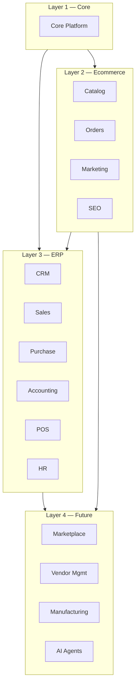
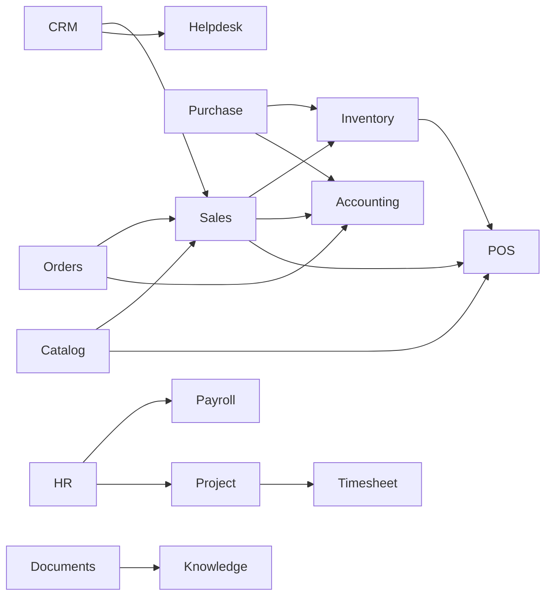
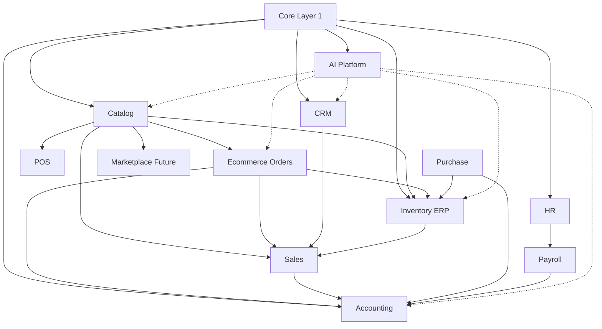
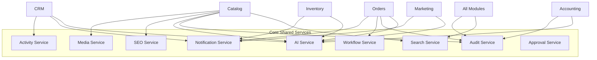
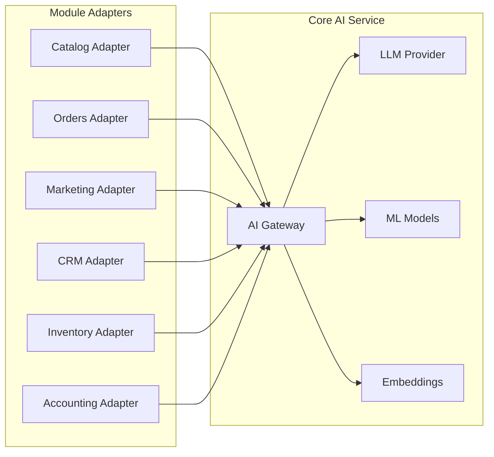

# AgainERP — Master Module Architecture

> **Status:** Draft  
> **Version:** 1.1  
> **Document Type:** Platform Blueprint  
> **Governance:** [GOVERNANCE.md](./GOVERNANCE.md) · **Standards:** [DEVELOPMENT_STANDARDS.md](./DEVELOPMENT_STANDARDS.md)  
> **Common rules:** [PROJECT_COMMON_RULES.md](./PROJECT_COMMON_RULES.md)  
> **Universal Framework:** [UNIVERSAL_MODULE_FRAMEWORK.md](./UNIVERSAL_MODULE_FRAMEWORK.md)

**No code. No migrations. No controllers.**  
This is the long-term enterprise blueprint for AgainERP module design.

---

## System Vision

**AgainERP** is a **universal modular platform** — ERP, Ecommerce, and unlimited industry verticals (Hospital, School, Hotel, …) on shared Core Services. Inspired by Odoo, Shopify, WooCommerce, ERPNext, and HubSpot — unified into one interconnected system.

**Canonical module rules:** [UNIVERSAL_MODULE_FRAMEWORK.md](./UNIVERSAL_MODULE_FRAMEWORK.md) — installable, removable, upgradeable; Services + Events + APIs + Workflows only; no cross-module database access.

| Principle | Description |
|-----------|-------------|
| Modular | Independent modules, shared core |
| Interconnected | Events + APIs, not duplicated data |
| Documentation-first | No code without approved docs |
| API-first | Frontend, mobile, AI, integrations use same APIs |
| Multi-tenant | Tenant → company → branch → warehouse from day one |
| SaaS platform | Subscriptions, billing, metering, white label — [SAAS_PLATFORM_ARCHITECTURE.md](./SAAS_PLATFORM_ARCHITECTURE.md) |
| Scale | 10k+ tenants, 1M+ products, 100+ modules |

**Operational rules:** [PROJECT_COMMON_RULES.md](./PROJECT_COMMON_RULES.md) — optional modules must not break others when disabled; drawer CRUD; mobile-first; plan → MD update.

**Phase 1 (active):** Ecommerce layer (Dashboard, Catalog, …)  
**Platform goal:** Add CRM, Inventory, Sales, Accounting, POS, HR, AI without redesign.

---

# Four-Layer Module Classification



---

# Layer 1 — Core Modules

Core modules are **shared by every layer**. No business module reimplements them.

```
Core
├── Users
├── Roles
├── Permissions
├── Companies
├── Branches
├── Contacts
├── Addresses
├── Activities
├── Notifications
├── Comments
├── Notes
├── Attachments
├── Audit Logs
├── Settings
├── Localization
├── Languages
├── Currencies
├── Taxes
├── Workflow Engine
├── Approval Engine
├── Search Engine
└── API Manager
```

## Core Module Reference

| Module | Owner Table(s) | Why Core | Doc |
|--------|----------------|----------|-----|
| **Users** | `users` | Single auth identity for ERP + storefront admin | [users.md](./core/entities/users.md) |
| **Roles** | `roles` | One RBAC model for all modules | [roles.md](./core/entities/roles.md) |
| **Permissions** | `permissions` | Central ACL registry | [permissions.md](./core/entities/permissions.md) |
| **Companies** | `companies` | Multi-tenant root | [companies.md](./core/entities/companies.md) |
| **Branches** | `branches` | Multi-location scope | [branches.md](./core/entities/branches.md) |
| **Contacts** | `contacts` | Unified customers, vendors, leads, employees | [contacts.md](./core/entities/contacts.md) |
| **Addresses** | `addresses` | Polymorphic locations — no per-module address tables | [addresses.md](./core/entities/addresses.md) |
| **Activities** | `activities` | Scheduled tasks, calls, follow-ups | [activities.md](./core/entities/activities.md) |
| **Notifications** | `notifications` | Event-driven alerts all modules | planned |
| **Comments** | `comments` | Threaded discussion on any record | [comments.md](./core/entities/comments.md) |
| **Notes** | `notes` | Internal staff notes | [notes.md](./core/entities/notes.md) |
| **Attachments** | `attachments` + `media` | Files linked to any record | [attachments.md](./core/entities/attachments.md) |
| **Audit Logs** | `activity_logs` | Immutable create/edit/delete/login trail | [DEVELOPMENT_STANDARDS §4](./DEVELOPMENT_STANDARDS.md) |
| **Settings** | `core_settings` | Key-value platform config | planned |
| **Localization** | `locales`, formats | Date, number, address formats | planned |
| **Languages** | `languages`, translations infra | i18n framework | planned |
| **Currencies** | `currencies`, `exchange_rates` | Multi-currency | planned |
| **Taxes** | `tax_classes`, `tax_rules` | Tax calculation engine | planned |
| **Workflow Engine** | `workflows`, `workflow_states` | State machines | planned |
| **Approval Engine** | `approvals`, `approval_steps` | Multi-step approvals | planned |
| **Search Engine** | `search_indexes`, synonyms | Global + module search | planned |
| **API Manager** | `api_keys`, `webhooks` | Keys, OAuth, webhooks | [api/architecture.md](./api/architecture.md) |

### Core Rule

> If two modules need the same entity → it belongs in Core.  
> See [core/shared-entities.md](./core/shared-entities.md).

**Full Core architecture:** [core/ARCHITECTURE.md](./core/ARCHITECTURE.md) — 26 submodules, RBAC, events, workflow, SaaS.

---

# Layer 2 — Ecommerce Modules

Ecommerce is the **online commerce domain layer** — storefront operations, merchandising, and commerce analytics. Product master data lives in **Catalog** (platform module, first consumed by Ecommerce).

```
Ecommerce
├── Dashboard      ← Command center KPIs, widgets
├── Catalog        ← Product master (platform spine)
├── Media          ← UI to Core media (product assets)
├── SEO            ← Meta, schema, sitemaps
├── Customers      ← UI to Core contacts (commerce context)
├── Orders         ← Cart, checkout, order management
├── Inventory      ← Stock UI + bridge to Inventory module
├── Marketing      ← Coupons, campaigns, loyalty
├── Builder        ← Theme, pages, storefront builder
├── Analytics      ← Commerce reports & dashboards
├── Support        ← Tickets, Q&A, reviews moderation
└── AI             ← Commerce AI tools (descriptions, forecasts)
```

## Responsibilities & Dependencies

| Submodule | Responsibility | Depends On | Provides To |
|-----------|----------------|------------|-------------|
| **Dashboard** | KPIs, alerts, recent orders | Core, Catalog, Orders, Inventory, Analytics | All ecommerce roles |
| **Catalog** | Products, categories, brands, variants, pricing | Core, Inventory (mapping) | Orders, POS, Sales, Marketplace |
| **Media** | Product/store asset management UI | Core Media | Catalog, Builder, Marketing |
| **SEO** | URLs, meta, schema, audits | Catalog, Website | Storefront, Search engines |
| **Customers** | Customer profiles, groups, wallet | Core Contacts | Orders, Marketing, CRM |
| **Orders** | Carts, checkout, fulfillment status | Catalog, Customers, Inventory | Sales, Accounting |
| **Inventory** | Stock views, alerts (commerce lens) | Inventory module, Catalog | Dashboard, Orders |
| **Marketing** | Promotions, email, abandoned cart | Customers, Catalog, Orders | Analytics |
| **Builder** | Storefront layout, themes | Core Media, Catalog | Website, SEO |
| **Analytics** | Sales/product/customer reports | Orders, Catalog, Core Analytics | Dashboard |
| **Support** | Reviews, Q&A, tickets | Orders, Catalog, Helpdesk | Customers |
| **AI** | Product SEO, forecasts, recommendations | Core AI, Catalog, Orders | All ecommerce submodules |

**Architecture docs:** [dashboard/ARCHITECTURE.md](./modules/ecommerce/dashboard/ARCHITECTURE.md) · [catalog/ARCHITECTURE.md](./modules/ecommerce/catalog/ARCHITECTURE.md)

---

# Layer 3 — ERP Modules

```
ERP
├── CRM
├── Sales
├── Purchase
├── Accounting
├── POS
├── HR
├── Payroll
├── Project
├── Timesheet
├── Helpdesk
├── Documents
└── Knowledge
```

## Module Relationships



| Module | Owns | Depends On | Key Integration |
|--------|------|------------|-----------------|
| **CRM** | Leads, opportunities, pipeline | Core, Contacts | → Sales conversion |
| **Sales** | Quotations, sales orders, invoices | CRM, Catalog, Inventory | ← Ecommerce orders |
| **Purchase** | RFQ, PO, vendor bills | Inventory, Contacts (vendor) | → Inventory receipts |
| **Accounting** | COA, journals, payments | Core, Taxes | ← Sales, Purchase, Orders |
| **POS** | Sessions, receipts, cash | Sales, Catalog, Inventory | Real-time stock |
| **HR** | Employees, attendance, leave | Core, Contacts | → Payroll, Project |
| **Payroll** | Salary, payslips | HR, Accounting | Journal entries |
| **Project** | Projects, tasks, milestones | HR, Sales | Billable hours |
| **Timesheet** | Time entries | Project, HR | Payroll, invoicing |
| **Helpdesk** | Tickets, SLA | CRM, Contacts | ↔ Support (Ecommerce) |
| **Documents** | Document library | Core Attachments | All modules |
| **Knowledge** | KB articles | Documents | Helpdesk, Support |

---

# Layer 4 — Future Modules

```
Future
├── Marketplace        ← Multi-vendor, vendor payouts
├── Vendor Management  ← Vendor onboarding, scorecards
├── Franchise Management
├── Subscription Management
├── Booking            ← Appointments, rentals
├── Manufacturing      ← BOM, work orders
├── Logistics          ← Shipping, carriers, tracking
├── Fleet              ← Vehicles, routes
└── AI Agents          ← Autonomous cross-module agents
```

## Expansion Strategy

| Strategy | Rule |
|----------|------|
| **No redesign** | New module = new `docs/modules/{name}/` + `ModuleManifest` + events |
| **Core first** | Never duplicate Users, Contacts, Media, Audit |
| **Catalog spine** | All sellable items reference `catalog_products` |
| **Event bus** | Modules subscribe to domain events — no circular imports |
| **API surface** | Every module exposes `/api/v1/{module}/` |
| **Feature flags** | Enable modules per company plan (SaaS) |
| **Documentation** | Full docs **Ready** before code |

Future modules plug into existing dependency graph — they do not fork the platform.

---

# Module Dependency Map

## Primary Flow (Commerce → Finance)

```
Core
  ↓
Catalog (products, prices, SEO metadata)
  ↓
Inventory (stock levels, warehouses, movements)
  ↓
Orders (carts, checkout, ecommerce orders)
  ↓
Sales (sales orders, quotations — unified order model)
  ↓
Accounting (invoices, payments, reconciliation)
```

## Full Dependency Graph



## Dependency Rules

| Rule | Description |
|------|-------------|
| **Downstream only data flow** | Catalog never reads Orders tables directly — uses events/APIs |
| **Single owner** | One module owns each table (see Database Ownership) |
| **Core is acyclic root** | Nothing depends below Core |
| **No circular module deps** | Use events to break cycles |

Detailed map: [MODULE_DEPENDENCY_MAP.md](./MODULE_DEPENDENCY_MAP.md) · [DependencyMap.md](./DependencyMap.md)

---

# Module Folder Structure

## Documentation (per module)

```
docs/modules/{module-name}/
├── Architecture.md          # Boundaries, integrations, decisions
├── Database.md              # Schema owned by this module
├── API.md                   # Endpoints, contracts
├── Workflow.md              # State machines, automations
├── Permissions.md           # ACL matrix
├── UI.md                    # Navigation, layout patterns
├── Reports.md               # Reports & exports owned by module
├── Development.md           # Setup, conventions, testing
├── Roadmap.md               # Phases, milestones
├── ModuleManifest.md        # Index (required)
├── CHANGELOG.md             # Module-level changes
├── MENU_STRUCTURE.md        # Optional — if large menu tree
└── Menus/                   # One .md per screen
    └── {MenuGroup}/
        └── {Screen Name}.md
```

## Sub-domain architecture (large modules)

```
docs/modules/ecommerce/
├── dashboard/ARCHITECTURE.md
├── catalog/ARCHITECTURE.md
└── ...
```

## Application code (future — not in scope)

```
app/Modules/{ModuleName}/
├── Services/
├── Repositories/
├── Events/
├── Http/Controllers/
└── ...
```

Standard: [MODULE_STRUCTURE.md](./MODULE_STRUCTURE.md)

---

# Module Manifest Standard

Every module **must** contain `ModuleManifest.md`.

| Field | Required | Description |
|-------|----------|-------------|
| **Module Name** | Yes | Official name |
| **Version** | Yes | Semver or doc version |
| **Owner** | Yes | Team / domain owner |
| **Dependencies** | Yes | Modules + Core services |
| **Menus** | Yes | Menu groups + screen count |
| **Pages** | Yes | Screen index or count |
| **Database Tables** | Yes | Tables this module owns |
| **API Endpoints** | Yes | Base path + key endpoints |
| **Permissions** | Yes | Permission key prefix |
| **Workflows** | Yes | Named workflows |
| **Reports** | Yes | Reports provided |
| **Last Updated** | Yes | ISO date |

Template: [_MODULE_MANIFEST_TEMPLATE.md](./_MODULE_MANIFEST_TEMPLATE.md)

---

# Shared Services Architecture

Reusable platform services — implemented once in Core, consumed by all modules.



| Service | Responsibility | Consumers |
|---------|----------------|-----------|
| **Activity Service** | Schedule tasks, timeline | CRM, Orders, HR, Project, Helpdesk |
| **Notification Service** | In-app, email, SMS, push | All modules |
| **Media Service** | Upload, version, CDN URL | Catalog, Builder, HR, Documents |
| **SEO Service** | Meta, schema, sitemap generation | Catalog, Website, SEO module |
| **Audit Service** | `activity_logs` write/read | All modules (automatic on mutations) |
| **Search Service** | Index, query, autocomplete | Catalog, CRM, Orders, Helpdesk |
| **AI Service** | LLM gateway, embeddings, agents | Catalog, Marketing, CRM, Inventory, Accounting |
| **Workflow Service** | State transitions, automations | Orders, Catalog approval, Purchase, HR |
| **Approval Service** | Multi-step approve/reject | Catalog, Purchase, HR expenses |

### Service Access Rule

Modules call services via **defined interfaces** — never direct table access across module boundaries.

---

# Cross-Module Communication

Three complementary patterns:

| Pattern | Use When | Example |
|---------|----------|---------|
| **Synchronous API** | Need immediate response | Order checks stock |
| **Service layer** | Same-process business logic | Catalog calls Media Service |
| **Event-driven** | Loose coupling, side effects | `OrderPlaced` → Accounting |

## Domain Events (Event Bus)

| Event | Publisher | Subscribers | Payload |
|-------|-----------|-------------|---------|
| **ProductCreated** | Catalog | Search, SEO, Analytics | `product_id`, `company_id` |
| **ProductPublished** | Catalog | Website, Marketplace, Search | `product_id` |
| **StockUpdated** | Inventory | Catalog (display qty), Dashboard, AI | `variant_id`, `qty` |
| **OrderPlaced** | Orders | Sales, Inventory, Accounting, Marketing, Notifications | `order_id` |
| **CustomerRegistered** | Core/Customers | CRM, Marketing, Notifications | `contact_id` |
| **ReviewSubmitted** | Catalog/Support | Notifications, AI, SEO schema | `review_id` |
| **PaymentReceived** | Accounting | Orders, Notifications | `payment_id` |
| **LeadConverted** | CRM | Sales, Notifications | `lead_id` |

## Event Flow Examples

### Product Created

```
Catalog Service → saves catalog_products
               → Audit Service.log(create)
               → emits ProductCreated
Search Service  → indexes product (async)
SEO Service     → queue sitemap rebuild (async)
```

### Stock Updated

```
Inventory Service → updates stock level
                 → emits StockUpdated
Catalog Service   → refresh cached qty (listener)
Dashboard         → invalidate inventory widget cache
Notification      → low stock alert if threshold breached
```

### Order Placed

```
Orders Service    → creates order, reserves stock
                 → emits OrderPlaced
Sales Module      → creates/updates sales order
Inventory         → confirms reservation
Accounting        → queue invoice draft (async)
Marketing         → cancel abandoned cart sequence
Notifications     → alert store admin
AI Service        → fraud score (async)
```

### Customer Registered

```
Core Auth/Contacts → creates contact
                  → emits CustomerRegistered
CRM               → create lead/account
Marketing         → welcome email workflow
```

### Review Submitted

```
Catalog/Support → saves review (pending)
               → emits ReviewSubmitted
Notifications   → notify moderators
AI Service      → generate summary (async, on approve)
SEO Service     → update aggregate rating schema
```

## Communication Prohibited

- Module A reading Module B's tables directly
- Duplicating contact/product/order records
- Synchronous cross-module DB joins in application code

---

# Database Ownership Rules

**One module owns each table. Other modules reference by FK or UUID via API.**

| Domain | Owner Module | Key Tables | Others May |
|--------|--------------|------------|------------|
| Identity & access | Core | `users`, `roles`, `permissions` | FK reference only |
| Tenant | Core | `companies`, `branches` | FK reference only |
| Parties | Core | `contacts`, `addresses` | FK, polymorphic link |
| Product master | **Catalog** | `catalog_products`, `catalog_*` | Read via API; `inventory_item_id` FK on variant |
| Stock | **Inventory** | `inventory_items`, `inventory_stock_levels`, movements | Catalog maps variants; never stores qty |
| Commerce orders | **Orders** (Ecommerce) | `ecommerce_orders`, `ecommerce_carts` | Sales syncs; Accounting invoices |
| Sales documents | **Sales** | `sales_orders`, `sales_quotations` | Links to `contact_id`, catalog variant |
| Finance | **Accounting** | `accounts`, `journal_entries`, `payments` | Event-driven from Sales/Orders/Purchase |
| CRM pipeline | **CRM** | `crm_leads`, `crm_opportunities` | Uses `contact_id` from Core |
| Media | Core | `media`, `attachments` | Polymorphic attach only |
| Audit | Core | `activity_logs` | Append-only from all modules |
| Analytics | Core | `analytics_*` | Modules emit facts; Core aggregates |

### Conflict Prevention

1. **Manifest review** — new table must be declared in one module's `Database.md`
2. **PR checklist** — [_COMMIT_CHECKLIST.md](./_COMMIT_CHECKLIST.md)
3. **No `ecommerce_products`** — products live in `catalog_products` only
4. **No `module_customers`** — customers are Core `contacts`

---

# API Standards

Global standards: [api/architecture.md](./api/architecture.md)

| Standard | Rule |
|----------|------|
| **Base URL** | `/api/v1/{module}/` |
| **Versioning** | URL prefix; v2 parallel for breaking changes |
| **Auth** | Bearer token; `X-Company-Id` header required |
| **Permissions** | Every endpoint checks `{module}.{resource}.{action}` |
| **Errors** | `{ "errors": [{ "code", "message", "field" }] }` |
| **Success** | `{ "data": {}, "meta": {} }` |
| **Pagination** | `page`, `per_page`, `cursor` for large sets |
| **Idempotency** | `Idempotency-Key` header on POST (orders, payments) |
| **Rate limits** | Per company, per API key |
| **Public APIs** | `/api/v1/storefront/` — read-only, CDN cached |

---

# UI Standards

Global: [ui-ux/mobile-first.md](./ui-ux/mobile-first.md) · [DEVELOPMENT_STANDARDS.md](./DEVELOPMENT_STANDARDS.md)

| Element | Standard |
|---------|----------|
| **Sidebar** | Module groups (Dashboard, Catalog, …) — collapsible |
| **Navigation** | Breadcrumb: `Module → Group → Screen` |
| **Dashboard** | Widget grid, KPI row, lazy-loaded charts |
| **Forms** | Single column mobile; validation inline; sections/tabs |
| **Tables** | Sort, filter, pagination; mobile card view |
| **Filters** | Persist in URL query; saved filter presets |
| **Search** | Global top bar → Search Service |
| **Bulk actions** | Checkbox select + action dropdown; permission-gated |
| **Mobile** | Hamburger nav, 44px targets, bottom sheets |

Ecommerce UI map: [modules/ecommerce/UI.md](./modules/ecommerce/UI.md)

---

# Security Standards

| Control | Implementation |
|---------|----------------|
| **RBAC** | Core Roles + Permissions; module registers keys |
| **MFA** | Ready on `users.mfa_enabled`; required for admin roles |
| **Audit logs** | All mutations → `activity_logs` |
| **Data access** | `company_id` on every query; branch rules optional |
| **API security** | HTTPS, token expiry, scoped API keys |
| **Session** | Secure, HttpOnly cookies; rotation on privilege change |
| **CSRF / XSS / SQLi** | [DEVELOPMENT_STANDARDS §6](./DEVELOPMENT_STANDARDS.md) |
| **Field-level** | Sensitive fields (cost price) require extra permission |

---

# Performance Standards

| Technique | Application |
|-----------|-------------|
| **Caching** | Redis — widget, product, category tree TTLs |
| **Queue jobs** | Import, export, email, search index, AI |
| **Analytics tables** | `analytics_*` pre-aggregation — no live SUM on 1M rows |
| **Search engine** | Meilisearch/Elasticsearch for Catalog, global search |
| **CDN** | Storefront assets, product images |
| **Image optimization** | WebP, srcset on upload via Media Service |
| **Targets** | Page < 2s, API p95 < 500ms |

Details: [DEVELOPMENT_STANDARDS §2](./DEVELOPMENT_STANDARDS.md) · [catalog/ARCHITECTURE.md § Performance](./modules/ecommerce/catalog/ARCHITECTURE.md)

---

# AI Integration Blueprint

Core **AI Service** exposes a unified gateway. Modules provide **context adapters** — not separate AI stacks.



| Module | AI Use Cases | Data Access |
|--------|--------------|-------------|
| **Catalog** | Descriptions, SEO meta, tags, image alt | Product fields, attributes |
| **Orders** | Fraud detection, delivery ETA | Order patterns, address risk |
| **Marketing** | Campaign copy, segment suggestions | Customer segments, order history |
| **CRM** | Lead scoring, email drafts | Pipeline, activities |
| **Inventory** | Demand forecast, reorder points | Sales velocity, stock |
| **Accounting** | Report summaries, anomaly detection | Journal aggregates |
| **Dashboard** | Natural language queries | Analytics tables |
| **AI Agents (future)** | Cross-module autonomous tasks | Permission-scoped API tools |

### AI Rules

- AI never bypasses permissions
- PII minimized in prompts
- Human approval for publish actions
- All AI outputs auditable in `activity_logs`

---

# Deliverables Index

| # | Deliverable | Location |
|---|-------------|----------|
| 1 | Complete Module Architecture | **This document** |
| 2 | Dependency Map | [DependencyMap.md](./DependencyMap.md) |
| 3 | Folder Structure | [MODULE_STRUCTURE.md](./MODULE_STRUCTURE.md) |
| 4 | Shared Services | § Shared Services (above) |
| 5 | Cross-Module Communication | § Cross-Module Communication (above) |
| 6 | Database Ownership | § Database Ownership Rules (above) |
| 7 | API Standards | [api/architecture.md](./api/architecture.md) |
| 8 | Security Standards | § Security + [DEVELOPMENT_STANDARDS.md](./DEVELOPMENT_STANDARDS.md) |
| 9 | Performance Standards | § Performance + [DEVELOPMENT_STANDARDS.md](./DEVELOPMENT_STANDARDS.md) |
| 10 | AI Integration Blueprint | § AI Integration (above) |

---

# Implementation Phases

| Phase | Modules | Status |
|-------|---------|--------|
| **0** | Core entities, governance, standards | Documentation active |
| **1** | Ecommerce (Dashboard, Catalog, Orders, …) | **Active** |
| **2** | Inventory, Sales | Planned |
| **3** | CRM, Purchase, Accounting | Planned |
| **4** | POS, HR, Project, Helpdesk | Planned |
| **5** | Marketplace, Manufacturing, AI Agents | Future |

---

**Platform:** AgainERP  
**Last Updated:** 2026-06-12  
**Status:** Draft — platform blueprint for long-term ERP development
