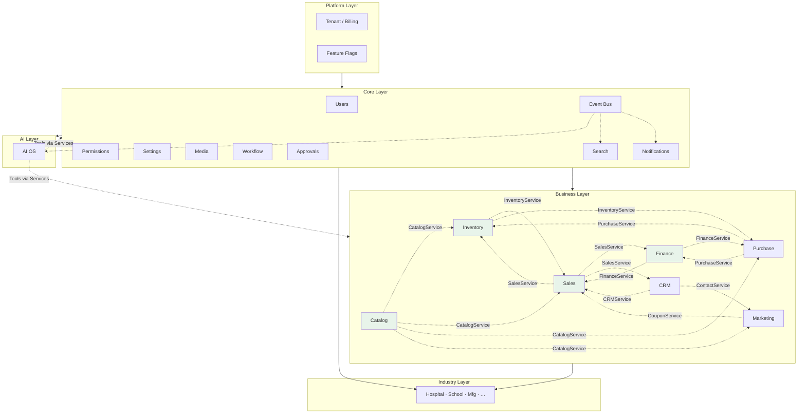

# AgainERP — Module Dependency Map

> **Status:** Approved  
> **Version:** 1.0  
> **Project:** AgainERP  
> **Document Type:** Enterprise Architecture  
> **Phase:** Documentation First  
> **Governance:** [GOVERNANCE.md](./GOVERNANCE.md) · **Standards:** [DEVELOPMENT_STANDARDS.md](./DEVELOPMENT_STANDARDS.md)

**No backend code. No database implementation.**  
This document is the **master dependency map** for AgainERP — the canonical reference for how modules relate, integrate, and communicate.

### Step 19 Requirements (Satisfied)

| Requirement | Section |
|-------------|---------|
| Master dependency map | §1 |
| No direct module-to-module dependency | §2 · §8 |
| Services and events only | §2 · per-module tables |
| Platform through AI layer deps | §3–§7 |
| 17 modules with 6 integration fields each | §3–§7 |
| Diagram, hierarchy, rules, forbidden, future | §8–§12 |

**Related:** [DependencyMap.md](./DependencyMap.md) (summary) · [UNIVERSAL_MODULE_FRAMEWORK.md](./UNIVERSAL_MODULE_FRAMEWORK.md) · [framework/COMMUNICATION_CONTRACTS.md](./framework/COMMUNICATION_CONTRACTS.md) · [EVENT_ARCHITECTURE.md](./core/engines/EVENT_ARCHITECTURE.md) · [DATABASE_REGISTRY.md](./DATABASE_REGISTRY.md)

---

## Executive Summary

| Principle | Rule |
|-----------|------|
| **Core-first** | Every module depends on Core — never on another module's database |
| **Service sync** | Cross-module reads/writes via owning module's Service API |
| **Event async** | Cross-module notifications via domain events after COMMIT |
| **Single owner** | One module owns each table; others consume via FK to Core or services |
| **No circular DB** | Module A never JOINs Module B tables |
| **Registry updates** | New dependency → update this map + module `ModuleManifest.md` |

**Integration channels:** Services · Events · HTTP APIs · Core Workflow/Approval engines

---

## 1. Purpose

### Why a Master Dependency Map Exists

AgainERP is a **modular monolith platform** with 17+ first-class modules spanning Core engines, ERP business domains, industry verticals, and AI OS. Without a master map:

| Problem | Impact |
|---------|--------|
| Hidden coupling | Module imports another module's ORM models |
| Circular dependencies | Sales ↔ Inventory deadlock at build time |
| Duplicate integration paths | Same handoff via service AND direct SQL |
| Unknown event subscribers | Orphan handlers, missed index updates |
| AI bypassing APIs | Ungoverned cross-module writes |

This document answers:

- **What may each module depend on?**
- **How do modules hand off data?**
- **Which events connect domains?**
- **Which service contracts are public?**

### What This Document Is

| Is | Is Not |
|----|--------|
| Master dependency registry | Implementation code |
| Service + event contract index | SQL schema |
| Layer hierarchy definition | Module folder structure spec |
| Forbidden-pattern authority | Runtime dependency injector config |

### Audience

| Role | Use |
|------|-----|
| Architects | Validate new modules before approval |
| Module owners | Declare `depends_on`, `events`, `services` in manifest |
| AI agents | Locate integration points without inventing deps |
| Code reviewers | Reject cross-module DB access |

---

## 2. Dependency Philosophy

### The Golden Rule

> **No module should depend directly on another module.**  
> Modules communicate through **Services** (synchronous) and **Events** (asynchronous).

### Dependency Types

| Type | Allowed | Example |
|------|---------|---------|
| **Core dependency** | Always | Catalog → Users, Permissions |
| **Service dependency** | Yes — via public service API | Sales → `CatalogService.getVariant()` |
| **Event dependency** | Yes — subscribe only | Search ← `catalog.product.updated` |
| **Workflow/Approval** | Yes — via Core engines | Purchase → `ApprovalService.submit()` |
| **Database dependency** | **Never** | Sales JOIN `catalog_products` ❌ |
| **ORM import dependency** | **Never** | `use Catalog\Models\Product` ❌ |
| **Direct HTTP in sync request chain** | Avoid | 5 sequential internal HTTP calls ❌ |

### Integration Model

```text
Module A                          Module B
   │                                  │
   │  1. Service call (sync)          │
   ├─────────────────────────────────►│  CatalogService.getProduct(id)
   │                                  │
   │  2. Event publish (async)        │
   ├────────── event bus ────────────►│  sales.order.confirmed
   │                                  │
   │  3. Workflow (Core)              │
   ├──────── Workflow Engine ────────►│  transition: draft → confirmed
```

### Layer Stack

```text
┌─────────────────────────────────────────────────────────────┐
│  Industry Layer    Hospital · School · Restaurant · …       │
├─────────────────────────────────────────────────────────────┤
│  Business Layer    Catalog · Inventory · Sales · CRM · …    │
├─────────────────────────────────────────────────────────────┤
│  AI Layer          AI OS (tools via services only)          │
├─────────────────────────────────────────────────────────────┤
│  Core Layer        Users · Permissions · Workflow · …       │
├─────────────────────────────────────────────────────────────┤
│  Platform Layer    Tenants · Billing · Feature Flags · …    │
└─────────────────────────────────────────────────────────────┘
```

**Rule:** Upper layers depend downward only. Business modules never depend on Industry modules. AI OS depends on Core + registered module tools — never on module databases.

---

## 3. Platform Layer Dependencies

Platform services provide **tenant context, licensing, billing, and feature gating** to all upper layers.

### Platform Module Summary

| Module | Depends On | Provides To | Consumes From | Events Produced | Events Consumed | Services Used |
|--------|------------|-------------|---------------|-----------------|-----------------|----------------|
| **Platform (SaaS)** | Infrastructure (PostgreSQL, Redis) | All modules | — | `platform.tenant.provisioned`, `platform.plan.changed`, `platform.module.installed` | `platform.license.expired` | — |
| **License Agent** | Platform | Client runtime | Platform cloud | `platform.license.validated`, `platform.license.expired` | `platform.tenant.provisioned` | `PlatformService.getTenant`, `FeatureFlagService.isEnabled` |

### Platform Provides

| Capability | Consumers |
|------------|-----------|
| Tenant / company context | All modules via `company_id` session |
| Feature flags | Module install gating |
| Module install registry | Which business modules are active |
| Billing / subscription | Usage metering, AI credits |
| White-label config | Settings module |

### Platform Events

| Event | Subscribers |
|-------|-------------|
| `platform.tenant.provisioned` | Search (reindex), Settings (defaults), Users (admin seed) |
| `platform.module.installed` | Module bootstrap handlers |
| `platform.plan.changed` | Feature flags, AI credit limits |

**Deep dive:** [SAAS_PLATFORM_ARCHITECTURE.md](./SAAS_PLATFORM_ARCHITECTURE.md) · [HYBRID_LICENSED_ERP_ARCHITECTURE.md](./HYBRID_LICENSED_ERP_ARCHITECTURE.md)

---

## 4. Core Layer Dependencies

Core engines and shared services are the **mandatory foundation**. Business and Industry modules depend on Core — not on each other.

### Core Module Registry

| Module | Layer | Route Prefix | Table Prefix |
|--------|-------|--------------|--------------|
| Users | Core | `/api/v1/core/users/` | `users` |
| Permissions | Core | `/api/v1/core/permissions/` | `roles`, `permissions` |
| Settings | Core | `/api/v1/core/settings/` | `settings` |
| Media | Core | `/api/v1/core/media/` | `media_*` |
| Workflow | Core | `/api/v1/core/workflow/` | `workflow_*` |
| Approvals | Core | `/api/v1/core/approvals/` | `approval_*` |
| Notifications | Core | `/api/v1/core/notifications/` | `notification_*` |
| Search | Core | `/api/v1/core/search/` | `search_*` |

---

### Users

| Field | Value |
|-------|-------|
| **Depends On** | Platform (tenant context) |
| **Provides To** | All modules — identity, sessions, audit actor |
| **Consumes From** | Permissions (role assignment display) |
| **Events Produced** | `core.user.created`, `core.user.updated`, `core.user.deactivated`, `core.user.logged_in` |
| **Events Consumed** | `platform.tenant.provisioned` (seed admin) |
| **Services Used** | `PermissionService.listUserPermissions`, `SettingsService.get` |
| **Services Provided** | `UserService.get`, `UserService.list`, `AuthService.authenticate`, `SessionService` |

---

### Permissions

| Field | Value |
|-------|-------|
| **Depends On** | Users, Platform |
| **Provides To** | All modules — RBAC, field ACL, branch/warehouse scope |
| **Consumes From** | Users (subject), Settings (default roles) |
| **Events Produced** | `core.permission.granted`, `core.permission.revoked`, `core.role.updated` |
| **Events Consumed** | `core.user.created` (default role assignment) |
| **Services Used** | `UserService.get` |
| **Services Provided** | `PermissionService.check`, `PermissionService.list`, `RoleService.assign`, `ACLService.filterFields` |

**Deep dive:** [PERMISSION_SYSTEM_ARCHITECTURE.md](./core/PERMISSION_SYSTEM_ARCHITECTURE.md)

---

### Settings

| Field | Value |
|-------|-------|
| **Depends On** | Platform, Users, Permissions |
| **Provides To** | All modules — company/branch config, feature toggles, i18n defaults |
| **Consumes From** | Platform (plan limits, white-label) |
| **Events Produced** | `core.settings.updated`, `core.settings.company.updated` |
| **Events Consumed** | `platform.tenant.provisioned`, `platform.plan.changed` |
| **Services Used** | `PermissionService.check` (admin settings) |
| **Services Provided** | `SettingsService.get`, `SettingsService.set`, `ConfigService.resolve` (hierarchy: global → company → branch) |

---

### Media

| Field | Value |
|-------|-------|
| **Depends On** | Users, Permissions, Settings |
| **Provides To** | Catalog, Marketing, CRM, Finance, Documents, all modules with attachments |
| **Consumes From** | — |
| **Events Produced** | `core.media.uploaded`, `core.media.deleted`, `core.attachment.created`, `core.attachment.removed` |
| **Events Consumed** | `catalog.product.archived` (orphan cleanup job) |
| **Services Used** | `PermissionService.check`, `SettingsService.get` (storage limits) |
| **Services Provided** | `MediaService.upload`, `MediaService.getUrl`, `AttachmentService.attach`, `AttachmentService.list` |

---

### Workflow

| Field | Value |
|-------|-------|
| **Depends On** | Users, Permissions, Events (bus) |
| **Provides To** | Catalog, Purchase, Sales, Finance, CRM, all stateful entities |
| **Consumes From** | Module transition requests (via API) |
| **Events Produced** | `core.workflow.started`, `core.workflow.transitioned`, `core.workflow.completed`, `core.workflow.cancelled` |
| **Events Consumed** | Module-specific guard events (optional) |
| **Services Used** | `PermissionService.check`, `UserService.get` |
| **Services Provided** | `WorkflowService.start`, `WorkflowService.transition`, `WorkflowService.getState`, `WorkflowService.getHistory` |

**Deep dive:** [WORKFLOW_ENGINE_ARCHITECTURE.md](./core/engines/WORKFLOW_ENGINE_ARCHITECTURE.md)

---

### Approvals

| Field | Value |
|-------|-------|
| **Depends On** | Users, Permissions, Workflow, Notifications |
| **Provides To** | Catalog, Purchase, Sales, Finance, Inventory (adjustments) |
| **Consumes From** | Workflow (approval steps), Notifications (delivery) |
| **Events Produced** | `core.approval.requested`, `core.approval.approved`, `core.approval.rejected`, `core.approval.delegated`, `core.approval.escalated` |
| **Events Consumed** | `core.workflow.transitioned` (when step requires approval) |
| **Services Used** | `UserService.get`, `PermissionService.check`, `NotificationService.send`, `WorkflowService.transition` |
| **Services Provided** | `ApprovalService.submit`, `ApprovalService.approve`, `ApprovalService.reject`, `ApprovalService.getPending` |

**Deep dive:** [APPROVAL_ENGINE_ARCHITECTURE.md](./core/engines/APPROVAL_ENGINE_ARCHITECTURE.md)

---

### Notifications

| Field | Value |
|-------|-------|
| **Depends On** | Users, Settings, Events (bus) |
| **Provides To** | All modules — email, SMS, push, in-app, Slack, WhatsApp |
| **Consumes From** | All domain events (via notification rules) |
| **Events Produced** | `core.notification.sent`, `core.notification.delivered`, `core.notification.failed` |
| **Events Consumed** | `core.approval.requested`, `sales.order.confirmed`, `purchase.order.approved`, `crm.lead.assigned`, `*` (rule-matched) |
| **Services Used** | `UserService.get`, `SettingsService.get`, `ContactService.get` (recipient resolution) |
| **Services Provided** | `NotificationService.send`, `NotificationService.sendTemplate`, `NotificationService.markRead` |

**Deep dive:** [NOTIFICATION_ENGINE_ARCHITECTURE.md](./core/engines/NOTIFICATION_ENGINE_ARCHITECTURE.md)

---

### Search

| Field | Value |
|-------|-------|
| **Depends On** | Events (bus), Permissions, Users |
| **Provides To** | All modules — global bar, module list search, AI search |
| **Consumes From** | All indexed domain events |
| **Events Produced** | `search.reindex.requested`, `search.reindex.completed`, `search.query.logged` |
| **Events Consumed** | `catalog.product.*`, `sales.order.*`, `sales.invoice.*`, `purchase.order.*`, `crm.lead.*`, `marketing.campaign.*`, `finance.journal.*`, `core.contact.*`, `core.media.*`, `core.activity.*`, `inventory.stock_level.updated`, `core.user.updated` |
| **Services Used** | `PermissionService.check`, `PermissionService.filterIds` |
| **Services Provided** | `SearchService.search`, `SearchService.autocomplete`, `SearchService.suggest`, `SearchIndexService.upsert` (internal indexer) |

**Deep dive:** [GLOBAL_SEARCH_ARCHITECTURE.md](./core/engines/GLOBAL_SEARCH_ARCHITECTURE.md)

---

## 5. Business Layer Dependencies

Business modules implement **ERP and commerce domains**. Each depends on **Core only** (directly). Cross-business integration is **always** via Services or Events.

### Business Module Summary

| Module | Owns (Prefix) | Primary Role |
|--------|---------------|--------------|
| Catalog | `catalog_*` | Product master — SKU, variants, pricing, attributes |
| Inventory | `inventory_*` | Stock ledger, warehouses, movements |
| Purchase | `purchase_*` | RFQ, PO, vendor bills, receipts |
| Sales | `sales_*` | Quotations, SO, invoices, shipments |
| CRM | `crm_*` | Leads, opportunities, pipeline |
| Marketing | `marketing_*` | Campaigns, coupons, loyalty |
| Finance | `finance_*` | COA, journals, AR/AP, payments |

---

### Catalog

| Field | Value |
|-------|-------|
| **Depends On** | Core: Users, Permissions, Settings, Media, Workflow, Approvals, Search, Notifications |
| **Provides To** | Inventory, Purchase, Sales, Marketing, CRM, AI OS, Industry modules |
| **Consumes From** | Inventory (`InventoryService.getStockLevels` — display only, no DB) |
| **Events Produced** | `catalog.product.created`, `catalog.product.updated`, `catalog.product.submitted`, `catalog.product.published`, `catalog.product.archived`, `catalog.variant.price_changed`, `catalog.category.updated` |
| **Events Consumed** | `core.approval.approved` (publish gate), `core.approval.rejected` |
| **Services Used** | `MediaService`, `WorkflowService`, `ApprovalService`, `PermissionService`, `SettingsService`, `InventoryService.getStockLevels` |
| **Services Provided** | `CatalogService.getProduct`, `CatalogService.getVariant`, `CatalogService.searchProducts`, `CatalogService.getPrice`, `CatalogService.listCategories` |

**Integration note:** Catalog is the **product spine** — all sellable/stockable items reference `catalog_products` / `catalog_variants` via FK within owning module or Core bridge tables — never duplicated product tables in Sales or Inventory.

---

### Inventory

| Field | Value |
|-------|-------|
| **Depends On** | Core: Users, Permissions, Settings, Workflow, Approvals, Search, Notifications |
| **Provides To** | Catalog, Sales, Purchase, Marketing, Finance (valuation) |
| **Consumes From** | Catalog (`CatalogService.getVariant`), Purchase (`PurchaseService.getReceipt`), Sales (`SalesService.getOrderLines`) |
| **Events Produced** | `inventory.movement.posted`, `inventory.adjustment.posted`, `inventory.stock_level.updated`, `inventory.reservation.created`, `inventory.reservation.released`, `inventory.reorder.suggested` |
| **Events Consumed** | `catalog.product.published`, `catalog.variant.price_changed`, `purchase.receipt.posted`, `sales.order.confirmed`, `sales.shipment.shipped`, `sales.order.cancelled`, `core.approval.approved` (adjustments) |
| **Services Used** | `CatalogService.getVariant`, `PermissionService`, `WorkflowService`, `ApprovalService`, `NotificationService` |
| **Services Provided** | `InventoryService.getStock`, `InventoryService.reserve`, `InventoryService.release`, `InventoryService.adjust`, `InventoryService.getAvailability` |

---

### Purchase

| Field | Value |
|-------|-------|
| **Depends On** | Core: Users, Permissions, Settings, Contacts, Workflow, Approvals, Search, Notifications, Media |
| **Provides To** | Inventory (receipts), Finance (bills) |
| **Consumes From** | Catalog (`CatalogService.getVariant`), Inventory (`InventoryService.getStock`, reorder), Contacts (`ContactService.get` — vendors) |
| **Events Produced** | `purchase.rfq.sent`, `purchase.order.created`, `purchase.order.approved`, `purchase.receipt.posted`, `purchase.bill.posted`, `purchase.bill.paid` |
| **Events Consumed** | `inventory.reorder.suggested`, `core.approval.approved`, `core.approval.rejected`, `finance.payment.posted` |
| **Services Used** | `CatalogService`, `ContactService`, `InventoryService`, `WorkflowService`, `ApprovalService`, `MediaService`, `NotificationService` |
| **Services Provided** | `PurchaseService.getPO`, `PurchaseService.createPO`, `PurchaseService.postReceipt`, `PurchaseService.getBill` |

---

### Sales

| Field | Value |
|-------|-------|
| **Depends On** | Core: Users, Permissions, Settings, Contacts, Workflow, Approvals, Search, Notifications, Media |
| **Provides To** | Finance (invoices), Inventory (reservations/shipments), CRM (order history), Marketing (attribution) |
| **Consumes From** | Catalog (`CatalogService`), Inventory (`InventoryService`), CRM (`CRMService.getOpportunity`, `ContactService`) |
| **Events Produced** | `sales.quotation.sent`, `sales.order.confirmed`, `sales.order.cancelled`, `sales.shipment.shipped`, `sales.invoice.posted`, `sales.payment.received`, `sales.return.approved` |
| **Events Consumed** | `crm.lead.converted`, `crm.opportunity.won`, `commerce.order.placed`, `commerce.order.paid`, `inventory.stock_level.updated`, `core.approval.approved`, `marketing.coupon.applied` |
| **Services Used** | `CatalogService`, `InventoryService`, `ContactService`, `CRMService`, `WorkflowService`, `ApprovalService`, `NotificationService`, `MediaService` |
| **Services Provided** | `SalesService.getOrder`, `SalesService.createOrder`, `SalesService.confirmOrder`, `SalesService.postInvoice`, `SalesService.getOrderHistory` |

---

### CRM

| Field | Value |
|-------|-------|
| **Depends On** | Core: Users, Permissions, Settings, Contacts, Activities, Search, Notifications, Workflow |
| **Provides To** | Sales (conversion), Marketing (segments) |
| **Consumes From** | Sales (`SalesService.getOrderHistory`), Marketing (`MarketingService.getCampaignResponse`), Contacts (`ContactService`) |
| **Events Produced** | `crm.lead.created`, `crm.lead.assigned`, `crm.lead.converted`, `crm.opportunity.created`, `crm.opportunity.won`, `crm.opportunity.lost`, `crm.account.updated` |
| **Events Consumed** | `core.contact.created`, `commerce.order.paid`, `marketing.campaign.clicked`, `sales.order.confirmed` |
| **Services Used** | `ContactService`, `ActivityService`, `UserService`, `NotificationService`, `WorkflowService`, `SearchService` |
| **Services Provided** | `CRMService.getLead`, `CRMService.convertLead`, `CRMService.getOpportunity`, `CRMService.getPipeline` |

---

### Marketing

| Field | Value |
|-------|-------|
| **Depends On** | Core: Users, Permissions, Settings, Contacts, Media, Search, Notifications |
| **Provides To** | CRM (campaign responses), Sales (coupons/discounts), Commerce (promotions) |
| **Consumes From** | Catalog (`CatalogService` — product scope), CRM (`ContactService`, segments), Sales/Commerce (order events) |
| **Events Produced** | `marketing.campaign.started`, `marketing.campaign.sent`, `marketing.campaign.clicked`, `marketing.coupon.created`, `marketing.coupon.applied`, `marketing.loyalty.points_awarded` |
| **Events Consumed** | `catalog.product.published`, `crm.contact.updated`, `commerce.order.abandoned`, `commerce.order.placed`, `sales.order.confirmed` |
| **Services Used** | `CatalogService`, `ContactService`, `MediaService`, `NotificationService`, `SettingsService` |
| **Services Provided** | `MarketingService.getCampaign`, `CouponService.validate`, `CouponService.apply`, `MarketingService.getCampaignResponse` |

**Deep dive:** [MARKETING_MODULE_ARCHITECTURE.md](./modules/marketing/MARKETING_MODULE_ARCHITECTURE.md)

---

### Finance

| Field | Value |
|-------|-------|
| **Depends On** | Core: Users, Permissions, Settings, Contacts, Workflow, Approvals, Search, Notifications |
| **Provides To** | All modules requiring GL posting, AR/AP status |
| **Consumes From** | Sales (`SalesService.getInvoice`), Purchase (`PurchaseService.getBill`), Inventory (`InventoryService.getValuation` — service) |
| **Events Produced** | `finance.journal.posted`, `finance.invoice.posted`, `finance.invoice.paid`, `finance.payment.posted`, `finance.payment.received`, `finance.period.closed` |
| **Events Consumed** | `sales.invoice.posted`, `sales.payment.received`, `purchase.bill.posted`, `purchase.bill.paid`, `inventory.adjustment.posted`, `core.approval.approved` |
| **Services Used** | `ContactService`, `WorkflowService`, `ApprovalService`, `SettingsService`, `NotificationService` |
| **Services Provided** | `FinanceService.postJournal`, `FinanceService.getBalance`, `FinanceService.getAR`, `FinanceService.getAP`, `AccountingService.createEntry` |

**Deep dive:** [FINANCE_MODULE_ARCHITECTURE.md](./modules/finance/FINANCE_MODULE_ARCHITECTURE.md)

---

## 6. Industry Layer Dependencies

Industry modules are **installable verticals** (Hospital, School, Restaurant, Manufacturing, Marketplace, …) that plug into the Business Layer spine without forking Core.

### Industry Dependency Pattern

| Field | Pattern |
|-------|---------|
| **Depends On** | Core (all engines) + selected Business modules via **service manifest** |
| **Provides To** | Industry-specific UI, workflows, reports |
| **Consumes From** | Catalog, Sales, Inventory, Finance, CRM — via declared services only |
| **Events Produced** | `{industry}.{entity}.{action}` — e.g. `hospital.admission.admitted` |
| **Events Consumed** | Core + Business events per manifest subscription |
| **Services Used** | Declared in `ModuleManifest.md` — e.g. `CatalogService`, `FinanceService` |
| **Services Provided** | Industry-specific APIs at `/api/v1/{industry}/` |

### Example: Hospital Module

| Field | Value |
|-------|-------|
| **Depends On** | Core + CRM, Finance, Inventory (pharmacy), Catalog (medicines) |
| **Provides To** | Hospital admin UI, patient portal |
| **Consumes From** | `ContactService` (patients), `CatalogService` (medicines), `InventoryService`, `FinanceService` |
| **Events Produced** | `hospital.appointment.created`, `hospital.admission.admitted`, `hospital.discharge.completed` |
| **Events Consumed** | `core.contact.created`, `finance.invoice.paid`, `inventory.stock_level.updated` |
| **Services Used** | `ContactService`, `CatalogService`, `InventoryService`, `FinanceService`, `NotificationService` |
| **Services Provided** | `HospitalService.getAppointment`, `HospitalService.admitPatient` |

### Example: Manufacturing Module

| Field | Value |
|-------|-------|
| **Depends On** | Core + Catalog (BOM items), Inventory, Purchase |
| **Provides To** | MRP, work orders, shop floor |
| **Consumes From** | `CatalogService`, `InventoryService`, `PurchaseService` |
| **Events Produced** | `manufacturing.work_order.completed`, `manufacturing.bom.updated` |
| **Events Consumed** | `purchase.receipt.posted`, `inventory.movement.posted`, `catalog.product.updated` |
| **Services Used** | `CatalogService`, `InventoryService`, `PurchaseService`, `WorkflowService` |
| **Services Provided** | `ManufacturingService.createWorkOrder`, `ManufacturingService.consumeMaterials` |

### Industry Rules

1. Industry module **never** duplicates Core entities (users, contacts, media)
2. Industry module **declares** business service dependencies in manifest — not implicit
3. Industry events use **own prefix** — never overwrite business events
4. Feature flag gates install per tenant plan

**Deep dive:** [UNIVERSAL_MODULE_FRAMEWORK.md](./UNIVERSAL_MODULE_FRAMEWORK.md) · [MASTER_MODULE_ARCHITECTURE.md](./MASTER_MODULE_ARCHITECTURE.md)

---

## 7. AI Layer Dependencies

AI OS is a **platform service** that augments all modules through **registered tools and agents** — never through direct database access.

### AI OS

| Field | Value |
|-------|-------|
| **Depends On** | Core: Users, Permissions, Settings, Events, Notifications, Approvals (high-risk tools) |
| **Provides To** | All modules — agents, tools, NL search, summaries, forecasts |
| **Consumes From** | All modules via **Tool Registry** (service calls only) |
| **Events Produced** | `ai.agent.started`, `ai.agent.completed`, `ai.tool.invoked`, `ai.tool.approved`, `ai.tool.rejected`, `ai.credit.consumed` |
| **Events Consumed** | Domain events for context (read-only handlers), `core.approval.approved` (tool execution gate) |
| **Services Used** | `PermissionService.check`, `UserService.get`, `ApprovalService.submit`, `SearchService.search`, `NotificationService.send`, plus **module tools** via registry |
| **Services Provided** | `AIService.prompt`, `AIService.invokeTool`, `AIContextService.build`, `AISearchService.parseQuery` |

### AI ↔ Module Integration

```text
User → AI Agent → Tool Registry → CatalogService.generateDescription()
                                 → InventoryService.forecast()
                                 → SalesService.getPipeline()
```

| Rule | Detail |
|------|--------|
| **Tools call Services** | Never ORM across modules |
| **High-risk tools** | Require Approval Engine gate |
| **Audit** | Every invocation → `ai_audit_logs` |
| **Credits** | Platform billing meters usage |
| **Context** | Built from events + permitted service reads |

### AI Tool Dependencies (Examples)

| Tool | Module Service | Risk |
|------|----------------|------|
| `catalog.generate_description` | `CatalogService` | Low |
| `inventory.forecast` | `InventoryService` | Medium |
| `sales.create_quotation` | `SalesService` | High → Approval |
| `finance.post_journal` | `FinanceService` | High → Approval |

**Deep dive:** [AI_OS_ARCHITECTURE.md](./modules/ai/AI_OS_ARCHITECTURE.md)

---

## 8. Dependency Diagram

### Full Platform Diagram



**Legend:** Solid arrows = layer dependency (allowed). Dotted arrows = service/event integration (allowed). No arrow = direct DB access (forbidden).

### Primary Business Flow

```text
Catalog ──service──► Sales ──event──► Inventory
   │                    │                  │
   │                    ├──event──► Finance
   │                    │
   └──service──► Marketing ──event──► CRM
Purchase ──event──► Inventory ──event──► Finance
```

### Event Bus Fan-Out

```text
catalog.product.published
  ├─→ Search (index)
  ├─→ Marketing (campaign eligibility)
  ├─→ Inventory (variant mapping)
  └─→ Notifications (subscribers)

sales.order.confirmed
  ├─→ Inventory (reserve stock)
  ├─→ Finance (accrual hook)
  ├─→ CRM (activity log)
  ├─→ Search (index)
  └─→ Notifications (confirmation email)
```

---

## 9. Module Hierarchy

### Canonical Layer Order

| Level | Name | Modules | Depends On |
|-------|------|---------|------------|
| L0 | Infrastructure | PostgreSQL, Redis, Object Storage | — |
| L1 | Platform | Tenant, Billing, License, Feature Flags | L0 |
| L2 | Core Engines | Users, Permissions, Settings, Media, Workflow, Approvals, Notifications, Search, Event Bus | L1 |
| L3 | Business | Catalog, Inventory, Purchase, Sales, CRM, Marketing, Finance | L2 |
| L4 | Industry | Hospital, School, Manufacturing, Marketplace, … | L2 + L3 (manifest) |
| L5 | AI | AI OS | L2 + L3/L4 (tools) |

### Module Classification

| Class | Modules | Install |
|-------|---------|---------|
| **Mandatory** | Users, Permissions, Settings, Event Bus | Always |
| **Core Engine** | Workflow, Approvals, Notifications, Search, Media | Always (feature-configurable) |
| **Business** | Catalog, Inventory, Purchase, Sales, CRM, Marketing, Finance | Per plan / tenant |
| **Industry** | Vertical modules | Optional add-on |
| **AI** | AI OS | Platform tier |

### Dependency Depth Rule

> A module at level **N** may call services and subscribe to events from level **≤ N** only.  
> Business (L3) modules **must not** import Industry (L4) modules.

---

## 10. Dependency Rules

| # | Rule | Enforcement |
|---|------|-------------|
| 1 | **Core-first direct dependency** | Business modules import Core only |
| 2 | **Service for sync handoff** | Public service on owning module |
| 3 | **Event for async handoff** | After COMMIT; idempotent handlers |
| 4 | **Single table owner** | One writer per entity ([DATABASE_REGISTRY.md](./DATABASE_REGISTRY.md)) |
| 5 | **Manifest declaration** | `depends_on`, `services`, `events` in `ModuleManifest.md` |
| 6 | **No ORM cross-import** | CI lint rule |
| 7 | **Permission on every service call** | Caller + callee permission check |
| 8 | **Company scope** | Every service call scoped to `company_id` |
| 9 | **Versioned services** | Breaking change → new method or API v2 |
| 10 | **Update this map** | Required on every new cross-module integration |

### Service Contract Requirements

Every public service method documents:

- Input parameters and return type
- Required permission key
- Idempotency (where applicable)
- Events emitted (if any)

### Event Contract Requirements

Every published event documents:

- Canonical name `{module}.{entity}.{action}`
- Payload schema (IDs + changed fields — no PII dump)
- Subscribers (registered in this map)

---

## 11. Forbidden Dependencies

### Absolutely Forbidden

| Pattern | Why | Correct Alternative |
|---------|-----|---------------------|
| `Sales` reads `catalog_products` table | Cross-module DB | `CatalogService.getProduct()` |
| `Inventory` JOIN `purchase_orders` | Cross-module DB | `PurchaseService.getPO()` |
| `CRM` duplicates `contacts` as `crm_customers` only | Entity duplication | `ContactService` + CRM extension fields |
| `Finance` UPDATE `sales_invoices` | Cross-module write | Subscribe `sales.invoice.posted`; own GL entries |
| `Marketing` imports `Sales\Models\Order` | ORM coupling | `SalesService.getOrderHistory()` |
| Sync chain of 5+ service calls in one HTTP request | Latency, failure cascade | Publish event; async handlers |
| AI agent raw SQL on business tables | Ungoverned access | Register tool → module Service |
| Industry module depends on another Industry module's DB | Vertical coupling | Shared Business services |
| Circular service A→B→A without event break | Deadlock risk | Introduce event at one boundary |
| Skip permission check "for internal calls" | Authorization leak | Always check caller context |

### Code Smell Checklist

```text
❌ use App\Modules\Catalog\Models\Product in Sales module
❌ DB::table('inventory_movements') from Purchase module
❌ Foreign key from sales_orders to purchase_orders (cross-domain)
❌ Shared mutable static state between modules
❌ Direct Meilisearch client in Catalog module
```

### Allowed Patterns

```text
✅ CatalogService::getVariant($id) from Sales
✅ Event: sales.order.confirmed → InventoryHandler
✅ FK: sales_order_lines.variant_id → catalog_variants (same DB, owned by Catalog)
✅ Core contact_id on crm_leads → core.contacts
✅ WorkflowService::transition($instance, 'confirmed')
```

---

## 12. Future Expansion Rules

### Adding a New Business Module

1. Create `docs/modules/{name}/` with Architecture, Database, API, ModuleManifest
2. Register in [MODULE_REGISTRY.md](./MODULE_REGISTRY.md) and [DATABASE_REGISTRY.md](./DATABASE_REGISTRY.md)
3. Declare dependencies in this map (§5 table + detail section)
4. Depend on **Core only** — integrate existing Business modules via services/events
5. Assign unique table prefix `{name}_*`
6. Register workflows, approvals, search indexes, notification rules
7. Add AI tools to registry if applicable
8. Update [CHANGELOG.md](./CHANGELOG.md)

### Adding a New Industry Module

1. Follow Business module steps above
2. Declare `requires_services` in manifest — explicit list
3. Use industry event prefix `{industry}.*`
4. Never modify Business module tables — extend via industry-owned tables + Core FKs
5. Gate with Platform feature flag

### Adding a New Core Engine

1. Rare — requires ADR ([ADR_INDEX.md](./ADR_INDEX.md))
2. All Business modules may depend on it
3. Engine depends on Platform + existing Core only
4. Document in `docs/core/engines/`

### Deprecating a Dependency

| Step | Action |
|------|--------|
| 1 | Mark deprecated in service/API docs |
| 2 | 2 minor versions notice in CHANGELOG |
| 3 | Provide replacement service or event |
| 4 | Remove from this map after migration window |

### Scaling Patterns (Future)

| Pattern | When | Rule |
|---------|------|------|
| **Extract module to microservice** | Independent scale needed | Keep same service contract + HTTP API |
| **Read replicas** | Report load | Module owns replica routing — not cross-module |
| **Event streaming (Kafka)** | High volume | Same event names — transport change only |

---

## Appendix A — Cross-Module Service Matrix

| Consumer → Provider | Catalog | Inventory | Purchase | Sales | CRM | Marketing | Finance |
|---------------------|---------|-----------|----------|-------|-----|-----------|---------|
| **Catalog** | — | getStockLevels | — | — | — | — | — |
| **Inventory** | getVariant | — | getReceipt | getOrderLines | — | — | getValuation |
| **Purchase** | getVariant | getStock | — | — | get (vendor) | — | — |
| **Sales** | getVariant, getPrice | reserve, release | — | — | getOpportunity | validateCoupon | — |
| **CRM** | searchProducts | — | — | getOrderHistory | — | getCampaignResponse | — |
| **Marketing** | listProducts | — | — | — | getContacts | — | — |
| **Finance** | — | getValuation | getBill | getInvoice | get (AR/AP) | — | — |
| **Search** | index | index | index | index | index | index | index |
| **AI OS** | tools | tools | tools | tools | tools | tools | tools |

---

## Appendix B — Event Subscription Matrix (Core Engines)

| Event | Search | Notifications | Workflow | Approvals | AI OS |
|-------|--------|---------------|----------|-----------|-------|
| `catalog.product.*` | ✓ | rules | — | ✓ | context |
| `sales.order.confirmed` | ✓ | ✓ | — | — | context |
| `purchase.order.approved` | ✓ | ✓ | ✓ | ✓ | — |
| `finance.invoice.paid` | ✓ | ✓ | — | — | context |
| `core.approval.requested` | — | ✓ | ✓ | — | — |
| `crm.lead.converted` | ✓ | ✓ | — | — | context |

Full event catalog: [EVENT_ARCHITECTURE.md](./core/engines/EVENT_ARCHITECTURE.md)

---

## Appendix C — Module Manifest Dependency Block

```yaml
# ModuleManifest.md excerpt
module: sales
layer: business
depends_on:
  core:
    - users
    - permissions
    - settings
    - contacts
    - workflow
    - approvals
    - notifications
    - search
  services:
    - catalog>=1.0
    - inventory>=1.0
    - crm>=1.0
events:
  publishes:
    - sales.order.confirmed
    - sales.invoice.posted
  subscribes:
    - crm.lead.converted
    - commerce.order.placed
    - inventory.stock_level.updated
    - core.approval.approved
provides:
  services:
    - SalesService
    - QuotationService
```

---

## Related Documents

| Document | Role |
|----------|------|
| [DependencyMap.md](./DependencyMap.md) | Quick-reference summary |
| [UNIVERSAL_MODULE_FRAMEWORK.md](./UNIVERSAL_MODULE_FRAMEWORK.md) | Module framework |
| [SERVICE_REGISTRY.md](./SERVICE_REGISTRY.md) | Service contracts |
| [framework/COMMUNICATION_CONTRACTS.md](./framework/COMMUNICATION_CONTRACTS.md) | Integration channels |
| [EVENT_ARCHITECTURE.md](./core/engines/EVENT_ARCHITECTURE.md) | Event bus |
| [DATABASE_REGISTRY.md](./DATABASE_REGISTRY.md) | Entity ownership |
| [MODULE_REGISTRY.md](./MODULE_REGISTRY.md) | Module index |
| [MASTER_MODULE_ARCHITECTURE.md](./MASTER_MODULE_ARCHITECTURE.md) | Layer model |

---

*End of Module Dependency Map — Step 19*
