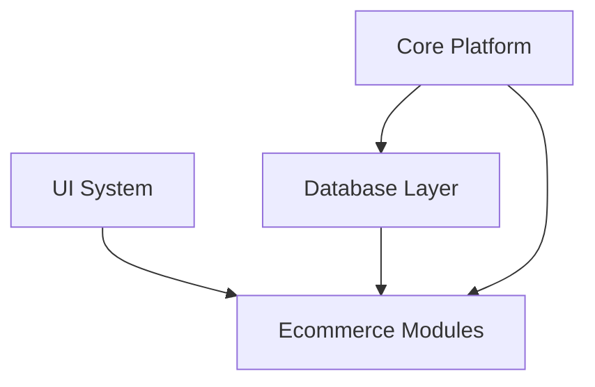

# AgainERP — Product Requirements Document (PRD)

> **Status:** Draft  
> **Version:** 1.0  
> **Product:** AgainERP  
> **Governance:** [GOVERNANCE.md](./GOVERNANCE.md)  
> **Vision:** [architecture/project.md](../architecture/project.md)

---

## 1. Executive Summary

**AgainERP** is an Odoo-inspired, modular ERP + Ecommerce SaaS platform. One core framework powers CRM, Sales, Inventory, Accounting, HR, POS, Ecommerce, AI, and Marketplace — all interconnected through shared entities, events, and APIs.

**Phase 1 delivery focus:** Ecommerce admin (167 screens) proving the platform end-to-end.  
**Documentation-first:** No production code until architecture docs are **Ready** and phase gates approved.

---

## 2. Problem Statement

Businesses run disconnected tools — separate ecommerce, inventory, accounting, and CRM systems. Data duplicates, stock mismatches, and manual reconciliation waste time and cause revenue loss.

AgainERP solves this with **one platform, one product truth, one customer record, one order engine**.

---

## 3. Product Goals

| Goal | Success Metric |
|------|----------------|
| Unified ERP | All modules share Core entities and events |
| Ecommerce-first launch | Full admin for catalog, orders, inventory, marketing |
| Scale | 1M products, 10M orders, 1M customers per tenant |
| Multi-tenant SaaS | Company/branch isolation, per-tenant config |
| Mobile-first admin | Usable on phone, tablet, desktop |
| AI-ready | Embeddings, forecasts, content generation hooks |
| API-first | REST APIs for web, mobile, integrations |

---

## 4. Target Users

| Persona | Needs |
|---------|-------|
| **Store Owner** | Dashboard, sales, inventory overview |
| **Catalog Manager** | Products, categories, pricing, SEO |
| **Order Manager** | Fulfillment, returns, refunds |
| **Warehouse Staff** | Stock, transfers, receipts (mobile) |
| **Marketing Manager** | Campaigns, coupons, affiliates |
| **Accountant** | Invoices, payments, tax reports |
| **HR Manager** | Employees, leave, payroll (future) |
| **Platform Admin** | Companies, users, permissions, system settings |
| **Developer / Integrator** | APIs, webhooks, imports/exports |

---

## 5. Scope

### 5.1 In Scope — Phase 1 (Ecommerce)

| Domain | Capability |
|--------|------------|
| **Dashboard** | KPIs, widgets, analytics cache |
| **Catalog** | Products, variants, categories, brands, attributes, bundles, reviews |
| **Orders** | Cart, checkout, payments, shipments, returns, refunds |
| **Inventory** | Warehouses, stock, movements, reservations, transfers |
| **Customers** | Core contacts, groups, wallet, wishlists |
| **Marketing** | Coupons, campaigns, loyalty, affiliates |
| **Media** | Library, folders, CDN mapping |
| **SEO** | Meta, redirects, sitemaps, audits |
| **Builder** | Pages, templates, widgets, themes |
| **Reports** | Sales, product, customer, inventory reports |
| **AI** | Product descriptions, SEO, forecasts (hooks) |
| **System** | Settings, users, roles, taxes, currencies, languages |

### 5.2 Out of Scope — Phase 1

- Full CRM pipeline (Phase 5)
- General ledger / double-entry accounting (Phase 5)
- POS hardware integration (Phase 5)
- Marketplace multi-vendor (Phase 7)
- Manufacturing BOM (Phase 8)
- Production deployment automation (Phase 9–10)

### 5.3 Future Phases (Documented, Not Implemented)

Phases 5–10 per [MASTER_DEVELOPMENT_SEQUENCE.md](./MASTER_DEVELOPMENT_SEQUENCE.md): CRM, Sales, Purchase, Accounting, POS, HR, AI, Marketplace, Enterprise, DevOps, Production.

---

## 6. Functional Requirements

### 6.1 Core Platform

| ID | Requirement | Priority |
|----|-------------|----------|
| CORE-01 | Multi-company, multi-branch, multi-warehouse isolation | P0 |
| CORE-02 | RBAC with menu, field, and record-level permissions | P0 |
| CORE-03 | Unified contacts (customer, vendor, employee) | P0 |
| CORE-04 | Audit trail on all mutations | P0 |
| CORE-05 | Workflow and approval engine | P1 |
| CORE-06 | System event bus (async) | P0 |
| CORE-07 | Global search (DB FTS → Meilisearch) | P1 |
| CORE-08 | Multi-language and multi-currency | P0 |
| CORE-09 | Media library with CDN support | P0 |
| CORE-10 | API keys, webhooks, rate limits | P1 |

### 6.2 Ecommerce

| ID | Requirement | Priority |
|----|-------------|----------|
| EC-01 | Product catalog with 1M+ products, variants | P0 |
| EC-02 | Order lifecycle: draft → paid → shipped → delivered | P0 |
| EC-03 | Stock reservation on checkout | P0 |
| EC-04 | Multi-gateway payments | P0 |
| EC-05 | Returns and refunds workflow | P1 |
| EC-06 | Coupons and promotions | P1 |
| EC-07 | Page builder for storefront | P1 |
| EC-08 | SEO metadata and sitemaps | P1 |
| EC-09 | Analytics dashboard with pre-aggregation | P0 |
| EC-10 | Abandoned cart recovery | P2 |

### 6.3 Non-Functional

| ID | Requirement | Target |
|----|-------------|--------|
| NFR-01 | API response (p95) | < 200ms reads, < 500ms writes |
| NFR-02 | Admin mobile usability | 44px touch targets, responsive |
| NFR-03 | Uptime | 99.9% (production) |
| NFR-04 | Data isolation | Zero cross-tenant leakage |
| NFR-05 | Soft delete | All business records |
| NFR-06 | GDPR-ready | Export, delete contact data |

---

## 7. User Stories (Representative)

| As a… | I want to… | So that… |
|-------|------------|----------|
| Catalog Manager | Create products with variants and SEO | They appear correctly on storefront |
| Order Manager | View order timeline and update status | I can fulfill and support customers |
| Warehouse Staff | See stock levels per warehouse | I know what to pick and ship |
| Marketing Manager | Create coupon codes with rules | I can run promotions |
| Store Owner | See today's sales on dashboard | I track business performance |
| Developer | Subscribe to `orders.order.placed` webhook | My integration syncs automatically |

---

## 8. Technical Constraints

| Constraint | Decision |
|------------|----------|
| Primary database | PostgreSQL 15+ |
| Cache | Redis |
| Search | Meilisearch (future Elasticsearch) |
| Table ownership | One module per domain — no cross-module direct DB writes |
| Communication | APIs + System Events only |
| Customers | Core `contacts` — no duplicate `customers` table |
| Orders tables | `commerce_*` namespace |
| Catalog tables | `catalog_*` namespace |
| Inventory tables | `inventory_*` namespace |

---

## 9. Dependencies

| Phase | Depends On |
|-------|------------|
| Phase 1 Core | Phase 0 Foundation |
| Phase 2 Database | Phase 1 Core |
| Phase 3 UI | Phase 0 Standards |
| Phase 4 Ecommerce | Phases 1–3 |
| Phase 5+ ERP | Phase 4 Ecommerce patterns |

---

## 10. Success Criteria — Phase 1 Gate

- [ ] All Phase 0–4 architecture docs complete
- [ ] 167 Ecommerce screen docs filled (not templates only)
- [ ] `ModuleManifest.md` marked **Ready** for Ecommerce and Core
- [ ] Stakeholder sign-off on PRD and phase gates
- [ ] Implementation tasks generated from approved docs

---

## 11. Risks & Mitigations

| Risk | Mitigation |
|------|------------|
| Scope creep | Phase gates; MENU_STRUCTURE v1.0 frozen until v2 proposal |
| Schema redesign later | MASTER_DATABASE_ARCHITECTURE covers all future modules |
| Performance at scale | Partitioning, analytics layer, search index separation |
| Module coupling | Event-driven architecture; ownership rules |

---

## 12. Related Documents

| Document | Purpose |
|----------|---------|
| [MASTER_DEVELOPMENT_SEQUENCE.md](./MASTER_DEVELOPMENT_SEQUENCE.md) | 100-step roadmap |
| [MASTER_MODULE_ARCHITECTURE.md](./MASTER_MODULE_ARCHITECTURE.md) | Platform layers |
| [MASTER_DATABASE_ARCHITECTURE.md](./database/MASTER_DATABASE_ARCHITECTURE.md) | Database blueprint |
| [GOVERNANCE.md](./GOVERNANCE.md) | Doc-first workflow |
| [modules/ecommerce/MENU_STRUCTURE.md](./modules/ecommerce/MENU_STRUCTURE.md) | 167 screens |

---

**Product:** AgainERP  
**Last Updated:** 2026-06-12  
**Owner:** Product Team  
**Approvers:** Product Owner · Enterprise Architect
