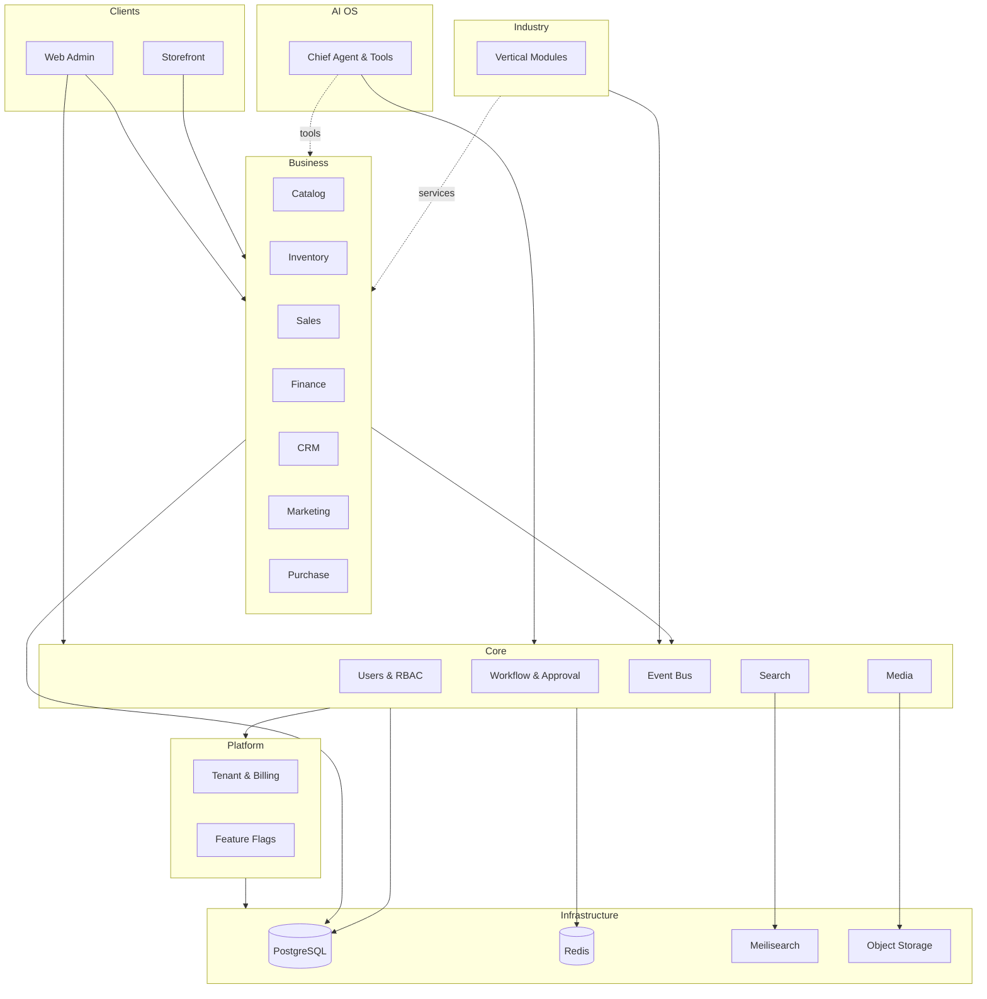
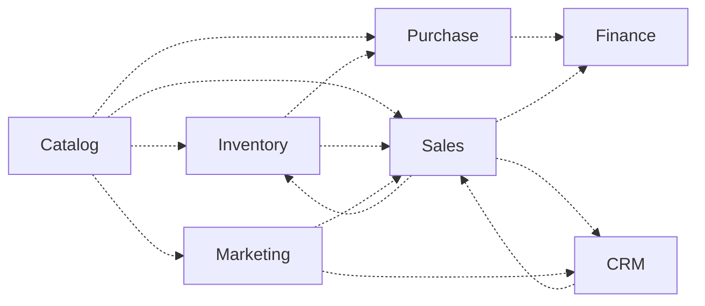

# AgainERP — Project Map

> **Status:** Approved  
> **Version:** 2.0  
> **Project:** AgainERP  
> **Document Type:** Visual Platform Map  
> **Purpose:** Complete visual map — understand the entire platform in minutes  
> **Governance:** [GOVERNANCE.md](./GOVERNANCE.md)

**Audience:** New developers · Architects · AI agents (Cursor, ChatGPT, Claude, Gemini, AI OS)

### Step 25 Requirements (Satisfied)

| Requirement | Section |
|-------------|---------|
| Visual platform map | §1 |
| Six architecture layers | §2 |
| Module, service, entity maps | §3–§5 |
| Event, permission, API, search, AI maps | §6–§10 |
| Industry expansion | §11 |
| ASCII + dependency + architecture diagrams | Throughout |

**Read with:** [MASTER_INDEX.md](./MASTER_INDEX.md) · [AI_KNOWLEDGE_INDEX.md](./AI_KNOWLEDGE_INDEX.md) · [MODULE_DEPENDENCY_MAP.md](./MODULE_DEPENDENCY_MAP.md)

---

## 1. Platform Overview

**AgainERP** is a **hybrid licensed, modular ERP + Ecommerce platform** — one PostgreSQL modular monolith with service-oriented boundaries, event-driven integration, and AI OS as a platform intelligence layer.

```text
┌─────────────────────────────────────────────────────────────────────────┐
│                         AgainERP Platform                                │
│  Documentation-First · API-First · AI-First · Multi-Tenant SaaS         │
└─────────────────────────────────────────────────────────────────────────┘
         │                    │                    │
    Admin UI            Storefront            Mobile / API / AI
    (Next.js)           (Next.js)             (REST + Tools)
         │                    │                    │
         └────────────────────┼────────────────────┘
                              ▼
                    FastAPI Service Layer
                              │
              ┌───────────────┼───────────────┐
              ▼               ▼               ▼
         Business         Core           Platform
         Modules         Engines        (Tenant/Billing)
              │               │               │
              └───────────────┼───────────────┘
                              ▼
              PostgreSQL · Redis · Meilisearch · Object Storage
```

| Attribute | Value |
|-----------|-------|
| **Architecture** | DDD · Service Oriented · Modular Monolith |
| **Tenancy** | Platform → Company → Branch → Warehouse |
| **Integration** | Services (sync) · Events (async) · HTTP APIs |
| **Search** | Meilisearch (primary) → Elasticsearch (future) |
| **AI** | AI OS — tools via services only, never direct DB |
| **Docs** | 560+ registered · [MASTER_INDEX.md](./MASTER_INDEX.md) |

### One-Minute Mental Model

```text
Users & AI  →  APIs  →  Services  →  Owner DB tables  →  Events  →  Side effects
                     ↑
              Permissions + Workflow + Approval on every mutation
```

---

## 2. Architecture Layers

### Layer Stack (Bottom → Top)

```text
┌─────────────────────────────────────────────────────────────────────────┐
│ L6  Clients        Web Admin · Storefront · Mobile · Webhooks · AI UI   │
├─────────────────────────────────────────────────────────────────────────┤
│ L5  AI OS          Chief Agent · Domain Agents · Tools · Audit · Credits│
├─────────────────────────────────────────────────────────────────────────┤
│ L4  Industry       Hospital · School · Restaurant · Manufacturing · …   │
├─────────────────────────────────────────────────────────────────────────┤
│ L3  Business       Catalog · Inventory · Sales · CRM · Finance · …     │
├─────────────────────────────────────────────────────────────────────────┤
│ L2  Core           Users · RBAC · Workflow · Events · Search · Media    │
├─────────────────────────────────────────────────────────────────────────┤
│ L1  Platform       Tenant · Billing · License · Feature Flags · Modules │
├─────────────────────────────────────────────────────────────────────────┤
│ L0  Infrastructure PostgreSQL · Redis · Meilisearch · S3 · K8s/Docker │
└─────────────────────────────────────────────────────────────────────────┘
```

**Rule:** Upper layers depend downward only. Business modules never depend on Industry modules.

---

### Platform Layer

```text
Platform Layer
├── Tenant provisioning      platform.tenant.*
├── Plans & billing          Subscriptions · AI credits
├── License agent            Hybrid on-prem sync
├── Feature flags            Module install gating
├── Module install registry  Which business modules active
└── White label              Branding per tenant
```

| Doc | [SAAS_PLATFORM_ARCHITECTURE.md](./SAAS_PLATFORM_ARCHITECTURE.md) · [HYBRID_LICENSED_ERP_ARCHITECTURE.md](./HYBRID_LICENSED_ERP_ARCHITECTURE.md) |

---

### Core Layer

```text
Core Layer (mandatory for all modules)
├── Identity        Users · Sessions · Roles
├── RBAC            PermissionService · Field ACL
├── Tenant scope    Companies · Branches
├── Parties         Contacts · Addresses  (Customer & Vendor = Contact roles)
├── Collaboration   Activities · Comments · Notes · Tags
├── Media           MediaService · Attachments
├── Engines         Workflow · Approval · Notification · Search · Event
├── Settings        Company/branch/module config
└── Audit           Immutable mutation log
```

| Doc | [core/ARCHITECTURE.md](./core/ARCHITECTURE.md) · [PERMISSION_SYSTEM_ARCHITECTURE.md](./core/PERMISSION_SYSTEM_ARCHITECTURE.md) |

---

### Business Layer

```text
Business Layer
├── Catalog / Product Master    catalog_*     (product spine)
├── Inventory                   inventory_*   (stock ledger)
├── Purchase                    purchase_*    (procurement)
├── Sales                       sales_*       (quote-to-cash)
├── CRM                         crm_*         (pipeline)
├── Marketing                   marketing_*   (campaigns, coupons)
├── Finance                     finance_*     (GL, AR/AP)
└── Ecommerce                   commerce_*      (storefront, carts, checkout)
```

| Doc | [MASTER_MODULE_ARCHITECTURE.md](./MASTER_MODULE_ARCHITECTURE.md) |

---

### Industry Layer

```text
Industry Layer (installable add-ons)
├── hospital_*      Patients, admissions, appointments
├── school_*        Students, enrollments, fees
├── restaurant_*    Tables, orders, kitchen
├── mfg_*           BOM, work orders
└── …               Each: Core + Business services only
```

| Doc | [framework/INDUSTRY_MODULES.md](./framework/INDUSTRY_MODULES.md) |

---

### AI OS Layer

```text
AI OS Layer (platform service — not a business module)
├── Chief AI Agent         Orchestration · delegation
├── Domain Agents          Catalog, Sales, CRM, Finance, …
├── Tool Registry          Maps to Service methods
├── Context Engine         Sanitized record snapshots
├── Approval integration   High-risk tool gates
├── Audit                  ai_audit_logs (append-only)
└── Credits & routing      Model provider abstraction
```

| Doc | [ai_os/README.md](./ai_os/README.md) (vision & UX) · [modules/ai/AI_OS_ARCHITECTURE.md](./modules/ai/AI_OS_ARCHITECTURE.md) (platform) |

---

### Infrastructure Layer

```text
Infrastructure Layer
├── PostgreSQL          OLTP · single DB · prefix isolation
├── Redis               Cache · sessions · queue
├── Meilisearch         Global search indexes
├── Object storage      Media · exports
├── Docker / K8s / VPS  Deployment targets
└── CI/CD · Monitoring  DevOps pipeline
```

| Doc | [deployment/README.md](./deployment/README.md) · [database/MASTER_DATABASE_ARCHITECTURE.md](./database/MASTER_DATABASE_ARCHITECTURE.md) |

---

### Platform Architecture Diagram



---

## 3. Module Map

### Module Layer Diagram

```text
                         ┌──────────────┐
                         │   AI OS      │
                         └──────┬───────┘
                                │ tools
         ┌──────────────────────┼──────────────────────┐
         │                      │                      │
    ┌────▼────┐  ┌───────┐  ┌───▼───┐  ┌───────┐  ┌────▼────┐
    │ Catalog │  │  CRM  │  │ Sales │  │Finance│  │Marketing│
    └────┬────┘  └───┬───┘  └───┬───┘  └───┬───┘  └────┬────┘
         │           │          │          │           │
    ┌────▼────┐  ┌───▼──────────▼──────────▼───────────┘
    │Inventory│  │         Purchase                      │
    └────┬────┘  └───────────────────────────────────────┘
         │
    ┌────▼────────────────────────────────────────────┐
    │  CORE: Media · Workflow · Approvals ·             │
    │        Notifications · Search · Users · Settings  │
    └───────────────────────────────────────────────────┘
```

### Module Registry

| Module | Prefix | Route | Owner Doc | Status |
|--------|--------|-------|-----------|--------|
| **Catalog** | `catalog_*` | `/catalog/*` | [PRODUCT_MASTER_ARCHITECTURE.md](./modules/core/PRODUCT_MASTER_ARCHITECTURE.md) | Approved |
| **Inventory** | `inventory_*` | `/inventory/*` | [INVENTORY_MODULE_ARCHITECTURE.md](./modules/inventory/INVENTORY_MODULE_ARCHITECTURE.md) | Approved |
| **Purchase** | `purchase_*` | `/purchase/*` | [PURCHASE_MODULE_ARCHITECTURE.md](./modules/purchase/PURCHASE_MODULE_ARCHITECTURE.md) | Approved |
| **Sales** | `sales_*` | `/sales/*` | [SALES_MODULE_ARCHITECTURE.md](./modules/sales/SALES_MODULE_ARCHITECTURE.md) | Approved |
| **CRM** | `crm_*` | `/crm/*` | [CRM_MODULE_ARCHITECTURE.md](./modules/crm/CRM_MODULE_ARCHITECTURE.md) | Approved |
| **Marketing** | `marketing_*` | `/marketing/*` | [MARKETING_MODULE_ARCHITECTURE.md](./modules/marketing/MARKETING_MODULE_ARCHITECTURE.md) | Approved |
| **Finance** | `finance_*` | `/finance/*` | [FINANCE_MODULE_ARCHITECTURE.md](./modules/finance/FINANCE_MODULE_ARCHITECTURE.md) | Approved |
| **Media** | `media_*` | `/core/media/*` | [core/entities/media-library.md](./core/entities/media-library.md) | Core |
| **Workflow** | `workflow_*` | `/core/workflow/*` | [WORKFLOW_ENGINE_ARCHITECTURE.md](./core/engines/WORKFLOW_ENGINE_ARCHITECTURE.md) | Approved |
| **Approvals** | `approval_*` | `/core/approvals/*` | [APPROVAL_ENGINE_ARCHITECTURE.md](./core/engines/APPROVAL_ENGINE_ARCHITECTURE.md) | Approved |
| **Notifications** | `notification_*` | `/core/notifications/*` | [NOTIFICATION_ENGINE_ARCHITECTURE.md](./core/engines/NOTIFICATION_ENGINE_ARCHITECTURE.md) | Approved |
| **Search** | `search_*` | `/core/search/*` | [GLOBAL_SEARCH_ARCHITECTURE.md](./core/engines/GLOBAL_SEARCH_ARCHITECTURE.md) | Approved |
| **AI OS** | `ai_*` | `/ai/*` | [AI_OS_ARCHITECTURE.md](./modules/ai/AI_OS_ARCHITECTURE.md) | Approved |

**Full list:** [MODULE_REGISTRY.md](./MODULE_REGISTRY.md)

### Module Dependency Diagram



**Legend:** Dotted = service/event only · No direct DB between business modules  
**Full map:** [MODULE_DEPENDENCY_MAP.md](./MODULE_DEPENDENCY_MAP.md)

---

## 4. Service Map

### Service Layer Diagram

```text
                    ┌─────────────────────────────────┐
                    │         Client / AI Tool         │
                    └───────────────┬─────────────────┘
                                    │
                    ┌───────────────▼─────────────────┐
                    │      PermissionService.check     │
                    └───────────────┬─────────────────┘
                                    │
        ┌───────────────────────────┼───────────────────────────┐
        │                           │                           │
   Business Services          Platform Services            EventService
   Catalog · Sales · …         Activity · Workflow · …       publish
        │                           │                           │
        └───────────────────────────┼───────────────────────────┘
                                    ▼
                           Owner Module Tables
                                    │
                                    ▼
                           AuditService.log
```

### Platform Services

| Service | Role | Registry |
|---------|------|----------|
| **Activity Service** | Timeline, tasks, assignments | [SERVICE_REGISTRY.md](./SERVICE_REGISTRY.md) §3 |
| **Notification Service** | Email, SMS, push, in-app | §3 |
| **Approval Service** | Human approval gates | §3 |
| **Workflow Service** | State machines | §3 |
| **Permission Service** | RBAC on every call | §3 |
| **Search Service** | Query, index, autocomplete | §3 |
| **Media Service** | Upload, attach, URLs | §3 |
| **AI Service** | Agents, tools, credits | §3 |
| **Audit Service** | Immutable logs | §3 |
| **Event Service** | Bus, outbox, DLQ | §3 |
| **Settings Service** | Hierarchical config | §3 |

### Business Services

| Service | Owns | Consumers |
|---------|------|-----------|
| **CatalogService** | Products, variants | Sales, Inventory, Purchase, Marketing, AI |
| **InventoryService** | Stock, warehouses | Sales, Purchase, Catalog |
| **PurchaseService** | PO, receipts, bills | Inventory, Finance |
| **SalesService** | Orders, invoices | Finance, CRM, Inventory |
| **CRMService** | Leads, opportunities | Sales, Marketing |
| **MarketingService** | Campaigns, coupons | Sales, CRM |
| **FinanceService** | GL, AR/AP | All (via events) |

**Full registry:** [SERVICE_REGISTRY.md](./SERVICE_REGISTRY.md)

---

## 5. Entity Map

### Entity Relationship Overview

```text
Organization (Company)
├── Branch
├── User ──► Role ──► Permission
├── Contact ──┬── Customer (role)
│             └── Vendor (role)
│
├── Product ──► Category, Brand, Variant
│       │
│       └──► Stock Level ◄── Warehouse
│
├── Purchase Order ──► Goods Receipt ──► Stock Movement
├── Sales Order ──► Shipment ──► Sales Invoice ──event──► AR Invoice (Finance)
├── Lead ──convert──► Contact + Opportunity
├── Campaign ──► Audience (Contacts)
│
├── Workflow Instance ──► host record (Product, PO, SO, …)
├── Approval Request ──► host record
├── Notification ──► User
└── AI Task ──► optional context entity
```

### Core Entities

| Entity | Owner | Doc |
|--------|-------|-----|
| User | Core | [ENTITY_RELATIONSHIP_REGISTRY.md](./ENTITY_RELATIONSHIP_REGISTRY.md) |
| Organization | Core (Company) | §3 |
| Customer | Core Contact | §4 — not separate table |
| Product | Catalog | §4 |
| Workflow | Core Engine | §4 |
| Approval | Core Engine | §4 |
| Notification | Core | §4 |
| AI Task | AI OS | §4 |

### Business Entities

| Entity | Owner | Key Relationships |
|--------|-------|-------------------|
| **Product** | Catalog | → Category, Brand, Variants, Media |
| **Order** | Sales / Commerce | → Customer, Lines, Shipments |
| **Inventory (Stock)** | Inventory | → Variant, Warehouse, Movements |
| **Purchase Order** | Purchase | → Vendor, Lines, Receipt |
| **Sales Order** | Sales | → Customer, Quotation, Invoice |
| **Invoice** | Sales + Finance | Commercial (Sales) · AR (Finance event) |

**Full profiles:** [ENTITY_RELATIONSHIP_REGISTRY.md](./ENTITY_RELATIONSHIP_REGISTRY.md) · [DATABASE_REGISTRY.md](./DATABASE_REGISTRY.md)

---

## 6. Event Map

### Event Bus Architecture

```text
Domain Service saves aggregate
         │
         ▼ COMMIT
EventService.publish("{module}.{entity}.{action}")
         │
         ├──────────┬──────────┬──────────┬──────────┐
         ▼          ▼          ▼          ▼          ▼
     Search     Notify    Finance    Marketing   AI context
     index      rules     handler    handler     cache
```

### Primary Event Flows

```text
catalog.product.published
  ├──► Search (index)
  ├──► Marketing (eligibility)
  └──► Notification (subscribers)

sales.order.confirmed
  ├──► Inventory (reserve)
  ├──► Finance (accrual hook)
  ├──► CRM (activity)
  └──► Search (index)

purchase.receipt.posted
  ├──► Inventory (stock in)
  └──► Finance (AP hook)

finance.invoice.paid
  ├──► Sales (payment status)
  └──► Notification (receipt)
```

### Event Naming

```text
{module}.{entity}.{action}

Examples:
  catalog.product.created
  inventory.stock_level.updated
  crm.lead.converted
  core.approval.approved
  ai.tool.invoked
```

| Registry | [EVENT_ARCHITECTURE.md](./core/engines/EVENT_ARCHITECTURE.md) · [MODULE_DEPENDENCY_MAP.md](./MODULE_DEPENDENCY_MAP.md) |

---

## 7. Permission Map

### Authorization Flow

```text
Request
  → Authenticate (JWT)
  → Resolve company_id / branch_id
  → PermissionService.check("{module}.{resource}.{action}")
  → Field ACL filter on response
  → Service.execute
```

### Permission Layers

```text
┌─────────────────────────────────────────┐
│ Platform     platform.tenant.*          │
├─────────────────────────────────────────┤
│ Core         core.user.* · core.search.*│
├─────────────────────────────────────────┤
│ Business     catalog.product.*          │
│              sales.order.*              │
│              finance.journal.*          │
├─────────────────────────────────────────┤
│ AI           ai.tool.execute            │
│              ai.agent.run                 │
└─────────────────────────────────────────┘
```

### Key Permission Patterns

| Pattern | Example | Gate |
|---------|---------|------|
| View | `catalog.product.view` | List, get, search result |
| Create | `sales.order.create` | POST create |
| Action | `sales.order.confirm` | Workflow transition |
| Approve | `purchase.order.approve` | Approval step |
| AI | `ai.tool.execute` + domain edit | Tool invocation |

| Registry | [PERMISSION_SYSTEM_ARCHITECTURE.md](./core/PERMISSION_SYSTEM_ARCHITECTURE.md) |

---

## 8. API Map

### API Surface

```text
/api/v1/
├── core/          users · permissions · media · settings
│                  workflow · approvals · notifications · search
├── catalog/       products · categories · brands
├── inventory/     stock · warehouses · adjustments
├── purchase/      po · receipts · bills
├── sales/         orders · invoices · shipments
├── crm/           leads · opportunities
├── marketing/     campaigns · coupons
├── finance/       journals · ar · ap · payments
├── commerce/      carts · checkout · orders (storefront)
├── ai/            chat · tools · agents
└── platform/      tenant · billing · modules
```

### API Request Path

```text
Client
  → API Gateway (FastAPI)
  → Auth (JWT + X-Company-Id)
  → Permission middleware
  → Controller (thin)
  → Service
  → JSON envelope { data, meta, links }
```

| Registry | [API_REGISTRY.md](./API_REGISTRY.md) · [api/architecture.md](./api/architecture.md) |

---

## 9. Search Map

### Search Architecture

```text
                    ┌─────────────────┐
                    │  Global Bar     │
                    │  Ctrl+K         │
                    └────────┬────────┘
                             │
                    ┌────────▼────────┐
                    │ SearchService   │
                    │ (Core)          │
                    └────────┬────────┘
                             │
              ┌──────────────┼──────────────┐
              ▼              ▼              ▼
         Meilisearch    Permission      AI NL parse
         indexes        filter          (optional)
```

### Indexed Domains

```text
Products · Orders · Customers · Inventory · Purchase
Sales · CRM · Marketing · Finance · Documents
Activities · Users
```

### Index Pipeline

```text
Domain event (e.g. catalog.product.updated)
  → Search indexer handler
  → SearchService.upsert(document)
  → Meilisearch index (company_id filterable)
```

| Registry | [GLOBAL_SEARCH_ARCHITECTURE.md](./core/engines/GLOBAL_SEARCH_ARCHITECTURE.md) |

---

## 10. AI Agent Map

### AI OS Topology

```text
                         User / Automation
                                │
                                ▼
                       ┌────────────────┐
                       │ Chief AI Agent │
                       └───────┬────────┘
                               │ delegate
       ┌───────────┬───────────┼───────────┬───────────┐
       ▼           ▼           ▼           ▼           ▼
  Catalog      Sales        CRM      Finance     Developer
  Agent        Agent       Agent      Agent        Agent
       │           │           │           │           │
       └───────────┴───────────┴───────────┴───────────┘
                               │
                    Tool Registry → Service methods
                               │
                    Permission + Approval + Audit
```

### Domain Agents

| Agent | Primary Service | Risk |
|-------|-----------------|------|
| Catalog Agent | CatalogService | Medium (publish) |
| Inventory Agent | InventoryService | Medium (adjustment) |
| Purchase Agent | PurchaseService | High (PO approve) |
| Sales Agent | SalesService | High (confirm/discount) |
| CRM Agent | CRMService | Low–Medium |
| Marketing Agent | MarketingService | Medium (launch) |
| Finance Agent | FinanceService | High (journal post) |
| SEO Agent | CatalogService | Low |
| Support Agent | SupportService | Low |
| Developer Agent | Read-only docs | Low |
| Analytics Agent | Report services | Low (read) |

### AI Execution Pipeline

```text
Prompt → Context Engine → Permission check → Tool invoke
      → [Approval if high-risk] → Service call → Audit log → Response
```

**Never:** `SELECT` · cross-module ORM · skip audit

| Registry | [AI_KNOWLEDGE_INDEX.md](./AI_KNOWLEDGE_INDEX.md) · [AI_OS_ARCHITECTURE.md](./modules/ai/AI_OS_ARCHITECTURE.md) |

---

## 11. Future Industry Expansion Map

### Expansion Model

```text
New Industry Module
  ├── docs/modules/{industry}/
  ├── table prefix {industry}_*
  ├── manifest: requires_services [Catalog, Finance, …]
  ├── events: {industry}.{entity}.{action}
  └── NEVER duplicates Core entities (User, Contact, Product)
```

### Planned Verticals

```text
                    ┌──────────────┐
                    │  AgainERP    │
                    │  Core + Biz  │
                    └──────┬───────┘
           ┌───────────────┼───────────────┐
           │               │               │
     ┌─────▼─────┐   ┌─────▼─────┐   ┌─────▼─────┐
     │ Hospital  │   │  School   │   │Restaurant │
     │ hospital_*│   │ school_*  │   │restaurant*│
     └───────────┘   └───────────┘   └───────────┘
           │               │               │
     ┌─────▼─────┐   ┌─────▼─────┐   ┌─────▼─────┐
     │Manufacturing│ │Real Estate│   │   NGO     │
     │   mfg_*   │   │realestate*│   │  ngo_*    │
     └───────────┘   └───────────┘   └───────────┘
                           │
                     ┌─────▼─────┐
                     │  Courier  │
                     │ courier_* │
                     └───────────┘
```

| Industry | Prefix | Uses (services) | Status |
|----------|--------|-----------------|--------|
| **Hospital** | `hospital_*` | Contact, Catalog, Inventory, Finance | Planned |
| **School** | `school_*` | Contact, Finance, CRM | Planned |
| **Restaurant** | `restaurant_*` | Catalog, Sales, Inventory | Planned |
| **Manufacturing** | `mfg_*` | Catalog, Inventory, Purchase | Planned |
| **Real Estate** | `realestate_*` | CRM, Contact, Finance | Planned |
| **NGO** | `ngo_*` | Contact, Finance, CRM | Planned |
| **Courier** | `courier_*` | Sales, Inventory, Contact | Planned |

| Doc | [framework/INDUSTRY_MODULES.md](./framework/INDUSTRY_MODULES.md) · [UNIVERSAL_MODULE_FRAMEWORK.md](./UNIVERSAL_MODULE_FRAMEWORK.md) |

---

## End-to-End Flows

### Order-to-Cash

```text
Catalog (Product) → Sales (Order) → Inventory (Reserve/Ship)
                 → Sales (Invoice) → Finance (AR via event)
                 → Notification (customer email)
                 → Search (index)
```

### Procure-to-Pay

```text
Catalog (Variant) → Purchase (PO) → Approval → Inventory (Receipt)
                 → Purchase (Bill) → Finance (AP via event)
```

### Product Publish

```text
Catalog (draft) → Workflow → Approval → catalog.product.published
  → Search index · Storefront · Marketing eligibility
```

---

## Documentation Navigation

```text
New to AgainERP?
  README.md → MASTER_INDEX.md → PROJECT_MAP.md (this file)
  → AI_KNOWLEDGE_INDEX.md (if AI)
  → Target registry → Module ARCHITECTURE.md
```

| Map Type | Master Document |
|----------|-----------------|
| All docs | [MASTER_INDEX.md](./MASTER_INDEX.md) |
| Modules | [MODULE_REGISTRY.md](./MODULE_REGISTRY.md) |
| Dependencies | [MODULE_DEPENDENCY_MAP.md](./MODULE_DEPENDENCY_MAP.md) |
| Services | [SERVICE_REGISTRY.md](./SERVICE_REGISTRY.md) |
| Entities | [ENTITY_RELATIONSHIP_REGISTRY.md](./ENTITY_RELATIONSHIP_REGISTRY.md) |
| APIs | [API_REGISTRY.md](./API_REGISTRY.md) |
| Events | [EVENT_ARCHITECTURE.md](./core/engines/EVENT_ARCHITECTURE.md) |
| Permissions | [PERMISSION_SYSTEM_ARCHITECTURE.md](./core/PERMISSION_SYSTEM_ARCHITECTURE.md) |
| Search | [GLOBAL_SEARCH_ARCHITECTURE.md](./core/engines/GLOBAL_SEARCH_ARCHITECTURE.md) |
| AI | [AI_KNOWLEDGE_INDEX.md](./AI_KNOWLEDGE_INDEX.md) |
| Workflows | [WORKFLOW_REGISTRY.md](./WORKFLOW_REGISTRY.md) |

---

## Golden Rules (Platform)

| # | Rule |
|---|------|
| 1 | **No cross-module DB** — services and events only |
| 2 | **Single entity owner** — one writer per table |
| 3 | **Customer = Contact** — no duplicate customer table |
| 4 | **Product spine** — Catalog owns products; all lines reference variants |
| 5 | **Permission every call** — including AI tools |
| 6 | **Events after COMMIT** — async side effects |
| 7 | **AI never SQL** — tools → services only |
| 8 | **Docs before code** — PRE_CODE_GATE |

---

*End of Project Map — Step 25 · Maintainer: Platform Team · Last Updated: 2026-06-13*
