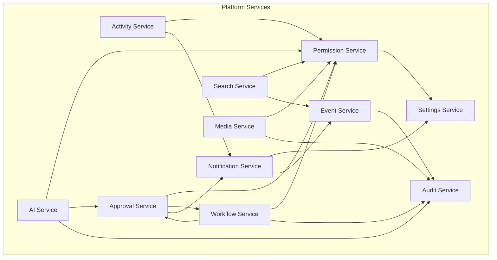

# AgainERP — Service Registry

> **Status:** Approved  
> **Version:** 1.0  
> **Project:** AgainERP  
> **Document Type:** Enterprise Service Registry  
> **Architecture:** Domain Driven Design · Service Oriented · Modular Monolith  
> **Phase:** Documentation First  
> **Governance:** [GOVERNANCE.md](./GOVERNANCE.md) · **Standards:** [DEVELOPMENT_STANDARDS.md](./DEVELOPMENT_STANDARDS.md)

**No backend code. No interface definitions in code.**  
This document is the **master registry of platform and business services** — responsibilities, consumers, dependencies, events, permissions, and future compatibility.

### Step 21 Requirements (Satisfied)

| Requirement | Section |
|-------------|---------|
| Master platform service registry | §1 |
| DDD · Service Oriented · Modular Monolith | §2 |
| 11 platform + 7 business services | §3 · §4 |
| 6 attributes per service | §3 · §4 |

**Related:** [MODULE_DEPENDENCY_MAP.md](./MODULE_DEPENDENCY_MAP.md) · [framework/COMMUNICATION_CONTRACTS.md](./framework/COMMUNICATION_CONTRACTS.md) · [framework/CORE_SERVICES.md](./framework/CORE_SERVICES.md) · [EVENT_ARCHITECTURE.md](./core/engines/EVENT_ARCHITECTURE.md) · [API_REGISTRY.md](./API_REGISTRY.md)

---

## Executive Summary

| Principle | Rule |
|-----------|------|
| **Service owns data** | Only the owning service writes its tables |
| **Interface not implementation** | Consumers depend on service contract — not ORM |
| **Same-process monolith** | In-process calls default; HTTP for external/mobile |
| **Events for side effects** | Service COMMIT → publish event → async consumers |
| **Permission on every call** | Caller context applied — no "internal bypass" |
| **Registry before method** | New public method → update this doc + module API.md |

**Layers:** Platform Services (Core engines) · Business Services (domain aggregates)

---

## 1. Purpose

### Why a Service Registry Exists

AgainERP integrates 17+ modules through **services and events**, not shared databases. Without a master registry:

| Problem | Impact |
|---------|--------|
| Undocumented public methods | Breaking changes surprise consumers |
| Duplicate service logic | Two modules implement "send notification" |
| Missing permission checks | Service called without RBAC |
| Unknown event side effects | Handler publishes duplicate events |
| Microservice confusion | No clear extraction boundary |

This registry answers:

- **What does each service do?**
- **Who may call it?**
- **What does it depend on?**
- **What events does it emit/consume?**
- **How does it evolve without breaking callers?**

### What This Document Is

| Is | Is Not |
|----|--------|
| Canonical service catalog | PHP/Python class files |
| Contract-level responsibilities | Method signatures in code |
| Consumer and dependency index | Deployment topology |
| Versioning and compatibility policy | OpenAPI spec (see module API.md) |

### Relationship to Other Registries

| Registry | Focus |
|----------|-------|
| [MODULE_DEPENDENCY_MAP.md](./MODULE_DEPENDENCY_MAP.md) | Module-level integration |
| [ENTITY_RELATIONSHIP_REGISTRY.md](./ENTITY_RELATIONSHIP_REGISTRY.md) | Business entities |
| [API_REGISTRY.md](./API_REGISTRY.md) | HTTP API architecture |
| **SERVICE_REGISTRY** (this doc) | Service layer contracts |

---

## 2. Service Philosophy

### Domain Driven Design

```text
Bounded Context → owns aggregates → exposes Service as application layer
Other contexts call Service — never repository of sibling context
```

| DDD Element | AgainERP Mapping |
|-------------|------------------|
| **Bounded context** | Module / domain (Catalog, Sales, …) |
| **Aggregate root** | Entity (Product, Sales Order, …) |
| **Application service** | `{Domain}Service` in registry |
| **Domain event** | `{module}.{entity}.{action}` after COMMIT |
| **Anti-corruption layer** | Service DTO — not raw ORM across boundary |

### Service Oriented Architecture

| Pattern | Rule |
|---------|------|
| **Single responsibility** | One service per domain capability cluster |
| **Loose coupling** | Depend on interfaces; events for notifications |
| **Discoverability** | Registered here + `ModuleManifest.md` |
| **Composability** | Business services orchestrate; platform services provide cross-cutting |
| **Idempotency** | Event handlers and selected service methods safe to retry |

### Modular Monolith

```text
┌─────────────────────────────────────────────────────────────┐
│  Modular Monolith Process                                    │
│  ┌─────────────┐  in-process   ┌─────────────┐              │
│  │ Sales       │──────────────►│ Catalog     │              │
│  │ Service     │  CatalogService.getVariant() │              │
│  └──────┬──────┘               └─────────────┘              │
│         │ publish sales.order.confirmed                      │
│         ▼                                                    │
│  ┌─────────────┐  Event Bus  ┌─────────────┐                │
│  │ Inventory   │◄────────────│ Search      │                │
│  │ Service     │             │ Service     │                │
│  └─────────────┘             └─────────────┘                │
└─────────────────────────────────────────────────────────────┘
```

| Aspect | Modular Monolith Choice |
|--------|-------------------------|
| **Deployment** | Single deployable; modules as namespaces/packages |
| **Database** | One PostgreSQL; prefix isolation |
| **Service call** | In-process dependency injection |
| **Future split** | Service boundary = microservice boundary |
| **Transaction** | Single DB transaction within one aggregate; cross-aggregate via event |

### Service Call Rules

| # | Rule |
|---|------|
| 1 | Call **down** the layer stack (Industry → Business → Core) |
| 2 | Business services call **Core platform services** freely |
| 3 | Business services call **sibling business services** via public registry methods only |
| 4 | Platform services **never** call business services (except AI tools via registry) |
| 5 | Every public method checks **caller permissions** |
| 6 | Mutations **publish events** after successful COMMIT |
| 7 | Breaking change → **version bump** or new method name |

### Service vs API vs Event

| Channel | When | Example |
|---------|------|---------|
| **Service (sync)** | Immediate read/write in same request | `InventoryService.reserve()` |
| **API (HTTP)** | External client, mobile, future microservice | `GET /api/v1/catalog/products/{id}` |
| **Event (async)** | Side effects, fan-out | `catalog.product.published` → Search |

---

## 3. Platform Services

Platform services are **Core-owned**, cross-cutting capabilities consumed by all business and industry modules.

---

### Activity Service

| Attribute | Value |
|-----------|-------|
| **Responsibilities** | Schedule tasks (call, meeting, todo); record timeline entries; assign to users; polymorphic link to any entity; mark complete/cancel; follower notifications |
| **Consumers** | CRM, Sales, Purchase, Catalog, Finance, Marketing, HR, Industry modules, AI OS (NBA suggestions) |
| **Dependencies** | Permission Service (assignee visibility); User Service (assignee); Notification Service (due reminders); Event Service (publish activity events) |
| **Events Published** | `core.activity.created`, `core.activity.completed`, `core.activity.cancelled`, `core.activity.assigned` |
| **Events Consumed** | — (created by domain services explicitly) |
| **Permissions** | `core.activity.view`, `core.activity.create`, `core.activity.edit`, `core.activity.delete`, `core.activity.assign` |
| **Future Compatibility** | Extract to `/api/v1/core/activities/`; timeline read replicas for analytics; webhook on `activity.completed` |

**API base:** `/api/v1/core/activities/` · **Doc:** [ACTIVITY_CHATTER_ARCHITECTURE.md](./modules/core/ACTIVITY_CHATTER_ARCHITECTURE.md)

---

### Notification Service

| Attribute | Value |
|-----------|-------|
| **Responsibilities** | Deliver in-app, email, SMS, push, WhatsApp, Telegram, Slack; template render; user preferences; delivery tracking; batch send; rule-based triggers |
| **Consumers** | All modules; Workflow Service (transition alerts); Approval Service (pending approval); Event Service (rule subscribers) |
| **Dependencies** | Settings Service (SMTP, provider keys); Permission Service; User Service; Contact Service (recipient resolution); Event Service (consume triggers) |
| **Events Published** | `core.notification.queued`, `core.notification.sent`, `core.notification.delivered`, `core.notification.failed`, `core.notification.read` |
| **Events Consumed** | Rule-matched domain events (`*.*.*`); `core.approval.requested`; `sales.order.confirmed`; `purchase.order.approved` |
| **Permissions** | `core.notification.view`, `core.notification.manage_preferences`, `core.notification.admin` (templates, rules) |
| **Future Compatibility** | Provider adapter pattern; queue-backed workers; per-tenant rate limits; microservice with same event subscription |

**API base:** `/api/v1/core/notifications/` · **Doc:** [NOTIFICATION_ENGINE_ARCHITECTURE.md](./core/engines/NOTIFICATION_ENGINE_ARCHITECTURE.md)

---

### Approval Service

| Attribute | Value |
|-----------|-------|
| **Responsibilities** | Submit approval requests; multi-step chains; approve/reject/delegate/escalate; link to workflow steps; timeout handling; audit trail |
| **Consumers** | Catalog (publish), Purchase (PO), Sales (discount/credit), Finance (journal, payment), Inventory (adjustment), AI OS (high-risk tools) |
| **Dependencies** | Permission Service; User Service; Workflow Service; Notification Service; Event Service |
| **Events Published** | `core.approval.requested`, `core.approval.approved`, `core.approval.rejected`, `core.approval.delegated`, `core.approval.escalated`, `core.approval.expired` |
| **Events Consumed** | `core.workflow.transitioned` (when step requires approval) |
| **Permissions** | `core.approval.view`, `core.approval.approve`, `core.approval.reject`, `core.approval.delegate`, `core.approval.admin` |
| **Future Compatibility** | External approver via email token; mobile push approve; policy-as-config versioning |

**API base:** `/api/v1/core/approvals/` · **Doc:** [APPROVAL_ENGINE_ARCHITECTURE.md](./core/engines/APPROVAL_ENGINE_ARCHITECTURE.md)

---

### Workflow Service

| Attribute | Value |
|-----------|-------|
| **Responsibilities** | Register workflow definitions; start instances on entities; execute transitions with guards; history; cancel; parallel branches |
| **Consumers** | Catalog, Purchase, Sales, Finance, CRM, Marketing, Industry modules |
| **Dependencies** | Permission Service; Approval Service (approval steps); Event Service; Audit Service |
| **Events Published** | `core.workflow.started`, `core.workflow.transitioned`, `core.workflow.completed`, `core.workflow.cancelled` |
| **Events Consumed** | `core.approval.approved`, `core.approval.rejected` (unblock transitions) |
| **Permissions** | `core.workflow.view`, `core.workflow.transition`, `core.workflow.admin` (definition manage) |
| **Future Compatibility** | BPMN import; long-running sagas via event correlation; visual designer export |

**API base:** `/api/v1/core/workflow/` · **Doc:** [WORKFLOW_ENGINE_ARCHITECTURE.md](./core/engines/WORKFLOW_ENGINE_ARCHITECTURE.md)

---

### Permission Service

| Attribute | Value |
|-----------|-------|
| **Responsibilities** | RBAC check (`can`); role assignment; field-level ACL; branch/warehouse scope filter; query filter for list APIs; permission cache |
| **Consumers** | **Every service and API** — mandatory gate |
| **Dependencies** | User Service; Settings Service (default roles); Event Service |
| **Events Published** | `core.permission.granted`, `core.permission.revoked`, `core.role.updated` |
| **Events Consumed** | `core.user.created` (default role assignment) |
| **Permissions** | `core.permission.view`, `core.permission.manage`, `core.role.manage` |
| **Future Compatibility** | ABAC attributes; external IdP sync; distributed cache invalidation on role change |

**API base:** `/api/v1/core/permissions/` · **Doc:** [PERMISSION_SYSTEM_ARCHITECTURE.md](./core/PERMISSION_SYSTEM_ARCHITECTURE.md)

---

### Search Service

| Attribute | Value |
|-----------|-------|
| **Responsibilities** | Global and module search; autocomplete; suggestions; index upsert/delete; permission-filtered results; AI query parse hook; analytics log |
| **Consumers** | All modules (UI search); AI OS (NL search); Storefront (product subset) |
| **Dependencies** | Permission Service; Event Service (index consumers); Settings Service (synonyms); Meilisearch provider (infra) |
| **Events Published** | `search.reindex.requested`, `search.reindex.completed`, `search.query.logged` |
| **Events Consumed** | All registered index events — `catalog.product.*`, `sales.order.*`, `crm.lead.*`, `core.contact.*`, etc. |
| **Permissions** | `core.search.use`, `core.search.admin`, `ai.search.use` |
| **Future Compatibility** | Elasticsearch provider swap; semantic/vector search; federated multi-index |

**API base:** `/api/v1/core/search/` · **Doc:** [GLOBAL_SEARCH_ARCHITECTURE.md](./core/engines/GLOBAL_SEARCH_ARCHITECTURE.md)

---

### Media Service

| Attribute | Value |
|-----------|-------|
| **Responsibilities** | Upload files; store metadata; generate URLs/thumbnails; attach/detach to records; folder organization; storage quota enforcement |
| **Consumers** | Catalog, Marketing, CRM, Purchase, Finance, Builder, Industry modules |
| **Dependencies** | Permission Service; Settings Service (storage limits); Audit Service; Event Service |
| **Events Published** | `core.media.uploaded`, `core.media.deleted`, `core.attachment.created`, `core.attachment.removed` |
| **Events Consumed** | `catalog.product.archived` (cleanup job) |
| **Permissions** | `core.media.view`, `core.media.upload`, `core.media.delete`, `core.attachment.create`, `core.attachment.delete` |
| **Future Compatibility** | S3-compatible adapter; CDN signed URLs; virus scan hook; direct browser upload presigned |

**API base:** `/api/v1/core/media/` · **Doc:** [core/entities/media-library.md](./core/entities/media-library.md)

---

### AI Service

| Attribute | Value |
|-----------|-------|
| **Responsibilities** | LLM gateway; agent orchestration; tool registry invocation; context assembly; credit metering; audit logging; streaming responses |
| **Consumers** | All modules (registered tools); Search Service (NL parse); Notification Service (personalization) |
| **Dependencies** | Permission Service; Approval Service (high-risk tools); Audit Service; Event Service; Settings Service (model config); **Business services via tool registry only** |
| **Events Published** | `ai.agent.started`, `ai.agent.completed`, `ai.tool.invoked`, `ai.tool.approved`, `ai.tool.rejected`, `ai.credit.consumed` |
| **Events Consumed** | Domain events (read-only context handlers); `core.approval.approved` (tool execution gate) |
| **Permissions** | `ai.access`, `ai.agent.run`, `ai.tool.execute`, `ai.admin` |
| **Future Compatibility** | Multi-model routing; on-prem model; tool versioning; agent marketplace |

**API base:** `/api/v1/ai/os/` · **Doc:** [AI_OS_ARCHITECTURE.md](./modules/ai/AI_OS_ARCHITECTURE.md)

---

### Audit Service

| Attribute | Value |
|-----------|-------|
| **Responsibilities** | Immutable mutation log; who/when/what changed; AI action audit; compliance export; retention policies |
| **Consumers** | All services (automatic on write); Platform admin; Compliance reports |
| **Dependencies** | User Service (actor); Event Service (optional async write) |
| **Events Published** | `core.audit.logged` |
| **Events Consumed** | — (called synchronously from services) |
| **Permissions** | `core.audit.view`, `core.audit.export`, `core.audit.admin` |
| **Future Compatibility** | WORM storage; SIEM export; hash chain integrity |

**API base:** `/api/v1/core/audit/` · **Doc:** [database/audit-trail.md](./database/audit-trail.md)

---

### Settings Service

| Attribute | Value |
|-----------|-------|
| **Responsibilities** | Hierarchical config (global → company → branch); feature toggles; i18n defaults; integration keys (encrypted); module settings schema |
| **Consumers** | All platform and business services; Notification (SMTP); AI (model keys); Finance (fiscal defaults) |
| **Dependencies** | Permission Service; Event Service |
| **Events Published** | `core.settings.updated`, `core.settings.company.updated` |
| **Events Consumed** | `platform.tenant.provisioned`, `platform.plan.changed` |
| **Permissions** | `core.settings.view`, `core.settings.edit`, `core.settings.admin` |
| **Future Compatibility** | Settings UI code-gen from schema; vault-backed secrets; env override layer |

**API base:** `/api/v1/core/settings/` · **Doc:** [SETTINGS_ARCHITECTURE.md](./modules/core/SETTINGS_ARCHITECTURE.md)

---

### Event Service

| Attribute | Value |
|-----------|-------|
| **Responsibilities** | Publish domain events after COMMIT; route to subscribers; outbox pattern; retry/DLQ; event store read; idempotency keys |
| **Consumers** | All services (publish); Search, Notification, AI, Analytics (subscribe) |
| **Dependencies** | Settings Service (bus config); Audit Service (event audit optional) |
| **Events Published** | `core.event.published`, `core.event.failed`, `core.event.dlq` |
| **Events Consumed** | — (infrastructure — receives all published events) |
| **Permissions** | `core.event.admin` (replay, DLQ manage); publish implicit with domain permission |
| **Future Compatibility** | Kafka/RabbitMQ transport; event schema registry; cross-region replication |

**API base:** internal · **Doc:** [EVENT_ARCHITECTURE.md](./core/engines/EVENT_ARCHITECTURE.md)

---

## 4. Business Services

Business services own **domain aggregates** and expose the sole write path for their bounded context.

---

### Catalog Service

| Attribute | Value |
|-----------|-------|
| **Responsibilities** | Product/variant CRUD; categories, brands, attributes; pricing; publish/archive; channel visibility; product search within domain |
| **Consumers** | Inventory, Purchase, Sales, Marketing, CRM, Ecommerce, POS, Industry modules, AI OS (catalog tools) |
| **Dependencies** | Media Service; Workflow Service; Approval Service; Permission Service; Event Service; Audit Service; Activity Service; Search Service (index via event) |
| **Events Published** | `catalog.product.created`, `catalog.product.updated`, `catalog.product.submitted`, `catalog.product.published`, `catalog.product.archived`, `catalog.variant.price_changed`, `catalog.category.updated` |
| **Events Consumed** | `core.approval.approved`, `core.approval.rejected` |
| **Permissions** | `catalog.product.view/create/edit/publish/archive/approve`; `catalog.category.*`; `catalog.brand.*` |
| **Future Compatibility** | PIM syndication adapter; marketplace feed export; GraphQL product API; microservice at `/api/v1/catalog/` unchanged |

**API base:** `/api/v1/catalog/` · **Doc:** [PRODUCT_MASTER_ARCHITECTURE.md](./modules/core/PRODUCT_MASTER_ARCHITECTURE.md)

---

### Inventory Service

| Attribute | Value |
|-----------|-------|
| **Responsibilities** | Warehouses; stock levels; movements; reservations; transfers; adjustments; batch/serial; availability queries |
| **Consumers** | Catalog (display qty), Sales (reserve/ship), Purchase (receipt), Marketing (availability), Finance (valuation), AI OS |
| **Dependencies** | Catalog Service (variant ref — read); Permission Service; Workflow Service; Approval Service; Event Service; Audit Service; Notification Service |
| **Events Published** | `inventory.movement.posted`, `inventory.adjustment.posted`, `inventory.stock_level.updated`, `inventory.reservation.created`, `inventory.reservation.released`, `inventory.reorder.suggested` |
| **Events Consumed** | `catalog.product.published`, `purchase.receipt.posted`, `sales.order.confirmed`, `sales.shipment.shipped`, `sales.order.cancelled`, `core.approval.approved` |
| **Permissions** | `inventory.stock.view`, `inventory.warehouse.*`, `inventory.adjustment.create`, `inventory.transfer.create`, `inventory.reservation.*` |
| **Future Compatibility** | WMS integration; barcode/RFID adapter; multi-warehouse optimization service |

**API base:** `/api/v1/inventory/` · **Doc:** [INVENTORY_MODULE_ARCHITECTURE.md](./modules/inventory/INVENTORY_MODULE_ARCHITECTURE.md)

---

### Purchase Service

| Attribute | Value |
|-----------|-------|
| **Responsibilities** | RFQ; purchase orders; goods receipt; vendor bills; 3-way match; returns; vendor contracts |
| **Consumers** | Inventory (receipt posting), Finance (AP), AI OS |
| **Dependencies** | Catalog Service; Contact Service (vendor); Inventory Service; Workflow Service; Approval Service; Media Service; Permission Service; Event Service; Audit Service; Notification Service |
| **Events Published** | `purchase.rfq.sent`, `purchase.order.created`, `purchase.order.approved`, `purchase.receipt.posted`, `purchase.bill.posted`, `purchase.bill.paid` |
| **Events Consumed** | `inventory.reorder.suggested`, `core.approval.approved`, `core.approval.rejected`, `finance.payment.posted` |
| **Permissions** | `purchase.order.view/create/edit/approve/cancel`; `purchase.receipt.*`; `purchase.bill.*` |
| **Future Compatibility** | EDI/cXML PO; vendor portal API; contract lifecycle module |

**API base:** `/api/v1/purchase/` · **Doc:** [PURCHASE_MODULE_ARCHITECTURE.md](./modules/purchase/PURCHASE_MODULE_ARCHITECTURE.md)

---

### Sales Service

| Attribute | Value |
|-----------|-------|
| **Responsibilities** | Quotations; sales orders; shipments; sales invoices; payments (customer receipt intent); returns; credit notes |
| **Consumers** | Finance (invoice events), Inventory (reserve/ship), CRM (history), Marketing (attribution), Ecommerce/Commerce, AI OS |
| **Dependencies** | Catalog Service; Contact Service (customer); Inventory Service; CRM Service (optional); Workflow Service; Approval Service; Permission Service; Event Service; Audit Service; Activity Service; Notification Service |
| **Events Published** | `sales.quotation.sent`, `sales.order.confirmed`, `sales.order.cancelled`, `sales.shipment.shipped`, `sales.invoice.posted`, `sales.payment.received`, `sales.return.approved` |
| **Events Consumed** | `crm.lead.converted`, `crm.opportunity.won`, `commerce.order.placed`, `commerce.order.paid`, `inventory.stock_level.updated`, `marketing.coupon.applied`, `core.approval.approved` |
| **Permissions** | `sales.order.*`, `sales.quotation.*`, `sales.invoice.*`, `sales.shipment.*`, `sales.payment.*`, `sales.return.*` |
| **Future Compatibility** | Omnichannel order hub; subscription billing hook; CPQ engine; split to Order Service + Billing Service |

**API base:** `/api/v1/sales/` · **Doc:** [SALES_MODULE_ARCHITECTURE.md](./modules/sales/SALES_MODULE_ARCHITECTURE.md)

---

### CRM Service

| Attribute | Value |
|-----------|-------|
| **Responsibilities** | Leads; accounts; opportunities; pipeline stages; conversion to contact/customer; CRM tasks |
| **Consumers** | Sales (conversion, history), Marketing (segments), AI OS |
| **Dependencies** | Contact Service; Activity Service; Workflow Service; Permission Service; Event Service; Audit Service; Notification Service; Search Service (via event) |
| **Events Published** | `crm.lead.created`, `crm.lead.assigned`, `crm.lead.converted`, `crm.opportunity.created`, `crm.opportunity.won`, `crm.opportunity.lost`, `crm.account.updated` |
| **Events Consumed** | `core.contact.created`, `commerce.order.paid`, `sales.order.confirmed`, `marketing.campaign.clicked` |
| **Permissions** | `crm.lead.*`, `crm.opportunity.*`, `crm.account.*`, `crm.pipeline.admin` |
| **Future Compatibility** | HubSpot/Salesforce sync adapter; predictive scoring microservice; partner portal |

**API base:** `/api/v1/crm/` · **Doc:** [CRM_MODULE_ARCHITECTURE.md](./modules/crm/CRM_MODULE_ARCHITECTURE.md)

---

### Marketing Service

| Attribute | Value |
|-----------|-------|
| **Responsibilities** | Campaigns; audiences; segments; journeys; coupons; loyalty; email templates; send orchestration |
| **Consumers** | CRM (attribution), Sales (coupon apply), Ecommerce (promotions), AI OS |
| **Dependencies** | Catalog Service; Contact Service; Media Service; Notification Service; Permission Service; Event Service; Audit Service; Search Service (via event) |
| **Events Published** | `marketing.campaign.started`, `marketing.campaign.sent`, `marketing.campaign.clicked`, `marketing.coupon.created`, `marketing.coupon.applied`, `marketing.loyalty.points_awarded` |
| **Events Consumed** | `catalog.product.published`, `crm.contact.updated`, `commerce.order.abandoned`, `commerce.order.placed`, `sales.order.confirmed` |
| **Permissions** | `marketing.campaign.*`, `marketing.coupon.*`, `marketing.segment.*`, `marketing.loyalty.*` |
| **Future Compatibility** | ESP adapters (Mailchimp, SendGrid); CDP export; real-time personalization API |

**API base:** `/api/v1/marketing/` · **Doc:** [MARKETING_MODULE_ARCHITECTURE.md](./modules/marketing/MARKETING_MODULE_ARCHITECTURE.md)

---

### Finance Service

| Attribute | Value |
|-----------|-------|
| **Responsibilities** | Chart of accounts; journal entries; AR/AP; receipts; payments; bank reconciliation; fiscal periods; expense claims |
| **Consumers** | All modules needing GL status; Platform billing; AI OS; Reports/BI |
| **Dependencies** | Contact Service; Workflow Service; Approval Service; Permission Service; Event Service; Audit Service; Notification Service |
| **Dependencies (read via events, not sync chain)** | Sales Service, Purchase Service, Inventory Service — consume posted documents via events |
| **Events Published** | `finance.journal.posted`, `finance.invoice.posted`, `finance.invoice.paid`, `finance.payment.posted`, `finance.payment.received`, `finance.period.closed` |
| **Events Consumed** | `sales.invoice.posted`, `sales.payment.received`, `purchase.bill.posted`, `purchase.bill.paid`, `inventory.adjustment.posted`, `core.approval.approved` |
| **Permissions** | `finance.journal.*`, `finance.ar_invoice.*`, `finance.ap_bill.*`, `finance.payment.*`, `finance.period.close`, `finance.coa.admin` |
| **Future Compatibility** | Multi-currency revaluation service; tax engine plug-in; statutory reporting export; split AR/AP sub-services |

**API base:** `/api/v1/finance/` · **Doc:** [FINANCE_MODULE_ARCHITECTURE.md](./modules/finance/FINANCE_MODULE_ARCHITECTURE.md)

---

## 5. Service Dependency Map

### Platform Service Graph



### Business → Platform Usage

```text
All Business Services ──► Permission Service (every call)
All Business Services ──► Event Service (publish)
All Business Services ──► Audit Service (mutations)
Most Business Services ──► Workflow / Approval / Notification / Activity
Catalog, CRM, … ──► Media Service
All ──► Search Service (via events, not direct index calls from UI)
AI tools ──► AI Service ──► Business Services (registry)
```

### Business Service Interaction Matrix

| Caller → Callee | Catalog | Inventory | Purchase | Sales | CRM | Marketing | Finance |
|-----------------|---------|-----------|----------|-------|-----|-----------|---------|
| **Catalog** | — | getStockLevels | — | — | — | — | — |
| **Inventory** | getVariant | — | — | — | — | — | — |
| **Purchase** | getVariant | getStock | — | — | vendor (Contact) | — | — |
| **Sales** | getVariant, getPrice | reserve, release | — | — | getOpportunity | validateCoupon | — |
| **CRM** | searchProducts | — | — | getOrderHistory | — | getCampaignResponse | — |
| **Marketing** | listProducts | — | — | — | getContacts | — | — |
| **Finance** | — | getValuation | getBill | getInvoice | AR/AP contact | — | — |

Full module map: [MODULE_DEPENDENCY_MAP.md](./MODULE_DEPENDENCY_MAP.md)

---

## 6. Registry Rules

### Adding a Service Method

1. Owner module architecture doc updated
2. Entry added/updated in this registry
3. Permission key registered
4. Events documented (publish/consume)
5. `ModuleManifest.md` → `provides_services`
6. [CHANGELOG.md](./CHANGELOG.md) entry

### Versioning

| Change Type | Action |
|-------------|--------|
| New method (non-breaking) | Minor version bump in manifest |
| Signature change | New method; deprecate old (2 minors) |
| Behavior change | Event version or new event name |
| Extract to microservice | HTTP facade; same contract |

### Anti-Patterns

```text
❌ InventoryService updates catalog_products
❌ SalesService skips PermissionService.check
❌ NotificationService sends without template permission
❌ AI Service direct SQL on sales_orders
❌ Event handler calls 4 business services synchronously
✅ SalesService → CatalogService.getVariant → reserve via InventoryService
✅ COMMIT → EventService.publish → async Search index
```

---

## 7. Future Compatibility (Platform-Wide)

| Strategy | Detail |
|----------|--------|
| **Microservice extraction** | Service registry entry = boundary; HTTP adapter implements same interface |
| **API versioning** | `/api/v1/` stable; v2 parallel for breaking HTTP |
| **Event schema evolution** | Additive payload fields only; consumers ignore unknown |
| **Multi-region** | Event Service replication; read-only service replicas |
| **Industry modules** | Register `provides_services` in manifest; consume platform + business from this registry |
| **OpenAPI generation** | Service public methods → module `API.md` → codegen at implementation gate |

---

## Appendix A — Service Index

| Service | Layer | Owner | API Base |
|---------|-------|-------|----------|
| Activity Service | Platform | Core | `/api/v1/core/activities/` |
| Notification Service | Platform | Core | `/api/v1/core/notifications/` |
| Approval Service | Platform | Core | `/api/v1/core/approvals/` |
| Workflow Service | Platform | Core | `/api/v1/core/workflow/` |
| Permission Service | Platform | Core | `/api/v1/core/permissions/` |
| Search Service | Platform | Core | `/api/v1/core/search/` |
| Media Service | Platform | Core | `/api/v1/core/media/` |
| AI Service | Platform | AI OS | `/api/v1/ai/os/` |
| Audit Service | Platform | Core | `/api/v1/core/audit/` |
| Settings Service | Platform | Core | `/api/v1/core/settings/` |
| Event Service | Platform | Core | internal |
| Catalog Service | Business | Catalog | `/api/v1/catalog/` |
| Inventory Service | Business | Inventory | `/api/v1/inventory/` |
| Purchase Service | Business | Purchase | `/api/v1/purchase/` |
| Sales Service | Business | Sales | `/api/v1/sales/` |
| CRM Service | Business | CRM | `/api/v1/crm/` |
| Marketing Service | Business | Marketing | `/api/v1/marketing/` |
| Finance Service | Business | Finance | `/api/v1/finance/` |

---

## Appendix B — Supporting Core Services (Not Primary Registry)

These Core services support the platform but are accessed via Identity/Parties subsystems — documented in [framework/CORE_SERVICES.md](./framework/CORE_SERVICES.md):

| Service | Role |
|---------|------|
| User Service | Identity — used by Permission, Activity, Approval |
| Contact Service | Parties — Customer/Vendor via contact_type |
| Company / Branch Service | Tenant scope |
| Comment / Note Service | Collaboration — often via Activity Service facade |

---

## Related Documents

| Document | Role |
|----------|------|
| [MODULE_DEPENDENCY_MAP.md](./MODULE_DEPENDENCY_MAP.md) | Module-level deps |
| [framework/COMMUNICATION_CONTRACTS.md](./framework/COMMUNICATION_CONTRACTS.md) | Integration channels |
| [framework/CORE_SERVICES.md](./framework/CORE_SERVICES.md) | Extended Core catalog |
| [EVENT_ARCHITECTURE.md](./core/engines/EVENT_ARCHITECTURE.md) | Event bus |
| [API_REGISTRY.md](./API_REGISTRY.md) | HTTP API architecture |

---

*End of Service Registry — Step 21*
