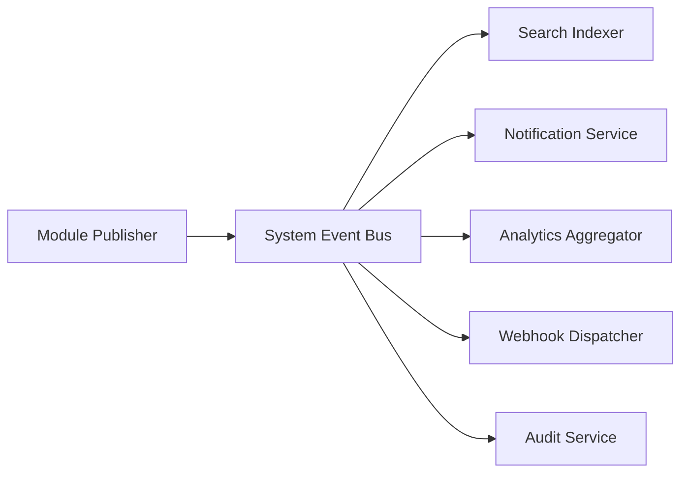
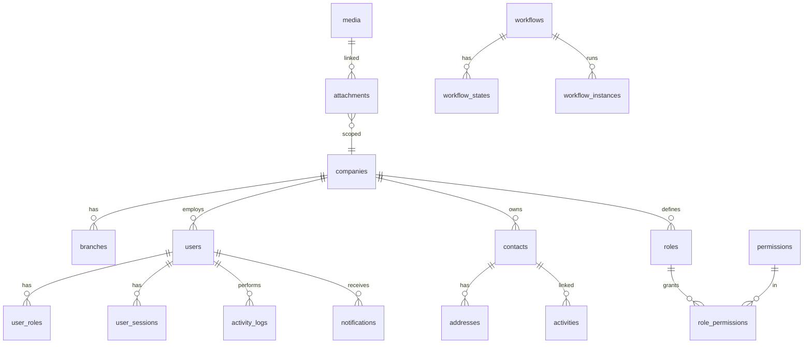

# AgainERP — Core Framework Architecture

> **Status:** Draft  
> **Layer:** 1 — Core (Foundation)  
> **Version:** 1.0  
> **Document Type:** Enterprise Architecture  
> **Governance:** [GOVERNANCE.md](../GOVERNANCE.md) · **Platform:** [MASTER_MODULE_ARCHITECTURE.md](../MASTER_MODULE_ARCHITECTURE.md)

**No code. No migrations. No controllers.**  
Foundation layer that **every** AgainERP module depends on.

---

## Core Mission

The Core Layer is the **heart of AgainERP**.

| Rule | Description |
|------|-------------|
| **Universal dependency** | Catalog, Orders, Inventory, CRM, Accounting, HR, AI — all use Core |
| **Single ownership** | Core owns shared tables and services — modules never duplicate |
| **API-first** | All Core capabilities exposed via `/api/v1/core/` |
| **Multi-tenant** | Company and branch isolation from day one |
| **SaaS-ready** | Tenant plans, feature flags, per-company config |
| **Immutable audit** | Every mutation traceable |
| **Event-driven** | System Events bus for loose coupling |

```
                    ┌─────────────────────────────────┐
                    │         CORE FRAMEWORK          │
                    │  Users · RBAC · Contacts · Media │
                    │  Workflow · Search · Events · API │
                    └───────────────┬─────────────────┘
                                    │
        ┌───────────────┬───────────┼───────────┬───────────────┐
        ▼               ▼           ▼           ▼               ▼
    Catalog         Orders      Inventory      CRM          Accounting
        │               │           │           │               │
        └───────────────┴───────────┴───────────┴───────────────┘
                              All depend on Core
```

Entity detail: [shared-entities.md](./shared-entities.md)

---

# Core Module Map

```
Core
├── Users                    ← Identity & authentication
├── Roles                    ← RBAC role groups
├── Permissions              ← ACL registry
├── Companies                ← Multi-tenant root
├── Branches                 ← Multi-location
├── Contacts                 ← Unified parties (customer, vendor, employee)
├── Addresses                ← Polymorphic locations
├── Activities               ← Scheduled tasks & follow-ups
├── Notifications            ← Alert delivery
├── Comments                 ← Threaded discussion
├── Notes                    ← Internal annotations
├── Attachments              ← File links to records
├── Media Library            ← File storage engine
├── Settings                 ← Configuration engine
├── Localization             ← Formats & locale rules
├── Languages                ← i18n
├── Currencies               ← Money & exchange
├── Taxes                    ← Tax rules engine
├── Audit Logs               ← Immutable mutation trail
├── Workflow Engine          ← State machines
├── Approval Engine          ← Multi-step approvals
├── Search Engine            ← Global & module search
├── API Manager              ← Keys, webhooks, rate limits
├── System Events            ← Event bus
├── Cache Manager            ← Redis abstraction
└── Queue Manager            ← Background jobs
```

---

# User Management

## Scope

| Area | Design |
|------|--------|
| **Users** | `users` table — staff, admin, portal users |
| **User Profile** | Name, email, avatar, locale, timezone, preferences |
| **Teams** | `teams`, `team_members` — cross-functional groups |
| **Departments** | `departments` — org hierarchy under company |
| **Login** | Email/password, SSO-ready (OAuth2/SAML future) |
| **Security** | Account lockout, failed attempt tracking |
| **Sessions** | `user_sessions` — token, expiry, IP, device |
| **Devices** | Trusted device registry for MFA bypass |
| **Password Policy** | Min length, complexity, rotation (configurable) |
| **MFA Ready** | TOTP, SMS OTP — `users.mfa_enabled`, `mfa_secret` |

## Key Tables

| Table | Purpose |
|-------|---------|
| `users` | Identity |
| `user_sessions` | Active sessions |
| `user_devices` | Trusted devices |
| `user_companies` | Multi-company access pivot |
| `user_branches` | Branch scope pivot |
| `teams` / `team_members` | Team structure |
| `departments` | Org chart |

## API Base

`/api/v1/core/users` · `/api/v1/auth/login` · `/api/v1/auth/logout` · `/api/v1/auth/mfa`

Detail: [entities/users.md](./entities/users.md)

---

# Roles & Permissions (RBAC)

## Permission Model

```
User → user_roles → Role → role_permissions → Permission
                    ↓
              record_rules (domain filters)
              field_rules (column ACL)
```

## RBAC Layers

| Layer | Mechanism | Example |
|-------|-----------|---------|
| **Roles** | Named groups | `Catalog Manager` |
| **Permissions** | `{module}.{resource}.{action}` | `catalog.product.write` |
| **Permission Groups** | UI grouping of permissions | `Catalog — Products` |
| **Module Permissions** | Registered at module install | All `ecommerce.*` |
| **Menu Permissions** | Hide nav items | `ecommerce.dashboard.access` |
| **Field Level** | Hide/edit specific fields | `catalog.product.cost_price` |
| **Record Level** | Domain filter on queries | Own records only |
| **Branch Level** | `branch_id IN user_branches` | Branch manager scope |
| **Company Level** | `company_id = active_company` | Mandatory on all queries |

## Tables

| Table | Purpose |
|-------|---------|
| `roles` | Role definitions |
| `permissions` | Permission registry |
| `role_permissions` | Role ↔ permission pivot |
| `user_roles` | User ↔ role pivot (scoped by company) |
| `record_rules` | Row-level security domains |
| `field_permissions` | Column-level ACL |

Detail: [entities/roles.md](./entities/roles.md) · [entities/permissions.md](./entities/permissions.md) · [PERMISSION_SYSTEM_ARCHITECTURE.md](./PERMISSION_SYSTEM_ARCHITECTURE.md)

---

# Companies & Branches

## Multi-Company

| Feature | Design |
|---------|--------|
| **Company isolation** | Every business row has `company_id`; queries always filter |
| **Company switcher** | User selects active company in session/token |
| **Company settings** | `company_settings` key-value per company |
| **SaaS plans** | `companies.plan_id` → feature flags, limits |

## Multi-Branch

| Feature | Design |
|---------|--------|
| **Branches** | Locations under company — stores, offices, warehouses |
| **Branch settings** | `branch_settings` overrides |
| **User branch scope** | Optional restriction via `user_branches` |
| **HQ flag** | `branches.is_head_office` |

## Future SaaS

- Subdomain per tenant: `{slug}.againerp.com`
- Plan tiers: Starter, Business, Enterprise
- Usage metering: API calls, storage, users
- Tenant provisioning API

Detail: [entities/companies.md](./entities/companies.md) · [entities/branches.md](./entities/branches.md)

---

# Contacts & Addresses

## Unified Contact Model

One `contacts` table serves all party types via `contact_types` array:

| Type | Used By |
|------|---------|
| `customer` | Ecommerce, CRM, Sales |
| `vendor` | Purchase, Accounting |
| `employee` | HR, Payroll |
| `lead` | CRM |
| `supplier` | Purchase, Inventory |
| `partner` | CRM, Marketplace |

**Rule:** No `ecommerce_customers`, `crm_leads` as separate person tables — extensions link to `contact_id`.

## Addresses

Polymorphic `addresses` on any entity: Contact, Company, Branch, Order, etc.

Detail: [entities/contacts.md](./entities/contacts.md) · [entities/addresses.md](./entities/addresses.md)

---

# Activity System

Two complementary systems:

| System | Table | Purpose |
|--------|-------|---------|
| **Activity Log (Audit)** | `activity_logs` | Automatic: create, edit, delete, login, export |
| **Activities (Tasks)** | `activities` | User-scheduled: calls, meetings, follow-ups |

## Audit Log — Tracked Actions

`create` · `edit` · `delete` · `login` · `logout` · `view` · `import` · `export` · `approve` · `reject`

## Stored Fields (`activity_logs`)

| Field | Description |
|-------|-------------|
| `user_id` | Actor |
| `created_at` | When |
| `ip_address` | Client IP |
| `device_type` | mobile, tablet, desktop |
| `browser` | Parsed UA |
| `module` | ecommerce, catalog, crm |
| `action` | create, edit, … |
| `entity_type` | Model class |
| `entity_id` | Record ID |
| `entity_label` | Human label |
| `payload` | JSON: before/after values |

Retention: 90d hot → 1y warm → 7y cold archive.

Detail: [entities/activities.md](./entities/activities.md)

---

# Notification Center

## Channels

| Channel | v1 | v2 |
|---------|----|----|
| In-App | ✓ | ✓ |
| Email | ✓ | ✓ |
| SMS | — | ✓ |
| WhatsApp | — | ✓ |
| Push | — | ✓ |

## Components

| Component | Table / Service |
|-----------|-----------------|
| **Notifications** | `notifications` — per-user inbox |
| **Templates** | `notification_templates` — translatable |
| **Rules** | `notification_rules` — event → channel mapping |
| **Delivery log** | `notification_deliveries` — status, retries |

## Priority

`low` · `medium` · `high` · `critical` — drives channel selection and UI prominence.

Modules **emit events**; Notification Service **delivers** — modules do not send email directly.

**Deep dive:** [engines/NOTIFICATION_ENGINE_ARCHITECTURE.md](./engines/NOTIFICATION_ENGINE_ARCHITECTURE.md)

---

# Comments & Notes

| Feature | Table | Visibility |
|---------|-------|--------------|
| **Comments** | `comments` | May be customer-facing; threaded; mentions |
| **Notes** | `notes` | Internal staff only |
| **Mentions** | `@user` parsed → notification | |
| **Attachments on thread** | `attachments` polymorphic on comment | |
| **Activity threads** | Comments + notes unified timeline API | |

Polymorphic on **any record**: `commentable_type` + `commentable_id`.

Detail: [entities/comments.md](./entities/comments.md) · [entities/notes.md](./entities/notes.md)

---

# Media Library

## Capabilities

| Feature | Design |
|---------|--------|
| Images, videos, documents | `media` table + MIME validation |
| Folders | `media_folders` hierarchy |
| Tags | Core `tags` on media |
| Versioning | `parent_media_id` chain |
| Watermarking | Post-process job on upload |
| Optimization | WebP/AVIF variants, responsive sizes |
| CDN | `cdn_url` field; CDN Manager config |
| Storage abstraction | Driver interface: `local`, `s3`, `gcs` |

## Link to Records

`attachments` table links `media_id` → any business record with `collection` (gallery, thumbnail, document).

Detail: [entities/media-library.md](./entities/media-library.md) · [entities/attachments.md](./entities/attachments.md)

---

# Settings Engine

## Hierarchy (override order)

```
Global Settings (platform defaults)
    ↓ overridden by
Company Settings (tenant config)
    ↓ overridden by
Module Settings (e.g. ecommerce.checkout.guest_allowed)
    ↓ overridden by
User Settings (preferences, dashboard layout)
```

## Feature Flags

`feature_flags` table: `key`, `company_id`, `enabled`, `rollout_percentage`  
Used for SaaS plans and gradual rollouts.

## Tables

`core_settings` (global) · `company_settings` · `module_settings` · `user_settings`

---

# Localization

| Concern | Storage | Example |
|---------|---------|---------|
| **Languages** | `languages` | `en`, `bn` |
| **Translations** | `*_translations` tables per entity | Product name in Bangla |
| **Currencies** | `currencies` | BDT, USD, EUR |
| **Exchange rates** | `exchange_rates` | Daily rate |
| **Timezones** | User/company preference | `Asia/Dhaka` |
| **Date formats** | Locale config | `DD/MM/YYYY` |
| **Number formats** | Locale config | `1,234.56` vs `১,২৩৪` |

All user-facing strings via translation keys — never hardcoded.

---

# Taxes

| Component | Purpose |
|-----------|---------|
| `tax_classes` | Standard, reduced, zero |
| `tax_rules` | Rate by country/region/product class |
| `tax_rates` | Percentage or fixed |
| Calculation service | Called by Orders, Sales, POS, Accounting |

Tax engine is Core-owned; modules pass line items and receive tax breakdown.

---

# Audit Logs

Immutable append-only log (see Activity System).

| Dimension | Captured |
|-----------|----------|
| **Who** | `user_id` |
| **What** | `action`, `entity_type`, `entity_id` |
| **When** | `created_at` |
| **From Where** | IP, device, browser |
| **Before / After** | `payload.old`, `payload.new` per field |

Compliance: GDPR export, SOC2 evidence, dispute resolution.

---

# Workflow Engine

## Reusable State Machine

| Component | Table |
|-----------|-------|
| Workflow definition | `workflows` |
| States | `workflow_states` |
| Transitions | `workflow_transitions` |
| Instance | `workflow_instances` on any record |

## Built-in Workflows (registered by modules)

| Workflow | Module | States |
|----------|--------|--------|
| Product Approval | Catalog | draft → review → approved → published |
| Order Approval | Orders | pending → approved → processing |
| Customer Approval | CRM | pending → verified |
| Leave Approval | HR | requested → manager → HR → approved |
| Purchase Approval | Purchase | draft → manager → finance → approved |

Modules register workflows; Core engine executes transitions and fires events.

**Deep dive:** [engines/workflow-engine.md](./engines/workflow-engine.md)

---

# Approval Engine

Extends Workflow for explicit human approval chains.

| Type | Design |
|------|--------|
| **Single level** | One approver role |
| **Multi level** | Sequential steps: Manager → Director → CFO |
| **Conditional** | Amount > X → extra approval step |
| **Approval matrix** | `approval_matrices`: dimension → approver mapping |

Tables: `approvals`, `approval_steps`, `approval_delegates` (out-of-office).

**Deep dive:** [engines/APPROVAL_ENGINE_ARCHITECTURE.md](./engines/APPROVAL_ENGINE_ARCHITECTURE.md)

---

# Search Engine

## Layers

| Layer | Scope |
|-------|-------|
| **Global Search** | Top bar — products, contacts, orders, tickets |
| **Module Search** | Scoped to current module |
| **Advanced Search** | Filters, saved queries |
| **Saved Searches** | `saved_searches` per user |

## Index Strategy

| Phase | Engine |
|-------|--------|
| v1 | Database full-text + indexes |
| v2 | Meilisearch |
| v3 | Elasticsearch |
| v4 | AI semantic search (embeddings via AI Service) |

Tables: `search_indexes` (metadata), `search_synonyms`, `search_query_log` (analytics).

Modules publish index documents via **Search Service** on create/update events.

**Deep dive:** [engines/GLOBAL_SEARCH_ARCHITECTURE.md](./engines/GLOBAL_SEARCH_ARCHITECTURE.md)

---

# API Manager

| Feature | Table / Config |
|---------|----------------|
| **API Keys** | `api_keys` — hashed, scoped permissions |
| **Tokens** | JWT / personal access tokens |
| **Rate Limits** | Per key, per company — Redis counters |
| **Webhooks** | `webhooks` — URL, secret, event subscriptions |
| **Integrations** | `integrations` — OAuth apps (Shopify sync, etc.) |

Base: `/api/v1/core/` · Admin: `/api/v1/core/api-keys`

Detail: [api/architecture.md](../api/architecture.md) · [API.md](./API.md)

---

# System Events

## Event Bus Architecture



## Event Schema

```json
{
  "event": "catalog.product.created",
  "company_id": "uuid",
  "actor_id": "user-uuid",
  "timestamp": "ISO-8601",
  "payload": { "product_id": "uuid", "sku": "..." }
}
```

## Standard Events

| Event | Publisher | Subscribers |
|-------|-----------|-------------|
| `catalog.product.created` | Catalog | Search, SEO, Analytics |
| `orders.order.placed` | Orders | Sales, Inventory, Accounting, Notifications |
| `inventory.stock.updated` | Inventory | Catalog cache, Dashboard, Notifications |
| `core.contact.registered` | Core | CRM, Marketing |
| `catalog.review.added` | Catalog | Notifications, AI, SEO |

## Rules

- Events are **async** by default (queue)
- Handlers must be **idempotent**
- Failed handlers → dead letter queue + alert

**Deep dive:** [engines/EVENT_ARCHITECTURE.md](./engines/EVENT_ARCHITECTURE.md)

---

# Cache Manager

| Layer | Technology | Use |
|-------|------------|-----|
| Application | Redis | Session, permission cache, widget data |
| Query | Redis | Category tree, settings |
| HTTP | Cache-Control | Public storefront API |
| CDN | CloudFront/Cloudflare | Media assets |

API: `CacheService.get/set/forget` with tagged invalidation (`catalog:*` flush on product update).

**Deep dive:** [engines/cache-architecture.md](./engines/cache-architecture.md)

---

# Queue Manager

| Queue | Jobs |
|-------|------|
| `default` | General async |
| `notifications` | Email, SMS delivery |
| `search` | Index rebuild |
| `imports` | Catalog import |
| `exports` | Large exports |
| `analytics` | Aggregation |
| `ai` | LLM requests |
| `webhooks` | Outbound HTTP |

Tables: `jobs`, `failed_jobs` — standard queue metadata.  
Horizon/dashboard for monitoring.

**Deep dive:** [engines/queue-architecture.md](./engines/queue-architecture.md)

---

# Database Architecture

## Core Table Ownership

All tables prefixed `core_` where not already named (e.g. `users`, `companies` are unprefixed legacy convention — document both):

| Domain | Tables |
|--------|--------|
| Identity | `users`, `user_sessions`, `user_devices`, `user_companies`, `user_branches` |
| RBAC | `roles`, `permissions`, `role_permissions`, `user_roles`, `record_rules`, `field_permissions` |
| Tenant | `companies`, `branches`, `company_settings`, `branch_settings` |
| Parties | `contacts`, `addresses` |
| Collaboration | `activities`, `activity_logs`, `notifications`, `comments`, `notes` |
| Media | `media`, `media_folders`, `attachments`, `tags`, `taggables` |
| Config | `core_settings`, `module_settings`, `user_settings`, `feature_flags` |
| i18n / money | `languages`, `currencies`, `exchange_rates` |
| Tax | `tax_classes`, `tax_rules`, `tax_rates` |
| Workflow | `workflows`, `workflow_states`, `workflow_transitions`, `workflow_instances` |
| Approval | `approvals`, `approval_steps`, `approval_matrices` |
| Search | `search_synonyms`, `saved_searches` |
| API | `api_keys`, `webhooks`, `integrations` |
| Analytics | `analytics_dashboard_cache`, `analytics_*` |
| Queue | `jobs`, `failed_jobs` |

## ER Diagram



## Indexes (Critical)

| Table | Index | Reason |
|-------|-------|--------|
| `users` | `(email)` UNIQUE | Login |
| `activity_logs` | `(company_id, created_at)` | Audit queries |
| `contacts` | `(company_id, email)` | Lookup |
| `notifications` | `(user_id, read_at)` | Inbox |
| `permissions` | `(key)` UNIQUE | ACL check |

## Ownership Rule

> **Only Core** may write to Core tables. Modules call Core APIs/Services.

---

# API Architecture

Base: `/api/v1/core/`

| Area | Endpoints |
|------|-----------|
| Auth | `/auth/login`, `/auth/logout`, `/auth/refresh`, `/auth/mfa` |
| Users | `/users`, `/users/{uuid}`, `/me` |
| RBAC | `/roles`, `/permissions` |
| Tenant | `/companies`, `/branches` |
| Parties | `/contacts`, `/addresses` |
| Media | `/media`, `/media/upload`, `/attachments` |
| Collaboration | `/activities`, `/activity-logs`, `/notifications`, `/comments`, `/notes` |
| Search | `/search`, `/search/autocomplete` |
| Settings | `/settings`, `/feature-flags` |
| Webhooks | `/webhooks`, `/api-keys` |

## Standards

| Standard | Rule |
|----------|------|
| Versioning | `/api/v1/` URL prefix |
| Authentication | Bearer JWT or session cookie |
| Authorization | Permission check every request |
| Company context | `X-Company-Id` header required |
| Errors | `{ errors: [{ code, message, field }] }` |
| Success | `{ data, meta }` |
| Pagination | `page` + `per_page` or `cursor` |

Full spec: [api/architecture.md](../api/architecture.md)

---

# Security Architecture

| Control | Implementation |
|---------|----------------|
| **RBAC** | Roles + permissions + record rules |
| **MFA** | TOTP; required for admin roles (configurable) |
| **Sessions** | Secure, HttpOnly, SameSite; rotation on privilege change |
| **API Security** | HTTPS only, token expiry, scoped API keys |
| **Encryption** | Passwords: argon2; secrets at rest encrypted |
| **Audit trails** | Append-only `activity_logs` |
| **CSRF / XSS / SQLi** | [DEVELOPMENT_STANDARDS §6](../DEVELOPMENT_STANDARDS.md) |
| **Data isolation** | `company_id` mandatory filter; branch rules optional |
| **Rate limiting** | Per IP, per user, per API key |

---

# Performance Architecture

| Technique | Application |
|-----------|-------------|
| **Caching** | Redis — permissions (5m), settings (15m), category tree |
| **Queues** | All email, search index, import, AI async |
| **Background jobs** | Aggregation, sitemap, cache warm |
| **Analytics tables** | `analytics_*` — no live SUM on millions of rows |
| **Read optimization** | Read replicas for reporting/search |
| **Write optimization** | Batch inserts on import; event batching |
| **Targets** | Core API p95 < 200ms; auth < 100ms |

---

# Future Compatibility

Core is designed so these modules **plug in without Core redesign**:

| Module | Core Integration |
|--------|------------------|
| **Catalog** | Contacts N/A; Media, Tags, Workflow, Search, Events |
| **Orders** | Contacts, Addresses, Taxes, Notifications, Events |
| **Inventory** | Branches, Events, Notifications |
| **CRM** | Contacts, Activities, Workflow, Search |
| **Accounting** | Currencies, Taxes, Audit, Events |
| **HR** | Contacts (employee), Workflow, Approval |
| **POS** | Users, Permissions, Contacts |
| **Marketplace** | Companies (vendors), Workflow, Approval |
| **AI** | AI Service gateway; Events; Search embeddings |

### Extension Points

- Register permissions at module install
- Register workflow definitions
- Subscribe to System Events
- Publish search index documents
- No new tables in Core without platform review

---

# Core Documentation Index

| Topic | Document |
|-------|----------|
| Shared entities | [shared-entities.md](./shared-entities.md) |
| Entity details | [entities/](./entities/) |
| Platform blueprint | [MASTER_MODULE_ARCHITECTURE.md](../MASTER_MODULE_ARCHITECTURE.md) |
| API standards | [api/architecture.md](../api/architecture.md) |
| DB standards | [database/standards.md](../database/standards.md) |
| Development standards | [DEVELOPMENT_STANDARDS.md](../DEVELOPMENT_STANDARDS.md) |

---

# Module Manifest (Core)

| Field | Value |
|-------|-------|
| **Module Name** | Core |
| **Version** | `1.0.0-arch` |
| **Owner** | Platform Team |
| **Layer** | 1 — Core |
| **Dependencies** | None (foundation) |
| **API Base** | `/api/v1/core/` |
| **Permission Prefix** | `core.*` |

---

**Platform:** AgainERP · Core Framework  
**Last Updated:** 2026-06-12  
**Status:** Draft — requires approval before implementation
