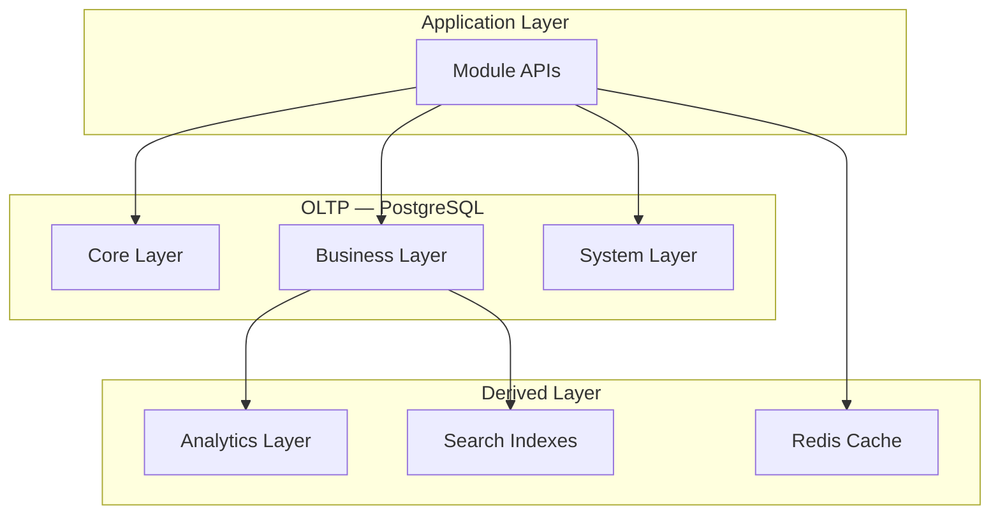
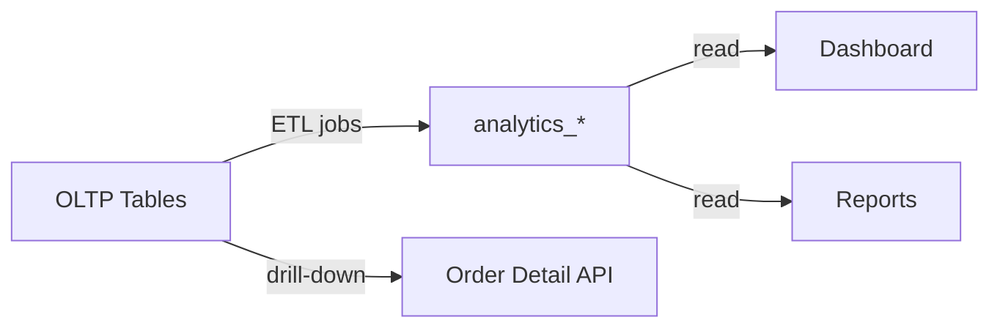
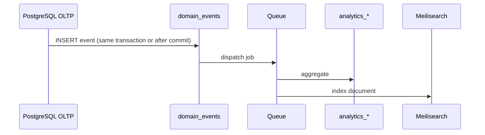
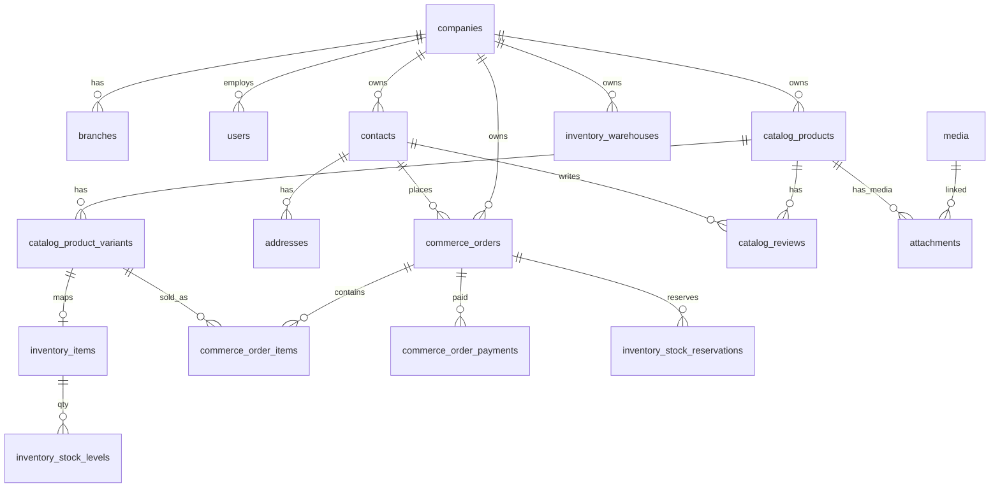

# AgainERP — Master Database Architecture

> **Status:** Draft  
> **Version:** 1.0  
> **Document Type:** Enterprise Database Blueprint  
> **DBMS:** PostgreSQL (primary)  
> **Governance:** [GOVERNANCE.md](../GOVERNANCE.md) · **Platform:** [MASTER_MODULE_ARCHITECTURE.md](../MASTER_MODULE_ARCHITECTURE.md)

**No application code. No migrations.**  
Scalable database blueprint for Ecommerce, CRM, Inventory, Sales, Purchase, Accounting, POS, HR, and AI — without redesign.

**Related:** [DATABASE_REGISTRY.md](../DATABASE_REGISTRY.md) · [standards.md](./standards.md) · [catalog/ARCHITECTURE.md](../modules/ecommerce/catalog/ARCHITECTURE.md) · [orders/ARCHITECTURE.md](../modules/ecommerce/orders/ARCHITECTURE.md) · [core/ARCHITECTURE.md](../core/ARCHITECTURE.md)

---

## Executive Summary

| Goal | Target |
|------|--------|
| Products | 1,000,000+ |
| Orders | 10,000,000+ |
| Customers (contacts) | 1,000,000+ |
| Tenancy | Multi-company, multi-branch, multi-warehouse |
| i18n / money | Multi-language, multi-currency |
| Analytics | Separate aggregation layer |
| Search | PostgreSQL FTS → Meilisearch → Elasticsearch |

### Technology Stack

| Layer | Technology |
|-------|------------|
| Primary OLTP | **PostgreSQL** 15+ |
| Cache | **Redis** |
| Search (v2) | **Meilisearch** |
| Search (v3) | **Elasticsearch** |
| Analytics / BI (future) | **Data warehouse** (read replica → ETL) |
| Queue metadata | PostgreSQL `jobs` + Redis queue driver |

---

# 1. Database Philosophy

## Database Ownership

Every table has **exactly one owning module**. Other modules reference via FK or API — never duplicate domain tables.

| Principle | Rule |
|-----------|------|
| Single writer | Only owner module INSERT/UPDATE/DELETE |
| Shared read | Via API or read replicas with permission filter |
| No cross-module joins in app code | Use services or materialized views for reports |

## Domain Driven Design

Tables grouped by **bounded context**:

- **Core** — identity, tenant, parties, collaboration
- **Catalog** — product master
- **Commerce** — carts, orders, payments
- **Inventory** — stock truth
- **CRM / Sales / Accounting** — ERP domains
- **Analytics** — derived facts (read-optimized)

## Module Isolation

- Namespace prefixes: `catalog_*`, `commerce_*`, `inventory_*`, `crm_*`, `sales_*`, etc.
- `company_id` on every business row
- Modules communicate via **events** — not cross-schema writes

## Shared Entities (Core)

Contacts, addresses, media, tags, notes, comments, users, roles — **Core owns**. See [core/shared-entities.md](../core/shared-entities.md).

## Event Driven Architecture

OLTP tables stay normalized. Side effects (search index, analytics, notifications) triggered by **domain events** processed asynchronously.

```
Write to owner table → COMMIT → emit event → queue workers → analytics / search / notify
```

---

# 2. Database Layers



| Layer | Responsibility | Examples |
|-------|----------------|----------|
| **Core** | Shared platform entities | `users`, `contacts`, `companies` |
| **Business** | Domain modules | `catalog_products`, `commerce_orders`, `inventory_stock_levels` |
| **Analytics** | Pre-aggregated facts | `analytics_sales`, `analytics_orders` |
| **System** | Jobs, events, cache keys | `jobs`, `failed_jobs`, `domain_events` |

**Rule:** Dashboards and reports read **Analytics** first; drill-down hits OLTP.

---

# 3. Core Tables

> Owner: **Core** · Prefix: unprefixed or `core_` for engine tables

| Table | Purpose | Key Relationships |
|-------|---------|-------------------|
| `users` | Identity, auth | → `companies`, `contacts` |
| `user_sessions` | Sessions | → `users` |
| `user_companies` | Multi-company access | users ↔ companies |
| `user_branches` | Branch scope | users ↔ branches |
| `roles` | RBAC roles | → `companies` |
| `permissions` | ACL registry | global |
| `role_permissions` | pivot | roles ↔ permissions |
| `user_roles` | pivot | users ↔ roles |
| `record_rules` | Row-level security | → `roles` |
| `companies` | Tenant root | — |
| `branches` | Locations | → `companies` |
| `contacts` | All parties | → `companies` |
| `addresses` | Polymorphic locations | → any entity |
| `activities` | Scheduled tasks | polymorphic |
| `activity_logs` | Audit trail | → `users` |
| `notifications` | User inbox | → `users` |
| `comments` | Threaded discussion | polymorphic |
| `notes` | Internal notes | polymorphic |
| `media` | File storage metadata | → `companies` |
| `media_folders` | Folder tree | → `media` |
| `attachments` | media ↔ record | polymorphic |
| `tags` / `taggables` | Labels | polymorphic |
| `core_settings` | Global KV | — |
| `company_settings` | Tenant KV | → `companies` |
| `languages` | i18n | — |
| `currencies` | Money codes | — |
| `exchange_rates` | FX rates | → `currencies` |
| `tax_classes` / `tax_rules` | Tax engine | → `companies` |
| `workflows` / `workflow_states` / `workflow_transitions` | State machines | — |
| `workflow_instances` | Running workflows | polymorphic |
| `approvals` / `approval_steps` | Approvals | polymorphic |

### Core Indexes

| Table | Index |
|-------|-------|
| `users` | `UNIQUE (email)` |
| `contacts` | `(company_id, email)`, `(company_id, status)` |
| `activity_logs` | `(company_id, created_at DESC)`, `(entity_type, entity_id)` |
| `notifications` | `(user_id, read_at)` WHERE `read_at IS NULL` |

---

# 4. Catalog Database

> Owner: **Catalog** · Prefix: `catalog_*`  
> Detail: [catalog/ARCHITECTURE.md](../modules/ecommerce/catalog/ARCHITECTURE.md)

| Table | Purpose |
|-------|---------|
| `catalog_products` | Master product (all types) |
| `catalog_product_variants` | Sellable SKUs |
| `catalog_product_translations` | i18n name/description |
| `catalog_product_seo` | Slug, meta per locale |
| `catalog_product_ai` | AI metadata |
| `catalog_product_prices` | Price tiers |
| `catalog_price_history` | Price audit |
| `catalog_categories` | Category tree (`parent_id`, `path`) |
| `catalog_category_translations` | i18n |
| `catalog_category_seo` | Category SEO |
| `catalog_product_categories` | n:m products ↔ categories |
| `catalog_brands` / `catalog_brand_seo` | Brands |
| `catalog_attribute_profiles` | Specification profiles (Laptop, Mobile…) — see [SPECIFICATIONS_ARCHITECTURE.md](../modules/ecommerce/catalog/SPECIFICATIONS_ARCHITECTURE.md) |
| `catalog_attribute_profile_categories` | Profile ↔ category mapping |
| `catalog_attribute_groups` | Spec groups (scoped to profile) |
| `catalog_attributes` / `catalog_attribute_values` | Spec field definitions |
| `catalog_product_spec_layout` / `catalog_product_spec_values` | Product specs + overrides |
| `catalog_product_spec_groups` / `catalog_product_spec_attributes` | Product-only custom spec fields |
| `catalog_product_variant_attributes` | Variant matrix |
| `catalog_filters` | Facet config |
| `catalog_collections` / `_collection_products` / `_collection_rules` | Merchandising |
| `catalog_bundle_items` / `catalog_grouped_items` | Bundles |
| `catalog_product_relationships` | cross-sell, up-sell |
| `catalog_reviews` | Reviews (`contact_id`) |
| `catalog_questions` / `catalog_answers` | Q&A |
| `catalog_product_history` | Field audit |

**Media / SEO:** Product images via Core `attachments` → `media`. SEO in `catalog_product_seo`.

### Catalog Key Indexes

```text
catalog_products       (company_id, lifecycle_status, deleted_at)
catalog_product_variants (company_id, sku) UNIQUE
catalog_product_seo    (company_id, locale, slug) UNIQUE
catalog_categories     (company_id, path)
GIN INDEX on to_tsvector(product search fields)  -- PostgreSQL FTS
```

---

# 5. Customer Database

> **Core owns customers** — `contacts` with `contact_types @> '{customer}'`  
> Commerce extensions — prefix: `commerce_*`

| Table | Purpose | Owner |
|-------|---------|-------|
| `contacts` | Customer master | **Core** |
| `addresses` | Billing/shipping | **Core** |
| `commerce_customer_groups` | Pricing groups | Commerce |
| `commerce_contact_groups` | pivot contacts ↔ groups | Commerce |
| `commerce_reward_ledger` | Points earn/redeem | Commerce |
| `commerce_wishlists` / `commerce_wishlist_items` | Wishlists | Commerce |
| `commerce_carts` / `commerce_cart_items` | Saved carts | Orders |
| `activities` | Follow-ups | **Core** |
| `notes` / `tags` | Notes, tags | **Core** |
| `contact_history` | Field audit (optional) | Core |

**Rule:** No `customers` table — use `contacts`.

---

# 6. Order Database

> Owner: **Orders** · Prefix: `commerce_*`  
> Detail: [orders/ARCHITECTURE.md](../modules/ecommerce/orders/ARCHITECTURE.md)

| Table | Purpose |
|-------|---------|
| `commerce_orders` | Master order |
| `commerce_order_items` | Lines → `catalog_product_variants` |
| `commerce_order_status_history` | Status audit |
| `commerce_order_payments` | Payments |
| `commerce_order_shipments` | Fulfillment |
| `commerce_order_returns` / `commerce_order_return_items` | RMA |
| `commerce_order_refunds` | Refunds |
| `commerce_order_timeline` | Event feed |
| `commerce_quotations` / `commerce_quotation_items` | Quotes |
| `commerce_carts` / `commerce_cart_items` | Active carts |

Notes/comments: Core `notes`, `comments` (polymorphic on order).

### Order Partitioning (10M+ rows)

```text
PARTITION commerce_orders BY RANGE (order_date)
  -- yearly partitions: commerce_orders_2024, _2025, ...
```

Indexes: `(company_id, order_number) UNIQUE`, `(company_id, status, order_date)`, `(contact_id)`.

---

# 7. Inventory Database

> Owner: **Inventory** · Prefix: `inventory_*`

| Table | Purpose |
|-------|---------|
| `inventory_warehouses` | Warehouses (link `branch_id`) |
| `inventory_items` | Stock item (links `catalog_product_variants.inventory_item_id`) |
| `inventory_stock_levels` | qty per warehouse |
| `inventory_stock_movements` | in/out/adjust ledger |
| `inventory_stock_reservations` | Reserved for orders |
| `inventory_stock_transfers` / `_transfer_items` | Inter-warehouse |
| `inventory_stock_adjustments` | Cycle count |
| `inventory_suppliers` | Supplier master (or Core `contacts` vendor) |
| `inventory_purchase_receipts` | Goods received |
| `inventory_history` | Audit |

### Stock Rules

- **Source of truth:** `inventory_stock_levels`
- Catalog/Orders **never** store qty — read via API or denormalized cache

---

# 8. Marketing Database

> Owner: **Marketing** · Prefix: `marketing_*` / `commerce_*` for coupons

| Table | Purpose |
|-------|---------|
| `commerce_coupons` / `commerce_coupon_usages` | Discount codes |
| `marketing_vouchers` | Gift vouchers |
| `marketing_promotions` | Rules engine |
| `marketing_campaigns` | Campaign master |
| `marketing_campaign_channels` | email/sms/whatsapp |
| `marketing_email_campaigns` / `_sends` | Email |
| `marketing_sms_campaigns` | SMS |
| `marketing_whatsapp_campaigns` | WhatsApp |
| `marketing_affiliates` / `marketing_affiliate_commissions` | Affiliates |
| `marketing_referrals` | Referral codes |
| `marketing_loyalty_tiers` / `marketing_loyalty_rules` | Loyalty |

Links to orders via `commerce_orders.campaign_id`, `affiliate_id`.

---

# 9. SEO Database

> Owner: **SEO** module (or Ecommerce SEO submodule) · Prefix: `seo_*`

| Table | Purpose |
|-------|---------|
| `seo_meta_overrides` | Entity meta overrides |
| `seo_redirects` | 301/302 rules |
| `seo_schema_templates` | JSON-LD templates |
| `seo_audits` | Crawl audit results |
| `seo_keywords` / `seo_keyword_rankings` | Tracking |
| `seo_sitemap_entries` | Generated sitemap |
| `seo_urls` | Canonical URL registry |
| `seo_internal_links` | Link graph |

Product/category SEO primarily in `catalog_*_seo` — `seo_*` for site-wide and audits.

---

# 10. Media Database

> Owner: **Core** · Tables: `media`, `media_folders`, `attachments`

| Table | Purpose |
|-------|---------|
| `media` | File metadata, storage path, CDN URL |
| `media_folders` | Hierarchy |
| `media_versions` | Version chain (`parent_media_id`) |
| `media_usage` | Denormalized usage count (optional) |
| `cdn_mappings` | domain → bucket config |

Types (image/video/document) distinguished by `mime_type` — not separate tables.

---

# 11. Builder Database

> Owner: **Builder / Website** · Prefix: `builder_*`

Flexible page builder (JSON + relational hybrid):

| Table | Purpose |
|-------|---------|
| `builder_themes` | Theme definitions |
| `builder_templates` | Page templates |
| `builder_pages` | Storefront pages |
| `builder_page_versions` | Draft/published versions |
| `builder_sections` | Page sections |
| `builder_rows` | Layout rows |
| `builder_columns` | Layout columns |
| `builder_widgets` | Widget instances (JSON `config`) |
| `builder_menus` / `builder_menu_items` | Navigation |
| `builder_forms` / `builder_form_fields` | Forms |
| `builder_blocks` | Reusable blocks library |

**Pattern:** Structure in relational tables; widget content in `JSONB` (PostgreSQL) for flexibility.

---

# 12. Analytics Database

> Owner: **Core / Platform** · Prefix: `analytics_*`  
> Separate from OLTP — populated by aggregation jobs

| Table | Grain | Purpose |
|-------|-------|---------|
| `analytics_sales` | day × company × branch | Revenue, units |
| `analytics_orders` | day × status | Order counts |
| `analytics_customers` | contact | CLV, frequency |
| `analytics_products` | product × day | Units, revenue, views |
| `analytics_inventory` | variant × warehouse | Snapshot qty, alerts |
| `analytics_marketing` | campaign × day | ROI |
| `analytics_seo` | page × day | Traffic, rankings |
| `analytics_ai` | insight runs | AI job outputs |
| `analytics_dashboard_cache` | widget × filters | Cached API payloads |

### Aggregation Strategy

| Job | Schedule | Source |
|-----|----------|--------|
| `AggregateSalesDaily` | 00:15 UTC | `commerce_orders` |
| `AggregateProducts` | 01:00 | order lines + views |
| `SnapshotInventory` | */2 min | `inventory_stock_levels` |
| `WarmDashboardCache` | */5 min | analytics tables |

---

# 13. Audit Database

> Owner: **Core** · Table: `activity_logs`

| Action | Logged |
|--------|--------|
| create, edit, delete | Yes + before/after in `payload` JSONB |
| status_change | Yes |
| permission_change | Yes |
| login, logout | Yes |
| export, import | Yes |

### Retention

| Tier | Age | Storage |
|------|-----|---------|
| Hot | 0–90 days | Primary PostgreSQL |
| Warm | 90d–1y | `activity_logs_archive` |
| Cold | 1–7 years | Object storage / DW |

---

# 14. Search Architecture

| Phase | Engine | Use |
|-------|--------|-----|
| v1 | PostgreSQL `tsvector` + GIN | Products, orders, contacts |
| v2 | **Meilisearch** | Fast autocomplete, typo tolerance |
| v3 | **Elasticsearch** | Enterprise scale, facets |
| v4 | Vector (pgvector / ES dense) | AI semantic search |

Supporting tables: `search_synonyms`, `search_query_log`, `search_index_queue`.

**Faceted search:** Attribute facets from `catalog_*` + Meilisearch filterable attributes.

---

# 15. Multi Company Architecture

| Mode | Strategy |
|------|----------|
| **Single company** | One `company_id`; schema unchanged |
| **Multi company** | Every row scoped; user switches active company |
| **Isolation** | `WHERE company_id = :active` on every query |
| **Shared resources** | Platform templates in `core_settings`; tenant data never shared |

SaaS: `companies.plan_id`, `companies.subdomain`, row-level isolation (not separate DB per tenant in v1).

Optional future: **schema per enterprise** customer — same table design.

---

# 16. Multi Branch Architecture

| Feature | Implementation |
|---------|----------------|
| Branch isolation | `branch_id` on orders, stock, POS sessions |
| Branch reports | Filter `analytics_*` by `branch_id` |
| Branch permissions | `user_branches` + record rules |
| Branch analytics | `branch_id` dimension on facts |

---

# 17. Multi Warehouse Architecture

| Rule | Implementation |
|------|----------------|
| Warehouse ownership | `inventory_warehouses` → `company_id`, optional `branch_id` |
| Stock ownership | `inventory_stock_levels(warehouse_id, item_id)` |
| Transfers | `inventory_stock_transfers` between warehouses |
| Reservations | `inventory_stock_reservations` tied to `commerce_orders` |

Allocation: nearest warehouse with stock, or configurable rules.

---

# 18. Multi Language Architecture

| Pattern | Tables |
|---------|--------|
| Translation rows | `{entity}_translations` (product, category, brand) |
| Locale column | `locale VARCHAR(10)` — `en`, `bn` |
| Localized SEO | `catalog_product_seo`, `catalog_category_seo` per locale |
| UI strings | `translation_keys` + `translation_values` (Core) |

Fallback: company default locale → platform default `en`.

---

# 19. Multi Currency Architecture

| Component | Table |
|-----------|-------|
| Currencies | `currencies` |
| Rates | `exchange_rates (from, to, rate, effective_date)` |
| Order snapshot | `commerce_orders.currency_code` + amounts in order currency |
| Reporting | Normalize to company base currency in analytics ETL |
| Price lists | `catalog_product_prices.currency_code` |

---

# 20. Database Ownership Rules

| Domain | Owner | Key Tables |
|--------|-------|------------|
| Identity & tenant | **Core** | `users`, `companies`, `branches` |
| Parties | **Core** | `contacts`, `addresses` |
| Product master | **Catalog** | `catalog_*` |
| Transactions | **Orders** | `commerce_orders`, `commerce_*` |
| Stock | **Inventory** | `inventory_*` |
| Marketing campaigns | **Marketing** | `marketing_*` |
| SEO site-wide | **SEO** | `seo_*` |
| Media files | **Core** | `media`, `attachments` |
| Analytics facts | **Platform** | `analytics_*` |
| CRM pipeline | **CRM** | `crm_*` (future) |
| Sales documents | **Sales** | `sales_*` (future) |
| Finance | **Accounting** | `accounting_*` (future) |
| HR | **HR** | `hr_*` (future) |

**Conflict prevention:** New tables require entry in module `Database.md` + [MODULE_DEPENDENCY_MAP.md](../MODULE_DEPENDENCY_MAP.md).

---

# 21. Index Strategy

| Domain | Index Strategy |
|--------|----------------|
| **Products** | `(company_id, status)`, GIN full-text, `(sku)` unique |
| **Customers** | `(company_id, email)`, `(company_id, phone)` |
| **Orders** | `(company_id, order_date DESC)`, partition pruning |
| **Search** | GIN tsvector; external Meilisearch primary ID = `uuid` |
| **Reports** | Analytics tables: `(company_id, period_date)` |
| **Dashboard** | `analytics_dashboard_cache(cache_key)` unique |

### PostgreSQL Optimizations

- Partial indexes: `WHERE deleted_at IS NULL`
- Covering indexes for list APIs (INCLUDE columns)
- `EXPLAIN ANALYZE` on all critical queries
- Connection pooling (PgBouncer)

---

# 22. Archiving Strategy

| Mechanism | Use |
|-----------|-----|
| **Soft delete** | `deleted_at` on all business tables |
| **Archive tables** | `*_archive` for orders > 2 years |
| **Historical data** | Partition detach → cold storage |
| **Retention** | Configurable per company / compliance |
| **Purge** | Hard delete only from archive after retention — admin + audit |

---

# 23. Analytics Strategy



| Type | Purpose | Refresh |
|------|---------|---------|
| Operational | Real-time stock, order status | OLTP |
| Reporting | Monthly sales PDF | analytics_* daily |
| Analytics | ML, forecasting | analytics_* + DW |
| Caching | Widget payloads | Redis + `analytics_dashboard_cache` |
| Materialized views | Complex joins (optional) | `REFRESH MATERIALIZED VIEW CONCURRENTLY` nightly |

---

# 24. Event Architecture

> Table: `domain_events` (append-only) + queue consumers

| Event | Publisher Table | Consumers |
|-------|-----------------|-----------|
| `catalog.product.created` | `catalog_products` | search, seo, analytics |
| `commerce.order.placed` | `commerce_orders` | inventory, sales, accounting, marketing |
| `core.contact.registered` | `contacts` | crm, marketing |
| `inventory.stock.updated` | `inventory_stock_levels` | catalog cache, dashboard, notifications |
| `catalog.review.submitted` | `catalog_reviews` | notifications, ai, seo schema |



---

# 25. AI Data Layer

| Table | Purpose |
|-------|---------|
| `ai_embeddings` | `entity_type`, `entity_id`, `vector` (pgvector) |
| `ai_insights` | Pre-computed insight cards |
| `ai_recommendations` | product pairs, scores |
| `ai_forecasts` | demand/revenue series |
| `ai_customer_scores` | risk, CLV tier |
| `ai_job_runs` | audit of AI jobs |

**Vector search:** PostgreSQL `pgvector` extension v1; scale to dedicated vector DB later.

Modules write **aggregates** to AI layer — not raw PII in embedding pipeline.

---

# 26. ER Diagram (Platform Overview)



Module-specific ER details: Core, Catalog, Orders architecture docs.

---

# 27. Performance Targets

| Metric | Target | Strategy |
|--------|--------|----------|
| 1M products | List API < 500ms | Indexes, cursor pagination, read replica |
| 10M orders | Partition by year | BRIN on `order_date`, archive |
| 1M customers | Lookup < 50ms | Index on email, uuid |
| Search | < 100ms | Meilisearch |
| Reports | < 3s | analytics_* only |
| Dashboard | < 2s | cache + pre-aggregate |
| Write checkout | < 200ms | lean transaction, async events |

### Scaling Path

1. Vertical scale PostgreSQL
2. Read replicas for reports/search indexer
3. Partition large tables
4. External search engine
5. Data warehouse for BI

---

# 28. Future Compatibility

New modules **add tables** — never alter ownership of existing domains.

| Future Module | Tables Added | Links To |
|---------------|--------------|----------|
| **CRM** | `crm_leads`, `crm_opportunities` | `contacts` |
| **Sales** | `sales_orders`, `sales_invoices` | `commerce_orders`, `contacts` |
| **Purchase** | `purchase_orders` | `inventory_*`, vendors |
| **Accounting** | `accounting_journal_entries` | orders, payments |
| **POS** | `pos_sessions`, `pos_orders` | `commerce_orders` type=pos |
| **HR** | `hr_employees` | `contacts` |
| **Project** | `project_projects`, `project_tasks` | HR, sales |
| **Helpdesk** | `helpdesk_tickets` | `contacts` |
| **Marketplace** | `marketplace_vendors` | `companies`, catalog |
| **AI** | `ai_*` | all modules via events |

---

# Table Namespace Summary

| Prefix | Owner | Approx. Tables |
|--------|-------|----------------|
| (core) | Core | 40+ |
| `catalog_` | Catalog | 30+ |
| `commerce_` | Orders / Commerce | 15+ |
| `inventory_` | Inventory | 12+ |
| `marketing_` | Marketing | 15+ |
| `seo_` | SEO | 8+ |
| `builder_` | Builder | 12+ |
| `analytics_` | Platform | 10+ |
| `crm_` | CRM | future |
| `sales_` | Sales | future |
| `accounting_` | Accounting | future |
| `hr_` | HR | future |
| `ai_` | AI | 6+ |

---

# Related Documents

| Doc | Purpose |
|-----|---------|
| [standards.md](./standards.md) | Column standards |
| [naming-conventions.md](./naming-conventions.md) | Naming |
| [multi-company.md](./multi-company.md) | Tenant isolation |
| [audit-trail.md](./audit-trail.md) | Soft delete, history |
| [MASTER_DEVELOPMENT_SEQUENCE.md](../MASTER_DEVELOPMENT_SEQUENCE.md) | Phase 2 steps |

---

**Platform:** AgainERP  
**DBMS:** PostgreSQL  
**Last Updated:** 2026-06-12  
**Status:** Draft — requires approval before implementation
