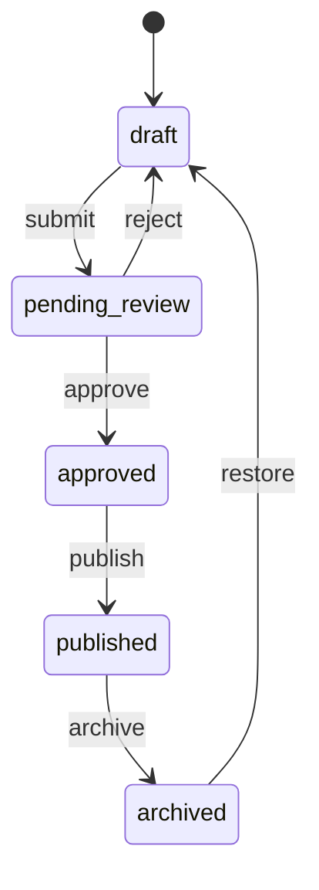

# AgainERP — Product Master Architecture

> **Status:** Approved  
> **Version:** 1.0  
> **Module:** Core Platform · Product Domain  
> **Document Type:** Enterprise Architecture  
> **Phase:** Documentation First · UI/UX Planning  
> **Governance:** [GOVERNANCE.md](../../GOVERNANCE.md) · **Standards:** [DEVELOPMENT_STANDARDS.md](../../DEVELOPMENT_STANDARDS.md)

**No backend code. No database implementation. No API implementation.**  
This document is the source of truth for the **single shared Product Master** used across all AgainERP modules and industries.

### Step 01 Requirements (Satisfied)

| Requirement | Section |
|-------------|---------|
| Product is a shared core entity | §1 Purpose · §2 Product Master Vision |
| Used by Ecommerce, Inventory, Purchase, Sales, CRM, Marketing | §2 Product Master Vision |
| One Product Master only · No duplicate product entities | §2 · §15 Architecture Rules |
| Profile Based Specification System | §5 Product Specification Architecture |
| Variant Support | §6 Product Variant Architecture |
| Bundle Support · Kit Support · Subscription Product Support | §3 Product Types · §7 Product Relationship Architecture |
| Activity System Integration | §9 Product Activity Integration |
| AI Integration | §10 Product AI Integration |
| Approval Workflow Integration | §8 Product Lifecycle |

**Related:** [ACTIVITY_CHATTER_ARCHITECTURE.md](./ACTIVITY_CHATTER_ARCHITECTURE.md) · [CRM_MODULE_ARCHITECTURE.md](../crm/CRM_MODULE_ARCHITECTURE.md) · [modules/sales/SALES_MODULE_ARCHITECTURE.md](../sales/SALES_MODULE_ARCHITECTURE.md) · [modules/inventory/INVENTORY_MODULE_ARCHITECTURE.md](../inventory/INVENTORY_MODULE_ARCHITECTURE.md) · [modules/purchase/PURCHASE_MODULE_ARCHITECTURE.md](../purchase/PURCHASE_MODULE_ARCHITECTURE.md) · [modules/ecommerce/catalog/ARCHITECTURE.md](../ecommerce/catalog/ARCHITECTURE.md) · [modules/ecommerce/catalog/SPECIFICATIONS_ARCHITECTURE.md](../ecommerce/catalog/SPECIFICATIONS_ARCHITECTURE.md) · [core/entities/activities.md](../../core/entities/activities.md) · [core/engines/WORKFLOW_ENGINE_ARCHITECTURE.md](../../core/engines/WORKFLOW_ENGINE_ARCHITECTURE.md)

---

## Executive Summary

AgainERP is an AI-first ERP, Ecommerce, CRM, SaaS, Marketplace, and multi-industry platform built as a **Modular Monolith** with **Domain-Driven Design**, **API-first** contracts, **event-driven** integration, **PostgreSQL**, **FastAPI**, and **Next.js**.

The **Product Master** is the canonical business entity for anything sellable, stockable, billable, or merchandised. There is **exactly one Product Master**. Ecommerce Catalog, Inventory, Purchase, Sales, CRM, Marketing, Manufacturing, POS, Hospital, Restaurant, and School modules **consume** Product Master — they never duplicate it.

| Principle | Rule |
|-----------|------|
| Single source of truth | One `product` domain, one identity graph |
| Module consumption | Modules attach behavior, never fork product tables |
| Activity everywhere | Every product record has timeline, audit, chatter |
| AI native | Catalog, SEO, and Inventory agents operate on Product Master |
| Future proof | Industry extensions via profiles, specs, and metadata — not new entities |

---

## 1. Purpose

### Why Product Master Is the Core Business Entity

Product is the atomic unit of commercial value. Every operational module ultimately references the same question: **what are we selling, stocking, buying, or promoting?**

Without a unified Product Master:

| Problem | Impact |
|---------|--------|
| Duplicate product tables per module | Data drift, reconciliation cost |
| Different SKUs in Inventory vs Storefront | Fulfillment errors, wrong picks |
| Pricing silos | Margin leakage, inconsistent quotes |
| SEO metadata fragmentation | Poor search ranking, broken schema |
| No shared audit trail | Compliance failure, untraceable changes |
| AI trained on inconsistent data | Wrong recommendations, bad forecasts |

Product Master eliminates duplication and becomes the **commercial spine** of AgainERP — the entity that connects merchandising, operations, finance, and intelligence.

### What Product Master Owns

- Identity (name, SKU, barcode, type, lifecycle)
- Merchandising (media, SEO, collections, relationships)
- Commercial attributes (pricing references, tax class)
- Technical attributes (specifications via profiles)
- Variant matrix (sellable units)
- AI enrichment metadata
- Activity, approval, and workflow state

### What Product Master Does Not Own

| Concern | Owner Module |
|---------|--------------|
| Stock quantities, reservations, warehouses | Inventory |
| Supplier quotes, PO lines | Purchase |
| Order lines, quotations | Sales / Orders |
| Campaign targeting rules | Marketing |
| GL accounts, COGS posting | Accounting |
| Patient formulary logic | Hospital (consumes product + industry profile) |

Modules read and write **through Product Master APIs and events** — never by cloning schema.

---

## 2. Product Master Vision

### Central Design Principle

> **One Product Master. All modules consume. Never duplicate.**

Product Master is the **Shared Kernel** of AgainERP — the canonical identity for anything commercial. Ecommerce, Inventory, Purchase, Sales, CRM, and Marketing are **consumers**, not owners of product data.

### Platform Position

```text
                    ┌─────────────────────────────────────┐
                    │         Product Master (Core)        │
                    │   Identity · Specs · Variants · AI   │
                    └─────────────────┬───────────────────┘
                                      │
        ┌──────────────┬──────────────┼──────────────┬──────────────┐
        ▼              ▼              ▼              ▼              ▼
    Catalog       Inventory       Purchase         Sales        Marketing
   (merchandise)   (stock)      (supply)        (revenue)     (promotion)
        │              │              │              │              │
        └──────────────┴──────────────┴──────────────┴──────────────┘
                                      │
                              Event Bus (domain events)
```

### Module Flow

```text
Product Master
     ↓
Catalog          → Storefront visibility, collections, SEO URLs, reviews
     ↓
Inventory        → Stock levels, reservations, warehouse mapping per variant
     ↓
Purchase         → Supplier mapping, cost price, reorder rules
     ↓
Sales            → Quotations, order lines, pricing tiers
     ↓
Marketing        → Coupons, bundles in campaigns, recommendations
```

### Consumption Model

| Layer | Responsibility |
|-------|----------------|
| **Product Master (Core)** | Canonical record, lifecycle, specs, variants, relationships |
| **Catalog (Ecommerce)** | Merchandising UX, approval queue, bulk import, storefront config |
| **Inventory** | `inventory_item_id` per variant; qty never stored on product core |
| **Purchase** | Supplier SKU map, lead time, last cost |
| **Sales** | Line-item reference by `variant_id`; price from price list engine |
| **CRM** | Customer interest, wishlists, purchase history joins |
| **Marketing** | Segment rules, cross-sell graphs, campaign product sets |

### Event-Driven Integration

Product Master publishes domain events. Modules subscribe — no direct cross-module table writes.

| Event | Subscribers |
|-------|-------------|
| `product.created` | Search index, AI enrichment queue |
| `product.updated` | Cache invalidation, storefront sync |
| `product.price_changed` | Marketing, Accounting alerts |
| `product.published` | Storefront, Marketplace channels |
| `product.archived` | Inventory freeze, Sales block |
| `variant.stock_linked` | Inventory reservation rules |

**Architecture style:** Modular Monolith · Domain-Driven Design · API-first · Event-driven · PostgreSQL · FastAPI · Next.js. Product is a **Shared Kernel** bounded context.

### Vision Statement

AgainERP treats Product Master as the **central nervous system of commerce**:

- **One record** per sellable identity — not per module
- **One specification language** — profile-based, not hardcoded columns
- **One lifecycle** — draft through publish with approval gates
- **One activity trail** — every change auditable and collaborative
- **One AI context** — agents enrich the same truth, not module silos

Future modules (Manufacturing, POS, Hospital, Restaurant, School) **plug into** Product Master — they never fork it.

---

## 3. Product Types

All types share the same `product_master` record. Behavior differs by `product_type` — not by separate entities.

| Type | Code | Sellable Unit | Stock | Example |
|------|------|---------------|-------|---------|
| **Physical Product** | `physical` | Product or variant | Yes | Cotton T-Shirt |
| **Digital Product** | `digital` | Product / license key | No | eBook, software |
| **Service** | `service` | Product | Optional | Installation, warranty |
| **Bundle** | `bundle` | Bundle SKU | Derived from components | Camera kit |
| **Kit** | `kit` | Kit SKU | Component-driven | PC build kit |
| **Subscription** | `subscription` | Plan + interval | Optional | Monthly box |
| **Variant Product** | `variable` | Variants only | Per variant | iPhone (Color × Storage) |

> **Note:** Ecommerce Catalog docs may alias `physical` as `simple` for historical compatibility. Product Master normalizes to `physical`.

### Type Behavior Matrix

| Type | Parent sellable? | Variant required? | Shipping | Digital delivery |
|------|------------------|-------------------|----------|------------------|
| Physical | Yes (if no variants) | Optional | Yes | No |
| Digital | Yes | Optional | No | Yes |
| Service | Yes | No | Optional | N/A |
| Bundle | Yes (bundle price) | N/A | Yes | N/A |
| Kit | Yes | N/A | Yes | N/A |
| Subscription | Yes | Plan variants | Optional | Optional |
| Variable | **No** | **Required** | On variant | Per variant |

### Future Expansion Support

New industries and product classes extend via:

1. **`product_type` enum extension** — additive only, never parallel tables
2. **Specification profiles** — Hospital `MedicalDeviceProfile`, Restaurant `MenuItemProfile`
3. **Industry metadata JSON** — validated by profile schema, not free-form blobs
4. **Plugin hooks** — Marketplace apps attach fields through approved extension points

```text
Product Master (unchanged identity)
     ↓
+ Industry Profile (Hospital / Restaurant / Manufacturing)
     ↓
+ Specification Profile (domain-specific fields)
     ↓
+ Module Extensions (read-only views in POS, MRP, etc.)
```

---

## 4. Product Core Structure

Product Master decomposes into **logical domains**. Each domain has a clear owner and API surface.

```text
product_master
├── Product Core
├── Product Media
├── Product Pricing
├── Product Inventory (mapping only)
├── Product Specifications
├── Product SEO
├── Product AI Data
└── Product Activities
```

### 4.1 Product Core

Foundation identity and lifecycle.

| Field Group | Examples |
|-------------|----------|
| Identity | `id`, `company_id`, `name`, `internal_name`, `sku`, `barcode`, `model` |
| Classification | `product_type`, `primary_category_id`, `brand_id` |
| Lifecycle | `lifecycle_status`, `visibility`, `published_at` |
| Descriptions | `short_description`, `description` (translatable) |
| Flags | `is_featured`, `is_taxable`, `requires_shipping` |
| Audit | `created_by`, `updated_by`, `approved_by`, timestamps |

**Rules:** Core fields are module-agnostic. No module may add required columns to core without ADR approval.

### 4.2 Product Media

Uses Core [Media Library](../../core/entities/media-library.md) and [Attachments](../../core/entities/attachments.md).

| Collection | Purpose |
|------------|---------|
| `thumbnail` | List/grid primary image |
| `gallery` | PDP image carousel |
| `videos` | Product video assets |
| `documents` | Manuals, spec sheets, MSDS |
| `360` | Spin / AR assets |

Never store file paths on `product_master`. All media via attachment polymorphic relation.

### 4.3 Product Pricing

Pricing is a **cross-cutting engine** — Product Master holds price **references**; price lists and schedules live in the pricing subdomain.

| Price Type | Scope |
|------------|-------|
| `cost_price` | Landed cost (Inventory/Purchase feed) |
| `purchase_price` | Last PO price |
| `selling_price` | Default retail |
| `special_price` | Promo window |
| `wholesale_price` | B2B tier |
| `dealer_price` | Channel partner |

Scoped by: `company_id`, optional `branch_id`, optional `customer_group_id`, optional `currency_code`.

Variant-level prices override parent when `product_type = variable`.

### 4.4 Product Inventory

Product Master stores **mapping only**:

```text
product_variant.inventory_item_id → inventory.items
```

| Stored on Product | Stored on Inventory |
|-------------------|---------------------|
| `inventory_item_id` | `qty_on_hand`, `qty_reserved`, `qty_available` |
| `track_inventory` flag | Warehouse locations, bins, lots |
| `min_qty`, `max_qty` alerts | Transfers, adjustments |

Stock changes emit `product.stock_changed` events → Activity timeline.

### 4.5 Product Specifications

Profile-based specification system (see §5). Values attach to product or variant.

### 4.6 Product SEO

Per-locale SEO records:

| Field | Purpose |
|-------|---------|
| `slug` | Canonical URL segment |
| `meta_title` | SERP title |
| `meta_description` | SERP description |
| `canonical_url` | Override |
| `schema_type` | Product, Service, Book, etc. |
| `robots` | index/noindex rules |
| `og_image_id` | Social share image |

SEO Agent reads/writes this domain (see §10).

### 4.7 Product AI Data

| Field | Purpose |
|-------|---------|
| `ai_generated_content` | JSON: descriptions, bullets, tags |
| `ai_seo_score` | 0–100 optimization score |
| `ai_category_suggestions` | Ranked category matches |
| `ai_attribute_mappings` | Spec field confidence map |
| `ai_optimization_status` | `pending` · `optimized` · `manual` |
| `ai_last_run_at` | Last agent execution |
| `ai_embedding_vector` | Semantic search (future pgvector) |

AI outputs are **suggestions until approved** — never auto-publish without policy.

### 4.8 Product Activities

Every product integrates [Activity & Chatter](./ACTIVITY_CHATTER_ARCHITECTURE.md):

- Activities · Comments · Notes · Attachments · Followers · Mentions · AI Actions · History

See §9 for tracked events.

---

## 5. Product Specification Architecture

AgainERP uses a **Profile Based Specification System** — not hardcoded attribute columns per category.

### Hierarchy

```text
Specification Profile
      ↓
Specification Group
      ↓
Specification Field
      ↓
Product Specification Value
```

### Layer Definitions

| Layer | Purpose | Example |
|-------|---------|---------|
| **Profile** | Reusable template for a product class | `Business Laptop`, `Running Shoe`, `Restaurant Menu Item` |
| **Group** | UI/logical section within profile | `Display`, `Performance`, `Nutrition` |
| **Field** | Typed attribute definition | `Screen Size (in)`, `RAM (GB)`, `Calories` |
| **Value** | Instance data on product/variant | `15.6`, `16`, `420` |

**Full specification:** [SPECIFICATIONS_ARCHITECTURE.md](../ecommerce/catalog/SPECIFICATIONS_ARCHITECTURE.md)

### Field Capabilities

| Capability | Flag | Behavior |
|------------|------|----------|
| **Filterable** | `is_filterable` | Appears in storefront faceted navigation |
| **Comparable** | `is_comparable` | Included in product comparison table |
| **Searchable** | `is_searchable` | Indexed in catalog full-text search |
| **AI Searchable** | `is_ai_searchable` | Embedded for semantic / natural language search |

### Field Types

`text` · `number` · `boolean` · `select` · `multi_select` · `range` · `date` · `url` · `color` · `dimension`

### Profile Assignment

```text
Category → default Specification Profile
Product  → assigned Profile(s) + optional overrides
Variant  → inherit + variant-specific spec values (e.g., Color=Red)
```

### AI Specification Import

Catalog Agent maps supplier text / PDF / CSV → structured spec values with confidence scores. Low-confidence fields enter **review queue** before publish.

---

## 6. Product Variant Architecture

Variable products (`product_type = variable`) define a **variant matrix** from attribute dimensions. **Variant Support** is first-class — each variant is the sellable unit.

### Attribute Dimensions

| Dimension | Example Values |
|-----------|----------------|
| Color | Red, Blue, Black |
| Size | S, M, L, XL |
| Storage | 128GB, 256GB, 512GB |
| RAM | 8GB, 16GB, 32GB |

### Variant Record

Each variant is a first-class sellable unit:

| Field | Per Variant |
|-------|-------------|
| SKU | **Yes** — unique per company |
| Barcode | **Yes** — EAN/UPC optional |
| Price | **Yes** — overrides parent price list |
| Stock | **Yes** — via `inventory_item_id` |
| Media | Optional — variant-specific gallery |
| Specifications | Optional — dimension values + overrides |
| Weight / dimensions | **Yes** — for shipping |

### Matrix Generation

```text
Parent Product (not purchasable)
├── Variant: Red / M    → SKU-RED-M
├── Variant: Red / L    → SKU-RED-L
├── Variant: Blue / M   → SKU-BLU-M
└── Variant: Blue / L   → SKU-BLU-L
```

### Rules

- Parent variable product **cannot** be added to cart — only variants
- Deleting a variant soft-deletes; historical order lines retain reference
- Variant SKU/barcode uniqueness enforced at `company_id` scope
- Bulk variant generation via matrix UI or CSV import

---

## 7. Product Relationship Architecture

Merchandising and operational relationships are **typed edges** — not duplicate products. **Bundle Support** and **Kit Support** are modeled as relationship types on the same Product Master.

### Relationship Types

| Type | Code | Purpose |
|------|------|---------|
| **Related Products** | `related` | Similar items, same category alternatives |
| **Cross Sell** | `cross_sell` | Complementary at checkout |
| **Up Sell** | `up_sell` | Premium alternative on PDP |
| **Accessories** | `accessories` | Add-on items (case, charger) |
| **Bundles** | `bundle_component` | Fixed bundle composition |
| **Kits** | `kit_component` | Assembled kit parts |

### Graph Model

```text
product_relationships
├── source_product_id (or variant_id)
├── target_product_id (or variant_id)
├── relationship_type
├── sort_order
├── quantity (bundles/kits)
└── is_required (kit/bundle)
```

### Bundle Support

| Aspect | Behavior |
|--------|----------|
| Identity | Single bundle SKU on Product Master |
| Components | `bundle_component` edges to child products/variants |
| Pricing | Bundle price (may discount sum of components) |
| Stock | Min component qty or dedicated bundle stock |
| Cart | One line item |

### Kit Support

| Aspect | Behavior |
|--------|----------|
| Identity | Kit SKU on Product Master |
| Components | `kit_component` edges with required/optional flags |
| Pricing | Fixed kit price or sum of parts |
| Stock | Component consumption on fulfillment |
| Use case | PC builds, meal combos, assembly sets |

### Subscription Product Support

| Aspect | Behavior |
|--------|----------|
| Type code | `subscription` |
| Billing | Plan + interval (monthly, yearly) |
| Variants | Plan tiers as variant matrix |
| Stock | Optional (physical subscription boxes) |
| Renewal | Subscription engine references same `product_id` |

---

## 8. Product Lifecycle

### Workflow States

```text
Draft
  ↓ submit
Pending Review
  ↓ approve          ↘ reject
Approved              → Draft
  ↓ publish
Published
  ↓ archive
Archived
```

### State Definitions

| State | Code | Storefront | Description |
|-------|------|------------|-------------|
| Draft | `draft` | Hidden | Work in progress |
| Pending Review | `pending_review` | Hidden | Submitted for approval |
| Approved | `approved` | Hidden | Approved, not yet live |
| Published | `published` | Visible | Live across configured channels |
| Archived | `archived` | Hidden | Discontinued; history preserved |

Additional states: `hidden` (temporary unpublish), soft `deleted` (compliance retention).

### Approval Workflow Integration

Product lifecycle integrates [Approval Engine](../../core/engines/APPROVAL_ENGINE_ARCHITECTURE.md) and [Workflow Engine](../../core/engines/WORKFLOW_ENGINE_ARCHITECTURE.md). **Approval Workflow Integration** is mandatory — no product reaches `published` without policy compliance.

| Transition | Permission | Approval Policy |
|------------|------------|-----------------|
| Submit for review | `product.submit` | Optional auto-route by category |
| Approve / Reject | `product.approve` | Multi-level by price threshold or category |
| Publish | `product.publish` | May require second approver for regulated industries |
| Archive | `product.archive` | Manager approval if active stock > 0 |
| Delete | `product.delete` | Admin + audit reason required |

Approval outcomes write to Activity timeline (`approval_change`) and emit `product.approval_changed` domain events.



---

## 9. Product Activity Integration

Every Product Master record **must** support the global [Activity & Chatter](./ACTIVITY_CHATTER_ARCHITECTURE.md) platform. **Activity System Integration** is mandatory for all product records.

### Required Capabilities

| Capability | Description |
|------------|-------------|
| **Activities** | Structured timeline entries |
| **Comments** | Team discussion with @mentions |
| **Notes** | Internal-only notes |
| **Attachments** | Spec sheets, images, contracts |
| **Followers** | Users notified on changes |
| **Mentions** | `@user` in comments |
| **AI Actions** | Logged agent runs with diff |
| **History** | Field-level audit trail |

### Tracked Events

| Event | Activity Type | Audit Detail |
|-------|---------------|--------------|
| Create | `create` | Initial snapshot |
| Update | `update` | Field-level diff |
| Delete | `delete` | Soft delete reason |
| Price Change | `price_change` | Old/new price, price list, user |
| Stock Change | `stock_change` | Qty delta, warehouse (via Inventory event) |
| Approval Change | `approval_change` | Approver, decision, comment |
| Publish | `status_change` | Lifecycle transition |
| AI Apply | `ai_action` | Agent, prompt version, applied fields |

### UI Integration

- **Product List** — Activity icon column → Global Activity Drawer
- **Product Detail** — Activity tab + inline history on price/spec changes
- **Product Create** — Activity starts on first save (draft create)

Entity reference: `{ type: "product", id: "<uuid>", label: "<sku> — <name>" }`

---

## 10. Product AI Integration

Product Master is **AI-native**. **AI Integration** connects Catalog, SEO, and Inventory agents to canonical product data — never module silos.

### Agent Roles

| Agent | Domain | Primary Capabilities |
|-------|--------|---------------------|
| **Catalog Agent** | Core + Specs | Description generation, attribute mapping, category suggestion, spec import |
| **SEO Agent** | Product SEO | Meta title/description, slug, schema.org JSON-LD, keyword optimization |
| **Inventory Agent** | Inventory mapping | Demand forecast, reorder suggestions, slow-mover alerts |

### Capabilities Matrix

| Capability | Agent | Input | Output |
|------------|-------|-------|--------|
| Description Generation | Catalog | Name, specs, category, brand voice | HTML description + bullets |
| SEO Generation | SEO | Description, specs, competitors | Meta tags, schema, score |
| Attribute Mapping | Catalog | Supplier text, PDF, CSV | Spec field values + confidence |
| Category Suggestion | Catalog | Title, specs, images | Ranked category paths |
| Pricing Suggestions | Catalog + Finance | Cost, margin rules, market data | Price range recommendation |
| Inventory Forecasting | Inventory | Sales velocity, seasonality | Reorder qty, safety stock |

### AI Governance

1. **Suggest → Review → Apply** — default mode; no silent publish
2. All AI runs logged in Activity `AI Actions` tab
3. Prompt versions tracked for reproducibility
4. Tenant AI budget enforced via Control Center
5. Human approval required for regulated categories (Medical, Food)

### AI Data Flow

```text
Product Master
     ↓
AI Context Engine (product snapshot + specs + history)
     ↓
Catalog / SEO / Inventory Agent
     ↓
Suggestion Queue (product_ai_suggestions)
     ↓
Human Review OR Auto-apply (policy)
     ↓
Product Master Update + Activity Log
```

---

## 11. Product Permissions

Permissions follow `Product.{Action}` namespace. Registered in Core [Permissions](../../core/entities/permissions.md).

### Core Permissions

| Permission | Description |
|------------|-------------|
| `Product.View` | Read product records |
| `Product.Create` | Create draft products |
| `Product.Edit` | Edit product fields |
| `Product.Delete` | Soft delete products |
| `Product.Approve` | Approve/reject pending products |
| `Product.Publish` | Publish to channels |
| `Product.Export` | Bulk export |
| `Product.Import` | Bulk import |
| `Product.Price.Edit` | Change pricing |
| `Product.Spec.Edit` | Edit specifications |
| `Product.AI.Apply` | Apply AI suggestions |

### Role Examples

| Role | Permissions |
|------|-------------|
| Product Viewer | `Product.View` |
| Product Editor | View, Create, Edit, Spec.Edit |
| Catalog Manager | Editor + Approve, Publish, Import, Export |
| Pricing Manager | View, Price.Edit |
| Admin | All |

Row-level security: scoped by `company_id`, optional `branch_id` for multi-branch tenants.

---

## 12. Product UI Architecture

### Design Blend

| Weight | Source | Applied To |
|--------|--------|------------|
| **60%** | Odoo | Form layout, smart buttons, chatter, approval bar, spec groups |
| **20%** | Shopify | Product list density, variant matrix, media gallery |
| **10%** | Notion | Clean typography, inline editing feel, minimal chrome |
| **10%** | Linear | Status pills, keyboard shortcuts, fast navigation |

**Phase:** UI/UX Planning · Prototype reference: [ui-prototype/catalog/products/](../../ui-prototype/catalog/products/)

### 12.1 Product List Page

**Route:** `/catalog/products`

| Zone | Content |
|------|---------|
| Header | Title, count, Import/Export, + Add Product |
| Toolbar | Search, Status, Category, Brand, Stock, Price range |
| Grid | AG Grid — thumbnail, name, SKU, price, stock, status, updated, Activity |
| Bulk actions | Publish, archive, export, assign category |
| Mobile | Card list + FAB |

### 12.2 Product Create Page

**Route:** `/catalog/products/new`

| Zone | Content |
|------|---------|
| Header | Save Draft · Save & Publish · Cancel |
| Main | Name, type, category, brand, descriptions |
| Sidebar | Status, visibility, tags, SEO preview |
| Tabs | General · Media · Pricing · Inventory · Specs · Variants · SEO · Relations |

Progressive disclosure — show Variant tab only when `product_type = variable`.

### 12.3 Product Detail Page

**Route:** `/catalog/products/{id}`

| Zone | Content |
|------|---------|
| Header | SKU, status badge, smart buttons (Inventory, Orders, SEO score) |
| Body | Read-optimized summary + tabbed deep edit |
| Right rail | Key metrics, approval status, quick actions |

Odoo-style smart buttons link to Inventory, Sales history, Reviews — without leaving product context.

### 12.4 Product Activity Drawer

Global right drawer ([ACTIVITY_CHATTER_ARCHITECTURE.md](./ACTIVITY_CHATTER_ARCHITECTURE.md)):

| Tab | Product-Specific Content |
|-----|--------------------------|
| Overview | Type, status, stock snapshot, last price change |
| Activities | Timeline — create, update, price, approval |
| Comments | Team thread with mentions |
| Notes | Internal procurement/merchandising notes |
| Attachments | Spec sheets, supplier quotes |
| Followers | Category managers, approvers |
| AI Actions | Description/SEO runs with diffs |

### 12.5 Product AI Panel

Collapsible panel on Create/Detail (not always-visible heavy rail):

| Section | Content |
|---------|---------|
| Suggestions | Pending AI outputs with accept/reject per field |
| SEO Score | 0–100 with improvement checklist |
| Category | AI-suggested category path |
| Inventory | Reorder hint (from Inventory Agent) |

One-line risk/hint when panel collapsed — full panel on demand.

---

## 13. Global Search Integration

Product Master is indexed once; consumed everywhere.

### Search Surfaces

| Surface | Index Scope | UX |
|---------|-------------|-----|
| **Global Search** | SKU, name, barcode, tags | CMD+K palette — jump to product detail |
| **AI Search** | Semantic embedding + specs | Natural language: "15 inch laptop 16GB RAM" |
| **Catalog Search** | Full merchandising index | Admin grid filters + storefront query |
| **Inventory Search** | SKU, barcode, warehouse | Stock lookup, pick lists |

### Index Document Shape

```json
{
  "entity": "product",
  "id": "uuid",
  "company_id": "uuid",
  "sku": "SKU-001",
  "name": "Product Name",
  "product_type": "variable",
  "lifecycle_status": "published",
  "category_path": ["Electronics", "Laptops"],
  "brand": "Brand Name",
  "specs_flat": { "ram_gb": 16, "screen_in": 15.6 },
  "search_text": "…",
  "embedding": [ … ]
}
```

**Engine:** [Global Search Architecture](../../core/engines/GLOBAL_SEARCH_ARCHITECTURE.md) — Meilisearch indexing, permission-filtered results.

### Event-Driven Index Updates

`product.created` · `product.updated` · `product.published` · `product.archived` → async index job via queue.

---

## 14. Future Industry Compatibility

Product Master supports all industries through **type + profile + extension** — never duplicate entities.

| Industry | Product Usage | Extension Mechanism |
|----------|---------------|---------------------|
| **Ecommerce** | Full catalog, variants, SEO, reviews | Catalog module UI |
| **Inventory** | Stock per variant, warehouses | `inventory_item_id` mapping |
| **Purchase** | Supplier SKU, MOQ, lead time | Purchase product extension table |
| **Sales** | Quotes, order lines | `variant_id` on line items |
| **CRM** | Customer product interests | CRM joins on `product_id` |
| **Manufacturing** | BOM, raw materials, finished goods | `product_type` + BOM relationships (future) |
| **POS** | Barcode scan, quick sale | POS reads variant by barcode API |
| **Hospital** | Medicines, consumables, equipment | `MedicalProductProfile` specs (Rx, dosage) |
| **Restaurant** | Menu items, modifiers, recipes | `MenuItemProfile` + kit/bundle for combos |
| **School** | Books, uniforms, fees-as-service | `product_type = service` + education profiles |

### Industry Extension Rule

```text
✅ Add Specification Profile for industry fields
✅ Add module extension table keyed by product_id
✅ Add workflow/approval policy per industry

❌ Create hospital_products, restaurant_products, shop_products tables
❌ Fork SKU namespace per module
❌ Duplicate media or pricing engines
```

---

## 15. Architecture Rules

These rules are **non-negotiable** for all modules, agents, and future industries.

| # | Rule |
|---|------|
| 1 | **One Product Master Only** — single canonical `product` domain |
| 2 | **No Duplicate Product Entities** — modules consume, never clone |
| 3 | **Activity Enabled** — every product has timeline + audit ([ACTIVITY_CHATTER_ARCHITECTURE.md](./ACTIVITY_CHATTER_ARCHITECTURE.md)) |
| 4 | **AI Enabled** — Catalog, SEO, Inventory agents operate on Product Master |
| 5 | **Workflow Enabled** — lifecycle transitions use Workflow + Approval engines |
| 6 | **Approval Enabled** — regulated publishes require approver chain |
| 7 | **Future Proof** — extend via profiles, types, events — not schema forks |
| 8 | **Multi Industry Ready** — Hospital, Restaurant, School via profiles |
| 9 | **API First** — all access through versioned Product API |
| 10 | **Event Driven** — state changes publish domain events |
| 11 | **Specification Profile Based** — no hardcoded per-category columns |
| 12 | **Variant Is Sellable Unit** — variable parents never sold directly |
| 13 | **Inventory Separation** — qty lives in Inventory, not Product Master |
| 14 | **Media via Core** — attachments only, no path strings on product |
| 15 | **Documentation Before Code** — [PRE_CODE_GATE.md](../../PRE_CODE_GATE.md) |

### Anti-Patterns (Forbidden)

```text
❌ ecommerce_products + inventory_products + pos_products
❌ Storing stock qty on catalog_products
❌ Module-specific SKU generation rules without central registry
❌ Skipping activity log on price or lifecycle change
❌ AI auto-publish without tenant policy
❌ Hardcoded attributes per category in application code
```

---

## Appendix A — Domain Model (Conceptual)

```text
product_master
├── product_core
├── product_translations
├── product_variants[]
├── product_prices[]
├── product_seo[]
├── product_spec_values[]
├── product_relationships[]
├── product_ai_metadata
└── product_channel_visibility[]

product_variant
├── sku, barcode, price_override
├── inventory_item_id
├── spec_values[]
└── media_attachments[]
```

**Planned table namespace (implementation phase):** `product_*` or continued `catalog_*` with Product Master as domain alias — decision at database implementation gate via ADR.

---

## Appendix B — Related Documents

| Document | Relationship |
|----------|--------------|
| [modules/inventory/INVENTORY_MODULE_ARCHITECTURE.md](../inventory/INVENTORY_MODULE_ARCHITECTURE.md) | Inventory module — stock ledger |
| [modules/purchase/PURCHASE_MODULE_ARCHITECTURE.md](../purchase/PURCHASE_MODULE_ARCHITECTURE.md) | Purchase module — procure-to-pay |
| [modules/sales/SALES_MODULE_ARCHITECTURE.md](../sales/SALES_MODULE_ARCHITECTURE.md) | Sales module — quote-to-cash |
| [CRM_MODULE_ARCHITECTURE.md](../crm/CRM_MODULE_ARCHITECTURE.md) | CRM — pipeline, customer intelligence |
| [modules/ecommerce/catalog/ARCHITECTURE.md](../ecommerce/catalog/ARCHITECTURE.md) | Ecommerce Catalog module — primary Product UI |
| [modules/ecommerce/catalog/SPECIFICATIONS_ARCHITECTURE.md](../ecommerce/catalog/SPECIFICATIONS_ARCHITECTURE.md) | Specification profiles detail |
| [ACTIVITY_CHATTER_ARCHITECTURE.md](./ACTIVITY_CHATTER_ARCHITECTURE.md) | Mandatory activity platform |
| [SETTINGS_ARCHITECTURE.md](./SETTINGS_ARCHITECTURE.md) | Catalog business settings |
| [core/engines/WORKFLOW_ENGINE_ARCHITECTURE.md](../../core/engines/WORKFLOW_ENGINE_ARCHITECTURE.md) | Lifecycle workflows |
| [core/engines/APPROVAL_ENGINE_ARCHITECTURE.md](../../core/engines/APPROVAL_ENGINE_ARCHITECTURE.md) | Approval policies |
| [core/engines/GLOBAL_SEARCH_ARCHITECTURE.md](../../core/engines/GLOBAL_SEARCH_ARCHITECTURE.md) | Global search indexing |
| [modules/ai/AI_OS_ARCHITECTURE.md](../ai/AI_OS_ARCHITECTURE.md) | AI agent platform |
| [ui-prototype/catalog/products/ProductList.md](../../ui-prototype/catalog/products/ProductList.md) | List UI prototype |
| [ui-prototype/catalog/products/AddProduct.md](../../ui-prototype/catalog/products/AddProduct.md) | Create UI prototype |

---

## Appendix C — Prototype Routes (UI Phase)

| Screen | Route |
|--------|-------|
| Product List | `/catalog/products` |
| Add Product | `/catalog/products/new` |
| Edit Product | `/catalog/products/{id}/edit` |
| Product Detail | `/catalog/products/{id}` |
| Specification Profiles | `/catalog/specifications/profiles` |
| Product Approval | Catalog approval queue (planned) |

---

## Document Control

| Field | Value |
|-------|-------|
| **Owner** | Platform Team |
| **Reviewers** | Architecture, Catalog, AI, Inventory |
| **Next Review** | At database implementation gate |
| **Status Gate** | Documentation First — Ready for UI/UX Planning |

**Changelog:** [CHANGELOG.md](../../CHANGELOG.md)
