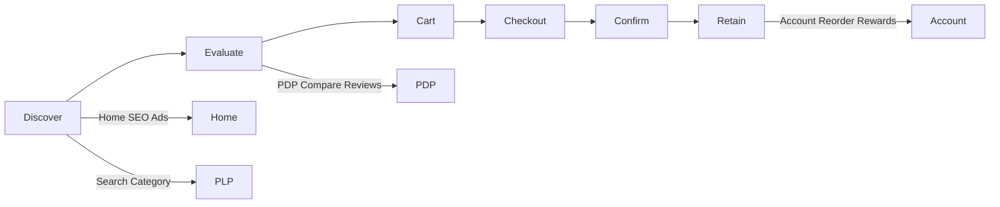

# AgainERP — Ecommerce Storefront Architecture

> **Status:** Approved  
> **Version:** 1.0  
> **Project:** AgainERP  
> **Document Type:** Enterprise Storefront Architecture  
> **Scope:** Customer-facing ecommerce website only — not admin panel, not ERP  
> **Governance:** [GOVERNANCE.md](../../GOVERNANCE.md) · **Standards:** [DEVELOPMENT_STANDARDS.md](../../DEVELOPMENT_STANDARDS.md)

**No ERP UI. No direct database access. API-first storefront only.**

> **Prototype (2026-06-13):** Next.js `(storefront)` route group implements **AgainShop** at `/shop/*` with mock data. As-built: [ui-prototype/storefront/IMPLEMENTED_DESIGN.md](../../ui-prototype/storefront/IMPLEMENTED_DESIGN.md). Production migrates to `/api/v1/storefront/*` per §20.

### Ecommerce Storefront Architecture (Satisfied)

| Requirement | Section |
|-------------|---------|
| Storefront overview & user journey | §1 |
| Public pages | §2 |
| Home, category, product pages | §3–§5 |
| Search, cart, checkout | §6–§8 |
| Customer account | §9 |
| Reviews & AI features | §10–§11 |
| SEO & performance | §12–§13 |
| Mobile & multi-store | §14–§15 |
| Activity, analytics, future | §16–§18 |
| UI/UX & architecture rules | §19–§20 |

**Related:** [catalog/ARCHITECTURE.md](./catalog/ARCHITECTURE.md) · [orders/ARCHITECTURE.md](./orders/ARCHITECTURE.md) · [builder/ARCHITECTURE.md](./builder/ARCHITECTURE.md) · [customers/ARCHITECTURE.md](./customers/ARCHITECTURE.md) · [seo/ARCHITECTURE.md](./seo/ARCHITECTURE.md) · [GLOBAL_SEARCH_ARCHITECTURE.md](../../core/engines/GLOBAL_SEARCH_ARCHITECTURE.md) · [ENTITY_CATALOG.md](./catalog/ENTITY_CATALOG.md)

---

## Executive Summary

| Principle | Rule |
|-----------|------|
| **Storefront ≠ Admin** | Separate route tree, layout, auth scope, and deployment option |
| **API only** | All data via `/api/v1/storefront/*` — never ERP tables |
| **Mobile first** | Design for 375px; progressive enhancement to desktop |
| **SEO first** | SSR/ISR, schema, clean URLs, Core Web Vitals targets |
| **AI ready** | Recommendations, search, assistant, summaries — opt-in per store |
| **Conversion optimized** | Fast PDP, frictionless checkout, trust signals |

```text
Vision: Modern AI-powered storefront
Influence: Shopify · Amazon · Apple · Nike · Notion
Stack: Next.js · TypeScript · Tailwind · Shadcn · Recharts · CMDK
Rendering: Server Components · ISR · SSR
```

---

## Frontend Technology

| Layer | Choice | Role |
|-------|--------|------|
| **Framework** | Next.js (App Router) | SSR, ISR, RSC, API routes as BFF optional |
| **Language** | TypeScript | End-to-end type safety with API contracts |
| **Styling** | Tailwind CSS | Utility-first, design tokens from Builder themes |
| **Components** | Shadcn UI | Accessible primitives — cart, checkout, account |
| **Charts** | Recharts | Account dashboard mini charts (orders, rewards) |
| **Command palette** | CMDK | Instant search overlay, keyboard navigation |
| **Rendering** | Server Components default | Client islands for cart, filters, AI chat |
| **Caching** | ISR + CDN | Product/category pages; stale-while-revalidate |
| **State** | Server + cookies/localStorage | Cart ID cookie; wishlist when authenticated |

### Deployment Model

```text
Option A (monorepo):  apps/storefront/     → shop.example.com
Option B (route group): apps/web/(storefront)/  → same Next app, different layout
Option C (multi-tenant): middleware resolves store by hostname
```

**Default architecture:** separate `(storefront)` route group with zero shared admin chrome; optional split to `apps/storefront` at scale.

**Current prototype:** `apps/web/src/app/(storefront)/` — public URL prefix `/shop` (admin at `/dashboard`).

---

## 1. Storefront Overview

### 1.1 Purpose

The **AgainERP Storefront** is the **customer-facing ecommerce website** — browse, search, compare, purchase, and self-service after sale. It consumes Catalog, Orders, Inventory, Marketing, and AI services through public APIs.

| In scope | Out of scope |
|----------|--------------|
| Public shop, account portal, checkout | Admin `/dashboard`, `/catalog`, ERP modules |
| Read catalog, write cart/orders | Direct PostgreSQL, internal event bus |
| Store-specific themes (Builder) | Warehouse operations, PO approval |

### 1.2 Goals

| Goal | Target |
|------|--------|
| **Performance** | LCP < 2.5s, INP < 200ms, CLS < 0.1 (mobile 4G) |
| **Mobile first** | ≥ 70% traffic assumption; thumb-zone navigation |
| **SEO first** | Indexable PLP/PDP; programmatic meta; JSON-LD |
| **AI ready** | Recommendations, NL search, assistant, review summaries |
| **Conversion** | Guest checkout, one-page option, trust badges, social proof |
| **Accessibility** | WCAG 2.1 AA — focus, contrast, screen reader labels |

### 1.3 User Journey



| Stage | Touchpoints | Backend |
|-------|-------------|---------|
| **Discover** | Home, category, search, ads landing | Catalog API, Builder pages, Search |
| **Evaluate** | PDP, compare, reviews, Q&A, AI summary | Catalog, Reviews, AI Agent |
| **Cart** | Mini cart, coupons, shipping estimate | Commerce cart API, Marketing |
| **Checkout** | Guest/login, address, pay | Orders checkout API, Payments |
| **Confirm** | Thank you, tracking email | Order events, Notifications |
| **Retain** | Account, wishlist, rewards, reorder | Customers API, Marketing |

---

## 2. Public Pages

All routes are **store-scoped** (multi-store). Base path examples assume single store at `/`.

| Page | Route pattern | Rendering | Primary API |
|------|---------------|-----------|-------------|
| **Home** | `/` | ISR 60s | Builder + catalog collections |
| **Category** | `/c/{slug}` | ISR 300s | Catalog categories, filters |
| **Brand** | `/brand/{slug}` | ISR 300s | Catalog brands |
| **Collection** | `/collection/{slug}` | ISR 300s | Catalog collections |
| **Product** | `/p/{slug}` | ISR 60s + on-demand | Catalog product PDP |
| **Search** | `/search?q=` | SSR | Storefront search |
| **Cart** | `/cart` | CSR + SSR shell | Commerce cart |
| **Checkout** | `/checkout` | CSR (steps) | Commerce checkout |
| **Wishlist** | `/wishlist` | CSR / auth | Customers wishlist |
| **Compare** | `/compare?ids=` | CSR | Catalog compare |
| **Blog** | `/blog`, `/blog/{slug}` | ISR | Content CMS |
| **Offers** | `/offers`, `/deals/{slug}` | ISR | Marketing campaigns |
| **Store Locator** | `/stores` | ISR | Branches, warehouses (pickup) |
| **Contact** | `/contact` | ISR | Builder form |
| **FAQ** | `/faq` | ISR | Content CMS |
| **About** | `/about` | ISR | Builder page |

### Global Layout

```text
Header (Builder) — logo, nav, search, cart, account
Main content
Footer (Builder) — links, newsletter, trust, payment icons
Mobile: bottom nav (Home, Categories, Search, Cart, Account)
```

---

## 3. Home Page Architecture

Builder-driven homepage with **fallback default sections** when no custom layout published.

| Section | Data source | Widget type |
|---------|-------------|-------------|
| **Hero Banner** | Builder / Marketing | `hero-carousel`, video optional |
| **Featured Categories** | Catalog top categories | `category-grid` |
| **Featured Products** | Collection `featured` | `product-grid` |
| **Best Sellers** | Analytics rank / collection | `product-carousel` |
| **New Arrivals** | Collection `new-arrivals` | `product-grid` |
| **Deals** | Marketing flash sales | `deal-countdown` |
| **Brands** | Catalog brands | `brand-logo-strip` |
| **Customer Reviews** | Approved reviews aggregate | `review-carousel` |
| **Blog Posts** | Content latest 3 | `blog-card-row` |
| **Newsletter** | Marketing signup | `newsletter-form` |
| **AI Recommendations** | Personalization engine | `ai-product-rail` |

### Performance

- Above-the-fold: SSR hero + first product row
- Below-fold: lazy load sections via Intersection Observer
- ISR revalidate on `catalog.product.published`, `marketing.campaign.started`

---

## 4. Category Page

**Route:** `/c/{category-slug}` · **Template:** Builder category override or default PLP

### Features

| Feature | Implementation |
|---------|----------------|
| **Filters** | Faceted — brand, price, specs (`is_filterable`), availability |
| **Sorting** | Relevance, price asc/desc, newest, best selling |
| **Grid view** | Default 2-col mobile, 4-col desktop |
| **List view** | Compact row with spec snippets |
| **Infinite scroll** | Cursor pagination + "Load more" fallback for SEO crawlers |
| **SEO content** | Category description HTML below fold; FAQ schema optional |
| **AI Recommendations** | "Popular in this category" rail — session + category context |
| **Breadcrumbs** | Category tree → schema `BreadcrumbList` |

### URL & State

```text
/c/electronics?brand=apple&price_max=50000&sort=price_asc&page=2
```

Filters sync to URL query params for shareable filtered views.

---

## 5. Product Page

**Route:** `/p/{product-slug}` · **Only `Published` products** — 404 otherwise

### Sections

| Section | Content |
|---------|---------|
| **Gallery** | Images, zoom, 360/video; variant-specific media |
| **Price** | Selling price, special price, tier hints (B2B future) |
| **Variants** | Matrix selector — color, size; updates SKU, price, stock |
| **Add to cart** | Qty, sticky mobile CTA, back-in-stock notify |
| **Specifications** | Profile-based spec groups; comparison flags |
| **Reviews** | Aggregate rating, list, filters, photo/video |
| **Questions** | Q&A accordion; ask form (auth) |
| **Related products** | `related`, `cross_sell` edges |
| **Cross sell** | "Frequently bought together" bundle suggest |
| **Up sell** | Premium alternative rail |
| **Shipping info** | Zones, ETA estimate API |
| **Warranty info** | Spec field or static block |
| **AI Summary** | Bullet summary from description + reviews (cached) |
| **Schema** | JSON-LD `Product`, `Offer`, `AggregateRating`, `Review` |

### Variant & Stock

```text
GET /api/v1/storefront/inventory/availability?variant_ids=...
```

Real-time stock badge; "Only 3 left" when low stock policy enabled.

---

## 6. Search Experience

### Modes

| Mode | UX | Backend |
|------|-----|---------|
| **Global search** | Header icon → full `/search` page | Storefront product index |
| **Instant search** | CMDK overlay — typeahead | Debounced 200ms, CDN cache |
| **Suggestions** | Recent + trending queries | Search analytics aggregate |
| **Popular searches** | Chips on empty search | Admin-configured + auto |
| **AI search** | NL query → filters + results | AI parse → search API |
| **Natural language** | "Red running shoes under 5000" | Intent → facet mapping |
| **Voice search** | Mic icon (future) | Web Speech API → text pipeline |

### Search API

```text
GET /api/v1/storefront/search?q=&facets=&sort=&cursor=
```

- Published products only; no cost price in index
- Typo tolerance; synonym dictionary per locale
- AI layer: show "Interpreted as:" chips; fallback to keyword

### CMDK Integration

`⌘K` / tap search — products, categories, brands, pages, actions ("Track order").

---

## 7. Cart Experience

| Surface | Route / UI | Features |
|---------|------------|----------|
| **Mini cart** | Header drawer | Line items, subtotal, checkout CTA |
| **Full cart** | `/cart` | Edit qty, remove, save for later |
| **Coupons** | Both | `POST /storefront/cart/coupon` — validate stack rules |
| **Shipping estimate** | Full cart | Zip/country → rate preview |
| **Recommendations** | Full cart | "Complete your order" cross-sell |
| **Saved cart** | Account + cookie | Merge on login; abandoned cart recovery link |

### Cart Identity

```text
Cookie: cart_token (guest) · Authorization: Bearer (logged in)
POST /api/v1/storefront/cart/merge on login
```

Events: `commerce.cart.updated`, `commerce.cart.abandoned` (Marketing).

---

## 8. Checkout Experience

**Route:** `/checkout` · **Modes:** one-page (default mobile) · multi-step (desktop option)

### Flows

| Flow | Steps |
|------|-------|
| **Guest checkout** | Email → address → shipping → payment → review → confirm |
| **Customer checkout** | Pre-filled addresses, saved payment methods |

### Steps (multi-step)

```text
1. Information (email / login)
2. Shipping address + method
3. Payment
4. Review order
5. Confirmation (/checkout/thank-you/{order_token})
```

### Payment

- bKash, SSLCommerz, card, COD — store-configured gateways
- Payment intent created server-side; never expose secrets client-side
- 3DS redirect handled in iframe/redirect return URL

### Checkout API

```text
POST /api/v1/storefront/checkout/session
POST /api/v1/storefront/checkout/shipping-rates
POST /api/v1/storefront/checkout/payment-intent
POST /api/v1/storefront/checkout/complete
```

Builder can override checkout layout blocks; logic unchanged.

---

## 9. Customer Account

**Route prefix:** `/account` · **Auth:** Core customer session / JWT

| Area | Route | Features |
|------|-------|----------|
| **Dashboard** | `/account` | Recent orders, rewards balance, AI tips |
| **Orders** | `/account/orders` | List, detail, track, reorder, invoice PDF |
| **Returns** | `/account/returns` | RMA request, status |
| **Wishlist** | `/account/wishlist` | Sync across devices |
| **Rewards** | `/account/rewards` | Points, tiers, history |
| **Wallet** | `/account/wallet` | Store credit, top-up (policy) |
| **Addresses** | `/account/addresses` | CRUD ship/bill |
| **Reviews** | `/account/reviews` | Pending, submitted |
| **Notifications** | `/account/notifications` | Email/SMS/push prefs |
| **Support** | `/account/support` | Tickets, chat history |

Account UI: Shadcn cards, mobile bottom nav entry "Account".

---

## 10. Reviews System

| Capability | Storefront behavior |
|------------|---------------------|
| **Text reviews** | Star + title + body; moderation before publish |
| **Photo reviews** | Upload via signed URL; gallery on PDP |
| **Video reviews** | Optional upload / embed (future) |
| **Verified purchase** | Badge when `order_id` linked |
| **Q&A** | Separate from star reviews; official answer badge |
| **Helpful votes** | Thumbs up/down per review |
| **AI sentiment** | Aggregate tone tag; review summary on PDP |

**Submit:** authenticated + verified purchase (policy) · **Display:** approved only · **Schema:** nested `Review` under `Product`

---

## 11. AI Features

| Feature | Surface | Governance |
|---------|---------|------------|
| **AI product summary** | PDP block | Cached; regenerates on publish |
| **AI recommendations** | Home, PLP, PDP, cart | Session + history; opt-out cookie |
| **AI search** | Search overlay | NL parse; no price manipulation |
| **AI shopping assistant** | Floating chat widget | Tool scope: search, cart add, FAQ |
| **AI comparison** | `/compare` | Spec diff narrative |
| **AI review summary** | PDP reviews section | Pros/cons bullets from approved reviews |

All AI calls via `/api/v1/storefront/ai/*` — rate limited per store; tenant AI budget.

---

## 12. SEO Architecture

| Element | Implementation |
|---------|----------------|
| **SEO URLs** | `/p/{slug}`, `/c/{slug}` — locale prefix optional `/bn/...` |
| **Meta templates** | `{product_name} \| {store_name}` — Builder + Catalog SEO entity |
| **Schema** | Product, Offer, BreadcrumbList, Organization, FAQPage |
| **Breadcrumbs** | Visible + JSON-LD on PLP, PDP |
| **Sitemap** | `/sitemap.xml` index — products, categories, pages, blog |
| **Canonical URLs** | `link rel=canonical` from Catalog SEO; hreflang for multi-lang |
| **Open Graph** | og:title, og:image, og:price:amount |
| **Twitter Cards** | summary_large_image |

Robots: `noindex` cart, checkout, account (except public pages).

**Doc:** [seo/ARCHITECTURE.md](./seo/ARCHITECTURE.md)

---

## 13. Performance Architecture

### Core Web Vitals Targets

| Metric | Mobile target |
|--------|---------------|
| **LCP** | < 2.5s |
| **INP** | < 200ms |
| **CLS** | < 0.1 |

### Strategies

| Strategy | Application |
|----------|-------------|
| **Image optimization** | Next/Image, AVIF/WebP, responsive srcset, CDN |
| **Lazy loading** | Below-fold images, review lists, recommendations |
| **ISR** | PDP 60s, PLP 300s, home 60s — on-demand revalidate on events |
| **SSR** | Search results, personalized rails (logged in) |
| **Caching** | CDN edge — `Cache-Control: s-maxage=60, stale-while-revalidate` |
| **RSC** | Server Components for static PDP/PLP shells |
| **Bundle** | Route-based code split; client only cart/checkout/chat |
| **Prefetch** | Link prefetch on viewport for PLP → PDP |

### CDN Strategy

```text
Static assets → CDN (immutable hash)
ISR pages → CDN with revalidation webhook from Catalog events
API → BFF cache layer; inventory availability short TTL (30s)
```

---

## 14. Mobile Experience

| Pattern | Detail |
|---------|--------|
| **Mobile navigation** | Hamburger + mega-menu categories; sticky header |
| **Bottom navigation** | Home · Categories · Search · Cart (badge) · Account |
| **Mobile search** | Full-screen search; CMDK on tap |
| **Mobile checkout** | One-page default; Apple Pay / Google Pay (future) |
| **Touch targets** | Min 44×44px; variant chips large enough |
| **PWA ready** | manifest.json, service worker shell, add-to-home-screen |
| **Offline** | Cached browse list; cart queue sync when online |

---

## 15. Multi Store Support

| Dimension | Mechanism |
|-----------|-----------|
| **Store themes** | `builder_themes` per store — colors, fonts, components |
| **Store domains** | Middleware: `Host` → `store_id` |
| **Store languages** | URL prefix or cookie; Core i18n messages |
| **Store currencies** | Display currency + FX; checkout in store currency |
| **Store catalogs** | Product visibility JSON per channel; separate collections |

```text
shop-a.com  → store_id=1, catalog=A, theme=A
shop-b.com  → store_id=2, catalog=B, theme=B
```

---

## 16. Activity Tracking

Client events → `/api/v1/storefront/analytics/events` (batch, beacon on unload)

| Event | Payload |
|-------|---------|
| **Page view** | path, referrer, store_id, session_id |
| **Product view** | product_id, variant_id, source |
| **Cart events** | add, remove, update qty |
| **Checkout events** | step_enter, step_complete, abandon |
| **Purchase** | order_id, value (server-confirmed) |
| **Search** | query, results_count, click_position |
| **AI interactions** | feature, prompt_hash, outcome |

Privacy: consent banner; anonymize IP; GDPR export/delete via account.

Feeds: internal analytics, GA4, Marketing attribution.

---

## 17. Analytics Integration

| Integration | Purpose |
|-------------|---------|
| **Google Analytics 4** | Ecommerce events — view_item, add_to_cart, purchase |
| **Meta Pixel** | Conversion API + browser events |
| **TikTok Pixel** | Ads attribution |
| **Custom analytics** | AgainERP analytics module — first-party dashboard |
| **AI analytics** | Recommendation CTR, search NL success, assistant conversions |

Server-side purchase event on order confirm (dedupe with client).

---

## 18. Future Compatibility

Configuration and API extension — **no storefront fork per vertical**.

| Vertical | Storefront features |
|----------|---------------------|
| **Marketplace** | Seller storefronts, split cart by vendor (future) |
| **B2B commerce** | Login-for-price, quote request, net terms |
| **Wholesale** | MOQ, tier pricing, quick order form |
| **Subscriptions** | Subscribe & save on PDP, account management |
| **Digital products** | Instant download, license key delivery |
| **Services** | Booking slot selection on PDP |
| **Hospital store** | Prescription upload gate, FEFO batch display |
| **Restaurant ordering** | Menu mode, modifiers, scheduled pickup |
| **School store** | Class/grade catalog filter, uniform size matrix |

---

## 19. UI/UX Rules

### Design Influence

| Weight | Source | Applied to |
|--------|--------|------------|
| **60%** | Shopify | PLP grid, cart drawer, checkout clarity |
| **20%** | Apple | Typography, whitespace, product photography focus |
| **10%** | Amazon | Search prominence, reviews density, trust badges |
| **10%** | Notion | Clean account settings, minimal forms |

### Requirements

- **Mobile first** — design 375px, scale up
- **Fast loading** — skeleton states, no layout shift on price load
- **Clean UI** — one primary CTA per viewport section
- **Conversion focused** — guest checkout, sticky add-to-cart, urgency ethical only
- **Accessibility** — keyboard nav, ARIA labels, focus rings, color contrast 4.5:1

### Component Library

Shadcn primitives themed via Builder CSS variables — `--primary`, `--radius`, etc.

---

## 20. Architecture Rules

| # | Rule |
|---|------|
| 1 | **Independent from ERP UI** — no admin components, routes, or auth in storefront bundle |
| 2 | **APIs only** — all reads/writes through `/api/v1/storefront/*` or public BFF |
| 3 | **Never direct DB** — storefront has no database connection string |
| 4 | **Multi-store** — every request resolves `store_id` from domain or path |
| 5 | **Multi-language** — all strings i18n; slugs per locale where SEO requires |
| 6 | **Multi-currency** — display + settle per store policy |
| 7 | **AI search & recommendations** — feature-flagged per store plan |
| 8 | **Published catalog only** — respect Product lifecycle and channel visibility |
| 9 | **Inventory truth** — availability from Inventory API, never cached stale > policy |
| 10 | **Event emission** — cart/checkout/purchase events for Marketing & Analytics |
| 11 | **Security** — CSP, HTTPS, rate limits, bot protection on checkout |
| 12 | **Future marketplace** — cart line carries `seller_id` nullable from day one |

### Anti-Patterns (Forbidden)

```text
❌ Import admin layout or AG Grid in storefront
❌ Query catalog_products from Next.js server without API
❌ Hardcode single-store URLs in components
❌ Block guest checkout by default
❌ Ship AI assistant with cart checkout auto-submit without confirmation
```

### API Surface Summary

| Group | Base path |
|-------|-----------|
| Catalog | `/api/v1/storefront/catalog/` |
| Search | `/api/v1/storefront/search` |
| Inventory | `/api/v1/storefront/inventory/` |
| Cart & Checkout | `/api/v1/storefront/cart`, `/checkout` |
| Account | `/api/v1/storefront/account/` |
| Builder | `/api/v1/storefront/pages/`, `/menus/` |
| Marketing | `/api/v1/storefront/marketing/` |
| AI | `/api/v1/storefront/ai/` |
| Analytics | `/api/v1/storefront/analytics/` |

---

## Appendix — Route Map

**Production (store-scoped):**

```text
/                          Home
/c/{slug}                  Category PLP
/brand/{slug}              Brand PLP
/collection/{slug}         Collection PLP
/p/{slug}                  Product PDP
/search                    Search results
/cart                      Cart
/checkout                  Checkout
/checkout/thank-you/{token} Confirmation
/compare                   Product compare
/wishlist                  Wishlist
/blog, /blog/{slug}        Blog
/offers                    Offers hub
/stores                    Store locator
/contact, /faq, /about     Content pages
/account/*                 Customer account portal
```

**Prototype implemented (`/shop` prefix):**

```text
/shop                        Home
/shop/products               All products PLP
/shop/c/{slug}               Category PLP
/shop/categories             Category index
/shop/p/{slug}               Product PDP
/shop/search?q=              Search + live typeahead
/shop/deals                  Deals
/shop/new                    New arrivals
/shop/bestsellers            Best sellers
/shop/cart                   Cart
/shop/checkout               Checkout
/shop/checkout/thank-you     Order confirmation
/shop/compare?ids=           Product compare (max 4)
/shop/wishlist               Wishlist
/shop/account                Login · Register · Account hub
/shop/blog, /shop/blog/{slug} Blog
/shop/contact                Contact form
/shop/shipping               Shipping & returns
/shop/faq                    FAQ
/shop/track                  Track order
/shop/about                  About
/shop/careers                Careers
```

Full as-built spec: [ui-prototype/storefront/IMPLEMENTED_DESIGN.md](../../ui-prototype/storefront/IMPLEMENTED_DESIGN.md)

---

*End of Ecommerce Storefront Architecture*
