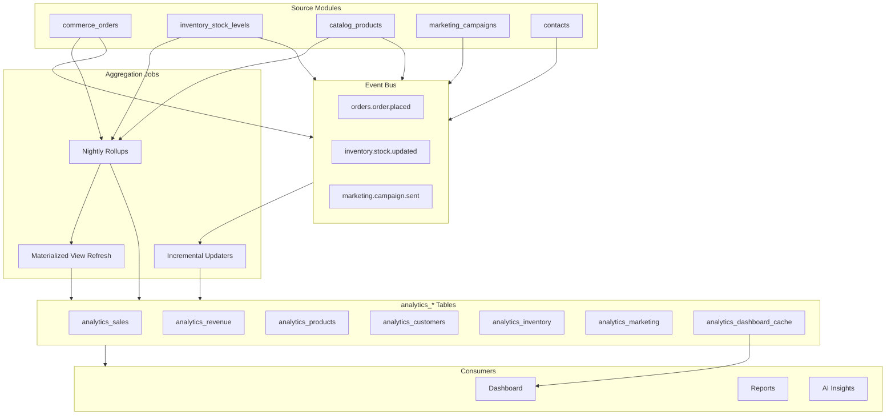

# AgainERP — Analytics Module Architecture

> **Status:** Draft  
> **Module:** Analytics (Ecommerce · Platform aggregation layer)  
> **Version:** 1.0  
> **Document Type:** Enterprise Architecture  
> **Governance:** [GOVERNANCE.md](../../../GOVERNANCE.md) · **Standards:** [DEVELOPMENT_STANDARDS.md](../../../DEVELOPMENT_STANDARDS.md)

**No application code.** Source of truth for the Ecommerce analytics aggregation layer.

**Related:** [dashboard/ARCHITECTURE.md](../dashboard/ARCHITECTURE.md) · [reports/ARCHITECTURE.md](../reports/ARCHITECTURE.md) · [orders/ARCHITECTURE.md](../orders/ARCHITECTURE.md)  
**Consumers:** Dashboard widgets, Reports, AI insights, external BI (future)

---

## Executive Summary

The **Analytics** module is AgainERP's **read-optimized aggregation layer** for ecommerce data. It transforms high-volume transactional events into pre-computed `analytics_*` tables via scheduled jobs and incremental updaters — powering Dashboard KPIs, Reports exports, and AI forecasts without scanning raw orders at query time.

| Feeds | Tables |
|-------|--------|
| **Orders** | `analytics_sales`, `analytics_revenue` |
| **Catalog** | `analytics_products` |
| **Customers** | `analytics_customers` |
| **Inventory** | `analytics_inventory` |
| **Marketing** | `analytics_marketing` |
| **Tax** | `analytics_tax` |
| **Dashboard** | `analytics_dashboard_cache` |

### Scale Targets

| Dimension | Target |
|-----------|--------|
| Source orders | 1,000,000+ |
| Aggregation lag | < 15 min (near-real-time v2) |
| Dashboard widget p95 | < 2s |
| Daily rollup job | < 30 min per company |

**Table namespace:** `analytics_*`

---

# Module Mission

## Why Analytics Exists

Operational tables (`commerce_orders`, `inventory_movements`) are optimized for writes, not analytics. Querying them directly for dashboards and reports degrades at scale. Analytics provides:

- **Pre-aggregation** — daily/hourly rollups
- **Materialized views** — snapshot tables refreshed by jobs
- **Cache layer** — widget response cache with TTL
- **Event-driven increments** — hot metrics updated on key events

```
Transactional writes → System Events → Aggregation jobs → analytics_* → Dashboard / Reports
```

---

# Architecture Overview



---

# Aggregation Strategy

## Three Tiers

| Tier | Latency | Method | Use Case |
|------|---------|--------|----------|
| **Real-time increment** | Seconds | Event handler updates counters | Today's order count |
| **Near-real-time** | 5–15 min | Micro-batch job | Dashboard KPIs |
| **Nightly rollup** | Daily 2am | Full day reconciliation | Reports, CLV, accuracy |

Nightly jobs **reconcile** incremental counts to fix drift.

## Job Registry

| Job | Schedule | Output |
|-----|----------|--------|
| `AggregateSalesDaily` | Nightly + on `orders.order.placed` | `analytics_sales` |
| `AggregateRevenueDaily` | Nightly | `analytics_revenue` |
| `AggregateProductsDaily` | Nightly | `analytics_products` |
| `AggregateCustomers` | Nightly | `analytics_customers` |
| `SnapshotInventory` | Hourly | `analytics_inventory` |
| `AggregateMarketingDaily` | Nightly | `analytics_marketing` |
| `AggregateTaxDaily` | Nightly | `analytics_tax` |
| `WarmDashboardCache` | Every 5 min | `analytics_dashboard_cache` |
| `RefreshMaterializedViews` | Nightly | MV tables |

All jobs scoped by `company_id`; parallel workers per company.

---

# Analytics Tables

## Sales & Revenue

**`analytics_sales`** — grain: `company_id`, `branch_id`, `date`, `channel`, `currency_code`

| Column | Description |
|--------|-------------|
| `order_count` | Orders placed |
| `item_count` | Units sold |
| `gross_revenue` | Before discounts |
| `net_revenue` | After discounts |
| `discount_total` | |
| `shipping_total` | |
| `tax_total` | |
| `aov` | Average order value |

**`analytics_sales_hourly`** — same metrics by hour for heatmaps.

**`analytics_revenue`** — grain: daily

| Column | Description |
|--------|-------------|
| `gross_revenue` | |
| `net_revenue` | |
| `cogs` | From catalog cost |
| `gross_profit` | net − cogs |
| `refund_total` | |
| `net_profit` | After refunds, shipping cost |

## Products

**`analytics_products`** — grain: `date`, `product_id`, `variant_id`

| Column | Description |
|--------|-------------|
| `units_sold` | |
| `revenue` | |
| `views` | PDP views |
| `add_to_cart_count` | |
| `conversion_rate` | computed |
| `return_count` | |

## Customers

**`analytics_customers`** — grain: `contact_id` (one row per customer per company)

| Column | Description |
|--------|-------------|
| `order_count` | Lifetime |
| `total_spent` | |
| `average_order_value` | |
| `first_order_at` | |
| `last_order_at` | |
| `clv` | Predicted or historical |
| `rfm_score` | JSON |
| `return_rate` | |

## Inventory

**`analytics_inventory`** — grain: `date`, `item_id`, `warehouse_id`

| Column | Description |
|--------|-------------|
| `qty_on_hand` | Snapshot |
| `qty_reserved` | |
| `valuation` | qty × cost |
| `days_of_supply` | |
| `is_low_stock` | Boolean |

## Marketing

**`analytics_marketing`** — grain: `date`, `campaign_id`

| Column | Description |
|--------|-------------|
| `spend` | |
| `impressions` | |
| `clicks` | |
| `conversions` | Orders attributed |
| `attributed_revenue` | |
| `roi` | computed |

## Tax

**`analytics_tax`** — grain: `date`, `tax_class_id`, `zone`

| Column | Description |
|--------|-------------|
| `taxable_amount` | |
| `tax_collected` | |
| `order_count` | |

## Dashboard Cache

**`analytics_dashboard_cache`**

| Column | Description |
|--------|-------------|
| `widget_key` | e.g. `overview.kpi_sales_today` |
| `company_id` | |
| `branch_id` | Optional scope |
| `filter_hash` | Date range + filters |
| `payload` | JSON cached response |
| `expires_at` | TTL |

---

# Materialized Views

Logical MVs implemented as tables refreshed by jobs (not DB-native MVs required v1):

| View Table | Source | Refresh |
|------------|--------|---------|
| `analytics_mv_top_products_30d` | `analytics_products` | Nightly |
| `analytics_mv_sales_by_category` | orders + catalog | Nightly |
| `analytics_mv_customer_segments` | `analytics_customers` | Nightly |
| `analytics_mv_inventory_alerts` | `analytics_inventory` | Hourly |

Enables fast Dashboard widgets without ad-hoc joins.

---

# Event-Driven Increments

| Event | Increment Action |
|-------|------------------|
| `orders.order.placed` | +1 `analytics_sales.order_count`, +revenue, update `analytics_customers` |
| `orders.order.completed` | Finalize revenue, earn points rollup |
| `orders.order.refunded` | +refund_total |
| `catalog.product.viewed` | +`analytics_products.views` |
| `inventory.stock.low` | Flag `analytics_inventory.is_low_stock` |
| `marketing.campaign.sent` | +impressions |
| `marketing.coupon.applied` | +discount attribution |

Handlers idempotent via `analytics_event_log` (event_id dedup).

**Table:** `analytics_event_log` — `event_id`, `processed_at`, `handler`

---

# Dashboard Integration

See [dashboard/ARCHITECTURE.md](../dashboard/ARCHITECTURE.md).

| Widget | Analytics Source |
|--------|------------------|
| KPI: Sales Today | `analytics_sales` + increment |
| Sales Chart | `analytics_sales` time series |
| Revenue Chart | `analytics_revenue` |
| Top Products | `analytics_mv_top_products_30d` |
| Customer Growth | `analytics_customers` new count |
| Inventory Alerts | `analytics_mv_inventory_alerts` |
| AI Insights | `ai_insights` (fed by analytics) |

Widget API reads cache first → fallback to live aggregation → populate cache.

---

# Reports Integration

See [reports/ARCHITECTURE.md](../reports/ARCHITECTURE.md).

Reports query `analytics_*` by default; drill-down queries source tables with row limits.

| Report Type | Primary Table |
|-------------|---------------|
| Sales | `analytics_sales` |
| Profit | `analytics_revenue` |
| Product | `analytics_products` |
| Customer | `analytics_customers` |
| Inventory | `analytics_inventory` |
| Marketing | `analytics_marketing` |
| Tax | `analytics_tax` |

---

# System Events (Emitted)

| Event | Payload | Subscribers |
|-------|---------|-------------|
| `analytics.aggregation.started` | `job_name`, `company_id` | Monitoring |
| `analytics.aggregation.completed` | `job_name`, `rows_affected` | Cache warm |
| `analytics.aggregation.failed` | `job_name`, `error` | Alerting, retry |
| `analytics.cache.invalidated` | `widget_key` | Dashboard refresh |

---

# Database Architecture

## Table List

| Table | Purpose |
|-------|---------|
| `analytics_sales` | Daily sales aggregates |
| `analytics_sales_hourly` | Hourly sales |
| `analytics_revenue` | Revenue & profit |
| `analytics_products` | Product performance |
| `analytics_customers` | Customer metrics |
| `analytics_inventory` | Inventory snapshots |
| `analytics_marketing` | Campaign metrics |
| `analytics_tax` | Tax aggregates |
| `analytics_seo` | SEO metrics (v2) |
| `analytics_dashboard_cache` | Widget cache |
| `analytics_event_log` | Idempotent event processing |
| `analytics_job_runs` | Job execution log |
| `analytics_mv_top_products_30d` | Materialized view |
| `analytics_mv_sales_by_category` | Materialized view |
| `analytics_mv_customer_segments` | Materialized view |
| `analytics_mv_inventory_alerts` | Materialized view |
| `analytics_report_definitions` | Custom reports (shared with Reports) |
| `analytics_report_runs` | Report execution log |
| `analytics_report_schedules` | Scheduled reports |

## Indexes

| Table | Index | Reason |
|-------|-------|--------|
| `analytics_sales` | `(company_id, date, branch_id)` | Dashboard queries |
| `analytics_products` | `(company_id, date, variant_id)` | Product reports |
| `analytics_customers` | `(company_id, contact_id)` UNIQUE | CLV lookup |
| `analytics_dashboard_cache` | `(widget_key, filter_hash)` UNIQUE | Cache hit |

## Partitioning

- Partition `analytics_sales`, `analytics_products` by `date` year
- Retain granular daily data 3 years; monthly rollups beyond

---

# API Architecture

Base: `/api/v1/analytics/`  
Auth: Bearer + `X-Company-Id`

| Method | Endpoint | Permission |
|--------|----------|------------|
| GET | `/sales` | `analytics.read` |
| GET | `/revenue` | `analytics.read` |
| GET | `/products` | `analytics.read` |
| GET | `/customers` | `analytics.read` |
| GET | `/inventory` | `analytics.read` |
| GET | `/marketing` | `analytics.read` |
| GET | `/tax` | `analytics.read` |
| POST | `/cache/invalidate` | `analytics.admin` |
| GET | `/jobs` | `analytics.admin` |
| POST | `/jobs/{name}/run` | `analytics.admin` |

Dashboard widgets use `/api/v1/ecommerce/dashboard/widgets/{key}` which wraps analytics internally.

---

# Permissions

| Key | Description |
|-----|-------------|
| `analytics.read` | Query aggregates |
| `analytics.admin` | Trigger jobs, invalidate cache |
| `analytics.export` | Bulk export aggregates |

---

# Performance Requirements

| Requirement | Strategy |
|-------------|----------|
| Dashboard < 2s | `analytics_dashboard_cache` + MVs |
| No full table scans | All queries indexed by date + company |
| Job isolation | Per-company queue workers |
| Backfill | `analytics_job_runs` supports date range replay |

| Target | Value |
|--------|-------|
| Increment handler | < 100ms |
| Nightly job per company | < 30 min |
| Cache hit ratio | > 80% |

---

# Dependencies

- **Source modules:** [orders/ARCHITECTURE.md](../orders/ARCHITECTURE.md), [catalog/ARCHITECTURE.md](../catalog/ARCHITECTURE.md), [inventory/ARCHITECTURE.md](../inventory/ARCHITECTURE.md), [customers/ARCHITECTURE.md](../customers/ARCHITECTURE.md), [marketing/ARCHITECTURE.md](../marketing/ARCHITECTURE.md)
- **Consumers:** [dashboard/ARCHITECTURE.md](../dashboard/ARCHITECTURE.md), [reports/ARCHITECTURE.md](../reports/ARCHITECTURE.md)
- **Core:** Queue Workers, Cron, `activity_logs`, `ai_insights`
- **Services:** Event Bus, Redis (cache)

---

## Document Index

| Consumer | Doc |
|----------|-----|
| Dashboard | [dashboard/ARCHITECTURE.md](../dashboard/ARCHITECTURE.md) |
| Reports | [reports/ARCHITECTURE.md](../reports/ARCHITECTURE.md) |
| Database overview | [Database.md](../Database.md) |

---

**Module:** Analytics  
**Last Updated:** 2026-06-12  
**Status:** Draft — requires approval before implementation
