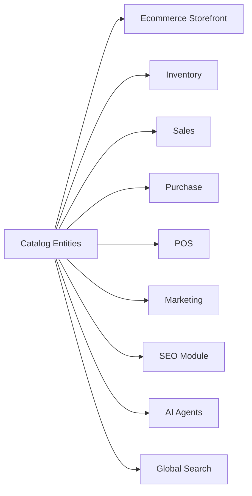

# AgainERP — Catalog Domain Entity Catalog

> **Status:** Approved  
> **Version:** 1.0  
> **Project:** AgainERP  
> **Domain:** Catalog (Ecommerce · Platform-ready)  
> **Document Type:** Business Entity Design Document  
> **Purpose:** Define all Catalog domain business entities — purpose, lifecycle, relationships, and platform capabilities  
> **Governance:** [GOVERNANCE.md](../../../GOVERNANCE.md) · **Standards:** [DEVELOPMENT_STANDARDS.md](../../../DEVELOPMENT_STANDARDS.md)

**No SQL schemas. No migrations. No DDL.**  
This document describes **business entities only** — what they mean, how they behave, and how they connect to platform capabilities.

### Step 27 Requirements (Satisfied)

| Requirement | Section |
|-------------|---------|
| Domain overview | §1 |
| Entity philosophy | §2 |
| Entity registry | §3 |
| Per-entity profiles (9 attributes each) | §4 |
| Product lifecycle (Draft → Review → Approved → Published → Archived) | §4.1 · §5 |
| All 16 catalog entities | §3 · §4 |

**Related:** [ARCHITECTURE.md](./ARCHITECTURE.md) · [PRODUCT_MASTER_ARCHITECTURE.md](../../core/PRODUCT_MASTER_ARCHITECTURE.md) · [SPECIFICATIONS_ARCHITECTURE.md](./SPECIFICATIONS_ARCHITECTURE.md) · [ENTITY_RELATIONSHIP_REGISTRY.md](../../../ENTITY_RELATIONSHIP_REGISTRY.md) · [DATABASE_REGISTRY.md](../../../DATABASE_REGISTRY.md) · [TRACEABILITY_MATRIX.md](../../../TRACEABILITY_MATRIX.md)

---

## Executive Summary

| Principle | Rule |
|-----------|------|
| **Single product spine** | Catalog owns product truth; other modules reference, never duplicate |
| **Profile-based specs** | No hardcoded attribute columns per category |
| **Type-driven behavior** | Product Type determines sellable unit, stock, and cart rules |
| **Core for shared primitives** | Media, Tags, Contacts, Activity — Catalog extends, not reimplements |
| **Lifecycle before storefront** | Published products pass review and approval policy |
| **Search & AI declared** | Every entity documents index scope and agent boundaries |

```text
Catalog Domain Entities (16)
├── Product · Product Variant · Product Type
├── Category · Brand · Collection
├── Specification Profile · Group · Field · Product Specification Value
├── Product Relationship · Product Media · Product SEO
├── Product Review · Product Question · Product Tag · Product Label
```

---

## 1. Domain Overview

### 1.1 Catalog Bounded Context

The **Catalog** domain is AgainERP's **product master data system** — the authoritative source for what can be sold, displayed, searched, and referenced across ERP modules.

| Concern | Catalog Owns | Catalog Does Not Own |
|---------|--------------|----------------------|
| Identity | Product, Variant, Category, Brand | Customer, Vendor |
| Merchandising | Collections, Relationships, Labels | Campaign execution |
| Content | Descriptions, Media refs, SEO records | DAM storage (Core Media) |
| Specifications | Profiles, Groups, Fields, Values | — |
| Social proof | Reviews, Q&A | Order fulfillment |
| Pricing refs | Price list links on variant | GL posting (Finance) |
| Stock | Mapping to Inventory item | qty_on_hand (Inventory) |

### 1.2 Consumers



| Consumer | Primary Entities Used |
|----------|----------------------|
| Ecommerce storefront | Product, Variant, Category, Brand, SEO, Media, Review |
| Inventory | Product Variant → Stock Item mapping |
| Sales / POS | Product Variant (SKU, price) |
| Purchase | Product Variant (supplier SKU, cost) |
| Marketing | Collection, Product Tag, Product Label |
| SEO | Product SEO, Category SEO, Review schema |
| AI | Product, Specification Value, SEO, Tag |
| Global Search | Product, Category, Brand (indexed documents) |

### 1.3 Traceability

| Requirement | Catalog Entities |
|-------------|------------------|
| REQ-CATALOG-001 | Product, Variant, Category, Brand |
| REQ-CATALOG-002 | Specification Profile, Group, Field, Product Specification Value |
| REQ-CATALOG-003 | Collection, Product Relationship, Product Label |
| REQ-CATALOG-004 | Product Review, Product Question |
| REQ-CATALOG-005 | Product SEO, Product Media |
| REQ-CATALOG-006 | Product Tag |

**Service owner:** `CatalogService` · **Workflow:** `catalog.product` · **Agent:** Catalog Agent, SEO Agent

### 1.4 Document Boundaries

| This Document | See Instead |
|---------------|-------------|
| Business entity definitions | [ARCHITECTURE.md](./ARCHITECTURE.md) — module screens & integration |
| Physical tables | [DATABASE_REGISTRY.md](../../../DATABASE_REGISTRY.md) §5.1 |
| Cross-domain entity map | [ENTITY_RELATIONSHIP_REGISTRY.md](../../../ENTITY_RELATIONSHIP_REGISTRY.md) |
| API operations | [API_REGISTRY.md](../../../API_REGISTRY.md) Catalog group |
| Spec system UI | [SPECIFICATIONS_ARCHITECTURE.md](./SPECIFICATIONS_ARCHITECTURE.md) |

---

## 2. Entity Philosophy

### 2.1 Design Principles

```text
Every catalog fact belongs to one aggregate root.
Child entities cannot outlive their owner without explicit orphan policy.
References cross module boundaries by ID — never by duplicated business data.
```

| Principle | Application |
|-----------|-------------|
| **Aggregate roots** | Product, Category, Brand, Collection, Specification Profile, Product Review |
| **Child / value objects** | Product Variant, Specification Value, Product SEO, Product Media (attachment binding) |
| **Reference entities** | Product Type (classification enum), Product Tag (Core Tag link) |
| **Typed edges** | Product Relationship — merchandising graph, not duplicate products |
| **Core delegation** | Media files, Tags, Activity timeline, Approvals — platform engines |

### 2.2 Entity Profile Schema

Every entity in §4 includes:

| Attribute | Description |
|-----------|-------------|
| **Purpose** | Business reason the entity exists |
| **Responsibilities** | What the entity is accountable for |
| **Lifecycle** | States and transitions |
| **Relationships** | Logical links to other entities |
| **Activities** | Timeline, chatter, followers, audit |
| **Permissions** | Primary permission keys |
| **Approval Support** | Workflow gates, if any |
| **AI Support** | Agents and tools that may read or propose changes |
| **Search Support** | Global Search / storefront index participation |

### 2.3 Naming & Ownership

| Rule | Example |
|------|---------|
| Business names match admin UI | "Specification Profile" not internal `attribute_profile` |
| One write owner per entity | Only CatalogService mutates Product |
| Events on state change | `catalog.product.published`, `catalog.review.approved` |
| Soft delete for history | Product, Variant, Review retain order-line references |

### 2.4 Platform Capability Matrix

| Capability | Engine / Module | Catalog Usage |
|------------|-----------------|-----------------|
| Activity | Core Activity & Chatter | Product, Category, Brand timelines |
| Approval | Core Approval + Workflow | Product publish, Review moderation |
| Media | Core Media + Attachments | Product Media collections |
| Search | Global Search Engine | Product, Category, Brand documents |
| AI | AI OS + Catalog Agent | Descriptions, specs, tags, SEO drafts |
| i18n | Core Translations | Product, Category, Brand, SEO per locale |

---

## 3. Entity Registry

Master index of all Catalog domain business entities.

| # | Entity | Aggregate | Owner | REQ | Status |
|---|--------|-----------|-------|-----|--------|
| 1 | [Product](#41-product) | Root | Catalog | REQ-CATALOG-001 | Documented |
| 2 | [Product Variant](#42-product-variant) | Child of Product | Catalog | REQ-CATALOG-001 | Documented |
| 3 | [Product Type](#43-product-type) | Reference | Catalog | REQ-CATALOG-001 | Documented |
| 4 | [Category](#44-category) | Root | Catalog | REQ-CATALOG-001 | Documented |
| 5 | [Brand](#45-brand) | Root | Catalog | REQ-CATALOG-001 | Documented |
| 6 | [Collection](#46-collection) | Root | Catalog | REQ-CATALOG-003 | Documented |
| 7 | [Specification Profile](#47-specification-profile) | Root | Catalog | REQ-CATALOG-002 | Documented |
| 8 | [Specification Group](#48-specification-group) | Child of Profile | Catalog | REQ-CATALOG-002 | Documented |
| 9 | [Specification Field](#49-specification-field) | Child of Group | Catalog | REQ-CATALOG-002 | Documented |
| 10 | [Product Specification Value](#410-product-specification-value) | Child of Product/Variant | Catalog | REQ-CATALOG-002 | Documented |
| 11 | [Product Relationship](#411-product-relationship) | Edge | Catalog | REQ-CATALOG-003 | Documented |
| 12 | [Product Media](#412-product-media) | Attachment binding | Catalog + Core | REQ-CATALOG-005 | Documented |
| 13 | [Product SEO](#413-product-seo) | Child of Product | Catalog | REQ-CATALOG-005 | Documented |
| 14 | [Product Review](#414-product-review) | Root | Catalog | REQ-CATALOG-004 | Documented |
| 15 | [Product Question](#415-product-question) | Root | Catalog | REQ-CATALOG-004 | Documented |
| 16 | [Product Tag](#416-product-tag) | Junction (Core Tag) | Core · used by Catalog | REQ-CATALOG-006 | Documented |
| 17 | [Product Label](#417-product-label) | Root | Catalog | REQ-CATALOG-003 | Documented |

---

## 4. Entity Profiles

### 4.1 Product

| Attribute | Value |
|-----------|-------|
| **Purpose** | Master sellable or presentable item — single source of product truth for commerce and ERP |
| **Responsibilities** | Identity (name, descriptions); classification (type, category, brand); lifecycle gate to storefront; parent container for variants, specs, SEO, media; event emission on publish/archive |
| **Lifecycle** | See [§5 Product Lifecycle](#5-product-lifecycle) — Draft → Review → Approved → Published → Archived |
| **Relationships** | → Product Type; → Category (primary + additional M:N); → Brand; → Product Variants (1:n); → Product Specification Values; → Product SEO; → Product Media; → Product Relationships; → Product Tags; → Product Labels; → Product Reviews; → Product Questions; ← Stock Item (via Variant); ← Order Lines; ← Campaign scope |
| **Activities** | ✓ Full — create, edit, price change, lifecycle transitions, publish, archive; field-level history; followers and @mentions on catalog team |
| **Permissions** | `catalog.product.view`, `.create`, `.edit`, `.submit`, `.approve`, `.publish`, `.archive`, `.delete` |
| **Approval Support** | **Yes** — workflow `catalog.product`: submit (Draft→Review), approve/reject (Review→Approved/Draft), publish (Approved→Published) |
| **AI Support** | Catalog Agent — `generate_description`, `generate_tags`, `generate_seo`, `suggest_category`, `import_specs`; SEO Agent — meta and schema proposals; outputs are **suggestions until staff approves** |
| **Search Support** | ✓ Indexed as `catalog.product` — name, SKU, barcode, description, spec fields flagged `is_searchable`; admin search respects `catalog.product.view`; storefront index only when Published |

---

### 4.2 Product Variant

| Attribute | Value |
|-----------|-------|
| **Purpose** | Sellable SKU — the purchasable unit for variable and multi-SKU product types |
| **Responsibilities** | Unique SKU and barcode per company; variant-specific price; inventory mapping; optional variant media and spec overrides; cart and order line reference target |
| **Lifecycle** | Follows parent Product lifecycle; variant `status`: active → inactive (soft); cannot be purchased when inactive or parent not Published |
| **Relationships** | → Product (required parent); → Variant dimension values (Color, Size, etc.); → Product Specification Values (overrides); → Product Media (optional gallery); → Inventory Stock Item (1:1 mapping); ← Order Lines; ← POS scans |
| **Activities** | ✓ Price changes, SKU edits, inventory link changes on product timeline |
| **Permissions** | `catalog.product.view`, `.edit` (variants managed under product); `catalog.variant.price.edit` for price-only roles |
| **Approval Support** | Inherits Product workflow — significant price changes may trigger separate approval policy (configurable) |
| **AI Support** | Price suggestion; spec value inference for matrix dimensions |
| **Search Support** | ✓ SKU and barcode indexed on parent product document; variant attributes in facet filters |

---

### 4.3 Product Type

| Attribute | Value |
|-----------|-------|
| **Purpose** | Classification that determines product behavior — sellable unit, stock rules, shipping, and cart logic |
| **Responsibilities** | Strategy selection for catalog operations; UI progressive disclosure (e.g. show Variant tab only for Variable); validation rules on save and publish |
| **Lifecycle** | Platform-defined reference set — extended via enum addition and ADR; not user-deletable |
| **Relationships** | → Product (every product has exactly one type); influences → Product Variant requirement; → Bundle/Grouped component rules |

**Supported types:**

| Type | Sellable Unit | Stock | Example |
|------|---------------|-------|---------|
| Simple | Product itself | Yes | Mug |
| Variable | Variants only | On variants | Smartphone |
| Digital | Product / license | No | eBook |
| Service | Product | Optional | Installation |
| Bundle | Bundle SKU | Derived from components | Camera kit |
| Grouped | Children separately | On children | Furniture set |
| Subscription | Product + plan | Optional | Monthly box |
| Gift Card | Denomination variants | No | Gift card |

| **Activities** | — (configuration reference, not a timeline entity) |
| **Permissions** | `catalog.product.create` (type selected at create); type change requires `catalog.product.edit` + may be restricted by policy |
| **Approval Support** | — |
| **AI Support** | Catalog Agent — `suggest_product_type` from description or import row |
| **Search Support** | Facet filter `product_type` on product index |

---

### 4.4 Category

| Attribute | Value |
|-----------|-------|
| **Purpose** | Hierarchical merchandising and navigation grouping — organizes catalog browse and SEO URLs |
| **Responsibilities** | Tree structure (unlimited depth); primary and secondary product assignment; default Specification Profile suggestion; category SEO and landing template; filter inheritance to descendants |
| **Lifecycle** | active → archived (archived hidden from assignment UI; existing product links retained for history) |
| **Relationships** | → Parent Category (tree); ↔ Products (M:N + primary category FK); → Specification Profile (default mapping); → Category SEO; → Collection rules (category conditions) |
| **Activities** | ✓ Tree moves, product assignments, SEO updates |
| **Permissions** | `catalog.category.view`, `.create`, `.edit`, `.delete`, `.archive` |
| **Approval Support** | — (optional policy for root category restructure in enterprise tier) |
| **AI Support** | Category naming suggest; SEO meta draft; product auto-categorization confidence scores |
| **Search Support** | ✓ Indexed as `catalog.category` — name, path, description; breadcrumb source for product documents |

---

### 4.5 Brand

| Attribute | Value |
|-----------|-------|
| **Purpose** | Manufacturer or house brand label — attribution, filtering, and brand landing pages |
| **Responsibilities** | Brand identity (name, logo, description); brand SEO page; product attribution; brand-scoped collections and filters |
| **Lifecycle** | active → archived |
| **Relationships** | ↔ Products (n:1 from product side); → Media (logo via Core attachment); → Brand SEO; → Collection rules |
| **Activities** | ✓ Create, edit, logo change, product count milestones |
| **Permissions** | `catalog.brand.view`, `.create`, `.edit`, `.archive` |
| **Approval Support** | — |
| **AI Support** | Brand description draft; duplicate brand detection on import |
| **Search Support** | ✓ Indexed as `catalog.brand` — name, slug; facet on product search |

---

### 4.6 Collection

| Attribute | Value |
|-----------|-------|
| **Purpose** | Curated or rule-driven product sets for merchandising — homepage carousels, campaign slots, seasonal lists |
| **Responsibilities** | Manual product pick lists; dynamic rule evaluation (SQL/rule engine JSON); schedule visibility; sort order within collection |
| **Lifecycle** | draft → active → inactive → archived |
| **Relationships** | ↔ Products (M:N manual membership); → Collection Rules (dynamic); used by Marketing campaigns and storefront widgets |
| **Activities** | ✓ Membership changes, rule edits, activation |
| **Permissions** | `catalog.collection.view`, `.create`, `.edit`, `.publish`, `.delete` |
| **Approval Support** | Optional — featured collection publish to production storefront |
| **AI Support** | Merchandising suggest — products to add based on sales velocity and margin rules |
| **Search Support** | Collection name indexed; member products discovered via product index, not separate collection full-text |

**Collection types:** Featured · New Arrivals · Best Sellers · Trending · Custom (manual) · Dynamic (rules) · Rules-based (`brand=X AND category=Y`)

---

### 4.7 Specification Profile

| Attribute | Value |
|-----------|-------|
| **Purpose** | Reusable specification template for a product class — replaces hardcoded per-category columns |
| **Responsibilities** | Define groups and fields for a vertical (Laptop, Running Shoe, Medical Device); category mapping suggestions; export/import for reuse across companies (enterprise) |
| **Lifecycle** | draft → active → inactive |
| **Relationships** | → Specification Groups (1:n); ↔ Categories (default mapping); assigned to → Products |
| **Activities** | ✓ Profile create, builder edits, duplicate, export |
| **Permissions** | `catalog.specification.profile.view`, `.create`, `.edit`, `.archive` |
| **Approval Support** | — |
| **AI Support** | Template suggest from category; AI Import maps supplier text → profile field mapping |
| **Search Support** | Profile name in admin search; field definitions drive product spec facets when `is_filterable` |

**Examples:** Laptop · Desktop · Monitor · Mobile · Camera · Fashion Apparel · Restaurant Menu Item · Medical Device

---

### 4.8 Specification Group

| Attribute | Value |
|-----------|-------|
| **Purpose** | Logical UI section within a Specification Profile — organizes fields on PDP and admin forms |
| **Responsibilities** | Group name and sort order; collapsible sections in Profile Builder and storefront comparison table |
| **Lifecycle** | Follows parent Profile — active / inactive per group |
| **Relationships** | → Specification Profile (required); → Specification Fields (1:n); optional product-level override group on Product |
| **Activities** | ✓ Logged via Profile aggregate timeline |
| **Permissions** | `catalog.specification.profile.edit` |
| **Approval Support** | — |
| **AI Support** | Group suggest when building profile from import |
| **Search Support** | — (group names not separately indexed) |

**Examples:** Processor · Display · Memory · Storage · Nutrition · Warranty · Connectivity

---

### 4.9 Specification Field

| Attribute | Value |
|-----------|-------|
| **Purpose** | Typed attribute definition — one measurable or selectable product characteristic |
| **Responsibilities** | Field type, validation, options (select/multi); capability flags: filterable, comparable, searchable, AI-searchable; unit display (GB, inches) |
| **Lifecycle** | active → inactive (inactive fields hidden on new products; historical values retained) |
| **Relationships** | → Specification Group; → Field Options (select types); → Product Specification Values (instances) |
| **Activities** | ✓ Via Profile builder audit |
| **Permissions** | `catalog.specification.profile.edit` |
| **Approval Support** | — |
| **AI Support** | Normalization (e.g. "16 GB" → `16`); missing field detection on product |
| **Search Support** | When `is_searchable` — value indexed on product document; when `is_filterable` — storefront facet; when `is_ai_searchable` — semantic embedding contribution |

**Field types:** text · number · boolean · select · multi_select · range · date · url · color · dimension

---

### 4.10 Product Specification Value

| Attribute | Value |
|-----------|-------|
| **Purpose** | Instance of a Specification Field on a specific Product or Variant — the actual spec data shown on PDP |
| **Responsibilities** | Store typed value per field; support product-level and variant-level overrides; completeness scoring for publish readiness |
| **Lifecycle** | Created with product; updated until archived; version tracked in product history |
| **Relationships** | → Product and/or Product Variant; → Specification Field; optional product-only field override |
| **Activities** | ✓ Spec changes on product timeline; bulk import rows |
| **Permissions** | `catalog.product.edit` |
| **Approval Support** | Low-confidence AI-imported values enter review queue before publish |
| **AI Support** | Catalog Agent — extract from PDF/CSV/text; confidence score per field; AI Suggestions review screen |
| **Search Support** | Inherited from field flags — contributes to product search document and comparison table |

---

### 4.11 Product Relationship

| Attribute | Value |
|-----------|-------|
| **Purpose** | Typed merchandising or composition edge between products — cross-sell, bundles, accessories without duplicating product records |
| **Responsibilities** | Maintain directed relationships with sort order and optional quantity; support variant-level targets; power PDP widgets and checkout recommendations |
| **Lifecycle** | active → removed (soft); historical analytics retain edge |
| **Relationships** | → Source Product or Variant; → Target Product or Variant; types below |

| `relationship_type` | Purpose |
|---------------------|---------|
| `related` | Similar products |
| `cross_sell` | Complementary at checkout |
| `up_sell` | Higher-tier alternative |
| `frequently_bought_together` | Bundle suggestions |
| `alternative` | Substitutes |
| `accessory` | Add-ons |
| `bundle_component` | Fixed bundle part |
| `kit_component` | Kit assembly part |

| **Activities** | ✓ Merchandising changes on product timeline |
| **Permissions** | `catalog.product.edit`; `catalog.merchandising.manage` for bulk |
| **Approval Support** | — |
| **AI Support** | Relationship recommend from order basket analysis (future); strength score metadata |
| **Search Support** | — (not directly indexed; target products discoverable independently) |

---

### 4.12 Product Media

| Attribute | Value |
|-----------|-------|
| **Purpose** | Visual and document assets attached to Product or Variant — gallery, thumbnail, manuals, 360° |
| **Responsibilities** | Ordered collections; alt text and locale; variant-specific overrides; never store raw paths on Product — always via Core Attachments |
| **Lifecycle** | attached → detached (soft); media file lifecycle managed by Core Media |
| **Relationships** | → Product / Product Variant; → Core Media (file metadata); collections: `thumbnail`, `gallery`, `videos`, `documents`, `360` |
| **Activities** | ✓ Upload, reorder, alt text change on product timeline |
| **Permissions** | `catalog.product.edit`; Core `media.upload` |
| **Approval Support** | — |
| **AI Support** | Alt text generation; primary image suggest; background removal (future plugin) |
| **Search Support** | Alt text and file name in product document; OG image from SEO may reference gallery media |

---

### 4.13 Product SEO

| Attribute | Value |
|-----------|-------|
| **Purpose** | Per-locale search engine and social metadata for Product — URLs, meta tags, structured data |
| **Responsibilities** | Unique slug per company+locale; meta title/description; canonical URL; robots rules; Schema.org Product/Offer; Open Graph tags |
| **Lifecycle** | Draft meta while product in Draft; live when Published; `noindex` when Archived/Hidden |
| **Relationships** | → Product (1:1 per locale); → Product Media (og:image); consumed by SEO Module and sitemap generator |
| **Activities** | ✓ SEO edits logged as `change_type=seo` in product history |
| **Permissions** | `catalog.product.edit`; `catalog.seo.manage` for SEO specialists |
| **Approval Support** | SEO publish may require review when `ai_seo_score` below threshold (policy) |
| **AI Support** | SEO Agent — meta title/description, schema type, slug suggest; `ai_seo_score` 0–100 |
| **Search Support** | Slug drives URL; meta description in search snippet config; not separate index type |

---

### 4.14 Product Review

| Attribute | Value |
|-----------|-------|
| **Purpose** | Customer social proof — star rating and written feedback moderated before storefront display |
| **Responsibilities** | Capture rating (1–5), title, body, pros/cons; verified purchase flag; moderation queue; aggregate rating roll-up on Product |
| **Lifecycle** | pending → approved → rejected; approved visible on storefront; rejected retained for audit |
| **Relationships** | → Product; → Contact (reviewer); → Media attachments (review photos); → AggregateRating on Product SEO schema |
| **Activities** | ✓ Submit, moderate, reply (future); sentiment events |
| **Permissions** | `catalog.review.view`; `catalog.review.moderate`; storefront submit via customer auth |
| **Approval Support** | **Yes** — moderation required before `approved`; auto-approve for verified purchase (configurable) |
| **AI Support** | Review summary on product; sentiment tag; spam detection; fake review flag |
| **Search Support** | Review body optional in product document (policy); aggregate rating as facet |

---

### 4.15 Product Question

| Attribute | Value |
|-----------|-------|
| **Purpose** | Pre-sale customer Q&A on Product — reduces support load and improves conversion |
| **Responsibilities** | Question submission; official and community answers; vote counts; moderation of public content |
| **Lifecycle** | Question: pending → published → hidden; Answer: draft → published; official answers flagged |
| **Relationships** | → Product; → Contact (asker); → Answers (1:n); → Users (staff official answers) |
| **Activities** | ✓ Question submit, answer post, vote |
| **Permissions** | `catalog.question.view`, `.moderate`, `.answer`; customer submit via storefront |
| **Approval Support** | **Yes** — question and answer moderation queue; AI-suggested answers stored as draft until approved |
| **AI Support** | Suggested answer draft from product specs and knowledge base |
| **Search Support** | Published Q&A text indexed on product document when enabled |

---

### 4.16 Product Tag

| Attribute | Value |
|-----------|-------|
| **Purpose** | Flexible polymorphic label on Product — segmentation, admin filters, and internal organization (distinct from customer-facing Product Label) |
| **Responsibilities** | Link Product to Core Tag; support color and slug; module-scoped tag lists; bulk tag operations on import |
| **Lifecycle** | Tag: active in Core; attachment: attach ↔ detach |
| **Relationships** | → Core Tag (`tags`); → Product via `taggables` pivot; shared with CRM, Marketing |
| **Activities** | ✓ Tag attach/detach on product timeline |
| **Permissions** | `core.tag.read`, `core.tag.write`; `catalog.product.edit` |
| **Approval Support** | — |
| **AI Support** | Catalog Agent — `generate_tags`; AI Product Tags screen for batch review |
| **Search Support** | ✓ Tag names as product index facets and admin filter chips |

---

### 4.17 Product Label

| Attribute | Value |
|-----------|-------|
| **Purpose** | Storefront-visible merchandising badge — "Sale", "New", "Limited", "Hot" — rule-driven or manual |
| **Responsibilities** | Badge text, color, icon, priority; schedule (start/end); auto-rules (e.g. created < 30 days → "New"); PDP and list card rendering |
| **Lifecycle** | draft → active → expired → archived |
| **Relationships** | ↔ Products (M:N assignment); optional → Collection; may conflict-resolve by priority order |
| **Activities** | ✓ Label assignment and rule changes |
| **Permissions** | `catalog.label.view`, `.create`, `.edit`, `.assign` |
| **Approval Support** | Optional — promotional labels affecting pricing display may need marketing approval |
| **AI Support** | Suggest promotional label based on inventory age and margin |
| **Search Support** | Label name as product facet `labels`; not full-text on label catalog separately |

**Distinction from Product Tag:**

| Aspect | Product Tag | Product Label |
|--------|-------------|---------------|
| Storage | Core Tag | Catalog Label entity |
| Visibility | Admin + filters | Storefront badge |
| Example | `clearance-2026`, `b2b-only` | `Sale`, `New`, `-20%` |
| Owner | Core (shared) | Catalog |

---

## 5. Product Lifecycle

Canonical lifecycle for the **Product** aggregate — gates storefront visibility and search indexing.

### 5.1 State Diagram

```text
Draft
  ↓ submit
Review
  ↓ approve          ↓ reject
Approved            Draft
  ↓ publish
Published
  ↓ archive
Archived
```

| State | Business Name | Storefront | Search Index (storefront) |
|-------|---------------|------------|---------------------------|
| `draft` | Draft | Hidden | No |
| `pending_review` | Review | Hidden | No |
| `approved` | Approved | Hidden | No (admin preview optional) |
| `published` | Published | Visible | Yes |
| `hidden` | Hidden (temporary) | Hidden | No |
| `archived` | Archived | Hidden | No — admin history only |

### 5.2 Transitions & Permissions

| Transition | From | To | Permission | Workflow Step |
|------------|------|-----|------------|---------------|
| Save draft | — | Draft | `catalog.product.create` / `.edit` | — |
| Submit | Draft | Review | `catalog.product.submit` | submit |
| Approve | Review | Approved | `catalog.product.approve` | approve |
| Reject | Review | Draft | `catalog.product.approve` | reject |
| Publish | Approved | Published | `catalog.product.publish` | publish |
| Hide | Published | Hidden | `catalog.product.edit` | — |
| Republish | Hidden | Published | `catalog.product.publish` | — |
| Archive | Published / Hidden | Archived | `catalog.product.archive` | archive |
| Restore | Archived | Draft | `catalog.product.edit` | — |

### 5.3 Side Effects on Publish

| System | Action |
|--------|--------|
| Event bus | `catalog.product.published` |
| Global Search | Upsert product document |
| SEO | Sitemap regeneration, schema validation |
| Inventory | Validate variant → stock item mapping (if track_inventory) |
| Activity | Timeline entry + optional follower notification |
| AI | Trigger SEO automation if enabled |

### 5.4 Publish Readiness Checklist

| Check | Entity |
|-------|--------|
| Primary category assigned | Category |
| SKU unique (simple) or ≥1 active variant (variable) | Product / Variant |
| Selling price present | Variant |
| Primary image attached | Product Media |
| SEO slug unique | Product SEO |
| Required spec fields complete | Product Specification Value |
| Approval policy satisfied | Workflow |

---

## 6. Cross-Entity Relationship Map

```text
                    ┌─────────────┐
                    │  Category   │
                    └──────┬──────┘
                           │ default profile
                    ┌──────▼──────────────┐
                    │ Specification Profile│
                    │  → Group → Field    │
                    └──────┬──────────────┘
                           │ values
┌────────┐    ┌────────────▼────────────┐    ┌─────────┐
│ Brand  │───►        Product         ◄───│Collection│
└────────┘    │  (Product Type)         │    └─────────┘
              ├── Variants              │
              ├── Media · SEO           │
              ├── Tags · Labels         │
              ├── Relationships         │
              ├── Reviews · Questions   │
              └── Specification Values  │
```

---

## 7. Maintenance

| Trigger | Action |
|---------|--------|
| New catalog entity | Add §3 row + §4 profile; update DATABASE_REGISTRY §5.1; ENTITY_RELATIONSHIP_REGISTRY |
| New product type | Update §4.3 + PRODUCT_MASTER_ARCHITECTURE §3; ADR if behavior change |
| Permission change | Sync PERMISSION_SYSTEM_ARCHITECTURE + API_REGISTRY |
| Lifecycle change | Update §5 + WORKFLOW_REGISTRY `catalog.product` |

**Registry owner:** Platform Team · **Review cadence:** Each catalog epic before Pre-Code Gate

---

*End of Catalog Domain Entity Catalog — Step 27*
