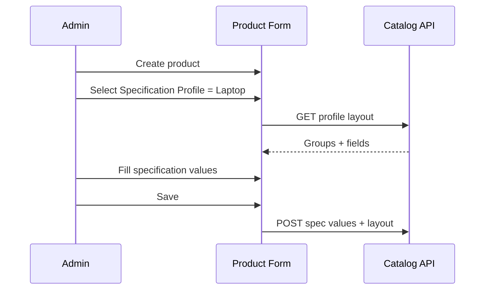
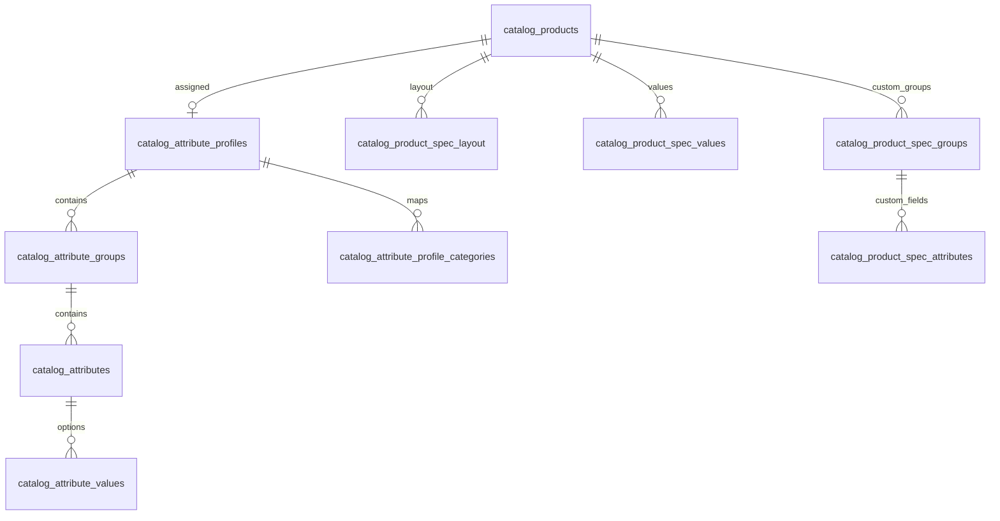

# Catalog Specifications Module Architecture

> **Status:** Approved Architecture  
> **Module:** Catalog  
> **Feature:** Specifications Management  
> **Priority:** High  
> **Version:** 2.0  
> **Document Type:** Enterprise Architecture  
> **Governance:** [GOVERNANCE.md](../../../GOVERNANCE.md) · **Standards:** [DEVELOPMENT_STANDARDS.md](../../../DEVELOPMENT_STANDARDS.md)

**No application code.** Source of truth for the Specifications system.

**Related:** [ARCHITECTURE.md](./ARCHITECTURE.md) · [AI_FIRST_ARCHITECTURE.md](../../ai/AI_FIRST_ARCHITECTURE.md) · [MASTER_DATABASE_ARCHITECTURE.md](../../../database/MASTER_DATABASE_ARCHITECTURE.md)

**Supersedes:** [ATTRIBUTE_PROFILE_ARCHITECTURE.md](./ATTRIBUTE_PROFILE_ARCHITECTURE.md) (terminology and menu structure updated; technical model preserved)

---

## Objective

Create a modern enterprise-grade product specification system that is:

- **Ecommerce ready** — PDP specs, filters, comparison, search
- **AI ready** — import, suggestions, normalization, validation
- **Multi-industry ready** — electronics, fashion, medical, industrial without schema redesign
- **Scalable** — profile templates, resolved product layout, search index
- **Easy for admin users** — visual Profile Builder; no database entity exposure

The system **replaces** traditional OpenCart-style separate Attribute and Attribute Group management.

---

## Core Concept

**Do NOT expose separate admin menus for Attribute Groups or Attributes.**

Admin users think in terms of **product specifications**, not database entities.

```
Specification Profile
    └── Specification Group
            └── Specification Field
                    └── Product Specification Value
```

### Terminology Mapping

| Admin UI (user-facing) | Internal entity | Database table |
|------------------------|-----------------|----------------|
| Specification Profile | Profile template | `catalog_attribute_profiles` |
| Specification Group | Logical section | `catalog_attribute_groups` |
| Specification Field | Spec field definition | `catalog_attributes` |
| Field option | Dropdown / multi-select choice | `catalog_attribute_values` |
| Product specification value | Per-SKU data | `catalog_product_spec_values` |
| Product-only group / field | Product override | `catalog_product_spec_groups` / `catalog_product_spec_attributes` |

> Attribute Groups and Attributes are **internal technical entities**. Admins interact only through **Specification Profiles**, **Groups**, and **Fields** inside the Profile Builder.

### Separation: Specifications vs Variant Attributes

| Concern | Purpose | Example | Tables |
|---------|---------|---------|--------|
| **Specifications** | Technical specs on PDP, filters, comparison | CPU Brand, RAM, Display Size | `catalog_attribute_*`, `catalog_product_spec_*` |
| **Variant matrix** | Purchasable SKU options | Color, Storage tier | `catalog_product_variant_attributes` |

Both coexist on the same product.

---

## Menu Structure

```
Catalog
├── Products
├── Categories
├── Brands
├── Collections
├── Specifications
│   ├── Profiles          ← list + Profile Builder
│   ├── Templates         ← preset profile library
│   ├── AI Import         ← paste / upload → structured specs
│   └── AI Suggestions    ← missing fields, filters, normalization
├── Reviews
├── Import
└── Export
```

### Route Mapping (target)

| Screen | Route | Purpose |
|--------|-------|---------|
| Profiles list | `/catalog/specifications/profiles` | List, create, duplicate profiles |
| Profile Builder | `/catalog/specifications/profiles/[id]` | Groups + fields (single screen) |
| Templates | `/catalog/specifications/templates` | Browse / apply preset templates |
| AI Import | `/catalog/specifications/ai-import` | Bulk spec extraction |
| AI Suggestions | `/catalog/specifications/ai-suggestions` | Review queue for AI output |
| Product specs | Product form → Specifications tab | Value entry + product overrides |

**Prototype note:** Current UI prototype uses `/catalog/attributes` — rename when routes are migrated.

---

## Specification Profiles

Profiles define complete product specification templates.

### Example Profiles

| Profile | Typical categories |
|---------|-------------------|
| Laptop | Computers › Laptops |
| Desktop | Computers › Desktops |
| Monitor | Computers › Monitors |
| Mobile | Electronics › Phones |
| Camera | Electronics › Cameras |
| Printer | Office › Printers |
| Router | Networking |
| Headphone / Microphone | Audio |
| Television | Electronics › TVs |

### Future Industry Profiles

Medical Device · Hospital Equipment · School Asset · Industrial Equipment · Automotive Product · Fashion Apparel · Furniture · Restaurant Equipment

### Profile Fields

| Field | Type | Required | Notes |
|-------|------|----------|-------|
| `name` | string | Yes | e.g. "Laptop" |
| `code` | string | Yes | Stable key: `laptop`, unique per company |
| `description` | text | No | Internal documentation |
| `status` | enum | Yes | `active` · `inactive` · `draft` |
| `sort_order` | int | Yes | Admin list ordering |
| `icon_media_id` | FK | No | Profile icon in picker |
| `category_mappings` | n:m | No | Linked / suggested categories |
| `created_by` | FK | Auto | Audit |
| `created_at` / `updated_at` | timestamp | Auto | Audit |

---

## Profile Builder

The **Profile Builder** is the primary management screen.

- No separate Attribute Group page
- No separate Attribute page
- Everything managed visually inside one builder

### UI Layout

```
Laptop Profile                                    [Preview] [Duplicate] [Export]

[+ Add Group]

┌─ Processor ───────────────────────────── ⋮⋮ drag ─┐
│  CPU Brand                                         │
│  CPU Model                                         │
│  CPU Generation                                    │
│  CPU Core                                          │
│  [+ Add Field]                                     │
└────────────────────────────────────────────────────┘

┌─ Display ─────────────────────────────── ⋮⋮ drag ─┐
│  Display Size                                      │
│  Resolution                                        │
│  Refresh Rate                                      │
│  [+ Add Field]                                     │
└────────────────────────────────────────────────────┘

┌─ Memory ──────────────────────────────── ⋮⋮ drag ─┐
│  RAM                                               │
│  RAM Type                                          │
│  [+ Add Field]                                     │
└────────────────────────────────────────────────────┘
```

All groups and fields support **drag-and-drop** sorting at profile and group level.

---

## Specification Groups

**Purpose:** Logical sections inside a profile.

### Example Groups

Processor · Display · Memory · Storage · Graphics · Connectivity · Audio · Power · Physical · Camera · Network · Warranty · Security

### Group Fields

| Field | Type | Required | Notes |
|-------|------|----------|-------|
| `profile_id` | FK | Yes | Parent profile |
| `name` | string | Yes | e.g. "Processor" |
| `code` | string | Yes | `processor`, unique per profile |
| `description` | text | No | Admin help |
| `sort_order` | int | Yes | Drag order within profile |
| `status` | enum | Yes | `active` · `inactive` |
| `icon_media_id` | FK | No | Optional group icon |
| `is_collapsed_default` | bool | No | Product editor default state |

---

## Specification Fields

Fields represent actual specification values on products.

### Examples

CPU Brand · CPU Model · Generation · RAM · Storage Capacity · Display Size · Weight · Color · Battery Capacity

### Field Configuration

| Field | Type | Default | Notes |
|-------|------|---------|-------|
| `group_id` | FK | — | Parent group |
| `name` | string | — | Display label |
| `code` | string | — | Stable key, unique per profile |
| `field_type` | enum | `text` | See supported types |
| `is_required` | bool | false | Validation on product save |
| `is_filterable` | bool | false | Category facet filters |
| `is_comparable` | bool | false | Product comparison page |
| `is_searchable` | bool | false | Full-text / keyword search index |
| `is_ai_searchable` | bool | false | Semantic / vector search index |
| `is_visible` | bool | true | Storefront PDP visibility |
| `sort_order` | int | 0 | Drag order within group |
| `status` | enum | `active` | |
| `default_value` | json | — | Type-aware default |
| `unit` | string | — | e.g. GHz, GB, inch |
| `help_text` | string | — | Admin + storefront hint |
| `validation_rules` | json | — | min, max, regex, options |

### Supported Field Types

| Type | Storage | Filter UI | Comparison |
|------|---------|-----------|------------|
| `text` | string | — | ✓ |
| `textarea` | text | — | ✓ |
| `number` | decimal | range | ✓ |
| `decimal` | decimal | range | ✓ |
| `dropdown` | option code | multi-select | ✓ |
| `multi_select` | json array | multi-select | partial |
| `checkbox` | bool | toggle | ✓ |
| `radio` | string | multi-select | ✓ |
| `boolean` | bool | toggle | ✓ |
| `date` | date | range | ✓ |
| `color` | #hex | swatch | ✓ |
| `image` | media_id | — | ✓ |
| `url` | string | — | ✓ |
| `file` | media_id | — | — |
| `rich_text` | html | — | ✓ |

Dropdown / multi-select / radio options stored in `catalog_attribute_values`.

---

## Product Workflow



1. Product create / edit
2. Select **Specification Profile** (e.g. Laptop)
3. System loads groups: Processor, Display, Memory, Storage
4. Admin fills values
5. Product saved → `catalog_product_spec_values`

---

## Product Specification Editor

Embedded in Product form → **Specifications** tab.

| Feature | Description |
|---------|-------------|
| Group collapse / expand | Per-group panels |
| Drag and drop | Reorder groups and fields (product layout override) |
| Quick search | Jump to field by name |
| Auto save | Debounced draft save |
| Bulk edit | Multi-field paste / CSV row |
| Inline edit | Click-to-edit values |
| AI suggestions | Fill empty fields from product context |

### Product-Level Customization

Products may **extend** profiles without mutating the master template.

```
Laptop Profile
    └── Lenovo ThinkPad (product)
            └── Add Group: Security
                    └── Add Field: Fingerprint Sensor
```

- Custom groups → `catalog_product_spec_groups`
- Custom fields → `catalog_product_spec_attributes`
- Resolved layout → `catalog_product_spec_layout` (`source`: `profile` | `product`)
- **Reset to profile defaults** action clears product overrides

---

## Storefront Rendering

Display order follows resolved layout:

```
Profile sort_order → Group sort_order → Field sort_order
```

Example PDP specification table:

| Processor | |
|-----------|---|
| CPU Brand | Intel |
| CPU Model | Core i7-13700H |
| Generation | 13th Gen |
| Display | |
| Display Size | 15.6 Inch |
| Resolution | 1920×1080 |

Rendering modes: two-column table (default) · group tabs when `groups.length > 6` · accordion on mobile.

---

## Filter Integration

**Filters are not separate attributes.** Filters are generated from specification fields where `is_filterable = true`.

| Field | Filterable | Appears in category filter |
|-------|------------|----------------------------|
| CPU Brand | Yes | ✓ |
| RAM | Yes | ✓ |
| CPU Cache | No | ✗ |

- Facet config: `catalog_filters` links to `catalog_attributes.id`
- Preset options from `catalog_attribute_values` or dynamic from product values
- SEO URLs: `/shop/laptops?cpu_brand=intel&ram=16gb`

---

## Comparison Integration

Only fields with **`is_comparable = true`** appear in product comparison.

- Union of comparable fields across selected products
- Missing value → em dash (—)
- Optional highlight differences

---

## Search Integration

| Flag | Index target |
|------|--------------|
| `is_searchable = true` | Keyword / FTS index |
| `is_ai_searchable = true` | Semantic / vector index |

Index fragment example:

```json
{
  "specs": {
    "cpu_brand": "Intel",
    "ram": "16 GB",
    "display_size": "16 inch"
  }
}
```

Normalization pipeline: lowercase, strip units for matching; display values kept separate.

---

## AI Integration

AI operates through the [AI Service Layer](../../ai/ARCHITECTURE.md) — never writes to published data without audit.

### AI Import (`/catalog/specifications/ai-import`)

```
Paste supplier specifications
    ↓
AI detect profile
    ↓
AI detect groups
    ↓
AI detect fields
    ↓
Auto-fill values (draft)
    ↓
Admin review queue
```

Example input:

```
Intel Core i5-13420H
16GB DDR5
512GB SSD
15.6 IPS
```

Example output:

| Field | Value |
|-------|-------|
| CPU Brand | Intel |
| CPU Model | i5-13420H |
| RAM | 16GB |
| Storage | 512GB SSD |
| Display | 15.6 IPS |

### AI Suggestions (`/catalog/specifications/ai-suggestions`)

| Capability | Description |
|------------|-------------|
| Suggest missing fields | Empty required fields on product |
| Suggest filters | Recommend `is_filterable` on high-cardinality fields |
| Normalize values | "16 gig" → "16 GB" |
| Translate specifications | Locale-aware values |
| Generate product specs | From name, category, images |
| Validate product data | Rules + anomaly detection |
| Detect duplicates | Same spec, different wording |

All AI output → **draft** until human publish. Confidence score per extracted value.

---

## Templates

Profiles can be saved and shipped as **templates** — starting points, not live profiles.

| Template | Extends |
|----------|---------|
| Business Laptop | Base laptop groups |
| Gaming Laptop | Laptop + GPU / Cooling |
| Budget Laptop | Reduced field set |
| Flagship Mobile | Premium phone fields |
| DSLR Camera | Sensor / Lens / Video |
| Enterprise Router | Network / Security groups |

**Actions:** Apply template → creates new draft profile · Duplicate profile · Export / import JSON

Templates stored in `catalog_spec_templates` (seed) or tenant-custom templates table (future).

---

## Future Compatibility

Architecture supports without redesign:

Electronics · Fashion · Furniture · Medical · Industrial · Automotive · Hospital · School · Restaurant

New vertical = new profile rows + groups + fields. No schema migration.

---

## Design Principles

| Principle | Implementation |
|-----------|----------------|
| Profile first | Product picks profile before spec entry |
| Visual builder | Single Profile Builder screen |
| Drag and drop | Groups, fields, product layout |
| AI assisted | Import + suggestions + normalization |
| Filter ready | `is_filterable` drives facets |
| Comparison ready | `is_comparable` drives compare matrix |
| Search ready | `is_searchable` + `is_ai_searchable` |
| Multi-industry ready | Profile templates per vertical |
| Documentation first | This doc before code |

---

## Database Architecture

Prefix: `catalog_`. Mandatory audit columns per [database standards](../../../database/standards.md).

### ER Diagram



See [MASTER_DATABASE_ARCHITECTURE.md](../../../database/MASTER_DATABASE_ARCHITECTURE.md) for full column definitions.

---

## API Surface (Admin)

| Method | Endpoint | Description |
|--------|----------|-------------|
| GET | `/api/v1/catalog/specification-profiles` | List profiles |
| POST | `/api/v1/catalog/specification-profiles` | Create |
| GET | `/api/v1/catalog/specification-profiles/{id}` | Detail + nested tree |
| PATCH | `/api/v1/catalog/specification-profiles/{id}` | Update |
| POST | `/api/v1/catalog/specification-profiles/{id}/duplicate` | Clone |
| GET | `/api/v1/catalog/specification-templates` | List templates |
| POST | `/api/v1/catalog/specification-profiles/{id}/groups` | Add group |
| POST | `/api/v1/catalog/specification-profiles/{id}/groups/{gid}/fields` | Add field |
| PATCH | `/api/v1/catalog/specification-profiles/{id}/reorder` | Batch sort |
| GET | `/api/v1/catalog/products/{id}/specifications` | Resolved layout + values |
| PUT | `/api/v1/catalog/products/{id}/specifications` | Save values + overrides |
| POST | `/api/v1/catalog/specifications/ai-import` | AI extract |
| POST | `/api/v1/catalog/specifications/ai-suggestions` | AI suggest |

Legacy alias endpoints (`/attribute-profiles`) remain during migration.

---

## UI Prototype Status

| Screen | Doc | Code | Status |
|--------|-----|------|--------|
| Profiles list | [SpecificationsProfiles.md](../../../ui-prototype/catalog/products/SpecificationsProfiles.md) | `attribute-profile-grid.tsx` | Built |
| Profile Builder | same | `attribute-profile-builder.tsx` | Built |
| Templates | TBD | — | Planned |
| AI Import | TBD | — | Planned |
| AI Suggestions | TBD | — | Planned |
| Product spec editor | [EditProduct.md](../../../ui-prototype/catalog/products/EditProduct.md) | — | Planned |

---

## Migration from OpenCart / AgainCart305

AgainCart305 defines specs **per category** (Category Edit → Headings → Attributes). AgainERP uses **profile-first**:

| AgainCart305 | AgainERP |
|--------------|----------|
| Category Edit defines headings + attributes | Profile Builder defines groups + fields |
| Product picks "Attribute Category" | Product picks Specification Profile |
| Filter via `attribute_filter` + `is_filter` | Filter via `is_filterable` on fields |
| OpenCart `attribute_group` / `attribute` tables | `catalog_attribute_*` (internal) |

Category → profile mapping via `catalog_attribute_profile_categories` replaces category-scoped attribute templates.

---

## Final Rule

**Attribute Groups and Attributes are internal technical entities.**

Admin users interact only with:

- **Specification Profiles**
- **Specification Groups**
- **Specification Fields**

through a visual **Profile Builder** experience.
