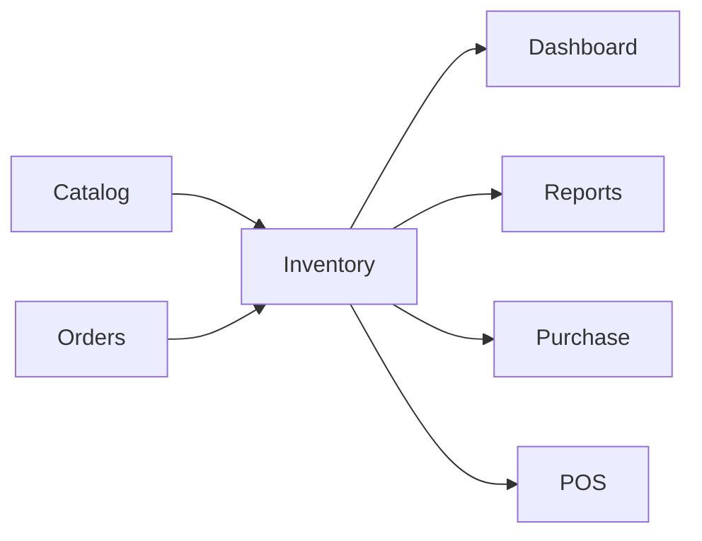
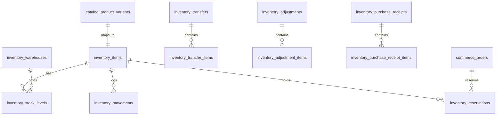

# AgainERP — Inventory Module Architecture

> **Status:** Draft (superseded for platform scope)  
> **Module:** Inventory (Ecommerce domain · Platform-ready)  
> **Canonical doc:** [INVENTORY_MODULE_ARCHITECTURE.md](../../inventory/INVENTORY_MODULE_ARCHITECTURE.md) — independent module at `/inventory/*`  
> **Version:** 1.0  
> **Document Type:** Enterprise Architecture  
> **Governance:** [GOVERNANCE.md](../../../GOVERNANCE.md) · **Standards:** [DEVELOPMENT_STANDARDS.md](../../../DEVELOPMENT_STANDARDS.md)

**No application code.** Source of truth for Inventory design and implementation.

**Related:** [INVENTORY_MODULE_ARCHITECTURE.md](../../inventory/INVENTORY_MODULE_ARCHITECTURE.md) · [PURCHASE_MODULE_ARCHITECTURE.md](../../purchase/PURCHASE_MODULE_ARCHITECTURE.md) · [PRODUCT_MASTER_ARCHITECTURE.md](../../core/PRODUCT_MASTER_ARCHITECTURE.md) · [catalog/ARCHITECTURE.md](../catalog/ARCHITECTURE.md) · [orders/ARCHITECTURE.md](../orders/ARCHITECTURE.md) · [dashboard/ARCHITECTURE.md](../dashboard/ARCHITECTURE.md)  
**UI menus:** `Menus/Inventory/`

---

## Executive Summary

The **Inventory** module is AgainERP's **stock truth layer** for commerce operations. It owns warehouses, stock levels, movements, reservations, transfers, adjustments, supplier feeds, and purchase receipts — while Catalog owns product master data and Orders owns transactions.

| Connects To | Integration |
|-------------|-------------|
| **Catalog** | `catalog_product_variants.inventory_item_id` → sellable units |
| **Orders** | Reserve on confirm, deduct on ship, restock on return |
| **Purchase** | Supplier receipts, cost sync (future) |
| **Dashboard** | Low-stock alerts via `analytics_inventory` |
| **Reports** | Inventory valuation, movement history |

### Scale Targets

| Dimension | Target |
|-----------|--------|
| Warehouses | Multi-warehouse per company/branch |
| Stock movements | 10,000,000+ |
| Concurrent reservations | 1,000/sec peak (checkout) |
| Items | 10M+ (aligned with Catalog variants) |
| Movement write latency | < 50ms p95 |

**Table namespace:** `inventory_*`

---

# Module Mission

## Why Inventory Exists

Storefront availability, fulfillment, and accounting all depend on a single, auditable stock ledger. Without Inventory:

- Orders oversell products
- Catalog displays stale quantities
- Transfers and adjustments lack traceability
- Purchase receipts cannot reconcile inbound stock

Inventory is the **quantity spine** — Catalog maps *what* is sold; Inventory tracks *how many* and *where*.

## Dependent Modules



| Module | Inventory Consumption |
|--------|----------------------|
| Catalog | Read qty for PDP; link variants → items |
| Orders | Reserve, deduct, release, restock |
| Dashboard | Alerts, KPI widgets |
| Reports | Valuation, turnover, aging |
| Purchase | Receipt posting (inbound) |
| POS | Real-time deduct at sale |

---

# Module Structure

```
Inventory
├── Stock Management          ← Levels per warehouse, item lookup
├── Warehouses                ← Warehouse master, branch mapping
├── Stock Adjustment          ← Manual corrections (+/-)
├── Stock Transfer            ← Inter-warehouse moves
├── Low Stock Alerts          ← Threshold rules, notifications
├── Supplier Stock Feed       ← External supplier qty sync
├── Purchase Suggestions      ← Reorder recommendations
└── Barcode Management        ← Scan lookup → variant/item
```

## Section Purposes

| Section | Purpose | Primary Users |
|---------|---------|---------------|
| **Stock Management** | View/edit on-hand, reserved, available | Warehouse Manager |
| **Warehouses** | CRUD warehouses, default fulfillment | Admin |
| **Stock Adjustment** | Cycle count, damage, shrinkage | Warehouse Manager |
| **Stock Transfer** | Move stock between warehouses | Warehouse Manager |
| **Low Stock Alerts** | min_qty rules, alert queue | Inventory Manager |
| **Supplier Stock Feed** | Dropship / supplier API sync | Purchasing |
| **Purchase Suggestions** | Auto reorder list from velocity | Purchasing |
| **Barcode Management** | Barcode → item mapping | Warehouse, POS |

Screen docs: `Menus/Inventory/`

---

# Stock Model

## Core Concepts

| Concept | Definition |
|---------|------------|
| **Inventory Item** | Stock-tracked unit; 1:1 with `catalog_product_variants` (sellable SKU) |
| **Warehouse** | Physical or virtual location holding stock |
| **Stock Level** | `qty_on_hand`, `qty_reserved`, `qty_available` per item × warehouse |
| **Movement** | Immutable ledger row for every qty change |
| **Reservation** | Soft hold tied to `commerce_orders` until ship or cancel |
| **Transfer** | Paired outbound + inbound movements across warehouses |
| **Adjustment** | Admin correction with reason code |

## Quantity Formula

```
qty_available = qty_on_hand - qty_reserved
```

Catalog and Orders **never** store authoritative quantities — they read via Inventory API or cached snapshots.

---

# Catalog Integration

```
catalog_product_variants.inventory_item_id → inventory_items.id
inventory_stock_levels (item_id, warehouse_id) → quantities
```

| Event | Catalog | Inventory |
|-------|---------|-----------|
| Variant created | Sets `inventory_item_id` | Creates `inventory_items` row |
| PDP stock display | Reads available qty | Source of truth |
| Bundle sale | — | Deducts all component items |
| Digital product | No item link | N/A |

Admin **Inventory Mapping** (Catalog menu) links/unlinks variants; Stock Management shows read/write per warehouse.

---

# Orders Integration

| Order Event | Inventory Action | Table Impact |
|-------------|------------------|--------------|
| Order confirmed | **Reserve** | `inventory_reservations`, +`qty_reserved` |
| Payment failed / cancelled | **Release** | Delete reservation, -`qty_reserved` |
| Shipment dispatched | **Deduct** | Movement `sale`, -`qty_on_hand`, release reservation |
| Return completed (good) | **Restock** | Movement `return`, +`qty_on_hand` |
| Partial ship | Partial deduct | Per shipment line |
| Warehouse selection | Nearest-with-stock rule | `commerce_orders.warehouse_id` |

Orders subscribe to `inventory.stock.updated` for availability cache invalidation.

---

# Movement Types

**Table:** `inventory_movements`

| `movement_type` | Trigger | Qty Sign |
|-----------------|---------|----------|
| `purchase_receipt` | Purchase receipt posted | + |
| `sale` | Order shipped | − |
| `return` | Return restock | + |
| `adjustment` | Manual adjustment | +/- |
| `transfer_out` | Transfer source | − |
| `transfer_in` | Transfer destination | + |
| `reservation_hold` | Order confirm | 0 (reservation only) |
| `reservation_release` | Cancel / timeout | 0 |
| `supplier_feed` | External sync | +/- |
| `initial` | Item onboarding | + |

Every movement: `item_id`, `warehouse_id`, `quantity`, `reference_type`, `reference_id`, `reason_code`, `created_by`, immutable `created_at`.

---

# Reservations

**Table:** `inventory_reservations`

| Field | Notes |
|-------|-------|
| `item_id` | FK → `inventory_items` |
| `warehouse_id` | FK |
| `order_id` | FK → `commerce_orders` |
| `order_item_id` | FK → `commerce_order_items` |
| `quantity` | Reserved qty |
| `status` | `active`, `fulfilled`, `released`, `expired` |
| `expires_at` | Optional TTL for pending payments |

FIFO allocation within warehouse. Expired reservations released by cron `ReleaseExpiredReservations`.

---

# Transfers & Adjustments

## Stock Transfer

**Tables:** `inventory_transfers`, `inventory_transfer_items`

```
Draft → In Transit → Received
         ↓
  transfer_out (source) + transfer_in (destination)
```

## Stock Adjustment

**Tables:** `inventory_adjustments`, `inventory_adjustment_items`

| `reason_code` | Use Case |
|---------------|----------|
| `cycle_count` | Physical count variance |
| `damage` | Write-off |
| `shrinkage` | Unexplained loss |
| `found` | Discovered stock |
| `opening_balance` | Initial load |

Requires `inventory.adjustment.approve` above configurable threshold.

---

# Suppliers & Purchase Receipts

**Tables:** `inventory_suppliers`, `inventory_supplier_items`, `inventory_purchase_receipts`, `inventory_purchase_receipt_items`

| Feature | Design |
|---------|--------|
| Supplier master | Links to Core contacts (`contact_type=supplier`) |
| Supplier SKU mapping | `inventory_supplier_items` per item |
| Supplier stock feed | API/CSV → `supplier_feed` movements |
| Purchase receipt | Inbound qty; updates `qty_on_hand` |
| Cost sync | Posts `cost_price` hint to Catalog (async) |

Purchase module (future) owns PO workflow; Inventory owns receipt posting and stock impact.

---

# Warehouses

**Table:** `inventory_warehouses`

| Field | Notes |
|-------|-------|
| `name` | Display name |
| `code` | Unique per company |
| `branch_id` | FK → Core branches |
| `address_id` | FK → Core addresses |
| `is_default` | Default fulfillment warehouse |
| `is_active` | |
| `priority` | Allocation order for multi-warehouse |

Virtual warehouses supported (dropship, consignment) via `warehouse_type`.

---

# System Events

| Event | Payload | Subscribers |
|-------|---------|-------------|
| `inventory.stock.updated` | `item_id`, `warehouse_id`, `qty_available` | Catalog cache, Orders, Dashboard |
| `inventory.stock.low` | `item_id`, `warehouse_id`, `qty`, `threshold` | Notifications, Purchase Suggestions |
| `inventory.reservation.created` | `reservation_id`, `order_id` | Orders timeline |
| `inventory.reservation.released` | `reservation_id`, `reason` | Orders |
| `inventory.movement.created` | `movement_id`, `type` | Reports aggregator, Audit |
| `inventory.transfer.completed` | `transfer_id` | Activity logs |
| `inventory.adjustment.approved` | `adjustment_id` | Accounting (future) |
| `inventory.receipt.posted` | `receipt_id` | Catalog cost sync |

All events include `company_id` for multi-tenant routing.

---

# Database Architecture

## ER Diagram



## Table List

| Table | Purpose |
|-------|---------|
| `inventory_items` | Stock-tracked SKU unit |
| `inventory_warehouses` | Warehouse master |
| `inventory_stock_levels` | On-hand / reserved per item × warehouse |
| `inventory_movements` | Immutable movement ledger |
| `inventory_reservations` | Order stock holds |
| `inventory_transfers` | Inter-warehouse transfer header |
| `inventory_transfer_items` | Transfer lines |
| `inventory_adjustments` | Adjustment header |
| `inventory_adjustment_items` | Adjustment lines |
| `inventory_suppliers` | Supplier extensions |
| `inventory_supplier_items` | Supplier SKU mapping |
| `inventory_supplier_feeds` | Feed job config |
| `inventory_purchase_receipts` | Inbound receipt header |
| `inventory_purchase_receipt_items` | Receipt lines |
| `inventory_reorder_rules` | min/max replenishment rules |
| `inventory_barcode_mappings` | Barcode → item |

## Indexes (10M+ movements)

| Table | Index | Reason |
|-------|-------|--------|
| `inventory_movements` | `(company_id, item_id, created_at)` | Item history |
| `inventory_movements` | `(company_id, reference_type, reference_id)` | Order lookup |
| `inventory_stock_levels` | `(item_id, warehouse_id)` UNIQUE | Level read |
| `inventory_reservations` | `(order_id, status)` | Fulfillment |
| `inventory_items` | `(company_id, sku)` | Admin search |

## Partitioning

- Partition `inventory_movements` by `created_at` year
- Archive movements > 7 years to cold storage
- Read replicas for stock level queries

---

# API Architecture

Base: `/api/v1/inventory/`  
Auth: Bearer + `X-Company-Id`

## Stock & Items

| Method | Endpoint | Permission |
|--------|----------|------------|
| GET | `/items` | `inventory.item.read` |
| GET | `/items/{uuid}` | `inventory.item.read` |
| GET | `/items/{uuid}/levels` | `inventory.stock.read` |
| GET | `/stock/availability` | `inventory.stock.read` |
| POST | `/stock/reserve` | `inventory.stock.reserve` |
| POST | `/stock/release` | `inventory.stock.reserve` |
| POST | `/stock/deduct` | `inventory.stock.write` |

## Warehouses, Transfers, Adjustments

| Method | Endpoint | Permission |
|--------|----------|------------|
| GET/POST | `/warehouses` | `inventory.warehouse.*` |
| GET/POST | `/transfers` | `inventory.transfer.*` |
| POST | `/transfers/{uuid}/ship` | `inventory.transfer.write` |
| POST | `/transfers/{uuid}/receive` | `inventory.transfer.write` |
| GET/POST | `/adjustments` | `inventory.adjustment.*` |
| POST | `/adjustments/{uuid}/approve` | `inventory.adjustment.approve` |
| GET | `/movements` | `inventory.movement.read` |
| GET/POST | `/receipts` | `inventory.receipt.*` |

## Storefront (read-only)

`GET /api/v1/storefront/inventory/availability?variant_ids=…` — cached, CDN-friendly.

## Response Envelope

```json
{
  "data": { },
  "meta": { "page": 1, "per_page": 50, "total": 10000000 },
  "errors": []
}
```

---

# Permissions

| Key | Description |
|-----|-------------|
| `inventory.access` | Module access |
| `inventory.item.read` | View items |
| `inventory.stock.read` | View levels |
| `inventory.stock.write` | Deduct / receive |
| `inventory.stock.reserve` | API reserve (Orders service) |
| `inventory.warehouse.*` | Warehouse CRUD |
| `inventory.transfer.*` | Transfers |
| `inventory.adjustment.*` | Adjustments |
| `inventory.adjustment.approve` | Approve large adjustments |
| `inventory.receipt.*` | Purchase receipts |
| `inventory.movement.read` | Movement history |

---

# Performance Requirements

| Requirement | Strategy |
|-------------|----------|
| 10M movements | Partitioned ledger, cursor pagination |
| Fast availability | Redis cache per `item_id:warehouse_id`, invalidate on event |
| Checkout reserve | Row-level lock on `inventory_stock_levels`, optimistic retry |
| Bulk transfer | Queue job `ProcessInventoryTransfer` |
| Nightly rollup | Aggregate to `analytics_inventory` |

| Target | Value |
|--------|-------|
| Availability API p95 | < 100ms |
| Reserve API p95 | < 50ms |
| Movement list p95 | < 500ms |

---

# Dependencies

- **Core:** [contacts](../../../core/entities/contacts.md) (suppliers), [addresses](../../../core/entities/addresses.md), [branches](../../../core/entities/branches.md), [companies](../../../core/entities/companies.md), [activity_logs](../../../core/entities/activities.md)
- **Ecommerce:** [catalog/ARCHITECTURE.md](../catalog/ARCHITECTURE.md), [orders/ARCHITECTURE.md](../orders/ARCHITECTURE.md)
- **Analytics:** [analytics/ARCHITECTURE.md](../analytics/ARCHITECTURE.md) (`analytics_inventory`)
- **Services:** Workflow Engine, Notification System, Queue Workers

---

## Document Index

| Screen | Menu Doc |
|--------|----------|
| Stock Management | [Menus/Inventory/Stock Management.md](../Menus/Inventory/Stock%20Management.md) |
| Warehouses | [Menus/Inventory/Warehouses.md](../Menus/Inventory/Warehouses.md) |
| Stock Transfer | [Menus/Inventory/Stock Transfer.md](../Menus/Inventory/Stock%20Transfer.md) |
| Full menu | [MENU_STRUCTURE.md](../MENU_STRUCTURE.md) |

---

**Module:** Inventory  
**Last Updated:** 2026-06-12  
**Status:** Draft — requires approval before implementation
