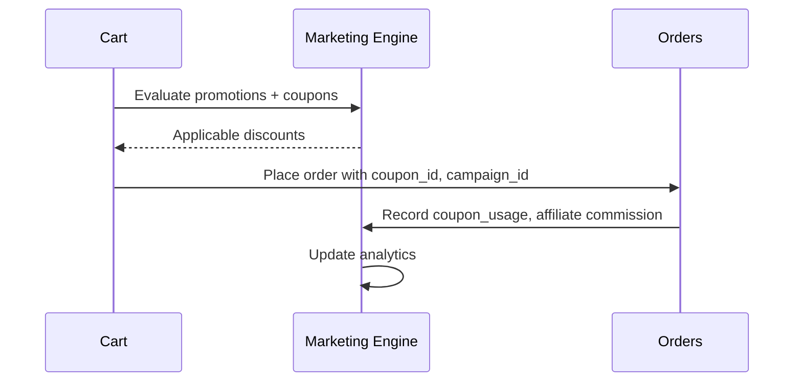

# AgainERP — Marketing Module Architecture

> **Status:** Superseded (Ecommerce scope)  
> **Module:** Marketing (Ecommerce domain · Platform-ready)  
> **Version:** 1.0  
> **Document Type:** Enterprise Architecture  
> **Governance:** [GOVERNANCE.md](../../../GOVERNANCE.md) · **Standards:** [DEVELOPMENT_STANDARDS.md](../../../DEVELOPMENT_STANDARDS.md)

> **Use instead:** [MARKETING_MODULE_ARCHITECTURE.md](../../marketing/MARKETING_MODULE_ARCHITECTURE.md) — approved enterprise Marketing Automation Platform at `/marketing/*` (Step 11).

**No application code.** Ecommerce integration reference for checkout, coupons, and storefront marketing features.

**Related:** [MARKETING_MODULE_ARCHITECTURE.md](../../marketing/MARKETING_MODULE_ARCHITECTURE.md) · [orders/ARCHITECTURE.md](../orders/ARCHITECTURE.md) · [customers/ARCHITECTURE.md](../customers/ARCHITECTURE.md) · [catalog/ARCHITECTURE.md](../catalog/ARCHITECTURE.md)  
**UI menus:** `Menus/Marketing/`

---

## Executive Summary

The **Marketing** module is AgainERP's **promotion and growth engine** for ecommerce. It manages coupons, vouchers, promotions, campaigns, multi-channel messaging (email/SMS/WhatsApp), affiliate and referral programs, loyalty, abandoned cart recovery, and storefront popups.

| Connects To | Integration |
|-------------|-------------|
| **Orders** | Coupon application, campaign attribution |
| **Customers** | Segments, wallet, loyalty points |
| **Catalog** | Product/collection targeting |
| **Analytics** | Campaign ROI, conversion funnels |
| **Notifications** | Email/SMS/WhatsApp delivery (Core) |

### Scale Targets

| Dimension | Target |
|-----------|--------|
| Active coupons | 100,000+ |
| Campaign sends | 1M emails/day (queued) |
| Promotion rule evaluations | < 20ms at checkout |
| Affiliate tracking | Real-time click → conversion |

**Table namespace:** `marketing_*`

---

# Module Mission

## Why Marketing Exists

Revenue growth requires flexible discounting, targeted campaigns, and partner programs without hard-coding rules into checkout. Marketing centralizes **rules, attribution, and delivery** while Orders executes discounts at transaction time.

```
Marketing defines rules → Orders evaluates at checkout → Analytics measures outcome
```

---

# Module Structure

```
Marketing
├── Coupons                     ← Discount codes
├── Vouchers                    ← Pre-paid / gift vouchers
├── Promotions                  ← Rule-based auto discounts
├── Flash Sales                 ← Time-boxed price events
├── Special Offers              ← Bundled / BOGO offers
├── Campaign Manager            ← Multi-channel campaigns
├── Email Marketing             ← Email campaigns & templates
├── SMS Marketing               ← SMS blasts & triggers
├── WhatsApp Marketing          ← WhatsApp templates & sends
├── Push Notifications          ← Web/mobile push (v2)
├── Affiliate Program           ← Affiliates, commissions
├── Referral Program            ← Customer referrals
├── Loyalty Program             ← Points rules (→ Customers ledger)
├── Abandoned Cart Recovery     ← Automated recovery flows
├── Popup Manager               ← Storefront popups
└── Announcement Bar            ← Site-wide banner
```

Screen docs: `Menus/Marketing/`

---

# Coupons & Vouchers

## Coupons

**Tables:** `marketing_coupons`, `marketing_coupon_rules`, `marketing_coupon_usages`

| Field (`marketing_coupons`) | Notes |
|----------------------------|-------|
| `code` | Unique per company |
| `discount_type` | `percent`, `fixed`, `free_shipping` |
| `discount_value` | |
| `min_cart_amount` | |
| `max_uses` | Global limit |
| `max_uses_per_customer` | |
| `starts_at`, `expires_at` | |
| `is_active` | |

**Rules** (`marketing_coupon_rules`): product IDs, categories, customer groups, first-order-only.

**Usage** (`marketing_coupon_usages`): `coupon_id`, `order_id`, `contact_id`, `discount_applied`.

## Vouchers

**Tables:** `marketing_vouchers`, `marketing_voucher_redemptions`

Pre-generated codes with fixed balance (gift cards). Redeem at checkout like wallet credit.  
Links to Catalog `gift_card` product type on purchase.

---

# Promotions & Offers

## Promotions (Rule Engine)

**Tables:** `marketing_promotions`, `marketing_promotion_rules`, `marketing_promotion_actions`

| Rule Type | Example |
|-----------|---------|
| `cart_subtotal` | Spend ৳5000+ |
| `product_in_cart` | Buy product X |
| `customer_group` | VIP only |
| `category` | Electronics category |

| Action Type | Example |
|-------------|---------|
| `percent_off_cart` | 10% off |
| `percent_off_item` | 20% off matching SKUs |
| `free_item` | Free sample |
| `free_shipping` | |

Stacking policy: configurable priority; best-deal or stackable modes.

## Flash Sales & Special Offers

**Table:** `marketing_flash_sales` — `starts_at`, `ends_at`, linked products with override price  
**Table:** `marketing_special_offers` — BOGO, bundle deals, tiered discounts

Catalog `special_price` may sync from flash sale window (async).

**Web prototype (2026-06-15):** Admin UI + Zustand persist + storefront resolver implemented in `apps/web`. Developer docs:

- [MARKETING_PROTOTYPE_DEV.md](../../../ui-prototype/marketing/MARKETING_PROTOTYPE_DEV.md) — master index
- [FLASH_SALES_ADMIN.md](../../../ui-prototype/marketing/FLASH_SALES_ADMIN.md) · [SPECIAL_OFFERS_ADMIN.md](../../../ui-prototype/marketing/SPECIAL_OFFERS_ADMIN.md)
- [STOREFRONT_OFFERS_DEV.md](../../../ui-prototype/marketing/STOREFRONT_OFFERS_DEV.md) — import/SSR rules (required reading)

---

# Campaign Manager

**Tables:** `marketing_campaigns`, `marketing_campaign_channels`, `marketing_campaign_audiences`

| Field | Notes |
|-------|-------|
| `name` | Campaign label |
| `type` | `email`, `sms`, `whatsapp`, `multi` |
| `status` | draft, scheduled, running, completed |
| `audience_id` | Segment FK |
| `utm_source`, `utm_medium`, `utm_campaign` | Attribution |
| `budget` | Optional spend cap |

Orders store `campaign_id` for attribution reporting.

## Channel Integrations

| Channel | Delivery | Config |
|---------|----------|--------|
| Email | Core Notification + templates | `Menus/System/Email Settings.md` |
| SMS | Core SMS gateway | `Menus/System/SMS Settings.md` |
| WhatsApp | WhatsApp Business API | `Menus/System/WhatsApp Settings.md` |
| Push | FCM (v2) | |

**Tables:** `marketing_email_sends`, `marketing_sms_sends` — delivery status per recipient.

---

# Audience Segmentation

**Tables:** `marketing_segments`, `marketing_segment_rules`

| Segment Type | Rule Example |
|--------------|--------------|
| Static | Manual contact list |
| Dynamic | `orders_count > 3 AND last_order < 30d` |
| RFM | Recency, frequency, monetary tiers |

Evaluated nightly → `marketing_segment_members` (contact_id list).  
Uses Core `contacts` — no duplicate customer table.

---

# Affiliate Program

**Tables:** `marketing_affiliates`, `marketing_affiliate_links`, `marketing_affiliate_commissions`

| Concept | Design |
|---------|--------|
| Affiliate | Contact or partner record + `affiliate_code` |
| Tracking link | `?aff={code}` cookie 30-day window |
| Commission | % of `order.grand_total` on completed orders |
| Payout | Manual or scheduled batch |
| Status | pending, approved, paid |

**Table:** `marketing_affiliate_clicks` — click analytics.

Orders: `affiliate_id` on `commerce_orders`.

---

# Referral Program

**Tables:** `marketing_referral_programs`, `marketing_referrals`

| Step | Action |
|------|--------|
| Referrer shares code/link | `referral_code` on contact |
| Referee registers + first order | Trigger rewards |
| Referrer reward | Wallet credit or points |
| Referee reward | Welcome coupon |

Orders: `referral_code` field for attribution.

---

# Loyalty Program

**Table:** `marketing_loyalty_rules` — earn/redeem configuration  
Execution: [customers/ARCHITECTURE.md](../customers/ARCHITECTURE.md) `commerce_reward_ledger`

| Rule | Example |
|------|---------|
| Earn rate | 1 point per ৳100 |
| Redeem rate | 100 points = ৳50 off |
| Expiry | Points expire after 12 months |
| Tiers | Silver/Gold/Platinum by lifetime spend |

---

# Abandoned Cart Recovery

**Tables:** `marketing_abandoned_cart_rules`, `marketing_abandoned_cart_sends`

Uses Orders `commerce_carts` (abandoned = no order within threshold).

| Step | Timing |
|------|--------|
| Cart abandoned | 1 hour |
| Email 1 | Reminder + cart link |
| Email 2 | 10% coupon (24h) |
| SMS | Optional 48h |

Respects opt-out and frequency caps.

---

# Popups & Announcement Bar

**Tables:** `marketing_popups`, `marketing_announcement_bars`

| Feature | Targeting |
|---------|-----------|
| Popup | Page URL, exit intent, new visitor |
| Announcement bar | Site-wide, date range, link |
| Content | HTML + CTA + coupon attach |

Builder integration for visual popup design (v2).

---

# Checkout Integration



Evaluation order: promotions (auto) → coupon (code) → loyalty redeem → wallet.

---

# System Events

| Event | Payload | Subscribers |
|-------|---------|-------------|
| `marketing.coupon.applied` | `coupon_id`, `order_id` | Analytics |
| `marketing.campaign.sent` | `campaign_id`, `recipient_count` | Analytics |
| `marketing.affiliate.conversion` | `affiliate_id`, `order_id` | Commission queue |
| `marketing.referral.completed` | `referrer_id`, `referee_id` | Wallet, Points |
| `marketing.cart.abandoned` | `cart_id`, `contact_id` | Recovery queue |
| `orders.order.placed` | `campaign_id`, `coupon_id` | Attribution rollup |

---

# Database Architecture

## Table List

| Table | Purpose |
|-------|---------|
| `marketing_coupons` | Coupon master |
| `marketing_coupon_rules` | Eligibility rules |
| `marketing_coupon_usages` | Redemption log |
| `marketing_vouchers` | Gift vouchers |
| `marketing_voucher_redemptions` | |
| `marketing_promotions` | Auto promotion header |
| `marketing_promotion_rules` | Conditions |
| `marketing_promotion_actions` | Discount actions |
| `marketing_flash_sales` | Timed sales |
| `marketing_flash_sale_items` | |
| `marketing_special_offers` | BOGO / bundles |
| `marketing_campaigns` | Campaign header |
| `marketing_campaign_channels` | Per-channel config |
| `marketing_campaign_audiences` | |
| `marketing_segments` | Audience segments |
| `marketing_segment_rules` | |
| `marketing_segment_members` | Materialized members |
| `marketing_email_sends` | Email delivery log |
| `marketing_sms_sends` | SMS delivery log |
| `marketing_affiliates` | Affiliate accounts |
| `marketing_affiliate_links` | |
| `marketing_affiliate_clicks` | |
| `marketing_affiliate_commissions` | |
| `marketing_referral_programs` | |
| `marketing_referrals` | |
| `marketing_loyalty_rules` | |
| `marketing_abandoned_cart_rules` | |
| `marketing_abandoned_cart_sends` | |
| `marketing_popups` | |
| `marketing_announcement_bars` | |

---

# API Architecture

Base: `/api/v1/marketing/`  
Auth: Bearer + `X-Company-Id`

| Method | Endpoint | Permission |
|--------|----------|------------|
| GET/POST | `/coupons` | `marketing.coupon.*` |
| POST | `/coupons/validate` | public (storefront) |
| GET/POST | `/promotions` | `marketing.promotion.*` |
| GET/POST | `/campaigns` | `marketing.campaign.*` |
| POST | `/campaigns/{uuid}/send` | `marketing.campaign.send` |
| GET/POST | `/segments` | `marketing.segment.*` |
| GET/POST | `/affiliates` | `marketing.affiliate.*` |
| GET/POST | `/referrals` | `marketing.referral.*` |
| GET/PATCH | `/loyalty/rules` | `marketing.loyalty.*` |
| POST | `/evaluate` | `marketing.promotion.read` (checkout) |
| GET/POST | `/popups` | `marketing.popup.*` |

Storefront: `/api/v1/storefront/marketing/apply-coupon`, active flash sales, announcement bar.

---

# Permissions

| Key | Description |
|-----|-------------|
| `marketing.access` | Module access |
| `marketing.coupon.*` | Coupon CRUD |
| `marketing.promotion.*` | Promotions |
| `marketing.campaign.*` | Campaigns |
| `marketing.campaign.send` | Send messages |
| `marketing.segment.*` | Segments |
| `marketing.affiliate.*` | Affiliates |
| `marketing.referral.*` | Referrals |
| `marketing.loyalty.*` | Loyalty rules |
| `marketing.popup.*` | Popups & bars |

---

# Dependencies

- **Core:** [contacts](../../../core/entities/contacts.md), Notification System, Email/SMS/WhatsApp settings
- **Ecommerce:** [orders/ARCHITECTURE.md](../orders/ARCHITECTURE.md), [customers/ARCHITECTURE.md](../customers/ARCHITECTURE.md), [catalog/ARCHITECTURE.md](../catalog/ARCHITECTURE.md), [analytics/ARCHITECTURE.md](../analytics/ARCHITECTURE.md), [reports/ARCHITECTURE.md](../reports/ARCHITECTURE.md)
- **Services:** Queue Workers (campaign sends), Workflow Engine

---

## Document Index

| Screen | Menu Doc |
|--------|----------|
| Coupons | [Menus/Marketing/Coupons.md](../Menus/Marketing/Coupons.md) |
| Campaign Manager | [Menus/Marketing/Campaign Manager.md](../Menus/Marketing/Campaign%20Manager.md) |
| Full menu | [MENU_STRUCTURE.md](../MENU_STRUCTURE.md) |

---

**Module:** Marketing  
**Last Updated:** 2026-06-12  
**Status:** Draft — requires approval before implementation
