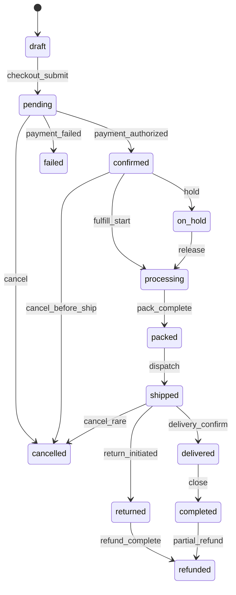
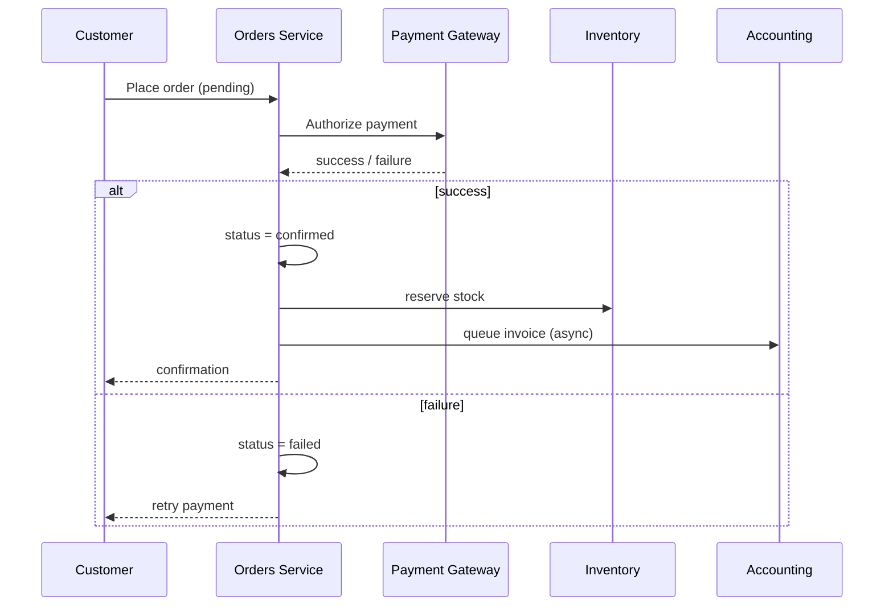
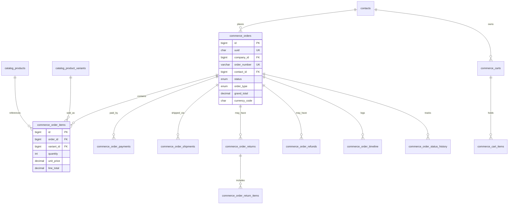

# AgainERP — Orders Module Architecture

> **Status:** Approved Architecture  
> **Module:** Orders  
> **Priority:** Critical  
> **Version:** 2.0  
> **Document Type:** Enterprise Architecture  
> **Governance:** [GOVERNANCE.md](../../../GOVERNANCE.md) · **Platform:** [MASTER_MODULE_ARCHITECTURE.md](../../../MASTER_MODULE_ARCHITECTURE.md)

**No code. No migrations. No controllers.**  
Central transaction engine connecting Customers, Catalog, Inventory, Payments, Shipping, Marketing, CRM, Accounting, and AI.

**Related:** [catalog/ARCHITECTURE.md](../catalog/ARCHITECTURE.md) · [ECOMMERCE_STOREFRONT_ARCHITECTURE.md](../ECOMMERCE_STOREFRONT_ARCHITECTURE.md) · [modules/sales/SALES_MODULE_ARCHITECTURE.md](../../sales/SALES_MODULE_ARCHITECTURE.md) · [modules/inventory/INVENTORY_MODULE_ARCHITECTURE.md](../../inventory/INVENTORY_MODULE_ARCHITECTURE.md) · [core/ARCHITECTURE.md](../../../core/ARCHITECTURE.md) · [dashboard/ARCHITECTURE.md](../dashboard/ARCHITECTURE.md)  
**UI menus:** `Menus/Sales/` (Orders, Returns, Refunds, …) · **B2B quote-to-cash:** `/sales/*` ([Sales Module](../../sales/SALES_MODULE_ARCHITECTURE.md))

---

## Objective

Design a modern enterprise-grade order management system. Orders is the **operational center** of the ecommerce platform.

Must support: Ecommerce · Call Center · Warehouse · Delivery · Customer Service · AI-assisted operations.

Scalable for: small stores · large ecommerce · multi-warehouse · multi-branch · future marketplace.

### Design Inspiration

| Source | Weight | Borrowed patterns |
|--------|--------|-----------------|
| Odoo | 30% | Chatter timeline, activities, followers |
| Shopify | 30% | Order list speed, fulfillment flow |
| HubSpot | 20% | Customer context, activities, assignments |
| Linear | 20% | Minimal UI, fast keyboard, status clarity |

### Final Rule

**The Order Details Page is the operational workspace.** Every action related to an order must be possible from a single screen without navigating away.

---

## Executive Summary

The **Orders Module** is AgainERP's **central transaction engine**. Every sale — online, POS, manual, wholesale, or quotation — flows through Orders before reaching Sales and Accounting.

| Connects To | Integration |
|-------------|-------------|
| **Customers** | Core `contacts`, addresses, groups, wallet |
| **Catalog** | `catalog_product_variants`, pricing, bundles |
| **Inventory** | Reserve → deduct → return stock |
| **Payments** | Multi-gateway, partial, installment |
| **Shipping** | Methods, zones, multi-shipment tracking |
| **Marketing** | Campaign, affiliate, coupons, abandoned cart |
| **CRM** | Customer history, CLV |
| **Accounting** | Invoices, payment journal entries |
| **AI** | Fraud, predictions, summaries |

### Scale Targets

| Metric | Target |
|--------|--------|
| Orders | 1,000,000+ |
| Concurrent admin users | 100 |
| Status update latency | Real-time (WebSocket v2) |
| Bulk actions | 10,000 orders/batch |

**Table namespace:** `commerce_*` (platform-owned; POS and Marketplace share same engine)

---

# Module Mission

```
Customer selects products (Catalog)
        ↓
    Cart / Checkout (Orders)
        ↓
    Payment authorized (Orders → Payment gateways)
        ↓
    Stock reserved (Orders → Inventory)
        ↓
    Order confirmed (Orders)
        ↓
    Shipment fulfilled (Orders → Shipping)
        ↓
    Sales order synced (Orders → Sales)
        ↓
    Invoice & payment posted (Orders → Accounting)
```

Orders **owns** the transaction record. Other modules **react** via APIs and System Events.

---

# Module Structure

```
Orders
├── Dashboard
├── All Orders
├── Draft Orders
├── Pending Orders
├── Confirmed Orders
├── Processing Orders
├── Packed Orders
├── Shipped Orders
├── Delivered Orders
├── Completed Orders
├── Returns
├── Refunds
├── Payments
├── Shipments
├── Abandoned Carts
├── Activities
└── Reports
```

### Route Mapping (admin prototype)

| Screen | Route |
|--------|-------|
| Dashboard | `/orders` |
| All Orders | `/orders/all` |
| Status lists | `/orders/all?status=pending` (etc.) |
| Order workspace | `/orders/[id]` |
| Returns | `/orders/returns` |
| Refunds | `/orders/refunds` |
| Payments | `/orders/payments` |
| Shipments | `/orders/shipments` |
| Abandoned Carts | `/orders/abandoned-carts` |
| Activities | `/orders/activities` |
| Reports | `/orders/reports` |

### Dashboard Widgets

Total Orders · Today's Orders · Pending · Processing · Shipped · Delivered · Revenue · AOV · Return Rate · Refund Rate · Top Products · Recent Activities · AI Insights

### All Orders (primary grid)

AG Grid with: live search · advanced filters · saved filters · bulk actions · column manager · export/import · quick actions · inline status updates · assignment management

**Columns:** Order Number · Order Date · Customer · Phone · Email · Branch · Items · Amount · Payment Status · Shipment Status · Order Status · Assigned Staff · Tags · Actions

### Order Details Page (two-column workspace)

**Left column:** Order Summary · Products · Customer · Billing · Shipping · Payment · Courier · Notes · Custom Fields

**Right column:** Timeline (Odoo Chatter style) · Activities · AI Insights · Comments · Internal Notes · Attachments · Followers · History

**Order Summary card:** Order # · Order/Payment/Shipment status · Source · Date · Branch · Assigned staff · Priority · Tags

**Products section:** Image · Name · SKU · Qty · Unit price · Discount · Tax · Total · inline qty/discount · bundle/variant info

**Customer section:** Name · Phone · Email · Address · City · Region · Country · Group · LTV · Order count · Risk score

**Payment section:** Method · Transaction ID · Paid/Due/Refund · Status · Payment timeline

**Shipment section:** Courier · Tracking # · Status · Dates · Cost · Tracking URL

### Activities

Types: Call Customer · Address Verification · Payment Verification · Warehouse Follow-up · Courier Follow-up · Delivery Confirmation · Reminder · Meeting · Task — assignable, visible on dashboard.

### AI Integration (Chief AI Agent)

| Capability | Output |
|------------|--------|
| Order Summary | NL summary for support |
| Fraud Detection | Low / Medium / High risk score |
| Customer Insights | LTV, patterns, retention probability |
| Delivery Prediction | Success, delays, return risk |
| Upsell Suggestions | Related products, bundles, cross-sell |

### Design Principles

Fast · Minimal · Operational · AI Assisted · Timeline Driven · Activity Driven · Collaboration Friendly · Scalable · Documentation First

## Section Purposes

| Section | Purpose | Primary Users |
|---------|---------|---------------|
| **Dashboard** | Orders today, pending shipment, failed payments | Order Manager |
| **Order List** | Find and act on orders | All order roles |
| **Order Details** | Single source view for support & fulfillment | Support, Warehouse |
| **Create Order** | Manual order without storefront | Sales, Admin |
| **Order Timeline** | What happened and when | Support, Audit |
| **Order Notes** | Internal staff memos | Support, Warehouse |
| **Order Comments** | Customer-visible or threaded discussion | Support |
| **Invoices** | Tax invoice, proforma | Finance |
| **Shipments** | Pick, pack, ship, track | Warehouse |
| **Returns** | RMA, inspection, replacement | Support, Warehouse |
| **Refunds** | Payment reversal | Finance |
| **Transactions** | Gateway payment records | Finance |
| **Abandoned Carts** | Marketing recovery | Marketing |
| **Quotations** | B2B quotes before order | Sales |
| **Draft Orders** | Resume later | Sales |
| **Bulk Actions** | Operational efficiency at scale | Order Manager |
| **Order History** | Compliance audit trail | Admin, Auditor |
| **Order Reports** | Analytics export | Manager, Finance |

---

# Order Lifecycle

## Primary Flow

```
Cart → Checkout → Pending → Confirmed → Processing → Packed → Shipped → Delivered → Completed
```

## State Machine



## Alternative States

| State | `status` | Description |
|-------|----------|-------------|
| **Cancelled** | `cancelled` | Order voided; release stock |
| **Returned** | `returned` | Goods coming back |
| **Refunded** | `refunded` | Money returned |
| **Failed** | `failed` | Payment failed |
| **Draft** | `draft` | Not submitted |
| **On Hold** | `on_hold` | Manual pause (fraud review, stock issue) |

## Transition Permissions

| Transition | Permission |
|------------|------------|
| confirm | `commerce.order.confirm` |
| process / pack / ship | `commerce.order.fulfill` |
| cancel | `commerce.order.cancel` |
| hold / release | `commerce.order.hold` |
| refund | `commerce.order.refund` |

Every transition → `commerce_order_timeline` + Core `activity_logs` + System Event.

---

# Order Types

| Type | `order_type` | Source | Notes |
|------|--------------|--------|-------|
| **Online Order** | `online` | Storefront | Default ecommerce |
| **POS Order** | `pos` | POS terminal | Sync same engine |
| **Manual Order** | `manual` | Admin create | Phone orders |
| **Wholesale Order** | `wholesale` | B2B portal | Tier pricing |
| **Quotation Order** | `quotation` | Sales quote | Converts to order |
| **Subscription Order** | `subscription` | Recurring | Billing cycle link |
| **Pre-Order** | `preorder` | Storefront | Ship when available |
| **Backorder** | `backorder` | Auto-split | Partial fulfillment |

---

# Order Information

## Basic Fields (`commerce_orders`)

| Field | Type | Required | Notes |
|-------|------|----------|-------|
| `order_number` | VARCHAR | Yes | Unique per company; human-readable |
| `contact_id` | FK | Yes* | Core contacts (*guest checkout optional) |
| `branch_id` | FK | No | Selling branch |
| `warehouse_id` | FK | No | Fulfillment warehouse |
| `order_date` | TIMESTAMP | Yes | Placement time |
| `status` | ENUM | Yes | Lifecycle state |
| `order_type` | ENUM | Yes | See order types |
| `currency_code` | CHAR(3) | Yes | BDT, USD, EUR |
| `locale` | VARCHAR | No | Order language |

## Advanced / Attribution

| Field | Purpose |
|-------|---------|
| `source` | web, pos, admin, api, marketplace |
| `campaign_id` | Marketing campaign FK |
| `affiliate_id` | Affiliate tracking |
| `referral_code` | Referral program |
| `device_type` | mobile, tablet, desktop |
| `ip_address` | Fraud, geo |
| `user_agent` | Analytics |
| `coupon_id` | Applied coupon |
| `customer_group_id` | Pricing tier |

Tags via Core `taggables`. Internal notes via Core `notes`.

## Monetary Summary

| Field | Description |
|-------|-------------|
| `subtotal` | Line items before tax/discount |
| `discount_amount` | Coupons, rules |
| `tax_amount` | Core tax engine |
| `shipping_amount` | Selected method |
| `grand_total` | Payable amount |
| `paid_amount` | Sum of successful payments |
| `refunded_amount` | Sum of refunds |

---

# Order Items

**Table:** `commerce_order_items`

| Field | Notes |
|-------|-------|
| `order_id` | FK |
| `product_id` | FK → catalog_products |
| `variant_id` | FK → catalog_product_variants (sellable unit) |
| `sku` | Snapshot at order time |
| `name` | Snapshot (translatable copy) |
| `product_type` | simple, bundle, digital, service |
| `quantity` | Ordered qty |
| `unit_price` | Price at order time |
| `discount_amount` | Line discount |
| `tax_amount` | Line tax |
| `line_total` | Computed |
| `bundle_parent_id` | For bundle children |
| `digital_delivery` | JSON: download URL, license key |

## Line Types Supported

Products · Variants · Bundles (parent + children) · Services · Digital (no ship) · Subscriptions

## Inventory Reservation

On `confirmed`: `InventoryService.reserve(variant_id, qty, order_id)`  
On `cancelled` / timeout: release reservation  
On `shipped`: `InventoryService.deduct(reservation_id)`

---

# Customer Integration

| Data | Source | Orders Usage |
|------|--------|--------------|
| Customer | Core `contacts` | `contact_id` |
| Billing address | Core `addresses` | polymorphic on order |
| Shipping address | Core `addresses` | polymorphic on order |
| Customer group | `commerce_customer_groups` | Pricing rules |
| Reward points | `commerce_reward_ledger` | Earn/redeem on order |
| Order history | `commerce_orders` by `contact_id` | CRM, support |
| CLV | `analytics_customers` | Dashboard, AI |

**Rule:** No duplicate customer fields on order — snapshot only name/email/phone for historical accuracy.

---

# Payment Architecture

## Supported Methods

| Method | `payment_method` | Flow |
|--------|------------------|------|
| Cash on Delivery | `cod` | Confirm on delivery |
| Bank Transfer | `bank_transfer` | Manual verify |
| Card | `card` | Gateway redirect/API |
| Mobile Banking | `mobile_banking` | bKash, Nagad, etc. |
| Wallet | `wallet` | Customer wallet balance |
| Store Credit | `store_credit` | Account credit |
| Partial Payment | multiple rows | `commerce_order_payments` |
| Installment | `installment` | Schedule in `commerce_installment_plans` |

## Transaction Flow



**Table:** `commerce_order_payments` — amount, method, gateway_ref, status (`pending`, `completed`, `failed`, `refunded`)

Multiple payments per order supported (deposit + balance).

---

# Shipping Architecture

| Component | Table / Design |
|-----------|----------------|
| Shipping methods | `commerce_shipping_methods` |
| Zones & rates | `commerce_shipping_zones`, `commerce_shipping_rates` |
| Providers | `provider` field: manual, pathao, redx, fedex |
| Shipments | `commerce_order_shipments` |
| Tracking | `tracking_number`, `tracking_url` |
| Status | `pending`, `picked`, `in_transit`, `delivered`, `failed` |
| Delivery notes | `delivery_notes` text |
| Multiple shipments | Multiple `commerce_order_shipments` per order (split fulfillment) |

Partial ship: Order stays `processing` until all shipments `delivered`.

---

# Return Management

## Workflow

```
Return Request → Return Approval → Return Pickup → Return Inspection → Return Completion
                                                      ↓
                                            Replacement OR Refund OR Store Credit
```

**Table:** `commerce_order_returns`

| Field | Notes |
|-------|-------|
| `order_id` | FK |
| `return_number` | RMA number |
| `status` | requested, approved, picked_up, inspected, completed, rejected |
| `reason` | Customer reason code |
| `resolution` | refund, replacement, store_credit |
| `items` | `commerce_order_return_items` |

On completion: restock via Inventory; trigger Refund if applicable.

---

# Refund Management

**Table:** `commerce_order_refunds`

| Type | `refund_type` |
|------|---------------|
| Full Refund | `full` |
| Partial Refund | `partial` |
| Wallet Refund | `wallet` |
| Gateway Refund | `gateway` |
| Manual Refund | `manual` |

## Approval Workflow

```
Requested → Pending Approval → Approved → Processing → Completed
                ↓
            Rejected
```

Finance role approves refunds above threshold (configurable per company).

---

# Inventory Integration

| Event | Inventory Action |
|-------|------------------|
| Order confirmed | **Reserve** stock |
| Order cancelled | **Release** reservation |
| Shipment dispatched | **Deduct** stock |
| Return completed | **Restock** (good condition) |
| Warehouse selection | Rule: nearest with stock, or manual |
| Transfer needed | Create transfer request (Inventory module) |

Orders **never** store `qty_on_hand` — reads from Inventory API for display only.

Sync events: `inventory.stock.updated` → Orders refreshes availability cache.

---

# Order Timeline

**Table:** `commerce_order_timeline`

| Event | Trigger |
|-------|---------|
| Order Created | checkout complete |
| Payment Received | gateway callback |
| Payment Failed | gateway decline |
| Status Changed | any transition |
| Packed | warehouse action |
| Shipped | tracking added |
| Delivered | carrier confirm |
| Return Initiated | RMA created |
| Refunded | refund completed |
| Note Added | staff note |
| Comment Added | customer message |

Each row: `order_id`, `event_type`, `description`, `actor_id`, `metadata` JSON, `created_at`.

Also mirrored to Core `activity_logs` for platform-wide audit.

---

# Communication Center

| Channel | Use Case | Service |
|---------|----------|---------|
| Order confirmation email | On confirmed | Core Notification |
| Shipping email | On shipped | Template + tracking link |
| SMS | Delivery updates | Notification Service |
| WhatsApp | Status updates | v2 |
| Push | Mobile app | v2 |
| Internal notes | Staff only | Core `notes` |
| Customer notes | Visible to customer | `comments` with flag |
| Staff notes | Warehouse instructions | Core `notes` |

Templates: `notification_templates` keyed by `order.{event}`.

---

# Reports

| Report | Metrics |
|--------|---------|
| Sales Reports | Revenue by period, channel |
| Order Reports | Volume, AOV, conversion |
| Status Reports | Count by status, aging |
| Payment Reports | Method breakdown, failures |
| Refund Reports | Refund rate, amount |
| Return Reports | Return rate by product |
| Customer Reports | Orders per customer, repeat rate |
| Product Reports | Units sold via order lines |
| Branch Reports | Performance by branch |
| Warehouse Reports | Fulfillment by warehouse |

Data source: `commerce_orders` + `analytics_sales` aggregates for dashboards.

---

# AI Features

| Feature | Input | Output |
|---------|-------|--------|
| **Fraud Detection** | IP, device, velocity, amount | Risk score 0–100; auto hold if > threshold |
| **Order Prediction** | Historical patterns | Forecast daily orders |
| **Customer Risk Analysis** | Return/refund history | Risk tier |
| **Smart Shipping** | Address, weight, stock location | Suggested method & warehouse |
| **Refund Risk Analysis** | Order + customer history | Approve/review flag |
| **Order Summary** | Order JSON | Natural language summary for support |

AI via Core AI Service — permission `commerce.order.ai`.

---

# Database Architecture

## Table List

| Table | Purpose |
|-------|---------|
| `commerce_orders` | Master order |
| `commerce_order_items` | Line items |
| `commerce_order_status_history` | Status change log |
| `commerce_order_payments` | Payment transactions |
| `commerce_order_shipments` | Shipments & tracking |
| `commerce_order_returns` | Return requests |
| `commerce_order_return_items` | Return line items |
| `commerce_order_refunds` | Refunds |
| `commerce_order_timeline` | Event feed |
| `commerce_carts` | Active / abandoned carts |
| `commerce_cart_items` | Cart lines |
| `commerce_quotations` | Quotes |
| `commerce_quotation_items` | Quote lines |
| `commerce_abandoned_cart_tracking` | Recovery metadata |

**Core (not duplicated):** `notes`, `comments`, `addresses`, `contacts`, `activity_logs`

## ER Diagram



## Indexes

| Table | Index | Reason |
|-------|-------|--------|
| `commerce_orders` | `(company_id, order_number)` UNIQUE | Lookup |
| `commerce_orders` | `(company_id, status, order_date)` | List filters |
| `commerce_orders` | `(contact_id)` | Customer history |
| `commerce_order_items` | `(order_id)` | Detail view |
| `commerce_order_items` | `(variant_id)` | Product reports |
| `commerce_order_timeline` | `(order_id, created_at)` | Timeline |

## Partitioning (1M+ orders)

- Partition `commerce_orders` by `order_date` year (future)
- Archive `completed` orders > 2 years to cold storage

---

# API Architecture

Base: `/api/v1/commerce/orders/`  
Auth: Bearer + `X-Company-Id`

## Endpoints

| Method | Endpoint | Purpose | Permission |
|--------|----------|---------|------------|
| GET | `/orders` | List / search | `commerce.order.read` |
| POST | `/orders` | Create (manual) | `commerce.order.write` |
| GET | `/orders/{uuid}` | Detail | `commerce.order.read` |
| PATCH | `/orders/{uuid}` | Update fields | `commerce.order.write` |
| POST | `/orders/{uuid}/status` | Change status | `commerce.order.fulfill` |
| POST | `/orders/{uuid}/cancel` | Cancel | `commerce.order.cancel` |
| POST | `/orders/{uuid}/hold` | On hold | `commerce.order.hold` |
| GET | `/orders/{uuid}/timeline` | Timeline | `commerce.order.read` |
| POST | `/orders/{uuid}/payments` | Record payment | `commerce.order.payment` |
| PATCH | `/payments/{uuid}` | Update payment | `commerce.order.payment` |
| POST | `/orders/{uuid}/shipments` | Create shipment | `commerce.order.fulfill` |
| PATCH | `/shipments/{uuid}` | Update tracking | `commerce.order.fulfill` |
| POST | `/orders/{uuid}/returns` | Create return | `commerce.order.return` |
| POST | `/returns/{uuid}/approve` | Approve RMA | `commerce.order.return` |
| POST | `/orders/{uuid}/refunds` | Create refund | `commerce.order.refund` |
| POST | `/refunds/{uuid}/approve` | Approve refund | `commerce.order.refund` |
| GET | `/carts/abandoned` | Abandoned carts | `commerce.cart.read` |
| GET | `/quotations` | List quotes | `commerce.quotation.read` |
| POST | `/quotations/{uuid}/convert` | Convert to order | `commerce.order.write` |
| GET | `/reports/orders` | Order reports | `commerce.order.report` |

## Storefront API (public)

`/api/v1/storefront/cart` · `/checkout` · `/orders/{uuid}/track`

## Response Envelope

```json
{
  "data": { },
  "meta": { "page": 1, "per_page": 50, "total": 1000000 },
  "errors": []
}
```

## Versioning

v1 current; breaking changes → `/api/v2/commerce/orders/`

---

# Permissions

## Permission Keys

| Key | Description |
|-----|-------------|
| `commerce.order.read` | View orders |
| `commerce.order.write` | Create / edit |
| `commerce.order.confirm` | Confirm pending |
| `commerce.order.fulfill` | Pack / ship |
| `commerce.order.cancel` | Cancel |
| `commerce.order.hold` | Hold / release |
| `commerce.order.payment` | Manage payments |
| `commerce.order.refund` | Process refunds |
| `commerce.order.return` | Manage returns |
| `commerce.order.export` | Export data |
| `commerce.order.report` | Reports |
| `commerce.order.bulk` | Bulk actions |
| `commerce.order.ai` | AI features |
| `commerce.cart.read` | Abandoned carts |
| `commerce.quotation.read` | Quotations |

## Access Matrix

| Area | Super Admin | Admin | Order Mgr | Sales | Warehouse | Support | Finance |
|------|:-----------:|:-----:|:---------:|:-----:|:---------:|:-------:|:-------:|
| Order List / Detail | ✓ | ✓ | ✓ | ✓ | read | ✓ | read |
| Create Order | ✓ | ✓ | ✓ | ✓ | — | — | — |
| Fulfill / Ship | ✓ | ✓ | ✓ | — | ✓ | — | — |
| Cancel | ✓ | ✓ | ✓ | — | — | ✓ | — |
| Payments | ✓ | ✓ | ✓ | — | — | — | ✓ |
| Refunds | ✓ | ✓ | approve | — | — | request | ✓ |
| Returns | ✓ | ✓ | ✓ | — | ✓ | ✓ | — |
| Bulk Actions | ✓ | ✓ | ✓ | — | — | — | — |
| Reports | ✓ | ✓ | ✓ | ✓ | — | — | ✓ |
| AI Insights | ✓ | ✓ | ✓ | — | — | — | — |

---

# Performance Requirements

| Requirement | Strategy |
|-------------|----------|
| 1M orders | Indexed lists, cursor pagination, date partitions |
| Fast search | Meilisearch index on order_number, contact name, email |
| Bulk actions | Queue jobs — `BulkUpdateOrderStatus` |
| Mass updates | Batch 500 rows/transaction |
| Real-time status | WebSocket channel `orders:{company_id}` (v2) |
| Analytics | Nightly aggregation to `analytics_sales` |

| Target | Value |
|--------|-------|
| Order list API p95 | < 500ms |
| Order detail API p95 | < 300ms |
| Checkout complete | < 2s |

---

# Future Compatibility

| Module | Integration | Extension Point |
|--------|-------------|-----------------|
| **Inventory** | Reserve/deduct API | Event subscribers |
| **CRM** | `contact_id`, order events | `orders.order.placed` |
| **Accounting** | Invoice, journal | Async on confirm |
| **POS** | `order_type=pos` | Same `commerce_orders` |
| **Marketplace** | `vendor_id`, split payouts | Multi-vendor line items |
| **AI** | Fraud, summary adapters | Core AI gateway |

### What Does Not Change

- `commerce_orders` as single transaction table
- Lifecycle state machine
- Core contacts/addresses for customer data
- Catalog variants on line items
- Event names and API envelope

---

## Document Index

| Screen | Menu Doc |
|--------|----------|
| Orders | [Menus/Sales/Orders.md](../Menus/Sales/Orders.md) |
| Order Status | [Menus/Sales/Order Status.md](../Menus/Sales/Order%20Status.md) |
| Returns | [Menus/Sales/Returns.md](../Menus/Sales/Returns.md) |
| Refunds | [Menus/Sales/Refunds.md](../Menus/Sales/Refunds.md) |
| Transactions | [Menus/Sales/Transactions.md](../Menus/Sales/Transactions.md) |
| Abandoned Carts | [Menus/Sales/Abandoned Carts.md](../Menus/Sales/Abandoned%20Carts.md) |
| Quotations | [Menus/Sales/Quotations.md](../Menus/Sales/Quotations.md) |

---

**Module:** Orders  
**Last Updated:** 2026-06-12  
**Status:** Approved Architecture
