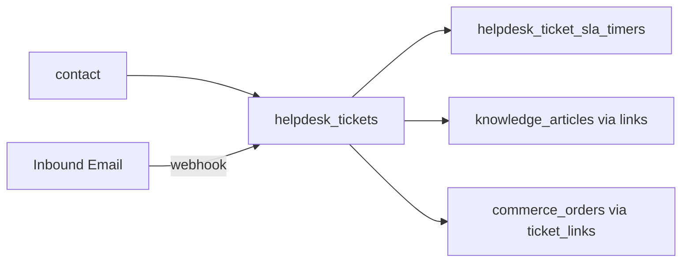

# Architecture — Helpdesk

> **Status:** Draft  
> **Module:** Helpdesk  
> **Phase:** 5 · Step 53  
> **Document Type:** Architecture  
> **Governance:** [MASTER_DATABASE_ARCHITECTURE.md](../../database/MASTER_DATABASE_ARCHITECTURE.md) · [MASTER_MODULE_ARCHITECTURE.md](../../MASTER_MODULE_ARCHITECTURE.md)

---

## Executive Summary

The Helpdesk module provides customer support operations — tickets, SLA policies, team queues, and Knowledge Base article links — under the `helpdesk_*` namespace. Requesters are Core `contacts` (or anonymous portal users mapped to contacts). SLA timers drive escalation and breach notifications without owning article content (Knowledge module).

| Goal | Target |
|------|--------|
| Ticket lifecycle | New → open → pending → resolved → closed |
| SLA compliance | First response and resolution targets |
| Agent productivity | Queues, macros, KB suggestions |
| Omnichannel | Email, portal, chat hooks (future) |

---

## Mission

Enable support teams to track, prioritize, and resolve customer issues with measurable SLA performance while surfacing relevant Knowledge articles and maintaining a complete communication history on each ticket.

---

## Scope & Boundaries

### In Scope

- Ticket creation, assignment, and status workflow
- SLA policies by priority, category, or customer tier
- Support teams and business hours calendars
- Ticket categories, tags, and custom fields
- Links to Knowledge articles and ERP records (orders)
- Canned responses and internal notes

### Out of Scope

- KB article authoring (Knowledge)
- Live chat transport (integration layer)
- CRM pipeline (CRM)
- Product returns processing (Commerce returns)

---

## Key Entities & Tables

> **Prefix:** `helpdesk_*` · Owner: **Helpdesk**

| Table | Purpose | Key Relationships |
|-------|---------|-------------------|
| `helpdesk_teams` | Support groups | → `companies` |
| `helpdesk_team_members` | Agents in team | → `users`, `helpdesk_teams` |
| `helpdesk_business_hours` | SLA calendar | → `companies` |
| `helpdesk_sla_policies` | SLA rule sets | → `helpdesk_teams` |
| `helpdesk_sla_targets` | Response/resolution minutes | → `helpdesk_sla_policies`, priority |
| `helpdesk_ticket_categories` | Classification tree | → `companies` |
| `helpdesk_tickets` | Support ticket | → `contact_id`, `assigned_user_id` |
| `helpdesk_ticket_messages` | Public replies | → `helpdesk_tickets`, `user_id` |
| `helpdesk_ticket_internal_notes` | Agent-only notes | → `helpdesk_tickets` |
| `helpdesk_ticket_sla_timers` | Active SLA clocks | → `helpdesk_tickets`, `helpdesk_sla_targets` |
| `helpdesk_ticket_links` | Related ERP records | polymorphic (`commerce_orders`, etc.) |
| `helpdesk_kb_links` | Suggested/linked articles | → `knowledge_articles` (read FK) |
| `helpdesk_canned_responses` | Template macros | → `helpdesk_teams` |
| `helpdesk_ticket_history` | Field change audit | → `helpdesk_tickets` |

### Indexes

```text
helpdesk_tickets        (company_id, ticket_number) UNIQUE
helpdesk_tickets        (company_id, status, priority, updated_at DESC)
helpdesk_tickets        (contact_id)
helpdesk_ticket_sla_timers (ticket_id, breached_at) WHERE breached_at IS NOT NULL
```

---

## Core Shared Entities (Not Owned by Helpdesk)

| Core Entity | Helpdesk Usage |
|-------------|----------------|
| `contacts` | Customer/requester |
| `users` | Agents, assignees |
| `companies` | Tenant |
| `attachments` | Screenshots, files on messages |
| `tags` / `taggables` | Ticket labels |
| `activities` | Follow-up reminders |
| `notifications` | SLA breach, assignment |

---

## Dependencies

### Core Platform

Workflow Engine, Notification System, Reporting Engine, Search Service, API Layer.

### Sibling Modules

| Module | Relationship |
|--------|--------------|
| **Knowledge** | Article search and `helpdesk_kb_links` |
| **CRM** | Customer context, escalation to account manager |
| **Ecommerce** | Link `commerce_orders` on ticket |
| **Sales** | Link invoices for billing disputes |
| **Documents** | Attach policy documents |
| **AI** | Suggested replies, sentiment (Phase 6) |

---

## Domain Events

| Event | Publisher | Consumers |
|-------|-----------|-----------|
| `helpdesk.ticket.created` | `helpdesk_tickets` | Notifications, SLA start |
| `helpdesk.ticket.assigned` | `helpdesk_tickets` | Notifications |
| `helpdesk.ticket.replied` | `helpdesk_ticket_messages` | Email outbound, SLA pause |
| `helpdesk.sla.breached` | `helpdesk_ticket_sla_timers` | Notifications, Analytics |
| `helpdesk.ticket.resolved` | `helpdesk_tickets` | CSAT survey, Analytics |
| `helpdesk.ticket.closed` | `helpdesk_tickets` | Analytics |

### Subscribed Events

| Event | Source | Helpdesk Action |
|-------|--------|-------------------|
| `commerce.order.shipped` | Orders | Proactive ticket template (optional) |
| `catalog.review.submitted` | Catalog | Negative review → ticket |
| `knowledge.article.published` | Knowledge | Refresh KB suggestions index |

---

## API

| Property | Value |
|----------|-------|
| **Base path** | `/api/v1/helpdesk/` |
| **Permission namespace** | `helpdesk.*` |
| **Portal API** | `/api/v1/helpdesk/portal/` (customer-scoped) |

### Representative Endpoints

| Method | Path | Purpose |
|--------|------|---------|
| GET/POST | `/tickets` | Agent ticket list/create |
| POST | `/tickets/{id}/reply` | Public message |
| POST | `/tickets/{id}/assign` | Assign to agent/team |
| PATCH | `/tickets/{id}/status` | Status transition |
| GET | `/sla/policies` | SLA configuration |
| GET | `/tickets/{id}/kb-suggestions` | Knowledge article matches |
| POST | `/portal/tickets` | Customer self-service create |

---

## Integration Patterns



Inbound email parser creates tickets; outbound uses Core email settings.

---

## Security & Permissions

| Permission | Description |
|------------|-------------|
| `helpdesk.tickets.view` | Team or all tickets |
| `helpdesk.tickets.create` | Create on behalf of customer |
| `helpdesk.tickets.assign` | Reassign tickets |
| `helpdesk.sla.manage` | Configure SLA policies |
| `helpdesk.portal.access` | Customer portal scope |

Portal users see only tickets for their `contact_id`.

---

## Future Integration Notes

| Area | Plan |
|------|------|
| **Live chat** | Real-time channel → ticket conversion |
| **WhatsApp** | Marketing WhatsApp → helpdesk bridge |
| **AI** | Auto-categorize, draft replies, summary |
| **CSAT** | Post-resolution surveys |
| **ITIL** | Problem/change management linkage |

Per [MASTER_DATABASE_ARCHITECTURE](../../database/MASTER_DATABASE_ARCHITECTURE.md): `helpdesk_tickets` → `contacts`.

---

**Module:** Helpdesk  
**Last Updated:** 2026-06-12  
**Author:** —  
**Reviewers:** —
